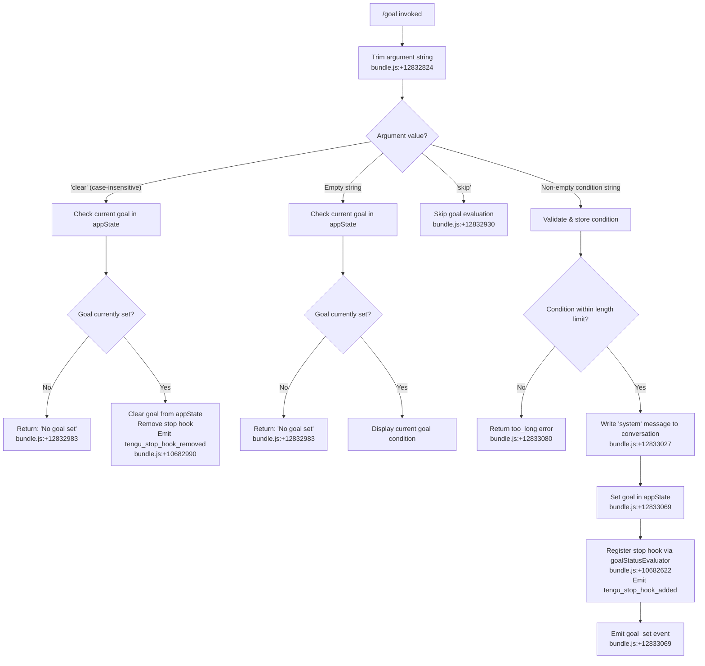

# `/goal`

> Analysis basis: CC v2.1.161 bundle.js (AST extraction + Claude interpretation)
> Minimum version: v2.1.161

---

## Overview

`/goal` sets a persistent goal condition that Claude Code monitors across turns, continuing to work autonomously until the stated condition is satisfied. It operates by injecting a system-level goal message into the conversation state, registering a stop hook that evaluates goal completion after each agent turn, and clearing that hook (along with the goal state) when the condition is met or when `/goal clear` is invoked.

---

## Registration

| Field | Value |
|---|---|
| type | `local-jsx` |
| name | `goal` |
| description | `Set a goal — keep working until the condition is met` |
| argumentHint | `[<condition> \| clear]` |
| immediate | `true` |
| module_id | `Q9K` |
| load_inline | `true` |
| loc_byte | `12834229` |
| loc_byte_end | `12834432` |
| loc_line | `9322` |
| arbor_handler.name | `$Sf` |
| arbor_handler.fqn | `claude-2.1.161::$Sf` |
| arbor_handler.kind | `AsyncFunction` |
| arbor_handler.resolution_path | `module_id` |
| arbor_handler.n_hits | `0` |

Analysis basis: CC v2.1.161 bundle.js:+12834229

---

## Input Branching

The command has four distinct branches driven by the argument string and current application state, requiring a Mermaid flowchart.



---

## Behavioral Spec

### 1. Entry Point — Handler `$Sf` (AsyncFunction)

The Arbor-resolved handler for `/goal` is `$Sf` (resolved via `module_id` → `Q9K`). It is an `AsyncFunction` and serves as the top-level command handler.

```
async function goalCommandHandler(args, context):
    condition = args.trim()                          // bundle.js:+12832824

    if condition.toLowerCase() == "clear":           // bundle.js:+12832930 area
        return clearGoal(context)

    if condition == "skip":                          // bundle.js:+12832930
        return  // no-op for this invocation

    if condition == "":
        currentGoal = context.getAppState("goal")
        if currentGoal is null:
            return displayMessage("No goal set")    // bundle.js:+12832983
        else:
            return displayCurrentGoal(currentGoal)

    // Non-empty, non-clear condition
    result = validateAndSetGoal(condition, context)  // bundle.js:+12832912
    return result
```

Analysis basis: CC v2.1.161 bundle.js:+12832824

---

### 2. Goal Validation and State Writing — `goalSetter` (`G_6`)

When a new condition is provided, the handler delegates to a goal-setter function identified as `G_6`. This function:

1. Reads the current app state to check for an existing goal.
2. Constructs a system-type message containing the goal condition and injects it into the conversation via `applyMessageOp` with an `"append"` operation type.
3. Stores the goal string under the key `"goal"` in app state using `setAppState`.
4. Stores a goal status marker under the key `"goal_status"` in app state.
5. Generates a unique attachment ID using `randomUUID` (`rk1` → `lk1.randomUUID`).
6. Registers a stop hook (see §3).

```
function goalSetter(condition, context):
    existingGoal = context.getAppState("goal")      // bundle.js:+10682735

    // Build system message with condition
    msgId = generateUUID()                          // bundle.js:+10683080
    context.applyMessageOp("append", {
        role: "system",
        type: "attachment",
        content: condition,
        id: msgId
    })                                              // bundle.js:+10682933

    // Persist goal state
    context.setAppState("goal", condition)          // bundle.js:+10682864 area
    context.setAppState("goal_status", ...)         // bundle.js:+10683149

    registerStopHook(context, condition)
```

Analysis basis: CC v2.1.161 bundle.js:+10682864

---

### 3. Stop Hook Registration — `stopHookRegistrar` (`E_6`)

After a goal is set, a stop hook is installed to evaluate whether the goal condition has been met at the end of every agent turn. This is handled by `E_6`, which calls into a hooks gate (`"hooks_gate"`) and a trust gate (`"trust_gate"`) before registering the hook.

```
function registerStopHook(context, goalCondition):
    // Gate checks
    passHooksGate("hooks_gate")                     // bundle.js:+10682132
    passTrustGate("trust_gate")                     // bundle.js:+10682186

    // Record timestamp for hook lifecycle tracking
    hookTimestamp = Date.now()                      // bundle.js:+10682485

    // Register the evaluator as a stop hook
    hookId = stopHookEvaluator(context, goalCondition, hookTimestamp)
    // bundle.js:+10682510 (Yj — outputTokens accounting)

    context.setAppState("goal_status", hookId)      // bundle.js:+10682523
    context.applyMessageOp("append", ...)           // bundle.js:+10682565

    emit("tengu_stop_hook_added")                   // bundle.js:+10682622
```

Analysis basis: CC v2.1.161 bundle.js:+10682510

---

### 4. Stop Hook Evaluation — `goalStatusEvaluator` (`W_6`)

The stop hook evaluator runs after each agent turn. It inspects the agent's stop reason to decide whether goal evaluation should proceed.

```
function goalStatusEvaluator(context, goalCondition):
    stopReason = getStopReason()                    // bundle.js:+10681936
    // Literal "Stop" checked here

    if stopReason indicates agent stopped:
        // Build structured stop-check prompt
        pushGoalCheckMessage(context)               // bundle.js:+10682060
        // Literal "prompt" used as message type

    // Collect results, update display
    buildStopHookDisplay(context)                   // bundle.js:+10682060 area
    // Pads entries to width 40 chars            // bundle.js:+15930336
```

Analysis basis: CC v2.1.161 bundle.js:+10681936

---

### 5. Goal Clearing — via `clearGoal` path in `$Sf`

When the argument is `"clear"` (case-insensitive), the handler checks whether a goal is currently active. If none is active, it returns the literal message `"No goal set"`. If a goal is active, it removes the stop hook, clears both `"goal"` and `"goal_status"` from app state, and emits `tengu_stop_hook_removed`.

```
function clearGoal(context):
    current = context.getAppState("goal")           // bundle.js:+12832912 area
    if current is null or "":
        return uiMessage("No goal set")             // bundle.js:+12832983

    removeStopHook(context)
    context.setAppState("goal", null)
    context.setAppState("goal_status", null)
    emit("tengu_stop_hook_removed")                 // bundle.js:+10682990
```

Analysis basis: CC v2.1.161 bundle.js:+12832983

---

### 6. Bootstrap / API Fetch — `bootstrapFetcher` (`H` → `N`)

The call graph reveals that `$Sf` calls into a bootstrap fetch path (`H` → `N`) that performs an HTTP fetch with headers including `Content-Type: application/json` and `User-Agent`, with a timeout of 5000 ms. This is likely used to validate or synchronize goal state with a remote endpoint before committing the goal locally.

```
function bootstrapFetcher(url, options):
    log("[Bootstrap] Fetching")                     // bundle.js:+15504122
    response = fetch(url, {
        headers: {
            "Content-Type": "application/json",     // bundle.js:+15504207/15504222
            "User-Agent": ...                       // bundle.js:+15504241
        },
        timeout: 5000                               // bundle.js:+15504313
    })
    if parse fails:
        recordEvent("api_bootstrap_fetch", "parse_failed")  // bundle.js:+15504434/15504456
    else:
        log("[Bootstrap] Fetch ok")                 // bundle.js:+15504486
    emit("tengu_feature_ok" | "tengu_feature_sad")  // bundle.js:+966587/966732
```

Analysis basis: CC v2.1.161 bundle.js:+15504122

---

### 7. Conversation Log Write — `conversationLogWriter` (`IBK`)

The call graph includes `IBK`, a file-based conversation log writer used to persist goal-related messages. It handles directory creation, file appending, rotation, and byte-length tracking.

```
function conversationLogWriter(message, logDir):
    targetDir = path.dirname(logDir)                // bundle.js:+204119
    ensureDir(targetDir)                            // bundle.js:+203840 (Ay.mkdir)

    // Rotate if needed
    checkRotation(logDir)                           // bundle.js:+203986 (UJA)

    // Write
    byteLen = Buffer.byteLength(message)            // bundle.js:+204293
    fs.appendFile(logDir, message)                  // bundle.js:+203899

    // Register cleanup hook
    registerCleanupHook()                           // bundle.js:+59405 (tYA.register)

    // Error guard: skip EISDIR
    if error.code == "EISDIR":                      // bundle.js:+174728
        return
```

Analysis basis: CC v2.1.161 bundle.js:+204086

---

## State & Side Effects

| Item | Detail |
|---|---|
| Telemetry: `tengu_stop_hook_added` | Emitted when a new goal stop hook is registered (bundle.js:+10682622) |
| Telemetry: `tengu_stop_hook_removed` | Emitted when a goal is cleared and its stop hook removed (bundle.js:+10682990) |
| Telemetry: `tengu_feature_ok` | Emitted on successful bootstrap/API fetch (bundle.js:+966587) |
| Telemetry: `tengu_feature_sad` | Emitted on failed bootstrap/API fetch (bundle.js:+966732) |
| appState: `"goal"` | Stores the raw condition string when a goal is active; set to null on clear (bundle.js:+10683021) |
| appState: `"goal_status"` | Stores stop hook ID / status tracking value (bundle.js:+10683149) |
| Stop hook registration | `tYA.register` called to add goal evaluator stop hook (bundle.js:+59405) |
| Conversation message inject | System-role `"attachment"` message appended to conversation via `applyMessageOp("append", ...)` (bundle.js:+10682933) |
| File I/O | Conversation log written/appended via `Ay.appendFile`; directory created via `Ay.mkdir`; rotation via `Ay.rename` / `Ay.unlink` (bundle.js:+203899) |
| UUID generation | `lk1.randomUUID()` used to generate attachment message ID (bundle.js:+10683080) |
| Timeout management | `clearTimeout` / `setTimeout` / `setImmediate` used in log batch writer `WmH` (bundle.js:+58819/58983/59076) |
| Gate checks | `"hooks_gate"` and `"trust_gate"` evaluated before stop hook registration (bundle.js:+10682132/10682186) |

---

## Version History

| Version | Change |
|---|---|
| v2.1.161 | Initial analysis |

---

## Common Mistakes

1. **Passing `clear` with extra whitespace**: The argument is trimmed before the `"clear"` check (bundle.js:+12832824), so `"  clear  "` works — but mixing case with extra characters (e.g., `"CLEAR now"`) will not trigger clearing; it will be treated as a new goal condition.
2. **Expecting immediate completion**: `/goal` does not evaluate the condition immediately. The stop hook runs only after each agent turn completes with a `"Stop"` stop reason. The goal persists across turns until the condition is satisfied.
3. **Setting a goal while one is already active**: The handler reads existing app state before writing, but does not enforce a single-goal constraint explicitly at the UI level. A second `/goal <condition>` call will overwrite the existing goal in app state and register an additional stop hook, potentially leaving orphaned hooks.
4. **Using `/goal` with the `skip` literal**: Passing `skip` as the condition argument is a no-op that bypasses goal evaluation for that invocation (bundle.js:+12832930). This is an internal sentinel value, not a user-facing feature.
5. **Overly long condition strings**: Conditions exceeding the internal length limit will be rejected with a `too_long` error (bundle.js:+12833080). Keep conditions concise and unambiguous.

---

## Appendix — Identifier Mapping

> For bundle debugging only. Identifiers change across versions.

| Identifier | Role |
|---|---|
| `$Sf` | Main goal command handler (AsyncFunction, Arbor-resolved via module_id Q9K) |
| `A` | Argument string / general string variable in trim/toLowerCase operations |
| `f` | File descriptor / stream handle in log writer path |
| `q` | Secondary file/queue handle; also used in `unlinkSync` path |
| `L` | Log writer task function; manages add/delete/finally on task set |
| `H` | Bootstrap fetcher / HTTP request orchestrator |
| `N` | Core bootstrap fetch implementation (logs "[Bootstrap] Fetching") |
| `VBK` | Fetch helper: constructs request with headers and retry logic |
| `HwA` | Fetch sub-helper calling `NmK` and `ImK` |
| `SH` | JSON serialization helper (`JSON.stringify` wrapper) |
| `Z4` | Message formatting / token slice helper |
| `CJA` | Maps over `WBK` (likely message parts array) |
| `imH` | Conversation write helper (`GJA` → `H.write`) |
| `GJA` | Low-level write wrapper around file handle |
| `IBK` | Conversation log writer (mkdir, appendFile, rotation, byte-length) |
| `WmH` | Batched log flush scheduler (setTimeout/setImmediate/clearTimeout) |
| `_3H` | Log path builder (joins path components, calls `r8`, `N6`) |
| `F6` | Log file path resolver |
| `d46` | Directory validator / EISDIR guard |
| `BJA` | Path join + N6 helper for log directory |
| `UJA` | Log rotation handler (stat, rename, unlink, .txt suffix check) |
| `NBK` | Full log write cycle (mkdir → append → rotate → byte-length → gJA) |
| `Y9` | Cleanup hook registrar (`tYA.register`) |
| `s$` | App state accessor sub-function |
| `ne` | WA4 set membership checker |
| `Ij` | String replace helper |
| `lq` | Conversation message parser / dispatcher |
| `xHH` | Message parsing orchestrator (NT, o9H, VA, nQ) |
| `NT` | Message type normalizer |
| `o9H` | Message object constructor |
| `nQ` | Message content parser (handles `anthropic.` prefix, role routing) |
| `s9` | Model string resolver (opusplan, sonnet, haiku, opus, best) |
| `x0` | Policy settings reader (`kKH`) |
| `NKH` | Provider inclusion checker (`vKH.includes`) |
| `aN` | Model alias resolver (UM + Vf) |
| `CgH` | Haiku model alias handler |
| `KG` | Model resolution with firstParty/anthropicAws/gateway routing |
| `Xwq` | Best-model selector (delegates to KG) |
| `UM` | Model provider resolver (PA) |
| `Us6` | Provider whitelist checker (`wHL.includes`) |
| `bgH` | pH (provider handler) dispatcher |
| `xP` | Conversation turn processor (s9 + b0) |
| `b0` | Turn execution engine (wA, BHH, RzH, xgH, KG, sX, UM, PA, Vf, aN) |
| `t6` | Feature flag / gate evaluator (`d` + `h1H`) |
| `d` | Core feature flag lookup |
| `h1H` | Feature flag result handler (`Xa8`) |
| `Xa8` | Feature flag value extractor |
| `PN8` | Stop reason checker (`f4f.has`, `H.toLowerCase`) |
| `G_6` | Goal setter: writes system message, sets appState, registers stop hook |
| `N6` | Path utility (wraps `XN`) |
| `XN` | Low-level path normalizer |
| `W_6` | Stop hook evaluator / goal status display builder |
| `ZXH` | Stop hook map setter (`K.set`, `of1`) |
| `K` | Stop hook registry map |
| `of1` | Hook entry mapper (`H.map`) |
| `rk1` | UUID generator wrapper (`lk1.randomUUID`) |
| `E_6` | Stop hook registration orchestrator (gates, timestamp, setAppState, applyMessageOp) |
| `ts_` | Hook chain runner (xU, CY, B_, a7) |
| `xU` | Hook executor (`m8` → xd6 + TQ) |
| `m8` | Hook runner core |
| `CY` | Hook context builder (m8 + VA) |
| `B_` | Hook cleanup handler |
| `a7` | Async hook dispatcher (`yXL`) |
| `yXL` | Hook resolution chain (pH, wmH, W9, y6, zcH, jQ, h6, RY.resolve) |
| `Yj` | Output token accounting helper (`_mH`, `Object.values`) |
| `hH` | Feature event emitter (`d` + `h1H` → tengu_feature_ok/sad) |
| `XN8` | Final cleanup / result return handler |
| `_` | Secondary string / state variable (toLowerCase, toUpperCase, replace, getAppState, setAppState, applyMessageOp) |

---

Note: index built via Arbor fallback; some signals (telemetry, literals) may be missing — see arbor-fallback.js.