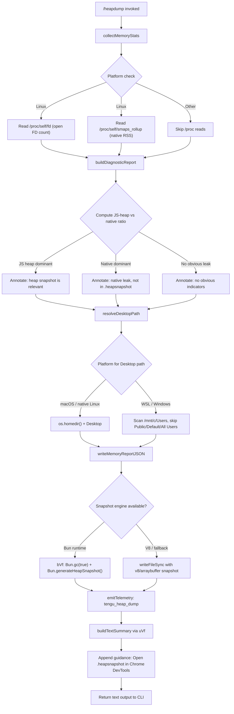

# `/heapdump`

> Analysis basis: CC v2.1.161 bundle.js (AST extraction + Claude interpretation)
> Minimum version: v2.1.161

---

## Overview

`/heapdump` is a hidden diagnostic slash command that captures a JavaScript heap snapshot and a rich memory-statistics report, then writes both artifacts to `~/Desktop`. It is intended for debugging memory leaks and native-addon allocation issues in the Claude Code process and is not surfaced in user-facing help text.

---

## Registration

| Field | Value |
|---|---|
| type | `local` |
| name | `heapdump` |
| description | `Dump the JS heap to ~/Desktop` |
| supportsNonInteractive | `true` |
| isHidden | `true` |
| module_id | `$HK` |
| load_inline | `true` |
| loc_byte | `12460937` |
| loc_byte_end | `12461365` |
| loc_line | `8767` |
| arbor_handler.name | `xVf` |
| arbor_handler.fqn | `claude-2.1.161::xVf` |
| arbor_handler.kind | `AsyncFunction` |
| arbor_handler.resolution_path | `module_id` |
| arbor_handler.n_hits | `0` |

Analysis basis: CC v2.1.161 bundle.js:+12460937

---

## Input Branching

The command follows more than three distinct branches depending on runtime environment, memory ratios, and snapshot engine availability. A Mermaid flowchart is used.



Analysis basis: CC v2.1.161 bundle.js:+12459806, +12458468, +12459007, +12459806, +12459925

---

## Behavioral Spec

### Top-level handler (`xVf`)

```
async function heapdumpHandler(args):
    lines = []
    report = await collectAndWrite(args)
    lines.push(report.summary)
    lines.join("\n")
    textSummary = buildTextSummary(report)
    return { type: "text", content: textSummary }
```

Analysis basis: CC v2.1.161 bundle.js:+12459806, +12459925, +12459952, +12460074, +12459838

---

### Memory statistics collector (`fHK`)

Gathers a comprehensive snapshot of the current process memory state before any files are written.

```
function collectMemoryStats():
    stats = {}
    stats.memoryUsage    = process.memoryUsage()
    stats.heapStats      = v8Module.getHeapStatistics()      // LS8 = v8
    stats.resourceUsage  = process.resourceUsage()
    stats.uptime         = process.uptime()
    stats.heapSpaces     = v8Module.getHeapSpaceStatistics()
    stats.activeHandles  = process._getActiveHandles().length
    stats.activeRequests = process._getActiveRequests().length

    // Linux only: open file descriptor count
    if platform supports /proc:
        fdList = fs.readdir("/proc/self/fd")
        stats.openFDs = fdList.length

    // Linux only: native RSS from smaps
    if platform supports /proc:
        smaps = fs.readFile("/proc/self/smaps_rollup", "utf8")
        stats.nativeRSS = parseSmaps(smaps)

    // JSC / bun:jsc module (Bun runtime)
    jscModule = require("bun:jsc")
    stats.jsc = jscModule  // heap-space detail from JSC

    // Uptime threshold: 3600 seconds (bundle.js:+12456501)
    // MB conversion factor: 1048576 (bundle.js:+12456506)
    stats.uptimeHours = stats.uptime / 3600
    stats.heapUsedMB  = stats.memoryUsage.heapUsed / 1048576

    // Warn if native memory exceeds JS heap
    if stats.nativeRSS > stats.memoryUsage.heapUsed:
        stats.leakHint = "Native memory > heap - leak may be in native addons (node-pty, sharp, etc.)"

    return stats
```

Analysis basis: CC v2.1.161 bundle.js:+12455969, +12455993, +12456019, +12456045, +12456070, +12456112, +12456149, +12456200, +12456262, +12456360, +12456501, +12456506, +12456739

The literal `"Native memory > heap - leak may be in native addons (node-pty, sharp, etc.)"` (bundle.js:+12456739) is the verbatim hint appended when native allocations exceed the JS heap.

---

### Desktop path resolver (`_yA`)

```
function resolveDesktopPath():
    home = os.homedir()                         // da8.homedir
    candidate = path.join(home, "Desktop")      // z5.join + "Desktop" literal (bundle.js:+1017362)

    // WSL detection: scan /mnt/c/Users
    if path starts with "/mnt/c/Users":          // literal (bundle.js:+1017584)
        entries = listDirectory("/mnt/c/Users")
        for entry in entries:
            if entry not in ["Public", "Default", "Default User", "All Users"]:
                candidate = path.join("/mnt/c/Users", entry, "Desktop")
                break

    return candidate
```

Analysis basis: CC v2.1.161 bundle.js:+1017309, +1017316, +1017352, +1017492, +1017584, +1017628, +1017647, +1017667, +1017692

---

### Main orchestrator (`$9A`)

```
async function orchestrate(args):
    // Step 1 — collect stats
    stats = collectMemoryStats()

    // Step 2 — classify memory profile
    diagnosticLines = buildDiagnosticLines(stats)

    // Step 3 — resolve output directory
    desktopPath = resolveDesktopPath()
    timestamp   = generateTimestamp()             // via N (formatter)
    baseName    = path.join(desktopPath, timestamp)  // M9A.join (bundle.js:+12458873)

    // Step 4 — write JSON report
    //   File mode 0o600 (octal 384) (bundle.js:+12458951)
    fs.writeFile(baseName + ".json", JSON.stringify(stats), { mode: 384 })  // Dq6.writeFile

    // Step 5 — write heap snapshot
    writeHeapSnapshot(baseName)                   // bVf

    // Step 6 — emit telemetry
    emit("tengu_heap_dump")                       // d (bundle.js:+12459056/12459058)

    // Step 7 — build summary string
    summary = buildSummaryString(stats, baseName) // S$ / yH

    return summary
```

Analysis basis: CC v2.1.161 bundle.js:+12458468, +12458527, +12458764, +12458873, +12458916, +12459007, +12459056, +12459236, +12459314

---

### Heap snapshot writer (`bVf`)

```
function writeHeapSnapshot(basePath):
    // Bun runtime path
    Bun.gc(true)                                  // force GC before snapshot (bundle.js:+12459563)
    snapshot = Bun.generateHeapSnapshot()         // returns v8/arraybuffer format (bundle.js:+12459506)
    //  Format selector literals: "v8", "arraybuffer" (bundle.js:+12459531, +12459536)
    fs.writeFileSync(basePath + ".heapsnapshot", snapshot)  // LHK.writeFileSync (bundle.js:+12459486)
```

Analysis basis: CC v2.1.161 bundle.js:+12459486, +12459506, +12459531, +12459536, +12459563

---

### Text summary builder (`uVf`)

```
function buildTextSummary(stats):
    lines = []

    // Compute JS-heap vs native ratio
    jsHeapFraction = stats.heapUsed / stats.rss

    if jsHeapFraction >= threshold:              // Math.max comparison (bundle.js:+12460181)
        lines.push("— most memory is JS heap (inspect the .heapsnapshot)")   // bundle.js:+12460249
    else:
        lines.push("— most memory is native (NOT in the .heapsnapshot)")     // bundle.js:+12460309

    if not anyLeakIndicators(stats):
        lines.push("  (no obvious leak indicators)")                         // bundle.js:+12460446

    // Threshold: 1 GB = 1073741824 bytes (bundle.js:+12460855)
    // Precision: values formatted to fixed decimal via P.toFixed (bundle.js:+12456862)

    lines.push("Open the .heapsnapshot in Chrome DevTools → Memory → Load to inspect retainers.")
    //                                                                        bundle.js:+12459962

    // Yq6 formats the final structured output (bundle.js:+12460493)
    return Yq6(lines)
```

Analysis basis: CC v2.1.161 bundle.js:+12459925, +12460181, +12460249, +12460309, +12460446, +12460493, +12460855, +12459962

---

### Diagnostic line builder (inside `fHK` / `$9A`)

```
function buildDiagnosticLines(stats):
    lines = []

    // Platform label
    if platform == "darwin":                      // literal (bundle.js:+12458012)
        lines.push("macos")                       // literal (bundle.js:+12457593)

    // No-leak fallback message
    if not leakDetected(stats):
        lines.push("No obvious leak indicators. Check heap snapshot for retained objects.")
        //                                        bundle.js:+12457858

    // Priority 3 numeric constant used for some leak-severity ranking
    // bundle.js:+12458524

    return lines
```

Analysis basis: CC v2.1.161 bundle.js:+12457593, +12457858, +12458012, +12458524

---

## State & Side Effects

| Item | Detail |
|---|---|
| Telemetry | `tengu_heap_dump` (bundle.js:+12459058); also reachable via call graph: `tengu_daemon_control`, `tengu_daemon_config_reload`, `tengu_bg_dispatch_sigkill_escalate`, `tengu_bg_dispatch_low_mem`, `tengu_bg_spare_enable`, `tengu_bg_spare_claim`, `tengu_bg_spare_claim_fail`, `tengu_bg_proto_mismatch`, `tengu_bg_dispatch_stale_drop`, `tengu_bg_attach_legacy_autorespawn`, `tengu_bg_attach`, `tengu_bg_attach_stall_gave_up`, `tengu_bg_attach_stall_respawn`, `tengu_bg_attach_kick` |
| Files written | `<Desktop>/<timestamp>.json` (memory stats, mode `0o600`) and `<Desktop>/<timestamp>.heapsnapshot` |
| GC side-effect | `Bun.gc(true)` is called before snapshot generation, triggering a synchronous full garbage collection |
| Process introspection | Reads `process._getActiveHandles()` and `process._getActiveRequests()` (internal Node/Bun APIs) |
| Linux /proc reads | Reads `/proc/self/fd` (directory listing) and `/proc/self/smaps_rollup` (UTF-8, bundle.js:+12456212, +12456275) |
| Hook registration | `tYA.register` called via `Y9` (bundle.js:+59405) — likely an exit/cleanup hook |
| appState changes | None directly observed in depth-2 traversal |
| Sound | None observed |
| isHidden | `true` — command is not listed in `/help` output |

---

## Version History

| Version | Change |
|---|---|
| v2.1.161 | Initial analysis |

---

## Common Mistakes

1. **Expecting output on non-Desktop platforms**: The Desktop path resolver requires either a `~/Desktop` directory or a detectable WSL Windows user home. If neither exists, file writing may fail silently or land in an unexpected location.
2. **Running on non-Bun runtimes without V8 snapshot support**: The `bVf` snapshot writer relies on `Bun.generateHeapSnapshot`. On plain Node.js the fallback path (`v8`/`arraybuffer` literals) may produce a different or empty artifact.
3. **Misidentifying the JSON report as the heap snapshot**: Two separate files are written — a `.json` statistics file and a `.heapsnapshot` binary. Only the `.heapsnapshot` can be loaded in Chrome DevTools → Memory.
4. **Interpreting "native > heap" as always indicating a bug**: The diagnostic message `"Native memory > heap - leak may be in native addons"` (bundle.js:+12456739) is a hint, not a definitive diagnosis. Addons like `node-pty` legitimately allocate native memory.
5. **Running in non-interactive scripts expecting structured output**: Although `supportsNonInteractive: true`, the return value is a human-readable text summary, not machine-parseable JSON.

---

## Appendix — Identifier Mapping

> For bundle debugging only. Identifiers change across versions.

| Identifier | Role |
|---|---|
| `xVf` | Top-level async handler for `/heapdump` (arbor_handler) |
| `$9A` | Main orchestrator: collects stats, writes files, emits telemetry |
| `fHK` | Memory statistics collector (process/v8/proc/JSC) |
| `bVf` | Heap snapshot writer (Bun.gc + Bun.generateHeapSnapshot) |
| `uVf` | Text summary builder (JS-heap vs native ratio analysis) |
| `_yA` | Desktop path resolver (homedir + WSL detection) |
| `N6` | Utility: likely async/promise helper (called from multiple sites) |
| `XN` | Callee of N6 (depth-2 utility) |
| `W` | MCP/SDK connection layer (called from fHK) |
| `Y16` | Callee of W (SDK sub-function) |
| `yH` | Connection state handler / error logger |
| `a_` | Error construction utility (wraps Error + String) |
| `X` | Terminal/editor session manager |
| `J` | Session sub-function (write path) |
| `j` | Process kill helper (iterates A.values, y.kill) |
| `H` | Bootstrap fetch handler |
| `z` | Daemon offset/config helper |
| `D` | Supervisor session lifecycle manager |
| `h` | Focus/blur session state handler |
| `w` | Background session dispatcher (spawn, memory checks) |
| `lfA` | Vim/editor operator dispatch table |
| `C` | Task execution queue |
| `P` | Stream/socket protocol handler |
| `e5` | Stream end/close sub-handler |
| `Y95` | PTY/terminal protocol message router |
| `TH` | String coercion utility |
| `N` | Output formatter / message writer |
| `VBK` | Formatter sub-component |
| `HwA` | Formatter helper (NmK/ImK) |
| `SH` | JSON serializer wrapper |
| `Z4` | Path/string manipulation utility |
| `CJA` | Map-based string builder |
| `q` | Sync unlink / file cleanup utility |
| `A` | Case-normalizer (toLowerCase) |
| `imH` | File write helper (GJA path) |
| `GJA` | Raw write wrapper |
| `IBK` | Log/file append manager (mkdir, appendFile, rotation) |
| `WmH` | Batched write scheduler (setTimeout/setImmediate) |
| `_3H` | Log path resolver |
| `F6` | General-purpose async utility (called from multiple sites) |
| `d46` | v8 error-code helper |
| `BJA` | Path join + async helper |
| `UJA` | File stat / rename / unlink helper |
| `NBK` | Log rotation writer (mkdir + appendFile) |
| `Y9` | Exit/cleanup hook registrar (tYA.register) |
| `K` | Column formatter (padEnd) |
| `L` | Promise queue with add/delete/finally |
| `f` | Resource close helper (A.close, q.close) |
| `d` | Telemetry emitter (tengu_heap_dump site) |
| `S$` | Summary string assembler |
| `Yq6` | Final structured output formatter |

---

Note: index built via Arbor fallback; some signals (telemetry, literals) may be missing — see arbor-fallback.js.