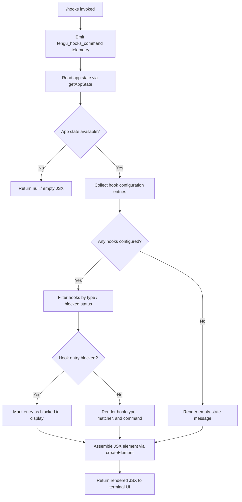

# `/hooks`

> Analysis basis: CC v2.1.161 bundle.js (AST extraction + Claude interpretation)
> Minimum version: v2.1.161

---

## Overview

The `/hooks` command displays the current hook configurations that govern how Claude Code reacts to tool events (e.g., pre-tool execution, post-tool execution). It reads hook state from the application's state store and renders a structured JSX view inline in the terminal session, making it an immediate, non-blocking inspection command.

---

## Registration

| Field | Value |
|---|---|
| type | `local-jsx` |
| name | `hooks` |
| description | `View hook configurations for tool events` |
| immediate | `true` |
| module_id | `ns1` |
| load_inline | `true` |
| loc_byte | `12351386` |
| loc_byte_end | `12351536` |
| loc_line | `8645` |
| arbor_handler.name | `_Zf` |
| arbor_handler.fqn | `claude-2.1.161::_Zf` |
| arbor_handler.kind | `AsyncFunction` |
| arbor_handler.resolution_path | `module_id` |
| arbor_handler.n_hits | `0` |

Analysis basis: CC v2.1.161 bundle.js:+12351386

---

## Input Branching

The command has a linear invocation flow with several internal branches when rendering hook entries (no user input is expected beyond invoking the command). Three or more distinct paths exist inside the render pipeline, so a Mermaid flowchart is used.



Analysis basis: CC v2.1.161 bundle.js:+12351186 (telemetry emission), +12351218 (state read), +12351256 (JSX creation)

---

## Behavioral Spec

### Handler Entry Point (`_Zf`)

The Arbor-resolved handler (`_Zf`) is an `AsyncFunction` reached via `module_id → ns1`. It orchestrates the full lifecycle of the command.

```
async function hooksCommandHandler(context):
    emit telemetry("tengu_hooks_command")          // bundle.js:+12351186
    appState = await getAppState(context)          // bundle.js:+12351218
    if appState is null or undefined:
        return emptyJSX()

    hookConfig = collectHookConfiguration(appState)
    renderedView = buildHooksView(hookConfig)

    return createElement(renderedView)             // bundle.js:+12351256
```

Analysis basis: CC v2.1.161 bundle.js:+12351184, +12351218, +12351226, +12351256

---

### App State Retrieval (`C_` / `getAppState`)

The state reader (`C_`) invokes `H.getAppState` and then uses `A.findLast` to locate the most recently active session configuration among multiple session snapshots.

```
function getRelevantAppState(context):
    rawState = H.getAppState(context)              // bundle.js:+10823513
    // Uses findLast to select the most recent relevant entry
    sessionEntry = rawState.findLast(             // bundle.js:+10823593
        entry => matchesCurrentSession(entry)
    )
    // Inspect known config keys
    keys = [
        "working_directory",   // bundle.js:+10823618
        "allowed_tools",       // bundle.js:+10823673
        "disallowed_tools",    // bundle.js:+10823728
        "avoid_prompts",       // bundle.js:+10823789
        "session",             // bundle.js:+10824088
        "effort",              // bundle.js:+10824113
        "model",               // bundle.js:+10824126
        "max_thinking_tokens", // bundle.js:+10824138
        "flag_settings"        // bundle.js:+10824164
    ]
    return extractFields(sessionEntry, keys)
```

Analysis basis: CC v2.1.161 bundle.js:+10823513, +10823593

---

### Hook Configuration Collection (`$qH` / collectHookConfig)

Filters raw app-state entries, delegates to `dv6` for per-entry parsing, and applies the `"blocked"` label where applicable.

```
function collectHookConfiguration(appState):
    allEntries = appState.filter(isHookEntry)      // bundle.js:+9738087
    parsed = []
    for entry in allEntries:
        result = parseHookEntry(entry)             // dv6, bundle.js:+9738102
        if entry.status == "blocked":              // bundle.js:+9738148
            result.blocked = true
        parsed.append(result)
    return parsed
```

Analysis basis: CC v2.1.161 bundle.js:+9738087, +9738102, +9738148

---

### Hook Entry Parsing (`dv6`)

`dv6` calls two sub-helpers:

- `R5H` — flattens hook definitions using `HN8.flatMap` and `o3` to expand multi-tool matchers. Analysis basis: CC v2.1.161 bundle.js:+10532112, +10532206
- `$s_` — applies permission/source decorations (e.g., `"deny"`, `"cliArg"`, `"toolsNarrowing"`). Analysis basis: CC v2.1.161 bundle.js:+10532449, +10532499, +10532554
- `zI1` — produces the final normalized hook descriptor. Analysis basis: CC v2.1.161 bundle.js:+10532879

```
function parseHookEntry(entry):
    flattened = flattenHookMatchers(entry)     // R5H: bundle.js:+10532838
    decorated = applyPermissions(flattened)    // $s_: bundle.js:+10532855
    return normalizeDescriptor(decorated)      // zI1: bundle.js:+10532879
```

Relevant literals encountered during traversal:

| Literal | Role | loc_byte |
|---|---|---|
| `"deny"` | Permission/filter label | +10532189 |
| `"cliArg"` | Indicates hook source is CLI argument | +10532775 |
| `"toolsNarrowing"` | Indicates narrowing via tool list | +10532796 |

---

### JSX Rendering (`mv` / buildHooksView)

`mv` is the primary JSX assembly function. It composes multiple child components and wires up interactive controls (stop, update-config, start) for daemon-managed hooks.

```
function buildHooksView(hookConfig):
    components = []

    // Render each hook group
    for group in hookConfig:
        header = renderHookHeader(group)       // pH: bundle.js:+9738746
        body   = renderHookBody(group)         // c0: bundle.js:+9738785
        components.append(header, body)

    // Attach daemon control wiring
    daemonControls = wireDaemonControls()      // D.push: bundle.js:+9738857
    // Register keyboard/event handlers
    inputHandlers  = registerInputHandlers()   // Cn_: bundle.js:+9738872
    promptDisplay  = buildPromptDisplay()      // cP:  bundle.js:+9738886

    // Filter blocked entries for display
    blockedView = renderBlockedHooks()         // $qH: bundle.js:+9738908
    // Platform-aware components (windows check: bundle.js:+4883178)
    platformView = renderPlatformSection()     // bn_: bundle.js:+9738923
    extraSection = renderExtraSection()        // X4:  bundle.js:+9738935

    // Push final child list
    childList = assembleFinalChildren(         // z.push: bundle.js:+9738995
        components, daemonControls, inputHandlers,
        promptDisplay, blockedView, platformView, extraSection
    )

    // Inline runner wiring
    runnerSetup = buildRunnerSection()         // rs: bundle.js:+9739095

    // Feature-flag / enable checks
    if featureEnabled(g1):                     // bundle.js:+9739164
        filteredList = childList.filter(...)   // bundle.js:+9739240
    if WiHSet.has(entry):                      // bundle.js:+9739255
        mappedList  = filteredList.map(...)    // bundle.js:+9739283

    return createElement(childList)            // bundle.js:+12351256
```

Analysis basis: CC v2.1.161 bundle.js:+9738746 through +9739381

---

### Daemon Control Integration (`D` / daemonControls)

When hooks are backed by a daemon process, `mv` binds daemon lifecycle methods through the `D` component group. This handles stop/restart cycles when hook configuration changes.

```
function wireDaemonControls():
    // Render hook table header with column widths
    tableHeader = buildHookTable()             // BWH: bundle.js:+15918179
    // Object.keys used to enumerate hook keys: bundle.js:+12786833
    // ENOENT handled during config file read:   bundle.js:+12786532
    // Column widths computed via H9K/Math.max:  bundle.js:+12787590

    // Key event stop handler
    stopHandler = G.stop()                     // bundle.js:+15918472
    // Config reload
    updateConfig = Z.updateConfig()            // bundle.js:+15918601
    restartDaemon = Z.start()                  // bundle.js:+15918619

    // Heartbeat and supervisor labels used internally
    // "supervisor": bundle.js:+15918204
    // "heartbeat":  bundle.js:+15917425

    emit telemetry("tengu_daemon_config_reload") // bundle.js:+15918997
    return daemonControlComponent
```

Analysis basis: CC v2.1.161 bundle.js:+15918179, +15918472, +15918601, +15918619, +15918997

---

### Inline Runner Setup (`rs` / runnerSection)

`rs` composes the runner section that shows which execution backend is active for each hook.

```
function buildRunnerSection():
    promptHelper = buildPromptHelper()     // sP:  bundle.js:+9737459
    writerHelper = buildWriterHelper()     // pw:  bundle.js:+9737568
    // Runner type labels
    // "sdk-ts", "sdk-py", "sdk-cli", "local-agent": bundle.js:+5320698–5320741
    inputHandlerA = wrapInputHandler()     // er7: bundle.js:+9737798
    inputHandlerB = wrapInputHandler()     // Ho7: bundle.js:+9737804

    // Platform-gated rendering
    platformSection = renderPlatformSection()  // bn_: bundle.js:+9737975
    versionDisplay  = renderVersion()          // v21: bundle.js:+9738016
    agentTeamsFlag  = checkAgentTeams()        // gI:  bundle.js:+9738043
    // "--agent-teams" flag string: bundle.js:+5447945
    return runnerSectionComponent
```

Analysis basis: CC v2.1.161 bundle.js:+9737443–9738043

---

### Shutdown / Cleanup (`z` + `qp`)

The command registers a cleanup path via the `z` component group that emits daemon stop events and performs process-level teardown if the daemon cannot be stopped cleanly.

```
function registerCleanup():
    onStop    = emitDaemonStop()           // hH:  bundle.js:+15940444
    // "daemon_stop":        bundle.js:+15940447
    onFail    = emitDaemonStopFailed()     // RH:  bundle.js:+15940467
    // "daemon_stop_failed": bundle.js:+15940484
    onControl = emitDaemonControl()        // ly:  bundle.js:+15940519
    // "firstParty" label:   bundle.js:+15940522

    // Race shutdown with timeout (500 ms: bundle.js:+15935576)
    result = Promise.race([                // qp:  bundle.js:+15935534
        shutdownDaemon(),                  // Gd:  bundle.js:+15935561
        timeout(500),                      // n8:  bundle.js:+15935573
        vd()                               // clearTimeout on success
    ])
    if result == "aborted":               // bundle.js:+2286194
        process.exit()                    // bundle.js:+15935615
```

Analysis basis: CC v2.1.161 bundle.js:+15940444, +15935534, +15935615

---

## State & Side Effects

| Item | Detail |
|---|---|
| Telemetry: `tengu_hooks_command` | Fired immediately on command invocation (bundle.js:+12351186) |
| Telemetry: `tengu_feature_sad` | Fired on a feature-check failure path (bundle.js:+966732) |
| Telemetry: `tengu_feature_ok` | Fired on a feature-check success path (bundle.js:+966587) |
| Telemetry: `tengu_feature_bad` | Fired on a feature-check bad-state path (bundle.js:+966650) |
| Telemetry: `tengu_slate_harbor` | Fired during inline hook-source classification (bundle.js:+4764101) |
| Telemetry: `tengu_daemon_config_reload` | Fired when daemon config is reloaded after a change (bundle.js:+15918997) |
| Telemetry: `tengu_workflows_enabled` | Fired when the workflows feature flag is active (bundle.js:+4157173) |
| Telemetry: `tengu_cobalt_ridge` | Fired during platform-specific hook render path (bundle.js:+4883272) |
| Telemetry: `tengu_daemon_control` | Fired when daemon control event is emitted (bundle.js:+15940522) |
| Telemetry: `tengu_amber_flint` | Fired in the agent-teams / runner detection path (bundle.js:+5448057) |
| appState read | `H.getAppState` is called read-only; no write to global state |
| Daemon control | May issue `Z.stop()`, `Z.updateConfig()`, `Z.start()` if hooks are daemon-backed |
| JSX render | Produces an immediate inline terminal view; does not open a sub-shell |
| Process exit | `process.exit()` is reachable only if daemon shutdown times out (500 ms) |

---

## Version History

| Version | Change |
|---|---|
| v2.1.161 | Initial analysis |

---

## Common Mistakes

1. **Expecting interactive editing**: `/hooks` is a read-only viewer. It does not provide a UI for creating or editing hook entries; use the project or user settings files for that.
2. **Assuming synchronous output**: The handler is an `AsyncFunction` (`_Zf`). In environments with slow state stores, the view may render after a short delay.
3. **Confusing immediate flag with instant daemon feedback**: The `immediate: true` registration flag means the command bypasses the normal agent turn, but daemon-backed hooks may still require a reload cycle (`Z.stop` → `Z.updateConfig` → `Z.start`) before changes are reflected.
4. **Ignoring blocked hooks**: Hooks marked `"blocked"` (bundle.js:+9738148) appear in the output but are inert; do not mistake them for active configurations.
5. **Expecting the command on non-supported platforms**: The `windows` platform check (bundle.js:+4883178) gates some hook types; on Windows certain hook categories may not appear in the output.

---

## Appendix — Identifier Mapping

> For bundle debugging only. Identifiers change across versions.

| Identifier | Role |
|---|---|
| `_Zf` | Main command handler (AsyncFunction, Arbor-resolved) |
| `C_` | App-state reader / session selector |
| `N` | Hook-entry normalizer / debug-mode router |
| `VBK` | Hook field extractor sub-helper |
| `SH` | JSON serializer helper |
| `Z4` | String path/slice utility |
| `imH` | Additional hook field transformer |
| `IBK` | File-based hook config loader |
| `s$` | Session state sub-reader |
| `ne` | Set-membership check helper |
| `Ij` | String replacement utility |
| `lq` | Model-name normalization dispatcher |
| `xHH` | Model-name tokenizer |
| `s9` | Model-name parser and classifier |
| `xP` | Model-name parse entry point |
| `t6` | Feature flag check dispatcher |
| `h1H` | Feature flag resolver |
| `BN8` | State field extractor A |
| `FN8` | State field extractor B |
| `tA` | Field extraction shared helper |
| `mv` | JSX view builder (main render function) |
| `pH` | UI primitive: text/label renderer |
| `c0` | UI primitive: section container |
| `QQ` | UI primitive: inner container variant |
| `v1` | UI string coercion helper |
| `j6` | Deduplication / caching layer for rendered items |
| `gY6` | Cache key generator A |
| `QY6` | Cache key generator B |
| `Qx` | Cached render helper |
| `Lq8` | LRU-style cache manager |
| `y6` | Timestamp-aware cache entry builder |
| `D` | Daemon control component group |
| `BWH` | Hook table header builder |
| `$1` | AsyncLocalStorage store reader |
| `v8` | Table cell renderer |
| `MKA` | Table formatting helper |
| `TH` | String coercion for table cells |
| `K` | Column layout helper |
| `H9K` | Column-width calculator |
| `G` | Key-event stop handler |
| `b` | Event object (preventDefault source) |
| `m0` | User-settings accessor |
| `Z` | Daemon lifecycle controller (stop/updateConfig/start) |
| `USK` | Heartbeat setup helper |
| `h6H` | Heartbeat interval creator |
| `V` | Secondary daemon lifecycle controller |
| `Cn_` | Input handler registration helper |
| `v_` | Module export setup utility |
| `rb6` | Bound callback factory |
| `cP` | Prompt display component |
| `fL8` | Prompt primitive builder |
| `ZT` | Prompt text formatter |
| `y19` | Prompt feature-flag conditional |
| `G9` | Allow-product-feedback / workflows check |
| `a0_` | Prompt sub-section builder |
| `SbL` | Prompt section with hook source |
| `hbL` | Prompt formatter variant |
| `$qH` | Blocked/filtered hook collector |
| `dv6` | Per-entry hook parser dispatcher |
| `R5H` | Hook matcher flattener (flatMap) |
| `$s_` | Hook permission decorator |
| `zI1` | Hook descriptor normalizer |
| `bn_` | Platform-aware hook section renderer |
| `GC` | Platform section builder |
| `X4` | Extra/additional section builder |
| `z` | Cleanup / shutdown registration group |
| `hH` | Daemon-stop success emitter |
| `RH` | Daemon-stop failure emitter |
| `ly` | Daemon-control event emitter |
| `gx` | Event emitter core |
| `sVH` | First-party event classifier |
| `rw_` | UUID-tagged event dispatcher |
| `qp` | Shutdown race coordinator |
| `Gd` | Daemon shutdown initiator |
| `vd` | Timeout-clear helper |
| `n8` | Timeout-with-abort wrapper |
| `rs` | Runner section builder |
| `sP` | Prompt helper for runner |
| `pw` | Writer helper for runner |
| `A86` | Runner version display |
| `F9` | Agent-teams feature section builder |
| `QH7` | Agent-teams label formatter |
| `er7` | Input handler wrapper A |
| `Ho7` | Input handler wrapper B |
| `gI` | Agent-teams / tool-search checker |
| `ur_` | Tool-search eligibility resolver |
| `PA` | Cloud-provider classifier |
| `l7` | Tool-search disabled warning renderer |
| `v4` | Feature-check boolean |
| `O` | Secondary feature-flag checker |
| `u8` | Background-session label |
| `$` | Daemon status file reader |
| `y_K` | Daemon status JSON parser |
| `Zr` | Status timestamp formatter |
| `Fh6` | Daemon status file path builder |

---

Note: index built via Arbor fallback; some signals (telemetry, literals) may be missing — see arbor-fallback.js.