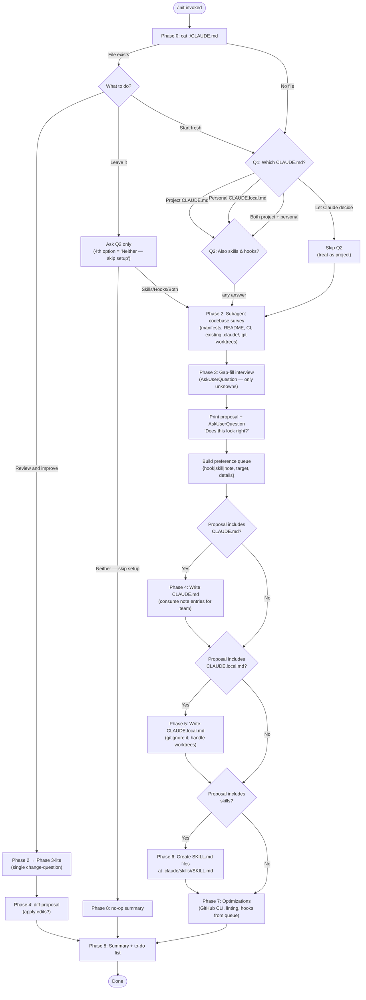

# `/init`

> Analysis basis: CC v2.1.161 bundle.js (AST extraction + Claude interpretation)
> Minimum version: v2.1.161

---

## Overview

`/init` bootstraps a repository's Claude Code configuration by guiding the user through an interactive, multi-phase workflow: it checks for an existing `CLAUDE.md`, asks what to create, explores the codebase via a subagent, fills in gaps with targeted questions, and then writes `CLAUDE.md`, `CLAUDE.local.md`, skills, and/or hooks as approved. The command is implemented as a `prompt`-type registration whose entire logic is encoded in a 22,449-character agent prompt delivered via `getPromptForCommand`. On completion it fires the `onboarding_project_complete` telemetry event.

---

## Registration

| Field | Value |
|---|---|
| type | `prompt` |
| name | `init` |
| description | `Initialize new CLAUDE.md file(s) and optional skills/hooks with codebase documentation \| Initialize a new CLAUDE.md file with codebase documentation` |
| loc_byte | `11479218` |
| loc_byte_end | `11479611` |
| loc_line | `7632` |
| handler_method | `getPromptForCommand` |
| handler_method_start | `11479534` |
| handler_method_end | `11479610` |
| prompt_body.length | `22449` characters |
| prompt_body.trace | `conditional; identifier→RDf (var template, 20850 chars); identifier→SDf (var template, 1592 chars)` |
| arbor_handler.name | `getPromptForCommand` |
| arbor_handler.fqn | `claude-2.1.161::getPromptForCommand` |
| arbor_handler.kind | `Method` |
| arbor_handler.resolution_path | `direct` |
| arbor_handler.n_hits | `2` |

Analysis basis: CC v2.1.161 bundle.js:+11479218

The registration block spans bytes `(11479218, 11479611)`. The `handler_method` field (`getPromptForCommand`) means the handler lives as an inline `ObjectMethod` on the registration object itself; `callGraph` starts at the synthetic BFS entry `__handler_init`, but the real handler is `getPromptForCommand` per Arbor's direct resolution. The prompt body is **conditional**: the primary template (≈20,850 chars, variable `RDf`) is the full interactive eight-phase workflow, while the shorter alternate template (≈1,592 chars, variable `SDf`) is the legacy simple instruction appended at the bottom (the "Please analyze this codebase and create a CLAUDE.md…" section).

---

## Input Branching

The command has more than three distinct branching paths (Phase 0 alone produces three routes, and each subsequent phase branches further), so a Mermaid flowchart is used.



Analysis basis: CC v2.1.161 bundle.js:+11479218

---

## Behavioral Spec

The `getPromptForCommand` method (Arbor: `claude-2.1.161::getPromptForCommand`, direct resolution) injects a structured agent prompt into the session. The prompt's conditional dispatch selects between two template variables at runtime: the full eight-phase workflow (primary, ~20,850 chars) and the legacy concise instruction (~1,592 chars). Both are concatenated and sent as a single `text`-type message.

Analysis basis: CC v2.1.161 bundle.js:+11479534 (handler start), +11479582 (text type literal), +11479594 (secondary template reference)

---

### Phase 0 — Existence Check

```
function checkExistingClaudeMd():
    read "./CLAUDE.md" using cat (project root only)
    // only root file counts; no directory traversal yet
    return fileExists: boolean
```

Analysis basis: CC v2.1.161 bundle.js:+4001671 (`"CLAUDE.md"` literal), +4001846 (`"Run /init to create a CLAUDE.md file..."` literal)

---

### Phase 1 — User Intent Collection

```
function collectIntent(fileExists: boolean):
    print primer text explaining CLAUDE.md, Skills, and Hooks

    if fileExists:
        answer = AskUserQuestion("I found an existing CLAUDE.md. What would you like to do?",
                                  options=["Review and improve it",
                                           "Leave it, set up other things",
                                           "Start fresh (replace it)"])
        route answer:
            "Review and improve it" → return route=IMPROVE  // skips Q1/Q2
            "Leave it, ..."         → return route=LEAVE    // skips Q1, asks Q2
            "Start fresh ..."       → fileExists = false    // falls through to Q1

    // Q1 (no existing file, or "Start fresh")
    q1 = AskUserQuestion("Which CLAUDE.md files should /init set up?",
                          options=["Project CLAUDE.md",
                                   "Personal CLAUDE.local.md",
                                   "Both project + personal",
                                   "Let Claude decide"])
    if q1 == "Let Claude decide":
        return route=NEW, scope=PROJECT, skipQ2=true

    // Q2 (separate call — never combined with Q1)
    q2 = AskUserQuestion("Also set up skills and hooks?",
                          options=["Skills + hooks", "Skills only",
                                   "Hooks only", "Neither, just CLAUDE.md"])
    // Q2 is a hint, not a filter
    return route=NEW, scope=q1, artifact_hint=q2
```

> Key constraint: Q1 and Q2 must be separate `AskUserQuestion` calls; they must never be combined in a single invocation.

Analysis basis: CC v2.1.161 bundle.js:+11479218 (prompt body start)

---

### Phase 2 — Codebase Survey (Subagent)

```
function surveyCodebase():
    // Launch subagent to read:
    manifestFiles = ["package.json", "Cargo.toml", "pyproject.toml",
                     "go.mod", "pom.xml", ...]
    otherFiles    = ["README", "Makefile", "CI config",
                     "existing CLAUDE.md", ".claude/rules/", "AGENTS.md",
                     ".cursor/rules", ".cursorrules",
                     ".github/copilot-instructions.md",
                     ".windsurfrules", ".clinerules", ".mcp.json"]

    detect:
        buildTestLintCommands   // especially non-standard ones
        languagesFrameworks
        projectStructure        // monorepo | multi-module | single
        codeStyleDifferences    // only where they differ from language defaults
        envVarsAndGotchas
        existingSkillsRules     // .claude/skills/, .claude/rules/
        formatterConfig         // prettier, biome, ruff, black, gofmt, rustfmt, ...
        gitWorktrees            // run: git worktree list

    unknowns = items that cannot be inferred from code alone
    return surveyResult, unknowns
```

Analysis basis: CC v2.1.161 bundle.js:+11479218

---

### Phase 3 — Gap-Fill Interview and Proposal

```
function fillGapsAndPropose(route, scope, surveyResult, unknowns):
    // Interview
    if route == IMPROVE:
        ask one question: "Has anything changed since CLAUDE.md was written?"
    else:
        if scope includes PROJECT or "Let Claude decide":
            ask about non-obvious codebase practices (only unknowns)
        if scope includes PERSONAL:
            ask about user role, familiarity, sandbox URLs, worktree topology,
            communication preferences

    // Classify each finding into artifact type
    for each finding in surveyResult + gapAnswers:
        if deterministic fast per-edit shell command:
            classify as HOOK
        elif on-demand multi-step workflow:
            classify as SKILL
        else:
            classify as CLAUDE_MD_NOTE

    // Build proposal list
    proposal = []
    if route != LEAVE:
        proposal += file bullets (CLAUDE.md and/or CLAUDE.local.md per scope)
    proposal += [skills, hooks, notes as appropriate]

    if q2Hint given and proposal deviates from hint:
        prepend one-line deviation notice to proposal

    // Print proposal as normal assistant text (not in preview field)
    print formatted bullet list of proposal

    // Single confirmation question
    confirmation = AskUserQuestion("Does this look right?",
                                    options=["Looks good — proceed",
                                             "Drop the hook", "Drop the skill", ...])
    // "Other" option auto-added by the tool

    queue = buildPreferenceQueue(accepted proposal)
    // Each entry: {type, description, targetFile, phase2Details}
    return queue
```

Analysis basis: CC v2.1.161 bundle.js:+11479218

---

### Phase 4 — Write CLAUDE.md

```
function writeClaudeMd(route, queue, surveyResult, gapAnswers):
    if route == IMPROVE:
        existingContent = readFile("./CLAUDE.md")
        diffs = compareAgainst(existingContent, surveyResult, gapAnswers)
        printDiffsWithReasons(diffs)
        answer = AskUserQuestion("Apply these edits?",
                                  options=["Apply all", "Let me pick which",
                                           "Skip — leave it as is"])
        if answer != "Skip":
            applySelectedDiffs("./CLAUDE.md")
        return

    // Fresh write
    content = buildContent():
        // Mandatory prefix:
        // "# CLAUDE.md\n\nThis file provides guidance to Claude Code..."
        prefix = MANDATORY_FILE_HEADER
        include buildTestLintCommands  // only non-standard ones
        include codeStyleDifferences   // only where different from defaults
        include testingQuirks
        include repoEtiquette
        include requiredEnvVars
        include gotchasAndArchDecisions
        include importantAiToolConfigParts  // from AGENTS.md, .cursorrules, etc.

        // Consume team-level note entries from queue
        for note in queue where note.target == "CLAUDE.md":
            insert note as concise line in most-relevant section

        // Exclusions enforced:
        exclude fileByFileStructure
        exclude standardLanguageConventions
        exclude genericAdvice
        exclude longReferences  // use @path/to/import instead
        exclude frequentlyChangingInfo  // use @path/to/import
        exclude commandsObviousFromManifests

    writeFile("./CLAUDE.md", content)

    // Multi-module / monorepo hints
    if multipleSubdirectories:
        mention .claude/rules/ for multi-concern projects
        offer to create subdirectory CLAUDE.md files
```

Analysis basis: CC v2.1.161 bundle.js:+11479218

---

### Phase 5 — Write CLAUDE.local.md

```
function writeClaudeLocalMd(queue, surveyResult, gapAnswers):
    if fileExists("./CLAUDE.local.md"):
        existingContent = readFile("./CLAUDE.local.md")
        proposeAdditionsOnly(existingContent)  // no silent overwrite
        return

    if worktreesAreExternal:
        // sibling/external worktrees: home-directory pattern
        writeFile("~/.claude/<project-name>-instructions.md", personalContent)
        stub = "@~/.claude/<project-name>-instructions.md"
        writeFile("./CLAUDE.local.md", stub)
        // NOTE: stub must NOT go in project CLAUDE.md
    else:
        content = buildPersonalContent(gapAnswers, queue):
            // Consume personal-targeted note entries from queue
            for note in queue where note.target == "CLAUDE.local.md":
                insert note as concise line
            include userRole, familiarity, sandboxUrls, commPreferences
        writeFile("./CLAUDE.local.md", content)

    addToGitignore("CLAUDE.local.md")
```

Analysis basis: CC v2.1.161 bundle.js:+11479218

---

### Phase 6 — Create Skills

```
function createSkills(queue, surveyResult):
    // First: consume skill entries from preference queue
    for skill in queue where skill.type == SKILL:
        if skill.maps_to_bundled_skill:
            note bundled skill still exists; new file is additive
        if skill.underspecified:
            ask follow-up question to clarify
        content = buildSkillMd(skill, surveyResult)
        path = ".claude/skills/" + skill.name + "/SKILL.md"
        if not fileExists(path):
            writeFile(path, content)

    // Then: suggest additional skills found via codebase analysis
    for each repeatable workflow or reference knowledge domain found:
        suggest { name, purpose, reason } to user

    // SKILL.md format:
    // ---
    // name: <name>
    // description: <description>
    // [disable-model-invocation: true]  // for side-effect workflows
    // ---
    // <Instructions for Claude>
    // $ARGUMENTS placeholder for parameterized skills
```

Analysis basis: CC v2.1.161 bundle.js:+11479218

---

### Phase 7 — Environment Optimizations and Hook Creation

```
function suggestOptimizations(queue, surveyResult, phase1Scope):
    // GitHub CLI check
    ghPresent = runShell("which gh")  // or "where gh" on Windows
    if not ghPresent and remoteContains("github.com"):
        ask user if they want to install gh CLI (with explanation)

    // Linting check
    if surveyResult.noLintConfig:
        ask user if they want linting set up (with explanation)

    // Hooks from preference queue
    hookEntries = queue where type == HOOK
    if surveyResult.formatterFound and no formatting hook in hookEntries:
        offer format-on-edit as fallback hook

    // Determine target settings file (ask once, not per hook)
    if phase1Scope == "both" or preference is ambiguous:
        ask user: project (.claude/settings.json) or personal (.claude/settings.local.json)?
    else if phase1Scope == PROJECT or LEAVE:
        targetFile = ".claude/settings.json"
    else:
        targetFile = ".claude/settings.local.json"

    // For each hook:
    for hook in hookEntries (+ formatter fallback if applicable):
        event, matcher = mapPreferenceToEvent(hook.description):
            "after every edit"        → PostToolUse / Write|Edit
            "when Claude finishes"    → Stop
            "before running bash"     → PreToolUse / Bash
            "before committing" (literal git gate) →
                // NOT a hooks.json hook — route to git pre-commit
                offerToWriteGitPreCommitHook()
                // If user means "before I review", that is Stop — probe
            ambiguous → AskUserQuestion to disambiguate

        // Load hook reference skill once per /init run
        if firstHook:
            invokeSkillTool("update-config",
                             "[hooks-only] " + oneLineSummary)

        // Follow "Constructing a Hook" flow:
        dedupCheck()
        constructHookForProject()
        pipeTestRaw()
        wrapHook()
        writeJson(targetFile)
        validateWithJq()
        if event in [PreToolUse, PostToolUse] and matcherIsTriggerable:
            liveProof()
        cleanup()
        handoff()

    actOnEachYesBeforeMovingOn()
```

Analysis basis: CC v2.1.161 bundle.js:+11479218

---

### Phase 8 — Summary and Next Steps

```
function summarizeAndSuggestNextSteps(surveyResult, writtenArtifacts):
    // Recap all files written and key points in each
    printSummary(writtenArtifacts)
    remind: "These files are a starting point — run /init again anytime to re-scan."

    // Build to-do list (most impactful first, only relevant items)
    todoList = []
    if frontendDetected:
        todoList += "/plugin install frontend-design@claude-plugins-official"
        todoList += "/plugin install playwright@claude-plugins-official"
    if phase7GhMissing and userDeclinedGh:
        todoList += "Install GitHub CLI"
    if phase7LintMissing and userDeclinedLint:
        todoList += "Set up linting"
    if testsMissingOrSparse:
        todoList += "Set up a test framework"
    // Always include:
    todoList += "/plugin install skill-creator@claude-plugins-official"
    todoList += "Browse official plugins with /plugin"

    printFormattedTodoList(todoList)
```

Analysis basis: CC v2.1.161 bundle.js:+4002183 (`"onboarding_project_complete"` telemetry fired after this phase)

---

### Handler Dispatch and Telemetry Firing

```
function handlerInit(context):
    // getPromptForCommand constructs the prompt
    prompt = getPromptForCommand(context)        // loc_byte 11479540
    // KnH fires onboarding_project_complete after execution
    onCompletion = configSaveHandler(context)    // KnH, loc_byte 11479569
    // hDf constructs the response envelope (type: "text")
    response = buildTextResponse(prompt)         // hDf, loc_byte 11479594
    return response
```

The `onboarding_project_complete` event (literal at bundle.js:+4002183) is emitted via the call chain `KnH` → `Kq9` → `pW_`, which also reads the `CLAUDE.md` file name constant (bundle.js:+4001671), checks the `workspace` context (bundle.js:+4001709), and processes the `claudemd` token (bundle.js:+4001830).

Analysis basis: CC v2.1.161 bundle.js:+11479540, +11479569, +11479594, +4002183

---

### Config Persistence Layer

The call chain `KnH` → `LD` → `Pj_` / `nDH` handles reading and writing persistent configuration. Key behaviors observed in that chain:

- **Lock contention warning** (100 ms threshold): if lock acquisition exceeds 100 ms, logs "Lock acquisition took longer than expected - another Claude instance may be running" (bundle.js:+3249202, +3249208).
- **Stale-write guard** (GH #3117): refuses to write `~/.claude.json` if a re-read after lock acquisition is missing auth that the in-memory cache has — logs `"saveConfigWithLock: re-read config is missing auth…"` (bundle.js:+3249624). The same guard exists for project config (`"saveCurrentProjectConfig fallback: …"`, bundle.js:+3253242).
- **Backup rotation**: keeps up to 5 backups (bundle.js:+3250227) in a `backups/` subdirectory (bundle.js:+3250809), named with `.backup.` infix (bundle.js:+3250094).
- **Lock timeout**: 60,000 ms (bundle.js:+3249978).
- **Parse error telemetry**: fires `tengu_config_parse_error` (bundle.js:+3251872) when config JSON cannot be parsed; also uses `"ENOENT"` (bundle.js:+3251471) for missing-file handling and `"EEXIST"` (bundle.js:+3252086) for directory creation.
- **UTF-8 encoding** enforced on all config file reads (bundle.js:+3251324).

Analysis basis: CC v2.1.161 bundle.js:+3249202, +3249624, +3249978, +3250227, +3251872

---

## State & Side Effects

| Item | Detail |
|---|---|
| Telemetry — `tengu_config_parse_error` | Fired when config JSON is unparseable during the config read/write cycle (bundle.js:+3251872) |
| Telemetry — `tengu_config_lock_contention` | Fired when config lock acquisition is delayed (bundle.js:+3249297) |
| Telemetry — `tengu_config_stale_write` | Fired when a stale-write is detected and the write is blocked (bundle.js:+3249433) |
| Telemetry — `tengu_config_auth_loss_prevented` | Fired when auth would have been wiped by a config overwrite (bundle.js:+3249776) |
| Telemetry — `tengu_feature_sad` | Fired on feature-flag failure path (bundle.js:+966732) |
| Telemetry — `tengu_feature_ok` | Fired on feature-flag success path (bundle.js:+966587) |
| Telemetry — `tengu_slate_harbor_experiment` | Fired during command dispatch, likely for A/B experiment tracking (bundle.js:+11456179) |
| Completion event | `onboarding_project_complete` emitted via `KnH` call chain after the agent finishes (bundle.js:+4002183) |
| Files written | `./CLAUDE.md`, `./CLAUDE.local.md`, `.claude/skills/<name>/SKILL.md`, `.claude/settings.json` or `.claude/settings.local.json` (hooks) — all conditional on user approval |
| `.gitignore` modification | `CLAUDE.local.md` is appended to the project's `.gitignore` when Phase 5 writes it |
| Config backup rotation | Up to 5 backups retained in `backups/` subdirectory; lock timeout 60,000 ms (bundle.js:+3249978, +3250227) |
| File watcher | `bXL` registers a `Pq8.watchFile` listener and later calls `Pq8.unwatchFile` during the config read cycle (bundle.js:+3247626, +3247959) |
| Subagent launch | Phase 2 launches a subagent for codebase survey; this is a side effect that may incur API calls |
| Hook validation | Phase 7 invokes `jq -e` to validate hook JSON and optionally performs a live-proof tool invocation |

---

## Version History

| Version | Change |
|---|---|
| v2.1.161 | Initial analysis |

---

## Common Mistakes

1. **Combining Q1 and Q2 in a single `AskUserQuestion` call.** The prompt explicitly forbids this — Q2 must only be asked after Q1's answer is seen, because "Let Claude decide" skips Q2 entirely.
2. **Exploring the directory tree before checking for an existing `CLAUDE.md`.** Phase 0 requires only `cat ./CLAUDE.md`; the subagent survey comes in Phase 2.
3. **Including a worktree stub import in the shared project `CLAUDE.md`.** The `@~/.claude/<project-name>-instructions.md` stub belongs only in `CLAUDE.local.md`.
4. **Silently overwriting an existing `CLAUDE.local.md`.** The spec requires reading the existing file and proposing additions only.
5. **Treating Q2 as a hard filter.** Q2 is described as a hint — if nothing hook-shaped exists but the user asked for hooks, the proposal should say so and propose better-fitting artifacts.
6. **Invoking the `update-config` skill more than once per `/init` run.** The hook reference skill must be loaded only once; subsequent hooks in the same run reuse the already-loaded context.
7. **Routing "before committing" to a `hooks.json` hook.** The matchers cannot filter Bash by command content; a literal `git commit` gate must use a git pre-commit hook instead.
8. **Including generic development advice or file-by-file structure in `CLAUDE.md`.** The test is "Would removing this cause Claude to make mistakes?" — if no, the line must be cut.

---

## Appendix — Identifier Mapping

> For bundle debugging only. Identifiers change across versions.

| Identifier | Role |
|---|---|
| `__handler_init` | Synthetic BFS entry for `/init` handler dispatch (not a real bundle symbol) |
| `KnH` | Post-execution coordinator: fires `onboarding_project_complete`, orchestrates config save and subagent setup (bundle.js:+11479569) |
| `cO` | Config object / file-watch coordinator, calls `zcH` and `y6` (bundle.js:+4002078) |
| `y6` | Config read/load dispatcher, branches into `nDH` file reader and `bXL` watcher (bundle.js:+3252826) |
| `F6` | Logging / error-reporting utility (appears throughout call graph) |
| `Dj_` | Dependency or module resolver utility |
| `nDH` | Config file reader: handles UTF-8 read, ENOENT, backup creation, directory init (bundle.js:+3251235–3252380) |
| `bXL` | File watcher registration/deregistration wrapper around `Pq8.watchFile` / `Pq8.unwatchFile` (bundle.js:+3247621) |
| `Kq9` | Completion-event emitter, calls `pW_` to finalize onboarding state (bundle.js:+4001981) |
| `pW_` | Onboarding state finalizer: reads `CLAUDE.md` name constant, checks workspace context (bundle.js:+4001641) |
| `h6` | Plugin/module loader pair dispatcher, calls `sg6` and `P_` (bundle.js:+976871) |
| `PQ6` | Feature flag or capability query, calls `k8` (bundle.js:+1012937) |
| `LD` | Project config writer: orchestrates lock, stale-write guard, and backup rotation (bundle.js:+3252986) |
| `Pj_` | Core config-save-with-lock function: lock acquisition, re-read, auth-loss guard, backup management (bundle.js:+3248997) |
| `_` | General utility / string helper (multiple call sites) |
| `L` | Async task queue manager: `q.add`, `q.delete`, `f.finally` (bundle.js:+15909570) |
| `qjq` | Config object merger using `Object.assign` with `Y7_` base (bundle.js:+2271765) |
| `N` | Log/debug output function (bundle.js:+204597, level `"debug"` literal at +204573) |
| `d` | Timer or debounce utility (bundle.js:+966585) |
| `v8` | Error-type classifier or version check |
| `iY6` | Auth presence validator (called in stale-write guard paths) |
| `A` | String normalizer: calls `f.toLowerCase` (bundle.js:+15930262) |
| `SH` | JSON serializer wrapper around `JSON.stringify` (bundle.js:+184155) |
| `Xj_` | Backup path builder: joins `backups/` subdirectory via `RY.join` (bundle.js:+3250796) |
| `V` | Path-string with `startsWith` check (directory prefix validation) |
| `X` | Editor/input widget component (INSERT/NORMAL modes, NFC normalization) |
| `Z` | Array or string slice target in backup rotation |
| `Y56` | Atomic file writer: uses temp file + `fchmodSync` + `fsyncSync` + `renameSync` for safe writes (bundle.js:+1013028) |
| `f` | Connection / stream closer: `A.close`, `q.close`, delegates to `L` |
| `H` | HTTP/network fetch wrapper (bootstrap fetch, `Content-Type: application/json`) |
| `s$` | Session or state cache getter |
| `ne` | Feature-flag set membership check via `WA4.has` (bundle.js:+840982) |
| `Ij` | String replace utility (bundle.js:+2237690) |
| `lq` | Config/locale formatter calling `xHH`, `s9`, `xP` (bundle.js:+2232138) |
| `t6` | Timer utility calling `d` and `h1H` (bundle.js:+966730) |
| `McH` | Miscellaneous config-save helper (bundle.js:+3253085) |
| `$cH` | Timestamp recorder via `Date.now` (bundle.js:+3248023) |
| `Jj_` | File write helper: `RY.dirname`, `v0`, `SH`, delegates to `Y56` (bundle.js:+3248839) |
| `hH` | Feature-flag dispatcher: calls `d` and `h1H` (bundle.js:+966585) |
| `h1H` | Feature-flag resolution core, calls `Xa8` (bundle.js:+966417) |
| `Xa8` | Feature-flag store or remote-config accessor |
| `hDf` | Response envelope builder: wraps prompt as `{type: "text", ...}` (bundle.js:+11456138) |
| `pH` | String coercion utility (bundle.js:+26899) |
| `j6` | Experiment / A/B routing dispatcher: calls `gY6`, `QY6`, `Qx`, `Lq8` (bundle.js:+3228221) |
| `gY6` | Experiment variant resolver A |
| `QY6` | Experiment variant resolver B |
| `Qx` | Experiment condition evaluator, calls `pH` and `gx` (bundle.js:+3226984) |
| `gx` | Experiment rule evaluator, calls `dR` (bundle.js:+3220988) |
| `Lq8` | Experiment assignment cache: `aw_.has`, `QDH.get`, `aw_.add`, then `ow_` (bundle.js:+3225913) |
| `ow_` | Experiment event emitter: assigns UUID, emits via `tr.emit`, serializes with `SH` (bundle.js:+3221657) |
| `Hj_` | Experiment context builder: calls `lCq`, `t_`, `xcq`, `ne` (bundle.js:+3227194) |