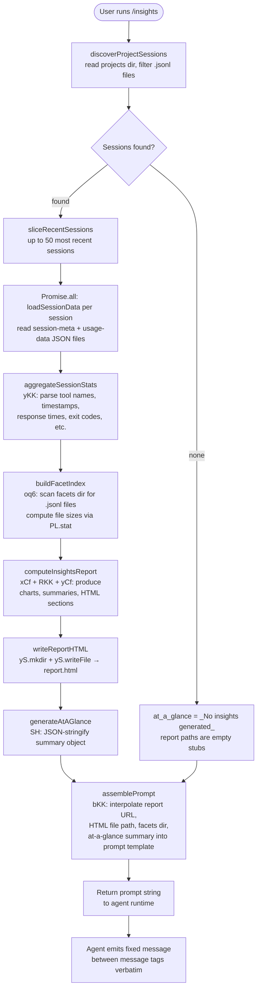

# `/insights`

> Analysis basis: CC v2.1.161 bundle.js (AST extraction + Claude interpretation)
> Minimum version: v2.1.161

---

## Overview

The `/insights` command generates a shareable HTML usage-report that analyzes the user's accumulated Claude Code session data. It reads session logs and per-project facet files from the local data store, computes aggregated statistics, writes a self-contained `report.html` file to disk, and then instructs the agent to confirm delivery by emitting a fixed response message. The report URL, HTML file path, and a private at-a-glance summary are all embedded in the prompt before the agent responds.

---

## Registration

| Field | Value |
|---|---|
| type | `prompt` |
| name | `insights` |
| description | `Generate a report analyzing your Claude Code sessions` |
| loc_byte | `13015918` |
| loc_byte_end | `13017222` |
| loc_line | `10441` |
| handler_method | `getPromptForCommand` |
| handler_method_start | `13016092` |
| handler_method_end | `13017221` |
| prompt_body.length | `513` |
| prompt_body.trace | `call→bKK(...) (1 literals)` |
| arbor_handler.name | `getPromptForCommand` |
| arbor_handler.kind | `Method` |
| arbor_handler.fqn | `claude-2.1.161::getPromptForCommand` |
| arbor_handler.resolution_path | `direct` |
| arbor_handler.n_hits | `1` |

Analysis basis: CC v2.1.161 bundle.js:+13015918

---

## Input Branching

The command's execution path has more than three distinct branches (session-discovery, per-session data loading, facet aggregation, HTML generation, and prompt assembly), so a Mermaid flowchart is used.



Analysis basis: CC v2.1.161 bundle.js:+13016098 (handler entry), +13002855 (session discovery), +13087235 (facet scan), +13004129 (HTML write), +13017124 (prompt assembly)

---

## Behavioral Spec

### 1. Session Discovery (`discoverProjectSessions`)

```
function discoverProjectSessions(baseDir):
    projectsRoot = path.join(baseDir, "projects")       # literal "projects"
    entries = fs.readdir(projectsRoot)
    dirs = entries.filter(entry => entry.isDirectory())
    allSessions = []
    for dir in dirs:
        sessionFiles = readdir(path.join(projectsRoot, dir))
        jsonlFiles = sessionFiles.filter(f => f matches /.jsonl$/)
        for file in jsonlFiles:
            allSessions.push({ dir, file })
    allSessions.sort()                                   # chronological order
    return allSessions
```

- The literal `"projects"` is used as the subdirectory name under the user data root.  
  Analysis basis: CC v2.1.161 bundle.js:+6695671
- Files are filtered by the extension literal `".jsonl"`.  
  Analysis basis: CC v2.1.161 bundle.js:+13087341
- `setImmediate` is used during the sort loop to avoid blocking the event loop.  
  Analysis basis: CC v2.1.161 bundle.js:+13002762
- Maximum batch size fed to the next stage: **50 sessions** (slice literal).  
  Analysis basis: CC v2.1.161 bundle.js:+13002874 (`50`) and +13002879 (`200` — secondary cap)

---

### 2. Facet Index Scan (`buildFacetIndex`)

```
function buildFacetIndex(sessionDir):
    facetsPath = path.join(sessionDir, "facets")        # literal "facets"
    files = fs.readdir(facetsPath)
    jsonlFiles = files.filter(f => f.isFile() && matchesJsonl(f))
    result = []
    await Promise.all(jsonlFiles.map(async f =>
        stat = await fs.stat(path.join(facetsPath, f))
        entry = { name: basename(f), size: stat.size }
        result.push(entry)
    ))
    return result
```

- Facets directory name: literal `"facets"`.  
  Analysis basis: CC v2.1.161 bundle.js:+12941857
- Only files (not subdirectories) are included; `.jsonl` extension filter applied.  
  Analysis basis: CC v2.1.161 bundle.js:+13087312

---

### 3. Per-Session Data Loading (`loadSessionData`)

```
function loadSessionData(sessionDir, sessionFile):
    usageDataPath  = path.join(sessionDir, "usage-data")    # literal
    sessionMetaPath = path.join(sessionDir, "session-meta") # literal
    rawUsage  = fs.readFile(usageDataPath,  { encoding: "utf-8" })
    rawMeta   = fs.readFile(sessionMetaPath, { encoding: "utf-8" })
    usageData = JSON.parse(rawUsage)
    meta      = JSON.parse(rawMeta)
    return { usageData, meta }
```

- Sub-directory names: `"usage-data"` (bundle.js:+12941807) and `"session-meta"` (bundle.js:+12941903).
- File encoding: `"utf-8"` (bundle.js:+12947938).
- JSON parsing is delegated to `m6` / `JSON.parse`.  
  Analysis basis: CC v2.1.161 bundle.js:+12947914, +12947955

---

### 4. Statistics Aggregation (`aggregateSessionStats`)

```
function aggregateSessionStats(sessions):
    for session in sessions:
        classify tool calls (WebSearch, WebFetch, Edit, Write, mcp__ prefix, etc.)
        bucket response times: "2-10s", "10-30s", "30s-1m", "1-2m", "2-5m", "5-15m", ">15m"
        bucket time-of-day:
            "Morning (6-12)"   → hours [7,11]
            "Afternoon (12-18)"→ hours [12,13,14,16,17]
            "Evening (18-24)"  → hours [18,19,21,22,23]
            "Night (0-6)"      → hours [0..4]
        accumulate per-tool error counts
        accumulate token usage, git commit/push events
        cap session age at 3600 seconds per-session slot  # literal 3600
    return aggregatedStats
```

- Tool-name classification uses literals `"WebSearch"`, `"WebFetch"`, `"Edit"`, `"Write"`, and the `"mcp__"` prefix.  
  Analysis basis: CC v2.1.161 bundle.js:+12942479, +12942500, +12942524, +12942631, +12942643
- Response-time bucket boundaries: 120 s (2 min), 900 s (15 min).  
  Analysis basis: CC v2.1.161 bundle.js:+12959245, +12959327
- Session data age cap: **3600 seconds** per slot.  
  Analysis basis: CC v2.1.161 bundle.js:+12943304
- Git activity tracked via string literals `"git commit"` and `"git push"`.  
  Analysis basis: CC v2.1.161 bundle.js:+12942887, +12942919
- Stale data threshold for session cache: **1 800 000 ms** (30 minutes).  
  Analysis basis: CC v2.1.161 bundle.js:+12950280

---

### 5. HTML Report Generation (`buildHTMLReport`)

```
function buildHTMLReport(stats, facetIndex):
    sections = []

    # Tool usage chart
    sections.push(renderBarChart(stats.toolCounts, colors=["#2563eb","#0891b2","#10b981","#8b5cf6"]))

    # Response-time distribution
    if stats.responseTimeBuckets is empty:
        sections.push('<p class="empty">No response time data</p>')
    else:
        sections.push(renderResponseTimeChart(stats.responseTimeBuckets))

    # Time-of-day chart
    if stats.timeOfDayBuckets is empty:
        sections.push('<p class="empty">No time data</p>')
    else:
        sections.push(renderTimeOfDayChart(stats.timeOfDayBuckets))

    # Tool errors
    if stats.toolErrors is empty:
        sections.push('<p class="empty">No tool errors</p>')
    else:
        sections.push(renderErrorBreakdown(stats.toolErrors, errorColor="#dc2626", okColor="#16a34a"))

    # Suggestions / at-a-glance
    atAGlance = buildAtAGlanceObject(stats)   # key: "at_a_glance"
    # "Add to CLAUDE.md" suggestion block included when applicable
    html = assembleFullPage(sections, atAGlance)
    return html
```

- Chart color palette: `"#2563eb"`, `"#0891b2"`, `"#10b981"`, `"#8b5cf6"`, `"#dc2626"`, `"#16a34a"`, `"#eab308"`.  
  Analysis basis: CC v2.1.161 bundle.js:+12996690, +12996828, +12997000, +12997143, +13000406, +13000655, +13001148
- Fallback empty-state strings are fixed literals.  
  Analysis basis: CC v2.1.161 bundle.js:+12958516, +12958973, +12959823, +13000417
- `"Add to CLAUDE.md"` suggestion literal present in the output.  
  Analysis basis: CC v2.1.161 bundle.js:+12964369
- Output filename: `"report.html"`.  
  Analysis basis: CC v2.1.161 bundle.js:+13005112
- Maximum token-budget for HTML content sections: **8 192 characters**.  
  Analysis basis: CC v2.1.161 bundle.js:+12958194
- HTML write uses `yS.mkdir` (recursive) then `yS.writeFile`.  
  Analysis basis: CC v2.1.161 bundle.js:+13004853, +13005140

---

### 6. Prompt Assembly (`getPromptForCommand` / `bKK`)

```
function getPromptForCommand(context):
    # 1. Run the full report pipeline (CKK)
    reportResult = await generateInsightsReport(context)

    # 2. Compute rounded token counts
    tokenCount = Math.round(reportResult.totalTokens)   # loc_byte 13016479

    # 3. Serialise at-a-glance summary to JSON
    atAGlanceSummary = JSON.stringify(reportResult.atAGlance)   # SH, loc_byte 13017142

    # 4. Resolve report file paths
    reportURL  = resolveReportURL(reportResult)
    htmlFile   = resolveHTMLFilePath(reportResult)      # xR8, loc_byte 13017188
    facetsDir  = reportResult.facetsDirectory

    # 5. Interpolate into prompt template (bKK call)
    promptText = bKK(
        insightsData    = reportResult.fullData,
        reportURL       = reportURL,
        htmlFile        = htmlFile,
        facetsDir       = facetsDir,
        atAGlance       = atAGlanceSummary,
        separator       = " · "                          # literal loc_byte 13016550
    )

    # 6. Fallback when no data was produced
    if promptText is empty or null:
        promptText = "_No insights generated_"           # literal loc_byte 13016989

    return promptText
```

- The prompt body is 513 characters long (analysis basis: `prompt_body.length`).
- The prompt instructs the agent to output **only** the text inside `<message>…</message>` tags verbatim, ensuring the user sees a consistent confirmation message regardless of how data varies.
- The at-a-glance summary is marked as being **for the agent's context only** — the user has not seen any output yet at the moment the prompt is issued.
- Separator literal `" · "` used for display formatting.  
  Analysis basis: CC v2.1.161 bundle.js:+13016550
- Fallback literal `"_No insights generated_"` when the pipeline produces no output.  
  Analysis basis: CC v2.1.161 bundle.js:+13016989

---

### 7. Chain / Transcript Integrity Helpers (called via `uR8` → `sAH`)

These helpers are invoked during session chain reconstruction and are not user-facing, but they affect what data flows into the report:

```
function reconstructSessionChain(sessionEntries):
    # Detect and recover from parent-UUID cycles (tengu_transcript_parent_cycle)
    # Detect and recover from parallel transcript splits (tengu_chain_parallel_tr_recovered)
    # Fall back to timestamp ordering when parent chain is broken (tengu_chain_timestamp_fallback)
    # Emit telemetry for phantom-parent entries (tengu_transcript_phantom_parent)
    return orderedChain
```

Analysis basis: CC v2.1.161 bundle.js:+13088100 (`uR8`), +13087985 (`sAH`)

---

## State & Side Effects

| Item | Detail |
|---|---|
| Filesystem reads | Session `.jsonl` files under `~/.claude/projects/<project>/`; `usage-data` and `session-meta` JSON files per session; facet `.jsonl` files under `facets/` subdirectory |
| Filesystem writes | Creates `report.html` in the insights output directory (recursive `mkdir` + `writeFile`); cleans up stale cached files via `wSK.unlinkSync` |
| Telemetry events reachable in call graph | `tengu_transcript_phantom_parent`, `tengu_transcript_parent_cycle`, `tengu_chain_parent_cycle`, `tengu_chain_timestamp_fallback`, `tengu_chain_parallel_tr_recovered`, `tengu_relink_walk_broken`, `tengu_daemon_config_reload`, `tengu_daemon_idle_exit`, `tengu_daemon_control`, `tengu_bg_dispatch_sigkill_escalate`, `tengu_bg_dispatch_low_mem`, `tengu_bg_spare_enable`, `tengu_bg_spare_claim`, `tengu_bg_spare_claim_fail`, `tengu_daemon_yield`, `tengu_skill_file_changed` |
| No direct telemetry in `/insights` handler | The handler itself emits no `tengu_insights_*` event; telemetry events listed above originate in shared infrastructure called transitively |
| appState changes | None directly; read-only access to session state |
| Agent response | Constrained: agent must emit the fixed `<message>` block verbatim — no free-form generation |
| Sound | None |
| Hook registration | None specific to this command |
| Report caching | Stale entries older than 1 800 000 ms are deleted before building the new report |

---

## Version History

| Version | Change |
|---|---|
| v2.1.161 | Initial analysis |

---

## Common Mistakes

1. **Running `/insights` in a project with no prior sessions** — the pipeline finds no `.jsonl` files; the agent returns the fallback `"_No insights generated_"` message rather than an HTML report.
2. **Expecting real-time data** — the report is built from on-disk session logs. Activity from the current session that has not yet been flushed to disk will not appear in the report.
3. **Confusing the report URL with a live web URL** — `report.html` is a local file path; the "URL" returned is a `file://` URI or a relative path, not a remotely hosted page.
4. **Editing `report.html` manually** — the file is fully regenerated every time `/insights` is run; any manual edits will be overwritten.
5. **Expecting the agent to elaborate freely** — the prompt instructs the agent to emit only the `<message>` block verbatim as its entire response. Follow-up questions about specific sections must be asked as a separate turn.
6. **Assuming all tool names appear in the report** — only a fixed set of first-party tool names (`WebSearch`, `WebFetch`, `Edit`, `Write`) and the `mcp__` prefix class are classified; unrecognised tool names are bucketed under `"Other"` (literal at bundle.js:+12943435).

---

## Appendix — Identifier Mapping

> For bundle debugging only. Identifiers change across versions.

| Identifier | Role |
|---|---|
| `__handler_insights` | Synthetic BFS entry point for the `/insights` command handler (Arbor resolves this to `getPromptForCommand`) |
| `CKK` | Primary insights pipeline orchestrator — discovers sessions, loads data, aggregates stats, writes HTML |
| `mCf` | Session directory scanner — reads project subdirectories, filters `.jsonl` files, sorts results |
| `nc` | Path join helper for the `projects` subdirectory root |
| `oq6` | Facet index builder — scans `facets/` directory, stats each `.jsonl` file |
| `Ba` | `.jsonl` extension tester (regex match) |
| `vCf` | Per-session data loader — reads `session-meta` and `usage-data` files, parses JSON |
| `D4A` | Path resolver for per-session data directories |
| `yS6` | Low-level path builder for `usage-data` and `session-meta` sub-paths |
| `hKK` | Session metadata validation helper |
| `m6` | JSON parse wrapper |
| `nC6` | Plugin/path resolution helper (used in session path normalisation) |
| `iC6` | Synced-plugins path resolver |
| `uR8` | Session chain reconstruction coordinator — aggregates chain data into report-ready structures |
| `sAH` | Session chain assembler — resolves parent UUIDs, detects cycles, orders messages |
| `Hbf` | Session chain helper — UUID-based lookup initialiser |
| `Hb` | Chain node connector |
| `NJA` | Recursive JSON flattening utility used during chain traversal |
| `sj` | Chain serialisation helper |
| `afH` | Session chain sort and deduplication routine |
| `jbf` | NaN-guarded numeric validator for chain timestamps |
| `Jbf` | Chain segment filterer and sorter |
| `Ybf` | Chain segment shift/accumulate helper |
| `Z4K` | Per-session aggregated-value setter |
| `lH6` | Session map renderer |
| `x4A` | Text content extractor / replaceAll helper |
| `Lh6` | Message content formatter (handles compact summaries, command-args, bash-input) |
| `m4A` | Attachment type classifier |
| `Pbf` | Array/string trim + some() validator |
| `Xbf` | Array some() validator for attachment filtering |
| `iR8` | Per-session index reader |
| `rR8` | Session values-to-array converter |
| `PCf` | NaN guard for numeric stat fields |
| `w4A` | Session statistics normaliser — rounds values, trims strings, validates arrays |
| `yKK` | Per-session event classifier — tools, errors, timestamps, response times |
| `kS6` | Tool-name classifier helper |
| `JCf` | File extension extractor for tool-use classification |
| `HJH` | Diff computation helper (HE9.diff) |
| `p4` | Array indexOf utility |
| `Z$` | Stat bucketing helper |
| `Y4A` | Summary section assembler |
| `NCf` | Facet file writer — mkdir + writeFile for facet JSON |
| `SH` | JSON.stringify wrapper |
| `ZCf` | Cached-report reader — reads existing report.html, parses, optionally deletes |
| `xR8` | Report HTML file path resolver |
| `xKK` | Stale-cache invalidation helper |
| `ICf` | Full report generation orchestrator — calls HTML builder, oXH, kKK |
| `TCf` | Parallel section builder — splits work with Promise.all |
| `WCf` | Per-section data formatter and slicer |
| `oXH` | HTML section renderer — calls uK, FV8, C8, mbH |
| `uK` | HTML utility helper |
| `FV8` | File-hash and report-cache manager (SHA1, randomUUID, readFile, writeFile) |
| `C8` | Report section UUID stamper |
| `mbH` | Report assembly finaliser — validates assistant message presence |
| `EG` | HTML escape / sanitisation helper |
| `kKK` | Insights report type router (routes to `"insights"` literal path) |
| `KG` | First-party plugin registry accessor |
| `hK` | HTML section filter |
| `a_` | Error string normaliser |
| `VCf` | Per-facet HTML file writer |
| `pCf` | Object.keys stat enumerator |
| `RKK` | Chart data builder — percentiles, medians, response-time distributions |
| `rq6` | Object.entries chart-data helper |
| `eq` | Array slice/indexOf utility |
| `SKK` | Numeric stat aggregator — finite checks, Set-based deduplication, splits |
| `yCf` | Full HTML report assembler — values, Math.round, Object.entries, Promise.all |
| `IKK` | Per-section HTML generator — calls oXH, uK, DCf, hK |
| `DCf` | Section-type dispatcher |
| `xCf` | Master HTML page builder — all chart sections, tool errors, time-of-day |
| `nf` | HTML entity escaper (Z7 wrapper) |
| `Z7` | Core HTML replaceAll escaper |
| `bR8` | Secondary HTML formatter |
| `bCf` | JSON.stringify wrapper for HTML embedding |
| `RMH` | Tool-error section renderer |
| `RCf` | Response-time chart renderer |
| `CCf` | Multi-series chart renderer |
| `bKK` | Prompt template interpolator — inserts insights data, URL, paths, at-a-glance into the 513-char prompt |