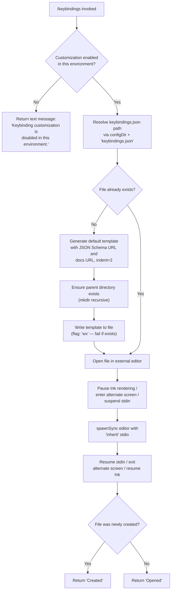

# `/keybindings`

> Analysis basis: CC v2.1.160 bundle.js (AST extraction + Claude interpretation)
> Minimum version: v2.1.160

---

## Overview

The `/keybindings` command opens or creates the user's `keybindings.json` configuration file in an external editor. If the file does not yet exist, the command first scaffolds a default template (with JSON Schema reference and documentation URL), writes it to the expected config path, and then launches the system editor. The command is disabled in environments where keybinding customization is not permitted.

---

## Registration

| Field | Value |
|---|---|
| type | `local` |
| name | `keybindings` |
| description | Open or create your keybindings configuration file |
| loc_byte | `11459189` |
| loc_byte_end | `11459383` |
| loc_line | `7863` |
| supportsNonInteractive | `false` |
| module_id | `lx1` |
| load_inline | `true` |
| arbor_handler.name | `D3f` |
| arbor_handler.fqn | `claude-2.1.160::D3f` |
| arbor_handler.kind | `AsyncFunction` |
| arbor_handler.resolution_path | `module_id` |
| arbor_handler.n_hits | `0` |

Analysis basis: CC v2.1.160 bundle.js:+11459189

---

## Input Branching

The command follows 4+ distinct paths depending on whether keybinding customization is enabled, whether the config file already exists, and how the editor launch proceeds. A Mermaid flowchart is required.



Analysis basis: CC v2.1.160 bundle.js:+11458583, +11458613, +11458697, +11458748, +11458793, +11458906, +11458915

---

## Behavioral Spec

### 1. Environment Gate

Before performing any file I/O, the handler checks whether keybinding customization is permitted in the current deployment environment.

```
function checkCustomizationEnabled():
    if keybindingCustomizationIsReleased() is false:
        return { type: "text",
                 text: "Keybinding customization is disabled in this environment." }
```

- Returns immediately with a `"text"` typed response when not enabled.
- The release flag is evaluated via `keybindingCustomizationReleaseCheck` (`rU`), which in turn calls the configuration access layer (`W6`).
- Telemetry event `tengu_keybinding_customization_release` is emitted during this check.

Analysis basis: CC v2.1.160 bundle.js:+11458583, +11458600, +11458613, +3836727, +3836730

---

### 2. Config Path Resolution

```
function resolveKeybindingsPath():
    configDir = getConfigDirectory()   // via configPathHelper (o4H)
    return path.join(configDir, "keybindings.json")
```

- The filename constant is `"keybindings.json"` (bundle.js:+3837244).
- `configPathHelper` (`o4H`) delegates to `path.join` (`z18.join`) and a helper (`n8`) to construct the platform-appropriate config directory path.

Analysis basis: CC v2.1.160 bundle.js:+11458680, +3837230, +3837244

---

### 3. Default Template Generation

When the target file does not yet exist, a default JSON template is generated:

```
function buildDefaultKeybindingsTemplate():
    schemaUrl  = "https://www.schemastore.org/claude-code-keybindings.json"
    docsUrl    = "https://code.claude.com/docs/en/keybindings"

    // Build structure using current keybinding map entries:
    //   - Iterate xw6 (registered keybinding entries) via map
    //   - For each entry, produce a comment-annotated key block
    //   - Trim whitespace from key names (IvH)
    //   - Merge Object.entries / Object.keys for default values
    //   - Filter using _.has for known keys only

    template = serializeToJSON(structure, indentLevel=2)  // SH → JSON.stringify
    return template
```

- Indent level is `2` spaces (bundle.js:+11458483).
- JSON Schema `$schema` URL: `"https://www.schemastore.org/claude-code-keybindings.json"` (bundle.js:+11458336).
- Documentation URL embedded in template: `"https://code.claude.com/docs/en/keybindings"` (bundle.js:+11458401).
- Serialization uses `JSON.stringify` via `SH`.

Analysis basis: CC v2.1.160 bundle.js:+11458456, +11458100, +11458113, +11458133, +11458169, +11458200, +11458272, +11458336, +11458401, +11458473, +11458483

---

### 4. File Creation (new file path only)

```
function writeNewKeybindingsFile(filePath, templateContent):
    parentDir = path.dirname(filePath)
    fs.mkdir(parentDir, { recursive: true })        // BN8.mkdir
    fs.writeFile(filePath, templateContent, { flag: "wx" })  // BN8.writeFile
    // flag "wx" → exclusive create; fails if file exists concurrently
```

- `"wx"` flag ensures atomic exclusive creation — if the file appears between the existence check and the write, the write fails gracefully rather than overwriting user data (bundle.js:+11458793).
- Parent directory is created recursively if absent.

Analysis basis: CC v2.1.160 bundle.js:+11458697, +11458707, +11458748, +11458793

---

### 5. External Editor Launch

The command delegates to the generic file-in-editor opening utility (`CF`):

```
async function openFileInEditor(filePath):
    editorCommand = resolveEditorCommand(filePath)   // CF → R$f → Ge_
    //   - Checks ML (editor map) for a registered editor
    //   - Falls back to basename / environment detection (bW)
    //   - Raises Error "Ink instance not found - cannot pause rendering"
    //     if Ink renderer is unavailable

    A.enterAlternateScreen()
    A.pause()
    A.suspendStdin()

    args = editorCommand.split(" ")        // L.split
    binary = args[0]
    rest   = args.slice(1)                 // f.slice

    result = child_process.spawnSync(binary, [...rest, filePath],
                                     { stdio: "inherit" })   // Ax1.spawnSync

    A.exitAlternateScreen()
    A.resumeStdin()
    A.resume()

    return result
```

- `stdio: "inherit"` passes the terminal directly to the editor process (bundle.js:+11398104).
- The Ink UI is fully paused and the alternate terminal screen is entered before handing off to the editor, then restored afterwards.
- Editor resolution considers IDE environment hint `"IDE"` (bundle.js:+5378431).

Analysis basis: CC v2.1.160 bundle.js:+11458859, +11397749, +11397791, +11397797, +11397890, +11397938, +11397950, +11397980, +11397990, +11398029, +11398054, +11398072, +11398104, +11398172, +11398374, +11398452, +11398481, +11398497

---

### 6. Return Value

```
function buildReturnMessage(wasNewlyCreated):
    if wasNewlyCreated:
        return "Created"
    else:
        return "Opened"
```

- Literal `"Created"` at bundle.js:+11458915.
- Literal `"Opened"` at bundle.js:+11458906.

Analysis basis: CC v2.1.160 bundle.js:+11458906, +11458915

---

### 7. Config Read / File-Watch Subsystem (supporting layer)

The configuration layer (`W6` → `ZDH`, `R6`, `ojL`) used by the release-gate check performs additional file management:

```
function configReadLayer(configPath):
    if accessNotYetPermitted:
        throw Error("Config accessed before allowed.")   // literal at +3247715

    try:
        raw = fs.readFileSync(configPath, "utf-8")        // encoding: "utf-8"
    catch e:
        if e.code == "ENOENT": return defaultConfig
        if e.code == "EEXIST": handle gracefully
        emit telemetry("tengu_config_parse_error")        // on parse failure

    // File watcher registration (ojL):
    //   DA8.watchFile(path, callback)
    //   On change: reload, emit updated config
    //   DA8.unwatchFile on teardown

    // Backup rotation (ZDH):
    //   On write: create backup under VY.basename-derived name
    //   Date.now() used for backup timestamp
    //   fs.copyFileSync for backup creation
    //   fs.readdirStringSync to enumerate existing backups
    //   Entries starting with expected prefix are rotated
```

- Error string `"Config accessed before allowed."` (bundle.js:+3247715).
- Encoding `"utf-8"` (bundle.js:+3247798).
- Error codes handled: `"ENOENT"` (bundle.js:+3247945), `"EEXIST"` (bundle.js:+3248560), `"error"` severity (bundle.js:+3248266).

Analysis basis: CC v2.1.160 bundle.js:+3247709, +3247715, +3247756, +3247771, +3247798, +3247818, +3247821, +3247838, +3247892, +3247937, +3247945, +3247961, +3248196, +3248306, +3248344, +3248498, +3248515, +3248525, +3248560, +3248583, +3248618, +3248737, +3248836, +3248854

---

## State & Side Effects

| Item | Detail |
|---|---|
| Telemetry | `tengu_keybinding_customization_release` (bundle.js:+3836730) — emitted during environment gate check |
| Telemetry | `tengu_config_parse_error` (bundle.js:+3248346) — emitted if the config file fails to parse |
| File created | `keybindings.json` in the Claude Code config directory, when it does not yet exist |
| Directory created | Parent config directory created recursively if absent (`BN8.mkdir`) |
| Terminal state | Ink rendering paused; alternate screen entered; stdin suspended for the duration of the editor process; all restored on exit |
| File watcher | `DA8.watchFile` registered on the config file path; `DA8.unwatchFile` called on teardown |
| Event emitter | `Ur.emit` called during GrowthBook experiment tracking (within the release-gate subsystem) |
| Hook registration | <!-- TODO: not found in depth-2 traversal; needs --depth 4 --> |
| appState changes | <!-- TODO: not found in depth-2 traversal; needs --depth 4 --> |
| Sound | None observed in traversal |

---

## Version History

| Version | Change |
|---|---|
| v2.1.160 | Initial analysis |

---

## Common Mistakes

1. **Running in non-interactive mode**: `supportsNonInteractive` is `false`; invoking `/keybindings` in a non-interactive pipeline or script will not work as expected — the command is designed exclusively for interactive terminal sessions.
2. **Expecting the file to pre-exist**: The command will scaffold a default `keybindings.json` if none is found; user-created files at that path are not overwritten (the `"wx"` exclusive-write flag protects against accidental overwrite).
3. **Environment-disabled deployments**: In managed or restricted environments the command returns a text message and performs no file operations; callers should not assume the editor was opened.
4. **Editor not configured**: If no editor is registered in the editor map and no `EDITOR`/`VISUAL` environment variable is available, the editor resolution step will fail before spawning anything.
5. **Concurrent file creation race**: The `"wx"` flag means a second concurrent invocation will fail to write the template if the first already created the file between the existence check and the write; this is intentional safe behaviour, not a bug.

---

## Appendix — Identifier Mapping

> For bundle debugging only. Identifiers change across versions.

| Identifier | Role |
|---|---|
| `D3f` | Main async handler for `/keybindings` command (arbor_handler) |
| `rU` | Keybinding customization release-gate check |
| `W6` | Configuration access layer / release-flag resolver |
| `HY6` | Config layer helper A (called from W6) |
| `_Y6` | Config layer helper B (called from W6) |
| `px` | Config initialization helper |
| `FH` | String conversion utility within config init |
| `mx` | Config module resolver / loader |
| `HA8` | Config cache lookup and population |
| `wY_` | Config entry writer / experiment event emitter |
| `WY_` | Config serialization / persistence helper |
| `R6` | Config read-with-watch orchestrator |
| `d6` | Config path / directory helper |
| `hY_` | Config value transformer |
| `ZDH` | Low-level config file read, backup rotation, and directory management |
| `ojL` | File watcher registration and change handler |
| `o4H` | Config directory path builder |
| `Qx1` | Default keybindings template assembler |
| `z3f` | Keybinding entry iterator / structure builder |
| `IvH` | Key-name whitespace trimmer |
| `H` | Bootstrap fetch / HTTP utility |
| `_` | Filesystem utility (statSync, readFileSync, includes) |
| `SH` | JSON serializer (wraps JSON.stringify) |
| `G8` | Generic utility (called post-write in handler) |
| `CF` | Open-file-in-editor orchestrator |
| `Fm` | Editor command builder sub-helper |
| `MY` | Editor map lookup |
| `R$f` | Editor command resolver |
| `Ge_` | Editor basename / extension detector |
| `oq` | String slice/index utility |
| `A` | Terminal / Ink renderer control (alternate screen, pause, resume) |
| `f` | Process / stream close helper |
| `q` | Filesystem/socket cleanup utility |
| `L` | Async resource lifecycle tracker |
| `bW` | IDE environment / editor name detector |

---

Note: index built via Arbor fallback; some signals (telemetry, literals) may be missing — see arbor-fallback.js.