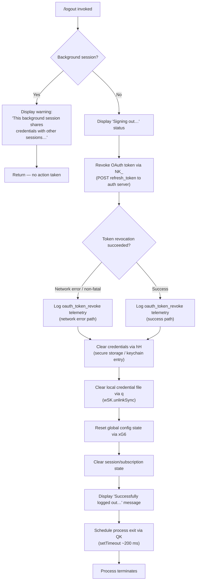

# `/logout`

> Analysis basis: CC v2.1.161 bundle.js (AST extraction + Claude interpretation)
> Minimum version: v2.1.161

---

## Overview

The `/logout` command signs the user out of their Anthropic account by revoking the OAuth token with the authentication server, clearing all local credentials and session state, and then terminating the CLI process. It handles a special case for background sessions, where credential sharing means a local logout would be ineffective — in that situation it informs the user to run `/logout` from the main terminal instead.

---

## Registration

| Field | Value |
|---|---|
| type | `local-jsx` |
| name | `logout` |
| description | Sign out from your Anthropic account |
| loc_byte | `11491418` |
| loc_byte_end | `11491702` |
| loc_line | `7874` |
| module_id | `_p_` |
| load_inline | `true` |
| arbor_handler.name | `EI7` |
| arbor_handler.fqn | `claude-2.1.161::EI7` |
| arbor_handler.kind | `AsyncFunction` |
| arbor_handler.resolution_path | `module_id` |
| arbor_handler.n_hits | `0` |

Analysis basis: CC v2.1.161 bundle.js:+11491418

---

## Input Branching

The handler has three meaningful execution paths depending on session type and logout outcome, so a flowchart is used.



Analysis basis: CC v2.1.161 bundle.js:+7891052 (handler `EI7`), +7890126 (`NK_` token revocation), +7890830 (`hH` credential clear), +7889947 (`em_`/`q` file unlink), +7891424 (setTimeout exit)

---

## Behavioral Spec

### 1. Background-session guard

When the CLI detects it is running as a background session (the `W9` / `bzH` session-type check), the handler outputs a warning message — "This background session shares credentials with other sessions; /logout here has no effect. Run /logout from your main terminal to sign out." (bundle.js:+7891162) — and returns immediately without revoking anything.

```
function checkBackgroundSession(sessionContext):
    sessionType = getSessionType(sessionContext)   // W9 → bzH
    if sessionType in ["bg", "daemon", "daemon-worker"]:
        renderSystemMessage(BACKGROUND_LOGOUT_WARNING)
        return NOOP
```

Analysis basis: CC v2.1.161 bundle.js:+7891052 (`EI7`→`W9`), +2245341 (literals "bg", "daemon", "daemon-worker")

---

### 2. OAuth token revocation

The handler calls the token-revocation helper (`NK_`) which:

1. POSTs the stored `refresh_token` to the configured auth endpoint via `s_.post`.
2. On success the event `"oauth_token_revoke"` is recorded (bundle.js:+7890833).
3. On network failure (`s_.isAxiosError` check) the error is classified and logged; the logout sequence still continues.

```
async function revokeOAuthToken(credentials):
    try:
        await httpPost(authEndpoint, { grant_type: "refresh_token",
                                       token: credentials.refreshToken })
        logTelemetry("oauth_token_revoke", { result: "success" })
    catch error:
        if isAxiosError(error):
            logTelemetry("oauth_token_revoke", { result: "network" })
        // non-fatal — continue with local credential wipe
```

Analysis basis: CC v2.1.161 bundle.js:+7890126 (`NK_`), +2101184 (`s_.post`), +2101244 (literal "refresh_token"), +2101352 (literal "oauth_token_revoke"), +2101389 (`s_.isAxiosError`), +2101476 (literal "network")

---

### 3. Local credential removal

After (or despite) network revocation, two credential stores are cleared:

1. **Secure / keychain storage** — `hH` calls into the storage abstraction which may use OS keychain. The event `"secure_storage_credentials_write"` path is reached at bundle.js:+2273423 when wiping the stored secret.
2. **Plaintext credential file** — `q` → `wSK.unlinkSync` deletes the on-disk credential file (bundle.js:+15882480).

```
async function clearLocalCredentials():
    await secureStorageClear(credentialKey)   // hH → zjq → wSK.unlinkSync / keychain
    fileSystem.unlinkSync(credentialFilePath) // q → wSK.unlinkSync
```

Analysis basis: CC v2.1.161 bundle.js:+7890830 (`hH`), +15882480 (`wSK.unlinkSync`), +2273423 (literal "secure_storage_credentials_write")

---

### 4. Global configuration and state reset

`xG6` orchestrates a multi-step application state teardown:

| Step | Helper | Effect |
|---|---|---|
| Auth fields cleared from config | `k06` | Removes auth tokens from in-memory config |
| Config persisted to disk | `WdH` | Writes sanitised config |
| Cache cleared | `t88` → `ZCq.clear` | Empties the in-memory credential/config cache (bundle.js:+2984517) |
| State reset | `mDH` | Resets other auth-related app state |
| Session cleanup | `k6H` → `HcH` | Clears event queues (`QDH`, `qq8`, `BY6`, `aw_`, `CU`) and removes process listeners (`process.off`, `process.removeListener`); clears intervals (`clearInterval`) (bundle.js:+3229251–3229299) |
| MCP socket cleanup | `Gm9` | Calls `PyH.unlink` to remove the MCP socket file (bundle.js:+6990150) |
| Daemon socket cleanup | `vR_` | Calls `T06.unlink` and `clearTimeout` (bundle.js:+6950951) |

```
function resetGlobalConfigAndState(appState):
    clearAuthFieldsInConfig(appState)      // k06
    persistConfigToDisk()                   // WdH
    credentialCache.clear()                 // t88 → ZCq.clear
    resetAuthAppState()                     // mDH
    cleanupSessionResources()               // k6H → HcH
    unlinkMcpSocket()                       // Gm9 → PyH.unlink
    unlinkDaemonSocket()                    // vR_ → T06.unlink
```

Analysis basis: CC v2.1.161 bundle.js:+7889984 (`xG6`), +2984517 (`ZCq.clear`), +3229251 (`QDH.clear`), +6990150 (`PyH.unlink`), +6950951 (`T06.unlink`)

---

### 5. Subscription-switch guard during logout

While building the logout outcome, the handler checks for a `"subscription-switch"` literal (bundle.js:+7890678) to determine whether the logout was triggered as part of an account plan change, adjusting the success message path accordingly.

```
function determineLogoutContext(reason):
    if reason == "subscription-switch":
        return CONTEXT_SUBSCRIPTION_SWITCH
    return CONTEXT_STANDARD_LOGOUT
```

Analysis basis: CC v2.1.161 bundle.js:+7890678 (literal "subscription-switch")

---

### 6. Success message and process exit

After all cleanup:

1. A JSX element (`Hp_.createElement`) renders the system message `"Successfully logged out from your Anthropic account."` (bundle.js:+7891361).
2. `setTimeout` schedules a call to `QK` (the application exit routine) after approximately 200 ms (literal `200` at bundle.js:+7891456).
3. `QK` → `O9` drives the full graceful-shutdown sequence (flush writes, unmount UI, drain output, `process.exit`).

```
async function completeLogout():
    renderSystemMessage("Successfully logged out from your Anthropic account.")
    await delay(200)          // setTimeout, literal 200 ms
    await gracefulShutdown()  // QK → O9
```

Analysis basis: CC v2.1.161 bundle.js:+7891336 (`Hp_.createElement`), +7891361 (success literal), +7891424 (`setTimeout`), +7891440 (`QK`), +7891456 (literal `200`)

---

## State & Side Effects

| Item | Detail |
|---|---|
| Telemetry — `tengu_feature_ok` | Emitted on successful internal feature completion (bundle.js:+966587) |
| Telemetry — `tengu_feature_bad` | Emitted when a feature operation fails internally (bundle.js:+966650) |
| Telemetry — `tengu_feature_sad` | Emitted for a degraded but non-fatal feature outcome (bundle.js:+966732) |
| Telemetry — `tengu_config_lock_contention` | Emitted when config lock acquisition takes too long during state reset (bundle.js:+3249297) |
| Telemetry — `tengu_config_stale_write` | Emitted when a stale config write is detected (bundle.js:+3249433) |
| Telemetry — `tengu_config_parse_error` | Emitted if config file cannot be parsed during reset (bundle.js:+3251872) |
| Telemetry — `tengu_config_auth_loss_prevented` | Emitted when a write is refused to prevent wiping auth credentials (bundle.js:+3249776) |
| Telemetry — `tengu_scroll_summary` | Emitted during shutdown scroll state recording (bundle.js:+5414569) |
| Telemetry — `tengu_cache_eviction_hint` | Emitted when cache eviction is triggered during session teardown (bundle.js:+5415625) |
| OAuth token revocation | HTTP POST of `refresh_token` to auth server; non-fatal on failure |
| Credential file | Deleted via `wSK.unlinkSync` (bundle.js:+15882480) |
| Keychain / secure storage | Cleared via storage abstraction (`hH` path) |
| In-memory credential cache | `ZCq.clear()` called (bundle.js:+2984517) |
| Multiple event queues | `QDH`, `qq8`, `BY6`, `aw_`, `CU` all cleared (bundle.js:+3229251–3229299) |
| Process listeners | Removed via `process.off` and `process.removeListener` |
| MCP socket file | Unlinked via `PyH.unlink` (bundle.js:+6990150) |
| Daemon socket file | Unlinked via `T06.unlink` (bundle.js:+6950951) |
| Config file (global) | Auth fields removed and config re-persisted to disk |
| Process exit | Triggered ~200 ms after success message via `QK` → `O9` → `process.exit` |
| Background session | No-op; displays warning message only |

---

## Version History

| Version | Change |
|---|---|
| v2.1.161 | Initial analysis |

---

## Common Mistakes

1. **Running `/logout` inside a background/daemon session** — the command deliberately does nothing in this context. The warning message (bundle.js:+7891162) instructs the user to run `/logout` from the main terminal. Ignoring this and expecting credentials to be cleared will leave the session authenticated.

2. **Expecting an instant terminal close** — there is a deliberate ~200 ms delay (bundle.js:+7891456) between the success message and process exit to allow the UI to render the confirmation. Scripting around `/logout` must account for this short pause.

3. **Assuming network failure aborts logout** — OAuth token revocation failure is classified as non-fatal. Local credentials are always cleared regardless of whether the server-side revocation POST succeeds (bundle.js:+2101476 network-error path continues to local wipe).

4. **Conflating `/logout` with a subscription switch** — the handler contains a distinct `"subscription-switch"` code path (bundle.js:+7890678). Manually simulating a logout via CLI flags intended for subscription switching may follow a different branch and produce different output.

5. **Config backup safety net** — if the re-read config is missing auth fields that the in-memory cache has, a write is refused and `tengu_config_auth_loss_prevented` is emitted (bundle.js:+3249776, message fragment "refusing to write to avoid wiping"). This guard exists to prevent data loss but can surface as an apparent config-not-cleared scenario after logout.

---

## Appendix — Identifier Mapping

> For bundle debugging only. Identifiers change across versions.

| Identifier | Role |
|---|---|
| `EI7` | Main logout handler (AsyncFunction resolved via `module_id` → `_p_`) |
| `htH` | Core logout execution function (token revoke + credential wipe orchestration) |
| `GI7` | JSX render helper for logout UI output |
| `q` | File-system credential file unlink helper |
| `W9` | Session-type reader (detects background/daemon context) |
| `bzH` | Session-type constants / comparator used by `W9` |
| `xG6` | Global config and state reset coordinator |
| `k06` | Auth-field clear in config |
| `WdH` | Config persistence writer |
| `t88` | Credential cache clear dispatcher |
| `mDH` | Auth app-state reset |
| `k6H` | Session resource cleanup entry point |
| `Qx` | Sub-helper within session cleanup |
| `pH` | String utility / identity helper used in multiple contexts |
| `gx` | Sub-helper within session cleanup |
| `HcH` | Event-queue and process-listener teardown |
| `Aj_` | Interval clear + process listener removal |
| `yH` | Error logging / essential-traffic queue helper |
| `a_` | Error construction utility |
| `r9` | Essential-traffic queue handler |
| `s44` | Queue shift/push utility |
| `Gm9` | MCP socket cleanup |
| `Zm9` | MCP sub-helper |
| `aR_` | MCP sub-helper |
| `tCA` | MCP internal utility |
| `d1H` | MCP path helper |
| `s56` | Path join helper used in MCP/daemon cleanup |
| `vR_` | Daemon socket cleanup |
| `ZR_` | Daemon socket teardown sub-helper |
| `NR_` | Daemon socket sub-helper |
| `kLH` | Daemon includes/filter check |
| `WnH` | Path join helper for daemon socket |
| `PA` | Auth provider check (bedrock/foundry/vertex etc.) |
| `O4` | Config read orchestrator |
| `zjq` | Storage read/write abstraction (secure + plaintext) |
| `H6L` | Async-local-store backed storage writer |
| `fZH` | Storage read with async fallback |
| `hH` | Secure-storage credential clear |
| `h1H` | Telemetry feature event emitter |
| `d` | Low-level telemetry/feature recording |
| `RH` | Storage delete helper |
| `L` | Async read queue wrapper |
| `f` | Connection/resource close helper |
| `NK_` | OAuth token revocation HTTP helper |
| `Rq` | OAuth endpoint URL builder |
| `rNA` | OAuth URL sub-component |
| `QK4` | OAuth client ID helper |
| `Te` | Additional state cleanup called after revoke |
| `FD_` | Config-file write helper (global config) |
| `xCq` | Config serialisation helper |
| `Cfq` | Keychain/secure-storage service entry |
| `iN` | SHA-256 key derivation for keychain label |
| `BX` | Keychain query helper |
| `vV` | OS user-info lookup for keychain |
| `TH` | String coercion utility |
| `W8` | Global config save with lock |
| `Pj_` | Config lock-file acquisition and backup writer |
| `F6` | File-existence check utility |
| `qjq` | Config merge utility |
| `v8` | Version/parse number helper |
| `nDH` | Config file read with backup support |
| `iY6` | Config post-process / migration helper |
| `SH` | JSON stringify wrapper |
| `Xj_` | Backup filename path builder |
| `Y56` | Atomic file write (temp + rename) |
| `McH` | Config metadata helper |
| `icq` | Config entries iterator |
| `$cH` | Timestamp helper for config writes |
| `Jj_` | Config directory creation + write helper |
| `Pt6` | Post-config-write hook |
| `K` | Map/collection utility with padEnd rendering |
| `jEH` | Additional state field cleanup |
| `RIH` | UI component renderer for logout screen |
| `Jj` | TH-based string coercion sub-helper |
| `N4` | OTEL metrics event emitter |
| `SIH` | OTEL resource attribute builder |
| `hU` | Random-bytes session ID generator |
| `N6` | Cross-platform node utility |
| `g58` | OTEL attribute freeze helper |
| `kX6` | Attribute key formatter |
| `zL` | KD/y6 OTEL sub-helper |
| `LD9` | Attribute filter helpers |
| `nK6` | OTEL sequence counter |
| `XB8` | OTEL workspace path helper |
| `M` | MCP plugin file-system event emitter |
| `nC6` | Plugin name resolver / path sanitiser |
| `WB8` | OTEL batch-emit helper |
| `QK` | Application exit orchestrator |
| `O9` | Graceful-shutdown driver (flush, unmount, exit) |
| `TkH` | Terminal unmount + final write |
| `rR` | Render cleanup helper |
| `_K8` | Raw terminal write with cursor save/restore |
| `Sk_` | Final status line renderer before exit |
| `IT` | Ink terminal instance accessor |
| `Qb` | Render root accessor |
| `_W6` | Working-directory stat check |
| `Q$` | Node version / capability check |
| `TE9` | Exit status formatter |
| `Rk_` | Hard process exit (SIGKILL fallback) |
| `EmH` | stdout drain waiter |
| `D` | Supervisor / renderer lifecycle manager |
| `BWH` | Supervisor config applier |
| `H9K` | Renderer layout calculator |
| `G` | Key input handler / stop-propagation |
| `USK` | Heartbeat manager |
| `IE9` | Async shutdown task collector |
| `ML6` | Startup profiling report writer |
| `VQ8` | Profiling data formatter |
| `HPA` | Profiling file writer |
| `r$8` | Scroll summary recorder |
| `GE9` | Scroll state sub-helper |
| `EE9` | Scroll timing calculator |
| `qq` | Fullscreen / terminal mode checker |
| `XK6` | Cache eviction hint emitter |
| `o$8` | Parallel shutdown task runner |
| `n8` | Timeout-with-abort helper |