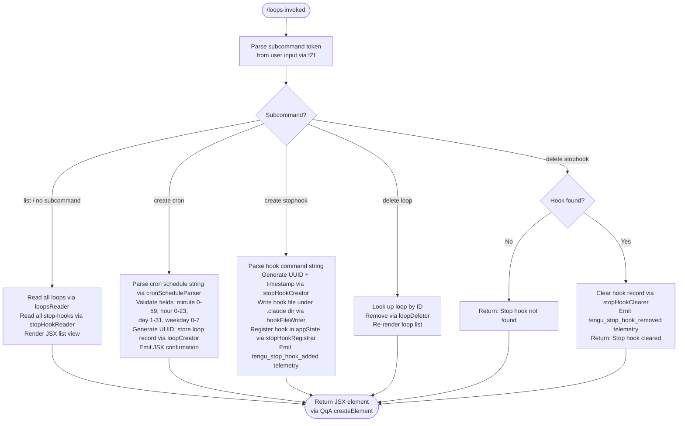

# `/loops`

> Analysis basis: CC v2.1.161 bundle.js (AST extraction + Claude interpretation)
> Minimum version: v2.1.161

---

## Overview

The `/loops` command is the management interface for Claude Code's recurring-loop and stop-hook subsystem. It allows users to list all active loops and stop-hooks, create new recurring cron-style loops or stop-hooks, and delete existing entries. Internally it renders as a JSX component (`local-jsx` type) and dispatches to an async handler (`MZf`) that coordinates with the background-daemon layer and the application's state store.

---

## Registration

| Field | Value |
|---|---|
| type | `local-jsx` |
| name | `loops` |
| description | `List, create, and delete recurring loops and stop-hooks` |
| loc_byte | `12360902` |
| loc_byte_end | `12361084` |
| loc_line | `8645` |
| immediate | `true` |
| module_id | `Ht1` |
| load_inline | `true` |
| arbor_handler.name | `MZf` |
| arbor_handler.fqn | `claude-2.1.161::MZf` |
| arbor_handler.kind | `AsyncFunction` |
| arbor_handler.resolution_path | `module_id` |
| arbor_handler.n_hits | `0` |

Analysis basis: CC v2.1.161 bundle.js:+12360902

---

## Input Branching

The command entry-point (`MZf`) branches across at least five distinct operational paths depending on the subcommand token parsed from user input. A Mermaid flowchart is required.



---

## Behavioral Spec

### 1. Entry Point and Telemetry Emission

```
async function loopsCommandHandler(context):
    emit telemetry event "tengu_loops_command"           // bundle.js:+12359859
    appState = getAppState()
    loops    = await readLoopsFromDaemon(context)        // calls loopsReader (l8H)
    hookList = await readStopHooks(context)              // calls stopHookReader (PIH)
    token    = parseSubcommandToken(userInput)           // calls subcommandParser (fZf)
    dispatch to appropriate sub-handler based on token
    return QqA.createElement(...)                        // JSX render
```

Analysis basis: CC v2.1.161 bundle.js:+12359857–12359909

---

### 2. Cron Schedule Parsing (`fZf`)

```
function parseCronSchedule(rawInput):
    trimmedInput = rawInput.trim()
    if trimmedInput matches "Every minute" label:        // literal bundle.js:+4841865
        return { minute: "*", hour: "*", ... }
    if trimmedInput matches "Every hour" label:          // literal bundle.js:+4842082
        return { minute: "0", hour: "*", ... }
    parts = split(trimmedInput)
    minute = parseInt(parts[0])
    if minute > 59: clamp to 59                          // literal bundle.js:+12359624
    if minute > 60: raise error                          // literal bundle.js:+12359590
    hour = parseInt(parts[1])
    if hour > 23: raise error                            // literal bundle.js:+12359695
    day  = parseInt(parts[2])
    if day > 31: raise error                             // literal bundle.js:+12359748
    apply Math.max / Math.ceil / Math.round rounding
    validate weekday token "1-5" pattern                 // literal bundle.js:+4842789
    return parsed schedule object
```

Analysis basis: CC v2.1.161 bundle.js:+12359445

---

### 3. Loop List Retrieval (`loopsReader` / `l8H` + `PIH`)

```
async function readLoopsFromDaemon(context):
    configDir = resolveConfigDir(context)                // calls configDirResolver (tK/rLH)
    raw       = await fs.readFile(configDir, "utf-8")    // literal bundle.js:+4844001
    if not Array.isArray(parsed):
        return []
    filteredLoops = parsed.filter(validLoopShape)
    for each loop entry:
        loopLine = buildLoopDisplayLine(loop)            // calls displayLineBuilder (kI/iQL)
        result.push(loopLine)
    return result
```

File errors with codes `ENOENT`, `EACCES`, `EPERM`, `ENOTDIR`, `ELOOP`, `EROFS` are handled gracefully and return an empty list (literals bundle.js:+175129–175198).

Analysis basis: CC v2.1.161 bundle.js:+4845961

---

### 4. Stop-Hook Retrieval (`PIH`)

```
async function readStopHooks(context):
    configPath = buildConfigPath()
    raw        = await _.readFile(configPath)
    parsed     = safeJsonParse(raw)                      // calls jsonSafeParse (m6) → JSON.parse
    if not Array.isArray(parsed): return []
    hooks = parsed.filter(isValidHook)
    for each hook:
        hookEntry = buildHookEntry(hook)                 // calls hookEntryBuilder (yH)
        log errors via ri.logError if malformed          // bundle.js:+972355
    return hooks
```

Analysis basis: CC v2.1.161 bundle.js:+4843954

---

### 5. Loop Creation for `cron` type

```
async function createLoop(schedule, context):
    uuid      = $39.randomUUID()                         // bundle.js:+4845301
    timestamp = Date.now()                               // bundle.js:+4845363
    record    = buildLoopRecord(uuid, timestamp, schedule, type="cron")
                                                         // literal "cron" bundle.js:+12359955
    await persistLoopRecord(record)                      // calls loopPersister (PIH path)
    pushToLoopList(record)                               // calls M.push bundle.js:+4845466
    notifyDaemon()                                       // calls notifier (N6) bundle.js:+4845498
    writeHookFile()                                      // calls hookFileWriter (BiH/Zr) bundle.js:+4845560
    return updated loop list
```

Analysis basis: CC v2.1.161 bundle.js:+4845301

---

### 6. Stop-Hook Creation

```
async function createStopHook(command, context):
    uuid      = $39.randomUUID()
    timestamp = Date.now()
    record    = { id: uuid, command: command, createdAt: timestamp, type: "stophook" }
                                                         // literal "stophook" bundle.js:+12360041
    hookDir   = joinPath(".claude", ...)                 // literal ".claude" bundle.js:+4845142
    await fs.mkdir(hookDir, { recursive: true })
    await fs.writeFile(hookFilePath, serialized)
    updateAppState(appState, record)                     // calls stopHookRegistrar (G_6/E_6)
    emit telemetry "tengu_stop_hook_added"               // bundle.js:+10682622
    return confirmation message "Stop hook set"          // literal bundle.js:+12360619
```

Analysis basis: CC v2.1.161 bundle.js:+12360507

---

### 7. Stop-Hook Deletion

```
async function deleteStopHook(hookId, appState):
    hook = lookupHookById(hookId, appState)
    if hook is null or undefined:
        return "Stop hook not found"                     // literal bundle.js:+12360301
    clearHookRecord(appState, hookId)                    // calls stopHookClearer (G_6 path)
    emit telemetry "tengu_stop_hook_removed"             // bundle.js:+10682990
    return "Stop hook cleared"                           // literal bundle.js:+12360323
```

Analysis basis: CC v2.1.161 bundle.js:+12360283

---

### 8. Display Line Builder for Loops (`kI` / `iQL`)

```
function buildLoopDisplayLine(loopRecord):
    trimmed    = loopRecord.trim()
    parts      = parseScheduleParts(trimmed)             // iQL: H.split, L.match
    minute     = parseInt(parts.minute)                  // bundle.js:+4840059
    col width  = 5                                       // literal bundle.js:+4840610
    fieldSet   = Array.from(...)                         // bundle.js:+4840522
    dayOfWeek  constants: 3, 6, 7, 4, 10                // literals bundle.js:+4840235,4840271,4840277,4840773,4840073
    padded     = field.padEnd(40)                        // literal bundle.js:+15930336, spacing "  " bundle.js:+15928365
    return formatted display line
```

Analysis basis: CC v2.1.161 bundle.js:+4840574

---

### 9. App State Mutation for Stop Hooks (`G_6` and `E_6`)

```
function registerStopHookInAppState(context, record):
    current = context.getAppState()                      // bundle.js:+10682735
    updated = applyMessageOp(current, {                  // bundle.js:+10682933
        op:   "append",                                  // literal bundle.js:+10682956
        type: "attachment",                              // literal bundle.js:+10683062
        goal: record.goal                                // literal "goal" bundle.js:+10683021
    })
    uuid    = generateUUID()                             // rk1 → lk1.randomUUID bundle.js:+10683080
    context.setAppState(updated)                         // bundle.js:+10682864
    emit telemetry "tengu_stop_hook_added"

function clearStopHookInAppState(context, hookId):
    current = context.getAppState()                      // bundle.js:+10682321
    updated = applyMessageOp(current, { op: "remove", id: hookId })
    context.setAppState(updated)                         // bundle.js:+10682523
    emit telemetry "tengu_stop_hook_removed"
    if hooks_gate check fails:                           // literal "hooks_gate" bundle.js:+10682132
        skip                                             // literal "skip" bundle.js:+12360768
    if trust_gate check fails:                           // literal "trust_gate" bundle.js:+10682186
        skip
```

Analysis basis: CC v2.1.161 bundle.js:+10682724

---

### 10. Hook File Writer (`BiH`)

```
async function writeHookFile(hooks, configDir):
    targetDir  = joinPath(configDir, ".claude")          // literal bundle.js:+4845142
    await fs.mkdir(targetDir, { recursive: true })       // bundle.js:+4845121
    serialized = JSON.stringify(hooks)
    await fs.writeFile(hookFilePath, serialized)         // bundle.js:+4845218
    configPath = buildConfigPath(...)                    // rLH path bundle.js:+4845232
```

Analysis basis: CC v2.1.161 bundle.js:+4845110

---

### 11. Daemon Interaction and Background Worker Coordination (`w` / `XOA` / `DOA`)

The `/loops` handler touches the background daemon layer when creating or deleting loops that require scheduling. Key daemon lifecycle states observed in the call graph:

- Worker states tracked: `"done"`, `"killed"`, `"stopped"`, `"failed"`, `"crashed"`, `"blocked"`, `"working"`, `"bg"`, `"idle"`, `"active"`, `"resuming"` (literals bundle.js:+15909706–15911487)
- Daemon mode strings: `"daemon"`, `"supervisor"`, `"transient"`, `"spare"`, `"exec"` (literals bundle.js:+15910535, 15918204, 15923081, 15905279, 15905393)
- Low-memory threshold: 1024 MB on macOS (literal bundle.js:+12883202); triggers `tengu_bg_dispatch_low_mem`
- SIGKILL escalation after SIGTERM timeout: 30 s / 15 s intervals (literals bundle.js:+15904464, 15904475)
- Cleanup timeout on idle workers: 300 000 ms (5 minutes) (literal bundle.js:+15911273)
- Daemon socket protocol uses `Buffer.allocUnsafe`, `writeUInt32BE`, `writeUInt8` framing (bundle.js:+10914100–10914168)

Analysis basis: CC v2.1.161 bundle.js:+15904391

---

## State & Side Effects

| Item | Detail |
|---|---|
| Telemetry — primary | `tengu_loops_command` (bundle.js:+12359859) — fired on every invocation |
| Telemetry — stop-hook added | `tengu_stop_hook_added` (bundle.js:+10682622) |
| Telemetry — stop-hook removed | `tengu_stop_hook_removed` (bundle.js:+10682990) |
| Telemetry — daemon bg | `tengu_bg_dispatch_sigkill_escalate`, `tengu_bg_dispatch_low_mem`, `tengu_bg_spare_enable`, `tengu_bg_spare_claim`, `tengu_bg_spare_claim_fail`, `tengu_bg_sendclaim_failed` |
| Telemetry — daemon lifecycle | `tengu_daemon_config_reload`, `tengu_daemon_yield`, `tengu_daemon_control`, `tengu_daemon_stop`, `tengu_daemon_stop_failed` |
| Telemetry — feature gate | `tengu_feature_ok`, `tengu_feature_bad`, `tengu_feature_sad` |
| Telemetry — misc | `tengu_bg_low_mem_mb`, `tengu_bg_state_read_transient`, `tengu_stop_hook_removed`, `tengu_skill_file_changed` |
| appState changes | Stop-hook records appended/removed via `applyMessageOp` with op `"append"` or remove; `goal_status` and `goal_set` goal fields updated (literals bundle.js:+10683149, 10682264) |
| File system writes | Hook configuration serialized to JSON and written under `.claude/` directory |
| File system reads | Loop list and stop-hook list read as UTF-8 JSON files; graceful handling of ENOENT/EACCES/EPERM/ENOTDIR/ELOOP/EROFS |
| Hook registration | Stop-hooks registered in the background daemon roster (`_.rosterEntry` bundle.js:+15911015) |
| Daemon socket | IPC frame sent over Unix socket (`Mp8.connect`, length-prefixed binary protocol) when claiming a spare worker |
| Sound | <!-- TODO: not found in depth-2 traversal; needs --depth 4 --> |
| JSX render | Returns `QqA.createElement(...)` element (bundle.js:+12360662) for the CLI's interactive TUI layer |

---

## Version History

| Version | Change |
|---|---|
| v2.1.161 | Initial analysis — `local-jsx` command registered at bundle line 8645; handler `MZf` resolved via `module_id` path through module `Ht1` |

---

## Common Mistakes

1. **Confusing loops with background tasks**: `/loops` manages _recurring scheduled loops_ and _stop-hooks_, not arbitrary background task sessions. Use `/bg` or the daemon control surface for one-off background work.
2. **Invalid cron field ranges**: Minute must be 0–59, hour 0–23, day 1–31. Values outside these ranges are clamped or rejected by `cronScheduleParser` (`fZf`). Passing free-form English descriptions other than `"Every minute"` or `"Every hour"` will fail parsing.
3. **Expecting synchronous confirmation**: The handler is `async`; hook file writes and daemon notifications happen asynchronously. The JSX element may render before the underlying file write completes.
4. **Deleting a non-existent hook**: Passing an unknown hook ID returns the literal `"Stop hook not found"` string — this is not an error throw but a silent text response. Callers that check for exceptions will miss this failure mode.
5. **Assuming hooks persist across project resets**: Stop-hook files are written under the `.claude/` subdirectory of the project config root. Removing or re-initializing that directory will erase all registered stop-hooks.
6. **Forgetting the `immediate: true` flag**: This command renders immediately without waiting for any agent turn, which means it is available even when no conversation is active. Assuming it requires an open session will cause confusion.

---

## Appendix — Identifier Mapping

> For bundle debugging only. Identifiers change across versions.

| Identifier | Role |
|---|---|
| `MZf` | Main async handler for `/loops` command (entry point) |
| `l8H` | Loops reader — reads active loop records from daemon/config |
| `PIH` | Stop-hook reader — reads stop-hook list from config file |
| `rLH` | Config path resolver — joins config directory path segments |
| `tK` | Config directory resolver (calls `XN`) |
| `K9` | Utility calling `v8` (error-code helper) |
| `yH` | Hook entry builder — validates and structures individual hook entries |
| `a_` | Error type classifier |
| `pH` | String coercion helper |
| `r9` | Essential-traffic filter helper (calls `qkA`) |
| `s44` | Queue shift/push helper (sliding window on `lg6`) |
| `VBK` | Loop record validator (calls `qy`, `ZBK`, `HwA`) |
| `SH` | JSON serialization helper (`JSON.stringify` wrapper) |
| `Z4` | Path/string formatter (slice, lastIndexOf, replace) |
| `imH` | Display formatter calling `GJA` |
| `IBK` | Loop record persistence writer (file I/O, byte-length check) |
| `kI` | Loop display line builder (trims, parses, pads) |
| `iQL` | Schedule field tokenizer (split, match, parseInt, Set operations) |
| `UE` | Secondary utility calling `XN` |
| `W_6` | Loop list builder / column pad helper (calls `ZXH`, `A.push`) |
| `ZXH` | Column-width setter (`K.set`, calls `of1`) |
| `of1` | Map helper over loop array (`H.map`) |
| `N6` | Notification / update helper (calls `XN`) |
| `Av` | Cron schedule interpreter — parses schedule string, handles "Every minute/hour", weekday calc |
| `w` | Background worker / daemon session object — SIGKILL, memory checks, spawn, dispose |
| `S` | Worker write wrapper — `D.write`, calls `d` |
| `D` | Daemon supervisor — config reload, start/stop, state transitions |
| `RH` | Feature-bad reporter (calls `d`, `h1H`; emits `tengu_feature_bad`) |
| `h1H` | Feature result helper (calls `Xa8`) |
| `hH` | Feature-ok reporter (calls `d`, `h1H`; emits `tengu_feature_ok`) |
| `ER8` | Memory threshold checker on macOS (calls `i6`, `j6`) |
| `j6` | Low-memory dispatch helper (emits `tengu_bg_low_mem_mb`, manages `BY6`, `CU`) |
| `rj6` | Pin file reader (`pins.json` — reads and filters pinned sessions) |
| `m0_` | Pin file path builder (`w2.join`, `vG`) |
| `m6` | Safe JSON parse wrapper (`JSON.parse`) |
| `k8` | File-error code classifier (calls `v8`) |
| `WbL` | Directory loop scanner — reads subdirs, loads per-entry files, builds hook entries |
| `DOA` | Daemon claim/connect handler — IPC socket connection, send-claim frame |
| `FLA` | Daemon roster entry writer (mkdir, writeFile, JSON.stringify) |
| `q95` | Send-claim loop — timeout, retry, ECONNREFUSED handling, emits `tengu_bg_sendclaim_failed` |
| `A95` | Claim frame builder (`Mg.buildClaimFrame`) |
| `df` | Value validator (calls `v8`) |
| `TH` | String coercion wrapper |
| `SF` | Binary frame serializer (Buffer alloc, writeUInt32BE, writeUInt8, copy) |
| `XOA` | Worker lifecycle manager — manages done/killed/crashed/idle/daemon states, file cleanup, roster |
| `aK` | Worker config path builder (`w2.join`, `vG`) |
| `q1` | Worker state reader — stat, JSON parse, cache management (`NLH`, `rYH`) |
| `lD` | Active-state helper (calls `nV`) |
| `W5` | State serializer/writer (`SH`, `Fj`, `w2.join`) |
| `e_6` | Execution wrapper with timing (`Date.now`, `Kzf`, catch) |
| `n5H` | Hook path helper (`F3.join`, `HbH`) |
| `AT` | Hook path splitter (`F3.join`, `HbH`, `H.split`) |
| `mF` | Hook metadata helper (`gHA`, `F3.join`, `s_6`) |
| `nk6` | Hook directory creator (`F3.join`, `cHA`) |
| `Y` | Forced-shutdown handler (`process.exit`, `z.abort`, emits "forced shutdown") |
| `WJ` | Shutdown message emitter |
| `z` | Abort controller / daemon stop (calls `hH`, `RH`, `ly`, `qp`; emits `tengu_daemon_stop`) |
| `C` | Rate-limit event emitter / chokidar watcher disposer |
| `_o1` | Watcher cleanup helper |
| `y` | Event queue / chokidar file watcher |
| `j` | Worker kill iterator (`A.values`, `y.kill`) |
| `$` | Worker process handle (calls `y_K`) |
| `y_K` | Daemon status file writer (`daemon.status.json`, `Date.now`, `Fh6`, `SH`) |
| `Zr` | Hook key hasher / content hash helper (calls `hKH`) |
| `$1` | AsyncLocalStorage store accessor (`yRL.getStore`) |
| `Fh6` | Status file path builder (`k_K.join`, `r8`) |
| `J` | Date object for weekday/UTC date arithmetic |
| `c8H` | Loop + stop-hook combiner — validates via `Ve`, reads via `PIH`, filters, writes via `BiH` |
| `Ve` | Loop-has-property checker (`_.has`) |
| `BiH` | Hook file writer — mkdir under `.claude/`, map entries, writeFile, serialize |
| `G_6` | App-state stop-hook registrar — getAppState / setAppState / applyMessageOp / rk1 |
| `rk1` | UUID generator for appState records (`lk1.randomUUID`) |
| `fZf` | Subcommand and cron-schedule parser — parseInt, Math.max/ceil/round, delegates to `kI` |
| `FiH` | Loop record creator — UUID, timestamp, `PEH`, `PIH`, push, notify, write hook file |
| `PEH` | Loop record field validator/builder |
| `M` | Plugin/loop path validator (`nC6`, `f.has`, `w0.rm`) |
| `nC6` | Plugin name resolver — lowercase, path safety, `.staging` check |
| `iC6` | Plugin path canonicalizer (`ck.join`, `r8`) |
| `E_6` | Stop-hook appState updater — full pipeline with trust/hooks gate, setAppState, telemetry |
| `ts_` | Gate/policy evaluator (`xU`, `CY`, `B_`, `a7`; checks `hooks_gate`, `trust_gate`) |
| `xU` | Policy settings accessor (calls `m8` with key `"policySettings"`) |
| `m8` | Settings store reader (`xd6`, `TQ`) |
| `CY` | Policy renderer (calls `m8`, `VA`) |
| `B_` | Gate boolean resolver |
| `a7` | Hook trust evaluator (calls `yXL`) |
| `yXL` | Trust level resolver (`pH`, `wmH`, `W9`, `y6`, `zcH`, `jQ`, `h6`, `RY.resolve`) |
| `t6` | Feature-sad reporter (calls `d`, `h1H`; emits `tengu_feature_sad`) |
| `Yj` | Output-token accumulator (calls `_mH`, `Object.values`; key `"outputTokens"`) |

---

Note: index built via Arbor fallback; some signals (telemetry, literals) may be missing — see arbor-fallback.js.