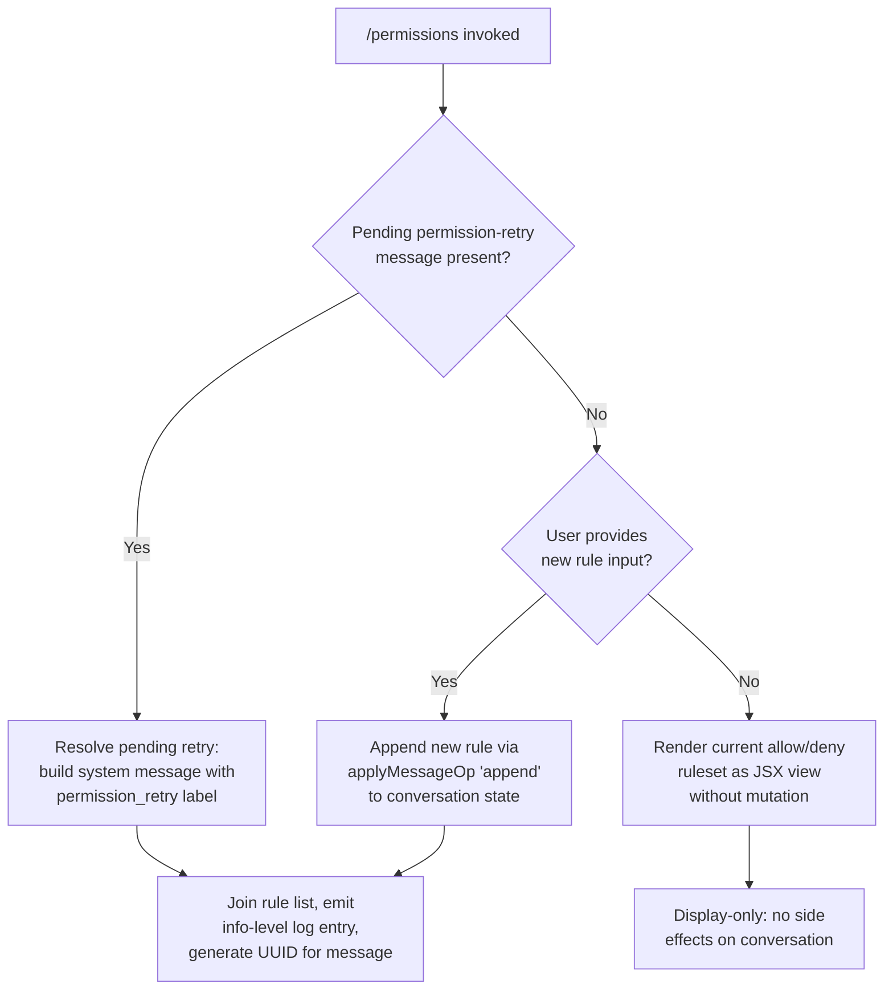

# `/permissions`

> Analysis basis: CC v2.1.161 bundle.js (AST extraction + Claude interpretation)
> Minimum version: v2.1.161

---

## Overview

The `/permissions` command (also accessible as `/allowed-tools`) provides an interactive JSX-rendered interface for viewing and managing the allow and deny rules that govern which tools Claude Code may invoke. It presents the current permission ruleset and allows the user to append new rules, resolve pending permission-retry requests, and inspect the active configuration without leaving the CLI session.

---

## Registration

| Field | Value |
|---|---|
| type | `local-jsx` |
| name | `permissions` |
| description | `Manage allow & deny tool permission rules` |
| aliases | `["allowed-tools"]` |
| module_id | `ra1` |
| load_inline | `true` |
| loc_byte | `12295598` |
| loc_byte_end | `12295768` |
| loc_line | `8547` |
| arbor_handler.name | `ITf` |
| arbor_handler.fqn | `claude-2.1.161::ITf` |
| arbor_handler.kind | `AsyncFunction` |
| arbor_handler.resolution_path | `module_id` |
| arbor_handler.n_hits | `0` |

Analysis basis: CC v2.1.161 bundle.js:+12295598

---

## Input Branching

The command handler (`ITf`) follows three meaningful paths depending on the current permission state and any pending retry context:



Analysis basis: CC v2.1.161 bundle.js:+12295416 (JSX render), +12295469 (applyMessageOp), +12295492 (literal `"append"`), +10632289 (literal `"permission_retry"`), +10632272 (literal `"system"`), +10632359 (literal `"info"`)

---

## Behavioral Spec

### Handler Entry Point — `permissionsCommandHandler` (`ITf`)

The async handler is resolved via `module_id` → `ra1` → export `ITf`.

```
async function permissionsCommandHandler(context):
    element = createElement(PermissionsView, context)

    if hasPendingPermissionRetry(context):
        retryMessage = buildPermissionRetrySystemMessage(context)
        // retryMessage carries role="system", label="permission_retry"
        applyMessageOp(conversation, "append", retryMessage)
        logInfo(formatPermissionRuleList(context.rules))
        return element

    if userProvidedNewRule(context.args):
        newRuleMessage = buildRuleAppendMessage(context.args)
        applyMessageOp(conversation, "append", newRuleMessage)
        return element

    // Default: render current ruleset read-only
    return element
```

Analysis basis: CC v2.1.161 bundle.js:+12295416, +12295469, +12295492

---

### Rule List Formatter — `formatPermissionRuleList` (`Dk1`)

Called to produce a human-readable summary of active permission rules before appending any system message.

```
function formatPermissionRuleList(rules):
    joined = rules.join(", ")          // separator literal ", "
    id    = crypto.randomUUID()        // fresh UUID per invocation
    logEntry = { level: "info", id: id, body: joined }
    return logEntry
```

Analysis basis: CC v2.1.161 bundle.js:+10632327 (`H.join`), +10632334 (literal `", "`), +10632359 (literal `"info"`), +10632416 (`gv.randomUUID`)

---

### Permission Config Reader — `readPermissionConfig` (`N`)

Reads the on-disk or in-memory permission configuration and normalises each rule entry.

```
function readPermissionConfig(source):
    raw = fetchConfigSource(source)     // may call e46 or VBK

    for each entry in raw:
        if entry matches debug-level marker:        // literal "debug" at +204573
            logDebug(entry)
        normalised = normaliseRuleEntry(entry)      // calls Z4, imH, IBK
        if source.includes(normalised.key):
            serialised = serialiseEntry(normalised) // SH → JSON.stringify
        result.push(normalised)

    return result
```

Analysis basis: CC v2.1.161 bundle.js:+204597, +204615, +204637, +204655, +204573

---

### Rule Entry Normaliser — `normaliseRuleEntry` (`Z4`)

Canonicalises a single permission rule string.

```
function normaliseRuleEntry(raw):
    // Index 0 is the action (allow/deny)
    action = raw[0]                         // q.at index 0 at +196763
    cleaned = raw.replace(pattern, "")      // strip noise chars at +196653
    if cleaned contains sensitive segment:
        cleaned = cleaned.replace(segment, "[REDACTED]")  // +196705
    // Split at last separator to isolate tool name
    separatorIdx = cleaned.lastIndexOf(delimiter)         // +196789
    toolPart     = cleaned.slice(separatorIdx + 1)        // +196815
    return { action, tool: toolPart, raw: cleaned }
```

Analysis basis: CC v2.1.161 bundle.js:+196626, +196631, +196653, +196705, +196734, +196763, +196789, +196815

---

### Permission File Writer — `writePermissionConfig` (`IBK`)

Persists a modified permission ruleset back to the configuration file, with safety limits.

```
async function writePermissionConfig(rules, configPath):
    dir = path.dirname(configPath)          // he.dirname at +204119
    ensureDir(dir)                          // _3H / WmH at +204086, +204111

    serialised = serialiseRules(rules)      // qy at +204148, F6 at +204163
    byteLen = Buffer.byteLength(serialised) // +204293

    // Hard limits
    if byteLen > 1000:                      // literal 1000 at +204404
        throw SizeError("config too large")
    if rules.length > 100:                  // literal 100 at +204423
        throw CountError("too many rules")

    temp = writeTempFile(serialised)        // d46 at +204238
    validate = validateFormat(temp)         // BJA at +204255, UJA at +204287
    await validate.then(commitFile)         // vm6.then at +204343
    await retryWithBackoff(commitFile,      // NBK.bind at +204352
                           maxRetries: Y9)
```

Analysis basis: CC v2.1.161 bundle.js:+204086, +204111, +204119, +204148, +204163, +204238, +204255, +204287, +204293, +204326, +204343, +204352, +204404, +204423, +204448

---

### Model-Name Normaliser — `normaliseModelName` (`s9`)

Used when a permission rule references a model shorthand.

```
function normaliseModelName(name):
    trimmed = name.trim().toLowerCase()
    // Shorthand resolution table:
    //   "opusplan" → internal opus-planning model  (+2236154)
    //   "[1m]"     → 1-million-token context tier  (+2236180)
    //   "sonnet"   → sonnet family                 (+2236195)
    //   "haiku"    → haiku family                  (+2236234)
    //   "opus"     → opus family                   (+2236273)
    //   "best"     → highest-capability available  (+2236310)
    canonical = lookupShorthand(trimmed)
    if not canonical:
        canonical = applyReplacementRules(trimmed)  // NKH, aN, CgH, KG, Xwq, UM, Us6, bgH
    return canonical
```

Analysis basis: CC v2.1.161 bundle.js:+2236058, +2236069, +2236087, +2236097, +2236133, +2236154, +2236172, +2236180, +2236195, +2236234, +2236249, +2236273, +2236287, +2236310, +2236324, +2236342, +2236348, +2236356, +2236400

---

### Bootstrap Fetch Helper — `bootstrapFetch` (`H`)

Fetches remote configuration data required to build the permissions view; called transitively from the command handler's JSX initialisation path.

```
async function bootstrapFetch(url, opts):
    log("[Bootstrap] Fetching", url)           // literal at +15504122
    headers = {
        "Content-Type": "application/json",    // +15504207, +15504222
        "User-Agent":   agentString            // +15504241
    }
    timeout = 5000                             // ms, literal at +15504313

    response = await fetchWithTimeout(url, headers, timeout)

    if not response.ok:
        emitTelemetry("api_bootstrap_fetch",   // +15504434
                      { result: "parse_failed" })  // +15504456
        throw ParseError(response)

    log("[Bootstrap] Fetch ok")                // literal at +15504486
    return response.json()
```

Analysis basis: CC v2.1.161 bundle.js:+15504120, +15504122, +15504158, +15504207, +15504222, +15504241, +15504254, +15504284, +15504295, +15504298, +15504313, +15504322, +15504431, +15504434, +15504456, +15504486

---

### Sad-Path Telemetry Hook — `reportSadFeaturePath` (`t6`)

Fires the `tengu_feature_sad` event when an error or degraded code-path is encountered within the permissions workflow.

```
function reportSadFeaturePath(context, reason):
    emitTelemetry("tengu_feature_sad", {      // +966732
        feature: "permissions",
        reason:  reason
    })
    captureException(context, reason)         // h1H → Xa8 at +966417
```

Analysis basis: CC v2.1.161 bundle.js:+966730, +966732, +966766, +966417

---

### Entry Serialiser — `serialiseEntry` (`SH`)

Converts a normalised permission entry to its wire/storage representation.

```
function serialiseEntry(entry):
    return JSON.stringify(entry)    // +184155
```

Analysis basis: CC v2.1.161 bundle.js:+184155

---

## State & Side Effects

| Item | Detail |
|---|---|
| Telemetry | `tengu_feature_sad` (fired on error/sad paths within the permissions workflow; bundle.js:+966732) |
| Telemetry | `api_bootstrap_fetch` with `parse_failed` result (fired when remote config fetch fails; bundle.js:+15504434) |
| Conversation mutation | `applyMessageOp("append", …)` appends a `system`-role message labelled `permission_retry` when a pending retry is present (bundle.js:+12295469, +12295492, +10632289) |
| Config file write | `writePermissionConfig` persists updated rules to disk with hard limits: max byte size 1000, max rule count 100 (bundle.js:+204404, +204423) |
| UUID generation | `crypto.randomUUID()` called per rule-list log entry (bundle.js:+10632416) |
| Network I/O | Bootstrap fetch to remote endpoint with 5 000 ms timeout (bundle.js:+15504313) |
| Logging | Info-level log entry emitted with joined rule list (bundle.js:+10632359) |
| Sensitive data redaction | Rule strings containing sensitive segments are replaced with `[REDACTED]` before storage or display (bundle.js:+196705) |

---

## Version History

| Version | Change |
|---|---|
| v2.1.161 | Initial analysis |

---

## Common Mistakes

1. **Invoking `/permissions` expecting immediate rule enforcement** — the command renders the current ruleset and appends new rules to the conversation state, but enforcement is applied on subsequent tool calls, not retroactively on the current turn.
2. **Exceeding the rule count or size limits** — `writePermissionConfig` will throw if the serialised config exceeds 1 000 bytes or 100 rules (bundle.js:+204404, +204423). Users managing large whitelists should consolidate wildcard patterns rather than listing every tool variant individually.
3. **Assuming `/allowed-tools` behaves differently** — the alias `allowed-tools` resolves to exactly the same handler (`ITf`); there is no behavioural difference.
4. **Expecting model-name rules to accept arbitrary strings without normalisation** — model shorthand names (`opus`, `sonnet`, `haiku`, `best`, `opusplan`, `[1m]`) are normalised through a replacement table before matching; non-canonical names may silently fail to match (bundle.js:+2236154–+2236310).
5. **Ignoring the `permission_retry` system message** — if a prior tool request was denied and a retry is pending, invoking `/permissions` will inject a `system`-role `permission_retry` message into the conversation. Users who do not intend to resolve the retry should dismiss it explicitly before running the command.

---

## Appendix — Identifier Mapping

> For bundle debugging only. Identifiers change across versions.

| Identifier | Role |
|---|---|
| `ITf` | Main async handler for `/permissions` command (`permissionsCommandHandler`) |
| `Dk1` | Rule list formatter; joins rules and generates UUID log entry |
| `H` | Bootstrap fetch orchestrator; fetches remote permission config |
| `N` | Permission config reader; normalises rule entries from source |
| `VBK` | Config source resolver; dispatches to sub-readers |
| `SH` | Entry serialiser; wraps `JSON.stringify` for rule objects |
| `Z4` | Rule entry normaliser; canonicalises raw rule strings |
| `imH` | Sub-normaliser helper (delegates to `GJA`) |
| `IBK` | Permission config file writer; enforces byte/count limits |
| `s$` | Bootstrap fetch sub-utility |
| `ne` | Membership-check helper (`WA4.has`) |
| `Ij` | String replacement utility (`H.replace` wrapper) |
| `lq` | Tool-name parser orchestrator; delegates to `xHH`, `s9`, `xP` |
| `xHH` | Token-level tool-name parser (calls `NT`, `o9H`, `VA`, `nQ`) |
| `s9` | Model-name normaliser; resolves shorthands to canonical names |
| `xP` | Composite parser combining `s9` and `b0` |
| `t6` | Sad-path telemetry reporter; fires `tengu_feature_sad` |
| `d` | Exception capture entry point (called by sad-path reporter) |
| `h1H` | Exception capture helper; delegates to `Xa8` |

---

*Note: index built via Arbor fallback; some signals (telemetry, literals) may be missing — see arbor-fallback.js.*