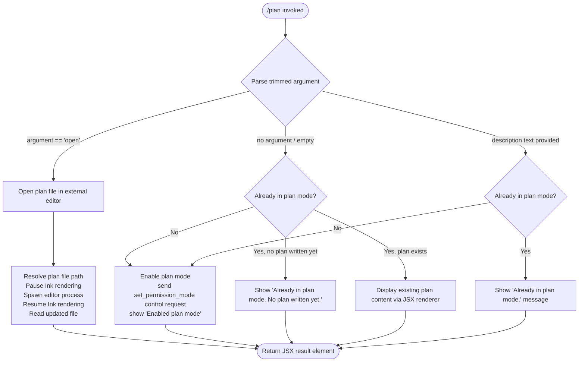

# `/plan`

> Analysis basis: CC v2.1.161 bundle.js (AST extraction + Claude interpretation)
> Minimum version: v2.1.161

---

## Overview

The `/plan` command enables **plan mode** for the current Claude Code session or displays the existing session plan. When invoked without arguments or with a description, it activates a read-only planning permission mode that prevents tool use from bypassing normal permission checks; when invoked with the `open` keyword, it opens the current session plan file in an external editor.

---

## Registration

| Field | Value |
|---|---|
| type | `local-jsx` |
| name | `plan` |
| description | `Enable plan mode or view the current session plan` |
| argumentHint | `[open\|<description>]` |
| module_id | `ea1` |
| load_inline | `true` |
| loc_byte | `12297722` |
| loc_byte_end | `12297921` |
| loc_line | `8547` |
| arbor_handler.name | `hTf` |
| arbor_handler.fqn | `claude-2.1.161::hTf` |
| arbor_handler.kind | `AsyncFunction` |
| arbor_handler.resolution_path | `module_id` |
| arbor_handler.n_hits | `0` |

Analysis basis: CC v2.1.161 bundle.js:+12297722

---

## Input Branching

Four distinct branches exist based on argument content and current mode state, requiring a Mermaid flowchart.



Analysis basis: CC v2.1.161 bundle.js:+12296523, +12296800, +12297092, +12297111, +12296862, +12296890, +12297270

---

## Behavioral Spec

### 1. Handler Entry Point (`hTf`)

The Arbor-resolved handler is `hTf`, an `AsyncFunction` reached via `module_id` resolution (`ea1`).

```
async function planCommandHandler(options):
    sessionState   = getSessionState(options)        // OL / rE
    permissionMode = getCurrentPermissionMode()      // Ne
    toolState      = getToolState()                  // K
    planStore      = getPlanStore()                  // Y$
    renderContext  = getRenderContext()              // fSH

    trimmedArg = options.argument.trim()             // A.trim

    if trimmedArg == "open":
        return openPlanInEditor(options)             // CZ branch

    if permissionMode already "plan":
        if no plan written yet:
            return messageResult("Already in plan mode. No plan written yet.")
        else:
            return displayCurrentPlan()
    else:
        enablePlanMode(options)                      // sendControlRequest
        return messageResult("Enabled plan mode")
```

Analysis basis: CC v2.1.161 bundle.js:+12296523, +12296556, +12296567, +12296587, +12296600, +12296636, +12296639, +12296723, +12296800, +12296850, +12296860, +12297092

---

### 2. Permission Mode Activation

When the session is not yet in plan mode, the handler sends a `set_permission_mode` control request to the agent. The literal string `"set_permission_mode"` confirms this as the request type.

```
function enablePlanMode(options):
    sendControlRequest("set_permission_mode", { mode: "plan" })   // M.sendControlRequest
    logInfo("Enabled plan mode")
    return buildInfoMessage("Enabled plan mode")
```

- Literal `"set_permission_mode"` at bundle.js:+12296753
- Literal `"Enabled plan mode"` at bundle.js:+12296862
- Literal `"Already in plan mode."` at bundle.js:+12296890

Analysis basis: CC v2.1.161 bundle.js:+12296723, +12296753

---

### 3. Already-In-Plan-Mode Guard

Two distinct already-in-plan-mode messages are present:

| Condition | Message |
|---|---|
| In plan mode, plan written | Displays current plan content |
| In plan mode, no plan yet | `"Already in plan mode. No plan written yet."` |
| In plan mode (generic/description arg) | `"Already in plan mode."` |

- Literal `"Already in plan mode."` at bundle.js:+12296890
- Literal `"Already in plan mode. No plan written yet."` at bundle.js:+12297270

Analysis basis: CC v2.1.161 bundle.js:+12296890, +12297270

---

### 4. Open Plan in External Editor (`CZ` / `RZ` branch)

When the argument is the literal `"open"`, the handler resolves the plan file path, pauses the Ink terminal renderer, spawns a synchronous editor subprocess, then resumes rendering and reads the updated file.

```
async function openPlanInEditor(options):
    planFilePath = resolvePlanFilePath()        // RZ -> tXH: path joining via fg.join, N6, p$H
    encoding     = "utf-8"                      // literal at +13096344

    // Pause terminal UI
    inkInstance  = getInkInstance()            // BF -> DL.get
    if not inkInstance:
        throw Error("Ink instance not found - cannot pause rendering")
    inkInstance.enterAlternateScreen()
    inkInstance.pause()
    inkInstance.suspendStdin()

    // Detect and launch editor
    editorArgs = buildEditorArgs(planFilePath) // BF -> L.split, f.slice
    result     = spawnEditorSync(editorArgs,   // Sm1.spawnSync
                     { stdio: "inherit" })

    // Restore terminal UI
    inkInstance.exitAlternateScreen()
    inkInstance.resumeStdin()
    inkInstance.resume()

    // Read back updated content
    updatedContent = readFileSync(planFilePath, encoding)  // _.readFileSync

    return renderPlanDisplay(updatedContent)   // dZ.createElement (JSX)
```

- Literal `"open"` at bundle.js:+12297111
- Literal `"utf-8"` at bundle.js:+13096344
- Literal `"Ink instance not found - cannot pause rendering"` at bundle.js:+11429527
- Literal `"inherit"` (stdio mode) at bundle.js:+11429834

Analysis basis: CC v2.1.161 bundle.js:+12297221, +12297228, +13096297, +11429479, +11429527, +11429620, +11429680, +11429710, +11429720, +11429759, +11429802, +11430104, +11430182, +11430211, +11430227

---

### 5. Plan File Path Resolution (`tXH`)

The plan file path is constructed by joining a base directory identifier with a filename component. The path helper performs:

```
function resolvePlanFilePath(sessionContext):
    baseDir  = getProjectBaseDir(sessionContext)    // p$H, N6
    segments = joinPathSegments(baseDir, planFile)  // fg.join
    cached   = pathCache.get(sessionContext.id)     // q.get
    if not cached:
        computed = computePlanPath(segments)        // ED, qj_ (replace), _cH, $q8 (format)
        pathCache.set(sessionContext.id, computed)  // q.set
    return cached ?? computed
```

Analysis basis: CC v2.1.161 bundle.js:+13095881, +13095888, +13095896, +13095918, +13095927, +13095972, +13095980, +13095992, +13096017, +13096042, +13096187, +13096191, +13096210

---

### 6. Editor Detection (`BW`)

The editor resolution helper normalises the command name to lowercase, resolves its base filename, and applies platform-specific path handling before constructing the spawn arguments.

```
function resolveEditorCommand(rawCmd):
    lower    = rawCmd.toLowerCase()            // H.toLowerCase
    baseName = path.basename(lower)            // BI.basename
    stripped = stripAnsiCodes(lower)           // MkH
    // Platform check uses "IDE" literal
    return buildCommandArgs(baseName, stripped)
```

- Literal `"IDE"` at bundle.js:+5390882

Analysis basis: CC v2.1.161 bundle.js:+12297464, +5390937, +5390981, +5390995, +5391069

---

### 7. Permission Rule Store (`Y$`)

The permission store manages rule sets consulted during plan mode. It supports operations including `addRules`, `replaceRules`, `removeRules`, `addDirectories`, `removeDirectories` and tracks `allow`, `deny`, and `alwaysAsk` rule categories.

```
function updatePermissionRules(operation, ruleData):
    switch operation:
        case "addRules":      appendToRuleSet(ruleData)        // A.set, K.filter
        case "replaceRules":  replaceRuleSet(ruleData)
        case "removeRules":   deleteFromRuleSet(ruleData)      // A.delete
        case "addDirectories":    addDirectoryEntries(ruleData)
        case "removeDirectories": removeDirectoryEntries(ruleData)

    if operation == "setMode" and mode == "bypassPermissions":
        if bypassPermissionsDisabled:
            log("Ignoring permission update: setMode 'bypassPermissions' rejected...")
            return
```

- Literal `"bypassPermissions"` at bundle.js:+4722424
- Literal `"setMode"` at bundle.js:+4722402
- Literal `"allow"` / `"alwaysAllowRules"` at bundle.js:+4722951, +4722959
- Literal `"deny"` / `"alwaysDenyRules"` at bundle.js:+4722991, +4722998
- Literal `"addRules"` at bundle.js:+4722766
- Literal `"replaceRules"` at bundle.js:+4723114
- Literal `"removeRules"` at bundle.js:+4723771
- Literal `"addDirectories"` at bundle.js:+4723425
- Literal `"removeDirectories"` at bundle.js:+4724155

Analysis basis: CC v2.1.161 bundle.js:+12296636, +4722488, +4722801, +4722923, +4723684, +4724081, +4724383

---

### 8. Tool Permission Rendering (`fSH` / `Um` / `C5H`)

The render context (`fSH`) builds a JSX display of the current tool permission state. It iterates over active tool entries, normalises their names via string replacement helpers, and maps them to display rows. It also handles model-specific permission considerations for models including claude-3-*, claude-opus-4-*, claude-sonnet-4-*, and claude-haiku-4-*.

```
function buildPermissionDisplay(toolState, permState):
    entries = Object.entries(toolState)            // C5H, Um
    rows    = entries.map(([toolName, perms]) =>
                normaliseToolName(toolName)        // o3, bM, KM4
                buildRow(toolName, perms)          // N, VI1
              )
    return renderJSX(rows)                         // dZ.createElement
```

- Model strings at bundle.js:+2980154 through +2980417
- Literal `"firstParty"` at bundle.js:+2980326
- Literal `"anthropicAws"` at bundle.js:+2980344

Analysis basis: CC v2.1.161 bundle.js:+12296639, +10561077, +10561088, +10561182, +10561210

---

### 9. Output Rendering (JSX)

The command returns a JSX element (type `local-jsx`) rendered via `dZ.createElement`. ANSI stripping is applied to content via `Bun.stripANSI` (through `S4`) before display. Padding constant `40` characters is used for column alignment; padding string is `"  "` (two spaces).

- Padding width: 40 characters (bundle.js:+15930336)
- Padding character: `"  "` (bundle.js:+15928365)

Analysis basis: CC v2.1.161 bundle.js:+12297489, +3818350, +15928344, +15930336

---

## State & Side Effects

| Item | Detail |
|---|---|
| Telemetry | `tengu_feature_sad` (bundle.js:+966732) |
| Permission mode change | Sends `set_permission_mode` control request to agent when enabling plan mode (bundle.js:+12296723, +12296753) |
| Plan file I/O | Reads plan file with `readFileSync` (utf-8) on `open`; may write via `Ay.appendFile`, `Ay.rename`, `Ay.unlink` through the plan store write path (bundle.js:+11430104, +203899, +203597, +203637) |
| Terminal UI | Pauses/resumes Ink rendering + stdin and enters/exits alternate screen buffer during editor spawn (bundle.js:+11429680, +11429710, +11429720, +11430182, +11430211, +11430227) |
| Hook registration | `tYA.register` called via `Y9` (bundle.js:+59405) — registers a hook in the session lifecycle |
| Path cache | Plan file path is cached in a Map keyed by session ID (bundle.js:+13095896, +13096042) |
| Log output | Info-level log entry emitted on mode enable (literal `"info"` at bundle.js:+10561284); error-level log via `ri.logError` on editor errors (bundle.js:+972355) |
| appState changes | Permission rule store (`Y$`) is mutated; `alwaysAllowRules`, `alwaysDenyRules`, `alwaysAskRules` collections updated |
| Sound | <!-- TODO: not found in depth-2 traversal; needs --depth 4 --> |

---

## Version History

| Version | Change |
|---|---|
| v2.1.161 | Initial analysis |

---

## Common Mistakes

1. **Passing a description while already in plan mode** — the command will silently show "Already in plan mode." instead of updating any description; descriptions do not modify the plan file directly via `/plan`.
2. **Expecting `/plan open` to create the plan file** — if no plan has been written yet, the file may not exist; the handler guards against this and returns "Already in plan mode. No plan written yet." before attempting to open.
3. **Using `/plan` to bypass permission checks** — plan mode explicitly blocks `bypassPermissions` mode; the permission store will log a rejection and ignore any attempt to set `bypassPermissions` while plan mode is active (bundle.js:+4722490).
4. **Assuming the editor is always VS Code** — the `BW` helper normalises the editor command to lowercase and resolves the base filename; it recognises an `"IDE"` context but will fall back to the system `$EDITOR` or default; the actual editor depends on environment.
5. **Calling `/plan` during a non-interactive pipe session** — the Ink instance check in the `open` branch will throw `"Ink instance not found - cannot pause rendering"` if no Ink renderer is active (bundle.js:+11429527).

---

## Appendix — Identifier Mapping

> For bundle debugging only. Identifiers change across versions.

| Identifier | Role |
|---|---|
| `hTf` | Main plan command async handler (Arbor primary entry point) |
| `q` | Session/file cleanup helper (calls `wSK.unlinkSync`) |
| `OL` | Session state accessor |
| `WEH` | State retrieval sub-helper |
| `rE` | Alternate session state reader (calls `OL`) |
| `Ne` | Current permission mode getter |
| `K` | Tool state map accessor (calls `L.map`) |
| `L` | Tool entry collection manager (add/finally/delete) |
| `f` | Individual tool entry or file handle |
| `A` | Generic accumulator / argument string / result container |
| `Y$` | Permission rule store (addRules, replaceRules, removeRules, addDirectories, removeDirectories) |
| `N` | Message/notification builder |
| `VBK` | Permission rule validator |
| `HwA` | Rule normalisation helper |
| `H` | Generic string argument / HTTP headers object depending on context |
| `s$` | Session map lookup helper |
| `ne` | Permission set membership checker (calls `WA4.has`) |
| `Ij` | String replacement helper (calls `H.replace`) |
| `lq` | Path/string composition helper |
| `t6` | Debug log helper |
| `SH` | JSON serialisation wrapper |
| `_` | Generic variable (context-dependent: string, fs module) |
| `Z4` | Path fragment extractor |
| `CJA` | Path mapping helper |
| `imH` | Plan file write dispatcher |
| `GJA` | File write helper (calls `H.write`) |
| `IBK` | Plan file persistence manager (mkdir, appendFile, rename, unlink, Buffer.byteLength) |
| `WmH` | Async write queue / debounce manager (clearTimeout, setTimeout, setImmediate) |
| `_3H` | Plan file segment builder |
| `F6` | Config/settings path resolver |
| `d46` | File error classifier |
| `BJA` | Path join helper for plan directory |
| `UJA` | File rotation helper (stat, rename, unlink) |
| `NBK` | Plan file append-and-rotate handler |
| `Y9` | Session lifecycle hook registrar (calls `tYA.register`) |
| `bM` | Tool name escape helper (calls `KM4`) |
| `KM4` | String replaceAll normaliser |
| `fSH` | Render context builder for tool permission display |
| `Vs_` | Settings layer reader |
| `ZQ` | Settings cache accessor |
| `sG` | Settings source resolver |
| `Ws_` | Settings value aggregator (calls `VA`) |
| `XdH` | Model capability checker (model string includes checks) |
| `Ne8` | Merged settings reader |
| `m8` | Settings priority merger (policySettings, flagSettings, userSettings, localSettings) |
| `_R` | Render helper sub-component |
| `C5H` | Tool entry iterator (Object.entries → Y$ → K.map) |
| `Um` | Permission display row builder |
| `o3` | Tool name normaliser (substring, replaceAll) |
| `fM4` | Tool category classifier |
| `uT` | Object own-property checker |
| `MM4` | Tool display name formatter |
| `LM4` | Display name replaceAll cleaner |
| `Js_` | Tool permission row aggregator |
| `JCH` | Tool permission cache manager (oN1 get/set) |
| `js_` | Relative path builder for tool display |
| `VI1` | Allowed-tool list manager |
| `N1f` | Allowed-tool inclusion checker |
| `M` | File removal helper (nC6, f.has, w0.rm) |
| `TH` | String coercion wrapper |
| `qq6` | Plan display renderer (calls `p$H`, `N6`) |
| `p$H` | Plan content formatter |
| `N6` | Node/path helper (calls `XN`) |
| `XN` | Low-level node utility |
| `CZ` | Open-in-editor branch coordinator |
| `RZ` | Plan file path builder |
| `tXH` | Cached plan path resolver |
| `qj_` | Path string replacement helper |
| `_cH` | Path format helper (calls `dY6`) |
| `$q8` | Path format variant (calls `dY6`) |
| `k8` | File existence checker (calls `v8`) |
| `v8` | Low-level stat/exists utility |
| `yH` | Editor spawn + error handler |
| `a_` | Error constructor wrapper |
| `pH` | String coercion / display helper |
| `r9` | Telemetry error reporter (calls `qkA`) |
| `qkA` | Telemetry payload builder (calls `pH`) |
| `s44` | Error history ring buffer manager |
| `BF` | External editor launcher (Ink pause/resume + spawnSync) |
| `dm` | Editor path resolver (calls `RD`, `ezf`) |
| `RD` | Editor binary locator |
| `_Df` | Editor argument builder (calls `$6A`) |
| `$6A` | Editor command normaliser (basename, includes check) |
| `eq` | String index/slice utility |
| `BW` | Editor command resolution helper (toLowerCase, basename, ANSI strip) |
| `zt9` | ANSI/output stream setup |
| `StH` | Stream event handler (data, toString, createElement) |
| `aU` | UI element factory |
| `Q2_` | React/Ink element creator |
| `So` | Styled output component |
| `S4` | ANSI strip wrapper (calls `Bun.stripANSI`) |

---

Note: index built via Arbor fallback; some signals (telemetry, literals) may be missing — see arbor-fallback.js.