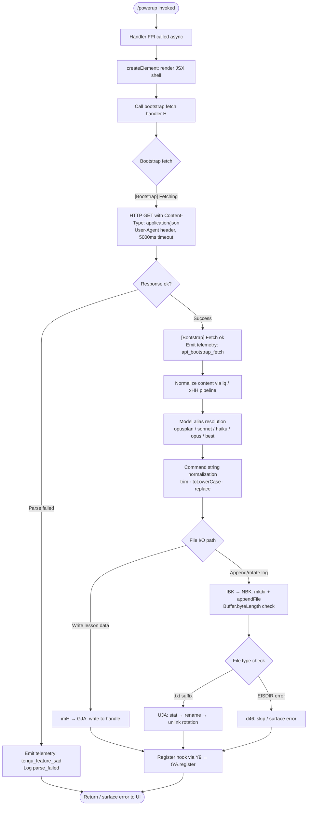

# `/powerup`

> Analysis basis: CC v2.1.161 bundle.js (AST extraction + Claude interpretation)
> Minimum version: v2.1.161

---

## Overview

`/powerup` is an interactive, JSX-rendered slash command that presents users with quick, guided lessons about Claude Code features. It renders a React element tree (via `z_A.createElement`) and bootstraps lesson content by fetching remote data through an API bootstrap mechanism, delivering a lightweight discovery experience directly inside the CLI interface.

---

## Registration

| Field | Value |
|---|---|
| type | `local-jsx` |
| name | `powerup` |
| description | `Discover Claude Code features through quick interactive lessons` |
| loc_byte | `11884574` |
| loc_byte_end | `11884754` |
| loc_line | `8161` |
| module_id | `Kd1` |
| load_inline | `true` |
| arbor_handler.name | `FPf` |
| arbor_handler.fqn | `claude-2.1.161::FPf` |
| arbor_handler.kind | `AsyncFunction` |
| arbor_handler.resolution_path | `module_id` |
| arbor_handler.n_hits | `0` |

Analysis basis: CC v2.1.161 bundle.js:+11884574

---

## Input Branching

The command execution involves more than three distinct paths (UI rendering, bootstrap fetch success/failure, content parsing, file I/O, and hook registration), so a Mermaid flowchart is used.



---

## Behavioral Spec

### 1. Handler Entry Point — `FPf` (AsyncFunction)

The primary handler, resolved by Arbor via `module_id` → `Kd1` → export `FPf`, is an `AsyncFunction`.

```
async function powerupHandler(context):
    jsxShell = createElement(PowerupComponent, context)
    bootstrapResult = await bootstrapFetch(context)
    return jsxShell populated with bootstrapResult
```

Analysis basis: CC v2.1.161 bundle.js:+11884448 (createElement call), +11884483 (bootstrap call)

The handler immediately constructs a JSX element tree for the UI shell, then asynchronously resolves lesson content via the bootstrap subsystem. The `"system"` string literal found at `+11884496` suggests a system-level message is passed as part of the initial context.

---

### 2. Bootstrap Fetch — `bootstrapFetch` (`H`)

```
async function bootstrapFetch(config):
    log("[Bootstrap] Fetching")
    cachedEntry = sessionCache.get(key)
    if cachedEntry exists:
        return cachedEntry

    response = await fetch(endpoint, {
        headers: {
            "Content-Type": "application/json",
            "User-Agent": userAgentString
        },
        timeout: 5000   // ms
    })

    if response parse fails:
        emitTelemetry("tengu_feature_sad")
        log("parse_failed")
        return error state

    log("[Bootstrap] Fetch ok")
    emitTelemetry("api_bootstrap_fetch")
    normalizedContent = normalizeContent(response.body)
    return normalizedContent
```

Analysis basis: CC v2.1.161 bundle.js:+15504120 (`H→N`), +15504158 (cache get), +15504207 (`Content-Type`), +15504222 (`application/json`), +15504241 (`User-Agent`), +15504313 (5000 timeout), +15504122 (`[Bootstrap] Fetching`), +15504486 (`[Bootstrap] Fetch ok`), +15504434 (`api_bootstrap_fetch`), +15504456 (`parse_failed`)

---

### 3. Content Normalization Pipeline — `normalizeContent` (`N` → `lq` → `xHH` → `nQ` → `s9`)

```
function normalizeContent(rawBody):
    // Step 1: top-level structure parse (N)
    structured = parseStructure(rawBody)        // via e46, VBK
    upperCased = structured.field.toUpperCase() // _.toUpperCase at +204699
    trimmed    = structured.field.trim()        // H.trim at +204722

    // Step 2: path / filename derivation (Z4)
    base     = deriveBasePath(structured)       // CJA maps WBK entries
    replaced = base.replace(pattern, "[REDACTED]")  // H.replace at +196653
    segment  = replaced.at(2)                   // q.at(2) at +196763
    lastIdx  = segment.lastIndexOf(separator)   // A.lastIndexOf at +196789
    result   = segment.slice(0, lastIdx)        // A.slice at +196815

    // Step 3: command tokenization (lq → xHH → nQ)
    tokens = tokenize(result)                   // xHH at +2232138
    tokens = filterAnthropicPrefixed(tokens)    // "anthropic." check at +2230116
    tokens = tokens.map(t => t.trim())

    // Step 4: model alias resolution (s9)
    normalized = resolveModelAlias(tokens)
    return normalized
```

Analysis basis: CC v2.1.161 bundle.js:+204597, +204615, +204699, +204719, +204722, +196626, +196653, +196705 (`[REDACTED]`), +196734, +196763, +196789, +196815, +2232138, +2230116

---

### 4. Model Alias Resolution — `resolveModelAlias` (`s9`)

```
function resolveModelAlias(tokenList):
    for each token in tokenList:
        token = token.trim().toLowerCase()

        if token contains "opusplan":
            alias = resolveOpusPlan(token)      // aN at +2236172, "[1m]" tag at +2236180
        else if token contains "sonnet":
            alias = resolveSonnet(token)        // CgH at +2236249
        else if token contains "haiku":
            alias = resolveHaiku(token)         // +2236234
        else if token contains "opus":
            alias = resolveOpus(token)          // KG at +2236287, "firstParty" at +2232362
        else if token == "best":
            alias = resolveBest(token)          // Xwq → KG at +2236324
        else:
            alias = resolveDefault(token)       // UM → PA at +2236342

        // Provider routing
        if alias.provider == "anthropicAws":
            routeToAWS(alias)
        else if alias.provider == "gateway":
            routeToGateway(alias)
        else if alias.provider == "mantle":
            routeToMantle(alias)               // "mantle" at +2233003

        // Inclusion check
        vKHList.includes(alias.id)              // NKH at +2236133

        token = token.replace(pattern, "")      // s9: _.replace at +2236400

    return resolvedAliases
```

Analysis basis: CC v2.1.161 bundle.js:+2236058, +2236069, +2236087, +2236133, +2236154 (`opusplan`), +2236172, +2236180 (`[1m]`), +2236195 (`sonnet`), +2236234 (`haiku`), +2236249, +2236273 (`opus`), +2236287, +2236310 (`best`), +2236324, +2236342, +2236348, +2236356, +2236400, +2050571, +2050606 (`anthropicAws`), +2050626 (`gateway`), +2233003 (`mantle`)

---

### 5. File I/O and Log Rotation — `fileWriteDispatch` (`IBK` → `NBK`, `UJA`)

```
async function fileWriteDispatch(content, targetPath):
    dir = path.dirname(targetPath)              // he.dirname at +204119

    // Debounce / coalesce writes (WmH)
    clearTimeout(pendingTimer)
    pendingTimer = setTimeout(flushWrites, 1000)  // 1000ms at +58707
    // setImmediate used for microtask flushing   // setImmediate at +59076
    // max batch size: 100 items                  // 100 at +58728

    byteLen = Buffer.byteLength(content)        // +204293

    if byteLen exceeds threshold:
        await rotateLogs(targetPath)

    await ensureDir(dir)                        // NBK: Ay.mkdir at +203840
    await fs.appendFile(targetPath, content)    // NBK: Ay.appendFile at +203899

    await rotateLogs(targetPath)

async function rotateLogs(filePath):
    stat = await fs.stat(filePath)              // UJA: Ay.stat at +203441

    if filePath.endsWith(".txt"):               // +203545
        trimmed = filePath.slice(0, -4)         // slice by 4 at +203567
        await fs.rename(filePath, trimmed + ".bak")  // Ay.rename at +203597
        await fs.unlink(oldBackup)              // Ay.unlink at +203637

    try:
        writeLesson(content)                    // imH → GJA: H.write at +192152
    catch EISDIR:
        handleDirectoryError()                  // d46, "EISDIR" at +174728
```

Analysis basis: CC v2.1.161 bundle.js:+204086, +204119, +204148, +204238, +204255, +204287, +204293, +204326, +204343, +204352, +203840, +203899, +203545, +203567, +203597, +203637, +203931, +174720, +174728, +58707 (1000ms), +58728 (100-item batch), +59076

---

### 6. Hook Registration — `registerHook` (`Y9` → `tYA.register`)

```
function registerHook(lessonState):
    tYA.register(lessonStateHandler)    // Y9 → tYA.register at +59405
```

After lesson data is written, a hook is registered with the global hook registry (`tYA`) to track lesson state changes (e.g., lesson completion, navigation). This enables the UI shell to respond reactively to progress.

Analysis basis: CC v2.1.161 bundle.js:+204448 (`Y9`), +59405 (`tYA.register`)

---

## State & Side Effects

| Item | Detail |
|---|---|
| Telemetry | `tengu_feature_sad` (bootstrap parse failure, +966732); `api_bootstrap_fetch` (successful fetch, +15504434) |
| Hook registration | `tYA.register` called via `Y9` at +59405 — registers lesson-state change handler |
| Session cache | `s_.get` at +15504158 — bootstrap result is cached per session to avoid redundant fetches |
| File writes | `fs.appendFile` for lesson log data; log rotation via `fs.rename` + `fs.unlink` on `.txt` files |
| Debounce timer | `setTimeout` at 1000 ms (+58707) and `clearTimeout` coalesce rapid writes; max batch 100 (+58728) |
| EISDIR guard | Directory-target writes caught and handled at +174728 |
| appState changes | <!-- TODO: not found in depth-2 traversal; needs --depth 4 --> |
| Sound | <!-- TODO: not found in depth-2 traversal; needs --depth 4 --> |

---

## Version History

| Version | Change |
|---|---|
| v2.1.161 | Initial analysis |

---

## Common Mistakes

1. **Expecting instant content** — `/powerup` performs an async remote bootstrap fetch (5000 ms timeout). If the network is slow or offline, the command will surface a `parse_failed` state and no lesson content will appear.
2. **Re-invoking to "reload"** — The bootstrap result is session-cached (`s_.get`). Re-running `/powerup` in the same session will not re-fetch remote content; restart the CLI session to force a fresh fetch.
3. **Confusing it with a prompt command** — `type: local-jsx` means the command renders a React component tree, not a prompt injected into the model conversation. Do not chain it with other prompt-based slash commands expecting text output.
4. **File permission issues** — The command writes lesson progress to disk. If the working directory target is actually a directory (EISDIR), writes will silently fail and lesson state will not persist. Ensure `~/.claude` or the configured data directory is writable.
5. **Model alias mis-mapping** — The normalization pipeline resolves shorthand aliases (`best`, `opus`, `sonnet`, `haiku`, `opusplan`). Passing an unrecognized model string via any downstream configuration will fall through to the default resolver, which may route to an unexpected provider.

---

## Appendix — Identifier Mapping

> For bundle debugging only. Identifiers change across versions.

| Identifier | Role |
|---|---|
| `FPf` | Primary async handler for `/powerup` (Arbor-resolved, module `Kd1`) |
| `H` | Bootstrap fetch orchestrator (session cache + HTTP fetch + parse) |
| `N` | Content structure parser; dispatches to normalization sub-pipeline |
| `VBK` | Secondary structure handler called by `N` |
| `HwA` | Sub-handler within `VBK` pipeline |
| `SH` | JSON serialization helper (`JSON.stringify`) |
| `_` | Intermediate value / string target (context-dependent) |
| `Z4` | Path/filename derivation and segment extraction |
| `CJA` | Maps `WBK` entries to derive base path |
| `q` | File-system unlink helper (`wSK.unlinkSync`) |
| `A` | String normalization target (`f.toLowerCase`, slice operations) |
| `imH` | Lesson write dispatcher → calls `GJA` |
| `GJA` | Low-level write-to-handle function (`H.write`) |
| `IBK` | File I/O orchestrator: debounce, rotate, append |
| `WmH` | Debounce/coalesce write scheduler (clearTimeout / setTimeout / setImmediate) |
| `_3H` | Sub-operation within `IBK`: joins paths, calls `r8`, `N6` |
| `F6` | Helper called by `IBK` (role not fully resolved at depth-2) |
| `d46` | EISDIR error handler (`v8` at +174720) |
| `BJA` | Path join + `N6` helper used by `IBK` and `NBK` |
| `UJA` | Log rotation: stat → endsWith(".txt") → rename → unlink |
| `NBK` | Directory creation + appendFile + rotate, bound via `NBK.bind` |
| `Y9` | Hook registration dispatcher → `tYA.register` |
| `s$` | Called within bootstrap handler `H` (role not fully resolved at depth-2) |
| `ne` | Feature-flag / capability check (`WA4.has`) |
| `Ij` | String replacement utility (`H.replace`) |
| `lq` | Top-level normalization entry: dispatches to `xHH`, `s9`, `xP` |
| `xHH` | Token pipeline: calls `NT`, `o9H`, `VA`, `nQ` |
| `NT` | Sub-step of `xHH` token pipeline |
| `o9H` | Sub-step of `xHH` token pipeline |
| `nQ` | Token filter: anthropic-prefix check, maps/trims, alias helpers |
| `s9` | Model alias resolution core (trim, toLowerCase, switch on alias tokens) |
| `x0` | Helper called by `s9` → `kKH` |
| `NKH` | Inclusion check against `vKH` list |
| `aN` | OpusPlan alias resolver (`UM`, `Vf`) |
| `CgH` | Sonnet alias resolver (`Vf`) |
| `KG` | Opus / firstParty alias resolver (`UM`, `Vf`, `PA`) |
| `Xwq` | "best" alias resolver → delegates to `KG` |
| `UM` | Provider routing helper → `PA` |
| `Us6` | Inclusion-list check (`wHL.includes`) |
| `bgH` | Token replacement helper → `pH` |
| `xP` | Secondary normalization path: calls `s9`, `b0` |
| `b0` | Compound resolver: `wA`, `BHH`, `RzH`, `xgH`, `KG`, `sX`, `UM`, `PA`, `Vf`, `aN` |
| `t6` | Telemetry emitter: fires `tengu_feature_sad` via `d`; calls `h1H` |
| `d` | Low-level telemetry sink (receives `tengu_feature_sad`) |
| `h1H` | Secondary telemetry helper → `Xa8` |
| `Xa8` | Telemetry encoding/dispatch target |

---

Note: index built via Arbor fallback; some signals (telemetry, literals) may be missing — see arbor-fallback.js.