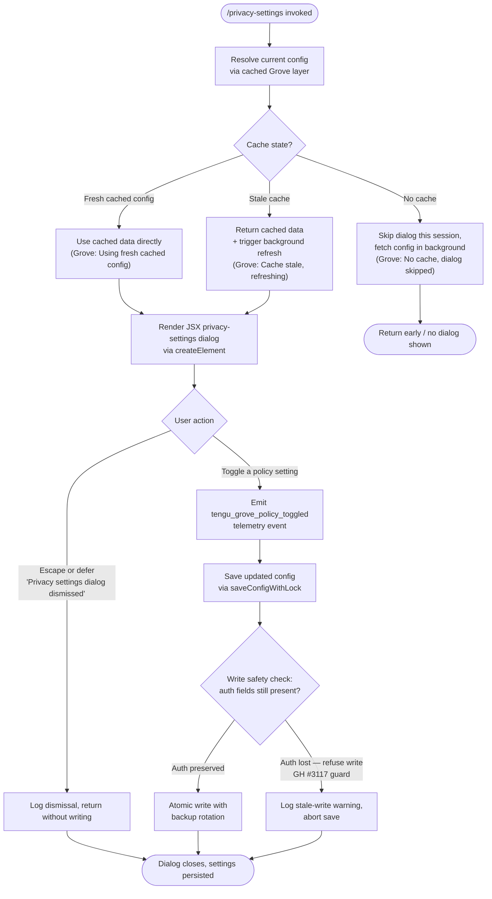

# `/privacy-settings`

> Analysis basis: CC v2.1.161 bundle.js (AST extraction + Claude interpretation)
> Minimum version: v2.1.161

---

## Overview

The `/privacy-settings` command opens an interactive JSX dialog that allows the user to view and modify privacy-related policy toggles (Grove policy settings) within Claude Code. The handler is an async function that resolves the current configuration via a cached config layer, renders a settings UI component, and persists any changes back to the global config file—emitting a telemetry event when a toggle is changed.

---

## Registration

| Field | Value |
|---|---|
| type | `local-jsx` |
| name | `privacy-settings` |
| description | `View and update your privacy settings` |
| loc_byte | `12320812` |
| loc_byte_end | `12321004` |
| loc_line | `8557` |
| module_id | `Es1` |
| load_inline | `true` |
| arbor_handler.name | `cTf` |
| arbor_handler.fqn | `claude-2.1.161::cTf` |
| arbor_handler.kind | `AsyncFunction` |
| arbor_handler.resolution_path | `module_id` |
| arbor_handler.n_hits | `0` |

Analysis basis: CC v2.1.161 bundle.js:+12320812

---

## Input Branching

The command has 4+ distinct branches: (1) config fetch succeeds with fresh cache, (2) config fetch succeeds with stale cache (background refresh), (3) config fetch fails / returns no data, (4) user dismisses dialog without saving, (5) user saves a policy toggle change. A Mermaid flowchart is used.



Analysis basis: CC v2.1.161 bundle.js:+12319816, +12319979, +12320004, +12320352, +6956881, +6957001, +6957107

---

## Behavioral Spec

### 1. Top-Level Handler — `privacySettingsHandler` (`cTf`)

```
async function privacySettingsHandler(context):
    // Parallel pre-flight: load config and prepare environment
    [configData, ...] = await Promise.all([
        loadConfig(),           // paH — Grove-cached config fetch
        fetchCurrentUser(),     // na
        getSessionInfo()        // eJH
    ])

    if configData is null or unavailable:
        display error: "Unable to retrieve updated privacy settings"
        return systemMessage("error")

    // Render the JSX dialog using Gh6.createElement
    uiElement = createElement(PrivacySettingsDialog, {
        settings: configData,
        onDismiss: handleDismiss,
        onSave: handleSave
    })

    return { type: "system", element: uiElement }
```

Analysis basis: CC v2.1.161 bundle.js:+12319856, +12319869, +12320073, +12320130, +12320049, +12320459

---

### 2. Config Resolution with Grove Caching — `loadGroveCachedConfig` (`paH`)

```
async function loadGroveCachedConfig():
    // Attempt to read config via the Grove caching layer (zL → y6)
    cachedResult = readConfigWithGrove()

    now = Date.now()

    if no cache exists:
        log("Grove: No cache, fetching config in background (dialog skipped this session)")
        triggerBackgroundRefresh()
        return null   // caller skips dialog this session

    if cache is stale (age > threshold):
        log("Grove: Cache stale, returning cached data and refreshing in background")
        scheduleBackgroundRefresh()
        return cachedResult.data

    log("Grove: Using fresh cached config")
    return cachedResult.data
```

Analysis basis: CC v2.1.161 bundle.js:+6956787, +6956826, +6956855, +6956879, +6956881, +6957001, +6957107

---

### 3. Config File Read — `readConfigFile` (`nDH`)

```
function readConfigFile(configPath):
    if not accessAllowed:
        throw Error("Config accessed before allowed.")

    try:
        raw = fs.readFileSync(configPath, "utf-8")
    catch error:
        if error.code == "ENOENT":
            return defaultConfig()
        if error.code == "error":
            emit telemetry("tengu_config_parse_error")
            return defaultConfig()

    parsed = JSON.parse(raw)

    // Backup rotation: keep last 5 backups, files prefixed ".backup."
    manageBackups(configPath, maxBackups=5)
    return parsed
```

Analysis basis: CC v2.1.161 bundle.js:+3251235, +3251241, +3251297, +3251324, +3251471, +3251792, +3251872, +3250227

---

### 4. Config Write with Lock — `saveConfigWithLock` (`Pj_`)

```
async function saveConfigWithLock(configPath, newData):
    dirPath = path.dirname(configPath)
    fs.mkdirSync(dirPath, { recursive: true })

    // Acquire file lock; warn if contention detected
    lockAcquired = acquireLock(configPath)
    if lockAcquired took too long:
        emit telemetry("tengu_config_lock_contention")
        log("Lock acquisition took longer than expected - another Claude instance may be running")

    // Re-read config before write to detect concurrent mutation
    reReadData = readConfigFile(configPath)

    // GH #3117 guard: refuse write if auth fields present in cache but missing in re-read
    if cache has auth AND reReadData missing auth:
        emit telemetry("tengu_config_auth_loss_prevented")
        log("saveConfigWithLock: re-read config is missing auth that cache has; refusing to write...")
        return  // abort

    // Atomic write via staging file
    stagingPath = configPath + ".staging"
    writeSerialized(stagingPath, newData)
    fs.statSync(configPath)  // verify original exists

    // Backup rotation: keep last 5 backups named with ".backup." prefix
    rotateBa ckups(configPath, limit=5, maxAgeMs=60000)

    // Copy staging → final, then unlink staging
    fs.copyFileSync(stagingPath, configPath)
    fs.unlinkSync(stagingPath)

    // Max backup size: 384 bytes threshold check
    enforceBackupSizeLimit(384)
```

Analysis basis: CC v2.1.161 bundle.js:+3249003, +3249024, +3249082, +3249208, +3249297, +3249433, +3249608, +3249624, +3249776, +3249978, +3249986, +3250086, +3250094, +3250162, +3250201, +3250227, +3250345, +3250467, +3250509

---

### 5. Global Config Fallback Save — `saveGlobalConfigFallback` (`W8`)

```
function saveGlobalConfigFallback(newData):
    // Determine installation type from config state
    installState = determineInstallState()
    // installState is one of:
    //   "unknown" | "local" | "migrated" | "native" | "installed"
    //   "disabled" | "enabled" | "no_permissions" | "global" | "not_configured"

    // GH #3117 guard (same pattern as saveConfigWithLock)
    if cache has auth AND reRead missing auth:
        log("saveGlobalConfig fallback: re-read config is missing auth that cache has; refusing to write. See GH #3117.")
        emit telemetry("tengu_config_stale_write")
        return

    writeConfigAtomic(configPath, newData, stateLabel=installState)
```

Analysis basis: CC v2.1.161 bundle.js:+3246230, +3246254, +3246330, +3246346, +3246411, +3246437, +3246563, +3246890, +3246965, +3246952, +3246997, +3246983, +3247016, +3247042, +3247056, +3247077, +3247096

---

### 6. Policy Toggle Save — `handlePolicyToggle` (within `cTf`)

```
function handlePolicyToggle(settingKey, newValue):
    updatedConfig = merge(currentConfig, { [settingKey]: newValue })
    emit telemetry("tengu_grove_policy_toggled")
    saveConfigWithLock(configPath, updatedConfig)
```

Analysis basis: CC v2.1.161 bundle.js:+12320352, +12320413

---

### 7. Dialog Dismissal Handling

```
function handleDismiss(reason):
    // reason is one of: "escape" | "defer"
    log("Privacy settings dialog dismissed")
    return  // no write, no telemetry
```

Analysis basis: CC v2.1.161 bundle.js:+12319979, +12319993, +12320004

---

### 8. Config Path Resolution — `resolveConfigPath` (`nC6`)

```
function resolveConfigPath(pluginName):
    normalized = pluginName.replace(...).toLowerCase()

    if normalized resolves to reserved path ".staging":
        throw Error("plugin name resolves to reserved path")

    joined = path.join(baseDir, normalized)
    relative = path.relative(baseDir, joined)

    if path.isAbsolute(relative) OR relative.startsWith(".."):
        throw Error("path traversal detected")

    return joined
```

Analysis basis: CC v2.1.161 bundle.js:+15615975, +15616008, +15616040, +15616057, +15616118, +15616133, +15616157, +15616179, +15616185

---

### 9. Plugin / Synced Directory Resolution — `resolvePluginDir` (`iC6`)

```
function resolvePluginDir(name):
    return path.join(baseDir, "plugins", "synced", name)
```

Analysis basis: CC v2.1.161 bundle.js:+15615648, +15615656, +15615661, +15615671

---

### 10. Bootstrap Config Fetch — `bootstrapFetch` (`H` → `t6`)

```
async function bootstrapFetch(url):
    log("[Bootstrap] Fetching", url)
    response = await fetch(url, {
        headers: {
            "Content-Type": "application/json",
            "User-Agent": userAgentString
        },
        timeout: 5000
    })
    if response.ok:
        log("[Bootstrap] Fetch ok")
        emit telemetry("api_bootstrap_fetch")
    else:
        emit telemetry("api_bootstrap_fetch", { status: "parse_failed" })
        emit telemetry("tengu_feature_sad")
```

Analysis basis: CC v2.1.161 bundle.js:+15504120, +15504122, +15504158, +15504207, +15504222, +15504241, +15504313, +15504431, +15504434, +15504456, +15504486, +966730, +966732

---

### 11. Log Entry Serialization — `serializeLogEntry` (`N`)

```
function serializeLogEntry(entry):
    log("debug", entry)
    formatted = H.includes(...)  // check inclusion list
    upper = entry.toUpperCase()
    trimmed = entry.trim()
    result = formatWithRedaction(entry)
    // Sensitive values replaced with "[REDACTED]" (max depth 2)
    return JSON.stringify(result)
```

Analysis basis: CC v2.1.161 bundle.js:+204573, +204597, +204615, +204637, +204655, +204699, +204719, +204722, +196705, +196734

---

### 12. File Write with Buffering — `bufferedFileWriter` (`IBK` / `WmH`)

```
function bufferedFileWriter(filePath, data):
    clearTimeout(existingTimer)
    dir = path.dirname(filePath)
    ensureDir(dir)

    // Debounce: coalesce writes within 1000 ms window
    // Max buffer entries: 100
    buffer.push(data)
    timer = setTimeout(flushBuffer, 1000)

    // On flush: join lines, write via appendFile
    // Use setImmediate for final drain pass
    // Max backup rotation: keep last 5 files at 384 bytes
    flushAndRotate(filePath, buffer, maxBackups=5, maxBytes=384)
```

Analysis basis: CC v2.1.161 bundle.js:+58707, +58728, +58819, +58860, +58891, +58937, +58958, +58983, +59018, +59076, +59116, +59167

---

## State & Side Effects

| Item | Detail |
|---|---|
| Telemetry: `tengu_grove_policy_toggled` | Fired when the user saves a change to a privacy policy toggle (bundle.js:+12320352) |
| Telemetry: `tengu_config_parse_error` | Fired when the config file cannot be parsed (bundle.js:+3251872) |
| Telemetry: `tengu_config_lock_contention` | Fired when lock acquisition exceeds expected duration (bundle.js:+3249297) |
| Telemetry: `tengu_config_stale_write` | Fired when a write is aborted due to a detected stale-write race condition (bundle.js:+3249433) |
| Telemetry: `tengu_config_auth_loss_prevented` | Fired when a write is refused because auth fields would be lost (GH #3117 guard) (bundle.js:+3249776) |
| Telemetry: `tengu_feature_sad` | Fired on bootstrap fetch failure (bundle.js:+966732) |
| Telemetry: `api_bootstrap_fetch` | Fired on bootstrap HTTP fetch completion (success or parse failure) (bundle.js:+15504434) |
| Config file write | Atomic write via `.staging` intermediate file; rotates backups prefixed `.backup.`; max 5 backups; max backup size 384 bytes; max backup age 60 000 ms (bundle.js:+3249978, +3250094, +3250227, +3250509) |
| Auth-loss guard | Refuses config write if auth fields are present in cache but absent in re-read; logs to console and emits `tengu_config_auth_loss_prevented` (bundle.js:+3249624, +3246437) |
| JSX rendering | Calls `Gh6.createElement` to render the settings dialog inline as a `local-jsx` command result (bundle.js:+12320459) |
| Hook registration | `Y9` calls `tYA.register` — lifecycle hook registered during file write setup (bundle.js:+59405) |
| File watcher | `bXL` sets up `Pq8.watchFile` / `Pq8.unwatchFile` around config file for change detection (bundle.js:+3247621, +3247626, +3247959) |
| appState changes | Privacy policy key under `"settings"` namespace updated on confirmed save (bundle.js:+12320413) |
| Sound | None detected |

---

## Version History

| Version | Change |
|---|---|
| v2.1.161 | Initial analysis |

---

## Common Mistakes

1. **Dismissing the dialog does not save changes.** Both `"escape"` and `"defer"` dismiss reasons result in no write; the dismissal is only logged as `"Privacy settings dialog dismissed"`. Any in-progress toggle changes are discarded.
2. **Concurrent Claude instances can cause lock contention.** If another Claude process holds the config lock, the `tengu_config_lock_contention` event is emitted and the write may be delayed. Running multiple overlapping sessions is not supported.
3. **Auth-field loss prevention (GH #3117).** If a race condition causes the re-read of the config file to be missing auth fields that the in-memory cache has, the write is silently aborted. Users should not manually edit `~/.claude.json` while the CLI is running.
4. **No-cache path skips the dialog entirely.** If there is no cached config at invocation time, the command returns early without showing the UI and triggers a background fetch. Invoking `/privacy-settings` again after a short delay will succeed once the background fetch completes.
5. **`local-jsx` type requires a terminal UI context.** The command renders a JSX component; invoking it in a non-interactive pipe or script context may produce no visible output.

---

## Appendix — Identifier Mapping

> For bundle debugging only. Identifiers change across versions.

| Identifier | Role |
|---|---|
| `cTf` | Top-level async handler for `/privacy-settings` command (`privacySettingsHandler`) |
| `paH` | Grove-cached config loader (`loadGroveCachedConfig`) |
| `J4H` | Config bootstrap/init helper |
| `a9` | API key / auth config accessor |
| `ZK_` | Auth token getter |
| `TK_` | Auth token setter |
| `KD` | Core auth configuration object / builder |
| `wA` | Config merge / overlay helper |
| `SR` | Array inclusion check helper |
| `pCq` | Config post-processor |
| `zL` | Config layer resolver (Grove entry point) |
| `y6` | Grove cache read/write coordinator |
| `F6` | File existence / access guard |
| `Dj_` | Config directory resolver |
| `nDH` | Config file reader with backup management (`readConfigFile`) |
| `bXL` | File watcher setup/teardown (`watchConfigFile`) |
| `N` | Log entry serializer / debug logger |
| `VBK` | HTTP fetch wrapper |
| `HwA` | User-agent string builder |
| `H` | Bootstrap HTTP fetcher (`bootstrapFetch`) |
| `s$` | Session state accessor |
| `ne` | Permission set checker |
| `Ij` | String sanitizer / redactor |
| `lq` | Log formatter |
| `t6` | Fetch failure telemetry emitter |
| `SH` | JSON serializer wrapper |
| `_` | Utility / identity helper |
| `Z4` | Sensitive-value redaction formatter |
| `CJA` | Redaction map builder |
| `q` | Filesystem sync operations namespace |
| `A` | String normalizer (lowercase) |
| `imH` | Stdout/stderr writer |
| `GJA` | Raw stream write helper |
| `IBK` | Buffered async file writer (`bufferedFileWriter`) |
| `WmH` | Write debounce / timer manager |
| `_3H` | Log line formatter |
| `d46` | Error classifier |
| `BJA` | Config path joiner |
| `UJA` | Atomic file rename helper |
| `NBK` | Async append-file writer with rotation |
| `Y9` | Lifecycle hook registrar |
| `Su9` | Grove cache state machine / staleness logic |
| `W8` | Global config fallback saver (`saveGlobalConfigFallback`) |
| `Pj_` | Locked config writer with backup rotation (`saveConfigWithLock`) |
| `McH` | Config state label resolver |
| `icq` | Object entries iterator helper |
| `$cH` | Timestamp / lock-timeout checker |
| `iY6` | Auth field presence validator |
| `d` | Generic error logger |
| `Jj_` | Simplified atomic config writer |
| `M` | Plugin staging file manager |
| `nC6` | Config path resolver with traversal guard (`resolveConfigPath`) |
| `iC6` | Plugin synced-directory resolver (`resolvePluginDir`) |
| `L` | Async file operation set (add/delete/finally) |
| `f` | File handle manager (open/close lifecycle) |