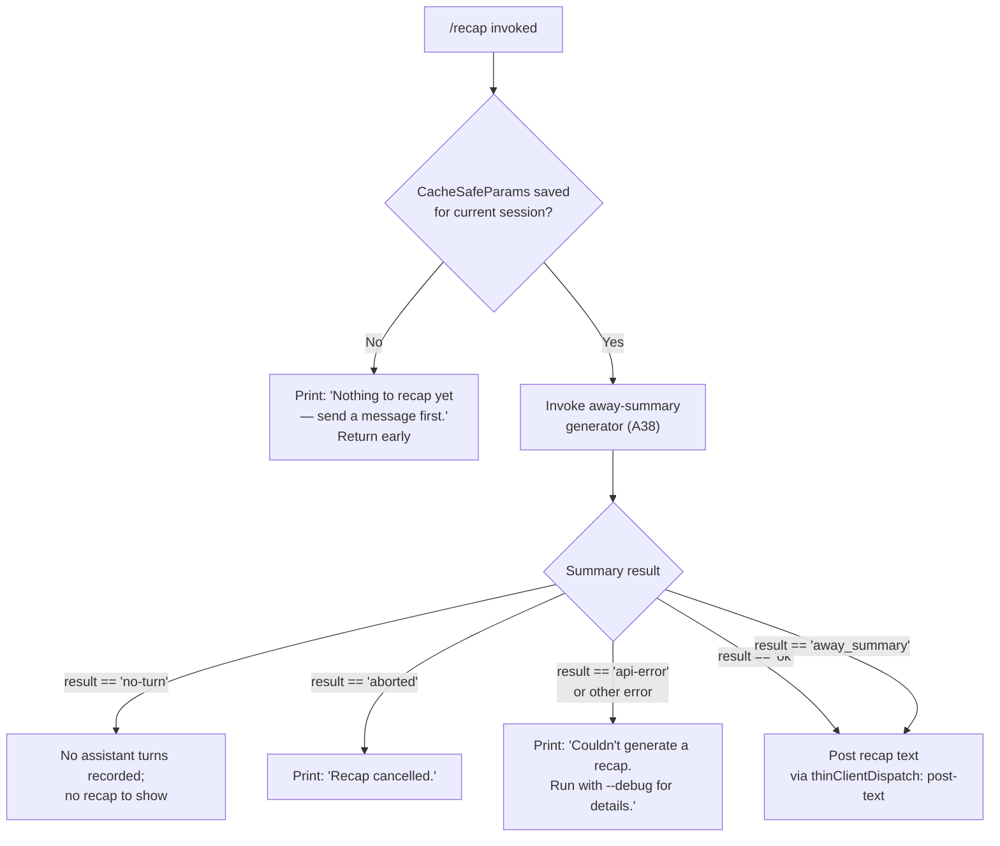

# `/recap`

> Analysis basis: CC v2.1.161 bundle.js (AST extraction + Claude interpretation)
> Minimum version: v2.1.161

---

## Overview

`/recap` is a local slash command that immediately triggers generation of a one-line summary of the current session's activity. It invokes the "away summary" subsystem (normally used for background-session recaps) on demand, returning a concise recap string or an informative message if no conversation context exists yet.

---

## Registration

| Field | Value |
|---|---|
| type | `local` |
| name | `recap` |
| description | `Generate a one-line session recap now` |
| loc_byte | `12828890` |
| loc_byte_end | `12829106` |
| loc_line | `9321` |
| supportsNonInteractive | `false` |
| thinClientDispatch | `post-text` |
| load_inline | `true` |
| load_ident | `qSf` |
| arbor_handler.name | `qSf` |
| arbor_handler.fqn | `claude-2.1.161::qSf` |
| arbor_handler.kind | `AsyncFunction` |
| arbor_handler.resolution_path | `load_ident` |
| arbor_handler.n_hits | `0` |

Analysis basis: CC v2.1.161 bundle.js:+12828890

---

## Input Branching

The command handler follows 4+ distinct branches depending on whether cached session parameters exist, whether the away-summary call succeeds, and what outcome is returned. A Mermaid flowchart is used.



Analysis basis: CC v2.1.161 bundle.js:+12828498, +5446588, +5446646, +5447106, +5447195, +5447256, +5446962

---

## Behavioral Spec

### Top-Level Handler (`qSf`)

The handler is an `AsyncFunction` loaded via the `load_ident` inline shape (`Promise.resolve({call: qSf})`). It acts as the entry point for `/recap`.

```
async function recapCommandHandler(context):
    result = await awaySummaryRunner(context)
    if result is null or no CacheSafeParams exist:
        display("Nothing to recap yet — send a message first.")
        return
    match result.status:
        case "no-turn":
            return  // silently no-op; no turns to summarize
        case "aborted":
            display("Recap cancelled.")
            return
        case "api-error":
            display("Couldn't generate a recap. Run with --debug for details.")
            return
        case "ok" | "away_summary":
            dispatchPostText(result.recapLine)
            return
```

Analysis basis: CC v2.1.161 bundle.js:+12828498, +12828640, +12828732, +12828790

### Away-Summary Runner (`A38`)

`A38` is the core away-summary orchestrator invoked by the recap handler. It first checks whether CacheSafeParams were saved for the active session. If not, it logs a skip message and returns the `"no-turn"` sentinel. Otherwise it:

1. Registers an `abort` event listener on the active AbortController.
2. Calls the main query pipeline (`t0`) with `avoid_prompts` flag set to prevent interactive prompts during the background-style call.
3. Awaits a streaming result from the model.
4. Filters tool-use responses — tool calls are denied with the message `"Away summary cannot use tools"` (status: `"deny"`).
5. Returns one of: `"ok"`, `"away_summary"`, `"aborted"`, `"api-error"`, or `"other"`.

```
async function awaySummaryRunner(context):
    params = getCacheSafeParams(context.session)
    if params is null:
        log("[awaySummary] no CacheSafeParams saved, skipping")
        return { status: "no-turn" }

    controller = new AbortController()
    controller.signal.addEventListener("abort", onAbort)

    try:
        result = await mainQueryPipeline(params, { avoidPrompts: true })
        return processAwaySummaryResult(result)
    catch AbortError:
        return { status: "aborted" }
    catch ApiError:
        return { status: "api-error" }
```

Analysis basis: CC v2.1.161 bundle.js:+5446567, +5446586, +5446588, +5446646, +5446683, +5446702, +5446714, +5446761, +5446879, +5446894, +5446947, +5446962, +5447106, +5447195, +5447256

### Tool-Use Gate for Away Summary

During the away-summary model call, any tool-use requests from the model are intercepted and denied. The gate function (`iE9`) flat-maps the result stream and, upon detecting a tool-use content block, returns a tool-result block with status `"deny"` and the message `"Away summary cannot use tools"`.

```
function filterToolUseForAwaySummary(streamResults):
    return streamResults.flatMap(item =>
        if item.type == "tool_use":
            return [denyToolResult(item.id, "Away summary cannot use tools")]
        else:
            return [item]
    )
```

Analysis basis: CC v2.1.161 bundle.js:+5447123, +5447212, +5447422, +5446879, +5446894

### Main Query Pipeline Entry (`t0`)

`t0` is the primary agent query loop, shared across many command paths. When called from the recap handler:

- `Date.now()` is sampled as the start timestamp.
- The `avoid_prompts` flag (literal: `"avoid_prompts"`) suppresses any interactive permission dialogs.
- `GT8` sets up the streaming model call (including `setAppState`, `getAppState`, random UUID generation for request IDs).
- `Nm` / `nLf` handle the full turn execution loop: streaming events, tool dispatch, compaction, error recovery.
- On completion, the pipeline returns the result object consumed by `awaySummaryRunner`.

```
async function mainQueryPipeline(params, options):
    startTime = Date.now()
    sessionState = getAppState()

    configure(options.avoidPrompts)   // sets "avoid_prompts" flag
    requestId = randomUUID()

    stream = await streamingModelCall(params, requestId, sessionState)
    result = await executeTurnLoop(stream, options)

    setAppState(updatedState)
    return result
```

Analysis basis: CC v2.1.161 bundle.js:+10820856, +10818600, +10819150, +10820251, +10821255

### Conversation Log / JSONL Writer (`IBK` / `NBK` / `UJA`)

After each turn (including recap turns), the conversation is appended to the session JSONL log file. The write path:

1. Resolves the log directory via `path.dirname` and `path.join`.
2. Creates the directory with `fs.mkdir` (recursive).
3. Appends the serialized turn entry with `fs.appendFile`.
4. Checks and rotates/renames the log file if it ends in `.txt` (rotation boundary at offset 4 bytes from end).
5. Checks `Buffer.byteLength` of the serialized content before writing.
6. Calls `gJA` to finalize the write, then chains via `vm6.then` / `NBK.bind` for the next segment.

```
async function writeConversationLog(entry, logDir):
    dir = path.dirname(path.join(logDir, entry.sessionId))
    await fs.mkdir(dir, { recursive: true })

    serialized = serializeEntry(entry)
    byteLen = Buffer.byteLength(serialized)

    await fs.appendFile(logPath, serialized)
    await rotateLogs(logPath)       // rename if needed, unlink stale
    finalizeWrite(byteLen)
```

Analysis basis: CC v2.1.161 bundle.js:+204086, +204111, +204119, +204148, +204238, +204255, +204287, +204293, +204326, +204343, +204352, +203840, +203899

### Hook Registration (`Y9`)

After each turn, `Y9` registers a `tYA` hook entry (likely a post-turn or stop hook registration) via `tYA.register`.

```
function registerPostTurnHook(hookConfig):
    tYA.register(hookConfig)
```

Analysis basis: CC v2.1.161 bundle.js:+204448, +59405

---

## State & Side Effects

| Item | Detail |
|---|---|
| Telemetry | `tengu_feature_ok` (bundle.js:+966587), `tengu_feature_bad` (bundle.js:+966650), `tengu_feature_sad` (bundle.js:+966732), `tengu_query_error` (bundle.js:+10789784), `tengu_auto_compact_succeeded` (bundle.js:+10779292), `tengu_auto_compact_rapid_refill_breaker` (bundle.js:+10778829), `tengu_refusal_fallback_triggered` (bundle.js:+10785145), `tengu_refusal_fallback_prompt_shown` (bundle.js:+10783843), `tengu_refusal_fallback_prompt_choice` (bundle.js:+10784032), `tengu_model_fallback_triggered` (bundle.js:+10789080), `tengu_malformed_tool_use_response` (bundle.js:+10794018), `tengu_stop_hook_block_count` (bundle.js:+10794972), `tengu_orphaned_messages_tombstoned` (bundle.js:+10785791), `tengu_ptl_surfaced_to_user` (bundle.js:+10781263), `tengu_model_response_keyword_detected` (bundle.js:+10790603), `tengu_loop_dynamic_wakeup_ends_turn` (bundle.js:+10798345), `tengu_post_autocompact_turn` (bundle.js:+10798512), `tengu_query_before_attachments` (bundle.js:+10798626), `tengu_query_after_attachments` (bundle.js:+10800944), `tengu_mcp_tools_refreshed_mid_turn` (bundle.js:+10801247), `tengu_forked_agent_default_turns_exceeded` (bundle.js:+10822391), `tengu_fork_agent_query` (bundle.js:+10822834) |
| thinClientDispatch | `post-text` — recap output is dispatched as a text post to the UI |
| appState changes | `getAppState` / `setAppState` called during query pipeline; session state updated after model call completes (bundle.js:+10818370, +10819150) |
| Conversation log | Turn entry appended to session JSONL log via `fs.appendFile`; log rotation checked (bundle.js:+203899, +203597) |
| Hook registration | Post-turn hook registered via `tYA.register` (bundle.js:+59405) |
| AbortController | Event listener attached on `"abort"` during away-summary call; aborted cleanly on cancellation (bundle.js:+5446683, +5446714) |
| Tool use | All model tool-use requests denied during recap generation with message `"Away summary cannot use tools"` (bundle.js:+5446894) |
| Sound | <!-- TODO: not found in depth-2 traversal; needs --depth 4 --> |

---

## Version History

| Version | Change |
|---|---|
| v2.1.161 | Initial analysis |

---

## Common Mistakes

1. **Running `/recap` before any messages are sent** — the command requires at least one completed assistant turn. If no `CacheSafeParams` have been persisted yet (i.e., the very start of a session), the command immediately returns `"Nothing to recap yet — send a message first."` with no model call made.
2. **Expecting tool results in the recap** — the away-summary pipeline explicitly blocks all tool use. Any tool-calling attempt by the model is denied with `"Away summary cannot use tools"`. The recap is always a pure-text one-liner.
3. **Using in non-interactive mode** — `supportsNonInteractive: false` means `/recap` is not available when Claude Code is run with `--non-interactive` or equivalent flags; the command will not be registered in that mode.
4. **Expecting a detailed summary** — the command is designed for a *one-line* recap (as stated in the description). It is not a full session transcript or detailed summary.
5. **Interrupting and expecting a saved result** — if the recap is aborted (e.g., via Ctrl+C during generation), the result is `"Recap cancelled."` and no text is posted. The session log is not updated with a partial recap.

---

## Appendix — Identifier Mapping

> For bundle debugging only. Identifiers change across versions.

| Identifier | Role |
|---|---|
| `qSf` | Top-level recap command handler (AsyncFunction); entry point for `/recap` |
| `A38` | Away-summary orchestrator; checks CacheSafeParams, wires AbortController, calls query pipeline |
| `W_H` | CacheSafeParams retrieval helper |
| `N` | Message/prompt construction utility (shared across query paths) |
| `VBK` | Query parameter builder |
| `HwA` | Helper within parameter builder |
| `H` | Bootstrap fetch / HTTP request utility (also used as generic variable in multiple contexts) |
| `s$` | Request header assembly helper |
| `ne` | WA4 map membership check utility |
| `Ij` | String replacement utility |
| `lq` | Additional string/path processing helper |
| `t6` | Logging helper (calls `d`, `h1H`) |
| `SH` | JSON serialization wrapper |
| `Z4` | Path/string normalization utility |
| `CJA` | Map helper used in path normalization |
| `q` | File system unlink / cleanup reference |
| `A` | Lowercase / file extension utility |
| `imH` | File write dispatcher |
| `GJA` | Raw file write helper |
| `IBK` | Conversation JSONL log writer (main) |
| `WmH` | Debounced write scheduler (uses setTimeout/clearTimeout/setImmediate) |
| `_3H` | Log entry formatter |
| `F6` | Log path resolver |
| `d46` | EISDIR error handler for log writes |
| `BJA` | Log path join helper |
| `UJA` | Log file rotation / rename handler |
| `NBK` | Log segment append handler (mkdir + appendFile) |
| `Y9` | Post-turn hook registrar (calls tYA.register) |
| `t0` | Main agent query pipeline entry (async; used by recap and other commands) |
| `GT8` | Streaming model call setup; manages appState, UUID generation |
| `WC` | Streaming controller setup (AbortController wiring) |
| `H7H` | Session state load/dump helper |
| `eYH` | Pre-query setup step |
| `Zz9` | Additional query configuration step |
| `f` | Stream close / cleanup function |
| `ev8` | Event emission helper within query setup |
| `Rh` | Random bytes generator (hex, 8 bytes) |
| `TT8` | Turn metadata setup helper |
| `fqH` | Attachment/filter pipeline entry |
| `a4` | Hook registration relay |
| `aRH` | Attachment filter (filters by "ant" prefix, uses `lR8`, `AC8`, `Rbf`) |
| `Nm` | Turn execution dispatcher (calls `nLf`, `XO8`, `hH`, `RH`) |
| `nLf` | Full agent turn execution loop (streaming, tool dispatch, compaction, error recovery) |
| `XO8` | Subagent exit / cleanup handler |
| `hH` | Feature-ok telemetry emitter |
| `RH` | Feature-bad telemetry emitter |
| `RI6` | In-progress tool use ID set checker |
| `hqH` | Post-turn cleanup helper |
| `gN8` | Additional post-turn step |
| `xI1` | RI6 relay (also checks m1f map) |
| `Y` | Process exit / forced shutdown handler |
| `WJ` | Shutdown message emitter |
| `z` | Daemon stop handler |
| `m7H` | Background session filter / push helper |
| `sj` | Background session find helper |
| `xf7` | Array find wrapper |
| `L` | Promise lifecycle manager (add/finally/delete) |
| `d` | Core debug/logging function |
| `K7f` | Forked agent query handler |
| `C8` | Subprocess/PTY session launcher |
| `X` | PTY session manager (NFC normalization, INSERT/NORMAL mode, scroll) |
| `J` | Write stream wrapper |
| `j` | Process kill helper (iterates values, sends SIGTERM) |
| `D` | Supervisor session config manager (start/stop/updateConfig) |
| `h` | Blur/focus/idle timeout handler (3600000 ms window, 0.8 threshold) |
| `w` | Background session spawn and lifecycle manager |
| `lfA` | Vim-mode operator registry (operator, operatorCount, operatorFind, operatorTextObj, find, operatorG, replace, indent) |
| `C` | Task enqueue executor |
| `P` | IPC/pipe message reader |
| `e5` | Stream end handler |
| `Y95` | Full PTY/session protocol handler (ping, nudge, yield, lease, kill, resize, attach, resume, snapshot, etc.) |
| `TH` | String coercion utility |
| `iE9` | Tool-use denial filter for away-summary (flatMap; blocks all tool calls) |