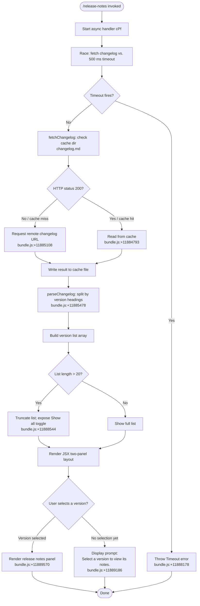

# `/release-notes`

> Analysis basis: CC v2.1.161 bundle.js (AST extraction + Claude interpretation)
> Minimum version: v2.1.161

---

## Overview

The `/release-notes` command opens an interactive, paginated viewer that fetches and displays the Claude Code changelog. It retrieves the `changelog.md` file from a cache or remote source, parses it by version sections, and renders a two-panel JSX interface in the terminal: a scrollable version list on the left and the corresponding release notes on the right. The command operates asynchronously with a timeout guard.

---

## Registration

| Field | Value |
|---|---|
| type | `local-jsx` |
| name | `release-notes` |
| description | `View release notes` |
| loc_byte | `11889898` |
| loc_byte_end | `11890039` |
| loc_line | `8166` |
| module_id | `Pd1` |
| load_inline | `true` |
| arbor_handler.name | `cPf` |
| arbor_handler.fqn | `claude-2.1.161::cPf` |
| arbor_handler.kind | `AsyncFunction` |
| arbor_handler.resolution_path | `module_id` |
| arbor_handler.n_hits | `0` |

Analysis basis: CC v2.1.161 bundle.js:+11889898

---

## Input Branching

The command has multiple distinct branches: timeout vs. success, HTTP fetch vs. cache hit, version list rendering vs. notes display, and "Show all" toggling. A flowchart is used.



---

## Behavioral Spec

### 1. Handler Entry — `mainHandler` (`cPf`)

The Arbor-resolved handler `cPf` is an `AsyncFunction` reached via `module_id` resolution from module `Pd1`.

```
async function mainHandler(context):
    timeoutPromise = new Promise((_, reject) =>
        setTimeout(() => reject(new Error("Timeout")), 500)
    )
    resultPromise = fetchAndParseChangelog(context)
    result = await Promise.race([resultPromise, timeoutPromise])
    render ReleaseNotesView(result)
```

Analysis basis: CC v2.1.161 bundle.js:+11888154, +11888172, +11888178, +11888190, +11888204

---

### 2. Changelog Fetch — `fetchChangelog` (`w_A`)

Fetches the changelog document, using a local disk cache when available.

```
async function fetchChangelog(cacheDir):
    cacheFilePath = join(cacheDir, "cache", "changelog.md")
    // bundle.js:+11884793, +11884801
    
    response = await httpGet(changelogURL)
    if response.status == 200:
        content = response.body
        saveToCache(cacheFilePath, content)
    else:
        content = readFromCache(cacheFilePath)
    
    return content
```

Analysis basis: CC v2.1.161 bundle.js:+11885084, +11885108, +11885150, +11885162, +11885173, +11885223

The fetch uses a `User-Agent` header (`bundle.js:+15504241`) and `Content-Type: application/json` (`bundle.js:+15504222`). A network timeout of 5000 ms applies at the bootstrap fetch layer (`bundle.js:+15504313`), separate from the 500 ms handler timeout.

---

### 3. Changelog Parsing — `parseChangelog` (`cy6`)

Splits the raw changelog text into a map of version → notes entries.

```
function parseChangelog(rawText):
    lines = rawText.split("\n")
    sections = {}
    currentVersion = null
    
    for line in lines:
        line = line.trim()
        if line matches version heading pattern:
            // Heading detected: extract version label
            parts = splitOnSeparator(line, " - ")   // bundle.js:+11885609
            currentVersion = parts[0].slice(...)
            sections[currentVersion] = []
        else if currentVersion != null:
            entry = line.trim()
            if entry.startsWith("- "):              // bundle.js:+11885687
                sections[currentVersion].push(entry)
    
    return sections
```

Analysis basis: CC v2.1.161 bundle.js:+11885478, +11885527, +11885604, +11885644, +11885667

---

### 4. Version List Rendering — `buildVersionList` (`Jd1`)

Constructs and potentially truncates the version list for display.

```
function buildVersionList(sections, showAll):
    versions = Object.keys(sections)
    // Default display limit: 20 entries  (bundle.js:+11888471)
    
    if not showAll and versions.length > 20:
        displayVersions = versions.slice(0, 20)
        showAllButtonVisible = true      // "Show all"  bundle.js:+11888544
    else:
        displayVersions = versions
        showAllButtonVisible = false
    
    return { displayVersions, showAllButtonVisible }
```

Analysis basis: CC v2.1.161 bundle.js:+11888465, +11888471, +11888544, +11888627, +11888642, +11888747, +11888787, +11888867

---

### 5. JSX Panel Renderer (`Jd1` / React component)

The command renders a two-column layout:

- **Left column** — scrollable list of version strings. Each entry is selectable. Layout mode: `"column"` (`bundle.js:+11889119`).
- **Right column** — if a version is selected, renders `"Release notes"` header (`bundle.js:+11889570`) followed by the parsed notes for that version. If nothing is selected, displays the placeholder string `"Select a version to view its notes."` (`bundle.js:+11889186`).

The renderer uses React memo caching (sentinel: `"react.memo_cache_sentinel"`, `bundle.js:+11889045`) with cache slots numbered through at least 19 (`bundle.js:+11889621`).

```
function ReleaseNotesView({ sections }):
    [selectedVersion, setSelectedVersion] = useState(null)
    [showAll, setShowAll] = useState(false)
    
    { displayVersions, showAllButtonVisible } = buildVersionList(sections, showAll)
    
    return Column(
        VersionList(
            items = displayVersions,
            onSelect = setSelectedVersion,
            footer = showAllButtonVisible ? Button("Show all", onClick=()=>setShowAll(true)) : null
        ),
        NotesPanel(
            content = selectedVersion
                ? sections[selectedVersion]
                : "Select a version to view its notes."
        )
    )
```

Analysis basis: CC v2.1.161 bundle.js:+11889034, +11889045, +11889119, +11889186, +11889570

---

### 6. Config & Cache Persistence (`configSaver`, `cacheWriter`)

The cache/config subsystem (reached via `configPersist` → `saveWithLock`) guards against auth-loss during concurrent writes. Key behaviours:

- Lock acquisition warning: `"Lock acquisition took longer than expected - another Claude instance may be running"` (`bundle.js:+3249208`)
- Auth-loss guard: refuses to overwrite `~/.claude.json` when a re-read would drop auth fields (`bundle.js:+3249624`). Telemetry event: `tengu_config_auth_loss_prevented`.
- Backup rotation: keeps up to 5 backup files (`bundle.js:+3250227`) with `.backup.` suffix (`bundle.js:+3250094`) in a `backups/` directory (`bundle.js:+3250809`).
- Backup permissions: `0o600` (octal 384, `bundle.js:+3250509`).
- Lock timeout: 60 000 ms (`bundle.js:+3249978`).

Analysis basis: CC v2.1.161 bundle.js:+3249208, +3249297, +3249433, +3249563, +3249624, +3250094, +3250227, +3250509, +3250809, +3249776, +3249978

---

## State & Side Effects

| Item | Detail |
|---|---|
| Telemetry | `tengu_feature_sad` (bundle.js:+966732); `tengu_config_lock_contention` (bundle.js:+3249297); `tengu_config_stale_write` (bundle.js:+3249433); `tengu_config_parse_error` (bundle.js:+3251872); `tengu_config_auth_loss_prevented` (bundle.js:+3249776) |
| Hook registration | `tYA.register` called via `hookRegistrar` (`Y9`) — bundle.js:+59405 |
| Cache writes | Changelog content written to `<cacheDir>/cache/changelog.md` on successful fetch (bundle.js:+11884793, +11884801) |
| Config writes | Config saved with advisory lock; up to 5 rolling backups retained (bundle.js:+3250227) |
| Timers | `setTimeout` 500 ms handler timeout (bundle.js:+11888154, +11888190); `clearTimeout` / `setTimeout` / `setImmediate` used by write-debounce queue (bundle.js:+58819, +58983, +59076) |
| appState changes | Selected version stored in local React state; "Show all" toggle stored in local React state |
| Sound | <!-- TODO: not found in depth-2 traversal; needs --depth 4 --> |

---

## Version History

| Version | Change |
|---|---|
| v2.1.161 | Initial analysis |

---

## Common Mistakes

1. **Invoking before network is available** — the command will time out after 500 ms if no cached changelog exists and the network is unreachable. Ensure connectivity on first use.
2. **Expecting immediate full history** — by default only the 20 most recent versions are shown. Press the "Show all" control to expand the list.
3. **Concurrent Claude Code instances writing config** — the lock-contention telemetry event (`tengu_config_lock_contention`) indicates another instance is running; the changelog cache write may be delayed.
4. **Stale cache after upgrade** — the command caches `changelog.md` to disk. If the cache file is from a significantly older version, force-clear `<cacheDir>/cache/changelog.md` to pull fresh notes.
5. **Auth-loss prevention blocking writes** — in rare cases the config subsystem will refuse to persist state if it detects that re-reading the config would drop authentication fields; this is logged as `tengu_config_auth_loss_prevented` and is not a bug.

---

## Appendix — Identifier Mapping

> For bundle debugging only. Identifiers change across versions.

| Identifier | Role |
|---|---|
| `cPf` | Main async handler for `/release-notes` (Arbor-resolved, `AsyncFunction`) |
| `j_A` | Changelog section mapper (maps parsed sections) |
| `jd1` | Version list slice helper |
| `Jd1` | JSX panel renderer / React component for release-notes view |
| `N` | HTTP request / fetch orchestrator |
| `VBK` | Response-body processing helper |
| `HwA` | Nested response field extractor |
| `SH` | JSON serializer (`JSON.stringify` wrapper) |
| `Z4` | URL / path formatter for changelog endpoint |
| `CJA` | Changelog URL segment mapper |
| `imH` | Cache-write dispatcher |
| `GJA` | File-write wrapper (`H.write`) |
| `IBK` | Config/cache persistence coordinator |
| `WmH` | Write-debounce queue with `clearTimeout` / `setTimeout` / `setImmediate` |
| `_3H` | Config-write sub-task (joins path, reads config) |
| `F6` | Filesystem existence / access check helper |
| `d46` | Directory-stat helper |
| `BJA` | Path join + config key resolver |
| `UJA` | Atomic rename helper (`Ay.stat`, `Ay.rename`, `Ay.unlink`) |
| `NBK` | Append-file writer with mkdir-p |
| `Y9` | Hook registrar (`tYA.register`) |
| `ne` | Feature-flag set membership check (`WA4.has`) |
| `Ij` | String-replacement utility |
| `lq` | Markdown-to-terminal renderer entry point |
| `xHH` | Markdown block parser |
| `nQ` | Inline markdown token parser |
| `s9` | Markdown span renderer |
| `x0` | Terminal escape-code emitter |
| `NKH` | Allowed-token inclusion check (`vKH.includes`) |
| `aN` | Bold/emphasis span renderer |
| `CgH` | Code-span renderer |
| `KG` | Link-span renderer |
| `Xwq` | Nested-span reducer |
| `UM` | Provider/party discriminator |
| `Us6` | Whitelist inclusion check (`wHL.includes`) |
| `bgH` | Paragraph block handler |
| `xP` | Markdown-line dispatcher |
| `b0` | Block-element renderer (bold, code, link, etc.) |
| `t6` | Bootstrap-fetch telemetry emitter |
| `d` | Generic debug logger |
| `h1H` | Bootstrap-fetch inner helper |
| `Xa8` | HTTP fetch wrapper |
| `Rw` | Changelog version-heading regex |
| `w_A` | Changelog fetch + cache orchestrator |
| `B_` | Cache directory resolver |
| `r9` | Telemetry-mode resolver |
| `qkA` | Telemetry send wrapper |
| `pH` | String coercion utility |
| `Y_A` | Cache file path builder (`Qy6.join` + `"changelog.md"`) |
| `$1` | AsyncLocalStorage store accessor (`yRL.getStore`) |
| `W8` | Global config save-with-lock entry point |
| `Pj_` | Config write-with-backup core logic |
| `qjq` | Config object merger (`Object.assign`) |
| `v8` | Error-code classifier |
| `nDH` | Config file reader with parse-error telemetry |
| `iY6` | Config field validator |
| `Xj_` | Backup-path builder |
| `Y56` | Atomic file-write helper (temp + rename) |
| `McH` | Config migration helper |
| `icq` | Config entries iterator (`Object.entries`) |
| `$cH` | Config timestamp stamper (`Date.now`) |
| `Jj_` | Config save fallback (global path) |
| `dy6` | Cache path + store helper (changelog sub-path) |
| `Vy8` | Changelog section filter / key extractor |
| `Zy8` | Section pre-processor |
| `cy6` | Changelog line-by-line parser |
| `eq` | Key–value separator splitter (`H.indexOf`, `H.slice`) |
| `K` | Padded-column formatter (`L.map`, `f.padEnd`) |
| `$` | Telemetry event logger wrapper |
| `y_K` | Telemetry event emitter with timestamp |
| `yH` | HTTP request executor with retry queue |
| `a_` | Error normaliser (`Error` + `String`) |
| `s44` | Request deduplication queue (`lg6.shift`, `lg6.push`) |
| `s$` | App-state getter |

---

Note: index built via Arbor fallback; some signals (telemetry, literals) may be missing — see arbor-fallback.js.