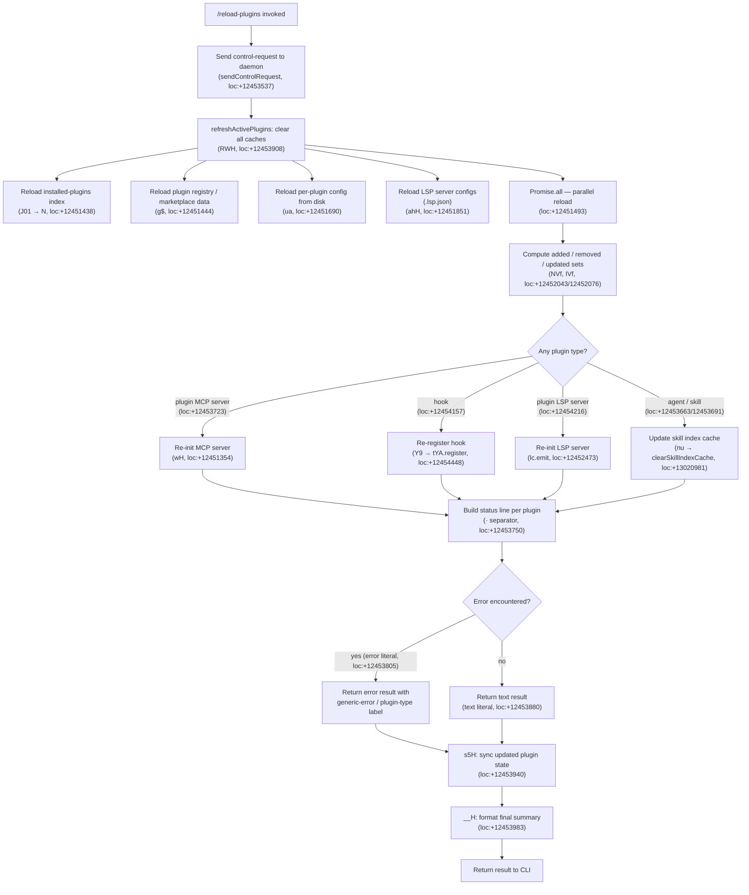

# `/reload-plugins`

> Analysis basis: CC v2.1.161 bundle.js (AST extraction + Claude interpretation)
> Minimum version: v2.1.161

---

## Overview

`/reload-plugins` activates pending plugin changes within the current session without requiring a full CLI restart. It triggers a full plugin-cache invalidation, re-reads plugin configuration from disk, re-initialises every affected MCP server and LSP server, and returns a structured status summary per plugin. The command dispatches a control request to the running daemon and is therefore only functional in interactive (non-thin-client) sessions.

---

## Registration

| Field | Value |
|---|---|
| type | `local` |
| name | `reload-plugins` |
| description | `Activate pending plugin changes in the current session` |
| supportsNonInteractive | `false` |
| thinClientDispatch | `"control-request"` |
| module_id | `ae1` |
| load_inline | `true` |
| loc_byte | `12454478` |
| loc_byte_end | `12454697` |
| loc_line | `8760` |
| arbor_handler.name | `kVf` |
| arbor_handler.fqn | `claude-2.1.161::kVf` |
| arbor_handler.kind | `AsyncFunction` |
| arbor_handler.resolution_path | `module_id` |
| arbor_handler.n_hits | `0` |

Analysis basis: CC v2.1.161 bundle.js:+12454478

---

## Input Branching

There are more than three distinct execution branches inside the handler and its core helpers, so a Mermaid flowchart is used.



---

## Behavioral Spec

### 1 — Handler Entry (`kVf`)

The command's async handler (`kVf`, resolved via `module_id` path) is the authoritative entry point.

```
async function reloadPluginsHandler(context):
    # Step 1: Dispatch a control-request to the local daemon
    requestType = "ccr"                          # literal loc:+12453518
    send controlRequest(requestType, context)

    # Step 2: Kick off the full plugin-cache refresh
    result = await refreshActivePlugins(context)

    # Step 3: Synchronise plugin state to disk
    syncPluginStateToDisk(context, result)

    # Step 4: Format and return output summary
    return formatReloadSummary(result)
```

Analysis basis: CC v2.1.161 bundle.js:+12453500

---

### 2 — Cache Invalidation (`RWH` — `refreshActivePlugins`)

This is the core reload routine. Before any disk I/O, it logs a fixed diagnostic message "refreshActivePlugins: clearing all plugin caches" (bundle.js:+12451386) and then clears every in-memory plugin cache.

```
async function refreshActivePlugins(context):
    log.debug("refreshActivePlugins: clearing all plugin caches")

    # Clear skill-index cache (nu, loc:+13021028)
    clearSkillIndexCache()

    # Clear FZ8 internal cache (Ca, loc:+13021045)
    clearInternalPluginCache()

    # Parallel reload of all config sources
    [
        installedPluginsIndex,   # J01 → N, loc:+12451438
        pluginRegistry,          # g$,      loc:+12451444
        perPluginConfig,         # ua,      loc:+12451690
        lspConfigs               # ahH,     loc:+12451851
    ] = await Promise.all([...])  # loc:+12451493

    # Compute diff sets
    added   = computeAdded(NVf, prev, next)     # loc:+12452043
    removed = computeRemoved(IVf, prev, next)    # loc:+12452076

    # Re-initialise servers in two passes (K.reduce, O.reduce)
    for each plugin in (added ∪ removed ∪ updated):
        reinitialisePlugin(plugin)

    # Emit reload event to UI layer
    emit(lc.emit, "reload_plugins")              # loc:+12452473

    return buildStatusSummary(added, removed, updated)
```

Analysis basis: CC v2.1.161 bundle.js:+12451384

---

### 3 — Installed-Plugins Index Reload (`J01` → `N`)

Reads the installed-plugins list from disk and rebuilds the in-memory index. The helper logs "Cleared installed plugins cache" (bundle.js:+9897591) on success.

```
async function reloadInstalledPluginsIndex():
    rawJson = await readFile(pluginIndexPath)
    parsed  = parseJSON(rawJson)          # m6 → JSON.parse, loc:+184932
    validateSchema(parsed)                # N validator
    log.debug("Cleared installed plugins cache")
    return parsed
```

Analysis basis: CC v2.1.161 bundle.js:+9897589

---

### 4 — Plugin Registry Reload (`g$`)

Re-reads all marketplace / registry metadata and clears any stale caches. Uses `ia7` to enumerate known marketplaces and `BC`/`nu` to clear the skill-index cache.

```
async function reloadPluginRegistry():
    marketplaces = enumerateMarketplaces(ia7)  # loc:+9863663
    for each marketplace:
        metadata = loadMarketplaceData(marketplace)
        validateMetadata(metadata)
    clearSkillIndexCache()                      # loc:+13020981
    return marketplaces
```

Analysis basis: CC v2.1.161 bundle.js:+9863750

---

### 5 — Per-Plugin Config Reload (`ua`)

Iterates workspace configuration files (`.mcp.json` at project and user scope) and reloads each plugin's configuration entry.

```
async function reloadPerPluginConfig(context):
    configPaths = resolveConfigPaths(context)  # loc:+6739256
    results = []
    for each configPath in configPaths:
        raw  = await readFile(configPath, "utf-8")   # loc:+6740451
        json = parseJSON(raw)                         # m6, loc:+6740600
        entries = Object.entries(json)
        for each [name, spec] in entries:
            plugin = buildPluginEntry(name, spec)     # KS_ / MHH
            results.push(plugin)
    return results
```

Analysis basis: CC v2.1.161 bundle.js:+6739223

---

### 6 — LSP Config Reload (`ahH`)

Reads `.lsp.json` files from the plugin root, validates schema, and rebuilds the LSP-server configuration map.

```
async function reloadLspConfigs(pluginRoot):
    lspFilePath = join(pluginRoot, ".lsp.json")      # loc:+8273830
    raw         = await readFile(lspFilePath)         # loc:+8273875
    parsed      = parseJSON(raw)                      # loc:+8273901
    if not validRecord(parsed):
        recordError("lsp-config-invalid")             # loc:+8274116
        return {}
    # Validate each sub-path is relative and within plugin dir
    for each entry in Object.entries(parsed):
        assertRelativePath(entry)                     # loc:+8275046
    return mergeWithDefaults(parsed)
```

Analysis basis: CC v2.1.161 bundle.js:+8273830

---

### 7 — Plugin State Synchronisation (`s5H`)

After the reload completes, the handler calls `s5H` to persist the updated plugin-state map and reconcile running server processes.

```
async function syncPluginState(context, reloadResult):
    current = state.get(PLUGIN_KEY)               # _.get, loc:+11612694
    merged  = merge(current, reloadResult)
    state.set(PLUGIN_KEY, merged)                 # _.set, loc:+11612730
    pluginSet.add(merged)                         # $.add, loc:+11612752

    # Reconcile each plugin entry
    for each [name, entry] in Object.entries(merged):
        if entry.status == "dependency-unsatisfied":  # loc:+11612630
            markUnsatisfied(name)
        elif entry.status == "not-found":             # loc:+11612667
            markNotFound(name)
        else:
            activatePlugin(entry, mI)             # loc:+11612856
```

Analysis basis: CC v2.1.161 bundle.js:+11612694

---

### 8 — Output Formatting (`__H`)

The final step assembles a human-readable result. Up to 5 plugin names are shown (literal `5` at bundle.js:+5048170); remaining entries are collapsed with a count. Each plugin line is separated by ` · ` (bundle.js:+12453750). Error entries are tagged with `"error"` (bundle.js:+12453805); success entries with `"text"` (bundle.js:+12453880).

```
function formatReloadSummary(pluginResults):
    visible = pluginResults.slice(0, 5)           # __H, loc:+5048227
    lines   = visible.map(formatPluginLine)       # loc:+5048174
    joined  = lines.join(" · ")
    if pluginResults.length > 5:
        joined += " + " + (pluginResults.length - 5) + " more"
    if anyError(pluginResults):
        return { type: "error", text: joined }
    return { type: "text", text: joined }
```

Analysis basis: CC v2.1.161 bundle.js:+12453983

---

## State & Side Effects

| Item | Detail |
|---|---|
| Telemetry | `tengu_feature_ok` (loc:+966587), `tengu_feature_bad` (loc:+966650), `tengu_feature_sad` (loc:+966732), `tengu_daemon_control` (loc:+15940522), `tengu_plugin_state_file_error` (loc:+9897770), `tengu_mcp_list_changed` (loc:+15693312), `tengu_daemon_config_reload` (loc:+15918997) |
| Control request | Dispatches a `"ccr"` typed control-request to the daemon (bundle.js:+12453518); thin-client sessions route via `thinClientDispatch: "control-request"` |
| Cache invalidation | Clears installed-plugins index cache, skill-index cache (`nu.clearSkillIndexCache`), and the internal `FZ8` cache (`Ca.clear`); logs "refreshActivePlugins: clearing all plugin caches" (bundle.js:+12451386) |
| MCP server restart | Calls `wH.sendMcpMessage` / `wH` reinit path for every plugin typed `"plugin MCP server"` (bundle.js:+12453723); emits `tengu_mcp_list_changed` |
| LSP server restart | Emits reload event via `lc.emit` (bundle.js:+12452473) for plugins typed `"plugin LSP server"` (bundle.js:+12454216) |
| Hook re-registration | Re-registers hooks via `tYA.register` (bundle.js:+59405) for plugins typed `"hook"` (bundle.js:+12454157) |
| Skill index | Calls `clearSkillIndexCache()` then rebuilds for plugins typed `"skill"` / `"agent"` (bundle.js:+12453663 / +12453691) |
| Disk writes | `s5H` may persist updated plugin state; `QQ6`/`IBK`/`NBK` perform append/write operations on plugin-state files |
| Sound | None observed |
| appState changes | Plugin state map updated in-memory via `_.get`/`_.set` (bundle.js:+11612694/+11612730); MCP client map updated via `wH.set` (bundle.js:+5261109) |
| Non-interactive support | `supportsNonInteractive: false` — command is blocked in non-interactive mode |

---

## Version History

| Version | Change |
|---|---|
| v2.1.161 | Initial analysis |

---

## Common Mistakes

1. **Running in non-interactive mode**: `supportsNonInteractive` is `false`; invoking `/reload-plugins` in a script or pipe will be rejected before the handler fires.
2. **Expecting instant MCP reconnection**: MCP server reinitialisation is asynchronous. If a plugin's server process takes time to start, subsequent tool calls may briefly see "pending" state.
3. **Assuming all plugin types are restarted**: Only plugins typed `"plugin MCP server"`, `"plugin LSP server"`, `"hook"`, `"agent"`, and `"skill"` receive targeted re-initialisation. Plugins with unrecognised types are processed by the generic-error path (bundle.js:+12453035).
4. **Confusing `/reload-plugins` with a full restart**: The command reloads configuration and re-initialises servers within the current session; it does not restart the CLI process or the daemon.
5. **Missing the `.lsp.json` requirement**: LSP plugin configs are only refreshed if a valid `.lsp.json` exists in the plugin root and all paths inside it are relative and within the plugin directory (bundle.js:+8275046). An invalid file silently falls through to the `lsp-config-invalid` error path.

---

## Appendix — Identifier Mapping

> For bundle debugging only. Identifiers change across versions.

| Identifier | Role |
|---|---|
| `kVf` | Main handler — `reloadPluginsHandler` (AsyncFunction, arbor_handler) |
| `OL` | Control-request dispatcher helper |
| `WEH` | Low-level IPC send |
| `RWH` | `refreshActivePlugins` — core cache-clear + reload orchestrator |
| `N` | JSON schema validator / normaliser |
| `VBK` | Plugin record validator |
| `HwA` | Nested validation helper |
| `J01` | Installed-plugins index loader |
| `g$` | Plugin registry / marketplace reload |
| `ia7` | Marketplace enumerator |
| `o0` | Marketplace config builder |
| `BC` | Skill-index cache manager |
| `nu` | `clearSkillIndexCache` wrapper |
| `nRH` | Post-clear registry notifier |
| `Ca` | Internal `FZ8` cache clearer |
| `ua` | Per-plugin config loader (`.mcp.json`) |
| `ZB` | Config-path suffix checker (`.mcpb` / `.dxt`) |
| `KS_` | `.mcp.json` file reader + parser |
| `m6` | `JSON.parse` wrapper |
| `k8` | Error-code normaliser (`ENOENT`, `EISDIR`) |
| `yR9` | Plugin entry builder |
| `G26` | `.dxt` / `.mcpb` archive extractor |
| `TH` | String converter |
| `ahH` | LSP config loader (`.lsp.json`) |
| `OC7` | LSP entry validator + path checker |
| `$C7` | Relative-path resolver for LSP entries |
| `Gn` | Pre-reload diagnostic emitter |
| `u8` | Log/debug emitter |
| `NVf` | Added-plugin set calculator |
| `IVf` | Removed-plugin set calculator |
| `s5H` | Plugin-state synchroniser (persist to memory/disk) |
| `mI` | Plugin activator |
| `r5` | Known-marketplaces index reader |
| `tZ8` | Marketplace path builder |
| `xIH` | Plugin entry iterator |
| `m8` | Plugin descriptor builder |
| `xd6` | Plugin type discriminator |
| `TQ` | Plugin type registry |
| `XZ` | Error-factory for plugin scope |
| `gA` | Scope string parser |
| `Z2` | Dependency resolver entry |
| `Dz9` | URL/git-scheme parser |
| `JX6` | Dependency graph walker |
| `va` | Marketplace metadata loader |
| `jN6` | Marketplace file path builder |
| `Ii_` | Marketplace JSON validator |
| `bG` | Plugin scope resolver |
| `UI_` | Scope-aware config loader |
| `IYf` | Plugin installation-state checker |
| `k26` | Plugin install/update orchestrator (large coordinator) |
| `D$8` | Dependency policy checker |
| `c56` | Local source path sanitiser |
| `z` | MCP server process manager |
| `hH` | Daemon feature-ok reporter |
| `RH` | Daemon feature-bad reporter |
| `ly` | First-party plugin marker |
| `qp` | Daemon process lifecycle (race/kill) |
| `h6` | Context-store accessor |
| `sg6` | AsyncLocalStorage getter |
| `EZ` | Plugin state file loader |
| `yi_` | Plugin state file reader (sync) |
| `hi_` | Plugin state entry iterator |
| `WN6` | Plugin state file error reporter |
| `J` | Running MCP server set |
| `w` | MCP server spawn / lifecycle manager |
| `W` | MCP client connection manager |
| `Y16` | MCP client factory |
| `a_` | Error/string coercer |
| `$v` | Plugin scope validator |
| `RI` | Resolution integrity checker |
| `i58` | Semver validity checker |
| `G` | Keyboard-event / UI gate |
| `D` | Daemon supervisor write/update |
| `PD9` | Plugin dependency policy evaluator |
| `M` | Managed-scope guard |
| `JV` | Flag-settings updater |
| `X` | Main REPL/input handler |
| `j` | Background-session kill helper |
| `h` | Idle-timer / focus tracker |
| `lfA` | Vim-mode operator registry |
| `C` | Command executor (enqueue) |
| `R` | File realpath + stat resolver |
| `gSK` | Filesystem realpath helper |
| `S$` | Stat result wrapper |
| `S95` | Filesystem error emitter |
| `u` | Write-queue with timeout |
| `Q29` | Plugin-queue manager |
| `m` | Interval-cleared write scheduler |
| `l_` | Settings loader + writer |
| `BO` | Settings bootstrap |
| `Xe8` | Settings file initialiser |
| `mX` | Settings migration helper |
| `wt8` | Settings-write timestamp recorder |
| `qTH` | Settings schema bootstrapper |
| `Y56` | Atomic file writer (tempfile + rename) |
| `nz` | Settings cache clearer |
| `QQ6` | Settings append/write helper |
| `wx` | `.claude` directory path builder |
| `np` | Settings reload runner |
| `N26` | Plugin root path validator |
| `l` | MCP server connection loop |
| `B` | MCP buffer/connection set |
| `P` | MCP byte-stream reader |
| `BP6` | MCP message length parser |
| `of8` | MCP message boundary finder |
| `d` | Core log emitter |
| `lVK` | Boolean sentinel checker |
| `g` | UI write-buffer flusher |
| `Ve` | Whitelist-set checker |
| `c8H` | Connection state filter |
| `MH` | Interactive input dispatcher (keyboard/MCP) |
| `XxH` | Input key extractor |
| `wR6` | MCP schema normaliser |
| `jH` | Input event object |
| `HH` | Timeout-guarded UI action |
| `t` | Voice-input session manager |
| `eH` | Hook event collector |
| `e` | Notification dispatcher |
| `$H` | Enqueue-with-rate-limit helper |
| `CH` | Channel map accessor |
| `jR6` | MCP schema field builder |
| `_H` | MCP tool-list refresh handler |
| `P9H` | Pending-approval state holder |
| `N96` | MCP notification type constant |
| `JR6` | MCP list-changed broadcaster |
| `wH` | MCP client send / reconnect manager |
| `bH` | Timer-guarded plugin-state list |
| `E` | MCP client factory shim |
| `a` | Voice silence-timeout toggler |
| `qH` | MCP server state snapshot builder |
| `zH` | Plugin-error accumulator map |
| `RX6` | Semver range conflict detector |
| `Nv_` | Semver range normaliser |
| `M$8` | Plugin hash/checksum builder |
| `C29` | Hash computation helper |
| `$$8` | NPM/git version resolver |
| `DtL` | Version resolution type router |
| `b8` | Config file existence prober |
| `I26` | Plugin installation orchestrator |
| `erH` | Plugin source-type handler |
| `w$8` | Plugin zip/tarball downloader |
| `l29` | Download cache path builder |
| `$_H` | Subdir hash extractor |
| `uI` | Plugin unpack helper |
| `s58` | Plugin directory scanner |
| `VB` | Plugin version validator |
| `djH` | Plugin unpack dispatcher |
| `z$8` | Old-plugin cleanup helper |
| `RI_` | Plugin registry updater |
| `Q` | Readline interface wrapper |
| `nH` | Message-buffer trimmer |
| `XH` | MCP server feature-flag checker |
| `RF` | Remote-feature resolver |
| `N6` | UI render helper |
| `i` | MCP server apply-update handler |
| `ZH` | MCP server extended feature checker |
| `Q$` | Extended feature resolver |
| `IH` | Message concat helper |
| `V` | Message type validator |
| `XtL` | Plugin validation orchestrator |
| `c` | Plugin file reader/unlinker |
| `gk6` | Plugin file read helper |
| `Eu1` | Plugin file unlink helper |
| `o` | MCP server parallel-update mapper |
| `MB` | Async-mapper with abort |
| `H_6` | Integer parser (radix helper) |
| `Cv8` | Controlled parseInt wrapper |
| `KCH` | MCP capability handler |
| `G3A` | Remote-server recovery monitor |
| `CI` | Case-insensitive name checker |
| `u$` | Phone-home / auth checker |
| `pH` | String coercer |
| `N4` | OTEL metrics attribute builder |
| `SIH` | OTEL resource attribute assembler |
| `nK6` | OTEL metric recorder |
| `XB8` | OTEL span builder |
| `WB8` | OTEL event emitter |
| `KH` | Focus-triggered voice auto-start |
| `__H` | Final output summary formatter |

---

Note: index built via Arbor fallback; some signals (telemetry, literals) may be missing — see arbor-fallback.js.