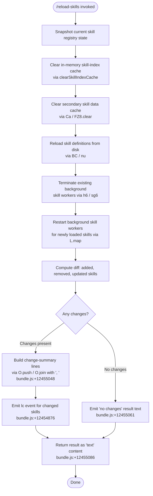

# `/reload-skills`

> Analysis basis: CC v2.1.161 bundle.js (AST extraction + Claude interpretation)
> Minimum version: v2.1.161

---

## Overview

`/reload-skills` rescans the filesystem for skill definitions that were added or modified during the current session, invalidates all relevant in-memory skill caches, restarts any background skill-loading workers, and returns a human-readable summary of which skills changed (added, removed, or updated). It is designed to make on-disk skill edits visible to the running Claude Code process without requiring a full restart.

---

## Registration

| Field | Value |
|---|---|
| type | `local` |
| name | `reload-skills` |
| description | `Pick up skills added or changed on disk during this session` |
| loc_byte | `12455247` |
| loc_byte_end | `12455464` |
| loc_line | `8760` |
| supportsNonInteractive | `true` |
| thinClientDispatch | `post-text` |
| module_id | `ee1` |
| load_inline | `true` |
| arbor_handler.name | `hVf` |
| arbor_handler.fqn | `claude-2.1.161::hVf` |
| arbor_handler.kind | `AsyncFunction` |
| arbor_handler.resolution_path | `module_id` |
| arbor_handler.n_hits | `0` |

Analysis basis: CC v2.1.161 bundle.js:+12455247

---

## Input Branching

The command has 4+ distinct outcome branches depending on the diff between the previously loaded skill set and what is now present on disk. A Mermaid flowchart is used below.



---

## Behavioral Spec

### 1. Handler Entry Point (`hVf` → `reloadSkillsHandler`)

The command handler is the async function `hVf`, resolved by Arbor via the `module_id` path from module `ee1`.

Analysis basis: CC v2.1.161 bundle.js:+12454769

```
async function reloadSkillsHandler(context):
    // Step 1: Capture pre-reload skill set
    previousSkills = getSkillStore()          // h6 → sg6 path

    // Step 2: Invalidate all skill caches
    reloadSkillIndex()                        // BC → nu → H.clearSkillIndexCache
    clearSecondarySkillCache()                // Ca → FZ8.clear

    // Step 3: Re-read skills from disk
    newSkills = loadSkillDefinitionsFromDisk()  // BC → nu → N6A

    // Step 4: Rebuild background workers
    shutdownExistingWorkers()                 // h6 → P_
    startWorkersForSkills(newSkills)          // L.map, with q.add / q.delete / f.finally

    // Step 5: Compute diff
    addedSkills   = newSkills.filter(s => !previousSkills.has(s))
    removedSkills = previousSkills.filter(s => !newSkills.has(s))   // q.filter + f.has
    updatedSkills = newSkills.filter(s => hasChanged(s, previousSkills))  // L.filter + K.has

    // Step 6: Emit change event
    emitSkillChangeEvent(addedSkills, removedSkills, updatedSkills)  // lc.emit

    // Step 7: Build output
    if addedSkills.length == 0 AND removedSkills.length == 0 AND updatedSkills.length == 0:
        return textResult("no changes")      // literal "no changes" bundle.js:+12455061
    else:
        summaryLines = []
        for each changed skill:
            summaryLines.push(formatSkillEntry(skill))   // O.push → u8
        return textResult(summaryLines.join(", "))       // O.join(", ") bundle.js:+12455048/12455055
```

Analysis basis: CC v2.1.161 bundle.js:+12454769–12455131

---

### 2. Skill Store Snapshot and Worker Shutdown (`h6` → `getAndShutdownSkillWorkers`)

Before reloading, the handler captures the current worker/store state and signals existing background skill processes to terminate.

```
function getAndShutdownSkillWorkers():
    store = skillContextStore.getStore()     // sg6 → ag6.getStore (bundle.js:+976820)
    pendingWorkers = getActiveWorkers(store) // sg6 → ji         (bundle.js:+976841)
    shutdownAllWorkers(pendingWorkers)       // P_ → XN          (bundle.js:+41565)
    return store
```

Analysis basis: CC v2.1.161 bundle.js:+976820, +976841, +976890

---

### 3. Skill Index Reload (`BC` / `nu` → `reloadSkillIndex`)

This is the core cache-invalidation and re-fetch sequence. It resolves any previously resolved index promise, clears the skill index cache, then re-triggers index construction.

```
async function reloadSkillIndex():
    await Promise.resolve()                        // nu → Promise.resolve (bundle.js:+13020929)
    triggerIndexRebuild()                          // nu → N6A             (bundle.js:+13020959)
    skillIndexProvider.clearSkillIndexCache()      // nu → H.clearSkillIndexCache (bundle.js:+13020981)
    // BC also calls:
    clearWorkerPool()                              // BC → iZ8             (bundle.js:+13021033)
    resetWorkerRegistry()                          // BC → rW1             (bundle.js:+13021039)
    rebuildNotificationRoutes()                    // BC → nRH → uN6       (bundle.js:+13021045)
```

Analysis basis: CC v2.1.161 bundle.js:+13020929, +13020959, +13020981, +13021028

---

### 4. Secondary Cache Clear (`Ca` → `clearSecondarySkillCache`)

A separate in-memory skill data structure is cleared independently of the index cache.

```
function clearSecondarySkillCache():
    skillDataMap.clear()    // Ca → FZ8.clear (bundle.js:+9840320)
    // Internal counter reset to 1
    // (numeric literal 1 at bundle.js:+9840337)
```

Analysis basis: CC v2.1.161 bundle.js:+9840320, +9840337

---

### 5. Background Worker Restart (`L` → `restartSkillWorkers`)

After the index is cleared, background workers for each skill are restarted. Each worker is tracked in a set; cleanup is guaranteed via `finally`.

```
function restartSkillWorkers(skills):
    for each skill in skills:
        worker = createWorker(skill)      // L → q.add  (bundle.js:+15909570)
        worker.run()
            .finally(() =>
                workerSet.delete(worker)  // L → q.delete (bundle.js:+15909593)
            )
        // Worker type uses toLowerCase for name normalisation
        // (A → f.toLowerCase, bundle.js:+15930262)
        // Worker names are padded to width 40
        // (f.padEnd, literal 40 at bundle.js:+15930336)
```

Analysis basis: CC v2.1.161 bundle.js:+15909570, +15909579, +15909593, +15930262, +15930336

---

### 6. Skill Change Detection and Output Formatting

Diff sets are computed by cross-referencing the old and new skill registries, then a human-readable string is built.

```
function buildChangeSummary(added, removed, updated):
    lines = []
    for each skill in (added ∪ removed ∪ updated):
        entry = formatSkillEntry(skill)    // u8 at bundle.js:+15940394, +12455131
        // u8 uses "stopped" (bundle.js:+15940356) and "background session"
        // (bundle.js:+15940399) for worker-state annotation
        lines.push(entry)
    if lines.isEmpty():
        return { type: "text", text: "no changes" }   // bundle.js:+12455061, +12455086
    else:
        return { type: "text", text: lines.join(", ") }  // bundle.js:+12455048/12455055
    // Result content-type literal: "text"   (bundle.js:+12455086)
    // Result tag literal:          "skill"  (bundle.js:+12455143)
```

Analysis basis: CC v2.1.161 bundle.js:+12454892, +12454907, +12454931, +12454946, +12454980, +12455048, +12455061, +12455086, +12455143

---

### 7. Skill Index Provider / Bootstrap Fetch (`H` / `N` → `skillIndexProvider`)

The skill index provider used by `clearSkillIndexCache` internally performs HTTP bootstrap fetches when building a fresh index. Relevant observable constants:

- HTTP request header `Content-Type: application/json` (bundle.js:+15504207, +15504222)
- HTTP request header `User-Agent` set to the package identity (bundle.js:+15504241)
- Bootstrap fetch timeout: **5000 ms** (bundle.js:+15504313)
- Telemetry event on fetch: `api_bootstrap_fetch` (bundle.js:+15504434)
- Parse-failure sub-state label: `parse_failed` (bundle.js:+15504456)
- Log prefix for fetch start: `"[Bootstrap] Fetching"` (bundle.js:+15504122)
- Log prefix for fetch success: `"[Bootstrap] Fetch ok"` (bundle.js:+15504486)

Analysis basis: CC v2.1.161 bundle.js:+15504122, +15504207, +15504241, +15504313, +15504434

---

## State & Side Effects

| Item | Detail |
|---|---|
| Telemetry | `tengu_feature_sad` — fired from within worker/session management (`d` call, bundle.js:+966732) |
| Skill index cache | Cleared via `H.clearSkillIndexCache` (bundle.js:+13020981) |
| Secondary skill data map | Cleared via `FZ8.clear` (bundle.js:+9840320) |
| Worker pool | All existing background skill workers are shut down and new ones are started (bundle.js:+15909570–15909593) |
| Notification routes | Reset via `nRH` / `uN6` (bundle.js:+13021045) |
| Worker registry | Reset via `rW1` (bundle.js:+13021039) |
| Event emission | `lc.emit` fires after diff is computed (bundle.js:+12454876) |
| Output content type | `"text"` (bundle.js:+12455086) |
| Output tag | `"skill"` (bundle.js:+12455143) |
| thinClientDispatch | `post-text` — result is posted as text in thin-client mode |
| supportsNonInteractive | `true` — safe to invoke from non-interactive / scripted contexts |
| Bootstrap HTTP timeout | 5000 ms hard limit on index fetch (bundle.js:+15504313) |

---

## Version History

| Version | Change |
|---|---|
| v2.1.161 | Initial analysis |

---

## Common Mistakes

1. **Expecting instant availability of reloaded skills** — the command is async and background workers are restarted; newly loaded skills may not be immediately queryable until worker initialisation completes.
2. **Running in non-interactive scripts and ignoring exit codes** — `supportsNonInteractive: true` means the command will run, but if the index bootstrap fetch times out (5000 ms limit), the reload may silently return a partial skill set.
3. **Assuming `/reload-skills` also reloads MCP tools or other plugin types** — the command targets only the skill subsystem (`FZ8`, skill index, skill workers). MCP tools require their own reload mechanism.
4. **Misreading "no changes" as an error** — when the on-disk skill files are identical to what was already loaded, the command correctly returns `"no changes"` (bundle.js:+12455061) and exits cleanly; this is not a failure.
5. **Calling the command repeatedly in rapid succession** — each invocation clears caches and restarts workers; rapid back-to-back invocations may leave orphaned worker teardown tasks due to the `finally`-based cleanup pattern (bundle.js:+15909579).

---

## Appendix — Identifier Mapping

> For bundle debugging only. Identifiers change across versions.

| Identifier | Role |
|---|---|
| `hVf` | Main async handler for `/reload-skills` (entry point, `AsyncFunction`) |
| `h6` | Get-current-skill-store-and-initiate-worker-shutdown helper |
| `sg6` | Skill context store accessor (reads async-context store, invokes pending-worker getter) |
| `ji` | Active-skill-worker list retrieval |
| `P_` | Worker shutdown dispatcher |
| `XN` | Low-level worker termination primitive |
| `q` | Worker set / background-job registry (add, delete, filter operations) |
| `BC` | Top-level skill index reload coordinator |
| `nu` | Skill index cache invalidation and rebuild trigger |
| `H` | Skill index provider (holds `clearSkillIndexCache`, bootstrap fetch logic) |
| `N` | HTTP bootstrap fetch implementation |
| `s$` | URL or request builder used during bootstrap fetch |
| `ne` | Cache presence check helper (WA4.has) |
| `Ij` | String replacement utility used in index provider |
| `lq` | Index path/key normalization helper |
| `t6` | Session/worker telemetry reporter (fires `tengu_feature_sad`) |
| `iZ8` | Worker pool clear function |
| `rW1` | Worker registry reset function |
| `nRH` | Notification route rebuilder |
| `uN6` | Notification channel map reader (TV8.get) |
| `bN6` | Notification channel constructor/helper |
| `Ca` | Secondary skill data cache clear dispatcher |
| `L` | Per-skill background worker launcher (maps over skill list) |
| `f` | Individual background worker instance (open/close/finally) |
| `A` | Worker name normalizer (toLowerCase) |
| `K` | Skill name formatter (padEnd to width 40) |
| `O` | Output lines accumulator (push / join) |
| `u8` | Skill entry formatter (produces "stopped" / "background session" annotations) |

---

Note: index built via Arbor fallback; some signals (telemetry, literals) may be missing — see arbor-fallback.js.