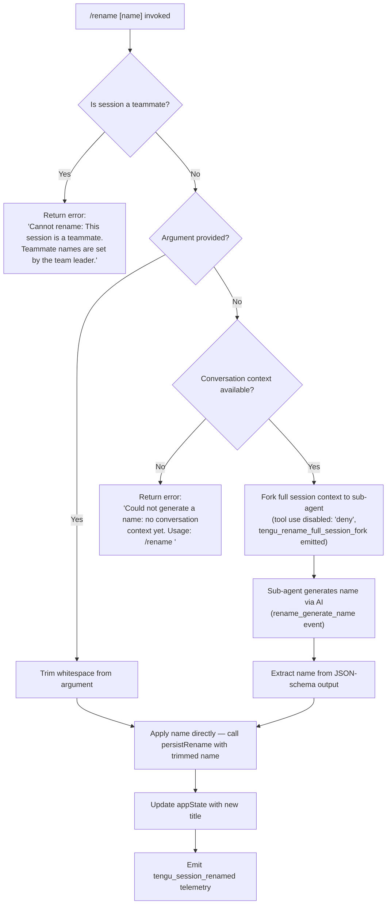

# `/rename`

> Analysis basis: CC v2.1.161 bundle.js (AST extraction + Claude interpretation)
> Minimum version: v2.1.161

---

## Overview

The `/rename` command allows the user to set a human-readable title for the current conversation session, either by supplying a name directly as an argument or by triggering an AI-assisted name generation when no argument is provided. It persists the chosen title to the session storage backend and emits a telemetry event upon success.

---

## Registration

| Field | Value |
|---|---|
| type | `local-jsx` |
| name | `rename` |
| description | `Rename the current conversation` |
| argumentHint | `[name]` |
| immediate | `true` |
| aliases | `["name"]` |
| module_id | `Nd1` |
| load_inline | `true` |
| loc_byte | `11895783` |
| loc_byte_end | `11895982` |
| loc_line | `8186` |
| arbor_handler.name | `aPf` |
| arbor_handler.fqn | `claude-2.1.161::aPf` |
| arbor_handler.kind | `AsyncFunction` |
| arbor_handler.resolution_path | `module_id` |
| arbor_handler.n_hits | `0` |

Analysis basis: CC v2.1.161 bundle.js:+11895783

---

## Input Branching

The command has four distinct execution paths depending on whether a name argument is provided, whether the session is a teammate, and whether conversation context exists for AI generation.



Analysis basis: CC v2.1.161 bundle.js:+11894947, +11895046, +11895158, +11893171, +11893195

---

## Behavioral Spec

### Main Handler (aPf)

The top-level async handler `aPf` coordinates between the input parser, teammate guard, and two rename paths. It calls the inner rename executor (`ky8`) and the session write helper (`Iy8`).

```
async function mainRenameHandler(context, args):
    sessionStore = getSessionStore(context)          // via fM → u0 → cL_.getStore
    trimmedArg   = args.trim()                       // via ky8 → H.trim

    if isTeammateSession(sessionStore):
        return errorMessage(
            "Cannot rename: This session is a teammate. " +
            "Teammate names are set by the team leader."
        )

    if trimmedArg is non-empty:
        applyRename(sessionStore, trimmedArg)
    else:
        result = await generateNameFromContext(sessionStore, context)
        if result is error:
            return result
        applyRename(sessionStore, result.name)
```

Analysis basis: CC v2.1.161 bundle.js:+11895479, +11895495, +11895537, +11894947, +11895046

---

### Teammate Guard

The teammate guard inspects session metadata before any rename operation is attempted.

```
function isTeammateSession(sessionStore):
    // Reads session role flag from store
    if session.role == "teammate":
        return true
    return false
```

Error string (citation fragment): `"Cannot rename: This session is a teamm…"` (bundle.js:+11894947)

---

### Direct Rename Path (ky8 — rename executor)

When the user supplies a name argument, the executor trims it and delegates directly to the persistence layer.

```
function directRename(sessionStore, name):
    sanitized = name.trim()
    persistRename(sessionStore, sanitized)          // via IBK / persistSessionTitle
    setAppState(title: sanitized)                   // via _.setAppState (bundle.js:+11895286)
    triggerStorageFlush(sessionStore)               // via NCH compound write path
    emitTelemetry("tengu_session_renamed")
```

Analysis basis: CC v2.1.161 bundle.js:+11895046, +11895080, +11895272, +11895286

---

### AI-Assisted Name Generation Path (CA6 — full session fork)

When no argument is supplied and conversation context exists, a sub-agent is forked to generate a candidate name.

```
async function generateNameFromContext(sessionStore, context):
    if conversationHistory is empty:
        return error(
            "Could not generate a name: no conversation context yet. " +
            "Usage: /rename <name>"
        )

    emit("tengu_rename_full_session_fork")          // bundle.js:+11893635

    subAgentConfig = {
        toolPermission: "deny",                     // bundle.js:+11893077
        systemNote:     "Session name generation cannot use tools",
                                                    // bundle.js:+11893092
        outputSchema:   "json_schema",              // bundle.js:+11894007
        origin:         "rename",                   // bundle.js:+11893171
    }

    forkTimestamp = Date.now()                      // via ut_ bundle.js:+10816709
    agentResponse  = await forkAgentAndRun(
                         subAgentConfig,
                         conversationHistory,
                         context
                     )                              // via oPf → t0 → GT8

    candidateName  = extractTextFromResponse(agentResponse)
                                                    // via vy8, vd1
    emit("rename_generate_name")                    // literal bundle.js:+11893195

    return { name: candidateName }
```

Analysis basis: CC v2.1.161 bundle.js:+11895158, +11893635, +11893077, +11893092, +11893171, +11893195, +11893692

---

### Session Persistence (NCH — compound write)

The persistence subsystem reached via `NCH` handles writing the title to disk. It resolves the conversation's storage path, distinguishes `custom-title` from `ai-title` tags, and atomically appends / updates the JSONL record.

```
function persistSessionTitle(sessionPath, title, origin):
    dirPath = path.dirname(sessionPath)             // via IBK → he.dirname (bundle.js:+204119)
    ensure directory exists                         // via NBK → Ay.mkdir (bundle.js:+203840)

    tag = (origin == "rename") ? "custom-title"    // literal bundle.js:+13061772
                               : "ai-title"        // literal bundle.js:+13061936

    record = buildRecord(title, tag)
    appendToFile(dirPath, record)                   // via CMH → A.appendFileSync (bundle.js:+13060819)

    if legacy .txt sidecar exists:                  // literal bundle.js:+203545
        renameSidecar(...)                          // via UJA → Ay.rename (bundle.js:+203597)

    emit("tengu_session_renamed")                   // bundle.js:+13061864
```

Analysis basis: CC v2.1.161 bundle.js:+204119, +203840, +13061772, +13061936, +13060819, +203545, +203597, +13061864

---

### appState Update

After the title is written to disk, the in-memory application state is patched so the UI reflects the new name immediately.

```
function applyAppStateTitle(newTitle):
    currentState = getAppState()
    updatedState = Object.assign({}, currentState, { title: newTitle })
                                                    // via GT8 → Object.assign (bundle.js:+10819249)
    setAppState(updatedState)                       // via GT8 → H.setAppState (bundle.js:+10819150)
    invalidateStateCache(_I8)                       // bundle.js:+11895305
```

Analysis basis: CC v2.1.161 bundle.js:+10819150, +10819249, +11895286, +11895305

---

### Storage Filename Helper (gj)

A small helper extracts the basename of the conversation file and formats the canonical path used when persisting the title.

```
function getConversationBasename(filePath):
    base = path.basename(filePath)                  // via gj → w2.basename (bundle.js:+4136524)
    return formatStoragePath(base)                  // via gj → N6 (bundle.js:+4136546)
```

Analysis basis: CC v2.1.161 bundle.js:+11895332, +4136524, +4136546

---

## State & Side Effects

| Item | Detail |
|---|---|
| Telemetry — rename fork | `tengu_rename_full_session_fork` (bundle.js:+11893635) — fired when AI name generation path is taken |
| Telemetry — session renamed | `tengu_session_renamed` (bundle.js:+13061864) — fired after successful persistence write |
| Telemetry — agent name set | `tengu_agent_name_set` (bundle.js:+13064892) — fired by the sub-agent name resolver |
| Telemetry — fork agent query | `tengu_fork_agent_query` (bundle.js:+10822834) — fired within sub-agent execution |
| Telemetry — forked agent turns exceeded | `tengu_forked_agent_default_turns_exceeded` (bundle.js:+10822391) |
| Telemetry — feature sad | `tengu_feature_sad` (bundle.js:+966732) — general error reporting path |
| Telemetry — config parse error | `tengu_config_parse_error` (bundle.js:+3251872) |
| appState changes | `title` field updated in-memory via `H.setAppState` (bundle.js:+10819150) |
| Disk write | JSONL record with `custom-title` or `ai-title` tag appended to conversation storage directory |
| Legacy sidecar rename | If a `.txt` sidecar file exists, it is renamed atomically (bundle.js:+203545, +203597) |
| Hook registration | `Y9` registers a cleanup / timeout hook via `tYA.register` (bundle.js:+59405) |
| Tool permissions | Sub-agent launched with tool use set to `"deny"` (bundle.js:+11893077) |
| Sound | Not found in depth-2 traversal |

---

## Version History

| Version | Change |
|---|---|
| v2.1.161 | Initial analysis |

---

## Common Mistakes

1. **Invoking `/rename` in a teammate session** — The command unconditionally rejects rename requests when the session role is `teammate`, returning the hard-coded message at bundle.js:+11894947. Use the team leader session to set names.
2. **Calling `/rename` before any conversation turn** — If the conversation history is empty and no name argument is given, the command returns the error `"Could not generate a name: no conversation context yet. Usage: /rename <name>"` (bundle.js:+11895158) rather than attempting AI generation.
3. **Expecting instant UI refresh via a page reload** — The title update is applied through `setAppState`, not through a file-reload cycle; any code that reads the title from disk may be momentarily stale until the next storage sync.
4. **Using `/rename` and `/name` interchangeably in scripts** — Both aliases invoke identical behavior (registration alias array, bundle.js:+11895783), so either is safe; however, tooling that parses command output should not rely on which alias was used.
5. **Assuming AI generation respects the current model selection** — The name-generation sub-agent is forked with `tool use: deny` and its own system prompt; it does not inherit all parent-session settings.

---

## Appendix — Identifier Mapping

> For bundle debugging only. Identifiers change across versions.

| Identifier | Role |
|---|---|
| `aPf` | Main async rename handler (arbor_handler; entry point resolved via module_id) |
| `ky8` | Inner rename executor — handles argument presence check and dispatch |
| `Iy8` | Session write helper called from main handler |
| `CA6` | AI-assisted name generation orchestrator (full session fork) |
| `oPf` | Sub-agent fork runner — sets up AbortController, runs forked agent |
| `t0` | Core agent query loop invoked by sub-agent fork |
| `GT8` | App-state read/write coordinator; calls `getAppState` / `setAppState` |
| `NCH` | Compound session-persistence writer (resolves path, writes JSONL record) |
| `IBK` | Session title persistence layer — directory setup, file append, sidecar rename |
| `NBK` | Storage append helper — mkdir + appendFile + rename |
| `UJA` | Sidecar file rename/unlink helper (handles legacy `.txt` files) |
| `BJA` | Path builder for session storage joins |
| `_3H` | Storage record formatter |
| `CMH` | Low-level JSONL append writer (appendFileSync + mkdirSync) |
| `JS` | Session title commit function (emits `tengu_session_renamed`) |
| `Lt` | Alternative session title commit path (also calls CMH + cv) |
| `cv` | Conversation path resolver used by JS and Lt |
| `m5H` | Agent-name setter path (emits `tengu_agent_name_set`) |
| `oQ` | Session state persistence utility |
| `u36` | File-backed state read/write helper (readFile / writeFile) |
| `aYH` | Background state manager (job queue, file watcher) |
| `q1` | Background job processor — reads/writes session state files |
| `W5` | Atomic file writer using temp rename |
| `t3` | Low-level atomic write (randomBytes temp name + rename) |
| `Fj` | Cache invalidator for session state entries |
| `gj` | Conversation basename formatter |
| `N6` | Path formatter / normalizer utility |
| `vG` | Path join helper for job directory |
| `aK` | Job queue path resolver |
| `_I8` | appState cache key invalidator (Object.keys scan) |
| `ut_` | Fork timestamp recorder (Date.now) |
| `WK6` | Fork config builder |
| `vy8` | Response text extractor — flattens array or string response from sub-agent |
| `vd1` | Response normalizer helper used by rename and other commands |
| `XR` | String trim wrapper used in response normalization |
| `TH` | String coercion utility |
| `SH` | JSON serializer utility (JSON.stringify) |
| `N` | File-name sanitizer / slug builder (toUpperCase, replace, trim, etc.) |
| `Z4` | Path extension stripper (lastIndexOf + slice) |
| `CJA` | Path segment mapper |
| `imH` | File write dispatcher |
| `GJA` | Low-level file write helper |
| `fM` | Session store accessor |
| `u0` | AsyncLocalStorage `getStore` wrapper |
| `WmH` | Debounced write scheduler (clearTimeout / setTimeout / setImmediate) |
| `Y9` | Hook / cleanup registrar (tYA.register) |
| `jh` | Agent execution wrapper — builds tool list, calls agent, handles response |
| `uK` | Tool schema builder |
| `FV8` | Tool-call serialiser / file cacher |
| `xG` | Agent message processing pipeline |
| `mbH` | Response extraction helper — finds assistant message content |
| `Ur_` | Minimal agent wrapper around FV8 |
| `p7K` | Core API query function (streaming + non-streaming) |
| `tX` | Model selector / auth resolver |
| `PA` | Provider resolver |
| `lq` | Model alias expander |
| `s9` | Model string normaliser |
| `pL_` | Auth token prefix parser |
| `hK` | Tool filter helper |
| `NCH` | (see above — compound session persistence writer) |
| `nG` | No-op / guard used in persistence path |
| `cs` | Conditional branch in persistence |
| `M` | Plugin/path safety checker |
| `nC6` | Path safety validator (relative path check) |
| `iC6` | Plugin path builder |
| `OL` | File event emitter wrapper |
| `WEH` | Watcher event handler |
| `MqH` | Metadata update helper in persistence chain |
| `f` | Active-connection tracker |
| `Rh` | Hex token generator (randomBytes 8 bytes) |
| `Nm` | Sub-agent exit / lifecycle event emitter |
| `RI6` | Tombstone / message-type checker |
| `xI1` | In-progress tool-use ID setter |
| `Y` | Process shutdown handler (process.exit + abort) |
| `m7H` | Tool-use filter and accumulator |
| `K7f` | Final agent response formatter |
| `C8` | Text-input component (editor widget) |
| `X` | Text buffer / cursor manager |
| `P` | Stream buffer accumulator |
| `d` | Logger / debug output utility |
| `h1H` | Sub-logger factory |
| `Xa8` | Logger sink |
| `v8` | Error code matcher |
| `k8` | ENOENT / stat error guard |
| `df` | Filesystem error classifier |
| `yH` | Notification / toast dispatcher |
| `a_` | Error formatter |
| `r9` | Notification queue processor |
| `qkA` | Notification renderer |
| `s44` | Notification ring-buffer manager |
| `EG` | Agent execution finaliser |
| `hqH` | Streaming idle-timeout handler |
| `gN8` | Request metrics collector |
| `GT8` | (see above — app-state coordinator) |
| `TT8` | Turn counter updater |
| `fqH` | Auth / provider initialiser |
| `Ij` | String replacement utility |
| `ne` | Feature-flag set checker |
| `s$` | Settings accessor |
| `L85` | Request header builder |
| `t6` | Bootstrap fetch helper |
| `H` | General-purpose context / state object (overloaded across scopes) |

---

Note: index built via Arbor fallback; some signals (telemetry, literals) may be missing — see arbor-fallback.js.