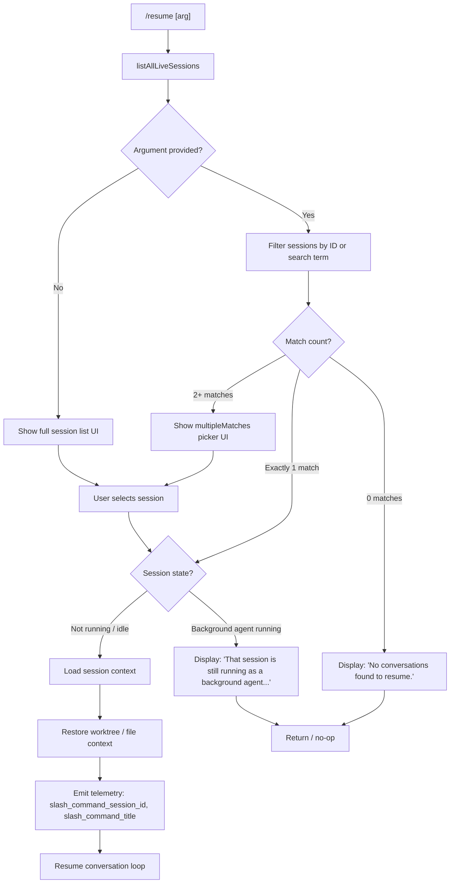

# `/resume`

> Analysis basis: CC v2.1.161 bundle.js (AST extraction + Claude interpretation)
> Minimum version: v2.1.161

---

## Overview

`/resume` (also aliased as `/continue`) reopens a previously saved Claude Code conversation by searching through all persisted sessions, matching the user's query against session IDs and titles, and then restoring the selected session's context into the current shell. It is an async command that renders a JSX picker UI for session selection when multiple matches exist.

---

## Registration

| Field | Value |
|---|---|
| type | `local-jsx` |
| name | `resume` |
| description | `Resume a previous conversation` |
| aliases | `["continue"]` |
| argumentHint | `[conversation id or search term]` |
| module_id | `Yi1` |
| load_inline | `true` |
| loc_byte | `12065692` |
| loc_byte_end | `12065889` |
| loc_line | `8233` |
| arbor_handler.name | `u0f` |
| arbor_handler.fqn | `claude-2.1.161::u0f` |
| arbor_handler.kind | `AsyncFunction` |
| arbor_handler.resolution_path | `module_id` |
| arbor_handler.n_hits | `0` |

Analysis basis: CC v2.1.161 bundle.js:+12065692

---

## Input Branching

The command has 5+ distinct behavioral paths based on session discovery results, active session state, and argument matching. A Mermaid flowchart is used.



Analysis basis: CC v2.1.161 bundle.js:+12064180 – +12065264

---

## Behavioral Spec

### 1. Handler Entry — `resumeCommandHandler` (bundle: `u0f`)

The primary handler is the async function `u0f`, resolved by Arbor via `module_id → Yi1`.

```
async function resumeCommandHandler(args, context):
    sessions = await listAllLiveSessions()       // rfH → A.listAllLiveSessions
    queryTerm = args.trim()

    if sessions has a running background session matching queryTerm:
        return error_message(
            "That session is still running as a background agent. " +
            "Open `claude agents` to attach to it, " +
            "or stop it there first to resume here."
        )

    filteredSessions = filterSessions(sessions, queryTerm)

    if filteredSessions.length == 0:
        return display("No conversations found to resume.")

    if filteredSessions.length == 1:
        targetSession = filteredSessions[0]
    else:
        targetSession = await showSessionPicker(filteredSessions)
        // picker uses multipleMatches UI path

    sessionContext = await loadSessionContext(targetSession)
    worktreeInfo   = await detectWorktree(sessionContext)     // VbH → git worktree list --porcelain

    emitTelemetry("slash_command_session_id", targetSession.id)
    emitTelemetry("slash_command_title",      targetSession.title)

    return resumeSessionInUI(sessionContext, worktreeInfo)
```

Analysis basis: CC v2.1.161 bundle.js:+12064284

---

### 2. Session Listing — `sessionListLoader` (bundle: `rfH`)

```
async function sessionListLoader():
    await Promise.resolve()
    sessionStore = getSessionStore()                  // cH6
    sessions     = sessionStore.listAllLiveSessions() // A.listAllLiveSessions
    return sessions
```

Sessions carry an `"interactive"` type tag that filters them from background/agent sessions.

Analysis basis: CC v2.1.161 bundle.js:+12064284, literal `"interactive"` at +8912470

---

### 3. Session Filtering / Search — `sessionMatcher` (bundle: `VbH`)

```
function sessionMatcher(sessions, queryTerm):
    now = Date.now()

    // Step 1: detect git worktree context
    worktreeLines = spawnSync("git", ["worktree", "list", "--porcelain"])
    // emits tengu_worktree_detection telemetry
    parsedWorktrees = parseWorktreeOutput(worktreeLines)

    if queryTerm is empty:
        return sortedByRecency(sessions)  // $.localeCompare sort

    normalizedQuery = queryTerm.toLowerCase()

    // Step 2: try exact session-ID prefix match
    idMatches = sessions.filter(s => s.id.startsWith(normalizedQuery))
    if idMatches.length > 0:
        return idMatches

    // Step 3: fuzzy title / last-prompt search
    titleMatches = sessions.filter(s =>
        s.title?.toLowerCase().includes(normalizedQuery) ||
        s.lastPrompt?.toLowerCase().includes(normalizedQuery)
    )

    // Step 4: apply worktree locality boost
    boosted = boostByWorktree(titleMatches, parsedWorktrees)

    return boosted sorted by recency
```

The literal `"worktree "` (with trailing space) at +12061521 and offset `9` at +12061555 are used to parse `git worktree list --porcelain` output lines.

Analysis basis: CC v2.1.161 bundle.js:+12061258, +12061302, +12061521

---

### 4. Background-Session Guard

```
function isBackgroundAgentRunning(session):
    status = session.daemonStatus   // reads daemon.status.json
    return status == "background session" and session.mode == "running"

if isBackgroundAgentRunning(targetSession):
    show_error(
        "That session is still running as a background agent. " +
        "Open `claude agents` to attach to it, or stop it there first."
    )
    return   // literal at +12064294
```

Analysis basis: CC v2.1.161 bundle.js:+12064292, literal at +12064294

---

### 5. Conversation Context Restoration — `sessionContextLoader` (bundle: `WV6` / `I4K` / `sAH`)

```
async function loadSessionContext(session):
    rawStore  = await loadSessionStore(session.id)   // I4K → sAH
    messages  = await reconstructMessageChain(rawStore)
    // sAH populates many internal maps: summary, last-prompt,
    // custom-title, ai-title, tag, agent-name, mode, etc.
    metadata  = extractSessionMetadata(rawStore)
    return { messages, metadata }
```

Internal metadata keys discovered in literals: `"summary"`, `"last-prompt"`, `"custom-title"`, `"ai-title"`, `"tag"`, `"agent-name"`, `"mode"`, `"permission-mode"`, `"isolation-latch"`, `"worktree-state"`, `"bridge-session"`, `"fork-context-ref"`.

Analysis basis: CC v2.1.161 bundle.js:+13078807, +13074226 – +13075724

---

### 6. File-System Persistence Helpers — `sessionFileWriter` (bundle: `IBK`) and related

The persistence layer (called during session save, which `/resume` reads back) uses the following protocol:

```
function persistSessionChunk(chunk, sessionPath):
    dir = path.dirname(sessionPath)
    ensureDirectoryExists(dir)                   // NBK → Ay.mkdir
    byteLen = Buffer.byteLength(chunk)
    if byteLen > MAX_CHUNK_SIZE:
        renameOldFile(sessionPath)               // UJA → Ay.rename / Ay.unlink
    appendToFile(sessionPath, chunk)             // NBK → Ay.appendFile
    updateIndexEntry(sessionPath)                // BJA → N6
    runPostWriteHook(sessionPath)                // Y9 → tYA.register
```

A `.txt` suffix is used for legacy chunk files (literal `".txt"` at +203545). A rename-before-overwrite strategy caps individual files to a bounded size (limit `4` at +203567 is a version counter suffix; `1048576` bytes = 1 MiB max chunk, at +13070806).

Analysis basis: CC v2.1.161 bundle.js:+204086, +203441, +203840

---

### 7. UI Rendering — `resumeUIComponent` (bundle: `Oi1`)

```
function resumeUIComponent(sessions, onSelect):
    // Renders a bold-styled list via aw.createElement
    // Uses w6.bold for emphasis on session title/id
    return JSX element listing sessions
```

Two terminal display paths are defined in the literals:
- `"sessionNotFound"` — zero-match state (literal at +12061938)
- `"multipleMatches"` — ambiguous-match picker (literal at +12062009)

Analysis basis: CC v2.1.161 bundle.js:+12065264, +12061938, +12062009

---

## State & Side Effects

| Item | Detail |
|---|---|
| Telemetry — `slash_command_session_id` | Fired when a target session is selected; carries the session UUID (literal at +12064990) |
| Telemetry — `slash_command_title` | Fired alongside session_id; carries the human-readable session title (literal at +12065214) |
| Telemetry — `tengu_worktree_detection` | Fired during worktree probe inside session matcher (loc_byte +12061402) |
| Telemetry — `tengu_feature_sad` / `tengu_feature_bad` / `tengu_feature_ok` | Lifecycle events from shared feature-flag helper `yH` (loc_byte +966732, +966650, +966587) |
| File-system reads | Session JSONL files read via `PL.readFile` / `hS.readSync` during context reconstruction |
| File-system writes | Session file appended / rotated via `Ay.appendFile` / `Ay.rename` on save; `/resume` itself is read-only with respect to the session store |
| appState changes | Active session ID, messages array, metadata maps are all updated in the app store once a session is restored |
| Hook registration | Post-write hook registered via `tYA.register` (bundle `Y9`) after session data flush |
| Sound | None observed in depth-2 traversal |
| Git subprocess | `git worktree list --porcelain` spawned synchronously to determine worktree locality for session ranking |

---

## Version History

| Version | Change |
|---|---|
| v2.1.161 | Initial analysis |

---

## Common Mistakes

1. **Using `/resume` while a session is running as a background agent** — The command will refuse with a clear error directing you to `claude agents` instead of silently attaching or duplicating context.
2. **Providing a partial search term that matches multiple sessions** — A picker UI is shown; if running non-interactively (e.g., piped input) this may stall. Provide a unique session ID prefix to skip the picker.
3. **Expecting `/resume` to restore in-progress tool calls** — Only the message history and metadata (title, tags, permission-mode, etc.) are restored; any live tool subprocess state from the original session is not re-attached.
4. **Confusing `/resume` with `/continue`** — Both are identical; `continue` is a registered alias (see registration). Either spelling works.
5. **Searching by timestamp rather than title or ID** — The matcher operates on session IDs (prefix match) and title/last-prompt text; date-based queries are not directly supported.

---

## Appendix — Identifier Mapping

> For bundle debugging only. Identifiers change across versions.

| Identifier | Role |
|---|---|
| `u0f` | Primary async handler for `/resume` command (arbor_handler) |
| `Di1` | Command registration and filter wrapper for resume command list |
| `rfH` | Session list loader — resolves live sessions via `listAllLiveSessions` |
| `VbH` | Session matcher / search filter; invokes worktree detection |
| `IBK` | Session file persistence coordinator (write / rotate / index) |
| `_3H` | Sub-helper inside persistence: path join and read utilities |
| `WmH` | Batched write scheduler with `setTimeout` / `setImmediate` debounce |
| `BJA` | Index entry updater; calls `N6` (path join helper) |
| `UJA` | File rotation helper: `stat` → `rename` → `unlink` |
| `NBK` | Append-file worker: `mkdir` + `appendFile` + index update |
| `Y9` | Post-write hook registration via `tYA.register` |
| `WV6` | Session context loader coordinator; dispatches to `I4K` |
| `I4K` | Session store initializer — instantiates `sAH` and merges config |
| `sAH` | Core session state manager; populates all metadata maps |
| `afH` | Message chain reconstructor; walks parent-UUID links |
| `Jbf` | Per-conversation index builder with sort and dedup logic |
| `Ybf` | Conversation queue manager (shift/push/sort) |
| `Z4K` | Summary map extractor from raw session values |
| `L4K` | Session metadata map loader; handles all named metadata keys |
| `Dbf` | Reverse-walk helper for parent-chain resolution |
| `fn` | File-based session context packager (calls `VbH`, `k4K`, `_xH`) |
| `k4K` | Directory scanner and session-file aggregator |
| `N4A` | Recursive directory reader for session storage |
| `nWH` | Per-file session chunk processor |
| `RS6` | Session record deduplication and grouping |
| `_xH` | Binary buffer builder for session payload |
| `mbf` | Low-level message block parser |
| `Ibf` | JSONL record parser; handles all message type tags |
| `Nbf` | Binary index file parser (Buffer-level operations) |
| `kbf` | Synchronous binary index reader |
| `Oh8` | Output formatter that calls `US6` for multi-session display |
| `US6` | Column-formatted session list renderer |
| `Oi1` | JSX resume UI component (uses `w6.bold`) |
| `OMH` | Telemetry emission wrapper for session selection events |
| `sfH` | Session store facade — aggregates all sub-stores via `sAH` |
| `iR8` | Index read helper (get by key) |
| `rR8` | Index value enumerator (`Array.from` + `values`) |
| `V4A` | Conversation metadata extractor (title, last-prompt, etc.) |
| `lH6` | Message list mapper |
| `x4A` | Text content normaliser (replaceAll / slice) |
| `m4A` | Attachment / image content classifier |
| `Lh6` | Per-message content block builder |
| `fK` | Inline code / command-arg token parser |
| `yH` | Feature-flag / lifecycle telemetry emitter |
| `a_` | Error constructor wrapper |
| `pH` | String coercion utility |
| `TH` | String-to-type coercion helper |
| `h_` | High-level session runner — starts conversation loop |
| `QGH` | Child-process spawner and lifecycle manager |
| `rfH` | (see above) Session list resolver |
| `Ba` | UUID / ID format validator (`LM7.test`) |
| `Z$` | Session-state selector / extractor |
| `VBK` | Argument normalisation pipeline |
| `HwA` | Normalisation sub-step (calls `NmK`, `ImK`) |
| `N` | Shared utility: argument dispatcher / router |
| `SH` | JSON serialiser wrapper |
| `Z4` | Path / ID trimmer (replace, at, lastIndexOf, slice) |
| `CJA` | Map-over-sessions utility |
| `imH` | Write-helper that calls `GJA` (stream write) |
| `GJA` | Direct stream write wrapper |
| `xO` | Path normaliser (`normalize` + NFC) |
| `y_K` | Telemetry event emitter (reads async store context) |
| `Fh6` | Daemon status file path builder (`daemon.status.json`) |
| `nR8` | Date parser utility (`Date.parse`) |
| `aGH` | BOM-aware stream parser (UTF-8, handles 0xEF 0xBB 0xBF) |
| `j54` | Stream chunk indexer |
| `P54` | JSON substring extractor |
| `J54` | JSON line parser |
| `cmH` | JSON.parse wrapper |
| `m6` | JSON.parse alias |
| `vbf` | Buffer comparator |
| `ys` | Session-type constant / flag |
| `Hbf` | Session handle bootstrap |
| `Hb` | Session handle accessor |
| `NJA` | Message array flattener / type checker |
| `VJA` | Message type validator |
| `vJA` | Message text replacer |
| `sj` | Sort comparator for session ordering |
| `K9` | Version/config validator (`v8`) |
| `P_` | Path prefix resolver (`XN`) |
| `XN` | Absolute path root constant |
| `nc` | Projects directory path builder |
| `tS` | Path type sentinel |
| `iE` | Directory-based session file enumerator |
| `ybf` | Session file stat and load coordinator |
| `az` | Text abbreviator / truncator |
| `wO` | Workspace-root resolver |
| `nJA` | Date-time formatter (`Intl.DateTimeFormat`) |
| `Ij` | Text sanitiser (replace) |

---

Note: index built via Arbor fallback; some signals (telemetry, literals) may be missing — see arbor-fallback.js.