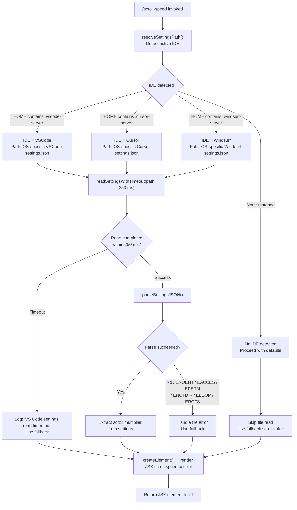

# `/scroll-speed`

> Analysis basis: CC v2.1.161 bundle.js (AST extraction + Claude interpretation)
> Minimum version: v2.1.161

---

## Overview

`/scroll-speed` is a local JSX command that adjusts the mouse wheel scroll speed within the Claude Code terminal UI. It reads the active IDE's settings file (VS Code, Cursor, or Windsurf) to determine a scroll multiplier, then renders a JSX control element that applies the updated speed. The handler is an async function (`pEf`) resolved via module `Dr1`.

---

## Registration

| Field | Value |
|---|---|
| type | `local-jsx` |
| name | `scroll-speed` |
| description | `Adjust mouse wheel scroll speed` |
| loc_byte | `12117630` |
| loc_byte_end | `12117878` |
| loc_line | `8350` |
| module_id | `Dr1` |
| load_inline | `true` |
| arbor_handler.name | `pEf` |
| arbor_handler.fqn | `claude-2.1.161::pEf` |
| arbor_handler.kind | `AsyncFunction` |
| arbor_handler.resolution_path | `module_id` |
| arbor_handler.n_hits | `0` |

Analysis basis: CC v2.1.161 bundle.js:+12117630

---

## Input Branching

The command follows multiple distinct paths depending on: (1) whether the IDE settings file can be located at all, (2) which IDE is detected (VS Code / Cursor / Windsurf), (3) whether the settings file read times out, and (4) whether the file parse succeeds. Four or more branches require a Mermaid flowchart.



Analysis basis: CC v2.1.161 bundle.js:+12117393, +12117396, +12117402, +12117406, +12117464

---

## Behavioral Spec

### 1. Entry — Async Handler (`pEf`)

```
async function scrollSpeedHandler(context):
    // Race the settings read against a 250 ms timeout
    settingsResult = await readSettingsWithTimeout(250)
    // Build and return a JSX element for the scroll-speed control
    element = createScrollSpeedElement(settingsResult)
    return element
```

Analysis basis: CC v2.1.161 bundle.js:+12117393, +12117402, +12117464

---

### 2. Timeout-Guarded Read (`u7`)

The handler wraps the settings file read inside a `Promise.race` between the actual read promise and a `setTimeout`-based rejection that fires after **250 milliseconds** (bundle.js:+12117402). If the timeout fires first the string `"VS Code settings read timed out"` (bundle.js:+12117406) is used as the error signal and the read is abandoned via `clearTimeout`.

```
async function readSettingsWithTimeout(timeoutMs):
    timeoutHandle = null
    timeoutPromise = new Promise((_, reject) =>
        timeoutHandle = setTimeout(() => reject("VS Code settings read timed out"), timeoutMs)
    )
    try:
        result = await Promise.race([readActualSettings(), timeoutPromise])
        clearTimeout(timeoutHandle)
        return result
    catch err:
        clearTimeout(timeoutHandle)   // loc +2286664
        throw err
```

Analysis basis: CC v2.1.161 bundle.js:+2286554, +2286617, +2286664

---

### 3. IDE Detection (`j48` / `aW_`)

The settings-read pipeline first determines which embedded IDE (if any) is active by inspecting whether the home-directory path contains any of the server-directory sentinel strings:

| Sentinel string | Mapped IDE display name |
|---|---|
| `.vscode-server` (bundle.js:+4006336) | `VSCode` (bundle.js:+4010721) |
| `.cursor-server` (bundle.js:+4006366) | `Cursor` (bundle.js:+4010749) |
| `.windsurf-server` (bundle.js:+4006396) | `Windsurf` (bundle.js:+4010779) |

```
function detectEmbeddedIDE(homePath):
    if homePath.includes(".vscode-server"):  return "VSCode"
    if homePath.includes(".cursor-server"):  return "Cursor"
    if homePath.includes(".windsurf-server"): return "Windsurf"
    return null
```

Analysis basis: CC v2.1.161 bundle.js:+4006325, +4006336, +4006366, +4006396

---

### 4. Platform-Specific Settings Path Resolution (`P48`)

Once the IDE is known, the settings file path is constructed using `os.homedir()` and `os.platform()`:

```
function resolveSettingsPath(ide):
    home = os.homedir()       // bundle.js:+4010870
    platform = os.platform()  // bundle.js:+4010884

    if platform == "win32":   // bundle.js:+4010901
        base = path.join(home, "AppData", "Roaming", ide, "User")
    elif platform == "darwin": // bundle.js:+4010964
        base = path.join(home, "Library", "Application Support", ide, "User")
    else:  // Linux / other
        base = path.join(home, ".config", ide, "User")  // bundle.js:+4011031

    return path.join(base, "settings.json")  // bundle.js:+4010450
```

The `"Code"` literal (bundle.js:+4010846) is used as the IDE subfolder name for VS Code on non-server paths; Cursor and Windsurf use their own display names (`"Cursor"`, `"Windsurf"`).

Analysis basis: CC v2.1.161 bundle.js:+4010862, +4010870, +4010884, +4010901, +4010964, +4011031

---

### 5. File Read and Parse (`aW_`)

```
async function readAndParseSettings(settingsPath):
    raw = await fs.readFile(settingsPath, "utf-8")  // bundle.js:+4010423, +4010477
    parsed = parseJSON(raw)   // via RRL / json-parse helper
    return parsed
```

On any filesystem error whose `code` is one of `ENOENT`, `EACCES`, `EPERM`, `ENOTDIR`, `ELOOP`, or `EROFS` (bundle.js:+175129–175198), the error is handled gracefully and a fallback value is returned.

Analysis basis: CC v2.1.161 bundle.js:+4010423, +4010443, +4010477, +4010489

---

### 6. Settings Value Normalisation (`b56` / `N`)

After parsing, boolean-like string values are normalised before being applied. The strings `"yes"` (bundle.js:+26948) and `"on"` (bundle.js:+26954) are treated as truthy. Numeric coercion uses `String()` (bundle.js:+1098527). Leading/trailing whitespace is stripped; uppercase conversion is applied during comparison.

```
function normaliseSettingValue(raw):
    text = String(raw).trim().toUpperCase()
    if text starts with certain prefix:
        text = text.slice(1)   // offset normalisation
    if text in ["YES", "ON"]: return true
    return text
```

Analysis basis: CC v2.1.161 bundle.js:+1098176, +1098199, +1098527, +26948, +26954

---

### 7. JSX Rendering (`dAA.createElement`)

After settings resolution, `scrollSpeedHandler` calls `createElement` (bundle.js:+12117464) to produce a JSX element representing the scroll-speed control widget. The exact props passed derive from the resolved scroll multiplier; no further call-graph depth was reached for the JSX subtree within the depth-2 traversal.

```
function createScrollSpeedElement(settings):
    multiplier = extractScrollMultiplier(settings)
    return createElement(ScrollSpeedControl, { multiplier })
```

Analysis basis: CC v2.1.161 bundle.js:+12117464

---

### 8. Bootstrap Fetch Helper (`H` / `t6`)

The call graph reaches a bootstrap-fetch utility (`H`) that performs an authenticated HTTP GET with headers `Content-Type: application/json` (bundle.js:+15504207) and `User-Agent` (bundle.js:+15504241), applying a **5000 ms** network timeout (bundle.js:+15504313). This utility is used for any remote config retrieval and emits the telemetry event `api_bootstrap_fetch` (bundle.js:+15504434) on completion, with a `parse_failed` error label (bundle.js:+15504456) on JSON parse failure. A debug log prefix `"[Bootstrap] Fetching"` (bundle.js:+15504122) marks request start; `"[Bootstrap] Fetch ok"` (bundle.js:+15504486) marks success.

Analysis basis: CC v2.1.161 bundle.js:+15504122, +15504207, +15504222, +15504241, +15504313, +15504434

---

## State & Side Effects

| Item | Detail |
|---|---|
| Telemetry | `tengu_feature_sad` (bundle.js:+966732) — fired on feature error/sad-path inside the log-error utility (`yH` → `ri.logError`) |
| Telemetry | `api_bootstrap_fetch` (bundle.js:+15504434) — fired by bootstrap fetch helper on completion |
| Telemetry label | `parse_failed` (bundle.js:+15504456) — attached to `api_bootstrap_fetch` on JSON parse failure |
| Timeout | 250 ms guard on VS Code settings file read (bundle.js:+12117402) |
| Network timeout | 5000 ms on bootstrap HTTP fetch (bundle.js:+15504313) |
| File I/O | Reads `settings.json` from IDE user-settings directory (bundle.js:+4010423) |
| Encoding | `utf-8` for file read (bundle.js:+4010477) |
| Error logging | `ri.logError` called on sad path (bundle.js:+972355) |
| Hook registration | <!-- TODO: not found in depth-2 traversal; needs --depth 4 --> |
| appState changes | <!-- TODO: not found in depth-2 traversal; needs --depth 4 --> |
| Sound | <!-- TODO: not found in depth-2 traversal; needs --depth 4 --> |

---

## Version History

| Version | Change |
|---|---|
| v2.1.161 | Initial analysis |

---

## Common Mistakes

1. **Expecting instant effect on slow filesystems** — The command enforces a hard 250 ms timeout on reading IDE settings (bundle.js:+12117402). If the disk is slow or the settings file is on a network mount, the read will silently time out and the scroll speed will fall back to a default value without visible error.
2. **Running outside a supported IDE environment** — The IDE detection logic (bundle.js:+4006325) only recognises `.vscode-server`, `.cursor-server`, and `.windsurf-server` home-path sentinels. Running Claude Code in a plain terminal without one of those IDE servers active means no IDE is detected and no settings file is read.
3. **Mismatched platform path** — The settings path is constructed differently for `win32`, `darwin`, and Linux (bundle.js:+4010901, +4010964, +4011031). Symlinking or mounting the settings directory to an unexpected location will cause an `ENOENT` or `ELOOP` error, which is silently swallowed and replaced with a fallback.
4. **Assuming telemetry always fires** — `tengu_feature_sad` (bundle.js:+966732) is only emitted on the sad/error path. A successful invocation produces no telemetry event from the scroll-speed handler itself.
5. **Conflating the 5000 ms timeout with the 250 ms timeout** — The 5 second timeout (bundle.js:+15504313) applies to the bootstrap HTTP fetch helper, not to the local settings read; these are separate timers on separate code paths.

---

## Appendix — Identifier Mapping

> For bundle debugging only. Identifiers change across versions.

| Identifier | Role |
|---|---|
| `pEf` | Main async handler for `/scroll-speed` (entry point, `AsyncFunction`, module `Dr1`) |
| `u7` | Timeout-guarded promise wrapper (`Promise.race` + `setTimeout` + `clearTimeout`) |
| `aW_` | Settings read-and-parse orchestrator (coordinates IDE detection, path resolution, file read) |
| `RRL` | JSON parse helper called from settings orchestrator |
| `j48` | IDE server-directory sentinel checker (`H.includes` on server dir strings) |
| `H` | Bootstrap fetch utility (HTTP GET with auth headers, 5000 ms timeout) |
| `N` | Token/value normalisation utility (case, whitespace, prefix handling) |
| `s$` | Sub-utility called from bootstrap fetch helper |
| `ne` | Membership-check helper (`WA4.has`) |
| `Ij` | String replacement utility (`H.replace`) |
| `lq` | String processing utility (calls `xHH`, `s9`, `xP`) |
| `t6` | HTTP fetch executor called from bootstrap fetch helper |
| `P48` | Platform-specific settings file path resolver (`os.homedir`, `os.platform`, `path.join`) |
| `b56` | Settings value normaliser (calls `iQ6`, `Ox`, `N`, `String`) |
| `Ox` | Prefix-strip helper (`startsWith` + `slice`) |
| `oW_` | Array check utility (`Array.isArray`) |
| `K9` | File-error classifier (maps error codes: `ENOENT`, `EACCES`, `EPERM`, etc.) |
| `v8` | Error code lookup called from file-error classifier |
| `yH` | Error-logging and sad-path reporter (calls `a_`, `pH`, `r9`, `s44`, `ri.logError`) |
| `a_` | Error construction helper (`Error`, `String`) |
| `pH` | String coercion utility (calls `String`) |
| `r9` | Queue/retry helper (calls `qkA`) |
| `qkA` | Queue processing helper (calls `pH`) |
| `s44` | Log-buffer rotation helper (`lg6.shift`, `lg6.push`) |

---

Note: index built via Arbor fallback; some signals (telemetry, literals) may be missing — see arbor-fallback.js.