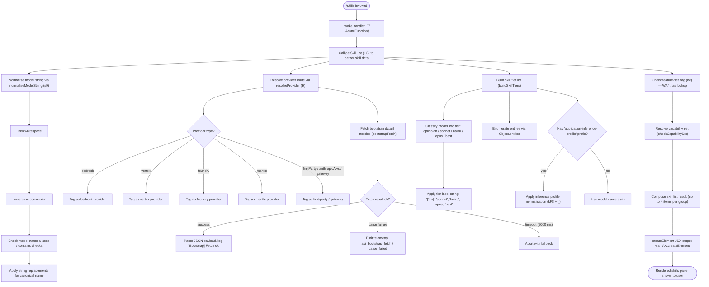

# `/skills`

> Analysis basis: CC v2.1.161 bundle.js (AST extraction + Claude interpretation)
> Minimum version: v2.1.161

---

## Overview

The `/skills` command lists the available skills (model capabilities and configured providers) accessible to Claude Code. It renders immediately as a JSX component, querying available model names, provider routing, and capability tiers before presenting them to the user. No agent round-trip is required; the command is flagged `immediate: true` and resolves locally.

---

## Registration

| Field | Value |
|---|---|
| type | `local-jsx` |
| name | `skills` |
| description | `List available skills` |
| immediate | `true` |
| module_id | `Ir1` |
| load_inline | `true` |
| loc_byte | `12127363` |
| loc_byte_end | `12127495` |
| loc_line | `8350` |
| arbor_handler.name | `lEf` |
| arbor_handler.fqn | `claude-2.1.161::lEf` |
| arbor_handler.kind | `AsyncFunction` |
| arbor_handler.resolution_path | `module_id` |
| arbor_handler.n_hits | `0` |

Analysis basis: CC v2.1.161 bundle.js:+12127363

---

## Input Branching

The handler follows 4+ distinct branches when resolving skill display: model-string normalisation, provider-tier classification, capability-flag checks, and JSX rendering. A flowchart is used.



Analysis basis: CC v2.1.161 bundle.js:+12127178, +12127252, +2234263, +15504120

---

## Behavioral Spec

### Top-Level Handler — `lEf` (AsyncFunction)

```
async function skillsCommandHandler(context):
    skillData  = await getSkillList(context)          // LG
    jsxElement = createElement(skillData)             // nAA.createElement
    return jsxElement
```

Analysis basis: CC v2.1.161 bundle.js:+12127178, +12127252

---

### Skill List Assembly — `getSkillList` (`LG`)

```
function getSkillList(context):
    normalisedModels = normaliseModelStrings(context)  // s9
    tierEntries      = buildSkillTierList(context)     // _9
    result           = []

    for entry in tierEntries:
        if knownSkillSet.has(entry.key):               // YHL.has  (+2234327)
            result.append(entry)
        if result.length >= 4:                         // literal 4 (+2234255)
            break

    return result
```

Analysis basis: CC v2.1.161 bundle.js:+2234263, +2234271, +2234327, +2234255

---

### Model String Normalisation — `normaliseModelString` (`s9`)

Converts a raw model identifier string into a canonical lowercased form used throughout skill resolution.

```
function normaliseModelString(rawModel):
    step1 = rawModel.trim()                              // H.trim  (+2236058)
    step2 = step1.toLowerCase()                         // _.toLowerCase  (+2236069)

    if containsInvalidChars(step2):                     // NKH / vKH.includes  (+2236133)
        return null

    step3 = applyModelAliases(step2)                    // aN  (+2236172)
    step4 = resolveModelTier(step3)                     // KG / Xwq  (+2236287, +2236324)
    step5 = applyBooleanFlags(step4)                    // Us6 / wHL.includes  (+2236348, +2236596)
    step6 = applySlugReplacements(step5)                // bgH / _.replace  (+2236356, +2236400)

    return step6
```

Analysis basis: CC v2.1.161 bundle.js:+2236058, +2236069, +2236097, +2236133, +2236172, +2236287, +2236324, +2236342, +2236356, +2236400

---

### Provider Resolution — `resolveProvider` (`H`)

Determines which API backend will serve model requests, used to annotate each skill entry.

```
function resolveProvider(modelId, config):
    log("[Bootstrap] Fetching", modelId)               // literal  (+15504122)

    headers = {
        "Content-Type":  "application/json",           // +15504207, +15504222
        "User-Agent":    <agent-string>                // +15504241
    }

    bootstrapData = bootstrapFetch(modelId, headers,   // s$.get  (+15504158)
                                   timeout=5000)       // literal  (+15504313)

    if bootstrapData.ok:
        log("[Bootstrap] Fetch ok")                    // +15504486
        providerTag = classifyProvider(bootstrapData)
    else:
        emitTelemetry("api_bootstrap_fetch",           // +15504434
                      outcome="parse_failed")          // +15504456
        providerTag = FALLBACK

    route = mapProviderTag(providerTag)
    // Possible tags: "bedrock" (+2049937), "foundry" (+2049987),
    //                "mantle" (+2050097), "vertex" (+2050145),
    //                "firstParty" (+2050588), "anthropicAws" (+2050606),
    //                "gateway" (+2050626)

    return route
```

Analysis basis: CC v2.1.161 bundle.js:+15504120, +15504158, +15504207, +15504222, +15504241, +15504313, +15504434, +15504456, +15504486

---

### Bootstrap Fetch sub-calls — `bootstrapFetchUtil` (`t6`)

```
function bootstrapFetchUtil(url, options):
    response = httpGet(url, options)          // d  (+966730)
    onFailure: emitTelemetry("tengu_feature_sad")  // h1H  (+966766)
    return response
```

Telemetry event `tengu_feature_sad` is fired when a bootstrap fetch attempt fails.

Analysis basis: CC v2.1.161 bundle.js:+966730, +966766, +966732

---

### Skill Tier Classification — `buildSkillTierList` (`_9`)

Maps model identifiers to human-readable tier labels for the skills panel.

```
function buildSkillTierList(context):
    entries = Object.entries(modelRegistry)           // Aa6 / Object.entries  (+2051926)
    results = []

    for [modelId, modelMeta] in entries:
        normalised = applyModelAliases(modelId)       // bP  (+2234125)
        // bP does: toLowerCase, includes-check, replace

        if normalised.includes("application-inference-profile"):   // +2234145
            normalised = applyInferenceProfileNorm(normalised)     // kF8  (+2234185)
            normalised = applySlugReplacement(normalised)          // Ij  (+2234189)

        tier = classifyTier(normalised)
        // Tier strings (all from literals):
        //   "opusplan"  (+2236154)  → "[1m]" label  (+2236180)
        //   "sonnet"    (+2236195)
        //   "haiku"     (+2236234)
        //   "opus"      (+2236273)
        //   "best"      (+2236310)

        if results.length < 3:                        // literal 3  (+2234340)
            results.push({ modelId, tier, meta: modelMeta })

    return results
```

Analysis basis: CC v2.1.161 bundle.js:+2234102, +2234125, +2234145, +2234185, +2234189, +2234255, +2234340

---

### Model Alias Resolution — `applyModelAliases` (`bP`)

Resolves versioned model name variants to canonical base names.

```
function applyModelAliases(modelId):
    lower = modelId.toLowerCase()          // H.toLowerCase  (+2233093)

    knownAliases = [
        "claude-opus-4-8",   "claude-opus-4-7",   "claude-opus-4-6",
        "claude-opus-4-5",   "claude-opus-4-1",   "claude-opus-4-0",
        "claude-sonnet-4-6", "claude-sonnet-4-5", "claude-sonnet-4-0",
        "claude-haiku-4-5",  "claude-3-7-sonnet", "claude-3-5-sonnet",
        "claude-3-5-haiku",  "claude-3-opus",     "claude-3-sonnet",
        "claude-3-haiku"
    ]

    if lower.includes(any of knownAliases):           // H.includes  (+2233109)
        return applyCanonicalReplacement(lower)       // H.replace   (+2234057)

    return lower
```

Analysis basis: CC v2.1.161 bundle.js:+2233093, +2233109, +2233120 – +2234009, +2234057

---

### Feature Flag Check — `checkFeatureFlag` (`ne`)

```
function checkFeatureFlag(featureKey):
    return featureSetRegistry.has(featureKey)    // WA4.has  (+840982)
    // returns false (0) when not found           // literal 0  (+841000)
```

Analysis basis: CC v2.1.161 bundle.js:+840982, +841000

---

### Provider Classification Helpers — `classifyProviderTag` (`PA`, `UM`, `Vf`)

```
function classifyProviderTag(providerString):
    base = resolveBaseProvider(providerString)    // PA / pH  (+2049897)

    // Provider family detection
    if base == "bedrock":  return BEDROCK         // +2049937
    if base == "foundry":  return FOUNDRY         // +2049987
    if base == "mantle":   return MANTLE          // +2050097
    if base == "vertex":   return VERTEX          // +2050145

    // First-party / gateway routing
    if base == "firstParty":    return FIRST_PARTY    // +2050588
    if base == "anthropicAws":  return ANTHROPIC_AWS  // +2050606
    if base == "gateway":       return GATEWAY        // +2050626

    return UNKNOWN

function resolveModelCapabilities(model):           // UM  (+2050571)
    base = classifyProviderTag(model)
    return buildCapabilitySet(base)                 // PA  (+2050571)

function buildCapabilityRecord(model, meta):        // Vf  (+2052078)
    capSet  = resolveModelCapabilities(model)       // MmH / fB4 / r7q / _a6 / PA
    return { model, meta, capabilities: capSet }
```

Analysis basis: CC v2.1.161 bundle.js:+2049897, +2049937, +2049987, +2050097, +2050145, +2050571, +2050588, +2050606, +2050626, +2052078

---

### Boolean/Flag String Interpretation — `pH`

```
function interpretBooleanString(value):
    s = String(value)              // String()  (+26899)
    if s == "yes" or s == "on":    // literals  (+26948, +26954)
        return true
    return false
```

Analysis basis: CC v2.1.161 bundle.js:+26899, +26948, +26954

---

### Model String Slug Replacement — `Ij`

```
function applySlugReplacement(modelStr):
    return modelStr.replace(slugPattern, canonicalForm)  // H.replace  (+2237690)
```

Analysis basis: CC v2.1.161 bundle.js:+2237690

---

## State & Side Effects

| Item | Detail |
|---|---|
| Telemetry — `tengu_feature_sad` | Fired when a bootstrap fetch sub-call fails (bundle.js:+966732) |
| Telemetry — `api_bootstrap_fetch` / `parse_failed` | Fired when the provider bootstrap response cannot be parsed (bundle.js:+15504434, +15504456) |
| Hook registration | None detected in depth-2 traversal |
| appState changes | None detected in depth-2 traversal |
| Network I/O | HTTP GET to bootstrap endpoint with `Content-Type: application/json`, 5000 ms timeout (bundle.js:+15504313) |
| Sound | None detected |
| Immediate render | Command registered with `immediate: true`; no agent turn is initiated |

---

## Version History

| Version | Change |
|---|---|
| v2.1.161 | Initial analysis |

---

## Common Mistakes

1. **Assuming `/skills` triggers an agent conversation.** The command is flagged `immediate: true` with type `local-jsx`, meaning it renders synchronously from a local JSX component without any model round-trip.
2. **Expecting a fixed model list.** Model entries are enumerated dynamically from an internal registry via `Object.entries` at call time, so the list will vary with the user's configuration and available models.
3. **Misreading the tier labels.** The string `"[1m]"` is the display label for the `"opusplan"` tier — it is not a time-window indicator.
4. **Ignoring the 4-item cap.** The skill list assembly loop breaks after 4 matching entries (literal `4` at bundle.js:+2234255), so not all models may appear if more than four qualify.
5. **Treating provider strings as stable.** Provider tags (`"bedrock"`, `"vertex"`, etc.) are resolved at runtime from the bootstrap endpoint; a failed fetch (5000 ms timeout) causes a silent fallback and may omit provider annotations.

---

## Appendix — Identifier Mapping

> For bundle debugging only. Identifiers change across versions.

| Identifier | Role |
|---|---|
| `lEf` | Top-level handler for `/skills` command (AsyncFunction, arbor_handler) |
| `LG` | `getSkillList` — assembles the full skill list for rendering |
| `s9` | `normaliseModelString` — trims, lowercases, and canonicalises model IDs |
| `H` | `resolveProvider` — resolves provider route and fetches bootstrap data |
| `N` | `classifyModelDebug` — debug-level model classification helper |
| `s$` | `bootstrapCacheGet` — cached bootstrap data accessor (`s_.get`) |
| `ne` | `checkFeatureFlag` — feature-set membership check via `WA4.has` |
| `Ij` | `applySlugReplacement` — regex-based model string slug normaliser |
| `lq` | `buildModelQueryParams` — constructs model query parameters |
| `t6` | `bootstrapFetchUtil` — low-level bootstrap HTTP fetch with failure telemetry |
| `_` | `modelStringOperand` — intermediate model string value in normalisation chain |
| `x0` | `applyVersionSuffix` — appends version component to model identifier |
| `kKH` | `versionSuffixHelper` — helper for version suffix application |
| `A` | `modelLowercaseAccessor` — lowercase model name accessor |
| `f` | `connectionCloseHelper` — manages connection close for HTTP clients |
| `NKH` | `checkInvalidCharSet` — validates model string against disallowed character set |
| `aN` | `applyModelAliasMap` — applies model alias mapping (wraps `UM` and `Vf`) |
| `UM` | `resolveModelCapabilities` — resolves capability set for a given model |
| `Vf` | `buildCapabilityRecord` — builds full capability record including provider |
| `CgH` | `capabilityGroupHelper` — groups capability entries using `Vf` |
| `KG` | `resolveModelTier` — maps model to tier using `UM`, `Vf`, and `PA` |
| `PA` | `classifyProviderTag` — classifies provider string to enumerated provider type |
| `Xwq` | `wrapTierResolver` — wrapper around `resolveModelTier` (`KG`) |
| `Us6` | `checkBooleanFlag` — checks model flag strings via `wHL.includes` |
| `bgH` | `applyFlagReplacement` — string replacement using boolean-flag output from `pH` |
| `pH` | `interpretBooleanString` — converts "yes"/"on" strings to boolean |
| `_9` | `buildSkillTierList` — enumerates model registry and builds tier list |
| `Aa6` | `enumerateModelRegistry` — entry point for `Object.entries` over model registry |
| `t_` | `registryInitHelper` — initialises model registry (`np`) |
| `bP` | `applyModelAliases` — lowercases and resolves versioned model name aliases |
| `kF8` | `inferenceProfileNormaliser` — normalises "application-inference-profile" prefixed IDs |

---

Note: index built via Arbor fallback; some signals (telemetry, literals) may be missing — see arbor-fallback.js.