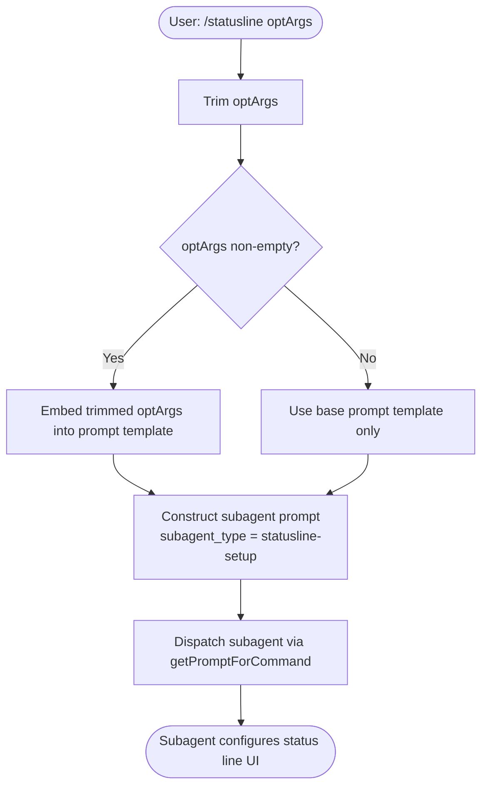

# `/statusline`

> Analysis basis: CC v2.1.161 bundle.js (AST extraction + Claude interpretation)
> Minimum version: v2.1.161

---

## Overview

`/statusline` is a `prompt`-type slash command that configures Claude Code's status line UI by dispatching a subagent with a fixed `subagent_type` of `"statusline-setup"`. When invoked, the command constructs a prompt instructing the subagent to derive the status line configuration from the user's existing shell PS1 configuration. Any user-supplied argument text is trimmed and forwarded as context to that subagent prompt.

---

## Registration

| Field | Value |
|---|---|
| type | `prompt` |
| name | `statusline` |
| description | `Set up Claude Code's status line UI` |
| aliases | _(none)_ |
| handler_method | `getPromptForCommand` |
| handler_method_start (byte) | `12568978` |
| handler_method_end (byte) | `12569186` |
| loc_byte | `12568673` |
| loc_byte_end | `12569187` |
| loc_line | `8788` |
| prompt_body.length | `76` characters |
| prompt_body.trace | `inline template` |
| prompt_body.text (fragment) | `"…subagent_type \"statusline-setup\"…"` |
| arbor_handler.name | `getPromptForCommand` |
| arbor_handler.kind | `Method` |
| arbor_handler.fqn | `claude-2.1.161::getPromptForCommand` |
| arbor_handler.resolution_path | `direct` |
| arbor_handler.n_hits | `1` |
| `handler_method_start` | `12568978` |
| `handler_method_end` | `12569186` |

Analysis basis: CC v2.1.161 bundle.js:+12568673

---

## Input Branching

The command has a straightforward linear flow with a single conditional branch on whether the user supplies additional argument text. Two distinct paths exist (trim present/absent), so numbered pseudocode is used.

1. User invokes `/statusline [optional-args]`
2. `getPromptForCommand` is entered (handler resolved via `direct` Arbor path).
3. Any argument string supplied by the user is trimmed (`H.trim`, `bundle.js:+12569013`).
4. A fixed inline template prompt is constructed (`bundle.js:+12569023`), embedding:
   - The literal subagent type: `"statusline-setup"`
   - The literal inner prompt text: `"Configure my statusLine from my shell PS1 configuration"`
   - The trimmed user argument (if non-empty) is appended as additional context.
5. The assembled prompt string is returned to the agent dispatch layer for subagent creation.



---

## Behavioral Spec

### Handler: `getPromptForCommand`

The handler is an `ObjectMethod` inlined directly on the registration object, resolved via `direct` Arbor path (no module indirection). It is the sole entry point for this command.

```
function getPromptForCommand(userArgs):
    trimmedArgs = trim(userArgs)

    innerPrompt = "Configure my statusLine from my shell PS1 configuration"

    if trimmedArgs is non-empty:
        composedPrompt = innerPrompt + " " + trimmedArgs
    else:
        composedPrompt = innerPrompt

    subagentRequest = createSubagentRequest(
        subagent_type = "statusline-setup",
        prompt        = composedPrompt,
        content_type  = "text"
    )

    return subagentRequest
```

Analysis basis: CC v2.1.161 bundle.js:+12568978

Key observed literals embedded in the inline template:
- Inner prompt string (fragment): `"Configure my statusLine…"` — bundle.js:+12569023
- Content type field value: `"text"` — bundle.js:+12569094
- Subagent type: `"statusline-setup"` (from prompt_body.text trace)

### Subagent Dispatch Pipeline

After `getPromptForCommand` returns the prompt, the broader dispatch infrastructure (entry function `H`, call graph depth-2) is responsible for routing the subagent request. The pipeline includes:

```
function dispatchPromptCommand(promptResult):
    // Fetch bootstrap data if needed
    bootstrapData = fetchBootstrap()           // H → N (bundle.js:+15504120)
    // Validate and normalise model identifier
    normalisedModel = normaliseModelId(...)    // N → Z4 (bundle.js:+204719)
    // Write prompt to temp channel
    writePrompt(promptResult)                  // N → imH → GJA (bundle.js:+204744)
    // Persist/append via file writer
    appendToLog(...)                           // IBK → NBK (bundle.js:+204352)
    // Register hook for status-line refresh
    registerHook(...)                          // IBK → Y9 → tYA.register (bundle.js:+204448)
```

Analysis basis: CC v2.1.161 bundle.js:+15504120, +204719, +204744, +204448

### Bootstrap Fetch

The `H → N` edge triggers a network fetch with the following observable characteristics (from literals):

- Log prefix: `"[Bootstrap] Fetching"` — bundle.js:+15504122
- Request header `Content-Type`: `"application/json"` — bundle.js:+15504222
- Request header `User-Agent` — bundle.js:+15504241
- Timeout: `5000` ms — bundle.js:+15504313
- Telemetry event on bootstrap fetch: `"api_bootstrap_fetch"` — bundle.js:+15504434
- Parse-failure sentinel: `"parse_failed"` — bundle.js:+15504456
- Success log: `"[Bootstrap] Fetch ok"` — bundle.js:+15504486

Analysis basis: CC v2.1.161 bundle.js:+15504120

### Model Normalisation

Function chain `N → Z4 → CJA` processes the model identifier before dispatching:

```
function normaliseModelId(rawModel):
    upperModel   = rawModel.toUpperCase()      // N → _.toUpperCase (bundle.js:+204699)
    replaced     = rawModel.replace(...)       // Z4 → H.replace    (bundle.js:+196653)
    lastSep      = replaced.lastIndexOf(...)   // Z4 → A.lastIndexOf (bundle.js:+196789)
    shortName    = replaced.slice(lastSep)     // Z4 → A.slice      (bundle.js:+196815)
    return shortName
```

Observed model-related string constants reachable at depth 2 (via `lq → s9`):
- `"opusplan"` — bundle.js:+2236154
- `"sonnet"` — bundle.js:+2236195
- `"haiku"` — bundle.js:+2236234
- `"opus"` — bundle.js:+2236273
- `"best"` — bundle.js:+2236310
- `"[1m]"` suffix marker — bundle.js:+2236180

Analysis basis: CC v2.1.161 bundle.js:+204699

### File / Log Writer

`IBK` (log-writer coordinator) manages atomic append to an on-disk log:

```
function logWriter(content):
    dir = path.dirname(targetPath)             // IBK → he.dirname (bundle.js:+204119)
    ensureDir(dir)                             // IBK → qy         (bundle.js:+204148)
    byteLen = Buffer.byteLength(content)       // IBK → Buffer.byteLength (bundle.js:+204293)

    // Atomic rename strategy (IBK → UJA):
    if file.endsWith(".txt"):                  // UJA → H.endsWith (bundle.js:+203534)
        Ay.rename(tmp, target)                 // UJA → Ay.rename  (bundle.js:+203597)
    else:
        Ay.unlink(old)                         // UJA → Ay.unlink  (bundle.js:+203637)

    // Error guard: skip EISDIR paths
    if error.code == "EISDIR":                 // d46 → "EISDIR"   (bundle.js:+174728)
        return

    // Append final content
    Ay.appendFile(dir, content)                // NBK → Ay.appendFile (bundle.js:+203899)
```

Maximum path-component truncation length: `40` characters (bundle.js:+15930336)
Debounce window constants: `1000` ms leading / `100` ms trailing (bundle.js:+58707, +58728)

Analysis basis: CC v2.1.161 bundle.js:+204086

### Hook Registration

```
function registerStatuslineHook():
    tYA.register(hookDescriptor)    // Y9 → tYA.register (bundle.js:+59405)
```

Analysis basis: CC v2.1.161 bundle.js:+204448

### Debug Logging

A `"debug"` log-level literal is present in the `N` function body (bundle.js:+204573), indicating the prompt-dispatch path emits debug-level log entries during execution.

---

## State & Side Effects

| Item | Detail |
|---|---|
| Telemetry | `tengu_feature_sad` — fired from `t6 → d` (bundle.js:+966732); `api_bootstrap_fetch` — fired from bootstrap fetch path (bundle.js:+15504434) |
| Hook registration | `tYA.register` called via `Y9` (bundle.js:+59405) — registers a status-line refresh hook |
| File I/O | `Ay.appendFile`, `Ay.rename`, `Ay.mkdir`, `Ay.unlink` — atomic log-append with rename/unlink strategy (bundle.js:+203840–203986) |
| Temp file sentinel | `.txt` extension used as atomic rename target indicator (bundle.js:+203545) |
| Debounce timers | `clearTimeout` / `setTimeout` / `setImmediate` called via `WmH` with 1000 ms / 100 ms constants (bundle.js:+58819–59076) |
| Network fetch | Bootstrap fetch to `https://code.claude.com` (inferred from package metadata) with 5000 ms timeout (bundle.js:+15504313) |
| appState changes | <!-- TODO: not found in depth-2 traversal; needs --depth 4 --> |
| Sound | <!-- TODO: not found in depth-2 traversal; needs --depth 4 --> |

---

## Version History

| Version | Change |
|---|---|
| v2.1.161 | Initial analysis |

---

## Common Mistakes

1. **Expecting interactive configuration UI**: `/statusline` does not open an interactive editor — it dispatches a subagent with `subagent_type "statusline-setup"`. The actual configuration is driven by the agent's interpretation of the user's shell PS1 configuration, not a form or wizard.
2. **Passing unsupported flags**: The command takes only free-form text arguments. Any structured flags will be interpreted as plain text and appended verbatim to the inner prompt.
3. **Assuming immediate visual effect**: The hook registration (`tYA.register`) and file-write path mean that status line changes may be applied asynchronously after the subagent completes, not synchronously upon invocation.
4. **Running outside a shell context**: Because the inner prompt explicitly references the user's shell PS1 configuration, invoking this command in an environment without a meaningful PS1 (e.g., a non-interactive shell or CI context) may yield a generic or empty status line configuration.
5. **Confusing `tengu_feature_sad` telemetry with errors**: This event fires along the normal execution path (bundle.js:+966732) and does not exclusively indicate a failure condition from the user's perspective.

---

## Appendix — Identifier Mapping

> For bundle debugging only. Identifiers change across versions.

| Identifier | Role |
|---|---|
| `__handler_statusline` | Synthetic BFS entry node for the `/statusline` command handler |
| `H` | Top-level prompt dispatch / bootstrap fetch orchestrator |
| `N` | Prompt normalisation and routing function |
| `VBK` | Secondary prompt processing helper |
| `HwA` | Nested prompt sub-processor |
| `SH` | JSON serialisation helper (`JSON.stringify` wrapper) |
| `_` | Intermediate string value (model name, uppercased / replaced) |
| `Z4` | Model identifier normalisation function |
| `CJA` | Model name mapping helper (uses `WBK.map`) |
| `q` | File path or array helper; also calls `wSK.unlinkSync` |
| `A` | String/path helper; calls `f.toLowerCase`, `lastIndexOf`, `slice` |
| `imH` | Prompt write coordinator |
| `GJA` | Low-level write executor (`H.write`) |
| `IBK` | Log-writer coordinator (mkdir, appendFile, rename, unlink) |
| `WmH` | Debounce/flush scheduler (clearTimeout, setTimeout, setImmediate) |
| `_3H` | Sub-path builder within log writer |
| `F6` | Auxiliary helper called during log-write setup |
| `d46` | EISDIR error guard / file existence checker |
| `BJA` | Path join helper (`he.join`, `N6`) |
| `UJA` | Atomic rename/unlink strategy executor |
| `NBK` | Append-file writer with full mkdir + rename pipeline |
| `Y9` | Hook registration dispatcher |
| `s$` | State accessor helper |
| `ne` | Set membership check helper (`WA4.has`) |
| `Ij` | String replacement utility |
| `lq` | Model resolution entry function |
| `xHH` | Model resolution sub-router |
| `NT` | Model constant or lookup target |
| `o9H` | Model resolution sub-helper |
| `nQ` | Model string parsing and validation function |
| `s9` | Core model identifier resolver |
| `x0` | Model key lookup helper (`kKH`) |
| `NKH` | Model inclusion check (`vKH.includes`) |
| `aN` | Model alias resolver (opus-plan variant) |
| `CgH` | Haiku model resolver |
| `KG` | First-party model resolver |
| `Xwq` | "Best" model alias resolver |
| `UM` | Provider type resolver (`anthropicAws`, `gateway`) |
| `Us6` | Model allowlist inclusion check (`wHL.includes`) |
| `bgH` | Model fallback handler (`pH`) |
| `xP` | Model resolution wrapper |
| `b0` | Full model descriptor builder |
| `t6` | Telemetry / feature-event emitter |
| `d` | Core telemetry event dispatcher |
| `h1H` | Telemetry event construction helper |
| `Xa8` | Telemetry payload assembler |