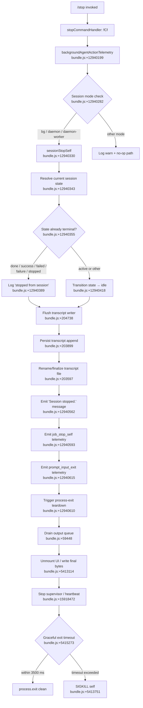

# `/stop`

> Analysis basis: CC v2.1.161 bundle.js (AST extraction + Claude interpretation)
> Minimum version: v2.1.161

---

## Overview

The `/stop` command terminates the currently running background session while deliberately preserving both the session transcript and the associated worktree on disk. It executes an asynchronous stop sequence that transitions the session to a stopped/idle state, emits a `job_stop_self` action to the background-agent telemetry pipeline, flushes pending output, and then renders a confirmation UI element before triggering the full process-exit teardown.

---

## Registration

| Field | Value |
|---|---|
| type | `local-jsx` |
| name | `stop` |
| description | `Stop this background session; transcript and worktree are kept` |
| loc_byte | `12941061` |
| loc_byte_end | `12941245` |
| loc_line | `9543` |
| immediate | `true` |
| module_id | `GKK` |
| load_inline | `true` |
| arbor_handler.name | `fCf` |
| arbor_handler.fqn | `claude-2.1.161::fCf` |
| arbor_handler.kind | `AsyncFunction` |
| arbor_handler.resolution_path | `module_id` |
| arbor_handler.n_hits | `0` |

Analysis basis: CC v2.1.161 bundle.js:+12941061

---

## Input Branching

The `/stop` command follows more than three distinct execution paths depending on session mode, current session state, and teardown sub-steps, so a Mermaid flowchart is used.



---

## Behavioral Spec

### 1. Top-Level Handler — `stopCommandHandler` (arbor: `fCf`)

The handler is an `AsyncFunction` resolved via `module_id` path (`GKK`).

```
async function stopCommandHandler(context):
    emit telemetry("tengu_bg_agent_action", action="stop_command")
    // bundle.js:+12940199, +12940794

    sessionMode = resolveSessionMode()          // checks "bg", "daemon", "daemon-worker"
    if sessionMode not in ["bg", "daemon", "daemon-worker"]:
        log.warn("stop command called outside background session")
        return

    await sessionStopSelf(context)              // bundle.js:+12940330
    await resolveSessionStateInfo()             // bundle.js:+12940343
    await writeTranscriptStop()                 // bundle.js:+12940355
    displayMessage("Session stopped.")          // bundle.js:+12940562
    emit telemetry("job_stop_self")             // bundle.js:+12940593
    triggerProcessExit()                        // bundle.js:+12940610
```

Analysis basis: CC v2.1.161 bundle.js:+12940780

---

### 2. Background-Agent Action Emission (`backgroundAgentAction`, `CR8`)

Before any state change, the handler records the stop action as a background-agent audit event.

```
function emitBgAgentAction(actionName):
    // actionName = "stop_command"   bundle.js:+12940794
    log.debug(...)
    telemetry.emit("tengu_bg_agent_action", { action: actionName })
    // bundle.js:+12940199
```

Analysis basis: CC v2.1.161 bundle.js:+12940790

---

### 3. Session-Mode Guard (`sessionModeGuard`, `W9`)

Reads the runtime session type string and gates the rest of the stop sequence.

```
function checkSessionMode(mode):
    // mode comes from context; compared against literals:
    //   "bg"             bundle.js:+2245341
    //   "daemon"         bundle.js:+2245351
    //   "daemon-worker"  bundle.js:+2245365
    if mode not in allowedModes:
        return SKIP
    return PROCEED
```

Analysis basis: CC v2.1.161 bundle.js:+12940282

---

### 4. Session Self-Stop (`sessionSelfStop`, `q1`)

Reads the persisted session state file and transitions it.

```
async function sessionSelfStop(sessionDir):
    stateFilePath = path.join(sessionDir, "stateOrder")   // bundle.js:+4137351
    stats = await fs.stat(stateFilePath)
    raw   = await fs.readFile(stateFilePath, "utf-8")      // bundle.js:+4137965

    parsed = JSON.parse(raw)                               // via m6, bundle.js:+184932
    currentState = parsed.state ?? "unknown"               // bundle.js:+4137797

    terminalStates = ["done","success","failed","failure","stopped"]
    // bundle.js:+4144207–4144269

    if currentState in terminalStates:
        log("stopped from session", currentState)          // bundle.js:+12940389
        // no further state write
    else:
        newState = "idle"                                  // bundle.js:+12940418
        writeStateFile(stateFilePath, newState)

    clearCacheEntries()          // NLH.delete / rYH.delete  bundle.js:+4137555
    emit telemetry("tengu_bg_state_read_transient")        // bundle.js:+4137751
```

Analysis basis: CC v2.1.161 bundle.js:+12940330

---

### 5. Session-State Resolution (`resolveSessionStatus`, `lD` → `nV`)

Fetches the canonical done/active status from the state store for display purposes.

```
function resolveSessionStatus(sessionId):
    status = stateStore.get(sessionId)     // sYH lookup  bundle.js:+4144329
    // Possible returned values: "done", "success", "failed",
    //   "failure", "stopped", "active"    bundle.js:+4144207–4144388
    return status
```

Analysis basis: CC v2.1.161 bundle.js:+12940343

---

### 6. Transcript Finalization (`writeTranscriptStop`, `W5` → `t3`, `Fj`)

Flushes and finalizes the transcript file using an atomic rename pattern.

```
async function writeTranscriptStop(transcriptPath, content):
    tmpPath = transcriptPath + "." + randomBytes(8).toString("hex")
    // bundle.js:+2276452, +2276480

    await fs.writeFile(tmpPath, content, "utf8")    // bundle.js:+2276499
    await fs.rename(tmpPath, transcriptPath)         // bundle.js:+2276553
    // On collision: copyFile then unlink            // bundle.js:+2276627,+2276682

    cacheInvalidate(transcriptPath)                  // Fj → NLH.delete  bundle.js:+4137262
```

Analysis basis: CC v2.1.161 bundle.js:+12940355

---

### 7. Transcript Append-Writer (`transcriptAppendWriter`, `IBK` → `WmH`, `_3H`, `NBK`)

Manages a debounced append queue that drains to disk before the process exits.

```
function transcriptAppendWriter(config):
    pendingChunks = []
    debounceTimer = null
    DEBOUNCE_MS   = 1000     // bundle.js:+58707
    BATCH_MAX     = 100      // bundle.js:+58728

    function flush():
        clearTimeout(debounceTimer)
        data = pendingChunks.join("")
        if data.length == 0: return
        dir = path.dirname(transcriptFilePath)
        ensureDirExists(dir)                        // Ay.mkdir  bundle.js:+203840
        fs.appendFile(transcriptFilePath, data)     // bundle.js:+203899
        rotateIfNeeded()                            // UJA       bundle.js:+203986
        updateByteCount(Buffer.byteLength(data))    // bundle.js:+203992
        pendingChunks = []

    function write(chunk):
        pendingChunks.push(chunk)                   // bundle.js:+59018
        if pendingChunks.length >= BATCH_MAX:
            flush()
        else:
            scheduleDebounce()

    return { write, flush }
```

Analysis basis: CC v2.1.161 bundle.js:+204086–204448

---

### 8. Process-Exit Orchestration (`processExitOrchestrator`, `O9`)

Coordinates the multi-step shutdown sequence after the stop decision is made.

```
async function processExitOrchestrator(exitContext):
    // 1. Tear down terminal UI
    unmountUI()                              // TkH → H.unmount  bundle.js:+5413114
    writeSync(finalOutputBytes)              // AJH.writeSync     bundle.js:+5415729

    // 2. Stop supervisor loop
    supervisorInstance.stop()               // D → G.stop        bundle.js:+15918472
    supervisorInstance.updateConfig(...)    // bundle.js:+15918601

    // 3. Drain output queue with timeout
    DRAIN_TIMEOUT_MS = 3500                  // bundle.js:+5415273
    await Promise.race([
        drainOutputQueue(),                  // EmH → tYA.drain  bundle.js:+59448
        timeout(DRAIN_TIMEOUT_MS)
    ])

    // 4. Wait for all settled background work
    await Promise.allSettled(pendingJobs)    // IE9  bundle.js:+13121001

    // 5. Emit session_end telemetry
    emit("session_end")                      // bundle.js:+5415660

    // 6. Final exit with fallback kill
    exitTimeout = setTimeout(() => {
        process.kill(pid, "SIGKILL")         // bundle.js:+5413751
    }, 2000)                                 // bundle.js:+5415451
    exitTimeout.unref()                      // bundle.js:+5415282
    process.exit(0)                          // Rk_ → process.exit  bundle.js:+5413701
```

Analysis basis: CC v2.1.161 bundle.js:+12940610

---

### 9. Transcript Rotation Logic (`transcriptRotator`, `UJA`)

Handles renaming oversize `.txt` transcript segments.

```
async function transcriptRotator(filePath, maxSegments):
    stats = await fs.stat(filePath)              // bundle.js:+203441
    if filePath.endsWith(".txt"):                // bundle.js:+203534
        rotatedPath = filePath.slice(0, -4)      // strip ".txt"  bundle.js:+203556
        await fs.rename(filePath, rotatedPath)   // bundle.js:+203597
    else:
        await fs.unlink(filePath)                // bundle.js:+203637
    updateCursor(maxSegments)                    // k8  bundle.js:+203625
```

`maxSegments` uses the constant `4` (bundle.js:+203567).

Analysis basis: CC v2.1.161 bundle.js:+204287

---

### 10. Formatted Status Normalization (`formatStatus`, `N`)

Used when building the stop-confirmation message for display.

```
function formatStatus(rawStatus):
    upper  = rawStatus.toUpperCase()          // bundle.js:+204699
    trimmed = upper.trim()                    // bundle.js:+204722
    sanitized = sanitizeForDisplay(trimmed)   // Z4  bundle.js:+204719
    // sanitizeForDisplay: replaces "[REDACTED]" token  bundle.js:+196705
    // falls back to last path component (A.lastIndexOf / A.slice)  bundle.js:+196789–196815
    return sanitized
```

Analysis basis: CC v2.1.161 bundle.js:+204597

---

## State & Side Effects

| Item | Detail |
|---|---|
| Telemetry: `tengu_bg_agent_action` | Fired at handler entry with `action="stop_command"` (bundle.js:+12940199) |
| Telemetry: `tengu_bg_state_read_transient` | Fired after reading the background session state file (bundle.js:+4137751) |
| Telemetry: `tengu_scroll_summary` | Fired during exit scroll/render path (bundle.js:+5414569) |
| Telemetry: `tengu_cache_eviction_hint` | Fired during cache cleanup on exit (bundle.js:+5415625) |
| Telemetry: `tengu_feature_ok` / `tengu_feature_sad` | Feature success/failure bookend events (bundle.js:+966587, +966732) |
| Telemetry: `tengu_daemon_config_reload` | Fired if supervisor config is mutated during teardown (bundle.js:+15918997) |
| Telemetry: `tengu_startup_perf` | Startup profiling report emitted during exit path (bundle.js:+215596) |
| Telemetry: `tengu_pewter_brook` | Full-screen / terminal environment detection event (bundle.js:+3419020) |
| Literal event string: `job_stop_self` | Written into agent action log at bundle.js:+12940593 |
| Literal event string: `prompt_input_exit` | Emitted before process teardown at bundle.js:+12940615 |
| Literal event string: `session_end` | Emitted by exit orchestrator at bundle.js:+5415660 |
| appState changes | Session state field transitioned to `"idle"` (bundle.js:+12940418) when not already terminal |
| Transcript file | Appended and atomically renamed; `.txt` extension stripped on rotation (bundle.js:+203545) |
| Supervisor loop | `.stop()` then `.start()` called with updated config during teardown (bundle.js:+15918472–15918619) |
| Heartbeat | Stopped as part of supervisor shutdown (bundle.js:+15917425) |
| Process exit | `process.exit` called; SIGKILL watchdog fires after 2 000 ms if exit stalls (bundle.js:+5415451, +5413726) |
| Sound | <!-- TODO: not found in depth-2 traversal; needs --depth 4 --> |

---

## Version History

| Version | Change |
|---|---|
| v2.1.161 | Initial analysis |

---

## Common Mistakes

1. **Running `/stop` in a foreground session** — The session-mode guard (bundle.js:+12940282) explicitly checks for `"bg"`, `"daemon"`, or `"daemon-worker"` modes. Invoking `/stop` in a standard foreground interactive session has no effect; the command silently exits after the guard without performing any state transition.

2. **Expecting immediate file deletion** — The description "transcript and worktree are kept" is authoritative. Neither the transcript file nor the git worktree is removed. Users who want cleanup must delete them manually after the session is stopped.

3. **Mistaking `/stop` for an interrupt** — `/stop` is a *graceful* session termination command, not an interrupt of the current task. It transitions the agent state to `"idle"` and then initiates orderly teardown. An in-progress tool call may still complete before the exit sequence drains the output queue.

4. **Ignoring the 3 500 ms drain window** — The exit orchestrator races output draining against a 3 500 ms timeout (bundle.js:+5415273). If the transcript writer has a large backlog, some final bytes may be truncated if the queue does not drain in time before the SIGKILL watchdog fires at 2 000 ms (bundle.js:+5415451).

5. **Confusing terminal states** — The command treats `"done"`, `"success"`, `"failed"`, `"failure"`, and `"stopped"` as already-terminal (bundle.js:+4144207–4144269). A session in any of those states will log `"stopped from session"` without writing a new state, but the rest of the teardown sequence still runs normally.

---

## Appendix — Identifier Mapping

> For bundle debugging only. Identifiers change across versions.

| Identifier | Role |
|---|---|
| `fCf` | Top-level `/stop` command handler (`AsyncFunction`; arbor handler) |
| `CR8` | Core stop-sequence orchestrator called by `fCf` |
| `H` | Generic bootstrap/fetch utility; also reused as session-context accessor |
| `N` | Status-string formatter (toUpperCase / trim / sanitize) |
| `VBK` | Session-state transition helper |
| `HwA` | Debounce/write scheduler for transcript |
| `NmK` | Debounce inner timer helper |
| `ImK` | Debounce flush helper |
| `SH` | JSON serializer wrapper |
| `Z4` | Display-string sanitizer / path-component extractor |
| `CJA` | Status-label mapping function |
| `imH` | Transcript stream writer |
| `GJA` | Low-level stream write wrapper |
| `IBK` | Transcript append-writer factory |
| `WmH` | Debounced batch-flush implementation |
| `_3H` | Append-file path builder / state helper |
| `Im6` | Path segment builder |
| `r8` | Append-file content builder |
| `N6` | File-system node logger / path utility |
| `XN` | Node logger sink |
| `F6` | Directory existence check / mkdir wrapper |
| `d46` | EISDIR / ENOENT error classifier |
| `v8` | Error-code reader |
| `BJA` | Transcript base-path resolver |
| `UJA` | Transcript rotation handler |
| `k8` | Segment cursor updater |
| `NBK` | Transcript append + rotate cycle |
| `gJA` | Byte-length accumulator |
| `Y9` | Hook registration (tYA.register) |
| `s$` | Session-context map accessor |
| `ne` | Known-session-ID set checker |
| `Ij` | Path replacement utility |
| `lq` | Model/provider string normalization entry point |
| `xHH` | Model-string parser dispatcher |
| `NT` | Model-name token type constants |
| `o9H` | Model-name prefix handler |
| `nQ` | Model-string tokenizer |
| `s9` | Model alias resolver |
| `x0` | Model key lookup helper |
| `NKH` | Model provider inclusion checker |
| `aN` | Provider capability resolver |
| `CgH` | Provider variant selector |
| `KG` | Provider/model pairing builder |
| `Xwq` | Best-model selector |
| `UM` | Provider auth-type mapper |
| `Us6` | Provider whitelist checker |
| `bgH` | Provider flag accessor |
| `xP` | Model resolution pipeline |
| `b0` | Full model-config builder |
| `t6` | Bootstrap API telemetry emitter |
| `d` | Generic telemetry emit function |
| `h1H` | Telemetry success/failure branching |
| `Xa8` | Telemetry payload builder |
| `LCf` | Stop-reason string constant holder |
| `W9` | Session-mode type guard |
| `bzH` | Mode-type constants (`bg`, `daemon`, `daemon-worker`) |
| `q1` | Session self-stop: reads/writes state file |
| `df` | File-not-found error handler |
| `m6` | JSON.parse wrapper |
| `lD` | Session status fetcher entry point |
| `nV` | State-store lookup |
| `sYH` | Session state-store map |
| `W5` | Transcript finalization entry (atomic rename) |
| `t3` | Atomic file-write with rename |
| `Fj` | Post-write cache invalidation |
| `as6` | Confirmation message renderer |
| `bqH` | Message content builder |
| `hH` | Feature telemetry (ok/sad) wrapper |
| `O9` | Process-exit orchestrator |
| `K` | Active-connection map iterator |
| `L` | Connection lifecycle wrapper |
| `f` | Connection close handler |
| `TkH` | Terminal UI unmount + final-write handler |
| `rR` | Terminal restore helper |
| `_K8` | Terminal escape-sequence writer |
| `Sk_` | Exit path display / dim-text writer |
| `IT` | Terminal-state accessor |
| `Qb` | Terminal query helper |
| `_W6` | Worktree / CWD stat checker |
| `Q$` | Path formatter for display |
| `TE9` | Exit display text builder |
| `Rk_` | Graceful-exit finalizer (process.exit / SIGKILL) |
| `EmH` | Output-queue drain trigger |
| `D` | Supervisor lifecycle manager |
| `BWH` | Supervisor config writer |
| `H9K` | Supervisor metrics renderer |
| `G` | Input-event stop handler |
| `Z` | Background-worker controller |
| `USK` | Heartbeat manager |
| `V` | Remote-control startup handler |
| `IE9` | Pending-jobs allSettled barrier |
| `ML6` | Startup profiling report emitter |
| `VQ8` | Profiling data collector |
| `HPA` | Profiling report formatter |
| `r$8` | Scroll-summary / session-metrics emitter |
| `GE9` | Metrics state accessor |
| `EE9` | Duration / token-count calculator |
| `qq` | Full-screen / terminal-env detector |
| `XK6` | Cache-eviction hint emitter |
| `o$8` | Parallel shutdown-task runner |
| `n8` | Abort-signal / timeout race helper |

---

Note: index built via Arbor fallback; some signals (telemetry, literals) may be missing — see arbor-fallback.js.