# `/team-onboarding`

> Analysis basis: CC v2.1.161 bundle.js (AST extraction + Claude interpretation)
> Minimum version: v2.1.161

---

## Overview

`/team-onboarding` is a `prompt`-type slash command that scans the invoking user's local Claude Code session transcripts (up to a configurable look-back window), classifies the sessions by task type, and uses that usage data to co-author a personalized `ONBOARDING.md` guide for teammates who are new to Claude Code. The guide is written interactively in two turns: the agent produces a concrete draft first, then asks three targeted review questions before finalising and saving the file.

---

## Registration

| Field | Value |
|---|---|
| type | `prompt` |
| name | `team-onboarding` |
| description | Help teammates ramp on Claude Code with a guide from your usage |
| isHidden | `false` |
| handler_method | `getPromptForCommand` |
| handler_method_start (byte) | `12862675` |
| handler_method_end (byte) | `12863385` |
| loc_byte | `12862337` |
| loc_byte_end | `12863386` |
| loc_line | `9463` |
| prompt_body.length | `4539` characters |
| prompt_body.trace | `identifier→$ (local→1 ext vars)` |
| arbor_handler.name | `getPromptForCommand` |
| arbor_handler.kind | `Method` |
| arbor_handler.fqn | `claude-2.1.161::getPromptForCommand` |
| arbor_handler.resolution_path | `direct` |
| arbor_handler.n_hits | `2` |
| `handler_method_start` | `12862675` |
| `handler_method_end` | `12863385` |

Analysis basis: CC v2.1.161 bundle.js:+12862337

---

## Input Branching

The handler performs several distinct branching paths: transcript scanning (with a 365-day ceiling applied via `Math.min`/`Math.max`/`Math.floor`), session-descriptor extraction and filtering, MCP configuration loading, git identity resolution, and template substitution. Five or more distinct branches are present, so a Mermaid flowchart is used.

```mermaid
flowchart TD
    A([/team-onboarding invoked]) --> B[Emit tengu_team_onboarding_invoked telemetry]
    B --> C[Compute look-back window\nMath.min / Math.max / Math.floor\ncapped at 365 days\nbundle.js:+12862878–12862896]
    C --> D[transcriptScanner: read ~/.claude/projects/\nlist .jsonl files, filter by mtime within window\nbundle.js:+12851201]
    D --> E{Any transcript files found?}
    E -- No --> F[USAGE_DATA = empty / zero sessions]
    E -- Yes --> G[Parse each .jsonl line-by-line\nextract sessionDescriptors\ntitle · prNumbers · firstUserMessage\nbundle.js:+12851658–12852357]
    G --> H{First messages informative?}
    H -- Yes --> I[Classify sessions into task-type buckets\nbuild_feature / debug_fix / improve_quality\nanalyze_data / plan_design / prototype / write_docs]
    H -- No --> J[Fall back to tool + MCP call counts\nas weak classification hint]
    I --> K[Load .mcp.json → mcpServers map\nbundle.js:+12853399]
    J --> K
    K --> L{.mcp.json readable?}
    L -- No / missing --> M[mcpServers = empty object]
    L -- Yes --> N[Parse mcpServers entries\ninfer access method from name + urlOrigin]
    N --> O[Run: git config user.name\nbundle.js:+12854022–12854038]
    M --> O
    O --> P{git exits 0?}
    P -- Yes --> Q[generatedBy = git user name]
    P -- No --> R[generatedBy = omit from guide]
    Q --> S[Run: git remote get-url origin\nbundle.js:+12854094–12854113]
    R --> S
    S --> T[Substitute template variables\nWINDOW_DAYS · USAGE_DATA · GUIDE_TEMPLATE\nbundle.js:+12863122–12863210]
    T --> U[Emit tengu_flint_harbor_prompt telemetry\nbundle.js:+12862712]
    U --> V[Return assembled prompt string\nto agent turn 1]
    V --> W[Agent outputs acknowledgment line\nthen draft ONBOARDING.md in code block]
    W --> X[Agent asks 3 Review questions\nteam name · starter task · team tips]
    X --> Y[User answers]
    Y --> Z[Agent updates ONBOARDING.md\nwrites file via W8 / Pj_ / Y56 path\nbundle.js:+12862984]
    Z --> AA[Emit tengu_team_onboarding_generated\nbundle.js:+12863254]
    AA --> AB([Done — file saved])
```



---

## Behavioral Spec

### 1. Handler Entry — `getPromptForCommand`

The Arbor symbol graph resolves the handler directly inside the registration byte range (`direct` resolution path, 2 hits).
Analysis basis: CC v2.1.161 bundle.js:+12862675

```
function getPromptForCommand(context):
    emit telemetry("tengu_flint_harbor_prompt")        // bundle.js:+12862712
    usageData = collectTranscriptUsage(context)
    mcpConfig = loadMcpConfig(context)
    gitMeta   = resolveGitMeta(context)
    prompt    = buildPromptString(usageData, mcpConfig, gitMeta)
    return prompt
```

---

### 2. Transcript Collection — `transcriptScanner` (`z1K`)

Reads `~/.claude/projects/` (resolved via `projectsDirPath`), lists every `.jsonl` file, and filters to those whose modification time falls within the computed look-back window.

Window computation (handler level):
- Raw window in days is passed through `Math.floor(Math.max(1, Math.min(input, 365)))`.
- **Maximum look-back: 365 days** (bundle.js:+12862924).

Analysis basis: CC v2.1.161 bundle.js:+12851160–12852357

```
async function collectTranscriptUsage(windowDays):
    cutoffMs = Date.now() - windowDays * 24 * 60 * 1000   // bundle.js:+12851160–12851182
    files    = await fs.readdir(projectsDir)               // bundle.js:+12851201
    jsonlFiles = files.filter(f => extname(f) == ".jsonl") // bundle.js:+12851271–12851288

    sessionDescriptors = []
    for each file in jsonlFiles:
        stat = await fs.stat(file)                         // bundle.js:+12851372
        if not stat.isFile():  continue
        if stat.mtime < cutoffMs: continue

        raw = await fs.readFile(file, "utf-8")             // bundle.js:+12851544
        lines = raw.split("\n")                            // bundle.js:+12851658

        // Extract MCP tool usage counts
        mcpHits = countMatches(lines, /"name":"mcp__/)    // bundle.js:+12851867

        // Extract assistant content blocks
        contentHits = countMatches(lines, /"content":\[/) // bundle.js:+12852217

        // Parse session title via QSf regex
        title = QSf.exec(raw)?.[1] ?? null                // bundle.js:+12852008

        // Parse PR numbers via dSf regex
        prNumbers = dSf.exec(raw)?.[n] ?? []              // bundle.js:+12852064

        // Extract first user message (first 3 lines heuristic)
        firstUserMessage = extractFirstUserMessage(lines) // bundle.js:+12852320–12852357

        sessionDescriptors.push({title, prNumbers, firstUserMessage,
                                  mcpToolCount: mcpHits,
                                  contentBlockCount: contentHits})

    return {sessionDescriptors, windowDays}
```

---

### 3. MCP Configuration Loading — `mcpConfigReader` (`iSf`)

Reads `.mcp.json` from the workspace root to enumerate configured MCP servers for inclusion in the guide.

Analysis basis: CC v2.1.161 bundle.js:+12853375–12853634

```
async function loadMcpConfig(workspaceRoot):
    mcpPath = path.join(workspaceRoot, ".mcp.json")       // bundle.js:+12853388
    try:
        raw     = await fs.readFile(mcpPath, "utf8")      // bundle.js:+12853375 / +12853412
        parsed  = JSON.parse(raw)                         // bundle.js:+12853422
        servers = parsed.mcpServers ?? {}                 // bundle.js:+12853455
        // normalise: keep name + urlOrigin per entry
        return normaliseServerMap(servers)                // bundle.js:+12853551–12853634
    catch (e):
        if e.code == "ENOENT": return {}
        // other errors: log and return {}
        return {}
```

---

### 4. Git Metadata Resolution — `gitMetaResolver` (`rSf` + `nGH`)

Runs two `git` subprocess calls to determine the guide author's name and the remote origin URL for repo identification.

Analysis basis: CC v2.1.161 bundle.js:+12853700–12854210

```
async function resolveGitMeta(cwd):
    // Run: git config user.name
    nameResult = await runProcess("git", ["config", "user.name"], {cwd})
                                                          // bundle.js:+12854022–12854038
    generatedBy = nameResult.exitCode == 0
                  ? nameResult.stdout.trim()
                  : null                                  // omit from guide if missing

    // Run: git remote get-url origin
    remoteResult = await runProcess("git", ["remote", "get-url", "origin"], {cwd})
                                                          // bundle.js:+12854094–12854113
    currentRepo = remoteResult.exitCode == 0
                  ? parseRepoName(remoteResult.stdout)    // nGH strips git/ prefix
                  : null                                  // bundle.js:+12854164–12854210

    return {generatedBy, currentRepo}
```

---

### 5. Prompt Assembly and Template Substitution

The handler calls `.replaceAll()` three times on the base prompt body to substitute runtime values.

Analysis basis: CC v2.1.161 bundle.js:+12863122–12863231

```
function buildPromptString(usageData, mcpConfig, gitMeta):
    template = BASE_PROMPT_BODY                           // 4539-char string; bundle.js:+12862337

    // Substitute look-back window placeholder
    prompt = template.replaceAll("{{WINDOW_DAYS}}", String(usageData.windowDays))
                                                          // bundle.js:+12863122 / +12863135 / +12863153

    // Substitute guide template placeholder
    prompt = prompt.replaceAll("{{GUIDE_TEMPLATE}}", guideTemplate)
                                                          // bundle.js:+12863175

    // Substitute usage data placeholder
    usageJson = JSON.stringify({
        sessionDescriptors: usageData.sessionDescriptors,
        mcpServers:         mcpConfig,
        generatedBy:        gitMeta.generatedBy,
        currentRepo:        gitMeta.currentRepo
    })
    prompt = prompt.replaceAll("{{USAGE_DATA}}", usageJson)
                                                          // bundle.js:+12863210

    emit telemetry("tengu_team_onboarding_invoked")       // bundle.js:+12862935
    return {role: "user", content: [{type: "text", text: prompt}]}
                                                          // bundle.js:+12863369
```

---

### 6. Agent Turn 1 — Draft Guide Generation

The assembled prompt instructs the agent to behave as follows (grounded in the 4 539-char prompt body at bundle.js:+12862337):

1. **Immediate acknowledgment** — Before any classification or tool use, output a single quoted line referencing the window length and the onboarding purpose. This is the first visible output.
2. **Work-type classification** — Iterate `sessionDescriptors`; classify each session into one of seven canonical task types (`build_feature`, `debug_fix`, `improve_quality`, `analyze_data`, `plan_design`, `prototype`, `write_docs`). Select the top 3–5 by frequency, with rough percentages. Display in title-case in the rendered guide. If sessions are sparse (~0), leave the breakdown as a TODO.
3. **Repo and MCP enumeration** — Start from `currentRepo`; scan workspace for sibling repo directories. For each MCP server entry, use `name` and `urlOrigin` to describe the server and how a teammate gains access.
4. **Write `ONBOARDING.md`** — Fill in real numbers from usage data; render ASCII bar charts using `█` (filled) and `░` (empty) characters, 20 chars wide. Use `generatedBy` for the author name; omit if absent.
5. **Render guide in a code block** then add a `---` horizontal rule and a `**Review**` heading with three numbered questions (team name confirmation, starter task link, team tips).

---

### 7. Agent Turn 2 — Finalisation (`M86` / file writer)

After the user answers the three review questions, the agent:
1. Patches `ONBOARDING.md` with the confirmed team name, any provided tips, and the starter task link.
2. Writes the file using the config-layer file writer (`W8` → `Pj_` → `Y56`).
3. Emits `tengu_team_onboarding_generated` (bundle.js:+12863254).
4. Outputs a fixed closing line (verbatim per prompt instruction, not paraphrased) confirming the save location and how teammates should use the file.

Analysis basis: CC v2.1.161 bundle.js:+12863231 (`M86`)

```
async function finaliseOnboardingGuide(draftContent, reviewAnswers):
    patched = applyReviewAnswers(draftContent, reviewAnswers)
    await writeConfigFile("ONBOARDING.md", patched)       // W8 → Pj_ → Y56 path
    emit telemetry("tengu_team_onboarding_generated")     // bundle.js:+12863254
    outputClosingLine()                                   // fixed string per prompt spec
```

---

## State & Side Effects

| Item | Detail |
|---|---|
| Telemetry — invocation | `tengu_team_onboarding_invoked` (bundle.js:+12862935) |
| Telemetry — prompt dispatch | `tengu_flint_harbor_prompt` (bundle.js:+12862712) |
| Telemetry — guide generated | `tengu_team_onboarding_generated` (bundle.js:+12863254) |
| Telemetry — share path | `tengu_flint_harbor_share` (bundle.js:+9688778, via `M86`) |
| Telemetry — config parse error | `tengu_config_parse_error` (bundle.js:+3251872, in config layer) |
| Telemetry — config lock | `tengu_config_lock_contention` (bundle.js:+3249297) |
| Telemetry — config stale write | `tengu_config_stale_write` (bundle.js:+3249433) |
| Telemetry — config auth loss | `tengu_config_auth_loss_prevented` (bundle.js:+3249776) |
| File written | `ONBOARDING.md` in the current working directory (turn 2) |
| Subprocesses spawned | `git config user.name`, `git remote get-url origin` (bundle.js:+12854022, +12854094) |
| Filesystem reads | `~/.claude/projects/**/*.jsonl` (transcript scan), `.mcp.json` (MCP config) |
| appState changes | None observed at depth-2 traversal |
| Sound | None observed at depth-2 traversal |
| Hook registration | `Y9` → `tYA.register` reachable via `bXL` (file-watch path, bundle.js:+59405) |

---

## Version History

| Version | Change |
|---|---|
| v2.1.161 | Initial analysis |

---

## Common Mistakes

1. **Running outside a git repository** — The command calls `git config user.name` and `git remote get-url origin`; in a non-git directory both calls fail silently, so `generatedBy` and `currentRepo` will be omitted from the guide rather than causing a fatal error.
2. **No transcripts in the look-back window** — If the projects directory contains no `.jsonl` files newer than the window cutoff, `sessionDescriptors` will be empty and the work-type breakdown in the guide will be left as a TODO placeholder. The guide is still generated.
3. **Stale `.mcp.json`** — The command reads `.mcp.json` at invocation time. MCP servers added or removed after invocation are not reflected without re-running the command.
4. **Editing `ONBOARDING.md` before turn 2** — The file is only written after the three review questions are answered. Manually creating `ONBOARDING.md` in the meantime may be overwritten.
5. **Very large transcript history** — The look-back window is capped at 365 days (bundle.js:+12862924) and transcript files are processed sequentially; repositories with thousands of sessions may cause noticeable latency before the first agent response.
6. **Non-ASCII characters in git user name** — The `generatedBy` value comes directly from `git config user.name` stdout; names with multi-byte characters are handled by `String()` coercion (bundle.js:+12863153) but downstream Markdown rendering depends on terminal/viewer support.

---

## Appendix — Identifier Mapping

> For bundle debugging only. Identifiers change across versions.

| Identifier | Role |
|---|---|
| `__handler_team-onboarding` | Synthetic BFS entry point for the command handler (not a real bundle symbol) |
| `j6` | Session / agent dispatch function (prompt runner) |
| `gY6` | Prompt-runner sub-helper A |
| `QY6` | Prompt-runner sub-helper B |
| `Qx` | String formatting / model-name resolver |
| `pH` | Model-name string builder |
| `gx` | Config accessor (outer) |
| `dR` | Config file reader |
| `Lq8` | Experiment / feature-flag lookup |
| `ow_` | Growthbook experiment evaluator |
| `sVH` | Experiment cache helper |
| `hU` | Random-bytes token generator |
| `SH` | JSON serialiser wrapper |
| `qXL` | Experiment result emitter |
| `Hj_` | API host validator |
| `lCq` | Network dependency helper |
| `t_` | Node resolution helper |
| `xcq` | API URL builder |
| `ne` | Feature-flag set membership check |
| `y6` | Config read-with-watch entry point |
| `F6` | Config file path resolver |
| `Dj_` | Config schema validator |
| `nDH` | Config file loader (reads, parses, backs up) |
| `q` | Filesystem module alias (sync FS ops) |
| `m6` | JSON.parse wrapper |
| `Ox` | Config key prefix stripper |
| `_` | General utility / fs async module |
| `v8` | Error logger |
| `rcq` | Sibling-repo directory scanner |
| `N` | Model-string normaliser / formatter |
| `d` | Logging / debug output function |
| `Xj_` | Backup directory path builder |
| `w` | Background session / daemon process manager |
| `bXL` | File-watch setup for config hot-reload |
| `er` | Config change event emitter |
| `Y9` | Hook registrar (calls `tYA.register`) |
| `W8` | Config file writer (top-level) |
| `Pj_` | Config save-with-lock implementation |
| `L` | Lock manager |
| `f` | Lock file handle / lifecycle manager |
| `qjq` | Config merge helper |
| `Y7_` | Deep-assign utility |
| `iY6` | Auth presence checker |
| `A` | Active-process registry (Map) |
| `V` | Config schema type |
| `X` | Terminal / input handler |
| `J` | Terminal write delegate |
| `j` | Process kill helper |
| `H` | Bootstrap / HTTP fetch wrapper |
| `z` | Daemon stop controller |
| `D` | Supervisor / daemon config reloader |
| `h` | Focus/blur debounce timer |
| `lfA` | Vim-mode operator registry |
| `C` | Task execution queue |
| `Z` | Daemon lifecycle object |
| `Y56` | Atomic file writer (rename-based) |
| `O` | fs.Stats wrapper |
| `k8` | Permission error classifier |
| `McH` | Config migration helper |
| `icq` | Config entries iterator |
| `$cH` | Config timestamp stamper |
| `Jj_` | Global config writer |
| `rSf` | Usage-data collector (transcripts + git + MCP) |
| `P_` | Projects directory path resolver |
| `XN` | Home directory helper |
| `Mx` | Relative-path formatter |
| `yN` | Projects-dir path joiner |
| `az` | Path display shortener |
| `uL4` | Absolute-value path-length helper |
| `z1K` | Transcript scanner (async, reads .jsonl files) |
| `K9` | Error-to-string coercer |
| `K` | Array map/pad utility |
| `$` | Session list state store |
| `y_K` | Session list updater |
| `Y` | Process / abort-signal manager |
| `WJ` | Forced-shutdown label constant |
| `iSf` | MCP config file reader (`.mcp.json`) |
| `nSf` | Usage normaliser / shape validator |
| `h_` | Git subprocess runner |
| `QGH` | Child-process spawner (execa wrapper) |
| `OSA` | Platform-specific executable resolver |
| `Ts8` | Process encoding setup |
| `Zs8` | Process env setup |
| `vs8` | Process signal handler installer |
| `XhA` | Timeout validator |
| `j56` | Process error formatter |
| `Gs8` | Reflect-based stream proxy |
| `ihA` | Process exit listener |
| `PhA` | Timeout race wrapper |
| `WhA` | Process kill helper |
| `jhA` | stdout data handler |
| `JhA` | stdin kill handler |
| `lhA` | Stream aggregator |
| `W56` | Stream end helper |
| `dhA` | Pipe setup helper |
| `chA` | Aggregate-stream constructor |
| `ZhA` | Stream bind helper |
| `kf4` | String coercion for process output |
| `S$` | Signal name constant holder |
| `yH` | Essential-traffic HTTP client |
| `a_` | HTTP error constructor |
| `r9` | HTTP queue / rate-limit manager |
| `s44` | Request queue shift/push |
| `nGH` | Git remote URL parser |
| `q54` | URL host extractor |
| `eq` | URL index/slice helper |
| `M86` | Guide finalisation + file-write orchestrator |
| `sT` | Prompt-share / Flint-harbor dispatcher |

---

Note: index built via Arbor fallback; some signals (telemetry, literals) may be missing — see arbor-fallback.js.