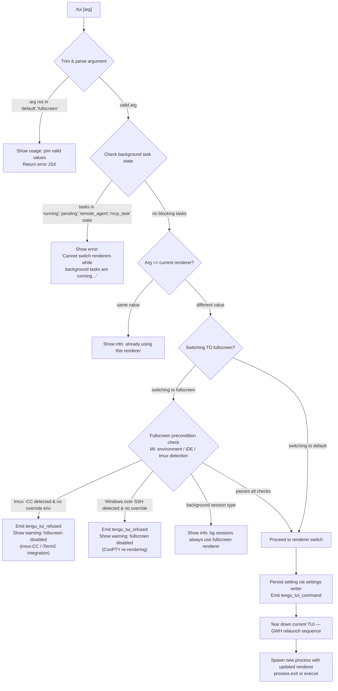

# `/tui`

> Analysis basis: CC v2.1.161 bundle.js (AST extraction + Claude interpretation)
> Minimum version: v2.1.161

---

## Overview

The `/tui` command switches the terminal UI renderer between `default` and `fullscreen` modes for the current Claude Code session. It validates the requested renderer value, checks environment and background-task preconditions, and then performs a live renderer switch by tearing down the current UI, persisting the new setting, and relaunching the interface. Background sessions always use the fullscreen renderer regardless of this setting.

---

## Registration

| Field | Value |
|---|---|
| type | `local-jsx` |
| name | `tui` |
| description | `Set the terminal UI renderer (default \| fullscreen)` |
| argumentHint | `[default\|fullscreen]` |
| module_id | `Za1` |
| load_inline | `true` |
| loc_byte | `12268783` |
| loc_byte_end | `12268965` |
| loc_line | `8545` |
| arbor_handler.name | `LTf` |
| arbor_handler.fqn | `claude-2.1.161::LTf` |
| arbor_handler.kind | `AsyncFunction` |
| arbor_handler.resolution_path | `module_id` |
| arbor_handler.n_hits | `0` |

Analysis basis: CC v2.1.161 bundle.js:+12268783

---

## Input Branching

The command has 5+ distinct paths depending on argument validity, background-task state, environment overrides, and renderer transition direction.



Analysis basis: CC v2.1.161 bundle.js:+12266693, +12267399, +12267529, +12267700, +12267960

---

## Behavioral Spec

### 1. Argument Parsing and Validation

```
async function tuiCommandHandler(args, context):
    rawArg = args.trim()                          // LTf → A.trim @ +12266693
    normalizedArg = rawArg.toLowerCase()          // A → f.toLowerCase @ +15930262
    validValues = ["fullscreen", "default"]       // vqA literals @ +12266805
    joined = validValues.join(" | ")

    if normalizedArg not in validValues:
        return errorJSX("Usage: /tui [" + joined + "]")
```

Analysis basis: CC v2.1.161 bundle.js:+12266693, +12266805, +12266851

---

### 2. Background Session Notice

```
    sessionMode = getSessionMode()                // W9 → bzH @ +12266989
    // daemon / daemon-worker modes always use fullscreen
    if sessionMode in ["daemon", "daemon-worker"]:
        return infoJSX(
            "Background sessions always use the fullscreen renderer so " +
            "scrolling and mouse work when attached. " +
            "The tui setting applies to sessions started directly with `claude`."
        )
        // literal @ +12267003
```

Analysis basis: CC v2.1.161 bundle.js:+12266989, +12267003

---

### 3. Background Task Guard

```
    activeTasks = Object.values(taskStore)        // LTf → Object.values @ +12267360
    blockingStates = ["running", "pending", "remote_agent", "mcp_task"]
    // literals @ +12267399, +12267421, +12267442, +12267467

    hasBlockingTasks = activeTasks.some(t => blockingStates.includes(t.status))
    if hasBlockingTasks:
        emit("tengu_tui_refused")                 // @ +12267488
        return errorJSX(
            "Cannot switch renderers while background tasks are running — " +
            "wait for them to finish (or stop them via /tasks), then run /tui again."
        )
        // literal @ +12267529
```

Analysis basis: CC v2.1.161 bundle.js:+12267360, +12267488, +12267529

---

### 4. Fullscreen Precondition Check (function `MI`)

```
function checkFullscreenCompatibility(targetRenderer):
    // MI @ +12267827
    if targetRenderer != "fullscreen":
        return { allowed: true }

    env = process.env

    // tmux -CC / iTerm2 integration detection (Do → j0L → w0L)
    if isTmuxControlMode():                       // j0L → w0L @ +3417716
        // w0L checks TERM_PROGRAM startsWith "iTerm.app" @ +3417572
        // j0L: spawnSync tmux display-message -p "#{client_control_mode}" @ +3417828, +3417850
        // timeout 2000ms @ +3417924
        if not env["CLAUDE_CODE_NO_FLICKER"]:     // literal @ +12264532
            return {
                allowed: false,
                reason: "fullscreen disabled: tmux -CC (iTerm2 integration mode) detected " +
                        "· set CLAUDE_CODE_NO_FLICKER=1 to override"
                // literal @ +3418595
            }

    // Windows over SSH detection (mJ_ → windows check)
    if platform == "windows":                     // literal @ +3418134
        if not env["CLAUDE_CODE_NO_FLICKER"]:
            return {
                allowed: false,
                reason: "fullscreen disabled: Windows over SSH (ConPTY re-rendering) detected " +
                        "· set CLAUDE_CODE_NO_FLICKER=1 to override"
                // literal @ +3418781
            }

    return { allowed: true }
```

Analysis basis: CC v2.1.161 bundle.js:+12267827, +3418595, +3418781, +12264532

---

### 5. Renderer State Resolution (function `HYH`)

The `HYH` function computes the effective fullscreen state from multiple override layers in priority order:

```
function resolveFullscreenState():
    // HYH @ +12267700
    // Priority chain (highest → lowest):
    // 1. bg_forced_on  — background mode forces fullscreen   @ +3419348
    // 2. env_off       — CLAUDE_CODE_DISABLE_ALTERNATE_SCREEN  @ +3419378, literal @ +12264557
    // 3. env_on        — CLAUDE_CODE_FORCE_FULLSCREEN_UPSELL  @ +3419436, literal @ +12264596
    // 4. tmux_cc_auto_off — tmux CC mode detected             @ +3419460
    // 5. win_ssh_auto_off — Windows SSH detected              @ +3419494
    // 6. settings_on / settings_off — user settings value     @ +3419553, +3419587
    // 7. downsell_on                                          @ +3419660
    // 8. gb_on / gb_off — gradual rollout flag                @ +3419725, +3419733

    return effectiveMode   // "fullscreen" | "default"
```

Analysis basis: CC v2.1.161 bundle.js:+12267700, +3419348, +3419378, +3419436, +3419460, +3419494, +3419553, +3419587

---

### 6. CLI Argument Reconstruction (function `Uh8`)

Before relaunching, the handler reconstructs the CLI argument list so the new process inherits all relevant flags:

```
function buildRestartArgs(currentArgs):
    // Uh8 @ +12266969
    result = Array.from(currentArgs)
    // Includes flags: --add-dir, --allow-dangerously-skip-permissions,
    //                 --effort, --permission-mode              @ +12264003, +12264172, +12264314, +12264331
    // Source tags: cliArg, session                            @ +12263903, +12263924
    // system source                                           @ +12266831
    return result
```

Analysis basis: CC v2.1.161 bundle.js:+12266969, +12264003, +12264172, +12264314, +12264331

---

### 7. App State Snapshot (functions `C_` and `d$`)

```
function captureAppStateForRelaunch():
    // C_  @ +12266973 — reads working_directory, allowed_tools,
    //                    disallowed_tools, avoid_prompts              @ +10823618..+10823789
    // d$  @ +12266979 — reads effort, model, max_thinking_tokens,
    //                    flag_settings                                 @ +10824113..+10824164
    return snapshot
```

Analysis basis: CC v2.1.161 bundle.js:+12266973, +12266979, +10823618, +10824113

---

### 8. Telemetry Emission Before Relaunch

```
    emit("tengu_tui_command", {
        uptime: Math.round(process.uptime()),     // +12268039, +12268050
        renderer: normalizedArg,
        // additional dimension fields from HYH state
    })
    // @ +12267960
```

Analysis basis: CC v2.1.161 bundle.js:+12267960, +12268039, +12268050

---

### 9. Renderer Switch / Relaunch Sequence (function `GWH` via `Ta1`)

```
async function relaunchWithNewRenderer(args, snapshot):
    // Ta1 @ +12268398 → GWH @ +12262340

    // 1. Flush pending analytics
    //    EmH → tYA.drain                        @ +12262597
    await drainAnalytics(timeout="analytics flush timeout")  // literal @ +12262664

    // 2. Remove signal handlers, re-register for clean exit
    //    process.removeAllListeners              @ +12263048
    //    process.on(SIGINT/SIGTERM/SIGHUP…)      @ +12263078, literals @ +12263019, +12263028, +12263038

    // 3. Tear down current TUI instances
    //    TkH: unmount existing Ink instances,
    //         write terminal restore sequences   @ +12262507
    //    HW6: clear render intervals             @ +12262501
    //    _K8: write ESC-7/ESC-8 cursor save/restore  // literals \x1b7, \x1b8 @ +3760546, +3760557

    // 4. Stat the binary path
    //    GWH → Xa1.stat                          @ +12262427

    // 5. Write PID/state file before exit
    //    VJ → lmH.writeFileSync                  @ +191429

    // 6. Wait for flush with 30 000 ms timeout
    //    u7: Promise.race + setTimeout(30000)    @ +12262546, literal @ +30000 at +12262546

    // 7. Relaunch via spawnSync or execve
    //    Pa1.spawnSync / ja1 → M.execve         @ +12263105, +12261982
    //    inherit stdio                            @ +12263140

    // 8. process.exit(0) if execve not available  @ +12263354
```

Analysis basis: CC v2.1.161 bundle.js:+12268398, +12262340, +12262597, +12263048, +12263105, +12263354

---

## State & Side Effects

| Item | Detail |
|---|---|
| Telemetry — `tengu_tui_refused` | Fired when fullscreen is blocked by tmux-CC or Windows-SSH detection (bundle.js:+12267488) |
| Telemetry — `tengu_tui_command` | Fired on every successful renderer switch, includes uptime and target renderer (bundle.js:+12267960) |
| Telemetry — `tengu_amber_creek` | Fired from `J0L` sub-path during context rebuild (bundle.js:+3419112) |
| Telemetry — `tengu_pewter_brook` | Fired from `J0L` sub-path (bundle.js:+3419020) |
| Telemetry — `tengu_feature_ok` / `tengu_feature_bad` / `tengu_feature_sad` | Feature result instrumentation from `hH`/`RH`/`t6` (bundle.js:+966587, +966650, +966732) |
| Telemetry — `tengu_scroll_summary` | Fired from `r$8` on TUI teardown (bundle.js:+5414569) |
| Telemetry — `tengu_bg_dispatch_*` / `tengu_daemon_control` | Daemon/background session lifecycle events reachable via `w` / `z` (bundle.js:+15904509, +15940522) |
| Settings write | Renderer preference persisted via `IBK` → `NBK` → `Ay.appendFile`/`Ay.mkdir` to `settings.local.json` (bundle.js:+204255, +1222623) |
| Process relaunch | `process.exit` or `execve` called; current process terminates (bundle.js:+12263354, +12261982) |
| Signal handlers | All existing listeners removed (`process.removeAllListeners`) then re-registered before relaunch (bundle.js:+12263048) |
| Analytics flush | `tYA.drain` awaited with timeout before exit (bundle.js:+12262597) |
| Environment variables read | `CLAUDE_CODE_NO_FLICKER`, `CLAUDE_CODE_DISABLE_ALTERNATE_SCREEN`, `CLAUDE_CODE_FORCE_FULLSCREEN_UPSELL` (bundle.js:+12264532, +12264557, +12264596) |
| Background session guard | Daemon/daemon-worker sessions bypass setting and always remain on fullscreen (bundle.js:+12266989) |

---

## Version History

| Version | Change |
|---|---|
| v2.1.161 | Initial analysis |

---

## Common Mistakes

1. **Running `/tui fullscreen` inside tmux with iTerm2 integration** — Claude Code detects `#{client_control_mode}` via `tmux display-message` and will refuse unless `CLAUDE_CODE_NO_FLICKER=1` is set in the environment.
2. **Attempting to switch while background tasks are active** — If any task reports status `running`, `pending`, `remote_agent`, or `mcp_task`, the command hard-blocks and instructs the user to wait or use `/tasks` to stop them first.
3. **Expecting `/tui` to affect background (daemon) sessions** — Background sessions are always locked to the fullscreen renderer for scrolling/mouse support; `/tui` only controls sessions started directly via the `claude` CLI.
4. **Confusing the argument casing** — The argument is lowercased internally, but only the exact strings `default` and `fullscreen` are accepted; any other value (including `full`, `fs`) produces a usage error.
5. **Not accounting for the process restart** — The switch terminates the current process and spawns a new one; any in-memory state not persisted to settings files will be lost.

---

## Appendix — Identifier Mapping

> For bundle debugging only. Identifiers change across versions.

| Identifier | Role |
|---|---|
| `LTf` | Main async handler for `/tui` command (arbor_handler) |
| `A` | Trimmed argument string / intermediate array variable |
| `f` | Lowercase-normalised argument / file/stream handle depending on scope |
| `q` | Active task collection / queue / fs ref depending on scope |
| `L` | Async task tracker / promise set |
| `qq` | Settings-load orchestrator called during context rebuild |
| `ne` | Settings cache existence check |
| `pJ_` | Settings version helper |
| `v1` | String conversion utility (version field) |
| `pH` | String coercion / primitive-to-string helper |
| `Do` | Settings disk writer coordinator |
| `j0L` | tmux control-mode detection (spawnSync tmux display-message) |
| `w0L` | TERM_PROGRAM iTerm.app prefix checker |
| `N` | Log/debug emission helper |
| `VBK` | Settings merge helper |
| `HwA` | Settings field normaliser |
| `H` | HTTP fetch helper / app-state accessor depending on call site |
| `s$` | HTTP response state |
| `Ij` | URL/path replace helper |
| `lq` | HTTP header builder |
| `t6` | Feature-result telemetry emitter (feature_sad path) |
| `SH` | JSON stringify wrapper |
| `Z4` | Log line formatter |
| `CJA` | Log map helper |
| `imH` | Log write dispatcher |
| `GJA` | Raw stream writer |
| `IBK` | Settings-file writer (main) |
| `WmH` | Debounced write scheduler |
| `_3H` | Settings path builder |
| `F6` | File-exists / stat utility |
| `d46` | File write utility |
| `BJA` | Settings file path resolver |
| `UJA` | Atomic file rename helper |
| `NBK` | Async settings append/mkdir writer |
| `Y9` | Exit-hook registration (`tYA.register`) |
| `mJ_` | Windows platform + SSH detection helper |
| `t_` | Settings load coordinator |
| `np` | Top-level settings loader (loadSettingsFromDisk) |
| `ZT` | Settings load start tracer |
| `C9` | In-flight request deduplicator |
| `We8` | Settings load implementation (flagSettings / policySettings) |
| `TQ` | Settings provider aggregator |
| `bx6` | Settings load end tracer |
| `J0L` | Context/project re-initialisation on relaunch |
| `j6` | Session context builder |
| `gY6` | Session ID generator |
| `QY6` | Session metadata builder |
| `Qx` | Session context accessor |
| `Lq8` | Conversation-history deduplicator |
| `y6` | Project context builder |
| `Uh8` | CLI argument list reconstructor for relaunch |
| `TK6` | Argument filter/transform |
| `C_` | App-state reader (working_directory, tools lists) |
| `BN8` | Tool-list merger |
| `tA` | Tool registry |
| `FN8` | Disallowed-tools merger |
| `d$` | App-state reader (effort, model, max_thinking_tokens) |
| `W9` | Session/daemon mode detector |
| `bzH` | Daemon mode string resolver |
| `d` | Generic logger |
| `HYH` | Fullscreen-state resolver (multi-layer override chain) |
| `l_` | Session initialisation / git-ignore writer |
| `BO` | Conversation context builder |
| `jOH` | Settings file path set builder |
| `bd6` | Settings path resolver |
| `pM4` | Settings path formatter |
| `wx` | Local `.claude` directory path builder |
| `mM4` | Managed-settings path builder |
| `Xe8` | Settings merge + cache helper |
| `qbA` | Settings object constructor |
| `AbA` | Per-layer settings parser |
| `GQ` | Settings cache get/set |
| `SYA` | Settings cache getter |
| `CX` | Deep clone via structuredClone |
| `je8` | Settings object builder |
| `RYA` | Settings cache setter |
| `HbA` | Settings layer merger |
| `Yx` | Permission-mode builder |
| `$OH` | Tool-permission formatter |
| `mX` | Project-root resolver |
| `ai` | File reader with encoding detection |
| `R$` | Real-path resolver |
| `tg6` | File-exists guard for reader |
| `eg6` | Encoding sniffer |
| `k8` | Error code classifier |
| `v8` | ENOENT/EISDIR error factory |
| `wt8` | Request timestamp recorder |
| `qTH` | Settings path + provider pair builder |
| `Y56` | Atomic file writer (write + fsync + rename) |
| `O` | Symbolic-link stat checker / timeout object |
| `u8` | Generic error wrapper |
| `nz` | Cache clearing utility (Cx6 + IU8) |
| `QQ6` | Git-ignore rule writer |
| `h6` | AsyncLocalStorage context getter |
| `sg6` | Store accessor |
| `P_` | Breadcrumb/span helper |
| `as8` | Sentry-style error breadcrumb |
| `gQ6` | Git-ignore file path resolver |
| `h_` | Git check-ignore runner |
| `K54` | Path normaliser (tilde expansion, absolute check) |
| `dSA` | Git ls-files tracked checker |
| `cSA` | Git-ignore append helper |
| `hH` | Feature-ok telemetry emitter path |
| `h1H` | Feature telemetry helper |
| `Xa8` | Telemetry event dispatcher |
| `RH` | Feature-bad telemetry emitter path |
| `yH` | Async error logger / telemetry recorder |
| `a_` | Error stringifier |
| `r9` | Error metadata extractor |
| `qkA` | String coercion helper |
| `s44` | Rolling error log (shift/push) |
| `MI` | Fullscreen compatibility checker (env, IDE, tmux, platform) |
| `mw6` | Renderer mode string constant holder |
| `RD` | Renderer mode enum resolver |
| `CP_` | IDE-specific renderer override (cursor/vscode) |
| `RZL` | IDE renderer constant |
| `Ez` | Renderer fallback resolver |
| `CZL` | Terminal column-count clamper (parseFloat + Math.min, max 20) |
| `bP_` | Terminal width query |
| `gx` | Renderer instantiator / JSX renderer factory |
| `dR` | Renderer component builder |
| `OPL` | Prompt renderer component |
| `pM` | Prompt display helper |
| `n3` | Ink render helper |
| `K56` | Renderer string coercer |
| `G9` | Model/plan initialiser |
| `I19` | Plan loader |
| `_J6` | Plan resolver |
| `qC` | Plan component builder |
| `HJ6` | Plan file reader |
| `kLH` | Plan validation helper |
| `Z4H` | Renderer string formatter |
| `Ta1` | Relaunch orchestrator entry point |
| `GWH` | Full relaunch sequence (teardown → flush → spawn) |
| `fS` | Binary path resolver |
| `EG8` | Claude binary path builder |
| `NAH` | Local bin path builder |
| `_3` | Array/value normaliser |
| `Gk` | Process argument builder |
| `N6` | Node module loader wrapper |
| `XN` | Require/import helper |
| `HW6` | Render interval clearer |
| `mk_` | clearInterval wrapper |
| `TkH` | Ink instance teardown (unmount + write) |
| `rR` | Terminal output flusher |
| `_K8` | Alternate-screen exit writer (ESC-7/ESC-8) |
| `r$8` | Scroll-summary telemetry emitter |
| `IT` | Scroll metric collector |
| `GE9` | Scroll state accessor |
| `EE9` | Scroll position calculator (Date.now + Math.round) |
| `u7` | Promise.race timeout helper |
| `eG` | Exit-hook runner |
| `a4` | Exit-hook chain |
| `EmH` | Analytics drain caller |
| `o$8` | Async teardown coordinator (Promise.all + race) |
| `n8` | Timeout-error factory |
| `ZqA` | Config directory resolver for relaunch |
| `tK` | Config path helper |
| `ja1` | Native relaunch via FFI/execve (Bun-specific) |
| `$` | Child-process registry |
| `w` | Background-session process manager |
| `M` | Temp-file cleanup on exit |
| `z` | Daemon stop helper |
| `TH` | Signal string formatter |
| `VJ` | PID-file writer before exit |