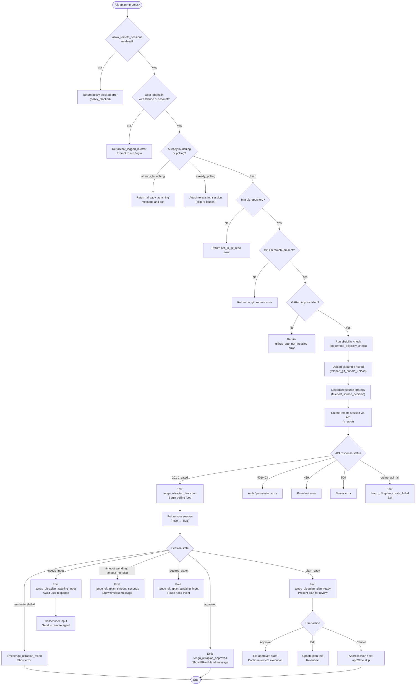

# `/ultraplan`

> Analysis basis: CC v2.1.161 bundle.js (AST extraction + Claude interpretation)
> Minimum version: v2.1.161

---

## Overview

`/ultraplan` launches a remote Claude Code session in the cloud (via the "teleport" subsystem) that drafts a detailed implementation plan based on the user's prompt. The plan is streamed back to the local CLI where the user can review, edit, and approve it before any code changes are committed. Upon approval, the remote agent executes the plan and delivers results as a pull request on the connected GitHub repository.

---

## Registration

| Field | Value |
|---|---|
| type | `local-jsx` |
| name | `ultraplan` |
| description | `… Claude Code on the web drafts a plan you can edit and approve. See …` |
| argumentHint | `<prompt>` |
| load_inline | `true` |
| load_ident | `LEf` |
| loc_byte | `12098321` |
| loc_byte_end | `12098565` |
| loc_line | `8324` |
| arbor_handler.name | `LEf` |
| arbor_handler.fqn | `claude-2.1.161::LEf` |
| arbor_handler.kind | `AsyncFunction` |
| arbor_handler.resolution_path | `load_ident` |
| arbor_handler.n_hits | `1` |

Analysis basis: CC v2.1.161 bundle.js:+12098321

The handler is inlined via `load: () => Promise.resolve({ call: LEf })`. The Arbor symbol graph resolved this via the `load_ident` path with exactly 1 hit, confirming `LEf` is the unique entry point.

---

## Input Branching

The command logic has more than three distinct branches covering permission checks, prompt parsing, session-state guards, plan lifecycle states, error paths, and cancellation. A Mermaid flowchart is used below.



Analysis basis: CC v2.1.161 bundle.js:+12096465, +12093716, +12094239, +9014711, +12081029, +12081407

---

## Behavioral Spec

### 1. Entry Point and Permission Gate (`LEf`)

```
async function ultraplanHandler(args, appState):
    // Check remote sessions are globally permitted
    if not appState.settings.allow_remote_sessions:
        emit_error("policy_blocked",
            "Remote sessions are disabled by your organization's policy.")
        return

    // Resolve prompt text from args (slash invocation) or inline keyword
    rawPrompt = resolvePrompt(args)        // calls xZ8 → _i_
    systemRole = "system"                  // literal: bundle.js:+12096558

    // Fetch session context (project info, git state, auth tokens)
    sessionContext = await buildSessionContext(appState)   // calls G9

    // Render the JSX panel and dispatch launch
    render(<UltraplanPanel
        context=sessionContext
        prompt=rawPrompt
        onApprove=handleApproval
        onCancel=handleCancel />)          // calls Oh6

    // After session ends, update appState
    appState.setAppState(...)              // calls _.setAppState
```

Analysis basis: CC v2.1.161 bundle.js:+12096465, +12096518, +12096800, +12097018

---

### 2. Prompt Extraction (`xZ8` / `_i_`)

```
function extractPromptText(rawInput):
    // Check if input starts with expected prefix
    if not rawInput.startsWith(expectedPrefix):   // _i_ → H.startsWith
        return rawInput

    // Find all embedded "ultraplan" keyword occurrences (regex, gi flag)
    matches = rawInput.matchAll(/ultraplan/gi)     // literal "gi": bundle.js:+9807298
                                                   // keyword "ultraplan": bundle.js:+9807650

    // If keyword present anywhere, strip it; push remaining segments
    segments = []
    for match in matches:
        segments.push(matchContext)               // _i_ → q.push

    // Normalise whitespace: collapse runs, replace with "$1$2"
    normalised = rawInput
        .slice(offset)                            // xZ8 → H.slice
        .replace(collapsePattern, "$1$2")         // literal: bundle.js:+9807975
        .trim()                                   // boundary: max 5 replacements (bundle.js:+9807998)

    return normalised
```

Analysis basis: CC v2.1.161 bundle.js:+12096465, +9806900, +9807117, +9807306, +9807878, +9807975

---

### 3. Pre-flight Eligibility Check (`XM1` via `hXH`)

```
async function checkRemoteEligibility(sessionContext):
    emit_telemetry("bg_remote_eligibility_check")   // bundle.js:+9007943

    // Authentication gate
    if not sessionContext.hasValidClaudeAiToken:
        return { error: "not_logged_in",
                 message: "Please run /login and sign in..." }
                 // literal: bundle.js:+9009823

    // Git repository gate
    if not sessionContext.isInGitRepo:
        return { error: "not_in_git_repo" }         // bundle.js:+9009902

    // GitHub remote gate
    gitRemoteUrl = getGitRemoteUrl()                // PR → git config --get remote.origin.url
    if not gitRemoteUrl:
        return { error: "no_git_remote",
                 message: "Background tasks require a GitHub remote..." }
                 // bundle.js:+9010062

    // GitHub App installation gate
    if not await checkGithubAppInstalled(sessionContext):
        return { error: "github_app_not_installed" }  // bundle.js:+9010157

    // BYOC / first-party API gate
    if sessionContext.apiProvider is not "firstParty":
        return { error: "policy_blocked",
                 message: "Remote sessions are only available on the first-party..." }
                 // bundle.js:+8937763

    // Organisation UUID resolution
    orgUUID = await resolveOrgUUID(sessionContext)
    if not orgUUID:
        return { error: "Unable to get organization UUID..." }
                 // bundle.js:+8938199

    return { ok: true }
```

Analysis basis: CC v2.1.161 bundle.js:+9007873, +9009801, +9009902, +9010040, +9010157, +9010311, +9008254

---

### 4. Git Bundle Upload (`uQ_`)

```
async function uploadGitBundle(sessionContext):
    emit_telemetry("tengu_ccr_bundle_upload")   // bundle.js:+8923446

    // Verify git repository and HEAD
    runGit("rev-parse", "--verify", "HEAD")     // literals: bundle.js:+8923994..8924017

    // Create stash snapshot
    stashSha = runGit("stash", "create")        // literals: bundle.js:+8923642..8923650

    // Generate seed bundle file
    bundleFile = tmpPath + "ccr-seed" + ".bundle"   // literals: bundle.js:+8924449..8924460
    writeBundleFile(bundleFile, "_source_seed.bundle")  // literal: bundle.js:+8924752

    // Upload bundle to remote storage via API
    response = await api.post(bundleUploadEndpoint, bundleFile)
    if response.status != 200:                  // bundle.js:+8923970
        emit_telemetry("tengu_ccr_bundle_upload", { result: "upload_failed" })
        return { error: "upload_failed" }       // literal: bundle.js:+8924901

    // Determine upload strategy:
    //   head | fallback_head | squashed | fallback_squashed
    strategy = resolveStrategy(response)        // literals: bundle.js:+8925118..8925235

    return { ok: true, strategy }
```

Analysis basis: CC v2.1.161 bundle.js:+8923124, +8923446, +8923994, +8924449, +8925118

---

### 5. Source Strategy Decision (`zB7`)

```
async function determineSourceStrategy(context):
    emit_telemetry("tengu_teleport_source_decision")   // bundle.js:+8944160
    emit_telemetry("tengu_teleport_bundle_mode")       // bundle.js:+8938942

    // Hierarchy of source modes (evaluated in order):
    //   1. explicit_source_url  — CLAUDE_CODE env var set
    //   2. bundle               — explicit env bundle
    //   3. git_repository       — normal git-backed repo
    //   4. no_git_at_all        — no git detected; use seed bundle only

    if env.EXPLICIT_SOURCE_URL:
        mode = "explicit_source_url"            // bundle.js:+8942432
    else if env.EXPLICIT_BUNDLE:
        mode = "bundle"                         // bundle.js:+8938907
    else if isGitRepo:
        mode = "git_repository"                 // bundle.js:+8939095
        runGithubPreflight()                    // emits github_preflight_ok / _failed
    else:
        mode = "no_git_at_all"                  // bundle.js:+8942454
        log("[teleportToRemote] No repository detected — session will have an empty sandbox")
            // literal: bundle.js:+8944533

    // Validate monorepo constraints
    checkMonorepoConstraints(mode)
    // Error codes: monorepo_source_disallowed, monorepo_byoc_source_missing,
    //              monorepo_source_env_mismatch
    //              literals: bundle.js:+8945861, +8945890, +8945921

    return mode
```

Analysis basis: CC v2.1.161 bundle.js:+8942310, +8942432, +8938907, +8939095, +8942454, +8944160

---

### 6. Remote Session Creation (`ul`)

```
async function createRemoteSession(context, prompt, sourceMode):
    // Build request payload
    headers = {
        "anthropic-version": "2023-06-01",       // bundle.js:+3192848
        "anthropic-beta": "ccr-byoc-2025-07-29", // bundle.js:+8938538
        "x-organization-uuid": orgUUID,          // bundle.js:+8938560
        "Content-Type": "application/json"
    }

    // Generate title via API
    titlePayload = buildTitlePayload(prompt)     // zB7 → uses template "{description}"
                                                 // bundle.js:+8926499
    titleResponse = await api.get("claude/task") // bundle.js:+8926463

    // Generate UUID for task
    taskId = crypto.randomUUID()                 // U51 → pQ_.randomUUID

    // POST session creation
    response = await api.post(sessionEndpoint, {
        taskId,
        title,
        gitRemoteUrl,
        sourceMode,
        prompt
    })

    if response.status == 201:                   // bundle.js:+8939856
        sessionId = response.data.sessionId
        if not sessionId:
            throw Error("Server returned a malformed session response (no session id)")
                // bundle.js:+8940286
        emit_telemetry("tengu_ccr_session_link") // bundle.js:+8933230
        return { sessionId }
    else if response.status in [401, 403, 429]:  // bundle.js:+8939927..8939935
        handleAuthOrRateError(response)
    else if response.status == 409:              // bundle.js:+8947491
        handleConflict()
    else:
        throw serverError
```

Analysis basis: CC v2.1.161 bundle.js:+8937601, +8938538, +8939856, +8940286, +8939927

---

### 7. Remote Environment Resolution (`ks` / `dH6`)

```
async function resolveRemoteEnvironment(orgUUID, token):
    emit_telemetry("teleport_environments_list")   // bundle.js:+8889613

    // Validate first-party provider
    if not isFirstPartyProvider:
        throw Error("Remote environments are only available on the first-party Anthropic API provider.")
            // bundle.js:+8889687

    // Validate Claude.ai auth (not API key)
    if not hasClaudeAiToken:
        throw Error("Claude Code web sessions require authentication with a Claude.ai account...")
            // bundle.js:+8889817

    // Resolve org UUID
    orgUUID = await getOrgUUID()
    if not orgUUID:
        throw Error("Unable to get organization UUID")  // bundle.js:+8890056

    // Fetch environments list with timeout
    environments = await api.get(envListEndpoint,
        { timeout: 15000 })                            // bundle.js:+8890248

    if environments is empty:
        // Auto-create default cloud environment
        defaultEnv = await createDefaultEnvironment()  // dH6
        emit_telemetry("teleport_default_environment_create")
        // Default env params: name="Default", provider="anthropic_cloud",
        //   workdir="/home/user", python="3.11", node="20"
        //   literals: bundle.js:+8890978, +8890948, +8891054, +8891133, +8891162

    return selectedEnvironment
```

Analysis basis: CC v2.1.161 bundle.js:+8889610, +8889613, +8889687, +8890248, +8890533

---

### 8. Session Polling and Plan Lifecycle (`mSH` → `TM1`)

```
async function pollRemoteSession(sessionId, context):
    startTime = Date.now()
    maxPollDuration = 1800000   // 30 minutes, bundle.js:+9016399
    pollInterval = 1000         // 1 second,   bundle.js:+9016392
    agentType = "remote_agent"  // bundle.js:+9014714

    while elapsed < maxPollDuration:
        // Open SSE/WebSocket connection (mH6 → ut.open)
        event = await receiveNextEvent()

        switch event.type:

            case "running":                    // bundle.js:+9014822
                updateUI("running")

            case "plan_ready":                 // bundle.js:+12081407
                emit_telemetry("tengu_ultraplan_plan_ready")
                planText = extractPlanText(event)
                presentPlanForReview(planText, header="Here is a draft plan to refine:")
                    // literal: bundle.js:+12089698
                waitForUserApproval()

            case "needs_input":                // bundle.js:+12081422
                emit_telemetry("tengu_ultraplan_awaiting_input")
                collectAndForwardUserInput()

            case "approved":                   // bundle.js:+12081029
                emit_telemetry("tengu_ultraplan_approved")
                showMessage("Results will land as a pull request when the remote session finishes...")
                    // literal: bundle.js:+12090963
                return { status: "approved" }

            case "requires_action":            // bundle.js:+12081355
                emit_telemetry("tengu_ultraplan_awaiting_input")
                routeHookEvent(event)

            case "terminated" | "failed":
                emit_telemetry("tengu_ultraplan_failed")
                showError("Remote Ultraplan session failed. Wait for the user's next instructions.")
                    // literal: bundle.js:+12091757
                return { status: "failed" }

            case "completed":                  // bundle.js:+9016918
                emit_telemetry("tengu_ultraplan_plan_ready") // if plan not yet shown
                return { status: "completed" }

            case "hook_progress" | "hook_response" | "hook_started":
                // literals: bundle.js:+9017589, +9017618, +9018109
                routeHookProgress(event)

        elapsed = Date.now() - startTime

    // Timeout path
    emit_telemetry("tengu_ultraplan_timeout_seconds")   // bundle.js:+12089357
    if planWasNeverDelivered:
        status = "timeout_no_plan"                      // bundle.js:+12081778
    else:
        status = "timeout_pending"                      // bundle.js:+12081760
    showTimeoutMessage(elapsed / 60000, "minute"/"minutes")  // bundle.js:+12081552
```

Analysis basis: CC v2.1.161 bundle.js:+9014711, +9014730, +9014822, +9016392, +9016399, +12081029, +12081407, +12081422, +12081760, +12089357

---

### 9. Plan Review UI (`KEf` / `HEf`)

```
function renderPlanReviewPanel(planText, sessionId):
    // Display plan in editable text area
    // Action buttons: "Refine local plan" (bundle.js:+12094884) | "Approve" | "Cancel"

    // Timeout indicator: 5400 seconds maximum wait for plan (bundle.js:+12089391)
    //                    displayed as elapsed minutes (60000 ms/min, bundle.js:+12081537)

    // On "Refine local plan" click:
    //   prefix draft with "Here is a draft plan to refine:" (bundle.js:+12089698)
    //   assemble message parts via e0f → t0f → q.join

    // On "Approve" click:
    //   set plan state = "plan"    (bundle.js:+12094919)
    //   emit tengu_ultraplan_approved

    // Notification hook: registers "task-notification" (bundle.js:+12094741)
    //   keyed to session via Y9 → tYA.register

    // Error handling on launch fail:
    //   emit tengu_ultraplan_create_failed (bundle.js:+12093753)
    //   classify as "create_api_fail" | "teleport_null" (bundle.js:+12095120, +12095138)
    //   append ". See --debug for details." (bundle.js:+12095220)

    // On unexpected error:
    //   emit "unexpected_error" (bundle.js:+12095843)
    //   show "Ultraplan hit an unexpected error during launch. Wait for the user's next instructions."
    //        (literal: bundle.js:+12096002)

    // Archive orphaned sessions on cleanup:
    //   log "ultraplan: failed to archive orphaned session" (bundle.js:+12096150)
```

Analysis basis: CC v2.1.161 bundle.js:+12094239, +12094481, +12089698, +12094884, +12095120, +12095421, +12096002

---

### 10. State Guards (duplicate-launch protection — `Oh6`)

```
function launchGuard(currentState):
    if currentState == "already_polling":      // bundle.js:+12093972
        // Session already active; attach to it silently
        return ATTACH_EXISTING

    if currentState == "already_launching":    // bundle.js:+12093990
        // Show user-facing notice and abort second launch
        showMessage("ultraplan: already launching. Please wait for the session to start.")
            // literal: bundle.js:+12092580
        return ABORT

    return PROCEED_WITH_LAUNCH
```

Analysis basis: CC v2.1.161 bundle.js:+12093716, +12093972, +12093990, +12092580

---

### 11. GitHub App Installation Check (`vSH`)

```
async function checkGithubAppInstalled(token, orgUUID):
    if not token:
        log("checkGithubAppInstalled: No access token found, assuming app not installed")
            // literal: bundle.js:+8891983
        return false

    if not orgUUID:
        log("checkGithubAppInstalled: No org UUID found, assuming app not installed")
            // literal: bundle.js:+8892096
        return false

    response = await api.get(githubCheckEndpoint)

    if api.isAxiosError(response):
        if response.status == 400:             // bundle.js:+8892754
            return false

    installed = (response.data.status == "is")  // literals "is"/"is not": bundle.js:+8892494..8892499
    return installed
```

Analysis basis: CC v2.1.161 bundle.js:+8891950, +8892076, +8892494, +8892700, +8892754

---

## State & Side Effects

| Item | Detail |
|---|---|
| Telemetry — `tengu_ultraplan_launched` | Fired on successful session creation (bundle.js:+12095431) |
| Telemetry — `tengu_ultraplan_create_failed` | Fired when the API session creation call fails (bundle.js:+12093753) |
| Telemetry — `tengu_ultraplan_plan_ready` | Fired when remote agent delivers a reviewable plan (bundle.js:+12090069) |
| Telemetry — `tengu_ultraplan_awaiting_input` | Fired when remote session is blocked on user input (bundle.js:+12090001) |
| Telemetry — `tengu_ultraplan_approved` | Fired when user approves the plan (bundle.js:+12090477) |
| Telemetry — `tengu_ultraplan_failed` | Fired when remote session terminates with an error (bundle.js:+12091350) |
| Telemetry — `tengu_ultraplan_timeout_seconds` | Fired on polling timeout; carries elapsed seconds (bundle.js:+12089357) |
| Telemetry — `tengu_ultraplan_prompt_identifier` | Tracks how the prompt was recognised (slash vs. inline keyword) (bundle.js:+12089524) |
| Telemetry — `tengu_ccr_bundle_upload` | Fired during git bundle upload phase (bundle.js:+8923446) |
| Telemetry — `tengu_ccr_bundle_seed_enabled` | Fired when BYOC seed bundle path is active (bundle.js:+9008346) |
| Telemetry — `tengu_ccr_session_link` | Fired with session link after successful API creation (bundle.js:+8933230) |
| Telemetry — `tengu_teleport_bundle_mode` | Classifies the chosen bundle strategy (bundle.js:+8938942) |
| Telemetry — `tengu_teleport_source_decision` | Records which source mode was selected (bundle.js:+8944160) |
| Telemetry — `tengu_config_parse_error` | Fires if project config JSON cannot be parsed (bundle.js:+3251872) |
| Telemetry — `tengu_feature_ok` / `tengu_feature_bad` | Feature-flag health signals from dependency (bundle.js:+966587, +966650) |
| Telemetry — `tengu_bg_*` | Background daemon signals (low-mem, spare workers, dispatch) |
| Hook registration | Registers `"task-notification"` hook keyed to the remote session ID via `tYA.register` (bundle.js:+12095694, +59405) |
| appState reads | `allow_remote_sessions` policy flag (bundle.js:+12096486); `_.getAppState()` (bundle.js:+12096800) |
| appState writes | `_.setAppState(...)` on session completion or cancellation (bundle.js:+12097018); skip sentinel written at +12097136 |
| File I/O | Writes temporary git bundle files (`ccr-seed.bundle`, `_source_seed.bundle`); cleans up via `wSK.unlinkSync`, `iH6.unlink`, `PL.unlink`, `DY.rm` |
| Network | `s_.post` for session creation; `s_.get` for environment list and GitHub checks; SSE/WebSocket for polling (via `ut.open`) |
| Sound / UI | JSX rendered panel (`local-jsx` type); editable plan text area; "Refine local plan" and "Approve" action buttons |

---

## Version History

| Version | Change |
|---|---|
| v2.1.161 | Initial analysis |

---

## Common Mistakes

1. **Running `/ultraplan` without a Claude.ai account login**: The command requires OAuth authentication with claude.ai — an API key alone is insufficient. Users must first run `/login`. Error code: `not_logged_in` (bundle.js:+9009801).

2. **Running outside a git repository**: The remote session requires a git repository to exist in the working directory. Running in a plain directory returns `not_in_git_repo` immediately (bundle.js:+9009902).

3. **Missing GitHub remote**: Even if inside a git repo, a GitHub remote (`origin`) must be configured. The error `no_git_remote` is returned if `git config --get remote.origin.url` yields nothing (bundle.js:+9010040, +1065747).

4. **GitHub App not installed on the repository**: The Anthropic GitHub App must be installed on the target repository. Without it, the command returns `github_app_not_installed` (bundle.js:+9010157).

5. **Invoking `/ultraplan` again while a session is launching**: The command detects the `already_launching` guard state and refuses to start a second session, showing a user-facing notice (bundle.js:+12093990). Users should wait for the first session to become active.

6. **Using a third-party or BYOC API provider**: Remote sessions are restricted to the first-party Anthropic API. The error `policy_blocked` is returned for non-`firstParty` providers (bundle.js:+8937763).

7. **Repository with no commits**: An empty repository (no commits yet) causes the git bundle upload to fail. Users must make at least one commit before using `/ultraplan` (bundle.js:+8943597).

---

## Appendix — Identifier Mapping

> For bundle debugging only. Identifiers change across versions.

| Identifier | Role |
|---|---|
| `LEf` | Main async handler for `/ultraplan` (Arbor-resolved entry point) |
| `xZ8` | Prompt text extraction outer function |
| `bZ8` | Prompt normalisation helper called by `xZ8` |
| `_i_` | Inner prompt parsing / keyword matching logic |
| `G9` | Session context builder (auth, git, config) |
| `I19` | Sub-context initialiser within session context builder |
| `_J6` | Config file reader / project context resolver |
| `qC` | Provider type classifier (firstParty / enterprise / team) |
| `HJ6` | Config file read-and-parse helper (readFileSync, utf-8) |
| `kLH` | Config inclusion / allow-list checker |
| `r9` | Auth token accessor |
| `qkA` | Token string normaliser |
| `pH` | Generic string coercion utility |
| `Z4H` | Organisation UUID resolver |
| `H5H` | App state accessor helper |
| `Oh6` | JSX panel orchestrator / launch guard dispatcher |
| `T8` | UI toast / notification renderer |
| `Xa8` | Toast variant constructor |
| `di1` | Session ID tracker |
| `jh8` | Launch state mutation wrapper |
| `wh8` | State transition dispatcher |
| `j6` | Background task event router |
| `a0f` | State reset helper |
| `KEf` | Plan review panel component (main JSX element) |
| `hXH` | Eligibility check dispatcher within `KEf` |
| `XM1` | Remote eligibility check implementation |
| `e0f` | Plan text assembler (joins draft prefix with user text) |
| `t0f` | Plan segment builder |
| `ul` | Remote session creation orchestrator (teleport core) |
| `h6` | Context / configuration accessor |
| `pM` | Provider config loader |
| `T3` | Network domain resolver |
| `FQ_` | Base URL builder for Anthropic API |
| `yH` | Error logger with retry state |
| `Gx` | Organisation UUID fetch helper |
| `Rq` | API environment resolver (local / staging / prod) |
| `Cj` | HTTP request header builder (anthropic-version etc.) |
| `uQ_` | Git bundle upload implementation |
| `N6` | Node.js module resolver helper |
| `N` | Log-level message formatter |
| `PR` | Git remote URL extractor |
| `U51` | Task UUID generator |
| `zV6` | Session payload builder |
| `SH` | JSON serialisation helper |
| `p51` | Session link formatter |
| `DE8` | Environment selection helper |
| `ks` | Environment list fetcher (teleport_environments_list) |
| `dH6` | Default cloud environment auto-creator |
| `TH` | String coercion / display formatter |
| `zB7` | AI-generated title generator for remote task |
| `iy` | Background task state reader |
| `vSH` | GitHub App installation checker |
| `SN` | Default branch resolver (symbolic-ref / show-ref) |
| `lq` | Polling scheduler / rate limiter |
| `AHH` | Git remote URL parser and normaliser |
| `a_` | Generic error message extractor |
| `zz` | Cancel / abort helper |
| `rz` | Request cancellation token checker |
| `uw` | Claude.ai base URL selector (local / staging / prod) |
| `v_` | Module initialiser / export binder |
| `cZ_` | Environment URL map builder |
| `AEf` | Plan approval state setter |
| `mSH` | Session polling entry point |
| `Hk` | Random bytes generator for session token |
| `mH6` | SSE / WebSocket connection opener (`ut.open`) |
| `p2` | Polling heartbeat timer |
| `dB7` | Polling debug string builder |
| `TM1` | Main polling loop and session state machine |
| `Jk` | Background task event bus |
| `xo7` | `task_started` event handler |
| `Co7` | `task_updated` event handler |
| `on_` | Event dispatch helper |
| `uo7` | Timed event handler with `Date.now` |
| `mo7` | Multi-key event handler |
| `zqH` | User-typed input event handler |
| `HEf` | Plan-ready / plan-review state handler |
| `ui1` | Polling error / retry handler |
| `r0f` | Background task lookup |
| `qEf` | Plan state classifier |
| `kV6` | Orphaned session cleanup (unlink) |
| `K` | Padded string / table cell formatter |
| `Tm` | Session status POST helper |
| `Y9` | Task notification hook registrar (`tYA.register`) |
| `_Ef` | Session cleanup / finaliser |
| `y6` | Project config watcher |
| `F6` | File path resolver |
| `Dj_` | Directory existence checker |
| `nDH` | Project config file reader/writer |
| `m6` | JSON parse wrapper |
| `Ox` | String prefix stripper |
| `v8` | Version / build info accessor |
| `rcq` | Config backup directory scanner |
| `Xj_` | Path join helper with workspace root |
| `w` | Background worker / daemon manager |
| `S` | Sub-process write wrapper |
| `RH` | Feature-flag "bad" reporter |
| `hH` | Feature-flag "ok" reporter |
| `ER8` | Low-memory detector |
| `rj6` | CLAUDE.md / project rules file reader |
| `B` | Background session lifecycle manager |
| `DOA` | Daemon IPC connection handler |
| `XOA` | Background session spawn and lifecycle wrapper |
| `Y` | Forced-shutdown / `process.exit` handler |
| `C` | Rate-limit event queue |
| `bXL` | File watcher for project config |
| `er` | Config watch error handler |
| `oA6` | Initial session bootstrap (Promise.all of eligibility + env checks) |

---

Note: index built via Arbor fallback; some signals (telemetry, literals) may be missing — see arbor-fallback.js.