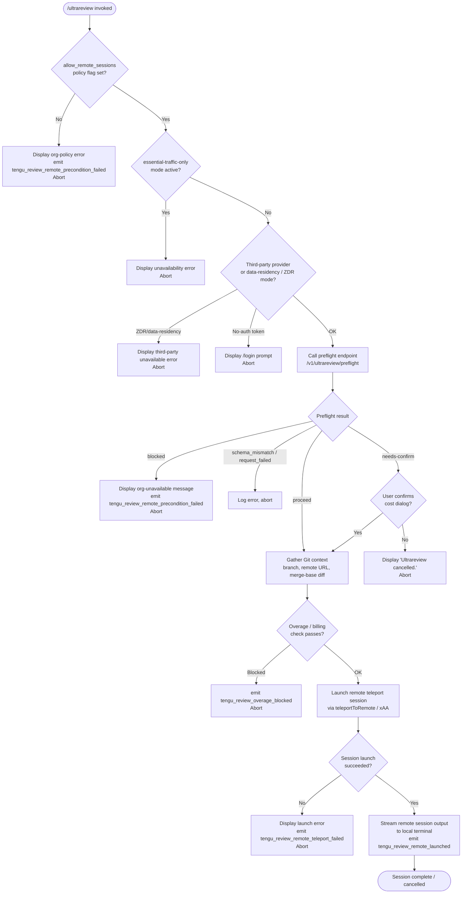

# `/ultrareview`

> Analysis basis: CC v2.1.161 bundle.js (AST extraction + Claude interpretation)
> Minimum version: v2.1.161

---

## Overview

`/ultrareview` is a deep bug-hunting slash command that acts as an alias for `/code-review ultra`. It offloads the review workload to a remote Claude Code web session, running a thorough, verified code analysis on the current Git branch. Because execution occurs in the cloud, the command requires a Claude.ai OAuth account, an active GitHub remote, and organizational policy approval before it can proceed.

---

## Registration

| Field | Value |
|---|---|
| type | `local-jsx` |
| name | `ultrareview` |
| description | `"Alias of /code-review ultra · … · Est. cost … USD · Finds and verifies bugs in your branch. Runs in Claude Code on the web. See …"` |
| loc_byte | `12109843` |
| loc_byte_end | `12110134` |
| loc_line | `8349` |
| module_id | `oi1` |
| load_inline | `true` |
| arbor_handler.name | `GEf` |
| arbor_handler.fqn | `claude-2.1.161::GEf` |
| arbor_handler.kind | `AsyncFunction` |
| arbor_handler.resolution_path | `module_id` |
| arbor_handler.n_hits | `1` |

Analysis basis: CC v2.1.161 bundle.js:+12109843

---

## Input Branching

The command follows more than three distinct paths based on policy checks, authentication state, and interactive confirmation. A Mermaid flowchart is used.



---

## Behavioral Spec

### 1. Handler Entry — Remote-Sessions Policy Gate

The async handler `GEf` is the first code to execute after the command is invoked.

```
async function ultrareviewHandler(context):
    if not context.appState["allow_remote_sessions"]:
        displayError("Remote sessions are disabled by your organization's policy. ...")
        emit telemetry("tengu_review_remote_precondition_failed")
        return
    proceed to preflight checks
```

Analysis basis: CC v2.1.161 bundle.js:+12107501 (`"allow_remote_sessions"` literal) and +12107535 (org-policy error string).

---

### 2. Preflight Checks — Auth, Traffic Mode, Provider

Before calling the server, the handler verifies local conditions via `checkPreconditions` (mapped to `Ri1` → `zh8`).

```
function checkPreconditions(appState):
    trafficMode = getTrafficMode(appState)    // checks "essential-traffic-only"
    if trafficMode == "essential-traffic-only":
        return { kind: "error", message: UNAVAILABLE_ESSENTIAL_TRAFFIC }
    provider = getProvider(appState)
    if provider is "zdr" or "data-residency":
        return { kind: "error", message: UNAVAILABLE_THIRD_PARTY }
    if not hasOAuthToken(appState):           // "no-auth" path
        return { kind: "error", message: REQUIRES_CLAUDE_AI_ACCOUNT }
    return { kind: "ok" }
```

Key error strings (not quoted verbatim):
- Essential-traffic unavailability message (bundle.js:+12068756)
- Third-party provider unavailability message (bundle.js:+12068903)
- `/login` prompt message (bundle.js:+12069036)

Telemetry codes observed in this stage:
- `tengu_review_remote_precondition_failed` (bundle.js:+12070289)

Analysis basis: CC v2.1.161 bundle.js:+12070150 (`zh8` entry), +12068720 (`"essential-traffic-only"`), +12068875 (`"data-residency"`), +12068864 (`"zdr"`), +12069015 (`"no-auth"`).

---

### 3. Server Preflight — `/v1/ultrareview/preflight`

If local checks pass, the handler calls the remote preflight endpoint via `fetchBughunterConfig` (mapped to `yi1`).

```
async function fetchBughunterConfig(appState):
    emit telemetry("tengu_review_bughunter_config")
    response = await httpGet("/v1/ultrareview/preflight",
                             headers: { "teleport-org": orgUUID })
    if response fails schema validation:
        emit telemetry("api_ultrareview_preflight", { result: "schema_mismatch" })
        return error
    if response.status == "blocked":
        return { kind: "blocked", message: UNAVAILABLE_FOR_ORG }
    if response.status == "needs-confirm":
        return { kind: "needs-confirm", confirmData: response.data }
    if response.status == "proceed":
        return { kind: "proceed" }
```

Analysis basis: CC v2.1.161 bundle.js:+12068626 (`"/v1/ultrareview/preflight"`), +12068660 (`"teleport-org"` header), +12068402 (`"blocked"`), +12073301 (`"needs-confirm"`), +12072921 (`"proceed"`), +12069247 (`"api_ultrareview_preflight"` telemetry), +12069275 (`"schema_mismatch"`), +12069436 (`"request_failed"`).

---

### 4. Cost Confirmation Dialog

When the preflight response is `"needs-confirm"`, a JSX confirmation dialog is shown with estimated cost information.

```
function showConfirmDialog(confirmData):
    // Description shown to user references cost range "$10-$20"
    // and estimated duration "~10–20 min"
    userChoice = await promptUser(confirmData)
    if userChoice != "confirm":
        displayMessage("Ultrareview cancelled.")
        return CANCEL
    emit telemetry("tengu_review_overage_dialog_shown")
    return PROCEED
```

Analysis basis: CC v2.1.161 bundle.js:+12068091 (`"$10-$20"`), +12068183 (`"~10–20 min"`), +12073234 (`"confirm"`), +12108477 (`"Ultrareview cancelled."`), +12108170 (`tengu_review_overage_dialog_shown`).

---

### 5. Git Context Gathering

Once cleared to proceed, the handler collects Git metadata needed by the remote session via `buildReviewContext` (mapped to `CAA`).

```
async function buildReviewContext(appState):
    repoRoot   = git("rev-parse", "--show-toplevel")
    remoteUrl  = git("config", "--get", "remote.origin.url")
                 // redacts credentials: replaces "://***@" pattern
    defaultBranch = git("symbolic-ref", "--short", "refs/remotes/origin/HEAD")
                 // fallbacks: "main", then "master"
    currentBranch = git("branch", "--abbrev-ref", "HEAD")
    mergeBase  = git("merge-base", defaultBranch, currentBranch)
    diffStats  = git("diff", "--shortstat", mergeBase)
    if remoteUrl is absent:
        abort with "No git remote URL found"
    return { remoteUrl, defaultBranch, currentBranch, mergeBase, diffStats }
```

Analysis basis: CC v2.1.161 bundle.js:+12071998 (`"merge-base"`), +12072505 (`"diff"`), +12072512 (`"--shortstat"`), +1065747 (`"remote.origin.url"`), +1074991 (`"refs/remotes/origin/HEAD"`), +1075104 (`"main"`), +1075111 (`"master"`), +1065876 (`"No git remote URL found"`).

---

### 6. Overage / Billing Gate

After context is assembled but before teleport launch, the handler checks whether the account is over its usage limit via `checkOverage` (mapped to `bAA` → `yi1`).

```
function checkOverage(appState):
    if isOverBillingLimit(appState):
        emit telemetry("tengu_review_overage_blocked")
        displayError(...)
        return BLOCKED
    return OK
```

Analysis basis: CC v2.1.161 bundle.js:+12107833 (`tengu_review_overage_blocked`), +12107831.

---

### 7. Remote Session Launch — `teleportToRemote`

The core launch path is handled by `launchRemoteSession` (mapped to `xAA`), which orchestrates the full teleport flow.

```
async function launchRemoteSession(reviewContext, options):
    // 7a. Git bundle upload
    bundleResult = await uploadGitBundle(reviewContext)
    //     - Runs: git stash create, git bundle (head / squashed / fallback variants)
    //     - Emits: tengu_ccr_bundle_upload, tengu_teleport_bundle_mode
    //     - Size limit: 5,000,000 bytes (bundle.js:+8920595); count-objects threshold
    //       checked via tengu_ccr_bundle_max_bytes (bundle.js:+8920069)
    //     - Seed-bundle path: tengu_ccr_bundle_seed_enabled (bundle.js:+9007943)

    // 7b. Environment / cloud environment resolution
    envList = await listTeleportEnvironments()  // teleport_environments_list telemetry
    if envList is empty:
        autoCreateEnv = await createDefaultCloudEnv()
        //   On failure: warn "Could not create a cloud environment. Set one up at
        //               https://claude.ai/code/onboarding?magic=env-setup"
        //   Emits: env_create
    env = selectEnv(envList)

    // 7c. Remote session creation
    sessionPayload = buildSessionPayload(reviewContext, env, options)
    //   payload type = "ultrareview" (bundle.js:+12075025)
    //   URL path     = "/ultrareview"  (bundle.js:+12075957)
    response = await postRemoteSession(sessionPayload)
    if response indicates policy block:
        return POLICY_BLOCKED
    if response indicates no GitHub app:
        return GITHUB_APP_NOT_INSTALLED
    sessionId = response.sessionId

    // 7d. Result streaming / polling
    streamResult = await streamRemoteSessionOutput(sessionId)
    //   Polls session state: starting → running → completed / archived
    //   Timeout: 1,800,000 ms (30 minutes) (bundle.js:+9016399)
    //   On timeout: error "remote session exceeded 30 minutes" (+9019041)
    //   On empty result: "no review output — orchestrator may have exited early" (+9019078)

    // 7e. --fix mode post-processing
    if options.fix:
        applyFindingsToWorkingTree(streamResult)
        // described as: "when the findings arrive, apply them to the local working tree"

    emit telemetry("tengu_review_remote_launched")
    return streamResult
```

On failure to launch: displays `"Ultrareview failed to launch the remote session. Check that this is a GitHub repo and try again."` and emits `tengu_review_remote_teleport_failed`.

Analysis basis: CC v2.1.161 bundle.js:+12073519 (`hXH` entry), +9007873 (`XM1` entry), +12107236 (`--fix` instruction string), +12107348 (launch-failure message), +12075785 (`tengu_review_remote_teleport_failed`), +12076308 (`tengu_review_remote_launched`), +9016399 (30-minute timeout value), +8920595 (5 MB bundle size limit).

---

### 8. GitHub App & Provider Checks (within teleportToRemote)

Several eligibility sub-checks run during step 7b/7c:

```
function checkGithubAppInstalled(appState):
    if no accessToken:
        log "checkGithubAppInstalled: No access token found, assuming app not installed"
        return false
    if no orgUUID:
        log "checkGithubAppInstalled: No org UUID found, assuming app not installed"
        return false
    response = httpGet("/github-app/check")
    return response.status is installed

function checkRemoteSessionProvider(appState):
    if provider != "firstParty":
        error "Remote sessions are only available on the first-party Anthropic API provider."
    if no accessToken:
        error "No access token found for remote session creation"
    if no orgUUID:
        error "Unable to get organization UUID for remote session creation"
```

Analysis basis: CC v2.1.161 bundle.js:+8891983 (no-token log), +8892096 (no-org-uuid log), +8937763 (first-party error), +8937889 (no-token error), +8938199 (no-org-uuid error), +4155129 (`"firstParty"` literal).

---

## State & Side Effects

| Item | Detail |
|---|---|
| Telemetry — `tengu_review_bughunter_config` | Fired on every preflight API call (bundle.js:+12067974) |
| Telemetry — `tengu_review_remote_precondition_failed` | Fired when org policy or local checks block launch (bundle.js:+12070289) |
| Telemetry — `tengu_review_overage_blocked` | Fired when billing overage gate blocks the session (bundle.js:+12107833) |
| Telemetry — `tengu_review_overage_dialog_shown` | Fired when cost-confirmation dialog is displayed (bundle.js:+12108170) |
| Telemetry — `tengu_review_remote_launched` | Fired on successful remote session start (bundle.js:+12076308) |
| Telemetry — `tengu_review_remote_teleport_failed` | Fired when teleport session creation fails (bundle.js:+12075785) |
| Telemetry — `tengu_ccr_bundle_upload` | Fired during git bundle upload step (bundle.js:+8923446) |
| Telemetry — `tengu_ccr_bundle_max_bytes` | Fired when repository exceeds bundle size limit (bundle.js:+8920069) |
| Telemetry — `tengu_ccr_bundle_seed_enabled` | Fired when seed-bundle path is taken (bundle.js:+9007943) |
| Telemetry — `tengu_teleport_bundle_mode` | Records which bundle strategy was selected (bundle.js:+8938942) |
| Telemetry — `tengu_teleport_source_decision` | Records source-selection decision (bundle.js:+8944160) |
| Telemetry — `tengu_ccr_session_link` | Records remote session link (bundle.js:+8933230) |
| Telemetry — `tengu_feature_ok` / `tengu_feature_sad` | General feature-success / failure signals (bundle.js:+966587, +966732) |
| Telemetry — `tengu_daemon_config_reload` | Config-reload side-effect from supervisor path (bundle.js:+15918997) |
| appState reads | `allow_remote_sessions`, OAuth token, org UUID, provider type, traffic mode |
| Filesystem | Temporary git bundle files written and cleaned up (`*.bundle`, `_source_seed.bundle`); git stash created and removed (bundle.js:+8924460, +8924752, +8925393) |
| Network | POST to `/v1/ultrareview/preflight`; POST to remote session creation endpoint; GET environment list; optional GitHub-app check |
| Sound | <!-- TODO: not found in depth-2 traversal; needs --depth 4 --> |
| Hook registration | `tYA.register` called during log-file setup path (bundle.js:+59405) |

---

## Version History

| Version | Change |
|---|---|
| v2.1.161 | Initial analysis — `ultrareview` command introduced as alias of `/code-review ultra`; remote teleport flow, preflight API, cost-confirmation dialog, `--fix` post-processing |

---

## Common Mistakes

1. **Using an API key instead of a Claude.ai OAuth account.** The command explicitly requires OAuth authentication; running with only `ANTHROPIC_API_KEY` set will fail at the auth gate with a `/login` prompt (bundle.js:+12069036).
2. **No GitHub remote configured.** The teleport session requires a `remote.origin.url`. Repositories with no GitHub remote will fail with `"Background tasks require a GitHub remote…"` (bundle.js:+9010062).
3. **Organization policy blocking remote sessions.** The `allow_remote_sessions` flag must be enabled by an admin. Users cannot override this themselves (bundle.js:+12107501).
4. **Essential-traffic-only network mode.** Corporate networks configured for `essential-traffic-only` mode will block all ultrareview calls (bundle.js:+12068720).
5. **Repository exceeds bundle size limit.** Repositories whose git object count produces a bundle larger than 5,000,000 bytes may hit the size ceiling; the `tengu_ccr_bundle_max_bytes` event fires in this case (bundle.js:+8920595).
6. **No commits in repository.** An empty repository (no commits yet) will error with `"Repository has no commits — run git add . && git commit…"` (bundle.js:+8943597).
7. **Third-party or ZDR provider.** Ultrareview only works on the first-party Anthropic API. Using a Bedrock, Vertex, or data-residency provider will be rejected (bundle.js:+12068875, +8937763).

---

## Appendix — Identifier Mapping

> For bundle debugging only. Identifiers change across versions.

| Identifier | Role |
|---|---|
| `GEf` | Main async handler for `/ultrareview` (Arbor-resolved entry point) |
| `G9` | Git-context / precondition orchestrator |
| `I19` | Inner precondition check dispatcher |
| `_J6` | Precondition evaluation helper |
| `qC` | Provider / policy flag reader |
| `HJ6` | File-read utility (uses `readFileSync`, UTF-8) |
| `kLH` | Permission / policy membership checker |
| `r9` | Token / credential fetcher |
| `qkA` | OAuth token resolution |
| `pH` | Generic string formatter / output helper |
| `Z4H` | Alternate string formatter |
| `H` | Bootstrap fetch / HTTP utility |
| `N` | HTTP response handler / header builder |
| `VBK` | Request construction helper |
| `HwA` | Content-type negotiation helper |
| `SH` | JSON serialization wrapper |
| `Z4` | URL / path builder |
| `CJA` | Path segment mapper |
| `imH` | Stream write helper |
| `GJA` | Raw write wrapper |
| `IBK` | Log / output file writer |
| `WmH` | Debounced output flusher |
| `_3H` | Log-line assembler |
| `F6` | Directory resolver |
| `d46` | Error-code handler |
| `BJA` | Path join helper |
| `UJA` | File rename/unlink helper |
| `NBK` | Append-and-rotate file writer |
| `Y9` | Hook registrar |
| `ne` | Auth-state checker |
| `Ij` | String sanitizer / replacer |
| `lq` | Markdown / diff parser |
| `xHH` | Diff section parser |
| `nQ` | Diff hunk processor |
| `s9` | Model / provider name normalizer |
| `x0` | Model alias resolver |
| `NKH` | Provider include-list checker |
| `aN` | Model capability resolver |
| `CgH` | Capability flag resolver |
| `KG` | Provider route resolver |
| `Xwq` | Route wrapper |
| `UM` | Provider-type mapper |
| `Us6` | Allow-list checker |
| `bgH` | String pad/format helper |
| `xP` | Diff-line tokenizer |
| `b0` | Token-level diff reducer |
| `t6` | Timing / retry scheduler |
| `d` | Generic delay / timer |
| `h1H` | Retry-with-backoff helper |
| `Xa8` | Backoff interval calculator |
| `Ri1` | Local precondition checker (essential-traffic, ZDR, auth) |
| `zh8` | Precondition string parser / classifier |
| `ZN` | Credential-redaction helper |
| `CAA` | Git context builder (remote URL, branch, merge-base, diff) |
| `wE8` | Git working-tree detector |
| `h6` | Git async-store context accessor |
| `sg6` | AsyncLocalStorage store getter |
| `P_` | External-process spawner |
| `h_` | Git command runner |
| `QGH` | Git command executor (core) |
| `Y` | Process-exit / abort controller |
| `kf4` | Git output string converter |
| `S$` | Git stderr handler |
| `v8` | Error class constructor |
| `yH` | Error logger / reporter |
| `PR` | Remote-URL fetcher (`git config --get remote.origin.url`) |
| `$x` | Remote-URL cache getter |
| `ps8` | Repository metadata cache lookup |
| `tUH` | Credential-masking replacer |
| `AHH` | Remote-URL parser (scheme, host, path) |
| `bSA` | GitHub URL component extractor |
| `eq` | URL segment slicer |
| `m51` | Git object-count checker (bundle size guard) |
| `u51` | `git count-objects -v` runner |
| `x51` | Repository teleport eligibility dispatcher |
| `j6` | Remote-session eligibility resolver |
| `b8` | Git in-repo verifier |
| `D` | Supervisor / daemon config writer |
| `BWH` | Config file serializer |
| `$1` | Config store accessor |
| `MKA` | Config field mapper |
| `TH` | String cast utility |
| `H9K` | Config diff printer |
| `G` | Keyboard / input event handler |
| `m0` | User-settings accessor |
| `USK` | Heartbeat scheduler |
| `h6H` | Heartbeat tick handler |
| `SN` | Default-branch resolver (`refs/remotes/origin/HEAD`) |
| `Us8` | Default-branch cache reader |
| `zw` | Current-branch resolver (`git branch --abbrev-ref HEAD`) |
| `us8` | Current-branch cache reader |
| `bAA` | Overage / billing check + launch orchestrator |
| `yi1` | Preflight API caller (`/v1/ultrareview/preflight`) |
| `m6` | JSON parse wrapper |
| `hAA` | Preflight response classifier |
| `hH` | Result renderer / display helper |
| `vbH` | Session config builder |
| `iA6` | Remote session object factory |
| `E66` | Model / subscription type resolver |
| `UT` | Subscription tier accessor |
| `uDH` | Provider-chain resolver |
| `zL` | Provider selector |
| `KD` | API-key / credential resolver |
| `y6` | Session context factory |
| `wA` | Provider route builder |
| `SR` | Array content-type checker |
| `ky` | Subscription role checker |
| `a9` | Role-set resolver |
| `Vt` | Session-object initializer |
| `EEf` | Remote-session streaming controller |
| `xAA` | `teleportToRemote` — full remote launch orchestrator |
| `hXH` | Background-session entry coordinator |
| `XM1` | Remote-session eligibility pre-check (policy, login, byoc, git) |
| `H5H` | Session progress renderer |
| `Ii1` | Session result renderer |
| `ul` | Remote session creator / uploader / poller |
| `pM` | Provider capability checker |
| `T3` | Request deduplicator |
| `FQ_` | API request builder |
| `Gx` | API response handler |
| `Rq` | OAuth environment resolver |
| `Cj` | Anthropic API version header builder |
| `uQ_` | Git bundle uploader (`teleport_git_bundle_upload`) |
| `N6` | External process spawner (low-level) |
| `T8` | Async retry wrapper |
| `U51` | Session-event push helper |
| `zV6` | Session metadata formatter |
| `p51` | Session-link logger (`tengu_ccr_session_link`) |
| `DE8` | Session-state decoder |
| `ks` | Environment list fetcher (`teleport_environments_list`) |
| `dH6` | Default cloud environment creator (`teleport_default_environment_create`) |
| `zB7` | Remote task title generator (`teleport_generate_title`) |
| `iy` | Background-task session poller |
| `vSH` | GitHub-app installation checker |
| `o` | MCP / pending-update applier |
| `a_` | Error string extractor |
| `zz` | Cancel-error detector |
| `rz` | Generic error classifier |
| `mSH` | Remote session output streamer (`remote_agent`) |
| `Hk` | Random session token generator |
| `mH6` | Browser/web URL opener |
| `p2` | Session polling heartbeat |
| `dB7` | Session-state message formatter |
| `TM1` | Session event-loop / result collector |
| `SXH` | CLI output renderer for streaming session |
| `uw` | Terminal writer |
| `WEf` | Map-over-messages helper |
| `RAA` | Post-launch cleanup / final-result handler |