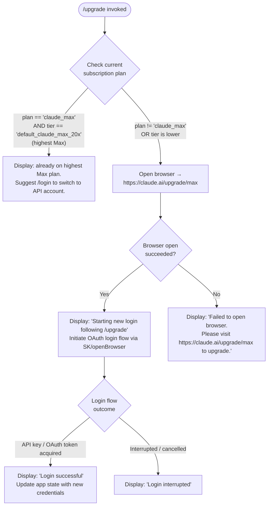

# `/upgrade`

> Analysis basis: CC v2.1.161 bundle.js (AST extraction + Claude interpretation)
> Minimum version: v2.1.161

---

## Overview

The `/upgrade` command guides users through upgrading their Claude subscription to the **Max** plan, which offers higher rate limits and increased access to Opus models. It checks the current subscription tier, and if the user is not already on the highest Max plan, opens `https://claude.ai/upgrade/max` in the system browser and then initiates a fresh login flow to bind the upgraded account. If the user is already on the top-tier Max plan, it displays an informational message instead.

---

## Registration

| Field | Value |
|---|---|
| type | `local-jsx` |
| name | `upgrade` |
| description | `Upgrade to Max for higher rate limits and more Opus` |
| loc_byte | `12559507` |
| loc_byte_end | `12559754` |
| loc_line | `8788` |
| module_id | `a9A` |
| load_inline | `true` |
| arbor_handler.name | `Ch6` |
| arbor_handler.fqn | `claude-2.1.161::Ch6` |
| arbor_handler.kind | `AsyncFunction` |
| arbor_handler.resolution_path | `module_id` |
| arbor_handler.n_hits | `0` |

Analysis basis: CC v2.1.161 bundle.js:+12559507

---

## Input Branching

The command produces four distinct runtime paths based on subscription state and whether the browser/login flow succeeds or fails. A Mermaid flowchart is therefore required.



Analysis basis: CC v2.1.161 bundle.js:+12558638, +12558663, +12558782, +12558868, +12559033, +12559036, +12559069, +12559108, +12559204, +12559227, +12559246, +12559300

---

## Behavioral Spec

### 1. Subscription-Tier Gate

Before attempting any browser or login action, the handler inspects the active account profile to determine the current subscription plan.

```
async function upgradeCommandHandler(appContext):
    currentPlan = getAuthProfile(appContext)   // calls wA → KD → Sj
    planName    = currentPlan.planId           // e.g. "max", "claude_max"
    planTier    = currentPlan.tier             // e.g. "default_claude_max_20x"

    if planName == "claude_max" AND planTier == "default_claude_max_20x":
        // User is already on the top-tier Max plan
        displayMessage(
            "You are already on the highest Max subscription plan. " +
            "For additional usage, run /login to switch to an API usage-billed account."
        )
        return   // exit early; no browser opened
```

- Plan identifier `"max"` is checked at CC v2.1.161 bundle.js:+12558638.
- Tier string `"default_claude_max_20x"` is checked at CC v2.1.161 bundle.js:+12558663.
- Already-on-highest-plan message literal at CC v2.1.161 bundle.js:+12558883.

### 2. OAuth Profile Fetch (`getOAuthProfile`)

When the subscription check does not gate the user, the handler first fetches the OAuth profile to understand the current auth context. This is performed via the `GzH` function (see Appendix).

```
async function fetchOAuthProfile(authToken):
    response = httpPost(
        endpoint   = oauthProfileEndpoint,   // resolved via Rq
        headers    = { "Content-Type": "application/json" },
        timeout    = 10000                   // ms
    )

    emit telemetry "oauth_profile_fetch" on success
    emit telemetry "oauth_profile_token_failed" on auth error

    if response.status in [401, 403, 429]:
        log error
        return null

    return profileData
```

- `Content-Type: application/json` header at CC v2.1.161 bundle.js:+12558552 (via GzH → +2096408).
- Timeout 10 000 ms at CC v2.1.161 bundle.js:+2096451.
- Telemetry event `oauth_profile_fetch` at CC v2.1.161 bundle.js:+2096467.
- Telemetry event `oauth_profile_token_failed` at CC v2.1.161 bundle.js:+2096534.
- HTTP status codes 401, 403, 429 at CC v2.1.161 bundle.js:+175366, +175375, +175384.

### 3. Browser Launch & URL Opening (`openBrowserURL`)

The `SK` function (see Appendix) is responsible for opening the upgrade URL in the platform's default browser.

```
async function openBrowserURL(url):
    // Validate URL scheme
    if NOT (url.startsWith("http:") OR url.startsWith("https:")):
        throw Error("Invalid URL scheme")

    platform = process.platform
    if platform == "darwin":
        spawn("open", [url])
    else if platform == "win32":
        spawn("rundll32", ["url,OpenURL", url])
    else:
        spawn("xdg-open", [url])   // Linux / other POSIX

    return true on success, false on spawn failure
```

- Upgrade URL `"https://claude.ai/upgrade/max"` at CC v2.1.161 bundle.js:+12559036.
- URL scheme guards `"http:"` / `"https:"` at CC v2.1.161 bundle.js:+6763739, +6763761.
- `"darwin"` / `"win32"` platform strings at CC v2.1.161 bundle.js:+6764048, +6764064.
- `"rundll32"` / `"url,OpenURL"` / `"open"` / `"xdg-open"` at CC v2.1.161 bundle.js:+6764148, +6764160, +6764222, +6764229.

### 4. Post-Browser Login Flow

If the browser opens successfully, the command displays an informational banner and immediately triggers a new login/OAuth flow via the `yH` function (see Appendix), reusing the same OAuth infrastructure used by `/login`.

```
async function runPostUpgradeLogin(appContext):
    display("Starting new login following /upgrade. Exit with Ctrl-C to use existing account.")

    setTimeout(openBrowserURL, delay)   // small delay to allow upgrade page to load

    result = await oauthLoginFlow(appContext)   // calls SK → b8 → h_ → QGH ...

    onAPIKeyChange = appContext.onChangeAPIKey

    if result.success:
        display("Login successful")
        applyNewCredentials(appContext, result.credentials)
    else if result.interrupted:
        display("Login interrupted")
```

- Banner message at CC v2.1.161 bundle.js:+12559108.
- `setTimeout` call (delay before browser open) at CC v2.1.161 bundle.js:+12558868.
- `onChangeAPIKey` callback invoked at CC v2.1.161 bundle.js:+12559204.
- `"Login successful"` literal at CC v2.1.161 bundle.js:+12559227.
- `"Login interrupted"` literal at CC v2.1.161 bundle.js:+12559246.
- `yH` (OAuth/login flow helper) called at CC v2.1.161 bundle.js:+12559279.

### 5. Browser-Open Failure Path

If `openBrowserURL` returns false or throws, the command falls back to a text message instructing the user to visit the URL manually.

```
function handleBrowserOpenFailure():
    display(
        "Failed to open browser. " +
        "Please visit https://claude.ai/upgrade/max to upgrade."
    )
    return   // no login flow is started
```

- Failure message at CC v2.1.161 bundle.js:+12559300.

### 6. Auth Environment Detection

The profile-fetch and credential-apply logic discriminates among several auth provider environments: `"bedrock"`, `"foundry"`, `"anthropicAws"`, `"mantle"`, `"vertex"`, and `"firstParty"`.

```
function detectAuthProvider(profile):
    provider = profile.authKind
    switch provider:
        case "bedrock":      ...
        case "foundry":      ...
        case "anthropicAws": ...
        case "mantle":       ...
        case "vertex":       ...
        case "firstParty":   ...
    return provider
```

- Provider strings at CC v2.1.161 bundle.js:+2049937, +2049987, +2050043, +2050097, +2050145, +2050154.

### 7. Credential Validation

When credentials are applied after login, the system validates that at least one of the required auth mechanisms is present.

```
function validateCredentials(env):
    if NOT (
        env.ANTHROPIC_API_KEY OR
        env.ANTHROPIC_AUTH_TOKEN OR
        env.CLAUDE_CODE_OAUTH_TOKEN OR
        workloadIdentityFederationVarsPresent(env)
    ):
        throw Error(
            "ANTHROPIC_API_KEY, ANTHROPIC_AUTH_TOKEN, CLAUDE_CODE_OAUTH_TOKEN, " +
            "or WIF env vars (ANTHROPIC_FEDERATION_RULE_ID + ANTHROPIC_ORGANIZATION_ID) required"
        )
```

- Error message literal at CC v2.1.161 bundle.js:+2991993.
- `"ANTHROPIC_API_KEY"` constant at CC v2.1.161 bundle.js:+2991530.
- `"CLAUDE_CODE_OAUTH_TOKEN_FILE_DESCRIPTOR"` at CC v2.1.161 bundle.js:+2111869.
- `"CLAUDE_CODE_API_KEY_FILE_DESCRIPTOR"` at CC v2.1.161 bundle.js:+2112012.

### 8. JSX Rendering

The registration type is `local-jsx`, meaning the command returns a React element (via `o9A.createElement`) for inline rendering in the terminal UI, rather than printing plain text directly.

- `o9A.createElement` call at CC v2.1.161 bundle.js:+12559069.

---

## State & Side Effects

| Item | Detail |
|---|---|
| Telemetry — `tengu_feature_ok` | Fired on successful feature invocation (e.g., profile fetch OK) at CC v2.1.161 bundle.js:+966587 |
| Telemetry — `tengu_feature_sad` | Fired on feature failure path (e.g., profile fetch error) at CC v2.1.161 bundle.js:+966732 |
| Telemetry — `oauth_profile_fetch` | Fired after a successful OAuth profile HTTP fetch at CC v2.1.161 bundle.js:+2096467 |
| Telemetry — `oauth_profile_token_failed` | Fired when the OAuth profile fetch returns an auth error at CC v2.1.161 bundle.js:+2096534 |
| Browser side effect | Opens `https://claude.ai/upgrade/max` in the system default browser via platform-specific spawn |
| `onChangeAPIKey` callback | Invoked after successful login to propagate new API key/OAuth token into app state at CC v2.1.161 bundle.js:+12559204 |
| appState credential update | New API key or OAuth token written into app context after successful login; validated against known auth-provider environments |
| Log / error output | `ri.logError` called on OAuth fetch failure; errors surfaced to terminal UI |
| Hook registration | `tYA.register` called via `Y9` (IBK subtree) — likely registers a cleanup or lifecycle hook at CC v2.1.161 bundle.js:+59405 |
| File I/O | `Ay.appendFile`, `Ay.mkdir`, `Ay.rename`, `Ay.unlink` called in credential-persistence path (NBK / UJA subtree) |
| setTimeout | Used to introduce a brief delay before launching the browser at CC v2.1.161 bundle.js:+12558868 |

---

## Version History

| Version | Change |
|---|---|
| v2.1.161 | Initial analysis |

---

## Common Mistakes

1. **Running `/upgrade` when already on the top-tier Max plan** — The command detects `"claude_max"` + `"default_claude_max_20x"` and exits with an informational message instead of opening a browser. Use `/login` if you want to switch to an API-billed account.

2. **Expecting `/upgrade` to work in non-browser environments** — The command relies on spawning a platform browser process (`open`, `xdg-open`, `rundll32`). In headless or containerised environments no browser can be launched; the failure-path message will display and no login flow will start.

3. **Interrupting the login flow after the browser opens** — The OAuth login sequence begins immediately after the browser is launched. Pressing Ctrl-C cancels the login and leaves credentials unchanged; the subscription upgrade on `claude.ai` itself is not rolled back.

4. **Assuming the command updates credentials instantly** — The new subscription credentials are only applied after the OAuth login flow completes. Until that point the old credentials remain active.

5. **Mixing API-key and OAuth environments** — After `/upgrade`, the `onChangeAPIKey` callback propagates the new token. If the environment also has `ANTHROPIC_API_KEY` set, credential validation requires at least one valid auth mechanism; having an expired or mismatched API key alongside the new OAuth token can cause validation errors.

---

## Appendix — Identifier Mapping

> For bundle debugging only. Identifiers change across versions.

| Identifier | Role |
|---|---|
| `Ch6` | Main async handler for `/upgrade` command (arbor_handler) |
| `wA` | Auth-profile retrieval entry point; called by Ch6 to get current subscription info |
| `KD` | Auth context resolver; dispatches to profile fetch and credential pipelines |
| `eK` | Low-level environment/config reader |
| `pH` | String / primitive utility (used throughout pipeline) |
| `Sj` | Subscription-profile builder / normaliser |
| `Ya6` | Auth-plan helper called from Sj |
| `TdH` | Token/header builder used by Sj and dD6 |
| `Wr` | Credential wrapper; calls da4 and yfq |
| `yV` | Flag-settings resolver (reads `"flagSettings"` key) |
| `SR` | Array inclusion checker (uses `Array.isArray` + `.includes`) |
| `pM` | Auth-provider discriminator (bedrock / foundry / mantle / vertex / firstParty) |
| `PA` | Provider-specific auth helper |
| `jj` | Misc utility called from KD and e3 |
| `e3` | Credential-validation and environment-variable resolver |
| `gD6` | Helper called from e3 credential path |
| `DmH` | VS Code environment detector (checks `"claude-vscode"`) |
| `e$6` | OAuth token file-descriptor helper |
| `y6` | Telemetry / timing helper (uses `Date.now`) |
| `RR` | Array slicer (last-20-items trim) |
| `dD6` | Token-decoration helper; calls TdH |
| `GzH` | OAuth profile HTTP fetch orchestrator |
| `Rq` | OAuth URL builder / validator |
| `rNA` | OAuth URL component helper |
| `QK4` | OAuth URL component helper |
| `hH` | Profile-fetch helper (calls d and h1H) |
| `d` | Low-level fetch / HTTP primitive |
| `h1H` | HTTP response handler |
| `Xa8` | HTTP response parser |
| `t6` | Alternative profile-fetch helper |
| `rz` | Error-classification helper in GzH |
| `N` | Bootstrap / config fetch orchestrator |
| `VBK` | Config normaliser |
| `HwA` | Config merge helper |
| `H` | Global bootstrap fetch (fetches remote config, emits `api_bootstrap_fetch`) |
| `s$` | Bootstrap sub-helper |
| `ne` | Feature-flag gate (uses `WA4.has`) |
| `Ij` | String replacer utility |
| `lq` | Bootstrap config parser (calls xHH, s9, xP) |
| `SH` | JSON serialiser wrapper |
| `Z4` | Path / string normaliser |
| `CJA` | Path-map builder |
| `q` | File unlink helper |
| `A` | Filename lowercaser |
| `imH` | File-write helper (calls GJA) |
| `GJA` | Raw write wrapper |
| `IBK` | Credential-persistence orchestrator (append, mkdir, rename, unlink) |
| `WmH` | Write-queue / debounce manager (clearTimeout / setTimeout / setImmediate) |
| `_3H` | Queue-flush helper |
| `F6` | Filesystem path resolver |
| `d46` | Low-level file-read helper |
| `BJA` | Path-join helper for credential files |
| `UJA` | Atomic-rename helper (stat → rename → unlink) |
| `NBK` | Credential file writer (mkdir + appendFile + rename) |
| `Y9` | Lifecycle hook registrar (`tYA.register`) |
| `yH` | OAuth / login flow runner (used in /login and post-/upgrade login) |
| `a_` | Error-string normaliser |
| `r9` | Login-flow sub-step |
| `qkA` | Login request builder |
| `s44` | Login-queue manager (shift / push) |
| `SK` | Browser-open orchestrator (validates URL, platform-dispatches spawn) |
| `k57` | URL-scheme validator |
| `RD` | Platform-detection helper |
| `b8` | High-level login runner (calls h_ and h6) |
| `h_` | Login-session manager (calls QGH, Y, kf4, N, v8, yH) |
| `QGH` | OAuth login-flow core (OSA, Ts8, Zs8, vs8, XhA, etc.) |
| `Y` | Process-exit / abort handler (`process.exit`, `z.abort`) |
| `kf4` | String-conversion utility in login session |
| `S$` | Session state helper |
| `v8` | Config-read utility |
| `h6` | Async-local-storage context reader (calls sg6 and P_) |
| `sg6` | Store-getter (calls `ag6.getStore`) |
| `P_` | Context builder (calls XN) |

---

Note: index built via Arbor fallback; some signals (telemetry, literals) may be missing — see arbor-fallback.js.