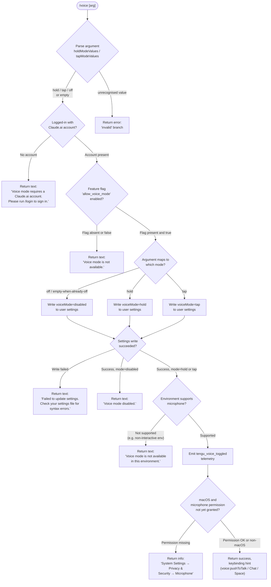

# `/voice`

> Analysis basis: CC v2.1.161 bundle.js (AST extraction + Claude interpretation)
> Minimum version: v2.1.161

---

## Overview

The `/voice` command toggles voice mode in Claude Code, allowing users to choose between hold-to-talk, tap-to-talk, or fully disabled voice interaction. It enforces account and environment eligibility checks before applying the desired mode, and on success updates persistent user settings and fires a telemetry event.

---

## Registration

| Field | Value |
|---|---|
| type | `local` |
| name | `voice` |
| description | `Toggle voice mode` |
| argumentHint | `[hold\|tap\|off]` |
| supportsNonInteractive | `false` |
| isHidden | `null` |
| module_id | `b9K` |
| load_inline | `true` |
| loc_byte | `12828175` |
| loc_byte_end | `12828417` |
| loc_line | `9321` |
| arbor_handler.name | `HSf` |
| arbor_handler.kind | `AsyncFunction` |
| arbor_handler.fqn | `claude-2.1.161::HSf` |
| arbor_handler.resolution_path | `module_id` |
| arbor_handler.n_hits | `1` |

Analysis basis: CC v2.1.161 bundle.js:+12828175

---

## Input Branching

Six or more distinct branches are present (valid sub-modes, two early-exit eligibility failures, settings-write failure, environment restriction, and the disable path), so a flowchart is mandatory.



Analysis basis: CC v2.1.161 bundle.js:+12825546 – +12827897

---

## Behavioral Spec

### 1. Argument Parsing (`parseVoiceArgument`)

The handler `HSf` begins by trimming the raw argument string and classifying it against three known token sets.

```
function parseVoiceArgument(rawArg):
    token = trim(rawArg).toLowerCase()

    HOLD_TOKENS  = { "hold" }          // loc_byte 12825546
    TAP_TOKENS   = { "tap"  }          // loc_byte 12825558
    OFF_TOKENS   = { "off"  }          // loc_byte 12825569

    if token in HOLD_TOKENS:  return "hold"
    if token in TAP_TOKENS:   return "tap"
    if token in OFF_TOKENS:   return "off"
    if token == "":           return "default"   // treated as toggle
    return "invalid"                             // loc_byte 12825590
```

Analysis basis: CC v2.1.161 bundle.js:+12825499

---

### 2. Eligibility Checks (`checkVoiceEligibility`)

Two guards run in sequence before any state mutation.

```
async function checkVoiceEligibility(appState):
    // Guard 1 — account requirement
    accountInfo = await getAccountInfo(appState)     // xq6 → JKA chain
    if accountInfo is null or not logged in:
        return { ok: false,
                 message: "Voice mode requires a Claude.ai account. " +
                          "Please run /login to sign in." }
                 // loc_byte 12825670

    // Guard 2 — feature flag
    flags = await loadFeatureFlags(appState)         // PKA → G9 chain
    if not flags.has("allow_voice_mode"):            // loc_byte 12815807
        return { ok: false,
                 message: "Voice mode is not available." }
                 // loc_byte 12825769

    return { ok: true }
```

The feature-flag lookup path is: `PKA` → `G9` → `ybL.has("allow_voice_mode")`.

Analysis basis: CC v2.1.161 bundle.js:+12825629, +12815807, +12825670, +12825769

---

### 3. Settings Mutation (`applyVoiceModeSetting`)

After eligibility is confirmed the handler delegates to the settings-writer `l_` (the settings-write subsystem).

```
async function applyVoiceModeSetting(mode, appState):
    result = await writeUserSetting("voiceMode", mode)   // l_ subsystem

    if result.error:
        return { ok: false,
                 message: "Failed to update settings. Check your " +
                          "settings file for syntax errors." }
                 // loc_byte 12826088

    if mode == "off":
        return { ok: true,
                 message: "Voice mode disabled." }       // loc_byte 12826226

    return { ok: true }
```

The settings subsystem (`l_`) uses file-locking (`qTH` → `bd6`), atomic write helpers (`Y56`), and cache-invalidation (`nz`) to avoid stale state.

Analysis basis: CC v2.1.161 bundle.js:+12825990, +12826088, +12826226

---

### 4. Environment Availability Check

When voice is being enabled (mode ≠ "off") the handler calls an environment probe.

```
function checkEnvironmentSupportsVoice(appState):
    // Checks platform signal via EKA + zS6
    if environment does not support microphone input:
        return { available: false,
                 message: "Voice mode is not available in this environment." }
                 // loc_byte 12826470
    return { available: true }
```

Analysis basis: CC v2.1.161 bundle.js:+12826316, +12826395, +12826470

---

### 5. Telemetry Emission

On any successful state change (enable or disable) the handler fires a single telemetry event before returning to the caller.

```
function emitVoiceToggled(previousMode, newMode, appState):
    // d() — analytics sink at loc_byte 12826169
    fire("tengu_voice_toggled", {
        previous: previousMode,
        next:     newMode
    })
```

Analysis basis: CC v2.1.161 bundle.js:+12826169, +12826171

---

### 6. Keybinding Hint (`dP` / `AmH`)

After a successful enable, the handler resolves the active keybinding for `voice:pushToTalk` (default: `Chat` context, `Space` key) and includes it in the success message.

```
function resolveVoiceKeybindingHint(keybindingStore):
    // dP reads keybindings.json (loc_byte 3855442)
    // AmH resolves action name "voice:pushToTalk" (loc_byte 12827439)
    action  = "voice:pushToTalk"    // loc_byte 12827439
    context = "Chat"                // loc_byte 12827458
    key     = "Space"               // loc_byte 12827465

    binding = keybindingStore.resolve(action, context) ?? key
    return binding
```

If the keybinding configuration cannot be found or is invalid, `AmH` falls back to the default `Space` key and the event `tengu_keybinding_fallback_used` is emitted.

Analysis basis: CC v2.1.161 bundle.js:+12827436, +12827439, +12827570

---

### 7. macOS Microphone Permission Advisory

On macOS, when voice is successfully enabled the handler checks microphone permission status and, if not yet granted, surfaces the system path.

```
function adviseMicrophonePermission(platform):
    if platform == "macos" and microphonePermission != "granted":
        return "System Settings → Privacy & Security → Microphone"
               // loc_byte 12826977
    return null
```

Analysis basis: CC v2.1.161 bundle.js:+12826957, +12826977

---

## State & Side Effects

| Item | Detail |
|---|---|
| Telemetry — primary | `tengu_voice_toggled` (loc_byte 12826171) — fired on every successful mode change |
| Telemetry — keybinding | `tengu_keybinding_customization_release` (loc_byte 3846066) — fired when keybinding system is initialised |
| Telemetry — keybinding loaded | `tengu_custom_keybindings_loaded` (loc_byte 3846486) |
| Telemetry — keybinding fallback | `tengu_keybinding_fallback_used` (loc_byte 3855524) — fired when action lookup fails |
| Telemetry — config error | `tengu_config_parse_error` (loc_byte 3251872) — if settings JSON is malformed |
| Telemetry — settings lock | `tengu_config_lock_contention` (loc_byte 3249297), `tengu_config_stale_write` (loc_byte 3249433), `tengu_config_auth_loss_prevented` (loc_byte 3249776) |
| Telemetry — generic feature | `tengu_feature_ok` (loc_byte 966587), `tengu_feature_bad` (loc_byte 966650), `tengu_feature_sad` (loc_byte 966732) |
| Persistent settings write | Updates `voiceMode` key in user settings file via atomic write (`Y56`) with file lock (`qTH`/`bd6`) |
| Cache invalidation | `nz` clears internal settings caches after write (loc_byte 1232212) |
| Keybindings file read | `dP` reads `keybindings.json` from the user config directory (loc_byte 3846580) |
| appState changes | Voice mode state flag updated; reflected immediately in the running session |
| Sound | None identified in depth-2 traversal |
| Hook registration | `WBH.emit` called after settings flush (loc_byte 1232623), notifying subscribers of settings change |

---

## Version History

| Version | Change |
|---|---|
| v2.1.161 | Initial analysis — `hold`, `tap`, `off` sub-modes; account + feature-flag gates; keybinding hint; macOS microphone advisory |

---

## Common Mistakes

1. **Omitting the argument** without understanding toggle semantics — running `/voice` with no argument when voice is already off does nothing visible; explicitly pass `hold` or `tap` to enable.
2. **Running in a non-interactive or piped environment** (`supportsNonInteractive: false`) — the command is rejected outright; voice mode cannot be configured from scripts or CI pipelines.
3. **Expecting voice to work without a Claude.ai account** — the account guard fires before any mode change; `/login` must succeed first.
4. **Editing `settings.json` by hand with syntax errors** — a malformed settings file causes the write to fail with the "check your settings file for syntax errors" message; the mode is not applied.
5. **Ignoring the `allow_voice_mode` feature flag** — even with a valid account, voice is silently unavailable if the flag is absent from the account's feature set; this is a server-side entitlement, not a client configuration.
6. **Passing an unrecognised token** (e.g. `/voice toggle`) — the parser returns `"invalid"` and the command exits with an error rather than treating the token as a synonym.

---

## Appendix — Identifier Mapping

> For bundle debugging only. Identifiers change across versions.

| Identifier | Role |
|---|---|
| `HSf` | Main async handler for `/voice` (arbor_handler; AsyncFunction, fqn `claude-2.1.161::HSf`) |
| `xq6` | Account/session info retrieval dispatcher |
| `JKA` | Account info resolver |
| `KD` | Core auth/credential resolution |
| `eK` | Credential helper (called from `KD`) |
| `Sj` | OAuth/session state reader |
| `pM` | First-party auth probe |
| `jj` | Auth utility (called from `KD`) |
| `e3` | API key / auth token validator |
| `dD6` | Token-display helper |
| `TdH` | Terminal display formatter |
| `sT` | Session token accessor |
| `fS6` | Feature-flag set loader |
| `PKA` | Feature-flag check wrapper |
| `G9` | Feature-flag lookup (`allow_voice_mode`) |
| `I19` | Feature-flag initialiser |
| `qC` | Feature-flag query core |
| `r9` | Essential-traffic flag check |
| `Z4H` | Display/format helper |
| `_J6` | Feature-flag cache accessor |
| `t_` | Settings load trigger |
| `np` | Settings loader entry point |
| `ZT` | Settings boot marker |
| `C9` | Performance mark helper |
| `nb` | `perf_hooks` require wrapper |
| `We8` | Full settings load orchestrator |
| `j8` | Settings log writer |
| `xx6` | Settings merge helper |
| `e56` | Flag-settings accumulator |
| `qbA` | Settings object builder |
| `L` | File-operation / settings cache (context-dependent) |
| `K` | Settings key set |
| `jOH` | Settings path resolver |
| `f` | File handle / promise wrapper (context-dependent) |
| `GQ` | Settings section loader |
| `HbA` | SDK inline settings injector |
| `TQ` | Settings type dispatcher |
| `P_` | Settings primitive reader |
| `mK6` | Settings field extractor |
| `BB8` | Settings boolean parser |
| `CK6` | Settings string parser |
| `zEH` | Settings number parser |
| `DEH` | Settings array parser |
| `UK6` | Settings object parser |
| `zOH` | Settings fallback handler |
| `DOH` | Settings default applier |
| `ze8` | Settings enum validator |
| `UCA` | Settings schema validator |
| `Kr` | Settings migration helper |
| `HM6` | Platform-specific settings loader (WSL detection) |
| `bx6` | Settings post-load hook |
| `ehf` | Argument trimmer / pre-parser |
| `H` | Bootstrap fetch / general HTTP helper (context-dependent) |
| `N` | Settings normaliser / config accessor |
| `VBK` | Config value builder |
| `SH` | JSON stringify wrapper |
| `Z4` | Config redaction helper |
| `imH` | Config getter helper |
| `IBK` | Config file reader |
| `s$` | HTTP cache store |
| `ne` | HTTP dedup guard |
| `Ij` | URL sanitiser |
| `lq` | Command argument parser |
| `xHH` | Argument token splitter |
| `s9` | Argument normaliser |
| `xP` | Parsed argument accessor |
| `t6` | Terminal output helper |
| `d` | Analytics / telemetry sink |
| `h1H` | Terminal renderer |
| `l_` | Settings write orchestrator |
| `BO` | Settings write bootstrapper |
| `F6` | File-system error classifier |
| `Xe8` | Settings write path builder |
| `mX` | File content writer |
| `ai` | File read/write utility |
| `R$` | Realpath resolver |
| `tg6` | File-open helper |
| `eg6` | Encoding detector |
| `k8` | ENOENT guard |
| `v8` | ENOENT error factory |
| `wt8` | Timestamp recorder |
| `qTH` | Settings file-lock wrapper |
| `bd6` | Lock-file path resolver |
| `Y56` | Atomic write helper |
| `O` | Symlink / stat helper |
| `u8` | `lstat` wrapper |
| `nz` | Settings cache invalidator |
| `QQ6` | gitignore / config file writer |
| `h6` | Async-store accessor |
| `sg6` | Store getter |
| `as8` | Config formatter |
| `A` | General array/string utility (context-dependent) |
| `gQ6` | gitignore rule writer |
| `h_` | git check-ignore runner |
| `K54` | Path normaliser (home-dir expansion) |
| `dSA` | gitignore append helper |
| `cSA` | gitignore idempotency checker |
| `wx` | `.claude` directory path builder |
| `hH` | Directory-create helper (variant A) |
| `RH` | Directory-create helper (variant B) |
| `yH` | Error logger / telemetry emitter |
| `a_` | Error coercer |
| `pH` | String coercer |
| `s44` | Log ring-buffer manager |
| `M` | Plugin path resolver |
| `nC6` | Plugin name sanitiser |
| `iC6` | Plugin path builder |
| `$` | Session / agent executor |
| `y_K` | Session executor core |
| `Zr` | Session pre-flight |
| `hKH` | Input trimmer for session |
| `$1` | Async-local-storage session store getter |
| `Fh6` | Daemon status file path builder (`daemon.status.json`) |
| `dP` | Keybinding store loader |
| `hK8` | Keybinding file reader |
| `qNH` | Keybinding config parser |
| `HW_` | Keybinding entry validator |
| `tU` | Keybinding action dispatcher |
| `DLH` | Keybinding path builder |
| `m6` | Safe JSON parser |
| `IK8` | Keybinding block structure validator |
| `VK8` | Keybinding entry expander |
| `t69` | Keybinding telemetry helper |
| `t2_` | Keybinding duplicate detector |
| `e2_` | Keybinding effective-set builder |
| `TH` | String coercer (keybinding context) |
| `SK8` | Keybinding display formatter |
| `LW_` | Keybinding label builder |
| `KW_` | Keybinding modifier-key mapper |
| `c69` | Keybinding platform filter |
| `IIL` | Keybinding string renderer |
| `AmH` | Voice action / locale resolver |
| `y6` | File watcher / config watcher |
| `Dj_` | Watch-event debouncer |
| `nDH` | Config file reader (full) |
| `Ox` | Path prefix stripper |
| `rcq` | Directory scanner for config |
| `Xj_` | Config backup path builder |
| `w` | Background-worker dispatcher |
| `S` | Background-worker process handle |
| `ER8` | Memory reporter |
| `rj6` | Config history reader |
| `B` | Background-worker lifecycle |
| `j6` | Task enqueue / dispatch |
| `DOA` | Daemon connection helper |
| `XOA` | Worker task executor |
| `Y` | Forced-shutdown handler |
| `C` | Rate-limit event emitter |
| `bXL` | File-watch registration |
| `er` | Watch-event handler |
| `Y9` | Finalizer registration |
| `W8` | Global config writer |
| `Pj_` | Config atomic writer (with backup) |
| `qjq` | Config merge helper |
| `Y7_` | Config deep-merge utility |
| `iY6` | Config write validator |
| `V` | UI scroll manager |
| `X` | Terminal input handler |
| `J` | Worker spawner |
| `j` | Worker killer |
| `z` | Background session handle |
| `D` | Terminal renderer / MUX |
| `h` | Focus / blur event handler |
| `lfA` | Vim-mode operator registry |
| `Z` | Autocomplete / suggestion controller |
| `McH` | Global config section reader |
| `icq` | Config entry iterator |
| `$cH` | Config timestamp helper |
| `Jj_` | Config write finaliser |