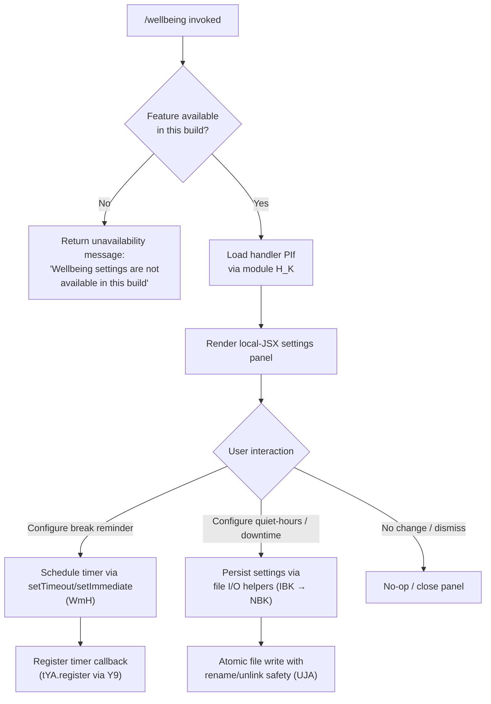

# `/wellbeing`

> Analysis basis: CC v2.1.161 bundle.js (AST extraction + Claude interpretation)
> Minimum version: v2.1.161

---

## Overview

The `/wellbeing` command opens a local-JSX settings panel that allows users to configure optional break reminders and quiet-hours nudges. It is registered with several convenience aliases (`breaks`, `break-reminder`, `downtime`) and runs immediately on invocation. When the feature is unavailable in the current build, it surfaces a descriptive unavailability message rather than silently failing.

---

## Registration

| Field | Value |
|---|---|
| type | `local-jsx` |
| name | `wellbeing` |
| description | Configure optional break reminders and quiet-hours nudges |
| aliases | `breaks`, `break-reminder`, `downtime` |
| immediate | `true` |
| module_id | `H_K` |
| load_inline | `true` |
| loc_byte | `12585856` |
| loc_byte_end | `12586109` |
| loc_line | `8797` |
| arbor_handler.name | `PIf` |
| arbor_handler.fqn | `claude-2.1.161::PIf` |
| arbor_handler.kind | `AsyncFunction` |
| arbor_handler.resolution_path | `module_id` |
| arbor_handler.n_hits | `0` |

Analysis basis: CC v2.1.161 bundle.js:+12585856

---

## Input Branching

Three distinct paths are observable from the literals and call graph: the feature is either (1) fully unavailable in the current build, (2) available and the settings UI is rendered normally, or (3) a numeric offset/state value is evaluated for timer scheduling logic. A Mermaid diagram best represents this.



Analysis basis: CC v2.1.161 bundle.js:+12585205 (unavailability string), +12584890 (timer constant 120), +12585054/+12585066 (state indices 0/1)

---

## Behavioral Spec

### Handler Entry — `PIf` (AsyncFunction)

Arbor resolves `PIf` as the primary handler for this command, reached via `module_id` → `H_K`.

```
async function wellbeingHandler(context):
    if featureUnavailable(context):
        return displayMessage("Wellbeing settings are not available in this build")

    panel = await loadSettingsPanel(context)   // calls bootstrapFetch (H)
    return renderJSX(panel)
```

Analysis basis: CC v2.1.161 bundle.js:+12585205, +12585207

### Unavailability Guard

The literal string `"Wellbeing settings are not available in this build"` is placed immediately after the call to the bootstrap/fetch helper `H`, indicating a guard that short-circuits the UI render path when the feature flag or build condition is not met.

```
function featureUnavailable(context):
    result = bootstrapFetch(context)
    if result indicates feature absent:
        return true
    return false
```

Analysis basis: CC v2.1.161 bundle.js:+12585205

### Bootstrap / Settings Fetch — `H`

`H` is called by `PIf` to retrieve the wellbeing settings data. It performs a network or cache fetch, sets `Content-Type: application/json`, a `User-Agent` header, and has a 5000 ms timeout. It logs `[Bootstrap] Fetching` on start and `[Bootstrap] Fetch ok` on success, and fires the telemetry event `api_bootstrap_fetch`. On parse failure it records `parse_failed`.

```
async function bootstrapFetch(endpoint):
    log("[Bootstrap] Fetching")
    response = await fetch(endpoint, {
        headers: {
            "Content-Type": "application/json",
            "User-Agent": <version string>
        },
        timeout: 5000
    })
    if parseError:
        record("parse_failed")
        return null
    log("[Bootstrap] Fetch ok")
    emit("api_bootstrap_fetch")
    return parsedData
```

Analysis basis: CC v2.1.161 bundle.js:+15504120, +15504207, +15504222, +15504241, +15504313, +15504434, +15504456, +15504486

### Timer / Break-Reminder Scheduling — `WmH`

`WmH` is responsible for scheduling break-reminder intervals. It manages a list of pending timers and uses `clearTimeout`, `setTimeout`, and `setImmediate` to coordinate them. The constant `120` (found at +12584890) is likely a default break interval in minutes or seconds, while `1000` (at +58707) and `100` (at +58728) are millisecond delay constants used in the scheduler.

```
function scheduleBreakReminder(intervalConfig):
    clearTimeout(existingTimer)
    delay = resolveDelay(intervalConfig)   // uses 1000ms / 100ms steps
    timer = setTimeout(reminderCallback, delay)
    pushTimerRef(timer)
    setImmediate(flushPendingCallbacks)
    updateTimerJoins()
```

Analysis basis: CC v2.1.161 bundle.js:+58819, +58860, +58983, +59076, +58707, +58728, +12584890

### Settings Persistence — `IBK` / `NBK`

Settings are persisted through a layered file-writing subsystem. `IBK` coordinates directory resolution (`he.dirname`), path joining, and file management. `NBK` performs the actual atomic write sequence: `mkdir` (create directory if absent), `appendFile`, followed by an atomic rename-or-unlink strategy (via `UJA`) to ensure consistency.

```
async function persistWellbeingSettings(settings):
    dir = path.dirname(settingsFilePath)
    ensureDirectory(dir)                    // Ay.mkdir
    serialized = serialize(settings)        // JSON.stringify via SH
    byteLen = Buffer.byteLength(serialized)
    await appendToTempFile(serialized)      // Ay.appendFile
    await atomicRename(tempPath, finalPath) // Ay.rename / Ay.unlink
    if isDirectory(finalPath):
        raise ErrorCode("EISDIR")
    rotateOldVersions()                     // UJA (.txt, slice at 4)
    notifyRegistry()                        // tYA.register via Y9
```

Analysis basis: CC v2.1.161 bundle.js:+204086, +204119, +204148, +204238, +204255, +204287, +204293, +203840, +203899, +203597, +203637, +174728, +203545, +203567

### Offset / Absolute-Value Helper — `jIf`

`jIf` calls `Math.abs` and works with numeric state indices `0` and `1` (found at +12585054 and +12585066). This helper likely normalises a signed offset (e.g., elapsed time or slider position) to an unsigned magnitude before comparing against the 120-unit threshold.

```
function normaliseOffset(value):
    return Math.abs(value)
```

Analysis basis: CC v2.1.161 bundle.js:+12584940, +12585054, +12585066

### Model / API Resolution helpers — `lq`, `s9`, `xP`, `b0`

The call graph shows that the fetch path reaches a model-selection and URL-composition layer. Constants such as `"opusplan"`, `"sonnet"`, `"haiku"`, `"opus"`, `"best"`, `"firstParty"`, `"anthropicAws"`, `"gateway"`, `"mantle"` are visible. This subsystem resolves which API endpoint and model tier to use, normalises provider strings to lower-case, and handles `anthropic.`-prefixed model names.

```
function resolveApiTarget(rawModelString):
    normalised = rawModelString.trim().toLowerCase()
    if normalised starts with "anthropic.":
        strip prefix
    tier = classifyTier(normalised)   // opusplan / sonnet / haiku / opus / best
    provider = resolveProvider(tier)  // firstParty / anthropicAws / gateway / mantle
    return buildEndpoint(provider, tier)
```

Analysis basis: CC v2.1.161 bundle.js:+2232138, +2236058, +2236087, +2236154, +2236172, +2236195, +2236234, +2236273, +2236310, +2050571, +2050606, +2230116, +2232362

### Hook Registration — `Y9`

After settings are written, `Y9` registers a callback with `tYA.register`, ensuring that downstream consumers (e.g., the UI layer or notification subsystem) are notified of the updated wellbeing configuration.

```
function registerSettingsChangeHook(callback):
    tYA.register(callback)
```

Analysis basis: CC v2.1.161 bundle.js:+59405

---

## State & Side Effects

| Item | Detail |
|---|---|
| Telemetry | `tengu_feature_sad` (bundle.js:+966732) |
| Telemetry (bootstrap) | `api_bootstrap_fetch` (bundle.js:+15504434) |
| Hook registration | `tYA.register` called via `Y9` after successful settings persist (bundle.js:+59405) |
| appState changes | Break-reminder timer refs pushed to an internal list via `$.push` / `L.push` (bundle.js:+59018, +59167) |
| File I/O | Settings written to disk via `Ay.appendFile` + `Ay.rename` / `Ay.unlink`; directory created with `Ay.mkdir` (bundle.js:+203840, +203899, +203597, +203637) |
| Sound | <!-- TODO: not found in depth-2 traversal; needs --depth 4 --> |
| Timer | `clearTimeout` / `setTimeout` / `setImmediate` used for break scheduling; default interval involves constant `120` (bundle.js:+12584890) |
| Error guard | `"EISDIR"` error code raised if target path is a directory (bundle.js:+174728) |

---

## Version History

| Version | Change |
|---|---|
| v2.1.161 | Initial analysis |

---

## Common Mistakes

1. **Using the command name without aliases**: The command responds equally to `/breaks`, `/break-reminder`, and `/downtime` — all are first-class aliases, not secondary spellings.
2. **Expecting the UI in all build variants**: The command contains an explicit unavailability guard; in stripped or CI builds the panel will not render and only the message `"Wellbeing settings are not available in this build"` is shown.
3. **Assuming synchronous settings save**: Persistence goes through an async atomic rename pipeline (`NBK` → `UJA`). Code that reads back settings immediately after invoking the command may see stale values.
4. **Confusing the 120 constant with milliseconds**: The `120` literal at +12584890 is likely a minutes or seconds interval for break reminders, not a millisecond delay. The millisecond-level timer constants are `1000` and `100`.
5. **Ignoring the `immediate: true` flag**: Because the command is flagged `immediate`, the JSX panel fires without a user confirmation step — any UI that wraps this command must account for instantaneous execution.

---

## Appendix — Identifier Mapping

> For bundle debugging only. Identifiers change across versions.

| Identifier | Role |
|---|---|
| `JIf` | Outer module wrapper / export container for wellbeing command |
| `jIf` | Offset normaliser (calls `Math.abs`; compares against break-interval thresholds) |
| `PIf` | Primary async handler for `/wellbeing` (Arbor-resolved via `module_id`) |
| `H` | Bootstrap / settings fetch function (HTTP fetch with JSON headers, 5000 ms timeout) |
| `N` | Command dispatch / invocation router (calls file-write, model-resolution, and hook helpers) |
| `VBK` | Sub-router reached from `N`; delegates to path-join and write helpers |
| `HwA` | Nested helper under `VBK`; calls token/model-map helpers `NmK` and `ImK` |
| `SH` | JSON serialisation helper (calls `JSON.stringify`) |
| `_` | Generic string accumulator / intermediate variable (used for `.toUpperCase`, `.replace`) |
| `Z4` | Path-normalisation utility (calls `CJA`, `H.replace`, `q.at`, `A.lastIndexOf`, `A.slice`) |
| `CJA` | Path-component mapper (calls `WBK.map`) |
| `q` | File-unlink helper (calls `wSK.unlinkSync`) |
| `A` | Filename lower-case helper (calls `f.toLowerCase`) |
| `imH` | File-write coordinator (calls `GJA` → `H.write`) |
| `GJA` | Low-level write issuer (calls `H.write`) |
| `IBK` | Settings-persistence orchestrator (coordinates directory, serialisation, atomic write, hook) |
| `WmH` | Break-reminder timer scheduler (`clearTimeout` / `setTimeout` / `setImmediate`) |
| `_3H` | Sub-persistence helper (calls `Im6`, `he.join`, `r8`, `N6`) |
| `F6` | File-path formatter used by `IBK` |
| `d46` | Error-code classifier; handles `"EISDIR"` (calls `v8`) |
| `BJA` | Path-join builder (calls `he.join`, `N6`) |
| `UJA` | Atomic rename/unlink helper (`Ay.stat`, `Ay.rename`, `Ay.unlink`; handles `.txt` rotation at slice 4) |
| `NBK` | Async file-write executor (`Ay.mkdir`, `Ay.appendFile`, delegates to `BJA`, `UJA`, `gJA`) |
| `Y9` | Hook-registration bridge (calls `tYA.register`) |
| `s$` | State accessor used in the bootstrap flow |
| `ne` | Set-membership check (calls `WA4.has`) |
| `Ij` | String-replacement utility (calls `H.replace`) |
| `lq` | API-target resolver entry point (calls `xHH`, `s9`, `xP`) |
| `xHH` | Model-string parser (calls `NT`, `o9H`, `VA`, `nQ`) |
| `NT` | Token/model-type constant node |
| `o9H` | Model-option parser sub-helper |
| `nQ` | Model-name classifier (checks `anthropic.` prefix, routes to `Aa6`, `RgH`, `Pwq`, `zHL`, `NKH`, `s9`, `DHL`) |
| `s9` | Model-tier resolver (trim → lower-case → classify: opusplan / sonnet / haiku / opus / best) |
| `x0` | Model-key lookup (calls `kKH`) |
| `NKH` | Model-availability checker (calls `vKH.includes`) |
| `aN` | Provider-resolution sub-helper A (calls `UM`, `Vf`) |
| `CgH` | Provider-resolution sub-helper B (calls `Vf`) |
| `KG` | Provider-resolution sub-helper C (calls `UM`, `Vf`, `PA`; firstParty path) |
| `Xwq` | Provider-resolution wrapper (calls `KG`) |
| `UM` | Endpoint-URL builder (calls `PA`; handles anthropicAws / gateway) |
| `Us6` | Allow-list checker (calls `wHL.includes`) |
| `bgH` | Fallback provider helper (calls `pH`) |
| `xP` | API-call issuer (calls `s9`, `b0`) |
| `b0` | Request-construction helper (calls `wA`, `BHH`, `RzH`, `xgH`, `KG`, `sX`, `UM`, `PA`, `Vf`, `aN`; handles mantle provider) |
| `t6` | Telemetry dispatcher / feature-flag helper (fires `tengu_feature_sad`; calls `d`, `h1H`) |
| `d` | Telemetry event emitter |
| `h1H` | Feature-flag evaluator (calls `Xa8`) |
| `Xa8` | Flag-store lookup |

---

Note: index built via Arbor fallback; some signals (telemetry, literals) may be missing — see arbor-fallback.js.