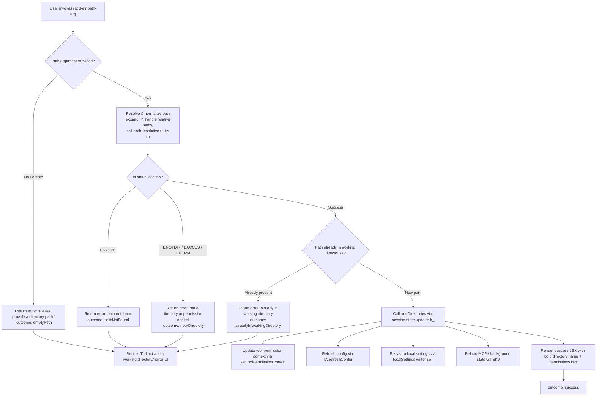

# `/add-dir`

> Analysis basis: CC v2.1.162 bundle.js (AST extraction + Claude interpretation)
> Minimum version: v2.1.162

---

## Overview

The `/add-dir` command adds a new working directory to the current Claude Code session, expanding the set of filesystem paths the agent is permitted to read and operate within. It accepts a single path argument, resolves and validates it (checking existence, type, permissions, and duplicate status), and — on success — registers the directory in session state and refreshes configuration accordingly. On failure, it surfaces a specific error reason to the user without modifying state.

---

## Registration

| Field | Value |
|---|---|
| type | `local-jsx` |
| name | `add-dir` |
| description | `Add a new working directory` |
| argumentHint | `<path>` |
| module_id | `xRq` |
| load_inline | `true` |
| loc_byte | `10866303` |
| loc_byte_end | `10866451` |
| loc_line | `7094` |
| arbor_handler.name | `g5f` |
| arbor_handler.fqn | `claude-2.1.162::g5f` |
| arbor_handler.kind | `AsyncFunction` |
| arbor_handler.resolution_path | `module_id` |
| arbor_handler.n_hits | `0` |

Analysis basis: CC v2.1.162 bundle.js:+10866303

---

## Input Branching

The handler produces six or more distinct outcome branches based on path validation results, making a Mermaid flowchart the appropriate representation.



Analysis basis: CC v2.1.162 bundle.js:+10865084 (handler entry `g5f`), +3828947 (`emptyPath`), +3829045 (`notADirectory`), +3829190 (`pathNotFound`), +3829315 (`alreadyInWorkingDirectory`), +3829391 (`success`), +3829476 (`Please provide a directory path.`), +10865785 (`Did not add a working directory.`)

---

## Behavioral Spec

### 1. Handler Entry (`g5f`)

```
async function addDirHandler(args, context):
    rawPath = args[0] ?? ""
    if rawPath is empty:
        return renderError("Please provide a directory path.", reason="emptyPath")

    resolvedPath = resolveAndNormalizePath(rawPath)   // calls pathResolver (E1)
    statResult   = await validateDirectory(resolvedPath)  // calls directoryValidator (KnH)

    if statResult.outcome == "notADirectory":
        return renderError(statResult.message, reason="notADirectory")
    if statResult.outcome == "pathNotFound":
        return renderError(statResult.message, reason="pathNotFound")

    appState = getAppStateFromSession()               // calls sessionStateReader (b_)
    if appState.workingDirectories.includes(resolvedPath):
        return renderError("...", reason="alreadyInWorkingDirectory")

    await updateSessionDirectories(resolvedPath)      // calls directoryAdder (b_ → addDirectories)
    setToolPermissionContext(resolvedPath)             // propagates new dir to permission subsystem
    await IA.refreshConfig()                          // reloads configuration
    await persistLocalSettings(resolvedPath)          // calls localSettingsWriter (se_)
    await reloadMcpAndBackgroundState()               // calls SK9
    await updatePermissionRules()                     // calls permissionRuleUpdater (J$)
    await renderToolList()                            // calls toolListRenderer (e8H)

    return renderSuccess(resolvedPath)
```

Analysis basis: CC v2.1.162 bundle.js:+10865084, +10865194, +10865226, +10865241, +10865264, +10865278, +10865297, +10865304, +10865338, +10865356, +10865836, +10865880

---

### 2. Path Resolution (`E1` — `pathResolver`)

```
function pathResolver(rawInput):
    if rawInput contains null bytes:
        throw Error("Path contains null bytes")
    trimmed = rawInput.trim()
    normalized = path.normalize(trimmed)
    if normalized starts with "~/":
        normalized = path.join(os.homedir(), normalized.slice(2))
    if platform == "windows":
        normalized = applyWindowsPathFix(normalized)
    if not path.isAbsolute(normalized):
        normalized = path.resolve(normalized)
    return normalized
```

Analysis basis: CC v2.1.162 bundle.js:+1051002 (null-byte check), +1051036 (trim), +1051058 (normalize), +1051099 (homedir), +1051117 (`~/` prefix), +1051146 (path.join), +1051192 (windows branch), +1051259 (isAbsolute), +1051313 (path.resolve)

---

### 3. Directory Validation (`KnH` — `directoryValidator`)

```
async function directoryValidator(resolvedPath):
    if resolvedPath is empty:
        return { outcome: "emptyPath" }

    try:
        stat = await fs.stat(resolvedPath)
    catch err:
        if err.code == "ENOTDIR" or err.code == "EACCES" or err.code == "EPERM":
            return { outcome: "notADirectory" }
        if err is ENOENT (not found):
            return { outcome: "pathNotFound" }
        return { outcome: "pathNotFound" }   // default fallback

    // On macOS /var/ is symlinked; normalize
    normalizedPath = resolvedPath.replace("/var/", "/tmp$1")  // platform symlink fix (WI)

    if normalizedPath is already in currentWorkingDirectories:
        return { outcome: "alreadyInWorkingDirectory" }

    return { outcome: "success", path: normalizedPath }
```

Analysis basis: CC v2.1.162 bundle.js:+3828966 (stat call), +3829000 (stat), +3829045 (`notADirectory`), +3829108 (V8 error map), +3829135 (`ENOTDIR`), +3829150 (`EACCES`), +3829164 (`EPERM`), +3829190 (`pathNotFound`), +3829251 (eo branch), +3829315 (`alreadyInWorkingDirectory`), +13173070 (`/var/`), +13173111 (`/tmp$1`)

---

### 4. Session State Reader (`b_` — `sessionStateReader`)

```
function sessionStateReader(sessionContext):
    state = H.getAppState()
    lastEntry = state.entries.findLast(
        e => e.type == "working_directory"
    )
    allowedTools   = collectEntriesOfType(state, "allowed_tools")    // VI8
    disallowedTools = collectEntriesOfType(state, "disallowed_tools") // NI8
    return { workingDirectories, allowedTools, disallowedTools }
```

Analysis basis: CC v2.1.162 bundle.js:+10862847 (getAppState), +10862927 (findLast), +10862952 (`working_directory`), +10863007 (`allowed_tools`), +10863062 (`disallowed_tools`), +10863025 (VI8), +10863083 (NI8)

---

### 5. Local Settings Persistence (`se_` — `localSettingsWriter`)

```
async function localSettingsWriter(newPath):
    environment = detectEnvironment()   // "production" | "test"
    configPath  = DY.join(configDir, configFilename)
    raw = await fL.readFile(configPath, "utf8")
    parsed = parseConfig(raw)
    parsed.workingDirectories.push(newPath)
    encoded = encodeConfig(parsed)
    if Buffer.byteLength(encoded) > 448:   // byte limit check
        logError(...)
    await fL.mkdir(DY.dirname(configPath), { recursive: true })
    await fL.appendFile(configPath, encoded)
```

Analysis basis: CC v2.1.162 bundle.js:+13103420, +13103447 (mO normalize), +13103456 (realpath), +13103485 (R8), +13103643 (readFile), +13103716 (kH / error logging), +13103739 (mkdir), +13103748 (dirname), +13103820 (appendFile), +13103781 (byte limit 448), +13103848 (384)

---

### 6. Permission Rule Update (`J$` — `permissionRuleUpdater`)

```
function permissionRuleUpdater(sessionContext, newDir):
    currentRules = loadCurrentRules()
    // Handle addRules, replaceRules, removeRules operations
    for each ruleOperation in ["addRules", "replaceRules", "removeRules",
                               "removeDirectories"]:
        apply ruleOperation to ruleSet

    if operation.mode == "bypassPermissions" and bypassNotAvailable:
        log("Ignoring permission update: setMode 'bypassPermissions' rejected...")
        return

    updatedRules = mergeRules(
        alwaysAllowRules, alwaysDenyRules, alwaysAskRules
    )
    A.set(sessionRuleMap, updatedRules)
```

Analysis basis: CC v2.1.162 bundle.js:+4733336 (`setMode`), +4733358 (`bypassPermissions`), +4733424 (bypass-rejected log), +4733700 (`addRules`), +4733885 (`allow`), +4733893 (`alwaysAllowRules`), +4733925 (`deny`), +4733932 (`alwaysDenyRules`), +4733950 (`alwaysAskRules`), +4734048 (`replaceRules`), +4734705 (`removeRules`), +4735089 (`removeDirectories`)

---

### 7. Background State / MCP Reload (`SK9` — `mcpAndBgStateReloader`)

```
async function mcpAndBgStateReloader():
    iJ()                        // clear stale MCP deletion map
    statResults = await Promise.all(
        workingDirs.map(dir => W2.stat(G2.join(dir, bgStateFile)))
    )
    for each stat in statResults:
        if stat indicates stale:
            mLH.delete(key); jwH.delete(key)
        else:
            content = await W2.readFile(path)
            parsed  = JSON.parse(content)
            mLH.set(key, parsed)

    ff()   // flush / persist background state to disk via atomic write (ez)
```

Analysis basis: CC v2.1.162 bundle.js:+4146682 (iJ clear), +4146700 (Hq stat loop), +4143166 (mLH.delete), +4143207 (G2.join), +4143292 (Promise.all), +4143305 (W2.stat), +4143459 (mLH.delete), +4143473 (jwH.delete), +4143616 (mLH.get), +4143631 (jwH.has), +4143642 (jwH.add), +4143855 (W2.readFile), +4144121 (mLH.set), +4146865 (ff flush), +4142904 (ez atomic write)

---

### 8. Tool List Rendering (`e8H` — `toolListRenderer`)

```
function toolListRenderer(sessionContext):
    toolList = buildInitialToolList()    // Y$9 — collects tools from all working dirs
    filteredTools = toolList
        .filter(t => !excludedSet.has(t))
        .filter(t => permissionMap.has(t))
    mcpToolList = collectMcpTools()     // from M (MCP registry)
    merged = deduplicateAndSort(filteredTools + mcpToolList)
    return renderToolListJsx(merged)
```

Analysis basis: CC v2.1.162 bundle.js:+4735556 (cZ_ tool base), +4735635 (v branching), +4735925 (Y$9 tool map), +4736216 (A.includes filter), +4736511 (q.filter), +4736549 (K.has permission check), +4736837 (A.filter), +4736852 (q.has)

---

### 9. Success / Error Rendering

```
function renderAddDirResult(outcome, resolvedPath):
    if outcome == "success":
        line1 = bold(resolvedPath)
        line2 = dim("· /permissions to manage")
        return JSX <Box>line1, line2</Box>
    else:
        return JSX <Text>"Did not add a working directory."</Text>
```

Analysis basis: CC v2.1.162 bundle.js:+10865356 (J6.bold), +10865642 (J6.dim), +10865649 (`· /permissions to manage`), +10865682 (H JSX render), +10865785 (`Did not add a working directory.`), +10865836 (KnH success branch), +10865880 (LnH error branch)

---

## State & Side Effects

| Item | Detail |
|---|---|
| Telemetry: `tengu_feature_sad` | Emitted on a feature-degraded / sad-path condition (bundle.js:+1008376) |
| Telemetry: `tengu_daemon_config_reload` | Emitted when daemon config is reloaded after directory add (bundle.js:+16011003) |
| Telemetry: `tengu_bg_state_read_transient` | Emitted when background state is read transiently during MCP reload (bundle.js:+4143655) |
| `appState` / working directories | New resolved path appended to the session's working-directory list via `addDirectories` (bundle.js:+10865120) |
| `localSettings` persistence | Settings file updated via atomic append; directory stored under `localSettings` key (bundle.js:+10865167, +13103820) |
| Tool permission context | `setToolPermissionContext` called to broadcast new directory to permission subsystem (bundle.js:+10865194) |
| `IA.refreshConfig` | Full config refresh triggered after directory addition (bundle.js:+10865278) |
| MCP state | MCP server map cleared and recomputed; orphaned connections disposed (bundle.js:+10865304) |
| Background state (`mLH`, `jwH`) | In-memory maps updated; stale entries purged; new state flushed atomically to disk (bundle.js:+4143166, +4144338) |
| Atomic file write | Uses `randomBytes`-prefixed temp file + rename for crash-safe persistence (bundle.js:+2280785, +2280832, +2280886) |
| Hook registration | No dedicated hook registration found in depth-2 traversal |
| Sound | <!-- TODO: not found in depth-2 traversal; needs --depth 4 --> |

---

## Version History

| Version | Change |
|---|---|
| v2.1.162 | Initial analysis |

---

## Common Mistakes

1. **Omitting the path argument** — invoking `/add-dir` with no argument produces the `emptyPath` error ("Please provide a directory path.") and exits immediately; always supply a path.
2. **Providing a relative path without a clear CWD** — the command resolves relative paths via `path.resolve`, which anchors to the process working directory, not necessarily the project root; prefer absolute paths.
3. **Using `~/` on Windows** — the tilde-expansion logic calls `os.homedir()` and `path.join`, which may produce unexpected results on Windows paths; use explicit absolute paths instead.
4. **Adding a path the session already contains** — this produces the `alreadyInWorkingDirectory` error silently; check `/status` or session context before adding.
5. **Expecting immediate MCP tool availability** — after adding a directory, the MCP registry is reloaded asynchronously (`SK9`); newly exposed MCP tools may not appear until the reload cycle completes.
6. **Supplying a file path instead of a directory** — `fs.stat` with `ENOTDIR` (or when the path points to a regular file) causes the `notADirectory` error; ensure the target is an actual directory.
7. **Expecting the directory to persist across fresh sessions without a config** — persistence depends on `localSettings` append succeeding; if the config directory is not writable, the directory is added to in-memory state only for the current session.

---

## Appendix — Identifier Mapping

> For bundle debugging only. Identifiers change across versions.

| Identifier | Role |
|---|---|
| `g5f` | Main async handler for `/add-dir` (arbor_handler) |
| `b_` | Session state reader — fetches app state and working-directory list |
| `H` | Generic context/app-state object (multi-use across call graph) |
| `v` | Config/state value getter utility (multi-use) |
| `PgK` | Path segment utility (uses Xy, XgK, PJA sub-helpers) |
| `SH` | JSON serialization helper |
| `V4` | Path string manipulation (replace, slice, lastIndexOf) |
| `WpH` | Path normalization wrapper (calls pXA) |
| `EgK` | Directory-entry computation (dirname, byte-length, buffer ops) |
| `_3` | Auxiliary state accessor |
| `AY_` | String splitting / trimming utility |
| `LHH` | Set membership check (Y94.has) |
| `bJ` | String replace helper |
| `a1` | Model/alias resolution entry (calls oHH, qq, rX) |
| `oHH` | Internal alias expansion (k0, OqH, yA, Dd) |
| `qq` | Model name normalizer (trim, toLowerCase, alias map) |
| `rX` | Model resolution branching (calls qq, g0) |
| `t6` | Terminal/UI utility (calls c, Z6) |
| `Z6` | Lower-level terminal helper (calls Zx6) |
| `VI8` | Allowed-tools state collector (calls K1) |
| `NI8` | Disallowed-tools state collector (calls K1) |
| `K1` | Generic state-collection base |
| `J$` | Permission rule updater (addRules / replaceRules / removeRules) |
| `xM` | Path escape helper (calls IW4 / replaceAll) |
| `IW4` | String replaceAll wrapper |
| `Yy` | Session/context flag accessor |
| `D` | Supervisor / daemon process controller (stop, updateConfig, start) |
| `Y0H` | ENOENT-aware file reader |
| `V9` | Async store getter (d0L.getStore) |
| `V8` | Error/result wrapper |
| `k4A` | Calls I4A sub-helper |
| `TH` | String coercion wrapper |
| `OKK` | Object key / Math.max utility (used in MCP rendering) |
| `E` | Input event / stop handler (preventDefault, c0, D) |
| `c0` | Config-loader entry (calls r_) |
| `r_` | Full config-load pipeline (reads userSettings, projectSettings, gitignore, etc.) |
| `Z` | Watcher/observer lifecycle object (stop, updateConfig, start) |
| `xCK` | Heartbeat/daemon helper (calls d6H) |
| `d6H` | Heartbeat implementation |
| `V` | Secondary lifecycle object (start) |
| `Y46` | Flag/feature-switch accessor |
| `se_` | Local settings writer (realpath, readFile, mkdir, appendFile) |
| `X0H` | Environment detector (production/test) |
| `tH` | String constructor wrapper |
| `T7K` | Config path builder |
| `Hx` | Config value extractor |
| `mO` | Path normalize (NFC Unicode normalization) |
| `R8` | Result/error mapper |
| `$R` | Nv-based resolver |
| `Nv` | Low-level resolution primitive |
| `X_` | Secondary Nv-based resolver |
| `kH` | Error logger / diagnostics writer (logError, zBH.push) |
| `t_` | Error string formatter |
| `wq` | Log-queue writer (calls UyA) |
| `UyA` | Underlying log appender |
| `Gj4` | Log-queue rotation (shift/push on vQ6) |
| `SK9` | MCP and background-state reloader |
| `iJ` | MCP deletion-map clearer |
| `Hq` | Background-state stat loop and parser |
| `rf` | V8 result wrapper for Hq |
| `p6` | JSON.parse wrapper |
| `ff` | Background-state flush (calls ez, G2.join, SH, iJ) |
| `ez` | Atomic file writer (randomBytes, writeFile, rename, copyFile, unlink) |
| `e8H` | Tool list renderer (collects, filters, deduplicates tools) |
| `cZ_` | Base tool-list builder |
| `Y$9` | Extended tool mapper (all working dirs) |
| `RX6` | Tool-entry factory (calls m8) |
| `m8` | Individual tool-entry builder (Xc6, gQ) |
| `zdL` | Directory-level tool scanner (gO, R$, i6, gP) |
| `gO` | Tool source reader (COH, gQ) |
| `R$` | Symlink resolver (KO, ZJ, realpathSync) |
| `i6` | File-existence check |
| `gP` | Git-aware path resolver (calls wr) |
| `wdL` | Working-directory list accessor |
| `N3` | Tool metadata parser (yW4, zE, hW4, kW4) |
| `yW4` | Metadata field extractor |
| `zE` | Object.hasOwn check wrapper |
| `hW4` | Metadata sub-field reader |
| `kW4` | String replaceAll for metadata |
| `M` | MCP registry / tool-map manager (RCH, xp8, ROA) |
| `RCH` | MCP connection result handler (stdio/sse/http/ws-ide dispatch) |
| `xp8` | MCP connection result applier (applyMcpUpdate, cleanup) |
| `ROA` | MCP server orchestrator (getClients, connect, RCH, xp8) |
| `KnH` | Directory validator (path resolve, fs.stat, error classification) |
| `E1` | Path normalizer / resolver (null-byte check, ~/ expansion, isAbsolute) |
| `x6` | Context-store accessor (RQ6, X_) |
| `RQ6` | Store getter (SQ6.getStore, hi) |
| `eo` | X_-based branch resolver |
| `WI` | macOS /var→/tmp path fixer (calls E1, X7A, Vz, DHH) |
| `X7A` | Platform-specific path rewriter (o6, PV) |
| `Vz` | Case-normalizer (toLowerCase) |
| `DHH` | Fallback path handler |
| `LnH` | Error-result JSX renderer (J6.bold, sK8.dirname) |

---

Note: index built via Arbor fallback; some signals (telemetry, literals) may be missing — see arbor-fallback.js.