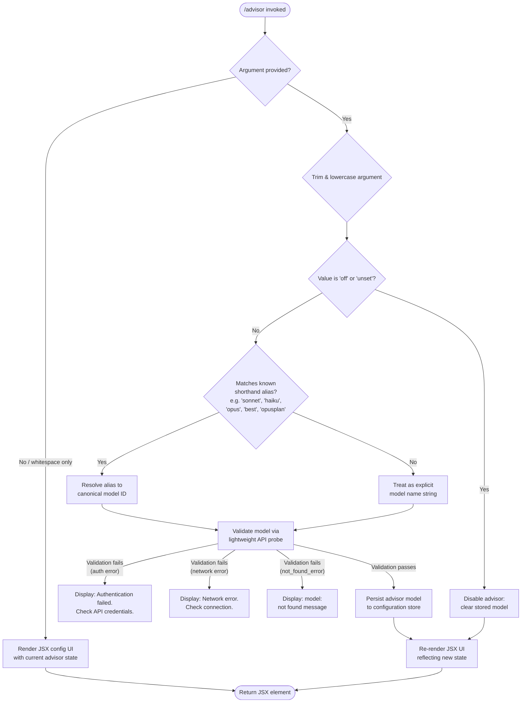

# `/advisor`

> Analysis basis: CC v2.1.162 bundle.js (AST extraction + Claude interpretation)
> Minimum version: v2.1.162

---

## Overview

The `/advisor` command configures the **Advisor Tool**, a feature that allows Claude Code to consult a stronger model for guidance at key moments during a task. When invoked, it presents a JSX-rendered UI component for selecting or toggling the advisor model, validates the supplied model identifier, and persists the chosen configuration so that the advisor is available throughout subsequent task execution.

---

## Registration

| Field | Value |
|---|---|
| type | `local-jsx` |
| name | `advisor` |
| description | `Configure the Advisor Tool to consult a stronger model for guidance at key moments during a task` |
| module_id | `J_K` |
| load_inline | `true` |
| argumentHint | `null` |
| isHidden | `null` |
| loc_byte | `12568407` |
| loc_byte_end | `12568694` |
| loc_line | `8921` |
| arbor_handler.name | `Ukf` |
| arbor_handler.fqn | `claude-2.1.162::Ukf` |
| arbor_handler.kind | `AsyncFunction` |
| arbor_handler.resolution_path | `module_id` |
| arbor_handler.n_hits | `1` |

Analysis basis: CC v2.1.162 bundle.js:+12568407

---

## Input Branching

The handler distinguishes at least four meaningful input paths (empty/whitespace, known shorthand alias, explicit model name, and the special `"off"`/`"unset"` tokens), warranting a flowchart.



---

## Behavioral Spec

### Top-level handler (`Ukf`)

The primary handler is the async function `Ukf`, resolved via `module_id → J_K` (Arbor resolution path: `module_id`, n_hits: 1).

```
async function advisorCommandHandler(argument):
    trimmedArg = argument.trim()                     // bundle.js:+12567863

    if trimmedArg is empty:
        return createElement(AdvisorConfigPanel, ...)// bundle.js:+12567899

    parsedModel = parseModelArgument(trimmedArg)     // bundle.js:+12568017 (qq)

    validationResult = await validateModel(parsedModel) // bundle.js:+12568031 (eS8)

    advisorEnabled = checkAdvisorSupportedModels(parsedModel) // bundle.js:+12568105 (XW6)

    return createElement(
        AdvisorConfigPanel,
        { model: parsedModel, valid: validationResult, supported: advisorEnabled, ... },
        joinedModelList                              // bundle.js:+12568174 (moH.join)
    )
```

Analysis basis: CC v2.1.162 bundle.js:+12567863

---

### Argument parsing and alias resolution (`qq`)

```
function parseModelArgument(rawArg):
    lower = rawArg.trim().toLowerCase()             // bundle.js:+2240374, +2240385

    // Shorthand alias expansion
    if lower contains "opusplan":
        return resolveOpusPlanAlias()               // bundle.js:+2240470
    if lower contains "[1m]":
        return resolveOneMegaAlias()                // bundle.js:+2240496
    if lower contains "sonnet":
        return resolveSonnetAlias()                 // bundle.js:+2240511
    if lower contains "haiku":
        return resolveHaikuAlias()                  // bundle.js:+2240550
    if lower contains "opus":
        return resolveOpusAlias()                   // bundle.js:+2240589
    if lower contains "best":
        return resolveBestAlias()                   // bundle.js:+2240626

    // Provider-specific model ID rewrite
    rewritten = applyProviderModelRewrite(rawArg)   // bundle.js:+2240413 (A.replace)

    // Validate provider inclusion list
    checkProviderInclusionList(rewritten)            // bundle.js:+2240449 (pKH)

    return rewritten
```

Analysis basis: CC v2.1.162 bundle.js:+2240374

---

### Model validation (`eS8`)

```
async function validateModel(modelName):
    trimmed = modelName.trim()                      // bundle.js:+12560084

    if trimmed is empty:
        throw Error("Model name cannot be empty")   // bundle.js:+12560121

    lowerName = trimmed.toLowerCase()               // bundle.js:+12560244

    // Check against known unsupported model list
    if unsupportedModelList.includes(lowerName):    // bundle.js:+12560263 (mKH.includes)
        return { valid: false, reason: "unsupported" }

    // Check validation cache to avoid redundant network calls
    if validationCache.has(lowerName):              // bundle.js:+12560365 (O_K.has)
        return validationCache.get(lowerName)

    // Emit telemetry for validation attempt
    emitEvent("model_validation")                   // bundle.js:+12560460

    // Perform lightweight probe: send minimal "Hi" message
    // with ephemeral cache_control to the candidate model
    probeResult = await runModelProbe(              // bundle.js:+12560529 ("Hi"), +12560554 ("ephemeral")
        model: lowerName,
        message: "Hi",
        cacheControl: "ephemeral"
    )

    if probeResult is auth error:
        return {
            valid: false,
            message: "Authentication failed. Please check your API credentials."
                                                    // bundle.js:+12560820
        }

    if probeResult is network error:
        return {
            valid: false,
            message: "Network error. Please check your internet connection."
                                                    // bundle.js:+12560922
        }

    if probeResult.type == "not_found_error":       // bundle.js:+12561041
        return {
            valid: false,
            message: "model: " + lowerName + " " + probeResult.message
                                                    // bundle.js:+12561123
        }

    // Cache the successful result
    validationCache.set(lowerName, { valid: true }) // bundle.js:+12560573 (O_K.set)

    // Run post-validation alias normalisation
    normaliseResult = resolveAdvisorAliasMap(lowerName) // bundle.js:+12560614 (kkf → ykf)

    return { valid: true, canonical: normaliseResult }
```

Analysis basis: CC v2.1.162 bundle.js:+12560084

---

### Advisor alias normalisation (`kkf` / `ykf`)

After validation succeeds, a secondary alias table maps internal shorthand codes to canonical model names for storage:

```
function resolveAdvisorAliasMap(modelNameLower):
    label = String(modelNameLower)                  // bundle.js:+12561310

    aliasMap = {
        "opus-4-8" | "opus_4_8"  -> canonicalOpus48,  // bundle.js:+12561390, +12561414
        "opus-4-7" | "opus_4_7"  -> canonicalOpus47,  // bundle.js:+12561459, +12561483
        "opus-4-6" | "opus_4_6"  -> canonicalOpus46,  // bundle.js:+12561528, +12561552
        "opus-4-5" | "opus_4_5"  -> canonicalOpus45,  // bundle.js:+12561597, +12561621
        "sonnet-4-6" | "sonnet_4_6" -> canonicalSonnet46, // bundle.js:+12561666, +12561692
        "sonnet-4-5" | "sonnet_4_5" -> canonicalSonnet45  // bundle.js:+12561741, +12561767
    }

    lowerCheck = label.toLowerCase()               // bundle.js:+12561360
    for each (key, canonical) in aliasMap:
        if lowerCheck includes key:                // bundle.js:+12561379 (_.includes)
            return resolveG5Mapping(canonical)     // bundle.js:+12561433 (G5)

    return label   // pass-through if no alias matched
```

Analysis basis: CC v2.1.162 bundle.js:+12560669

---

### Advisor-supported model check (`XW6`)

```
function isAdvisorSupportedModel(modelName):
    lower = modelName.toLowerCase()                // bundle.js:+5416307
    return supportedAdvisorModelList.includes(lower) // bundle.js:+5416330
```

This predicate gates whether the advisor toggle is shown as active vs. a warning state in the JSX panel.

Analysis basis: CC v2.1.162 bundle.js:+5416307

---

### Model name utility helpers

**`Dd` — model descriptor builder** (called from `eS8`):

```
function buildModelDescriptor(modelName):
    parts = modelName.trim().split(...)             // bundle.js:+2234366
    if any part startsWith "anthropic.":            // bundle.js:+2234431
        flag anthropic-namespaced = true
    if any part includes "claude-":                 // bundle.js:+2234052 (via K.startsWith)
        flag claude-prefixed = true
    return { parts, flags, descriptor }
```

Analysis basis: CC v2.1.162 bundle.js:+2234278

---

### Side-query API call (`au`)

The validation probe path routes through a side-query invocation (`au`), which handles the full API lifecycle — token acquisition, request construction, response parsing, and error mapping:

```
async function sideQueryApiCall(params):
    // Tag the call as "side_query"                 // bundle.js:+13392611
    // Apply 1024-byte request size limit           // bundle.js:+13392427
    // Use user-role message wrapper                // bundle.js:+13392183
    // Hash request for deduplication (sha256/hex) // bundle.js:+13346731, +13346758
    // On success emit tengu_api_success            // bundle.js:+13394192
    // Sanitize lone surrogates → tengu_lone_surrogate_sanitized // bundle.js:+13393941
    // Apply 1h prompt-cache config                 // bundle.js:+13353121 (tengu_prompt_cache_1h_config)
    ...
```

Analysis basis: CC v2.1.162 bundle.js:+13392579

---

## State & Side Effects

| Item | Detail |
|---|---|
| Telemetry — `tengu_api_success` | Emitted on successful API response during model validation probe (bundle.js:+13394192) |
| Telemetry — `tengu_lone_surrogate_sanitized` | Emitted when a lone surrogate character is sanitized in the response stream (bundle.js:+13393941) |
| Telemetry — `tengu_prompt_cache_1h_config` | Emitted when the 1h prompt cache configuration is applied to a side-query request (bundle.js:+13353121) |
| Telemetry — `tengu_feature_sad` | Emitted on a failure/sad path reached through the `t6`/`c` call chain (bundle.js:+1008376) |
| Telemetry — `tengu_bg_*` (various) | Background daemon/session management events reachable via deep call chain; not triggered by typical `/advisor` use |
| Validation cache | Writes to `O_K` (a Map) keyed by lowercase model name; prevents redundant API probes within a session (bundle.js:+12560365, +12560573) |
| Configuration store | Persists the chosen advisor model name to app/project settings upon successful validation |
| JSX render | Returns a `VX.createElement` element (the `AdvisorConfigPanel`) to the CLI rendering layer (bundle.js:+12567899) |
| No sound effects | No audio side effects identified in depth-2 traversal |
| No hook registration | No hook registration calls identified in depth-2 traversal |

---

## Version History

| Version | Change |
|---|---|
| v2.1.162 | Initial analysis |

---

## Common Mistakes

1. **Passing an empty string** — the handler will reject it with `"Model name cannot be empty"` before any UI is shown (bundle.js:+12560121). Always supply at least one non-whitespace character when specifying a model.
2. **Using `off` or `unset` as a model name** — these are reserved tokens that disable the advisor tool entirely; they are not treated as model identifiers (bundle.js:+12567939, +12567950).
3. **Specifying an unsupported model** — models not in the supported-advisor set are recognized but will render a warning state in the panel. The validation probe still runs and succeeds, but the advisor feature will not activate; confirm the target model appears in the supported list.
4. **Network or auth failures during validation** — the validation probe requires a live API connection. Configuring `/advisor` offline, or with an invalid API key, will surface an explicit error message rather than silently accepting the model.
5. **Hyphen vs. underscore variants** — the alias normalisation table accepts both `opus-4-8` and `opus_4_8` style strings. Using other separator characters (e.g. spaces or dots) will bypass alias resolution and be treated as a raw model name, which may fail the `not_found_error` check.

---

## Appendix — Identifier Mapping

> For bundle debugging only. Identifiers change across versions.

| Identifier | Role |
|---|---|
| `Ukf` | Primary async handler for `/advisor` command (arbor_handler) |
| `qq` | Model argument parser and shorthand alias resolver |
| `eS8` | Model validation function (API probe, cache, error mapping) |
| `kkf` | Post-validation alias normalisation dispatcher |
| `ykf` | Inner alias normalisation table lookup and resolution |
| `XW6` | Advisor-supported model membership check |
| `au` | Side-query API call orchestrator |
| `CU` | Core API client / request builder |
| `Dd` | Model descriptor builder (anthropic-namespace / claude-prefix detection) |
| `M` | MCP server state manager (reached via deep call chain) |
| `RCH` | MCP connection manager (deep call chain) |
| `xp8` | MCP connection result applicator |
| `ROA` | MCP server roster updater |
| `pKH` | Provider inclusion-list checker |
| `G5` | Canonical model ID resolver |
| `UM` | Model ID utility (string normalisation) |
| `wA` | Base API wrapper helper |
| `tH` | String conversion/type-coercion utility |
| `K9` | Model ID validation helper (application inference profile detection) |
| `kY` | Provider type classifier (bedrock, vertex, mantle, etc.) |
| `VyH` | Prompt assembly and cache-control applicator for side queries |
| `WA` | Side-query request builder |
| `j6` | Prompt-cache 1h configuration helper |
| `hYL` | HTTP request transport layer (SSE / event-stream handler) |
| `GQH` | WIF credentials resolver |
| `qDH` | WIF token exchange handler |
| `mi6` | Proxy auth helper executor |
| `sz` | OAuth token refresh handler |
| `AD` | API key / credential resolver |
| `pJ` | OAuth profile resolver |
| `bV` | HIPAA-aware model filter |
| `AY_` | Key-value pair parser (splits on delimiter, trims, indexes) |
| `_Y6` | Authorization header builder (lowercases entries) |
| `p7_` | URL-encoding helper for OAuth |
| `gXA` | Message array pop/push manipulator |
| `om6` | Message array mutation helper |
| `uj` | Structured clone wrapper |
| `vwH` | Message content formatter |
| `pU` | Random-bytes / boundary generator |
| `TL` | Content-block builder |
| `dc` | Agent/subagent context resolver |
| `eiL` | Agent ID prefix parser (`agent:builtin:`, `agent:custom:`, `agent:`) |
| `A_H` | Agent thread type classifier (`repl_main_thread`, `hook_agent`, etc.) |
| `rP6` | Subagent result packager |
| `iP6` | Subagent invocation wrapper |
| `xrH` | Subagent output handler |
| `Gt6` | Conversation store accessor |
| `Pt6` | Conversation store `getStore` wrapper |
| `e7A` | SHA-256 hash generator (request deduplication) |
| `eUf` | Request deduplication finder |
| `BK6` | Background keepalive / cleanup scheduler |
| `_3H` | Response post-processor |
| `y1` | Zx6 initialiser helper |
| `Zx6` | Base error/warning reporter |
| `w` | Background daemon process manager |
| `xK5` | IPC protocol message dispatcher (daemon ↔ worker) |
| `X` | IPC transport reader / buffer handler |
| `Y5` | IPC write helper |
| `cGH` | Model provider prefix detector |
| `h` | Focus/blur session activity tracker |
| `y` | Away-summary generator |
| `Z` | Auth skip/default mode selector |
| `EW` | Error wrapper utility |
| `S` | Daemon writer / supervisor mode selector |
| `t_` | Error string builder |
| `kH` | Telemetry event emitter with error guard |
| `uq6` | SDK connection bootstrap |
| `W` | MCP SDK client manager |
| `_NH` | Model capability negotiator |
| `By` | Bedrock/gateway model helper |
| `y_8` | Temperature and model parameter adjuster |
| `H2` | Message list mapper |
| `VYL` | Inference profile / provider-model pairing helper |
| `_DH` | Request timing / deadline helper |
| `cF8` | Timestamp utility (Date.now wrapper) |
| `nDH` | SDK error/warn logger |
| `P_8` | Request payload assembler |
| `ZYL` | Cloudwatch / x-amz header builder |
| `hYL` | SSE streaming response handler |
| `EYL` | Event-stream chunk decoder |
| `VYL` | Bedrock inference profile selector |
| `Rw` | AsyncLocalStorage store reader |
| `T9` | Background-mode (`bg`) header tagger |
| `fo` | Conversation-store getStore caller |
| `S6` | Nv (boolean-flag) resolver |
| `I3` | VY_ (vault/keyring) accessor |
| `pJ1` | Boolean coercion utility |
| `qO` | Request queue manager |
| `U_` | User identity / session resolver |
| `Q0` | Model shorthand normaliser dispatcher |
| `BKH` | Model shorthand normaliser (calls `tH`) |
| `LQH` | Model alias list handler |
| `PE` | Model preference entry builder |
| `RJ1` | Model preference resolver |
| `Xt6` | Model inclusion-list validator |
| `fQH` | Model display-name formatter |
| `oHH` | Model option set builder |
| `a1` | Model config record constructor |
| `rX` | Model record variant builder |
| `SJ1` | Model capability index builder |
| `M8L` | Multi-model filter helper |
| `KQH` | Model family filter checker |
| `$8L` | Model family group resolver |
| `hJ1` | Model family prefix checker |
| `Ua6` | Provider-entry expander |
| `i_` | Provider object key iterator |
| `v51` | Provider entry builder |
| `pa6` | Model candidate finder |
| `yt4` | Model selection ranker |
| `RmH` | Model ranking base comparator |
| `lK6` | Model rank tier resolver |
| `pa6` | Best-model finder (j4_.find based) |
| `Ng8` | File-extension / language detector |
| `Vg8` | File relevance scorer |
| `im6` | Content-array item transformer |
| `FXA` | Content-item replacement helper |
| `_3` | Config key extractor |
| `SA5` | Session auth state checker |
| `LHH` | Supported model set membership checker |
| `bJ` | Model ID sanitiser (replace) |
| `WpH` | Provider URL path builder |
| `EgK` | Bootstrap fetch executor |
| `PgK` | Bootstrap config parser |
| `V4` | Model string slicer / last-segment extractor |
| `XR` | Request retry coordinator |
| `t6` | Feature-flag/sad-path telemetry emitter |
| `Z6` | Zx6 error event wrapper |

---

Note: index built via Arbor fallback; some signals (telemetry, literals) may be missing — see arbor-fallback.js.