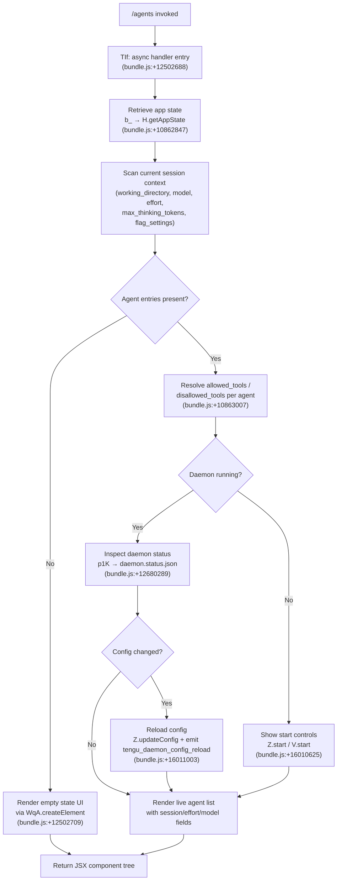

# `/agents`

> Analysis basis: CC v2.1.162 bundle.js (AST extraction + Claude interpretation)
> Minimum version: v2.1.162

---

## Overview

The `/agents` command provides an interactive management interface for agent configurations within Claude Code. It renders a JSX-based UI component that allows users to inspect, configure, and control agent sessions — including their working directories, allowed/disallowed tool sets, model and effort settings, and daemon lifecycle operations. The command is backed by an async handler (`TIf`) that wires together app state retrieval, UI component assembly, and daemon control primitives.

---

## Registration

| Field | Value |
|---|---|
| type | `local-jsx` |
| name | `agents` |
| description | `Manage agent configurations` |
| module_id | `B6K` |
| load_inline | `true` |
| loc_byte | `12502837` |
| loc_byte_end | `12502962` |
| loc_line | `8898` |
| arbor_handler.name | `TIf` |
| arbor_handler.fqn | `claude-2.1.162::TIf` |
| arbor_handler.kind | `AsyncFunction` |
| arbor_handler.resolution_path | `module_id` |
| arbor_handler.n_hits | `0` |

Analysis basis: CC v2.1.162 bundle.js:+12502837

The handler `TIf` was resolved via the `module_id` path: the indexer followed `module_id = "B6K"` → module exports → name lookup, and confirmed `TIf` as the async function entry point. The registration block spans bytes `12502837`–`12502962`.

---

## Input Branching

The command exhibits 4+ distinct operational branches based on the agent state, daemon lifecycle, and configuration settings observed in the call graph. A Mermaid flowchart is used.



---

## Behavioral Spec

### 1. Handler Entry and App State Retrieval

The async entry function (`TIf`) begins by calling the app-state accessor (`b_`), which delegates to `H.getAppState`.

```
async function agentsCommandHandler(context):
    appState = getAppState()                        # b_ → H.getAppState (bundle.js:+10862847)
    lastEntry = appState.entries.findLast(...)      # A.findLast (bundle.js:+10862927)

    allowedTools  = resolveToolSet("allowed_tools")    # VI8 → K1 (bundle.js:+10863025)
    disallowedTools = resolveToolSet("disallowed_tools") # NI8 → K1 (bundle.js:+10863083)

    return buildAgentsJSX(appState, allowedTools, disallowedTools)
```

Analysis basis: CC v2.1.162 bundle.js:+12502688

The `findLast` call (`bundle.js:+10862927`) suggests the handler inspects the most recent entry in the session history, likely to determine the current working directory or agent context. The literals `"working_directory"` (bundle.js:+10862952), `"allowed_tools"` (bundle.js:+10863007), `"disallowed_tools"` (bundle.js:+10863062), `"avoid_prompts"` (bundle.js:+10863123), `"session"` (bundle.js:+10863422), `"effort"` (bundle.js:+10863447), `"model"` (bundle.js:+10863460), `"max_thinking_tokens"` (bundle.js:+10863472), and `"flag_settings"` (bundle.js:+10863498) confirm the set of agent configuration fields inspected and surfaced by this command.

---

### 2. JSX Component Assembly (`cN`)

The JSX rendering function (`cN`) assembles the UI from several sub-components and data sources.

```
function buildAgentsComponent(appState, context):
    # Initialize model/feature detection
    initModelCapabilities()          # e0: yQ, pK, tH, j6 (bundle.js:+9800942)
    appendToPushList(entry)          # cN → D.push (bundle.js:+9801014)

    # Build tool permission display
    inputFilter  = buildInputFilter()      # ri_ (bundle.js:+9801029)
    keyboardMap  = buildKeyboardMap()      # KP (bundle.js:+9801043)
    filteredList = buildFilteredList()     # X1H (bundle.js:+9801065)

    # Permission/capability checks
    permissionComponent = buildPermissions()   # oi_ (bundle.js:+9801080)
    secondaryView       = buildSecondaryView() # v4 (bundle.js:+9801092)

    # Daemon status
    pushDaemonEntry()                     # cN → z.push (bundle.js:+9801152)

    # Feature flag checks
    hasFeatureA  = appState.has(...)      # A.has (bundle.js:+9801270)
    someEnabled  = K.some(...)            # bundle.js:+9801298
    isEnabled    = iq.isEnabled(...)      # bundle.js:+9801321

    # Filter and map visible agents
    visibleAgents = K.filter(...).map(...)     # bundle.js:+9801397, +9801440
    isOEnabled    = O.isEnabled(...)           # bundle.js:+9801451

    # Render display panel
    displayPanel = buildDisplayPanel()    # DP (bundle.js:+9801493)

    # Check provider inclusion
    providerMatch = $.includes(...)       # bundle.js:+9801538

    return WqA.createElement(...)         # bundle.js:+12502709
```

Analysis basis: CC v2.1.162 bundle.js:+9800942

---

### 3. Bootstrap / API Fetch (`H` / `v`)

When the command needs fresh configuration data (e.g., on first render or after a config reload), a bootstrap fetch is triggered.

```
async function bootstrapFetch(url):
    log("[Bootstrap] Fetching", url)             # literal (bundle.js:+15590993)
    response = fetch(url, {
        headers: {
            "Content-Type": "application/json",  # literal (bundle.js:+15591078, +15591093)
            "User-Agent":   userAgentString       # literal (bundle.js:+15591112)
        },
        timeout: 5000                            # literal (bundle.js:+15591194)
    })

    if parseFailed:
        emitTelemetry("api_bootstrap_fetch", { result: "parse_failed" })
                                                 # literals (bundle.js:+15591315, +15591337)
    else:
        log("[Bootstrap] Fetch ok")              # literal (bundle.js:+15591367)

    return parsedData
```

Analysis basis: CC v2.1.162 bundle.js:+15590991

---

### 4. Model / Tier Normalization (`v` and `V4`)

Model names received from configuration are normalized to canonical tier strings before display.

```
function normalizeModelName(rawName):
    upper = rawName.toUpperCase()       # bundle.js:+205919
    trimmed = rawName.trim()            # bundle.js:+205942

    # Replace redacted segment
    cleaned = rawName.replace(REDACTED_PATTERN, "")   # V4 → H.replace (bundle.js:+197873)
                                                       # literal "[REDACTED]" (bundle.js:+197925)

    # Extract suffix after last separator
    lastIdx = cleaned.lastIndexOf(sep)  # A.lastIndexOf (bundle.js:+198009)
    suffix  = cleaned.slice(lastIdx)    # A.slice (bundle.js:+198035)
    head    = cleaned.at(0)             # q.at (bundle.js:+197983)

    # Tier keywords checked in qq:
    # "opusplan" (bundle.js:+2240470), "[1m]" (bundle.js:+2240496),
    # "sonnet"   (bundle.js:+2240511), "haiku" (bundle.js:+2240550),
    # "opus"     (bundle.js:+2240589), "best"  (bundle.js:+2240626)
    tier = matchTierKeyword(suffix)

    return tier
```

Analysis basis: CC v2.1.162 bundle.js:+205817

Recognized tier keywords (from literals): `"opusplan"`, `"[1m]"`, `"sonnet"`, `"haiku"`, `"opus"`, `"best"`.

---

### 5. Daemon Lifecycle Control

The `/agents` UI exposes daemon start/stop/reload operations. These are driven by the `z` component array and daemon control helpers.

```
function daemonControls(daemonHandle):
    # Stop sequence
    on stopRequested:
        hH()           # daemon_stop signal (bundle.js:+16032484)
        if stopFailed:
            RH()       # daemon_stop_failed signal (bundle.js:+16032521)

    # Start / restart
    on startRequested:
        Z.stop()                                 # bundle.js:+16010598
        Z.updateConfig(newConfig)                # bundle.js:+16010607
        Z.start()                                # bundle.js:+16010625
        emitTelemetry("tengu_daemon_config_reload")  # bundle.js:+16011003

    # Background session display
    Kh()   # renders "background session" label  # literal (bundle.js:+16032436)
           # emits tengu_daemon_control           # bundle.js:+16032559

    # Graceful shutdown with race
    jp():
        Promise.race([
            Promise.all([shutdownAll()]),  # bundle.js:+16027560, +16027574
            timeout(500)                   # literal 500 ms (bundle.js:+16027602)
        ])
        process.exit()                     # bundle.js:+16027641
```

Analysis basis: CC v2.1.162 bundle.js:+16032481

The stop event literal `"daemon_stop"` appears at bundle.js:+16032484 and `"daemon_stop_failed"` at bundle.js:+16032521.

---

### 6. Daemon Status File Resolution (`p1K` / `GS6`)

Agent status is read from a well-known file path.

```
function resolveDaemonStatus():
    statusPath = joinPath("daemon.status.json")   # literal (bundle.js:+12680289)
                                                  # GS6 → m1K.join (bundle.js:+12680275)
    timestamp  = Date.now()                       # bundle.js:+12680401
    storeCtx   = V9.getStore()                    # bundle.js:+12680433

    if fileError == "ENOENT":                     # literal (bundle.js:+12865375)
        # daemon not running — show start control
        return null

    result = JSON.parse(statusContents)           # SH → JSON.stringify (bundle.js:+12680456)
    return result
```

Analysis basis: CC v2.1.162 bundle.js:+12680386

---

### 7. Tool Permission Resolution (`VI8` / `NI8`)

Allowed and disallowed tool sets are resolved per agent entry using the same underlying resolution function (`K1`).

```
function resolveToolSet(fieldName):
    # fieldName is "allowed_tools" or "disallowed_tools"
    raw = agentEntry[fieldName]
    return K1(raw)           # shared resolution helper (bundle.js:+10856047, +10856195)
```

Literal evidence: `"allowed_tools"` (bundle.js:+10863007), `"disallowed_tools"` (bundle.js:+10863062).
Analysis basis: CC v2.1.162 bundle.js:+10863025

---

### 8. Tool Narrowing / Permission Filter (`X1H` → `Tv6`)

The visible tool list is filtered using a narrowing mechanism that handles `"deny"` and `"blocked"` states.

```
function buildFilteredToolList(allTools, agentPermissions):
    filtered = allTools.filter(t => !isExcluded(t))  # X1H → H.filter (bundle.js:+9800257)

    # Tv6 sub-steps:
    flatList = Uv8.flatMap(toolGroups)   # d5H (bundle.js:+10597180)
    narrow   = applyNarrowing(flatList)  # N3  (bundle.js:+10597274)

    # Deny handling
    if permission == "deny":             # literal (bundle.js:+10597257)
        mode = "cliArg"                  # literal (bundle.js:+10597843)
    else:
        mode = "toolsNarrowing"          # literal (bundle.js:+10597864)

    # Blocked check
    if status == "blocked":              # literal (bundle.js:+9800318)
        markBlocked(tool)

    return { filtered, mode }
```

Analysis basis: CC v2.1.162 bundle.js:+9800257

---

### 9. Local-Agent and Multi-Agent Team Support (`wt` / `l9`)

The command renders controls for local agent processes and `--agent-teams` mode.

```
function renderLocalAgentControls(config):
    agentType = config.type              # "local-agent" literal (bundle.js:+5329880)

    if agentTeamsEnabled:                # "--agent-teams" flag (bundle.js:+5459172)
        l9(config)                       # team agent initializer (bundle.js:+9799962)
        emitTelemetry("tengu_amber_flint")   # bundle.js:+5459284

    displayPanel = DP(config)            # bundle.js:+9801493
    # DP checks platform: "windows" guard at bundle.js:+4891411
    # "local-agent" literal at bundle.js:+5329880
```

Analysis basis: CC v2.1.162 bundle.js:+9799613

---

### 10. Orchestration Mode Detection (`oI` / `to_`)

Agent orchestration mode is resolved and influences which UI sections are shown.

```
function detectOrchestrationMode(config):
    mode = to_(config)      # bundle.js:+10174699

    switch mode:
        case "standard":    # literal (bundle.js:+10174221)
            renderStandard()
        case "tst":         # literal (bundle.js:+10174300)
            renderTST()
        case "tst-auto":    # literal (bundle.js:+10174350)
            renderTSTAuto()

    # Provider-specific guard
    if provider == "vertex":          # literal (bundle.js:+2094122)
        warnToolSearch(
            "[ToolSearch:optimistic] disabled: Vertex AI does not accept..."
        )                             # literal (bundle.js:+10175235)

    # Cloud provider branching (wA):
    # "bedrock" (bundle.js:+2093914), "foundry" (bundle.js:+2093964),
    # "anthropicAws" (bundle.js:+2094020), "mantle" (bundle.js:+2094074),
    # "vertex" (bundle.js:+2094122)
    # Default endpoint: "api.anthropic.com" (bundle.js:+2094809)
```

Analysis basis: CC v2.1.162 bundle.js:+10174699

---

### 11. Feature Flag Evaluation (`KP` / `W9` / `RuL`)

Feature flags (`allow_product_feedback`, `allow_workflows`) are evaluated to conditionally show or hide UI panels.

```
function evaluateFeatureFlags(context):
    # KP entry (bundle.js:+4162742)
    BL8(context)    # flag bootstrap
    QK9(context)    # flag query

    # W9: per-flag checks
    if flags.has("allow_product_feedback"):   # literal (bundle.js:+4161642)
        JC()
    if flags.has("allow_workflows"):          # RuL → literal (bundle.js:+4163069)
        emitTelemetry("tengu_workflows_enabled")  # bundle.js:+4163270
        if tier == "pro":                     # literal (bundle.js:+4163515)
            enableWorkflows()

    # CLI vs remote context
    if context == "cli":      # literal (bundle.js:+4775082)
        mode = "cli"
    elif context == "remote": # literal (bundle.js:+4775093)
        emitTelemetry("tengu_slate_harbor")   # bundle.js:+4775112
```

Analysis basis: CC v2.1.162 bundle.js:+4162742

---

### 12. Keyboard Input / Interaction Filter (`ri_` / `KP`)

Key bindings are registered for the agents UI panel.

```
function registerKeyBindings(panel):
    bWq = buildWildcardQuery()        # ri_ → bWq (bundle.js:+9800679)
    keymap = k_()                     # k_ sets up key handler registry (bundle.js:+9800685)

    # k_ internals:
    # TGH, tU8, Gx6.call, Ex6.bind, xbK, DDA.set  (bundle.js:+1500–1692)

    KP(keymap)   # register keyboard map (bundle.js:+9801043)
    SuL(panel)   # register secondary handler (bundle.js:+4162833)
```

Analysis basis: CC v2.1.162 bundle.js:+9800679

---

## State & Side Effects

| Item | Detail |
|---|---|
| Telemetry: `tengu_feature_ok` | Emitted on successful feature check (bundle.js:+1008233) |
| Telemetry: `tengu_feature_sad` | Emitted on feature check entry/progress (bundle.js:+1008376) |
| Telemetry: `tengu_feature_bad` | Emitted on feature check failure (bundle.js:+1008295) |
| Telemetry: `tengu_slate_harbor` | Emitted when remote context is detected (bundle.js:+4775112) |
| Telemetry: `tengu_daemon_config_reload` | Emitted after daemon config is reloaded (bundle.js:+16011003) |
| Telemetry: `tengu_workflows_enabled` | Emitted when `allow_workflows` flag is active (bundle.js:+4163270) |
| Telemetry: `tengu_cobalt_ridge` | Emitted in permission/platform path (bundle.js:+4891505) |
| Telemetry: `tengu_daemon_control` | Emitted on daemon start/stop interaction (bundle.js:+16032559) |
| Telemetry: `tengu_amber_flint` | Emitted when `--agent-teams` path is taken (bundle.js:+5459284) |
| Telemetry: `api_bootstrap_fetch` | Emitted on bootstrap fetch with `parse_failed` result code (bundle.js:+15591315) |
| appState changes | Reads `getAppState()`; indirectly modifies via daemon `updateConfig`, `start`, `stop` |
| Daemon lifecycle | `Z.stop()`, `Z.updateConfig()`, `Z.start()`, `V.start()` — full restart cycle possible |
| File I/O | Reads `daemon.status.json` (bundle.js:+12680289); may delete files via `OCK.unlinkSync` (bundle.js:+15973408) |
| Process exit | `process.exit()` called after graceful shutdown race (bundle.js:+16027641) |
| Timers | `setTimeout` / `clearTimeout` used in shutdown race; 500 ms timeout (bundle.js:+16027602) |
| UUID generation | `lJ_.randomUUID()` used in daemon first-party registration (bundle.js:+3226141) |
| Sound | <!-- TODO: not found in depth-2 traversal; needs --depth 4 --> |
| Hook registration | `DDA.set` in key handler setup (bundle.js:+1692); `Ex6.bind` for event binding (bundle.js:+1630) |

---

## Version History

| Version | Change |
|---|---|
| v2.1.162 | Initial analysis |

---

## Common Mistakes

1. **Expecting a simple list output**: `/agents` is a `local-jsx` command that renders an interactive JSX panel, not plain text. Attempting to pipe its output to a text parser will not work as expected.
2. **Assuming daemon is always running**: The command checks `daemon.status.json` and may show a start-control rather than a live agent list if the daemon is not active.
3. **Ignoring tool permission fields**: The `allowed_tools` and `disallowed_tools` fields are agent-specific, not global. Changes must be applied per agent entry.
4. **Overlooking `--agent-teams` flag**: Multi-agent team mode (`"--agent-teams"`) activates a separate code path (`l9`) with distinct telemetry (`tengu_amber_flint`).
5. **Confusing model tier names**: Model names are normalized internally. The recognized tiers are `opusplan`, `[1m]`, `sonnet`, `haiku`, `opus`, and `best`. Non-standard names may not display correctly.
6. **Not accounting for Vertex AI restrictions**: When running on Vertex AI, tool-search features are automatically disabled unless `ENABLE_TOOL_SEARCH=true` is set explicitly (bundle.js:+10175235).
7. **Expecting immediate config effect**: Daemon configuration changes require a full stop/update/start cycle (`Z.stop` → `Z.updateConfig` → `Z.start`) before taking effect.

---

## Appendix — Identifier Mapping

> For bundle debugging only. Identifiers change across versions.

| Identifier | Role |
|---|---|
| `TIf` | Main async handler for `/agents` command (entry point) |
| `b_` | App-state accessor wrapper |
| `H` | App state / HTTP utility context object |
| `v` | Model name normalization function |
| `PgK` | Model-name parsing sub-utility |
| `SH` | JSON serialization helper |
| `V4` | Model name segment extractor / redaction cleaner |
| `WpH` | Secondary normalization helper |
| `EgK` | Buffer/byte-length and content builder |
| `AY_` | String split-and-trim utility |
| `LHH` | Set membership checker (feature flags) |
| `bJ` | String replace utility |
| `a1` | Composite string processor |
| `oHH` | String analysis sub-function |
| `qq` | Tier keyword matcher |
| `rX` | Tier resolution wrapper |
| `t6` | Feature check trigger |
| `Z6` | Feature check sub-routine |
| `VI8` | Allowed-tools resolver |
| `NI8` | Disallowed-tools resolver |
| `K1` | Shared tool-set resolution helper |
| `cN` | JSX component assembly function |
| `e0` | Model capability initializer |
| `yQ` | Capability probe sub-function |
| `pK` | String coercion helper |
| `tH` | String type normalizer |
| `j6` | Feature/cache lookup |
| `Hu` | Cache lookup helper |
| `U18` | Cache set/get manager |
| `C6` | Capability record builder |
| `D` | Agent entry / supervisor manager |
| `Y0H` | Agent entry constructor |
| `V9` | Async-local-storage store accessor |
| `V8` | Agent entry field accessor |
| `k4A` | Agent entry initializer helper |
| `TH` | String converter in agent context |
| `K` | Agent collection / display-column mapper |
| `OKK` | Column width calculator (`Math.max`) |
| `E` | Event handler / stop controller |
| `b` | Event base (preventDefault source) |
| `c0` | User settings accessor |
| `Z` | Daemon handle (stop/updateConfig/start) |
| `xCK` | Heartbeat/config reload dispatcher |
| `d6H` | Heartbeat signal emitter |
| `V` | Secondary daemon / start controller |
| `ri_` | Input filter / wildcard query builder |
| `k_` | Key handler registry setup |
| `Ex6` | Event binding function |
| `KP` | Keyboard map registration |
| `BL8` | Flag bootstrap helper |
| `pT` | Flag query primitive |
| `QK9` | Flag query coordinator |
| `W9` | Per-flag evaluator |
| `tG_` | Workflow flag handler |
| `RuL` | Workflow enablement resolver |
| `SuL` | Secondary key handler registrar |
| `X1H` | Tool list filter entry |
| `Tv6` | Tool narrowing orchestrator |
| `d5H` | FlatMap-based tool group expander |
| `Nt_` | Tool narrowing applier |
| `Wyq` | Narrowing finalization helper |
| `oi_` | Permission component builder |
| `RC` | Permission resolution function |
| `v4` | Secondary view builder |
| `z` | Daemon control component array |
| `hH` | Daemon-stop signal emitter |
| `RH` | Daemon-stop-failed signal emitter |
| `Kh` | Background-session display component |
| `ex` | Event emitter primitive |
| `ZNH` | Queue helper |
| `iJ_` | First-party daemon registration |
| `jp` | Graceful shutdown orchestrator (Promise.race) |
| `Bd` | Daemon shutdown caller |
| `dd` | Timeout clearer |
| `n8` | Timed abort helper |
| `wt` | Local-agent render coordinator |
| `DP` | Display panel builder |
| `SF8` | Display panel sub-field formatter |
| `cw` | Panel string coercion helper |
| `k86` | Panel auxiliary helper |
| `l9` | Agent-teams initializer |
| `s87` | Agent-teams sub-helper |
| `At7` | Agent start trigger A |
| `qt7` | Agent start trigger B |
| `oI` | Orchestration mode resolver |
| `to_` | Mode detection function |
| `wA` | Cloud provider branch evaluator |
| `Hf` | Provider-specific feature flag |
| `C4` | Feature flag cache accessor |
| `O` | Secondary enable checker |
| `x8` | Enable check primitive |
| `$` | Provider inclusion checker |
| `p1K` | Daemon status file reader |
| `Ur` | Status parse helper |
| `GS6` | Status path builder (`daemon.status.json`) |

---

Note: index built via Arbor fallback; some signals (telemetry, literals) may be missing — see arbor-fallback.js.