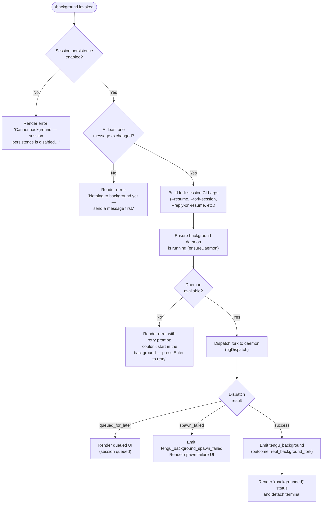

# `/background`

> Analysis basis: CC v2.1.162 bundle.js (AST extraction + Claude interpretation)
> Minimum version: v2.1.162

---

## Overview

The `/background` command (alias `/bg`) sends the current interactive REPL session into the background by forking it as a daemon-managed job, freeing the terminal for other use. It checks preconditions (session persistence enabled, at least one exchange recorded), dispatches the fork via the background daemon infrastructure, and renders a JSX status UI while waiting for the handoff to complete.

---

## Registration

| Field | Value |
|---|---|
| type | `local-jsx` |
| name | `background` |
| description | `Send this session to the background and free the terminal` |
| argumentHint | `[prompt]` |
| aliases | `["bg"]` |
| immediate | `null` |
| module_id | `ZLK` |
| load_inline | `true` |
| loc_byte | `13008892` |
| loc_byte_end | `13009132` |
| loc_line | `9555` |
| arbor_handler.name | `nxf` |
| arbor_handler.fqn | `claude-2.1.162::nxf` |
| arbor_handler.kind | `AsyncFunction` |
| arbor_handler.resolution_path | `module_id` |
| arbor_handler.n_hits | `0` |

Analysis basis: CC v2.1.162 bundle.js:+13008892

---

## Input Branching

The command follows 4+ distinct code paths depending on session state, so a Mermaid flowchart is used.



Analysis basis: CC v2.1.162 bundle.js:+13008176 – +13009132

---

## Behavioral Spec

### 1. Main Handler (`nxf`)

The Arbor-resolved handler is `nxf` (AsyncFunction, resolved via `module_id`).

```
async function backgroundCommandHandler(context):
    // Precondition: check session persistence
    if not sessionPersistenceEnabled(context):
        return renderError(
            "Cannot background — session persistence is disabled, so the forked job would have nothing to resume."
        )

    // Precondition: require at least one message
    if conversationIsEmpty(context):
        return renderError(
            "Nothing to background yet — send a message first."
        )

    // Build CLI argument list for the forked session
    args = buildForkArgs(context)
    // args includes flags like --resume, --fork-session, --reply-on-resume
    // and optionally --allowed-tools, --disallowed-tools, --model,
    // --effort, --permission-mode, --add-dir, prompt text

    // Ensure background daemon is reachable
    daemonStatus = await ensureDaemon()
    if daemonStatus is unavailable:
        emitTelemetry("tengu_background_spawn_failed")
        return renderRetryPrompt(
            "couldn't start in the background — press Enter to retry"
        )

    // Dispatch the fork
    dispatchResult = await bgDispatch(args)

    if dispatchResult.outcome == "queued_for_later":
        return renderQueuedUI(dispatchResult)

    if dispatchResult.outcome == "spawn_failed":
        emitTelemetry("tengu_background_spawn_failed")
        return renderSpawnFailureUI(dispatchResult)

    // Success path
    emitTelemetry("tengu_background", { outcome: "repl_background_fork" })
    return renderBackgroundedUI("(backgrounded)")
```

Analysis basis: CC v2.1.162 bundle.js:+13008176

### 2. Fork Argument Construction

```
function buildForkArgs(context):
    args = []
    args.push("--resume", sessionId)
    args.push("--fork-session")
    if replyOnResume:
        args.push("--reply-on-resume")
    if allowedTools.length > 0:
        args.push("--allowed-tools", ...allowedTools)
    if disallowedTools.length > 0:
        args.push("--disallowed-tools", ...disallowedTools)
    if model:
        args.push("--model", model)
    if effort:
        args.push("--effort", effort)
    if permissionMode:
        args.push("--permission-mode", permissionMode)
    for each additionalDir:
        args.push("--add-dir", dir)
    if promptText:
        args.push("--", promptText)
    return args
```

Analysis basis: CC v2.1.162 bundle.js:+13003742 (literals: `--resume`, `--fork-session`, `--reply-on-resume`), +13003849 (`--add-dir`), +13003884 (`--allowed-tools`), +13003956 (`--model`)

### 3. Guard: `bypassPermissions` and `auto` mode

Before dispatching, the handler enforces two interactive-consent gates:

```
function checkPermissionGates(context):
    if context.bypassPermissions and not bypassPermissionsConsentGiven:
        throw "--bg with bypassPermissions requires accepting the disclaimer first.\
               Run `claude --dangerously-skip-permissions` once interactively."

    if context.permissionMode == "auto" and not autoModeConsentGiven:
        throw "--bg with auto mode requires opting in first.\
               Run `claude --permission-mode auto` once interactively."
```

Analysis basis: CC v2.1.162 bundle.js:+13000806, +13000968

### 4. Flush Timeout

Before the fork is dispatched, the handler waits up to **2000 ms** for any pending output to flush (literal `"flush timeout"` at +13003691 with value `2000` at +13003686). This uses a race between the flush promise and a timeout.

```
function flushWithTimeout(flushPromise):
    timeout = 2000  // ms
    return Promise.race([
        flushPromise,
        delay(timeout)  // resolves as "flush timeout"
    ])
```

Analysis basis: CC v2.1.162 bundle.js:+13003686, +13003691

### 5. Daemon Ensure & Dispatch (`ensureDaemon` / `bgDispatch`)

The command relies on the daemon subsystem (`ensureDaemon` → `Gg`, `bgDispatch` → `VLA`). Key dispatch timeout is **6000 ms** for the ACK window. The no-ack sentinel string is `"no ack"`. See literals at +13003626 (`DM`), +12940295 (`ensureDaemon` entry), +12979231 (`"cli-bg-dispatch"`), +12979316 (`"no ack"`), +12979472 (6000).

### 6. "Already Backgrounded" Guard

If the current session is already running as a background job, a dedicated telemetry event is emitted and the command short-circuits without attempting another fork.

```
function alreadyBackgroundGuard(context):
    if context.isBackgroundSession:
        emitTelemetry("tengu_background_already_bg")
        return renderAlreadyBgMessage()
```

Analysis basis: CC v2.1.162 bundle.js:+13008190 (`tengu_background_already_bg`), +13008188

### 7. Session Type Label

After successful backgrounding, the session type tag in the daemon roster is set to `"background session"` and the rendered line shows `"(backgrounded)"`.

Analysis basis: CC v2.1.162 bundle.js:+16032436 (`"background session"`), +13005887 (`"(backgrounded)"`)

### 8. JSX Render Path

The command is registered as `local-jsx`, so the return value from `nxf` is a JSX element rather than plain text. The handler calls `gMH.createElement` (React/Ink) to compose the status widget at +13008503.

---

## State & Side Effects

| Item | Detail |
|---|---|
| Telemetry: `tengu_background` | Emitted on successful fork dispatch (bundle.js:+13005152) |
| Telemetry: `tengu_background_already_bg` | Emitted when session is already a background job (bundle.js:+13008190) |
| Telemetry: `tengu_background_spawn_failed` | Emitted when daemon spawn or dispatch fails (bundle.js:+13004365) |
| Telemetry: `tengu_repl_background_fork` (literal `"repl_background_fork"`) | Outcome field on `tengu_background` event (bundle.js:+13005020) |
| Telemetry: `tengu_bg_dispatch` | Emitted inside the dispatch subsystem for each attempt (bundle.js:+12981085) |
| Telemetry: `tengu_bg_dispatch_fallback` | Emitted when dispatch falls back to an alternate path (bundle.js:+12981615) |
| Telemetry: `tengu_bg_daemon_cold_start_ask` | Emitted when daemon is not running and user is prompted (bundle.js:+12941381) |
| Telemetry: `tengu_bg_daemon_spawn_failed` | Emitted if daemon transient spawn fails (bundle.js:+12941900) |
| Daemon state | Session transferred to daemon; daemon roster gains a new `"background session"` entry |
| Terminal | Terminal is freed (detached) after handoff; the controlling PTY is released |
| appState changes | Session phase transitions; `--fork-session` flag causes a new session node in the daemon's job map |
| File I/O | Dispatch file written to a temp directory (prefix `"tmp"`, 8 random bytes); removed on completion or failure (bundle.js:+12983616, +12983637, +12983588) |
| Hook registration | `jJA.register` called inside the session-registration path (bundle.js:+60123) |
| Sound | None detected in depth-2 traversal |

---

## Version History

| Version | Change |
|---|---|
| v2.1.162 | Initial analysis |

---

## Common Mistakes

1. **Invoking `/background` before sending any message** — the command requires at least one exchange to have occurred in the session; otherwise it returns `"Nothing to background yet — send a message first."` and does nothing.
2. **Using `/background` with `--dangerously-skip-permissions` without prior interactive consent** — the handler enforces an interactive-consent gate; attempting to background a `bypassPermissions` session without having run the flag interactively at least once will produce a hard error.
3. **Using `/background` with `--permission-mode auto` without prior interactive opt-in** — same gate as above applies to `auto` mode.
4. **Expecting `/background` to work when session persistence is disabled** — if persistence is turned off, the command immediately returns an error because the forked job would have no session to resume.
5. **Assuming immediate detach** — there is a flush timeout of up to 2000 ms before the fork is dispatched; the terminal is not freed instantaneously.
6. **Re-invoking `/background` on a session already in the background** — the command detects this state, emits `tengu_background_already_bg`, and short-circuits without creating a duplicate job.

---

## Appendix — Identifier Mapping

> For bundle debugging only. Identifiers change across versions.

| Identifier | Role |
|---|---|
| `nxf` | Main handler for `/background` command (AsyncFunction, Arbor-resolved) |
| `NC8` | Background CLI dispatch coordinator (top-level call graph root) |
| `k0` | Session list/value extractor utility |
| `K` | Session map / roster map |
| `L` | Session lifecycle / worker lifecycle object |
| `q` | Active session or socket set |
| `f` | Session connection or promise chain |
| `A` | Session store or connection map |
| `DM` | Session state filter / Boolean coercion helper |
| `CLA` | Register session or command registration helper |
| `U4` | Registration or context builder |
| `J9` | Hook or event registration |
| `gL` | Flush-with-timeout utility (uses `setTimeout`, `Promise.race`, `clearTimeout`) |
| `YT` | Session context builder |
| `gK6` | CLI flag constant set |
| `Y` | Forced-shutdown / abort orchestrator |
| `Nj` | Shutdown notification emitter |
| `z` | Daemon stop/abort controller |
| `hH` | Feature-ok telemetry emitter |
| `c` | Core logger / error reporter |
| `Z6` | Feature-bad / feature-sad telemetry emitter |
| `RH` | Feature-bad telemetry emitter (error variant) |
| `Kh` | Daemon control event emitter |
| `ex` | Health check helper |
| `ZNH` | Queue helper |
| `iJ_` | Event emitter / UUID generator |
| `jp` | Graceful shutdown orchestrator (Promise.race/all, exit) |
| `Bd` | MCP shutdown helper |
| `dd` | Timeout clear helper |
| `n8` | Abort-state machine (aborted/abort signals) |
| `X` | IPC message framer / binary protocol handler |
| `j` | IPC message buffer / index map |
| `w` | Background session worker manager (spawn, kill, claim) |
| `S` | Worker process write/kill helper |
| `H` | Bootstrap fetch / app-state manager |
| `zC8` | Platform memory check (macOS, 1024 MB) |
| `Gj6` | Config file reader (utf-8, readFile) |
| `kH` | Log-error helper |
| `F` | Worker retire/settle helper |
| `j6` | Background session state machine (has, get, add) |
| `yzA` | Socket claim and connect helper |
| `xzA` | Session lifecycle manager (add, delete, roster entry, rm) |
| `V8` | Version/build constant |
| `C` | Repaint queue / UUID helper |
| `Y5` | Socket end/serialize helper |
| `SH` | JSON.stringify wrapper |
| `xK5` | IPC protocol handler (ping, nudge, yield, lease, dispatch, reply, attach, snapshot, stream, state) |
| `p6` | JSON.parse wrapper |
| `uK5` | IPC ack helper |
| `$` | Output write stream |
| `p1K` | Output frame writer (Date.now, GS6) |
| `M` | MCP connection manager (get, values, ROA) |
| `RCH` | MCP slot configuration applier |
| `xp8` | MCP connection result applier |
| `v` | Debug/message formatter |
| `ROA` | MCP retry/reconnect orchestrator |
| `Xz` | Background session anchor helper |
| `$YH` | Amber anchor telemetry helper |
| `RzA` | Protocol version checker |
| `JCK` | Dispatch timeout/retry handler (Date.now, Math.min, kH) |
| `_` | Generic array/set utility |
| `P` | Terminal repaint manager (Ink/React root) |
| `J` | Worker kill-all helper |
| `D` | Terminal output driver (write, stop, start, updateConfig) |
| `h` | Terminal scroll/focus helper |
| `YMA` | Vim-mode state reducer |
| `Hq` | File state reader (stat, readFile, mLH cache) |
| `R8` | Build-version constant reader |
| `rf` | Version byte constant |
| `CK` | Config dir path builder |
| `mE` | Config base path helper |
| `zHH` | Working-tree / link-scan path resolver |
| `rz` | Realpath resolver |
| `Ex` | Path existence checker |
| `fE` | Directory recursive scanner |
| `AX4` | File line-reader (open, createInterface, createReadStream) |
| `CK5` | Dim/max helper for terminal sizing |
| `p` | Write-with-clear helper |
| `b` | Interval-based poll helper |
| `V` | Timer/interval reference |
| `d1H` | Debug log helper |
| `bK5` | Session stall detector (getPhase, kill) |
| `y` | Away-summary scheduler |
| `VT8` | App-state getter |
| `e85` | Away-summary cache params getter |
| `xVK` | Away-summary suppression check |
| `U38` | CacheSafeParams-based away-summary runner |
| `Zhq` | Random UUID generator (Sk.randomUUID) |
| `Q` | Output frame queue (setTimeout, write, Math.round) |
| `a` | Voice/process lifecycle controller |
| `G` | MCP server list helper |
| `g` | Process kill/hang handler |
| `i` | MCP update applier |
| `u` | Interval clear helper |
| `r` | MCP connection batch updater |
| `PB` | Async iterator / streaming mapper |
| `I_6` | parseInt wrapper (tool count) |
| `Xv8` | parseInt wrapper (version) |
| `d` | MCP daemon update helper (Wy6, Ppq) |
| `HH` | Voice toggle handler |
| `SCH` | MCP server connection result serializer |
| `TH` | String coercer |
| `l` | Main event loop / turn orchestrator |
| `W` | SDK client orchestrator |
| `$P6` | Token budget calculator |
| `h58` | Token budget max helper |
| `gvK` | Boolean coercion helper |
| `ue` | Permission set has-check |
| `q_H` | Permission filter helper |
| `bb6` | Socket write/destroy helper |
| `dn` | Background fork CLI builder (mkdir, UUID, args) |
| `dxf` | CLI arg parser — flags branch |
| `KLA` | Remote-flag prefix checker |
| `cn` | Session command slice helper |
| `AU` | Settings loader (userSettings, localSettings) |
| `m8` | Settings merge helper |
| `C6` | Config context builder (Date.now, file watcher) |
| `i6` | Config directory resolver |
| `zj_` | Config path normalizer |
| `DYH` | Config file parser (readFileSync, statSync, mkdirSync) |
| `bWL` | Config file watcher (watchFile, unwatchFile) |
| `QQ` | Auto-mode sentinel checker |
| `xxf` | Full background dispatch pipeline |
| `PLK` | `--resume` / `-r` flag parser |
| `lxf` | `--agent` flag parser |
| `TC8` | `--session-id` flag parser |
| `GLK` | Generic flag group parser |
| `WLK` | `--continue` / `-c` flag parser |
| `x6` | Async local storage context accessor |
| `RQ6` | Store getter |
| `X_` | Environment variable resolver (Nv) |
| `ff` | Atomic file writer (randomBytes, writeFile, rename) |
| `ez` | Atomic write implementation |
| `iJ` | File cache invalidator |
| `h8H` | Path redaction helper |
| `V4` | Path anonymizer (replace, lastIndexOf) |
| `LLK` | Arg list mapper |
| `bxf` | Dispatch error classifier |
| `pQ6` | Log output helper |
| `Qxf` | Arg prefix slicer |
| `VLA` | CLI-bg-dispatch main routine (socket, UUID, mkdir) |
| `rS6` | Dispatch result handler |
| `Gg` | Ensure-daemon orchestrator (cold-start, spawn) |
| `TLA` | Dispatch outcome text formatter |
| `Uk8` | Control socket connect with ack |
| `VbH` | Socket path builder |
| `Lz` | Low-level control socket framer |
| `MLK` | Dispatch timeout handler |
| `fQ` | Fork rescue helper |
| `mxf` | Fork mode selector |
| `c6H` | Background session context helper |
| `Q4H` | Session anchor context builder |
| `Ue` | Session unlink helper |
| `OR` | Retry-prompt renderer |
| `poH` | Queued-for-later renderer |
| `VjH` | Spawn-failed renderer |
| `t6` | Feature telemetry (ok/sad path) |
| `A16` | Session rename / fork orchestrator |
| `ae_` | Rename timing helper |
| `UK6` | Rename telemetry |
| `SWf` | Fork session runner |
| `S_H` | AbortSignal helper |
| `$G` | Agent fork query runner |
| `AZ8` | App-state mutation helper |
| `qZ8` | Fork state builder |
| `dh` | Random bytes helper (xx9.randomBytes) |
| `J1H` | ZCH context builder |
| `um` | Subagent exit telemetry emitter |
| `zk6` | BLf tombstone checker |
| `B1H` | Stream event builder |
| `vI8` | Message delta builder |
| `Qyq` | Tombstone check wrapper |
| `r7H` | Filter helper (Kj, cM7) |
| `B5f` | Feature error path (c, Z6) |
| `b8` | Random UUID + payload helper |
| `Tlq` | Trim/clean arg helper |
| `yR` | String trim wrapper |
| `zh8` | Array join/slice helper |
| `kh` | Prompt context builder (A4, VN8, b8, fxH) |
| `A4` | Tool permission context helper |
| `VN8` | Context message builder (hash, readFile, writeFile) |
| `ZN8` | Context type checker |
| `nE` | Tool schema builder |
| `u_f` | Context message mapper |
| `pZq` | Prompt fragment helper |
| `fxH` | Fork context assembler (_a_, n5K) |
| `_a_` | Context entry appender |
| `n5K` | Main query runner (API call, streaming, tool dispatch) |
| `q2` | Prompt formatter (wA, Hf, u7_) |
| `wA` | tH wrapper |
| `Hf` | Prompt header builder |
| `u7_` | Managed-key prefix stripper |
| `a1` | Auth resolver (oHH, qq, rX) |
| `LQH` | G5 auth helper |
| `CE` | Context-error renderer |
| `iK` | Tool array filter |
| `ZO` | Compact boundary slicer |
| `iv8` | Kj wrapper |
| `Kj` | Compact boundary marker |
| `PwH` | File permission writer (CK, Hq, iJ, ff) |
| `vC8` | Command context builder (iB, Qv8, nh, U1H) |
| `iB` | Array.isArray check wrapper |
| `O` | x8 wrapper (output) |
| `x8` | Raw output object |
| `Qv8` | Some-check helper |
| `nh` | fn wrapper |
| `fn` | Tool filter dispatcher |
| `U1H` | startsWith auth prefix checker |
| `g$` | S6+U4 builder |
| `S6` | Nv builder |
| `Nv` | Core module export resolver |
| `nF` | S6+U4 alt builder |
| `nxf` | **`/background` command handler** (see Registration) |
| `T9` | szH daemon-worker entry point |
| `szH` | Daemon worker bootstrap |
| `t5H` | Detach-request / task state handler |
| `yt6` | Task helper |
| `Ibq` | zI8 / x8 state helper |
| `zI8` | State code helper |
| `It` | vt.write / SH serializer |
| `X0H` | tH / T7K / Hx environment builder |
| `tH` | String constructor wrapper |
| `T7K` | Test/production environment selector |
| `Hx` | Environment tag resolver |

---

Note: index built via Arbor fallback; some signals (telemetry, literals) may be missing — see arbor-fallback.js.