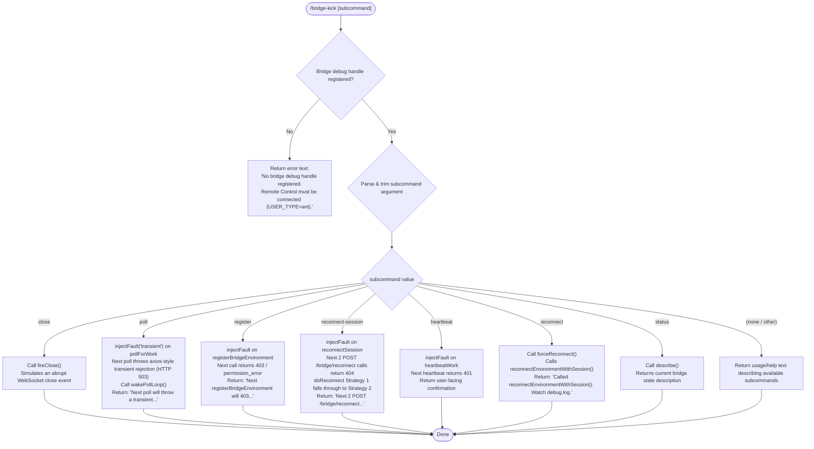

# `/bridge-kick`

> Analysis basis: CC v2.1.162 bundle.js (AST extraction + Claude interpretation)
> Minimum version: v2.1.162

---

## Overview

`/bridge-kick` is a local developer/testing command that injects synthetic bridge failure states into a running Claude Code session so that manual recovery flows can be exercised without a real network outage. It is only functional when a bridge debug handle is registered — meaning the session must be operating under the Remote Control / `USER_TYPE=ant` environment. The command exposes several named fault scenarios through a subcommand argument and calls the appropriate fault-injection or reconnect method on the live bridge handle.

---

## Registration

| Field | Value |
|---|---|
| type | `local` |
| name | `bridge-kick` |
| description | Inject bridge failure states for manual recovery testing |
| supportsNonInteractive | `false` |
| load_inline | `true` |
| load_ident | `nIf` |
| loc_byte | `12526743` |
| loc_byte_end | `12526927` |
| loc_line | `8918` |
| arbor_handler.name | `nIf` |
| arbor_handler.fqn | `claude-2.1.162::nIf` |
| arbor_handler.kind | `AsyncFunction` |
| arbor_handler.resolution_path | `load_ident` |
| arbor_handler.n_hits | `0` |

Analysis basis: CC v2.1.162 bundle.js:+12526743

---

## Input Branching

The handler parses a raw text argument into a subcommand string, then dispatches across seven distinct named fault scenarios (plus a default "describe/usage" path). This exceeds the three-branch threshold, so a Mermaid flowchart is used.



---

## Behavioral Spec

### Guard: Require Bridge Debug Handle

Before any subcommand logic executes, the handler checks whether a bridge debug handle object is registered in the current session. If the handle is absent (i.e., the session is not running under `USER_TYPE=ant` with Remote Control active), the command immediately returns a `text`-type message:

```
"No bridge debug handle registered. Remote Control must be connected (USER_TYPE=ant)."
```

Analysis basis: CC v2.1.162 bundle.js:+12524526, +12524539

```
async function bridgeKickHandler(args, context):
    handle = lookupBridgeDebugHandle()           // E8K
    if handle is null or undefined:
        return { type: "text", content: NO_HANDLE_ERROR_MSG }

    rawInput = args.trim()                       // H.trim at +12524638
    subcommand = parseSubcommand(rawInput)
    return dispatchSubcommand(handle, subcommand)
```

### Subcommand Parsing

The raw input string is trimmed and matched against the set of known subcommand literals. No case-folding is described in the depth-2 traversal for the top-level dispatcher — the values are matched as-is after trimming.

Analysis basis: CC v2.1.162 bundle.js:+12524638

### Fault Scenario: `close`

Calls `handle.fireClose()` on the bridge debug handle. This simulates an abrupt WebSocket close, exercising the teardown and reconnection path without a real network drop.

Analysis basis: CC v2.1.162 bundle.js:+12524791 (literal `"close"` at +12524674)

```
case "close":
    handle.fireClose()
    return successMessage()
```

### Fault Scenario: `poll`

Injects a `"transient"` fault into the `pollForWork` loop, then immediately wakes the poll loop so the fault fires on the very next iteration. The injected fault manifests as an axios-style rejection carrying HTTP status `503`.

- Fault type literal: `"transient"` (bundle.js:+12524920)
- Target method literal: `"pollForWork"` (bundle.js:+12524961)
- HTTP status injected: `503` (bundle.js:+12524999)
- Return message: `"Next poll will throw a transient (axios rejection). Poll loop woken."` (bundle.js:+12525049)

Analysis basis: CC v2.1.162 bundle.js:+12524939, +12525013

```
case "poll":
    handle.injectFault("transient", target="pollForWork", httpStatus=503)
    handle.wakePollLoop()
    return { type: "text", content: POLL_TRANSIENT_MSG }
```

### Fault Scenario: `register`

Injects a fault into the next `registerBridgeEnvironment` call. That call will return HTTP `403` with error type `"permission_error"`. The operator must then trigger a close/reconnect to observe the failure.

- HTTP status: `403` (bundle.js:+12525597)
- Error type: `"permission_error"` (bundle.js:+12525611)
- Target: `"registerBridgeEnvironment"` (bundle.js:+12525549)
- Return message: `"Next registerBridgeEnvironment will 403. Trigger with close/reconnect."` (bundle.js:+12525659)

Analysis basis: CC v2.1.162 bundle.js:+12524939, +12525493

```
case "register":
    handle.injectFault("permission_error", target="registerBridgeEnvironment", httpStatus=403)
    return { type: "text", content: REGISTER_403_MSG }
```

### Fault Scenario: `reconnect-session`

Injects a fault causing the next **two** `POST /bridge/reconnect` calls to return `404` with error type `"not_found_error"`. This exercises the doReconnect strategy fallthrough: Strategy 1 (primary reconnect path) fails, causing the session to fall through to Strategy 2.

- HTTP status: `404` (bundle.js:+12525249)
- Error type: `"not_found_error"` (bundle.js:+12525253)
- Target: `"reconnectSession"` (bundle.js:+12526017)
- Fault count: 2 consecutive calls (bundle.js:+12526117)
- Return message: `"Next 2 POST /bridge/reconnect calls will 404. doReconnect Strategy 1 falls through to Strategy 2."` (bundle.js:+12526117)

Analysis basis: CC v2.1.162 bundle.js:+12524939, +12525968

```
case "reconnect-session":
    handle.injectFault("not_found_error", target="reconnectSession", httpStatus=404, count=2)
    return { type: "text", content: RECONNECT_SESSION_404_MSG }
```

### Fault Scenario: `heartbeat`

Injects a fault into the `heartbeatWork` mechanism. The next heartbeat call will return HTTP `401`. This simulates an authentication expiry scenario mid-session.

- HTTP status: `401` (bundle.js:+12526252)
- Target: `"heartbeatWork"` (bundle.js:+12526285)
- Fault type: `"authentication_error"` (bundle.js:+12525271)

Analysis basis: CC v2.1.162 bundle.js:+12524939, +12526222

```
case "heartbeat":
    handle.injectFault("authentication_error", target="heartbeatWork", httpStatus=401)
    return { type: "text", content: HEARTBEAT_401_MSG }
```

### Fault Scenario: `reconnect`

Calls `handle.forceReconnect()` directly, which internally calls `reconnectEnvironmentWithSession()`. This is an active trigger (not a fault injection) — it forces an immediate reconnect cycle. The operator is directed to monitor `debug.log` for the result.

- Return message: `"Called reconnectEnvironmentWithSession(). Watch debug.log."` (bundle.js:+12526556)

Analysis basis: CC v2.1.162 bundle.js:+12526518

```
case "reconnect":
    handle.forceReconnect()
    return { type: "text", content: FORCE_RECONNECT_MSG }
```

### Fault Scenario: `status`

Calls `handle.describe()`, which returns a human-readable snapshot of the current bridge state (connection status, pending faults, etc.). Output is returned as-is to the user.

Analysis basis: CC v2.1.162 bundle.js:+12526656

```
case "status":
    description = handle.describe()
    return { type: "text", content: description }
```

### Default / Usage Path

When the subcommand argument is absent or does not match any known keyword, the handler returns a usage summary listing the available subcommands. The exact text is <!-- TODO: not found in depth-2 traversal; needs --depth 4 -->, but the subcommand keys inferred from literals are: `close`, `poll`, `register`, `reconnect-session`, `heartbeat`, `reconnect`, `status`.

### Fatal Fault Type Literal

The literal `"fatal"` appears in the implementation (bundle.js:+12525343), suggesting there may be an additional fault severity level used internally when constructing injected errors, though no top-level subcommand named `fatal` is present in the dispatch logic at depth-2.

---

## State & Side Effects

| Item | Detail |
|---|---|
| Telemetry | `tengu_feature_sad` (bundle.js:+1008376) — emitted via the `c`/`Z6` path in the call graph, likely on error/parse-failure paths |
| Bridge debug handle | Read from a session-scoped registry via `E8K` (lookupBridgeDebugHandle); no persistent write |
| Fault injection state | `handle.injectFault(...)` mutates in-memory bridge state; faults are consumed on next matching bridge call |
| Poll loop | `handle.wakePollLoop()` (for `poll` subcommand only) sends an immediate wake signal to the background poll loop |
| Reconnect trigger | `handle.forceReconnect()` (for `reconnect` subcommand) initiates an async reconnect cycle; side effects visible in `debug.log` |
| appState changes | None directly observed at depth-2 |
| Sound | None observed |
| supportsNonInteractive | `false` — command must not be used in non-interactive/piped mode |

---

## Version History

| Version | Change |
|---|---|
| v2.1.162 | Initial analysis |

---

## Common Mistakes

1. **Running without Remote Control active**: The most common failure mode. The command silently returns the `"No bridge debug handle registered"` error if `USER_TYPE=ant` is not set and Remote Control is not connected. Always verify the session environment before using this command.
2. **Expecting immediate visible failure on `register` or `reconnect-session`**: These subcommands only *inject* a fault that fires on the *next* relevant bridge call. After injecting, you must manually trigger the relevant bridge operation (e.g., close/reconnect for `register`) to observe the failure.
3. **Confusing `reconnect` with `reconnect-session`**: `reconnect` calls `forceReconnect()` immediately and actively reconnects; `reconnect-session` injects a 404 fault into the passive reconnect path to test strategy fallthrough. They exercise different code paths.
4. **Using in non-interactive mode**: `supportsNonInteractive: false` means the command will not function correctly in scripted or piped invocations.
5. **Forgetting fault count for `reconnect-session`**: The injected fault fires on the **next two** `/bridge/reconnect` POST calls. Only after both attempts fail will Strategy 2 activate — a single reconnect attempt will not complete the test.

---

## Appendix — Identifier Mapping

> For bundle debugging only. Identifiers change across versions.

| Identifier | Role |
|---|---|
| `nIf` | Main handler for `/bridge-kick` (AsyncFunction); registered via `load_ident` inline shape |
| `E8K` | Bridge debug handle lookup — retrieves the registered debug handle from the session |
| `H` | Bootstrap/fetch utility (context-dependent); used for HTTP fetch and string operations |
| `v` | Generic output/response builder utility; constructs return values from subcommand results |
| `PgK` | Response formatting helper called by `v` |
| `PJA` | Sub-utility within response formatting |
| `SH` | JSON serialisation helper (`JSON.stringify` wrapper) |
| `V4` | String/path manipulation utility (replace, slice, lastIndexOf) |
| `rXA` | Map-based utility for building structured arrays |
| `q` | File-system utility (unlink, at) |
| `A` | Lowercase/path segment utility |
| `WpH` | Write-stream helper |
| `pXA` | Low-level write wrapper |
| `EgK` | Conversation/log file write coordinator (mkdir, appendFile, rename) |
| `dmH` | Debounce/batch scheduler (clearTimeout, setTimeout, setImmediate, join/push queues) |
| `E3H` | Log line formatter (joins path segments, calls `s8`, `S6`) |
| `i6` | <!-- TODO: not found in depth-2 traversal; needs --depth 4 --> |
| `zL6` | EISDIR error handler (stat guard) |
| `_PA` | Path join + S6 helper |
| `HPA` | File rotation handler (stat, endsWith `.txt`, rename, unlink) |
| `GgK` | Bound file-append callback (mkdir → appendFile → rotate → size check) |
| `J9` | Hook/event registration (`jJA.register`) |
| `_3` | <!-- TODO: not found in depth-2 traversal; needs --depth 4 --> |
| `AY_` | Argument string parser (split, trim, indexOf, slice) |
| `LHH` | Set membership check (`Y94.has`) |
| `bJ` | String replacement utility (`H.replace`) |
| `a1` | Top-level command argument processor |
| `oHH` | Inner argument processing pipeline |
| `k0` | <!-- TODO: not found in depth-2 traversal; needs --depth 4 --> |
| `OqH` | <!-- TODO: not found in depth-2 traversal; needs --depth 4 --> |
| `Dd` | Token/word analysis helper (trim, map, startsWith, includes checks) |
| `qq` | Model/provider resolution utility (toLowerCase, replace, includes) |
| `Q0` | Provider lookup helper (`BKH`) |
| `pKH` | Model inclusion checker (`mKH.includes`) |
| `qI` | Provider-specific resolver (`UM`, `G5`) |
| `LQH` | Alternative provider resolver (`G5`) |
| `PE` | First-party provider handler (`UM`, `G5`, `wA`, `"firstParty"`) |
| `RJ1` | "Best" model resolver (delegates to `PE`) |
| `UM` | AWS/anthropicAws provider wrapper (`wA`) |
| `Xt6` | Provider include-list checker (`z8L.includes`) |
| `fQH` | Fetch/transport helper (`tH`) |
| `rX` | Model selection router (`qq`, `g0`) |
| `g0` | Full model resolution pipeline (WA, H6H, ozH, MQH, PE, A2, UM, wA, G5, qI) |
| `t6` | Telemetry bootstrap (`c`, `Z6`; emits `tengu_feature_sad`) |
| `c` | Core telemetry emitter |
| `Z6` | Telemetry event dispatcher |
| `Zx6` | Low-level telemetry transport |

---

Note: index built via Arbor fallback; some signals (telemetry, literals) may be missing — see arbor-fallback.js.