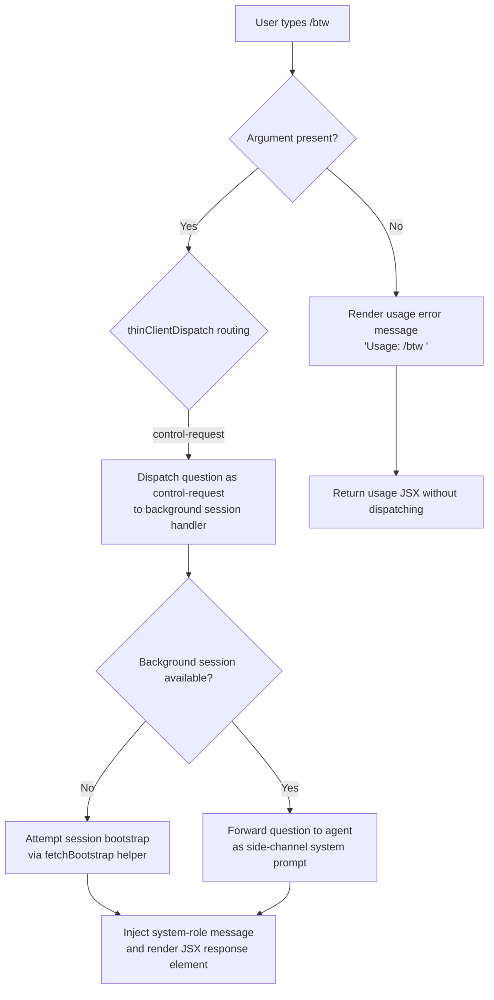

# `/btw`

> Analysis basis: CC v2.1.162 bundle.js (AST extraction + Claude interpretation)
> Minimum version: v2.1.162

---

## Overview

`/btw` ("by the way") allows the user to ask a quick side question without interrupting or derailing the main conversation thread. It is typed as an immediate, local-JSX command that dispatches a `control-request` to the thin-client layer, passing the inline question as a subordinate prompt processed outside the primary turn context.

---

## Registration

| Field | Value |
|---|---|
| type | `local-jsx` |
| name | `btw` |
| description | Ask a quick side question without interrupting the main conversation |
| argumentHint | `<question>` |
| immediate | `true` |
| thinClientDispatch | `control-request` |
| module_id | `YCq` |
| load_inline | `true` |
| loc_byte | `10898668` |
| loc_byte_end | `10898907` |
| loc_line | `7130` |
| arbor_handler.name | `XMf` |
| arbor_handler.fqn | `claude-2.1.162::XMf` |
| arbor_handler.kind | `AsyncFunction` |
| arbor_handler.resolution_path | `module_id` |
| arbor_handler.n_hits | `0` |

Analysis basis: CC v2.1.162 bundle.js:+10898668

---

## Input Branching

The command has three distinct execution paths based on argument presence and dispatch routing:



Analysis basis: CC v2.1.162 bundle.js:+10898264, +10898266, +10898305, +10898374

---

## Behavioral Spec

### 1. Command Entry Point — Async Handler

The Arbor-resolved handler `XMf` (AsyncFunction, `claude-2.1.162::XMf`) is the main entry point.

```
async function btwCommandHandler(commandInput, appContext):
    question = extractArgument(commandInput)

    if question is empty or missing:
        return renderUsageError("Usage: /btw <your question>")

    systemMessage = buildSystemMessage(question)
    sessionRef   = await resolveOrBootstrapSession(appContext)

    return renderJSXResponse(systemMessage, sessionRef)
```

Analysis basis: CC v2.1.162 bundle.js:+10898264, +10898328, +10898374

---

### 2. Usage Guard

When the user invokes `/btw` with no argument, the handler short-circuits and returns a JSX element containing the literal usage string.

```
function renderUsageError():
    return JSXElement(text = "Usage: /btw <your question>")
```

Literal constant: `"Usage: /btw <your question>"` (bundle.js:+10898266)

---

### 3. System-Role Message Construction

The question text is wrapped in a `system`-role message object before being forwarded to the agent. The role string `"system"` is a literal constant in the implementation.

```
function buildSystemMessage(questionText):
    return { role: "system", content: questionText }
```

Literal constant: `"system"` (bundle.js:+10898305)

Analysis basis: CC v2.1.162 bundle.js:+10898305

---

### 4. Session Bootstrap and Fetch

When no live session handle is immediately available, the handler calls the bootstrap fetch helper (resolved as `sessionBootstrapFetcher` in pseudocode), which:

1. Logs `"[Bootstrap] Fetching"` at debug level (bundle.js:+15590993).
2. Sets `Content-Type: application/json` and `User-Agent` headers (bundle.js:+15591078, +15591112).
3. Waits up to **5000 ms** for the network response (bundle.js:+15591194).
4. On parse failure, records `"parse_failed"` under the `"api_bootstrap_fetch"` event category (bundle.js:+15591315, +15591337).
5. On success, logs `"[Bootstrap] Fetch ok"` (bundle.js:+15591367).

```
async function sessionBootstrapFetcher(endpoint, options):
    log("[Bootstrap] Fetching")
    set headers { "Content-Type": "application/json", "User-Agent": <agent> }
    response = await fetch(endpoint, timeout=5000)

    if parseError:
        emit("api_bootstrap_fetch", { status: "parse_failed" })
        return null

    log("[Bootstrap] Fetch ok")
    return parsedSession
```

Analysis basis: CC v2.1.162 bundle.js:+15590991, +15591194

---

### 5. Control-Request Dispatch

Because `thinClientDispatch` is set to `"control-request"`, the question bypasses the normal user-turn pipeline. The dispatcher resolves call edges through `messageDispatcher` → `buildMessagePayload` → file-persistence helpers.

Key sub-operations observed in the call graph:

- **Payload serialization**: `JSON.stringify` called via `payloadSerializer` (bundle.js:+184938).
- **File write**: streamed through `streamWriter` → `writeStream` (bundle.js:+192975, +193039).
- **Directory management**: `mkdirSync`, `appendFile`, and `renameSync` operations manage spool files for the background agent (bundle.js:+205060, +205119).
- **Lock management**: config lock acquisition with contention guard; lock wait exceeding threshold emits telemetry (see State & Side Effects).

```
async function dispatchControlRequest(systemMessage, sessionRef):
    payload = JSON.stringify(systemMessage)
    ensureSpoolDirectory(sessionRef.spoolPath)
    writePayloadToSpool(payload, sessionRef.spoolPath)
    rotateSpool(sessionRef.spoolPath)
    notifyBackgroundAgent(sessionRef)
```

Analysis basis: CC v2.1.162 bundle.js:+10898328, +184938, +205060

---

### 6. JSX Response Rendering

After dispatch succeeds (or on usage error), `p4.createElement` is called to produce the React element returned to the CLI renderer.

```
function renderJSXResponse(content):
    return p4.createElement(ResponseComponent, { content: content })
```

Analysis basis: CC v2.1.162 bundle.js:+10898374

---

### 7. Config Persistence Sub-system

Several call-graph paths reach the config read/write subsystem (`configReader`, `configWriter`, `configLockAcquirer`). Key behavioral facts:

- Config files are read with encoding `"utf-8"` (bundle.js:+3256586).
- Auth-loss prevention: if a re-read config is missing auth data that the in-memory cache holds, the write is refused to avoid wiping `~/.claude.json` (bundle.js:+3254886, +3251580).
- Backup rotation: up to **5** backup files are kept; backups use the `.backup.` infix pattern (bundle.js:+3255489, +3255356).
- Backup files are stored under a `"backups"` subdirectory (bundle.js:+3256071).
- Lock contention timeout: **60000 ms** (bundle.js:+3255240).
- Lock contention warning: `"Lock acquisition took longer than expected - another Claude instance may be running"` (bundle.js:+3254470).
- File mode for new config files: octal `600` (decimal `384`) (bundle.js:+3255771).

---

### 8. Background Session / Daemon Management

The call graph reaches the background-session manager (`daemonSessionManager`) through the `control-request` dispatch path.

Key constants observed:

- Shutdown grace period: **30 s** then **15 s** escalation before `SIGKILL` (bundle.js:+15996328, +15996339, +15996421).
- Memory threshold for low-memory dispatch: checked via `os.freemem()` with a `1024`-byte granularity (bundle.js:+15996868).
- Spare session pool uses strings `"spare"`, `"exec"`, `"claimed"` as state tokens (bundle.js:+15997165, +15997288, +15997944).
- Session de-duplication statuses: `"dup-live"`, `"dropped"` (bundle.js:+15996787, +15996739).

---

## State & Side Effects

| Item | Detail |
|---|---|
| Telemetry — `tengu_feature_sad` | Emitted on feature-level failure path (bundle.js:+1008376) |
| Telemetry — `tengu_config_lock_contention` | Emitted when config lock wait exceeds threshold (bundle.js:+3254559) |
| Telemetry — `tengu_config_stale_write` | Emitted when a stale config write is detected (bundle.js:+3254695) |
| Telemetry — `tengu_config_parse_error` | Emitted when config JSON fails to parse (bundle.js:+3257134) |
| Telemetry — `tengu_config_auth_loss_prevented` | Emitted when write is refused to prevent auth data loss (bundle.js:+3255038) |
| Telemetry — `tengu_bg_dispatch_sigkill_escalate` | Emitted when SIGKILL escalation occurs in background dispatch (bundle.js:+15996373) |
| Telemetry — `tengu_bg_dispatch_low_mem` | Emitted when low memory condition is detected during dispatch (bundle.js:+15996974) |
| Telemetry — `tengu_bg_spare_enable` | Emitted when a spare session slot is enabled (bundle.js:+15997678) |
| Telemetry — `tengu_bg_spare_claim` | Emitted when a spare session is successfully claimed (bundle.js:+15997806) |
| Telemetry — `tengu_bg_spare_claim_fail` | Emitted when spare session claim fails (bundle.js:+15998072) |
| Telemetry — `tengu_daemon_control` | Emitted on daemon control operations (bundle.js:+16032559) |
| Telemetry — `tengu_daemon_config_reload` | Emitted when daemon reloads configuration (bundle.js:+16011003) |
| thinClientDispatch | Sends a `control-request` to the thin-client layer; bypasses normal user-turn pipeline |
| immediate | `true` — command is processed immediately without waiting for turn completion |
| Config side effects | May read and write `~/.claude.json`; auth-loss prevention guards are active |
| Spool file I/O | Creates/appends/renames files in the background spool directory |
| Background session | May spawn, stop, or reclaim a background Claude daemon process |
| Hook registration | `jJA.register` called via hook-registration helper (bundle.js:+60123) |
| Sound | No sound side-effects observed in depth-2 traversal |

---

## Version History

| Version | Change |
|---|---|
| v2.1.162 | Initial analysis |

---

## Common Mistakes

1. **Omitting the argument**: Invoking `/btw` with no text produces only a usage-error JSX element — no message is dispatched to the agent. Always supply the `<question>` argument.
2. **Expecting main-turn context**: Because `/btw` uses `thinClientDispatch: "control-request"`, the side question is routed outside the active user turn. Answers may appear asynchronously and will not appear inline in the current conversation turn.
3. **Confusing with a blocking command**: The `immediate: true` flag means the command fires before the current input buffer is submitted. Do not rely on prior unsent input being visible to the side question.
4. **Using during daemon contention**: If another Claude instance holds the config lock, the dispatch may be delayed by up to 60 000 ms and will emit `tengu_config_lock_contention`. Avoid running concurrent Claude instances when using `/btw` for time-sensitive questions.
5. **Expecting persistent context**: The side question is a one-shot `system`-role injection, not a persistent sub-thread. The background agent does not accumulate `/btw` history across invocations.

---

## Appendix — Identifier Mapping

> For bundle debugging only. Identifiers change across versions.

| Identifier | Role |
|---|---|
| `XMf` | Main async handler for `/btw` (Arbor-resolved, `AsyncFunction`) |
| `H` | Session bootstrap fetcher / HTTP fetch wrapper |
| `v` | Message payload builder / message formatter |
| `PgK` | Message dispatch helper |
| `PJA` | Sub-dispatch router |
| `SH` | JSON payload serializer |
| `V4` | Path / filename utility |
| `rXA` | Path-map iterator |
| `WpH` | Stream write orchestrator |
| `pXA` | Low-level write stream helper |
| `EgK` | File spool manager (mkdir, append, rotate) |
| `dmH` | Debounced timeout scheduler |
| `E3H` | Spool path join helper |
| `i6` | File existence / stat check helper |
| `zL6` | Directory validator |
| `_PA` | Path join + stat helper |
| `HPA` | File rename / unlink helper |
| `GgK` | File append + rotate callback (bound) |
| `J9` | Hook registration caller |
| `_3` | Session-ref extractor |
| `AY_` | Argument string splitter / trimmer |
| `LHH` | Session set membership checker |
| `bJ` | String replacement sanitizer |
| `a1` | Model resolution / normalization entry |
| `oHH` | Model config builder |
| `k0` | Model ID validator |
| `OqH` | Model capability checker |
| `Dd` | Model string parser (trims, maps, checks prefixes) |
| `qq` | Model normalization pipeline |
| `Q0` | Fuzzy model alias resolver |
| `pKH` | Model list inclusion checker |
| `qI` | Provider + generation selector |
| `LQH` | Generation lookup helper |
| `PE` | Provider / generation extractor |
| `RJ1` | Provider wrapper |
| `UM` | Provider type resolver |
| `Xt6` | Provider set inclusion tester |
| `fQH` | Token handler resolver |
| `rX` | Model pipeline orchestrator |
| `g0` | Full model resolution function |
| `t6` | Feature-flag / sad-path reporter |
| `c` | General utility / object constructor helper |
| `Z6` | Feature constant resolver |
| `Zx6` | Low-level feature constant |
| `G8` | Config read/write orchestrator |
| `jj_` | Config file writer with lock and backup rotation |
| `L` | File system set / lock tracker |
| `f` | Resource finalizer (close handles) |
| `Pj1` | Config object merger |
| `zf_` | Config field extractor |
| `V8` | Error classifier / code checker |
| `DYH` | Config file reader (with backup and parse logic) |
| `p6` | JSON parser wrapper |
| `Zx` | String prefix stripper |
| `$n1` | Backup directory scanner |
| `Xj_` | Path join + stat utility |
| `w` | Background daemon session manager |
| `Xw6` | Config stale-write guard |
| `P` | Terminal / buffer manager |
| `j` | Process wrapper |
| `J` | Process kill orchestrator |
| `z` | Daemon stop controller |
| `D` | Supervisor / daemon runner |
| `h` | Focus/blur activity tracker |
| `YMA` | Vim-mode state machine |
| `C` | Task execution queue |
| `Z` | Config reload watcher |
| `u56` | Atomic file write helper (temp + rename) |
| `O` | Symlink / lstat resolver |
| `R8` | Error code re-thrower |
| `bcH` | Config access guard |
| `Mn1` | Object entries iterator |
| `s18` | Timestamp helper |
| `Jj_` | Config write with auth-loss check |

---

Note: index built via Arbor fallback; some signals (telemetry, literals) may be missing — see arbor-fallback.js.