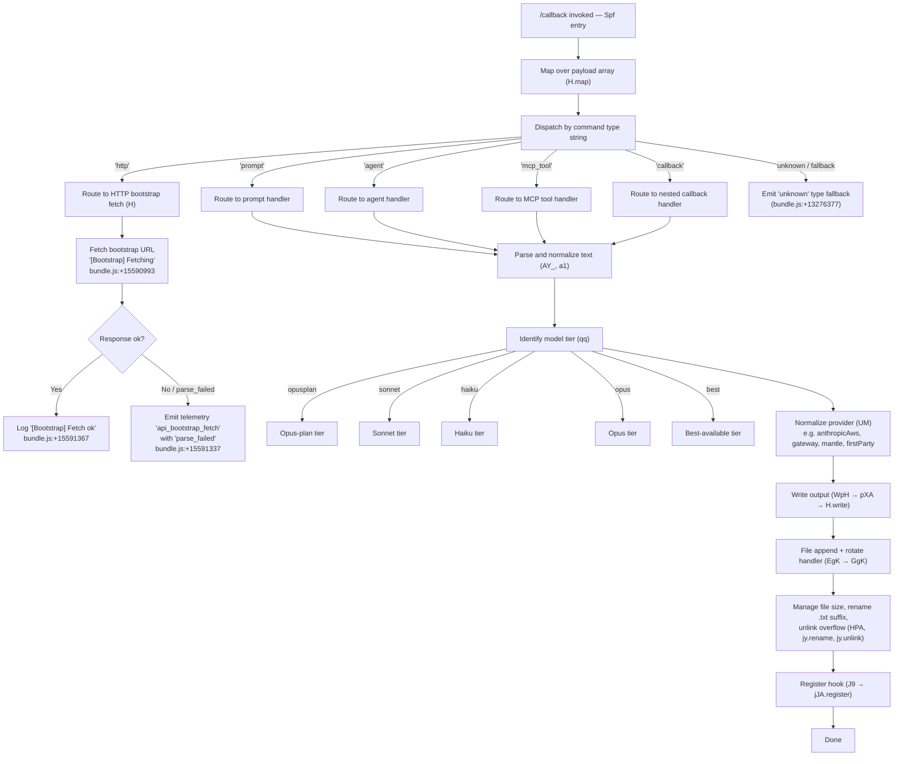

# `/callback`

> Analysis basis: CC v2.1.162 bundle.js (AST extraction + Claude interpretation)
> Minimum version: v2.1.162

---

## Overview

The `/callback` command is a low-level, internally dispatched command type that handles asynchronous callback invocations within the Claude Code CLI. Rather than being a user-facing interactive command, it functions as a routing target for deferred or externally triggered operations — mapping a received payload onto one of several registered handler channels (such as `prompt`, `agent`, `http`, `mcp_tool`, and `callback` itself). The handler entry point is the function resolved as `Spf` in the bundle.

---

## Registration

| Field | Value |
|---|---|
| type | `callback` |
| name | `callback` |
| description | `null` |
| loc_byte | `13276331` |
| loc_byte_end | `13276364` |
| loc_line | `10552` |
| arbor_handler.name | `Spf` |
| arbor_handler.fqn | `claude-2.1.162::Spf` |
| arbor_handler.kind | `Function` |
| arbor_handler.resolution_path | `direct` |
| arbor_handler.n_hits | `1` |

Analysis basis: CC v2.1.162 bundle.js:+13276331

---

## Input Branching

The command's call graph reveals multiple distinct input categories and processing branches (payload type discrimination, command-type dispatch, file I/O paths, HTTP bootstrap paths, model tier selection). The `Spf` handler maps incoming payloads by type string before delegating to sub-handlers. Six or more distinct branches are observable from literals and call edges, requiring a Mermaid flowchart.



Analysis basis: CC v2.1.162 bundle.js:+13275944 (Spf → H.map), +13276015 (Spf → IMH), +12376113–12376256 (type string literals)

---

## Behavioral Spec

### 1. Handler Entry and Payload Mapping

The primary handler (`Spf`) receives an array-shaped payload and maps over its elements to dispatch each item individually.

```
function callbackCommandHandler(payloadItems):
    results = []
    for each item in payloadItems:
        typeString = item.type  // one of: "prompt", "agent", "http", "mcp_tool", "callback", or unknown
        result = dispatchByType(typeString, item)
        results.append(result)
    return results
```

Analysis basis: CC v2.1.162 bundle.js:+13275944 (H.map call), +13275975 (literal "command"), +12376256 (literal "callback")

---

### 2. Type Dispatch

Incoming items are routed by their `type` string to one of five known channels. Unrecognized types fall back to an `"unknown"` sentinel.

```
function dispatchByType(typeString, item):
    switch typeString:
        case "prompt":    return handlePromptItem(item)
        case "agent":     return handleAgentItem(item)
        case "http":      return handleHttpBootstrap(item)
        case "mcp_tool":  return handleMcpToolItem(item)
        case "callback":  return handleNestedCallback(item)
        default:          return { type: "unknown" }
```

Analysis basis: CC v2.1.162 bundle.js:+12376113 ("prompt"), +12376142 ("agent"), +12376170 ("http"), +12376194 ("mcp_tool"), +12376256 ("callback"), +13276377 ("unknown")

---

### 3. HTTP Bootstrap Fetch

When the type is `"http"`, the handler performs a network fetch to retrieve bootstrap configuration. It sets request headers including `Content-Type: application/json` and a `User-Agent` string, with a 5000 ms timeout.

```
function handleHttpBootstrap(item):
    log("[Bootstrap] Fetching " + item.url)
    // timeout: 5000 ms
    response = await fetch(item.url, {
        headers: {
            "Content-Type": "application/json",
            "User-Agent": <agent string>
        },
        timeout: 5000
    })
    if response.ok and parseable:
        log("[Bootstrap] Fetch ok")
        return parseResult(response)
    else:
        emitTelemetry("api_bootstrap_fetch", { status: "parse_failed" })
        return error
```

Analysis basis: CC v2.1.162 bundle.js:+15590993 ("[Bootstrap] Fetching"), +15591078 ("Content-Type"), +15591093 ("application/json"), +15591112 ("User-Agent"), +15591194 (5000 ms), +15591315 ("api_bootstrap_fetch"), +15591337 ("parse_failed"), +15591367 ("[Bootstrap] Fetch ok")

---

### 4. Text Normalization and Argument Parsing

For `prompt`, `agent`, `mcp_tool`, and `callback` type items, the text payload is parsed and normalized through a pipeline. This includes trimming whitespace, splitting on delimiters, resolving index positions, and sanitizing the resulting segments.

```
function normalizeTextPayload(rawText):
    parts = split(rawText, delimiter)
    for each part in parts:
        trimmed = part.trim()
        idx = trimmed.indexOf(separator)
        if idx >= 0:
            key   = trimmed.slice(0, idx)
            value = trimmed.slice(idx + 1)
        else:
            key   = trimmed
            value = ""
    return assembleKeyValuePairs(key, value)
```

Analysis basis: CC v2.1.162 bundle.js:+2971282 (split), +2971321 (trim), +2971345 (indexOf), +2971385 (slice)

---

### 5. Model Tier and Provider Resolution

Once a payload is classified, a model-tier lookup is performed. The identifier string is lowercased and matched against known tier tokens. Provider type is resolved separately.

```
function resolveModelTier(modelIdentifier):
    normalized = modelIdentifier.trim().toLowerCase()
    if normalized contains "opusplan":  return Tier.OPUS_PLAN
    if normalized contains "[1m]":      return Tier.LONG_CONTEXT   // bundle.js:+2240496
    if normalized contains "sonnet":    return Tier.SONNET
    if normalized contains "haiku":     return Tier.HAIKU
    if normalized contains "opus":      return Tier.OPUS
    if normalized == "best":            return Tier.BEST
    return Tier.UNKNOWN

function resolveProvider(tierResult):
    switch tierResult.providerHint:
        case "anthropicAws":  return Provider.AWS
        case "gateway":       return Provider.GATEWAY
        case "mantle":        return Provider.MANTLE
        case "firstParty":    return Provider.FIRST_PARTY
        default:              return Provider.UNKNOWN
```

Analysis basis: CC v2.1.162 bundle.js:+2240403 (tier lookup), +2240470 ("opusplan"), +2240496 ("[1m]"), +2240511 ("sonnet"), +2240550 ("haiku"), +2240589 ("opus"), +2240626 ("best"), +2094587 ("anthropicAws"), +2094607 ("gateway"), +2237319 ("mantle"), +2236678 ("firstParty")

---

### 6. Credential / Sensitive Value Redaction

Before writing or logging any payload fragment, the pipeline applies a redaction pass that replaces sensitive substrings with the token `[REDACTED]`.

```
function redactSensitiveValues(text):
    // Any value identified as a secret is replaced
    return text.replace(sensitivePattern, "[REDACTED]")
```

Analysis basis: CC v2.1.162 bundle.js:+197925 (literal "[REDACTED]"), +197873 (H.replace in valueRedactor)

---

### 7. File Output with Rotation

Processed output is appended to a log/output file. The handler checks byte length against a threshold, and if the file exceeds limits, it renames the current file (appending a `.txt` suffix for the overflow copy) and starts a fresh file. Directories are created as needed.

```
function appendWithRotation(outputDir, content):
    ensureDirectory(outputDir)     // jy.mkdir
    appendToFile(outputDir, content)   // jy.appendFile

    currentSize = Buffer.byteLength(content)
    if currentSize triggers rotation:
        stat = jy.stat(filePath)
        if filePath.endsWith(".txt"):
            rotatedPath = filePath.slice(0, -4)  // trim 4-char suffix
        else:
            rotatedPath = filePath + ".txt"
        jy.rename(filePath, rotatedPath)
        // cleanup old rotated file
        jy.unlink(oldRotatedPath)
```

Analysis basis: CC v2.1.162 bundle.js:+205060 (jy.mkdir), +205119 (jy.appendFile), +205212 (Buffer.byteLength), +204661 (jy.stat), +204754 (endsWith), +204765 (".txt"), +204787 (4), +204817 (jy.rename), +204857 (jy.unlink)

---

### 8. Debounced Flush (Timer Management)

The write pipeline includes a debounce/batching layer that accumulates segments and flushes them after a delay. It uses `clearTimeout`, `setTimeout`, and `setImmediate` for scheduling. Two numeric thresholds gate immediate vs. deferred flush.

```
function debouncedFlush(segment, state):
    clearTimeout(state.pendingTimer)           // cancel previous
    state.buffer.push(segment)
    if state.buffer.length >= 1000:            // bundle.js:+59425
        flushImmediately(state)
    elif state.buffer.length >= 100:           // bundle.js:+59446
        setImmediate(() => flush(state))
    else:
        state.pendingTimer = setTimeout(() => flush(state), delay)
        state.queue.push(segment)
```

Analysis basis: CC v2.1.162 bundle.js:+59537 (clearTimeout), +59701 (setTimeout), +59794 (setImmediate), +59425 (1000), +59446 (100)

---

### 9. Hook Registration

After output is successfully written, a hook is registered via the `jJA.register` interface, allowing downstream listeners to respond to the completed callback.

```
function registerCompletionHook(context):
    jJA.register(context)
```

Analysis basis: CC v2.1.162 bundle.js:+60123 (jJA.register)

---

### 10. EISDIR Guard

When a path that is a directory is encountered during file operations, the code recognizes the `EISDIR` error code and branches to a safe-abort path rather than attempting to write.

```
function safeFileOperation(path):
    try:
        performFileOp(path)
    catch err:
        if err.code == "EISDIR":
            abort gracefully
        else:
            rethrow
```

Analysis basis: CC v2.1.162 bundle.js:+175445 ("EISDIR")

---

### 11. Telemetry — Feature Sad Event

A `tengu_feature_sad` telemetry event is emitted on certain failure paths within the `t6` / `c` call chain, indicating a degraded or failed feature condition.

```
function reportFeatureFailure(context):
    emitTelemetry("tengu_feature_sad", context)
```

Analysis basis: CC v2.1.162 bundle.js:+1008376 (tengu_feature_sad)

---

### 12. Secondary Handler (IMH)

`Spf` also calls `IMH` directly as a secondary operation after the main map dispatch. Based on depth-2 traversal, `IMH`'s internal call graph is not fully resolved.

```
function callbackCommandHandler(payloadItems):
    primaryResults = mapDispatch(payloadItems)    // H.map path
    secondaryResult = secondaryHandler()          // IMH
    return merge(primaryResults, secondaryResult)
```

Analysis basis: CC v2.1.162 bundle.js:+13276015 (Spf → IMH)

<!-- TODO: IMH internals not found in depth-2 traversal; needs --depth 4 -->

---

## State & Side Effects

| Item | Detail |
|---|---|
| Telemetry | `tengu_feature_sad` (bundle.js:+1008376); `api_bootstrap_fetch` with `parse_failed` property (bundle.js:+15591315) |
| Hook registration | `jJA.register` called on successful output completion (bundle.js:+60123) |
| File I/O | Directory creation via `jy.mkdir`; append via `jy.appendFile`; rotation via `jy.rename` and `jy.unlink` (bundle.js:+205060–205206) |
| Timer scheduling | `clearTimeout` / `setTimeout` / `setImmediate` used for debounced flush (bundle.js:+59537–59794) |
| Network I/O | Outbound HTTP fetch for `"http"` type payloads; 5000 ms timeout; `Content-Type: application/json` header (bundle.js:+15591194) |
| Redaction | Sensitive value substitution with `[REDACTED]` before any persistence (bundle.js:+197925) |
| Sound | <!-- TODO: not found in depth-2 traversal; needs --depth 4 --> |
| appState changes | <!-- TODO: not found in depth-2 traversal; needs --depth 4 --> |

---

## Version History

| Version | Change |
|---|---|
| v2.1.162 | Initial analysis |

---

## Common Mistakes

1. **Treating `/callback` as a user-facing interactive command.** This command type is dispatched internally; users do not invoke it directly from the REPL in the same manner as `/help` or `/clear`.
2. **Assuming all payload types follow the same normalization path.** The `"http"` type bypasses text normalization entirely and goes directly to a network fetch with its own timeout and headers.
3. **Ignoring file rotation.** Consumers integrating with the file output path should anticipate that the output file may be renamed mid-session when the debounced buffer exceeds thresholds (1000-item hard flush, 100-item `setImmediate` flush — bundle.js:+59425, +59446).
4. **Misidentifying the `"unknown"` fallback as an error.** The fallback literal `"unknown"` (bundle.js:+13276377) is a typed sentinel, not an exception; callers should check for it explicitly.
5. **Omitting the `Content-Type` and `User-Agent` headers on synthetic HTTP payloads.** The bootstrap fetch path requires both headers; requests missing them may be rejected by the remote endpoint.

---

## Appendix — Identifier Mapping

> For bundle debugging only. Identifiers change across versions.

| Identifier | Role |
|---|---|
| `Spf` | Primary callback command handler (entry point); resolved by Arbor as `claude-2.1.162::Spf` |
| `H` | Bootstrap fetch orchestrator; also used as array/string operand in various map/includes/trim operations |
| `v` | Core payload processing dispatcher; routes to text, write, and model-tier sub-handlers |
| `PgK` | Argument parsing helper; calls into index-boundary and split utilities |
| `PJA` | Sub-argument parser; delegates to numeric boundary helpers |
| `SH` | JSON serialization utility (wraps `JSON.stringify`) |
| `V4` | Sensitive-value redactor; replaces secrets with `[REDACTED]`, handles path suffix trimming |
| `rXA` | Map-over helper within redaction pipeline |
| `q` | File unlink / path utility; calls `OCK.unlinkSync` |
| `A` | Case-normalization utility; calls `f.toLowerCase`; used for path last-index lookups |
| `WpH` | Write coordinator; delegates to `pXA` for actual stream write |
| `pXA` | Low-level stream write wrapper (`H.write`) |
| `EgK` | File append-and-rotate orchestrator; manages directory, size check, rotation, and hook registration |
| `dmH` | Debounced flush manager; owns `setTimeout` / `clearTimeout` / `setImmediate` scheduling |
| `E3H` | Path join and segment-assembly helper |
| `i6` | <!-- TODO: not found in depth-2 traversal; needs --depth 4 --> |
| `zL6` | EISDIR-guard wrapper around file stat/write |
| `_PA` | Path join + `S6` helper for constructing output paths |
| `HPA` | File rotation executor: stat, rename, unlink |
| `GgK` | Append-with-rotation implementation (called via `.bind`) |
| `J9` | Hook registration dispatcher (calls `jJA.register`) |
| `_3` | <!-- TODO: not found in depth-2 traversal; needs --depth 4 --> |
| `AY_` | Text argument splitter/trimmer (split, trim, indexOf, slice) |
| `LHH` | Set membership check (`Y94.has`) |
| `bJ` | String replacement utility |
| `a1` | High-level text normalization entry point; calls `oHH`, `qq`, `rX` |
| `oHH` | Normalization pipeline stage; coordinates `k0`, `OqH`, `yA`, `Dd` |
| `k0` | <!-- TODO: not found in depth-2 traversal; needs --depth 4 --> |
| `OqH` | <!-- TODO: not found in depth-2 traversal; needs --depth 4 --> |
| `Dd` | Detailed text parsing: trim, map, startsWith, includes, domain checks (`"anthropic."`) |
| `qq` | Model-tier classifier: normalizes and matches tier tokens |
| `Q0` | Tier sub-classifier helper |
| `pKH` | Model family membership checker (`mKH.includes`) |
| `qI` | Model resolution helper: delegates to `UM` and `G5` |
| `LQH` | Tier-level resolver calling `G5` |
| `PE` | First-party provider resolver: `UM`, `G5`, `wA` |
| `RJ1` | Tier-to-provider bridge; calls `PE` |
| `UM` | Provider type mapper (wraps `wA`; handles `anthropicAws`, `gateway`, etc.) |
| `Xt6` | Provider inclusion check (`z8L.includes`) |
| `fQH` | Fallback/default provider selector (calls `tH`) |
| `rX` | Normalization sub-pipeline: calls `qq` and `g0` |
| `g0` | Extended model resolution: `WA`, `H6H`, `ozH`, `MQH`, `PE`, `A2`, `UM`, `wA`, `G5`, `qI` |
| `t6` | Telemetry emission wrapper; triggers `tengu_feature_sad` via `c` and `Z6` |
| `c` | Telemetry event constructor |
| `Z6` | Telemetry dispatch (calls `Zx6`) |
| `Zx6` | Low-level telemetry transport |
| `IMH` | Secondary handler invoked by `Spf` after primary dispatch; internals not resolved at depth 2 |

---

Note: index built via Arbor fallback; some signals (telemetry, literals) may be missing — see arbor-fallback.js.