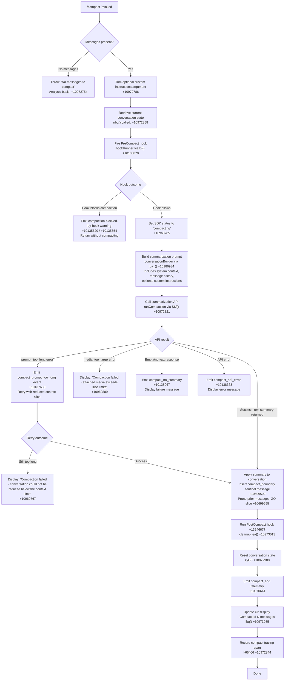

# `/compact`

> Analysis basis: CC v2.1.162 bundle.js (AST extraction + Claude interpretation)
> Minimum version: v2.1.162

---

## Overview

`/compact` frees up context window space by summarizing the current conversation into a single compact representation, replacing the full message history with a condensed summary. It accepts an optional argument supplying custom summarization instructions that guide what the summary should emphasize. The command operates both in interactive (REPL) mode and non-interactive (CLI) mode via the `supportsNonInteractive` flag.

---

## Registration

| Field | Value |
|---|---|
| type | `local` |
| name | `compact` |
| description | `Free up context by summarizing the conversation so far` |
| argumentHint | `<optional custom summarization instructions>` |
| supportsNonInteractive | `true` |
| thinClientDispatch | `post-text` |
| module_id | `ibq` |
| load_inline | `true` |
| loc_byte | `10973692` |
| loc_byte_end | `10973992` |
| loc_line | `7280` |
| arbor_handler.name | `h$f` |
| arbor_handler.fqn | `claude-2.1.162::h$f` |
| arbor_handler.kind | `AsyncFunction` |
| arbor_handler.resolution_path | `module_id` |
| arbor_handler.n_hits | `0` |

Analysis basis: CC v2.1.162 bundle.js:+10973692

---

## Input Branching

The `/compact` command has more than 3 distinct execution branches depending on message availability, hook outcomes, API results, and error conditions. A Mermaid flowchart is used below.



---

## Behavioral Spec

### Entry Point — Main Handler (`h$f`)

The Arbor-resolved handler is `h$f` (AsyncFunction, resolved via `module_id` path).

```
async function compactCommandHandler(userInput):
    messages = getCurrentConversationMessages()
    if messages is empty:
        throw Error("No messages to compact")   // +10972754

    customInstructions = userInput.trim()        // +10972786

    conversationState = await gatherConversationState()  // nbq, +10972858
    await runFullCompaction(customInstructions, conversationState)  // S$f, +10972821
```

Analysis basis: CC v2.1.162 bundle.js:+10972723

---

### Conversation State Gathering (`nbq`)

```
async function gatherConversationState():
    appState = getAppState()
    messageHistory = Array.from(appState.messages)  // +10972277
    lastCompactBoundary = findLastCompactBoundary(messageHistory)  // b_, +10972288
    systemPromptComponents = buildSystemPromptContext()  // mm, +10972334
    // Collects: system prompt, tool definitions, memory content
    return { messageHistory, lastCompactBoundary, systemPromptComponents }
```

Analysis basis: CC v2.1.162 bundle.js:+10972334

---

### Full Compaction Orchestrator (`S$f`)

```
async function runFullCompaction(customInstructions, state):
    startTime = performance.now()               // +10968806

    // Phase 1: Pre-compact hook
    hookResult = await runHooks("PreCompact")   // AG, +10968828
    if hookResult.blocked:
        emitWarning("compaction-blocked-by-hook")  // +10135620
        return

    setSDKStatus("compacting")                  // +10968785

    // Phase 2: Build summarization prompt
    prompt = await buildCompactionPrompt(       // La_, +10186934
        state.messageHistory,
        state.systemPromptComponents,
        customInstructions
    )

    // Phase 3: Execute API call for summary
    summaryText = await callSummarizationAPI(prompt)  // R$f, +10969260

    // Phase 4: Handle API outcome
    if summaryText is error:
        handleCompactionError(summaryText)      // error cases +10969767..+10970013
        return

    // Phase 5: Replace conversation with summary
    applyCompactionResult(summaryText)          // zyH, +10970175

    // Phase 6: Post-compact hooks and cleanup
    await runPostCompactCleanup()               // ea, +10973013

    // Phase 7: Notify user
    displayCompactionComplete(summaryText)      // lbq, +10970377

    recordCompactionSpan(startTime)             // k66, +10972844
```

Analysis basis: CC v2.1.162 bundle.js:+10968806

---

### Summarization Prompt Builder (`La_`)

```
function buildCompactionPrompt(messages, systemContext, customInstructions):
    parts = []

    // Attach system-level context blocks
    for each systemBlock in systemContext:
        if type is "api_system":          // +10186821
            parts.push(systemBlock)
        elif type is "attachment":        // +10186900
            parts.push(systemBlock)

    // Process message types
    for each message in messages:
        role = message.role              // "user" / "assistant" +10186782/+10186804
        content = normalizeMessageContent(message)
        // Special content types handled:
        // "image", "text", "file", "notebook", "pdf" +10684744..
        // "mcp_resource", "task_status", "diagnostics" +10689743..
        // "plan_mode", "auto_mode", "async_hook_response" +10688152..
        parts.push({ role, content })

    // Append custom instructions if provided
    if customInstructions is not empty:
        parts.push(customInstructions)

    return parts
```

Analysis basis: CC v2.1.162 bundle.js:+10683570

---

### API Summarization Call (`R$f`)

```
async function callSummarizationAPI(prompt):
    startTime = performance.now()   // +10971022

    // Checks for pre-computed compact result first
    precomputed = checkPrecomputedCompact()   // AR_, +10971048
    if precomputed is available:
        emitTelemetry("tengu_precomputed_compact_consumed")  // +6742161
        return applyPrecomputed(precomputed)  // ZaH, +10971103

    // Otherwise perform live summarization
    summaryAgentResult = await runSummaryAgent(prompt)   // qz8 via $R_, +10969397
    if summaryAgentResult.status == "aborted":
        return { error: "aborted" }           // +10971211

    if no boundary UUID found:
        emitEvent("boundary_uuid_missing")    // +10971465
        return { error: "boundary_uuid_missing" }

    // Slice messages at boundary
    slicedMessages = sliceAtBoundary(summaryAgentResult)  // qR_, +10971385
    return { summary: slicedMessages, timing: performance.now() - startTime }
```

Analysis basis: CC v2.1.162 bundle.js:+10971022

---

### Summary Agent Loop (`qz8` — reactive compact core)

The summary agent loop (reached via `$R_` → `qz8`) is the same engine used by both manual `/compact` and automatic reactive compaction.

```
async function runSummaryAgentLoop(prompt, options):
    // Setup: normalize message history for summarization
    normalizedMessages = normalizeMessagesForCompaction(prompt)  // +6748517

    // Generate UUID for compact_boundary sentinel
    boundaryUUID = generateUUID()   // O06, +6748814

    // Send to model with compaction-specific system prompt:
    // "You are a helpful AI assistant tasked with summarizing conversations."
    // +10149617
    agentResult = await runTZqAgentLoop({
        messages: normalizedMessages,
        boundaryId: boundaryUUID,
        blockToolUse: true,         // "Tool use is not allowed during compaction" +10147247
        systemPrompt: COMPACTION_SYSTEM_PROMPT
    })

    return { summary: agentResult.text, boundaryUUID }
```

Analysis basis: CC v2.1.162 bundle.js:+6748517

---

### Compact Boundary Application (`ZO`)

```
function applyCompactionBoundary(summaryText, originalMessages):
    // Insert a system-role sentinel message with type "compact_boundary"
    boundaryMessage = {
        role: "system",             // +10699480
        type: "compact_boundary",   // +10699502
        content: summaryText
    }

    // Slice the original message array
    // Keep only messages AFTER the boundary index
    slicePoint = computeSlicePoint(originalMessages)   // iv8, +10699632
    remaining = originalMessages.slice(slicePoint, 1)  // H.slice, +10699655

    // Final conversation = [boundaryMessage] + remaining
    return [boundaryMessage, ...remaining]
```

Analysis basis: CC v2.1.162 bundle.js:+10699632

---

### Error Handling

| Error condition | User-facing message | Telemetry event | loc_byte |
|---|---|---|---|
| Prompt too long | "Compaction failed · conversation could not be reduced below the context limit" | `compact_prompt_too_long` | +10137683 |
| Media too large | "Compaction failed · attached media exceeds size limits" | (error path) | +10969889 |
| No summary in response | "Failed to generate conversation summary - response did not contain valid text content" | `compact_no_summary` | +10138067 |
| API error | "Error compacting conversation" | `compact_api_error` | +10138363 |
| Compaction canceled | "Compaction canceled." | — | +10973294 |
| Unknown error | "unknown error" | — | +10970013 |

---

### Post-Compact Cleanup (`ea`)

```
async function runPostCompactCleanup():
    // Clear in-flight request tracking
    clearInflightRequests()     // eO8, +6743395
    clearCacheStructures()      // RC9/kC9, +6743475
    clearMemoryBuffers()        // njH, +6743487

    // Reset autonomous loop delivery state
    gM7.resetAutonomousLoopDelivered()   // +6743507

    // Reinitialize global state maps
    reinitializeStateMaps()     // GJ, +6743557

    // Run PostCompact hook if registered
    await runHooks("PostCompact")         // LR_, +6743663
    emitTelemetry("post_compact_cleanup") // +6743401
```

Analysis basis: CC v2.1.162 bundle.js:+6743395

---

### Compaction Progress Display (`lbq`)

```
function displayCompactionResult(summaryResult):
    // Display keybinding hint for toggling transcript
    registerKeybindingHint("app:toggleTranscript", "ctrl+o")  // qP, +10972012

    // Build display message
    messageCount = summaryResult.compactedCount
    displayLine = "Compacted " + messageCount   // +10972154
    // dim-styled output via J6.dim +10972147

    // Join lines for final display
    finalOutput = lines.join("\n")              // K.join, +10972167
```

Analysis basis: CC v2.1.162 bundle.js:+10972147

---

### Reactive Compact (Auto-triggered)

In addition to manual `/compact`, the engine supports automatic reactive compaction triggered when context usage approaches limits. This uses the same `qz8`/`CM7` code path.

```
function reactiveCompact(conversationGroups):
    if groups.length < 2:
        log("Reactive compact: fewer than 2 groups, nothing to compact")  // +6727749
        emitEvent("too_few_groups")
        return

    if no assistant messages in summarize set:
        log("Reactive compact: no assistant messages in summarize set, bailing")  // +6728311
        emitEvent("exhausted")
        return

    // Attempt summarization
    result = await runCM7SummarizationLoop(groups)  // CM7, +6725729

    if result.error == "media_too_large":
        log("Reactive compact: summarize hit media-size error, retrying stripped")  // +6729199
        retryStripped()

    if result.summary is empty:
        log("Reactive compact: empty summary text")   // +6726950
        emitTelemetry("tengu_reactive_compact_failed")
        return

    emitTelemetry("tengu_reactive_compact_succeeded")   // +6749796
```

Analysis basis: CC v2.1.162 bundle.js:+6727749

---

## State & Side Effects

| Item | Detail |
|---|---|
| Telemetry — compaction core | `tengu_compact` (+10139664), `tengu_compact_failed` (+10150896), `tengu_compact_ptl_retry` (+10137723), `tengu_compact_cache_prefix` (+10137247), `tengu_compact_cache_sharing_success` (+10148124), `tengu_compact_cache_sharing_fallback` (+10148754) |
| Telemetry — reactive compact | `tengu_reactive_compact_succeeded` (+6749796), `tengu_reactive_compact_attempt` (+6728472), `tengu_reactive_compact_failed` (+6747335) |
| Telemetry — pre/post compact | `tengu_precomputed_compact_consumed` (+6742161), `tengu_precomputed_compact_discarded` (+6742784), `tengu_post_compact_file_restore_success` (+10151382), `tengu_post_compact_file_restore_error` (+10151424) |
| Telemetry — hooks | `tengu_run_hook` (+13267132) fires for `PreCompact` and `PostCompact` hook events |
| Hook events | `PreCompact` hook fires before summarization begins; can block compaction entirely. `PostCompact` hook fires after state is reset. |
| Conversation state | `compact_boundary` sentinel message (role: `system`, type: `compact_boundary`) is inserted at the head of the pruned conversation (+10699502) |
| SDK status | Set to `"compacting"` during operation (+10968785); reverted on completion or error |
| appState changes | Full message history replaced by `[boundaryMessage] + recent tail`. Autonomous loop delivery state is reset via `gM7.resetAutonomousLoopDelivered()` (+6743507). In-flight request tracking and cache maps are cleared. |
| OTEL tracing | Span `claude_code.compaction` created via `I06`/`k66` (+10136471); records `compact_auto` vs `compact_manual` distinction (+10136407/+10136422) |
| Sound | No sound side effect found in depth-2 traversal |
| UI keybinding | Registers `ctrl+o` → `app:toggleTranscript` hint after successful compact (+10972047) |

---

## Version History

| Version | Change |
|---|---|
| v2.1.162 | Initial analysis |

---

## Common Mistakes

1. **Invoking `/compact` on an empty conversation**: The command throws immediately with "No messages to compact" if the message list is empty. Ensure at least one message exists before compacting.
2. **Expecting tool-use continuity across compaction**: The compact boundary clears in-flight tool tracking and MCP cache maps. Any pending tool results or unresolved tool-use IDs will not be recoverable after compaction.
3. **Assuming `PreCompact` hooks cannot abort compaction**: A `PreCompact` hook returning a blocking result will silently prevent compaction and emit a `compaction-blocked-by-hook` warning rather than an error, which may be unexpected.
4. **Providing excessively long custom instructions**: Custom instructions are appended to an already large prompt. If the combined prompt exceeds API limits, the command will emit `compact_prompt_too_long` and retry with a reduced context slice (20% trim factor, +10135314), potentially omitting early conversation context.
5. **Expecting `/compact` to preserve attached media in the summary**: Attached media (images, PDFs, notebooks) may be stripped in retry paths when `media_too_large` errors occur (+6729199), and will not appear in the resulting summary.
6. **Using `/compact` in non-interactive pipelines without checking the `supportsNonInteractive` flag**: The flag is `true`, so piped usage is supported, but the output goes through `thinClientDispatch: "post-text"`, meaning partial-progress output is not streamed.

---

## Appendix — Identifier Mapping

> For bundle debugging only. Identifiers change across versions.

| Identifier | Role |
|---|---|
| `h$f` | Main compact command handler (AsyncFunction, Arbor-resolved entry point) |
| `ZO` | Compact boundary application — slices conversation and inserts sentinel |
| `iv8` | Computes slice point within message array for compaction |
| `S$f` | Full compaction orchestrator (phase coordinator) |
| `AG` | Hook runner dispatcher (fires PreCompact, PostCompact) |
| `F_f` | System prompt normalizer for compaction payload |
| `La_` | Summarization prompt builder (assembles message parts) |
| `Dl` | Hook pipeline executor (PreCompact gate) |
| `P0` | Hook callback dispatch engine |
| `nbq` | Conversation state gatherer (reads appState, finds last boundary) |
| `KT` | System prompt context builder |
| `mm` | Agent system prompt assembler |
| `b_` | Finds last compact boundary in message history |
| `R$f` | Summarization API call coordinator |
| `AR_` | Pre-computed compact result checker |
| `ZaH` | Pre-computed compact result applier |
| `qR_` | Slices message array at boundary UUID index |
| `tO8` | Records summarization timing metrics |
| `qz8` | Summary agent loop (shared by manual and reactive compact) |
| `$R_` | Reactive compact wrapper / caller of qz8 |
| `iO8` | Message grouping and context-window split logic for reactive compact |
| `CM7` | Core reactive compact summarization loop |
| `dM7` | Collects conversation components for summarization payload |
| `TZq` | Compaction agent turn loop (drives the summarization model interaction) |
| `k66` | Compaction turn execution and result parsing |
| `ea` | Post-compact cleanup (clears caches, fires PostCompact hook) |
| `zyH` | Applies new conversation state after successful compaction |
| `lbq` | Displays compaction-complete notification to user |
| `RyH` | UI notification renderer for compact result |
| `qP` | Keybinding hint registrar (ctrl+o toggle transcript) |
| `S$f` | (same as above) Full compaction orchestrator |
| `lo_` | Thin-client dispatch helper for non-interactive mode |
| `WZq` | Context window token budget calculator |
| `NI` | Message role prefix checker |
| `nO8` | Trims and validates summary text |
| `b8` | UI rendering entry point for compaction result display |
| `PI6` | Compaction agent tool filter (blocks tool use during compaction) |
| `n5K` | Main agent query loop (used by compaction agent) |
| `TH` | String conversion utility |
| `SH` | JSON serializer utility |
| `EZq` | Error formatting for compact failure UI messages |
| `xJH` | OTEL metrics emitter (records compaction span attributes) |
| `HL` | OTEL event emitter helper |
| `HkH` | OTEL resource attribute builder |
| `I06` | Compaction OTEL span creator |
| `Qh` | Checks HfH.active tracing state |
| `GyH` | Sets H.setStatus (SDK status field) |
| `v06` | Logs compact progress event |
| `OR_` | Message normalization for compaction (strips non-text content) |
| `ZCH` | Filters messages by origin (ant / third-party) |
| `m_H` | Tool-result message normalizer |
| `O06` | UUID generator for compact boundary sentinel |
| `WaH` | Pushes sliced message parts into output arrays |
| `tnH` | Context-token counter (QLH/Bj6 helpers) |
| `wM` | Builds final compacted message for context replacement |
| `q_` | Generic identity/passthrough helper |
| `ui` | User-facing notification emitter |
| `kH` | Error logger for hook/compaction errors |
| `RH` | Renders error card in UI |
| `hH` | Renders success card in UI |
| `pE` | Formats hook/compact progress line |
| `Q$` | Reads current appState for context window status |

Note: index built via Arbor fallback; some signals (telemetry, literals) may be missing — see arbor-fallback.js.