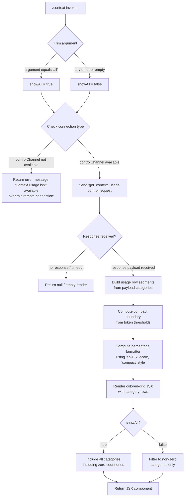

# `/context`

> Analysis basis: CC v2.1.162 bundle.js (AST extraction + Claude interpretation)
> Minimum version: v2.1.162

---

## Overview

The `/context` command renders a visual representation of the current context window usage as a colored grid of cells. It dispatches a `get_context_usage` control request to the local agent, receives a structured usage payload, and then renders a JSX component showing color-coded segments for each category of context consumers (system prompt, tools, memory files, messages, etc.) alongside numeric token counts and a compact boundary indicator.

---

## Registration

| Field | Value |
|---|---|
| type | `local-jsx` |
| name | `context` |
| description | `Visualize current context usage as a colored grid` |
| argumentHint | `[all]` |
| thinClientDispatch | `control-request` |
| module_id | `vmq` |
| load_inline | `true` |
| loc_byte | `11374740` |
| loc_byte_end | `11374966` |
| loc_line | `7333` |
| arbor_handler.name | `bDf` |
| arbor_handler.fqn | `claude-2.1.162::bDf` |
| arbor_handler.kind | `AsyncFunction` |
| arbor_handler.resolution_path | `module_id` |
| arbor_handler.n_hits | `0` |

Analysis basis: CC v2.1.162 bundle.js:+11374740

---

## Input Branching

The command has 4+ distinct branches based on argument value and connection type:



---

## Behavioral Spec

### Handler Entry Point (`bDf`)

The primary handler is the async function `bDf` (Arbor-resolved, `resolution_path: module_id`).

Analysis basis: CC v2.1.162 bundle.js:+11373334

```
async function contextCommandHandler(args, appState):
    trimmedArgs = args.trim()
    showAll = (trimmedArgs === "all")          // literal "all" at +11373365

    connectionType = getConnectionType(appState)  // calls H() at +11373416
    if connectionType !== "controlChannel":        // literal "controlChannel" at +11373391
        return staticErrorMessage(
            "Context usage isn't available over this remote connection"  // +11373418
        )

    // Send control request
    response = await sendControlRequest(
        "get_context_usage",    // telemetry/event name literal at +11373530
        appState
    )

    if response is null or undefined:
        return null

    // Build the visual grid
    usageData = parseContextUsageResponse(response)   // Yy6 at +11373670
    compactBoundary = getCompactBoundary(usageData)   // CDf at +11373843
    boundaryThreshold = 80                            // literal 80 at +11373876

    gridComponent = renderContextGrid(
        usageData,
        compactBoundary,
        showAll,
        boundaryThreshold
    )
    return gridComponent
```

### Control Request Dispatch (`K.sendControlRequest`)

Analysis basis: CC v2.1.162 bundle.js:+11373500

```
function sendControlRequest(requestType, appState):
    // Pads channel ID entries with "  " (two spaces literal at +16020391)
    // Dispatches via thinClientDispatch="control-request" channel
    // Returns a promise resolving to the usage payload
    return appState.controlChannel.sendControlRequest(requestType)
```

### Response Listener / JSX Event Binding (`stH`)

Analysis basis: CC v2.1.162 bundle.js:+11373560

```
function attachResponseListener(emitter, onData):
    emitter.on("data", callback)         // literal "data" at +7913311
    responseText = callback.toString()
    renderResult = buildContextComponent(responseText)
    // createElement call via wy6.createElement at +11373564
    return createElement(renderResult)
```

### Usage Data Parser / Grid Builder (`Yy6`)

Analysis basis: CC v2.1.162 bundle.js:+11371397

```
function buildUsageGrid(responsePayload, showAll):
    // Filter and find relevant categories
    categories = responsePayload.filter(...)    // +11371438
    found = categories.find(...)                // +11371756

    // Category label strings used as display names:
    //   "Free space"          (+11371473)
    //   "Autocompact buffer"  (+11371496)
    //   "Project"             (+11372442)  key: "projectSettings"  (+11372422)
    //   "User"                (+11372479)  key: "userSettings"     (+11372462)
    //   "Local"               (+11372514)  key: "localSettings"    (+11372496)
    //   "Flag"                (+11372549)
    //   "Policy"              (+11372585)
    //   "Plugin"              (+11372615)  key: "plugin"           (+11372604)
    //   "Built-in"            (+11372647)  key: "built-in"         (+11372634)
    //   "System prompt"       (+10169057)
    //   "System tools"        (+10169136)
    //   "MCP tools"           (+10169200)
    //   "MCP tools (deferred)"(+10169276)
    //   "Memory files"        (+10169518)
    //   "Messages"            (+10170082)
    //   "Custom agents"       (+10169451)
    //   "Skills"              (+10169580)

    // Number formatting uses Intl.NumberFormat "en-US" locale, "compact" style
    // with ".0" suffix formatting (+211637, +213645, +213663)

    rows = categories
        .map(category => buildCategoryRow(category))
        .filter(row => showAll || row.tokenCount > 0)

    return rows

function buildCategoryRow(category):
    // Uses String() conversion (+11372674)
    // Calls percentageFormatter(le) with Math.round (+211695)
    // Thresholds: < 20 shown as "< 20" (+211675), uses number 20 (+211666)
    //             < 10 threshold also present (+211708)
    return { label, tokenCount, percentage, color }
```

### Compact Boundary Computation (`CDf` → `ZO`)

Analysis basis: CC v2.1.162 bundle.js:+11373843

```
function getCompactBoundary(usageData):
    // ZO calls iv8 at +10699632 which calls Kj at +10699585
    // Then slices the result: H.slice at +10699655
    // Uses literal "compact_boundary" as a key (+10699502)
    boundaryEntry = usageData.find(entry => entry.key === "compact_boundary")
    if boundaryEntry:
        return boundaryEntry.value.slice(...)
    return null
```

### Number Formatter (`pq` / `le`)

Analysis basis: CC v2.1.162 bundle.js:+211623

```
function createCompactNumberFormatter():
    // Uses SK → VgK at +211570
    // Locale: "en-US"  (+213645)
    // Style: "compact" (+213663)
    // Suffix: ".0"     (+211637)
    return new Intl.NumberFormat("en-US", { notation: "compact" })

function formatPercentage(value):
    rounded = Math.round(value)    // +211695
    if rounded < 20: return "< 20" // +211675
    return rounded.toString() + "%"
```

### Terminal Color Grid Renderer (`TH`)

Analysis basis: CC v2.1.162 bundle.js:+11373754

```
function renderColorGrid(rows, compactBoundary, boundaryThreshold):
    // TH uses String() for color codes at +174867
    // Renders each row as a colored block cell
    // boundaryThreshold = 80 (literal at +11373876)
    // When usage >= 80%, boundary marker is shown
    cells = rows.map(row => colorCell(row.color, row.percentage))
    if compactBoundary != null:
        insertBoundaryMarker(cells, compactBoundary)
    return cells

function renderSectionLabel(text):
    // Uses String() conversion, TH wrapper
    return String(text)
```

---

## State & Side Effects

| Item | Detail |
|---|---|
| Telemetry | No `tengu_*` events fired directly within `bDf`; `get_context_usage` is the control-channel event name sent at +11373530 |
| Control channel dispatch | Sends a `control-request` message of type `"get_context_usage"` over the thinClientDispatch channel; requires `controlChannel` to be present in app state |
| appState changes | Read-only; no mutations to appState observed in depth-2 traversal |
| JSX render | Returns a `local-jsx` component tree; createElement called via `wy6.createElement` at +11373564 and `uAH.createElement` at +7913373 |
| Sound | None observed in traversal |
| Hook registration | `J9` → `jJA.register` at +60123 is reached transitively through the rendering pipeline (settings/context infrastructure), not directly on command invocation |
| Remote connection guard | Immediately returns a static string `"Context usage isn't available over this remote connection"` when `controlChannel` is absent (+11373418) |

---

## Version History

| Version | Change |
|---|---|
| v2.1.162 | Initial analysis |

---

## Common Mistakes

1. **Running over a remote/thin-client connection without a control channel**: The command immediately returns the static error message `"Context usage isn't available over this remote connection"` — it cannot fall back or retry. Ensure the local control channel is active before invoking.

2. **Expecting `/context` alone to show all entries**: Without the `all` argument, zero-count categories are filtered out. Use `/context all` to display every category including those currently consuming zero tokens.

3. **Confusing the compact boundary marker with a hard limit**: The `compact_boundary` value shown in the grid is an informational autocompact threshold, not an API hard limit. The boundary marker appears visually at or near the 80% usage mark (literal at +11373876).

4. **Assuming instant response**: The command is async and dispatches a control request. In environments with high latency between the CLI client and the local agent, there may be a visible delay before the grid renders.

5. **Interpreting percentage labels**: Values below 20% are displayed as `"< 20"` rather than an exact figure (literal at +211675). Do not assume these represent exactly 19% or any specific sub-20 value.

---

## Appendix — Identifier Mapping

> For bundle debugging only. Identifiers change across versions.

| Identifier | Role |
|---|---|
| `bDf` | Primary async handler for `/context` command (Arbor-resolved entry point) |
| `M1` | Environment/session context builder (called from `bDf`; assembles session info) |
| `LHH` | Feature-flag / capability set membership check |
| `pX_` | Terminal background color / environment detector |
| `tH` | String-to-color/terminal-code converter |
| `ko` | Fullscreen / display-mode resolver |
| `jEL` | iTerm / tmux control-mode detector |
| `JEL` | Terminal type prefix checker (`H.startsWith`) |
| `v` | Generic model/config value accessor |
| `PgK` | Model context-window parameter getter |
| `PJA` | Context size selector (calls `GUK`, `EUK`) |
| `H` | App-state/session object (core state record) |
| `AY_` | Bootstrap URL parser / header splitter |
| `bJ` | String replacement utility |
| `a1` | Token/message counter helper |
| `t6` | File/path utility (calls `c`, `Z6`) |
| `SH` | JSON serializer wrapper |
| `V4` | Path normalization / redaction helper |
| `rXA` | Array mapper for model IDs |
| `WpH` | Output writer wrapper |
| `pXA` | Raw write-to-stream helper |
| `EgK` | Conversation log / file append manager |
| `dmH` | Debounced flush / timer manager |
| `E3H` | Log entry formatter |
| `zL6` | Log file versioner |
| `_PA` | Log path builder |
| `HPA` | Log rotation / rename handler |
| `GgK` | Log directory + append writer |
| `J9` | Hook registration caller |
| `mX_` | Boolean feature flag resolver |
| `i_` | Settings reader / loader |
| `_U` | Disk-settings loader orchestrator |
| `pT` | Settings parse helper |
| `C9` | Memory-usage sampler with dedup set |
| `IH_` | Settings load event emitter |
| `gQ` | Settings aggregator (merges all setting sources) |
| `fu6` | Settings finalizer |
| `XEL` | Session/conversation initializer |
| `j6` | Conversation-history accessor |
| `Hu` | History dedup helper |
| `U18` | History read-once guard |
| `C6` | Conversation record builder |
| `l4` | Context token counter (calls `QGH`) |
| `QGH` | Raw token-count primitive |
| `IR` | Token budget calculator |
| `K` | Control-channel object (holds `sendControlRequest`) |
| `L` | Active-request set manager |
| `f` | Connection/stream object |
| `stH` | Data-event listener attacher for control response |
| `KB` | Control response renderer dispatcher |
| `QW_` | JSX element creator wrapper (calls `i89.createElement`) |
| `oo` | Outer grid layout component |
| `ilH` | Inner layout / row compositor |
| `Yy6` | Usage-data parser and grid-row builder |
| `pq` | Compact number formatter factory |
| `SK` | Intl formatter helper (calls `VgK`) |
| `VgK` | Locale format engine |
| `uBH` | Usage-bar renderer |
| `le` | Percentage formatter (calls `pq`, `Math.round`) |
| `TH` | Terminal color/string wrapper |
| `CDf` | Compact-boundary extractor (calls `ZO`) |
| `ZO` | Raw boundary value slicer (calls `iv8`, `H.slice`) |
| `iv8` | Boundary value parser (calls `Kj`) |
| `Kj` | Boundary primitive decoder |
| `jN8` | Full system-prompt builder (large orchestrator) |
| `AZ` | Model display-name resolver |
| `oHH` | Provider-model lookup |
| `k0` | Model-family tester |
| `OqH` | Provider string mapper |
| `Dd` | Model-string normalizer |
| `PE` | Plan-model selector |
| `UM` | Model-tier upper selector |
| `G5` | Sub-model picker |
| `wA` | Base model resolver (calls `tH`) |
| `qI` | Alternate model selector |
| `rE` | Auto-compact configuration reader |
| `x4` | Feature-flag × model intersection resolver |
| `EV` | Feature-flag set accumulator |
| `m8` | Context-size × feature resolver |
| `On` | Context-window size resolver |
| `K9` | Model context-size lookup table |
| `Ua6` | Settings → model mapper |
| `iX` | Model-string normalizer (lower-case, includes check) |
| `CV` | Context-limit validator |
| `Q0` | Default context-size getter |
| `GU` | Per-model context-size mapper |
| `aHH` | Context-size bounded getter |
| `E_8` | Extended context-size parser |
| `y0` | Context env-var resolver |
| `$_H` | CLAUDE_CODE_AUTO_COMPACT_WINDOW parser |
| `hZq` | Auto-compact window resolver |
| `U_` | History length getter |
| `go_` | Token-count string parser (float/int) |
| `KT` | System-prompt assembler (main prompt builder) |
| `i7A` | Prompt-section header builder |
| `x6` | Async-local-store accessor |
| `RQ6` | Store getter with fallback |
| `X_` | Nonce/ID generator (calls `Nv`) |
| `kV8` | Per-model prompt-value mapper |
| `iE` | Prompt injection-detection helper |
| `Fpf` | Code-style guideline prompt builder |
| `gpf` | Confirm-before-act guideline builder |
| `Qpf` | Task-continuity prompt section |
| `s7A` | SDK / task-continuity prompt section builder |
| `pK` | String type-caster |
| `WUf` | Wrapper for `s7A` |
| `HUf` | Hook / routine prompt section builder |
| `LQ` | Hooks-enabled checker |
| `DP` | Deferred-tool prompt builder |
| `epf` | Hook-body loader |
| `nk_` | Hook name normalizer |
| `bC` | Hook state accessor (calls `lO9`) |
| `K7` | Prompt-section type discriminator |
| `zg` | Session-guidance prompt builder |
| `gF` | Content-block flattener |
| `Cw6` | CLAUDE.md / memory-file prompt loader |
| `R4` | File-read prompt helper |
| `HLH` | Directory maker for memory |
| `Wo` | File-stat / type checker |
| `E6` | Error wrapper (calls `Zx6`) |
| `hH` | File-contents cache helper |
| `mw` | Memory-path resolver (calls `j6`) |
| `tn1` | Team-memory path joiner |
| `sn1` | Memory-file scanner |
| `an1` | Alternative memory-file scanner |
| `nj_` | Memory-dir disabled handler |
| `c` | Filesystem stat / read helper |
| `OUf` | Environment-info prompt builder |
| `CJ` | Model-display-name formatter |
| `r7A` | Shell/OS detection prompt section |
| `$Uf` | Full environment-info section assembler |
| `a7A` | OS version/type reader |
| `DM` | Working-directory prompt injector |
| `o7A` | Shell detection (zsh/bash/PowerShell) |
| `npf` | Language prompt section |
| `ipf` | Output-style prompt section |
| `DUf` | Background-session / worktree section |
| `rF_` | Worktree type resolver |
| `YUf` | Scratch-pad / temp-dir prompt section |
| `N9H` | Scratch directory path builder |
| `Z0H` | Scratch-dir join helper |
| `JUf` | Brief-mode enabled checker |
| `PUf` | Focus/context-management prompt section |
| `qUf` | Sparrow-ledger prompt section |
| `cpf` | Heron-brook prompt section |
| `lj1` | Act-dont-rederive section |
| `lpf` | Autonomy-append section |
| `TC9` | Tool-caching / prompt-compute helper |
| `L3H` | Prompt cache key builder |
| `Eg8` | Cache invalidation helper |
| `AUf` | Autonomy/ownership prompt fragment |
| `rpf` | Prompt-section router |
| `opf` | Tool-injection-warning prompt section |
| `dpf` | System-compression reminder |
| `apf` | Tool-usage guidance section |
| `spf` | SDK task-mode wrapper |
| `tpf` | Tool-result / using-tools section |
| `e0` | CLI vs remote mode router |
| `_Uf` | Content-block flattener variant |
| `Mi1` | Memory-manager init helper |
| `fi1` | Memory read/write orchestrator |
| `oDH` | On-disk-history loader |
| `bV` | History file path builder |
| `Hf` | File-hash helper |
| `mm` | Main-thread agent state initializer |
| `A4` | Agent-state factory |
| `I2` | Agent-render dispatcher |
| `rG` | Render callback helper |
| `gq` | Render queue helper |
| `k_` | Module init / DDA-set bootstrapper |
| `M` | MCP-connection manager (map of connections) |
| `RCH` | MCP-server connector (per-server) |
| `xp8` | MCP-update applier |
| `$` | MCP-server state map |
| `ROA` | MCP-retry / recovery manager |
| `vz` | Agent system-prompt getter |
| `Z6` | Async file-write helper |
| `Zx6` | Base error constructor |
| `w_f` | Conversation-message file loader |
| `Y_f` | Message-file line parser |
| `PN8` | Per-conversation prompt builder |
| `zUf` | Environment-info for sub-conversation |
| `$i1` | Sub-conversation memory + prompt assembler |
| `O5K` | Prompt-section boundary parser |
| `L_6` | Message-history loader / decorator |
| `NCH` | Token-count request builder |
| `kH` | Token-count HTTP caller |
| `CZq` | Token-count response parser |
| `J_f` | Built-in tool prompt injector |
| `xP6` | AutoMem tool injector |
| `j_f` | MCP-tool prompt injector |
| `B2H` | Tool-list flattener |
| `WN8` | Per-tool descriptor builder |
| `z` | Daemon stop / background session terminator |
| `RH` | File read/write stream helper |
| `Kh` | Daemon-control socket handler |
| `jp` | Process-exit race-condition handler |
| `W` | Background-session manager |
| `uq6` | Background-session event emitter |
| `t_` | Error string builder |
| `X` | IPC socket buffer reader |
| `j` | IPC message queue |
| `w` | Background worker / spawn manager |
| `Y5` | Stream end helper |
| `xK5` | Main IPC protocol handler (large) |
| `W_f` | Conversation prompt assembler |
| `l5` | Token-count rounder |
| `O` | Background-session list accessor |
| `x8` | Background-session state reader |
| `Y` | Forced-shutdown handler |
| `Nj` | Cleanup notifier |
| `G_f` | MCP-tool-list prompt builder |
| `X_f` | Permission-filtered tool injector |
| `ek_` | Permission-check helper |
| `I_H` | Tool-filter by permission |
| `RZq` | Runtime-config accessor |
| `RK` | Recursive config getter (cache-backed) |
| `V_f` | Conversation-state assembler |
| `E_f` | Token-count for conversation slice |
| `T_f` | Rolling token-count tracker |
| `Z_f` | Token-count snapshot helper |
| `nE` | Full conversation normalizer (large) |
| `nLf` | Nested tool-result flattener |
| `ct_` | Content-type classifier |
| `tLf` | Tool-use block processor |
| `sLf` | Content-block type dispatcher |
| `eLf` | Attachment presence checker |
| `k` | Chokidar file-watcher wrapper |
| `Qv8` | Array `some` predicate helper |
| `D7f` | UUID generator wrapper |
| `b8` | UUID + content-block ID generator |
| `DT` | Deferred-tool status tracker |
| `vn_` | Tool-result validator |
| `dv8` | Conversation-delta applier |
| `oI` | Standard vs search tool mode router |
| `ot_` | Tool-array type checker |
| `iLf` | Image/document attachment classifier |
| `V` | Conversation-version state |
| `y` | Away-summary rate-limiter |
| `rLf` | Thinking-block array checker |
| `z7f` | MCP tool-name prefix extractor (`mcp__` at +10675856) |
| `C4` | Content-block content getter |
| `Rhq` | Redacted-thinking filter |
| `_7f` | Tool-use dedup filter |
| `whq` | Tool-reorder helper (respects thinking blocks) |
| `La_` | Full system-message builder (large, many block types) |
| `Y7f` | Tool-name joiner |
| `Z` | Conversation turn accumulator |
| `H7f` | Conversation-delta helper |
| `nV6` | Orphaned-thinking block filter |
| `E7f` | Trailing-thinking block filter |
| `lV6` | Whitespace-only assistant message filter |
| `T7f` | Empty-assistant-content fixer |
| `A7f` | Message-slice assembler |
| `Yhq` | Conversation history truncator |
| `Jhq` | Last-message assembler |
| `aLf` | Tool-result slice reducer |
| `P_f` | Builtin-prompt injector |
| `Hy_` | Prompt-type permission checker |
| `WE` | Tool-category label resolver |
| `qq` | Model-display-name normalizer |
| `OI6` | Token-overhead estimator |
| `vo_` | Token-overhead lookup |
| `E1H` | Context-window remaining calculator |
| `l7H` | Context-window min/max resolver |
| `iDH` | Context-budget with compaction floor |
| `HH` | Voice-recording ref / push handler |
| `E` | Keyboard-event / remote-control handler |
| `b` | Key-event handler helper |
| `c0` | Remote-control-at-startup gate |
| `D` | Supervisor write / config-reload handler |
| `g` | Process-kill / hang-detection timer |
| `u` | Interval clearer |
| `gKH` | Whitespace trimmer for terminal output |
| `C` | Rate-limit event enqueuer |
| `Q` | Transient-render queue flusher |
| `J` | Worker kill-all helper |
| `i` | MCP-update + session push handler |
| `d` | Dynamic MCP loader |
| `SCH` | MCP AXH connector |
| `i58` | Usage-event tracker |
| `O_H` | Usage-event dedup set |
| `zl` | Context-window leftover calculator |
| `FH` | Remote-bridge v2 transport manager (large) |
| `qH` | MCP-session write-batch handler |
| `AH` | MCP-connection abort/cleanup handler |
| `Y8` | MCP debug logger |
| `SI6` | MCP elicitation-request handler |
| `zRK` | Rate-limit title accessor |
| `RI6` | MCP elicitation-response handler |
| `gl` | MCP notification dispatcher |
| `S6` | Nonce generator (calls `Nv`) |
| `X8` | File-based debug logger |
| `eP4` | Log path builder helper |
| `F` | Settled-connection finalizer |
| `V6` | Bridge message filter + batch writer |
| `P6` | Message renderer (collapsed read/search) |
| `n6` | Message-list self-referential accessor |
| `mH` | MCP live-session status reader |
| `N6` | Bridge batch writer / end handler |
| `YH` | Bridge stream end caller |
| `LH` | tools/list_changed MCP notifier |
| `B_K` | Bridge ingress message parser |
| `kO8` | Bridge message type checker |
| `p6` | JSON parse wrapper |
| `fyf` | Bridge frame validator |
| `Myf` | Bridge control-response handler |
| `aqA` | UUID tracker for bridge |
| `F_K` | Bridge egress message writer (large) |
| `d6` | Plugin / server address parser |
| `I9` | Plugin prefix string (`plugin:`) |
| `rq` | Server prefix string (`server:`) |
| `yq` | Named-server config finder |
| `o9` | Server config lookup helper |
| `lA` | CLI fatal-error reporter |
| `wH` | Conversation message list |
| `jH` | Conversation + rUf accessor |
| `rUf` | Conversation metadata reader |
| `IH` | System-info push list |
| `gH` | Terminal emulator exec handler |
| `H6` | Terminal parser/executor |
| `huH` | Terminal escape code table |
| `A6` | Terminal sequence dispatcher |
| `qGH` | Terminal control-sequence parser |
| `BG` | Terminal message-list accessor |
| `t` | Terminal B-tree helper |
| `ST` | Terminal ZH error handler |
| `Zi` | Terminal T9 dispatcher |
| `cH` | Terminal write-messages helper |
| `eH` | Terminal write-batch executor |

---

Note: index built via Arbor fallback; some signals (telemetry, literals) may be missing — see arbor-fallback.js.