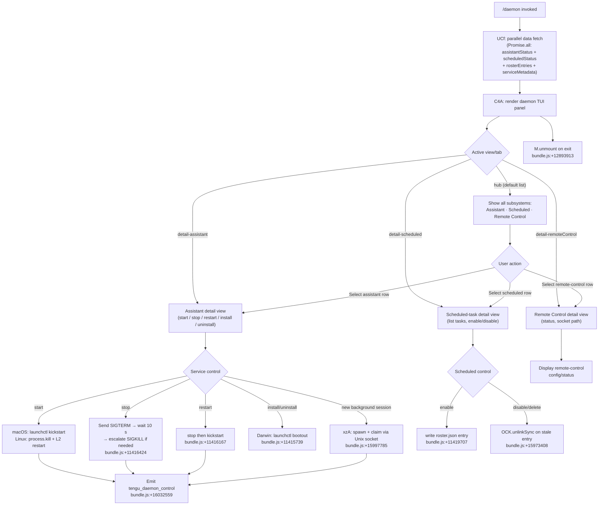

# `/daemon`

> Analysis basis: CC v2.1.162 bundle.js (AST extraction + Claude interpretation)
> Minimum version: v2.1.162

---

## Overview

The `/daemon` command provides an interactive management interface for Claude Code's background services: persistent assistant sessions, scheduled (cron-style) tasks, and the remote-control channel. It launches a full JSX-rendered TUI panel (`local-jsx` type, `immediate: true`) that aggregates live state from all three subsystems and allows the user to start, stop, restart, install, and uninstall each service without leaving the editor.

---

## Registration

| Field | Value |
|---|---|
| type | `local-jsx` |
| name | `daemon` |
| description | `Manage background services: assistants, scheduled tasks, and remote control` |
| immediate | `true` |
| module_id | `b4A` |
| load_inline | `true` |
| loc_byte | `12894326` |
| loc_byte_end | `12894530` |
| loc_line | `9460` |
| arbor_handler.name | `UCf` |
| arbor_handler.fqn | `claude-2.1.162::UCf` |
| arbor_handler.kind | `AsyncFunction` |
| arbor_handler.resolution_path | `module_id` |
| arbor_handler.n_hits | `0` |

Analysis basis: CC v2.1.162 bundle.js:+12894326

---

## Input Branching

The command has five or more distinct view/sub-command states plus several modal transitions. A Mermaid flowchart is used.



---

## Behavioral Spec

### Top-level async initialiser (`UCf`)

The Arbor-resolved handler `UCf` is an `AsyncFunction` that fires when `/daemon` is invoked.

```
async function daemonCommandHandler(context):
    [assistantData, scheduledData, rosterData] = await Promise.all([
        fetchAssistantStatus(),   // R4A path
        fetchScheduledStatus(),   // also R4A → DqK
        loadRosterEntries()       // kKK → OA6
    ])
    mountDaemonPanel(assistantData, scheduledData, rosterData)
```

Analysis basis: CC v2.1.162 bundle.js:+12883076

---

### Status fetch — assistant daemon (`R4A` / `B1K`)

```
async function fetchAssistantStatus():
    cwd = getStore()                     // V9 → d0L.getStore
    statusPath = pathJoin(cwd, "daemon.status.json")  // GS6 literal
    raw = await readFile(statusPath)
    if ENOENT:
        return null
    pid = parseInt(raw.pid)
    alive = checkProcessAlive(pid)       // process.kill(pid, 0)
    if not alive:
        return {status: "stopped"}
    return {pid, status: "running", ...raw}
```

Filename constant: `"daemon.status.json"` (bundle.js:+12680289)

Analysis basis: CC v2.1.162 bundle.js:+12680575

---

### Status fetch — scheduled daemon (`DqK`)

```
async function fetchScheduledStatus():
    statusPath = pathJoin(cwd, "daemon.scheduled.status.json")
    raw = await readFile(statusPath)     // MqK.readFile
    if ENOENT:
        return null
    pid = parseInt(raw.pid)
    alive = checkProcessAlive(pid)
    if not alive:
        return {status: "stopped"}
    return {pid, status: "running", ...raw}
```

Filename constant: `"daemon.scheduled.status.json"` (bundle.js:+12770656)

Analysis basis: CC v2.1.162 bundle.js:+12770863

---

### Roster loading and scheduled-task enumeration (`TKK` → `e16` → `mKA`)

```
async function loadRosterAndScheduled():
    [rosterResult, scheduledEntries] = await Promise.all([
        loadRosterFile(),     // e16 → mKA
        enumerateScheduled()  // TKK → kH
    ])

function loadRosterFile():
    raw = readFile(path, "utf8")        // encoding literal bundle.js:+12681085
    trimmed = raw.trim()
    parsed = JSON.parse(trimmed)        // throws → wrapped in Zx Error
    if not Array.isArray(parsed):
        throw Error
    return parsed                       // each entry type: "scheduled" bundle.js:+12772161
```

Analysis basis: CC v2.1.162 bundle.js:+12681051

---

### Process liveness check (`z0`)

```
async function checkAndMaybeKillProcess(pidFilePath):
    pidData = await readPidFile(pidFilePath)    // Wy6 → em.readFile
    pid = parsePid(pidData)                     // PWH, R8, b9
    try:
        process.kill(pid, 0)                    // bundle.js:+11413186 — signal 0 = liveness probe
        return {alive: true, pid}
    catch ESRCH:
        return {alive: false}
    logLines = await readLogTail(pidFilePath)   // s6A: readFile + split + slice
    spawnRecord = buildSpawnRecord(logLines)    // L2 → ly
```

Analysis basis: CC v2.1.162 bundle.js:+11413158

---

### macOS launchctl integration (`yn` → `C8` / `Rk8`)

```
async function macosServiceControl(action):
    // action ∈ {"start","stop","restart","kickstart","bootout"}
    agentPlist = pathJoin(
        homedir(), "Library", "LaunchAgents",   // literals bundle.js:+11413966,+11413976
        "daemon.json"                           // bundle.js:+11413651
    )
    uid = process.getuid()                      // Tpq bundle.js:+11414035
    domain = "gui/" + uid

    if action == "start":
        run("launchctl", "kickstart", domain + "/" + label)
    else if action == "stop":
        run("launchctl", "print", domain)       // literal bundle.js:+11417194
        sendSignal(SIGTERM)
        waitUpTo(5000ms)                        // literal bundle.js:+11417228
    else if action == "restart":
        stopService()
        startService()
    else if action == "uninstall":
        run("launchctl", "bootout", domain)     // literal bundle.js:+11415739
        unlinkPlist()
    // Non-darwin: fallback path raises "service uninstall not available on darwin"
    //             bundle.js:+11415871
```

Analysis basis: CC v2.1.162 bundle.js:+11417178

---

### Background session lifecycle (`xzA` — spawn / claim / retire)

```
async function manageBackgroundSession(config):
    // Phase 1: claim via Unix socket
    claimFrame = buildClaimFrame()      // NK5 → Zg.buildClaimFrame
    socket = connect(ap8)               // yzA → ap8.connect
    write(socket, claimFrame, lF)       // lF: Buffer framing (UInt32BE length prefix)
    waitForAck(socket)

    // Phase 2: status tracking
    states = ["idle","working","blocked","bg","active","crashed",
              "done","killed","resuming","spare","exec"]
    // literals bundle.js:+16002648 … +16003485

    // Phase 3: retire when settled
    retireIfSettled()                   // w → F.retireIfSettled bundle.js:+15997106

    // SIGKILL escalation path
    if SIGTERM_not_honoured_within(30s):   // literal bundle.js:+15996328
        process.kill(pid, SIGKILL)         // tengu_bg_dispatch_sigkill_escalate
```

Analysis basis: CC v2.1.162 bundle.js:+15997785

---

### Away-summary generation (`y` → `U38` / `VT8`)

When the daemon panel is open and the terminal is detected as "blurred" (focus lost for more than 3 600 000 ms, literal bundle.js:+15454205), the panel may trigger an asynchronous away-summary API call:

```
function maybeGenerateAwaySummary(context):
    if cacheAgeUnknown:
        log("[awaySummary] skipped: cache age unknown")  // bundle.js:+15453354
        return
    if cacheFreshness < 0.9:                             // literal bundle.js:+15453423
        log("[awaySummary] skipped: cache stale")
        return
    if rateLimitAllowance < threshold:
        log("[awaySummary] skipped: at or near rate limit")
        return
    if draftInputPresent:
        log("[awaySummary] skipped: draft input present")
        return
    triggerAwaySummaryCall()                             // tengu_away_summary_generate
```

Analysis basis: CC v2.1.162 bundle.js:+15453352

---

### MCP server management within the daemon panel (`RCH` / `ja_` / `ROA`)

The daemon panel embeds the MCP connection supervisor, which manages stdio, SSE-IDE, ws-IDE, and claudeai-proxy server types:

```
function mcpSupervisor(serverSlots):
    for each slot in serverSlots:
        if slot.status == "needs-auth":
            log("Skipping connection (cached needs-auth)")  // bundle.js:+10368270
            continue
        if recentFailureCached:
            log("Skipping connection (recent failure cached; retries in 15 min)")
            continue
        connect(slot)

    on reconnect:
        emit tengu event: mcp_reconnect
        if result == "needs-auth":
            clearCache()
            retryOnce()
```

MCP transport type constants: `"stdio"`, `"sse"`, `"http"`, `"sse-ide"`, `"ws-ide"`, `"claudeai-proxy"` (bundle.js:+10367677 … +10368084)

Analysis basis: CC v2.1.162 bundle.js:+10367477

---

### Daemon idle-exit and stop telemetry (`z` → `hH` / `RH`)

```
function daemonStopHandler():
    emit telemetry: tengu_daemon_stop       // bundle.js:+16032484
    on failure:
        emit telemetry: tengu_daemon_stop_failed  // bundle.js:+16032521
    gracefulShutdown(timeout=500ms)         // literal bundle.js:+16027602
    process.exit()
```

Analysis basis: CC v2.1.162 bundle.js:+16032481

---

## State & Side Effects

| Item | Detail |
|---|---|
| Telemetry — roster parse failure | `tengu_bg_roster_parse_failed` (bundle.js:+11423370) |
| Telemetry — feature health | `tengu_feature_ok`, `tengu_feature_sad`, `tengu_feature_bad` (bundle.js:+1008233, +1008376, +1008295) |
| Telemetry — MCP OAuth flow | `tengu_mcp_oauth_flow_start`, `tengu_mcp_oauth_flow_success`, `tengu_mcp_oauth_flow_error` (bundle.js:+10210368, +10215157, +10216545) |
| Telemetry — daemon config reload | `tengu_daemon_config_reload` (bundle.js:+16011003) |
| Telemetry — auth-loss guard | `tengu_config_auth_loss_prevented` (bundle.js:+3251708) |
| Telemetry — skill file watch | `tengu_skill_file_changed` (bundle.js:+14080086) |
| Telemetry — MCP skills | `tengu_mcp_skills` (bundle.js:+6926634) |
| Telemetry — config parse error | `tengu_config_parse_error` (bundle.js:+3257134) |
| Telemetry — daemon control | `tengu_daemon_control` (bundle.js:+16032559) |
| Telemetry — SIGKILL escalation | `tengu_bg_dispatch_sigkill_escalate` (bundle.js:+15996373) |
| Telemetry — daemon yield | `tengu_daemon_yield` (bundle.js:+16015226) |
| Telemetry — low memory | `tengu_bg_low_mem_mb`, `tengu_bg_dispatch_low_mem` (bundle.js:+12950873, +15996974) |
| Telemetry — spare session | `tengu_bg_spare_enable`, `tengu_bg_spare_claim`, `tengu_bg_spare_claim_fail` (bundle.js:+15997678, +15997806, +15998072) |
| Telemetry — claim failure | `tengu_bg_sendclaim_failed` (bundle.js:+15976082) |
| Telemetry — transient state read | `tengu_bg_state_read_transient` (bundle.js:+4143655) |
| Telemetry — idle exit | `tengu_daemon_idle_exit` (bundle.js:+16016256) |
| Telemetry — away summary | `tengu_away_summary_generate` (bundle.js:+15453832); `generate_failed` sub-event |
| Telemetry — background session create | `tengu_bg_session_create` (bundle.js:+15996689) |
| Telemetry — MCP reconnect | `mcp_reconnect`, `mcp_reconnect_failed`, `mcp_reconnect_not_connected` (bundle.js:+10366431, +10366988, +10366447) |
| Telemetry — MCP OAuth flow failed | `mcp_oauth_flow_failed` (bundle.js:+10216512) |
| File mutations | Reads/writes `daemon.status.json`, `daemon.scheduled.status.json`, `roster.json`, `daemon.json` (LaunchAgent plist on macOS), `mcp-needs-auth-cache.json` |
| Hook registration | `J9` → `jJA.register` (bundle.js:+60123); file-watch via `bWL` → `o18.watchFile` |
| appState changes | Daemon supervisor updates `Z.updateConfig`, `Z.start`, `Z.stop` (bundle.js:+16010607, +16010625, +16010598); MCP slot map managed via `f.set` / `f.delete` |
| Process signals | `SIGTERM` (graceful stop), `SIGKILL` (escalation after 30 s), signal `0` (liveness probe) |
| Socket I/O | Unix-domain socket claim frames use a 4-byte big-endian length prefix (`lF` → `Buffer.writeUInt32BE`) |
| Sound | None detected in depth-2 traversal |
| UI mount/unmount | `M.render` on open, `M.unmount` on close (bundle.js:+12893699, +12893913) |

---

## Version History

| Version | Change |
|---|---|
| v2.1.162 | Initial analysis |

---

## Common Mistakes

1. **Expecting a text response** — `/daemon` is `immediate: true` and renders a live JSX panel. It does not write output to the conversation transcript.
2. **Running on non-macOS and expecting `launchctl`** — The `launchctl kickstart`/`bootout` paths are Darwin-only (literal `"darwin"` check at bundle.js:+11416750). Linux uses `process.kill` + a manual restart helper (`L2`).
3. **Stale PID files** — If the daemon crashed without cleaning up its `daemon.status.json`, the status appears "running" until the liveness probe (`process.kill(pid, 0)`) fails. Delete the stale file or restart to recover.
4. **Editing `daemon.json` (plist) manually while the daemon is running** — The config-reload path (`tengu_daemon_config_reload`) re-reads the file, but a write-race can trigger the auth-loss guard (`tengu_config_auth_loss_prevented`), refusing the write (see GH #3117 comment at bundle.js:+3251580).
5. **OAuth MCP servers not connecting** — If `mcp-needs-auth-cache.json` contains a cached `needs-auth` entry the panel skips reconnection silently. Clear the cache file or wait 15 minutes for the automatic retry window.
6. **Away-summary calls during daemon sessions** — When the terminal loses focus for ≥ 1 hour, the daemon panel may issue an automatic away-summary API call. This consumes rate-limit budget. If the session is already near the limit the call is suppressed and logged (`[awaySummary] skipped: at or near rate limit`).

---

## Appendix — Identifier Mapping

> For bundle debugging only. Identifiers change across versions.

| Identifier | Role |
|---|---|
| `UCf` | Main async handler for `/daemon` (Arbor-resolved, `AsyncFunction`) |
| `nCf` | Inner render coordinator; calls all subsystem fetchers and mounts JSX panel |
| `C4A` | Daemon TUI panel React component (useState, useRef, useEffect orchestration) |
| `R4A` | Parallel subsystem status aggregator (assistant + scheduled + MCP) |
| `TKK` | Roster + scheduled-task loader (Promise.all over `e16` and `kH`) |
| `e16` | Single roster file loader (calls `mKA` for JSON parse) |
| `mKA` | Raw roster file reader; reads UTF-8, trims, JSON.parse, validates Array |
| `O4A` | Roster entry array validator (`Array.isArray`) |
| `kH` | Scheduled-task enumerator; builds task list with error logging |
| `t_` | Error stringifier utility |
| `tH` | String coercion helper |
| `wq` | Essential-traffic queue manager |
| `Gj4` | Circular log buffer (shift/push on `vQ6`) |
| `z0` | Process liveness checker; reads PID file, sends signal 0, reads log tail |
| `Wy6` | PID file reader (async `em.readFile`) |
| `s6A` | Log-tail reader; reads file, splits on newline, slices last N lines |
| `L2` | Restart helper (wraps `ly`) |
| `JKK` | Assistant daemon detail fetcher (`Y0H` + `Eb` + `z0` + basename mapping) |
| `Y0H` | Daemon metadata assembler; checks ENOENT, pads keys |
| `V9` | AsyncLocalStorage store getter (`d0L.getStore`) |
| `V8` | Error-to-null converter |
| `k4A` | Metadata key builder (`I4A`) |
| `TH` | String coercion wrapper |
| `K` | Key-padding formatter (`L.map` + `f.padEnd`) |
| `Eb` | Path builder using `t6A.join` + `s8` |
| `B1K` | Assistant status reader; reads `daemon.status.json`, probes PID liveness |
| `GS6` | Status file path builder (`m1K.join` + `s8`) |
| `DqK` | Scheduled daemon status reader; reads `daemon.scheduled.status.json` |
| `zqK` | Scheduled status file path builder (`$qK.join` + `s8`) |
| `tF` | Roster file writer/updater; handles Date.now timestamps and file rename |
| `p6` | Safe JSON parser |
| `KMH` | Roster file path resolver (`a3.join` + `ZbH`) |
| `ZbH` | Base roster path builder (`a3.join` + `s8`) |
| `R8` | ENOENT-tolerant async wrapper |
| `$8A` | Timestamp generator (`Date.now`) |
| `c` | React createElement shorthand |
| `rf` | Value truthiness guard (`V8`) |
| `Ue` | Unknown utility called during roster update |
| `Rpq` | Roster file rename handler; archives old roster with timestamp |
| `UYf` | Roster entry shape validator (`Array.isArray` + `Object.keys`) |
| `y1` | Locale/string utility (`Zx6`) |
| `yn` | macOS service controller dispatcher (`C8` + `Rk8`) |
| `C8` | launchctl command runner (`C_` + `x6`) |
| `C_` | launchctl argument builder |
| `x6` | Child-process executor (`RQ6` + `X_`) |
| `Rk8` | UID-aware domain builder (`Tpq`) |
| `Tpq` | Gets current Unix UID via `process.getuid` |
| `y4A` | Assistant socket path resolver; joins homedir with `"assistant"` literal |
| `X_` | Path existence checker (`Nv`) |
| `aQ6` | Socket path validator (`i6` + `R8`) |
| `v` | HTTP fetch wrapper with User-Agent and Content-Type headers |
| `PgK` | Bootstrap fetch with retry (`Xy` + `XgK` + `PJA`) |
| `PJA` | Fetch response handler (`GUK` + `EUK`) |
| `H` | Config/settings accessor with includes check |
| `AY_` | Header value parser (split/trim/indexOf/slice) |
| `LHH` | Feature-flag checker (`Y94.has`) |
| `bJ` | String replacer (`H.replace`) |
| `a1` | Settings reader (`oHH` + `qq` + `rX`) |
| `t6` | React component helper (`c` + `Z6`) |
| `SH` | JSON stringifier |
| `V4` | Path redactor; replaces home prefix with `"[REDACTED]"` |
| `rXA` | Path segment mapper (`YgK.map`) |
| `WpH` | Terminal write helper (`pXA`) |
| `pXA` | Raw write to handle (`H.write`) |
| `EgK` | Log file writer; mkdir, appendFile, rotate, size check |
| `dmH` | Debounced batch flusher (setTimeout/setImmediate/clearTimeout) |
| `E3H` | Log entry formatter (`_p6` + `Qe.join` + `s8` + `S6`) |
| `zL6` | Error logger (`V8`) |
| `_PA` | Log file path builder (`Qe.join` + `S6`) |
| `HPA` | Log file rotator (stat, endsWith `.txt`, rename, unlink) |
| `GgK` | Log file append-and-rotate worker |
| `J9` | Signal/hook registrar (`jJA.register`) |
| `M` | Ink render manager (`RCH` + `xp8`) |
| `RCH` | MCP server connection supervisor |
| `jl` | MCP config merger (`T06` + `g_H` + `Jl` + `hz8` + `E06`) |
| `T06` | MCP config entry processor (`gh` + `KKH`) |
| `g_H` | MCP server slot processor; handles enterprise/user/project/local scopes |
| `Jl` | SDK server list builder (`Object.entries` + `KXH` + `A.push`) |
| `hz8` | MCP error renderer (red/yellow chalk) |
| `E06` | MCP server map builder (sse/http slot set/get) |
| `sI` | MCP server state accessor (`nO` + `CR_`) |
| `nO` | MCP state reader (`ucH` + `C6` + `b9`) |
| `q_` | MCP server key normaliser |
| `sI6` | MCP slot index builder |
| `Pvq` | MCP connection result applier (`Ps_` + `AXH` + `kz8` + `Date.now`) |
| `Ps_` | MCP pre-connection state reader (`V9` + `jv8` + `p6`) |
| `AXH` | MCP server hash builder (`sha256`/`hex`, `Object.keys`, `Array.isArray`) |
| `kz8` | MCP cache key builder (`U_H` + `Object.keys`) |
| `yz8` | MCP needs-auth cache checker (`kz8` + `wP`) |
| `wP` | MCP hash validator (`SH` + `Sb9.createHash`) |
| `vz8` | MCP failure cache checker (`W4` + `Nj1`) |
| `W4` | Failure cache reader (`Nj1`) |
| `Y8` | MCP debug logger (`zBH.push` + `Dr.logMCPDebug`) |
| `ja_` | MCP server connect/reconnect orchestrator |
| `SAf` | MCP server authenticator |
| `BQ` | MCP session initialiser (`Nx` + `NK`) |
| `y1H` | MCP remote-server handler (`_Vq` + `MAf`) |
| `h1H` | MCP local-server handler |
| `S1H` | MCP OAuth server; creates HTTP callback server on `127.0.0.1` |
| `z_6` | MCP connection tracker (`CN8.set/get/delete`) |
| `Y` | Forced-shutdown handler (`Nj` + `process.exit` + `z.abort`) |
| `FN8` | MCP server feature-flag reader (`V9` + `jv8`) |
| `Dn` | MCP reconnect loop orchestrator |
| `Nx` | MCP session notifier (`NK`) |
| `D` | Daemon supervisor state machine; dispatches start/stop/updateConfig |
| `G7` | MCP error logger (`zBH.push` + `Dr.logMCPError`) |
| `hAf` | SSH/remote session detector (`y6.isSSH` + `tH` + `gq`) |
| `Xa_` | MCP OAuth complete-authentication handler |
| `O_6` | OAuth in-progress map reader (`RN8.get`) |
| `D_6` | OAuth pending map reader (`CN8.get`) |
| `L` | Task-set tracker (`q.add` + `f.finally` + `q.delete`) |
| `kvq` | MCP needs-auth cache loader (`Yv8.then` + `Ps_` + `V9` + `jv8` + `SH`) |
| `jv8` | Needs-auth cache path builder (`Jv8.join` + `s8`) |
| `Ja_` | MCP server hash refresh (`wP` + `W4` + `Y8` + `TH`) |
| `IR_` | MCP server result applier (`G8` + `A.includes`) |
| `G8` | Config persistence writer (reads existing, merges, calls save guard) |
| `J` | Background-worker process table; iterates `A.values`, kills via `k.kill` |
| `k` | Worker process wrapper (`v` + `c` + `E6` + `S`) |
| `hN` | MCP skills loader (`j6`) |
| `j6` | MCP skill file reader/registrar |
| `Tvq` | MCP server parameter validator (`PB`) |
| `PB` | Generic async iterator over mapped values; validates safe integer params |
| `I_6` | Port parser (`parseInt`) |
| `Xv8` | Secondary port parser (`parseInt`) |
| `xp8` | MCP connection result applicator; detects orphaned connections |
| `SCH` | MCP server schema checker (`AXH`) |
| `hk` | MCP cleanup runner (`N_6` + `K.cleanup` + `hN`) |
| `N_6` | MCP slot cleaner (`AXH`) |
| `$` | Scheduled-task runner; reads `p1K` state |
| `p1K` | Scheduled-task state reader (`Ur` + `Date.now` + `V9` + `GS6` + `SH`) |
| `Ur` | Async utility (`gKH`) |
| `ROA` | Daemon panel top-level render helper; iterates server entries |
| `Rz8` | MCP server filter (checks `a$7.has` and `yR_.has`) |
| `n8` | Subprocess runner with timeout and `L.unref` |
| `O` | Process output accumulator (`x8`) |
| `kKK` | Model/option list builder (`OA6`) |
| `OA6` | Model option list assembler; includes built-in and gateway models |
| `R3f` | Model registry builder; assembles all model entries |
| `WA` | Model entry factory (`AD` + `gR` + `Q1`) |
| `H6H` | Max-tier model entry builder |
| `ozH` | Team-tier model entry builder |
| `MQH` | Enterprise-usage-based model entry builder |
| `Hk8` | Per-provider model list builder (bedrock/vertex/foundry/gateway) |
| `A2` | First-party model entry builder |
| `$s` | Model display-label builder |
| `K6A` | Model option key builder (`aHH` + `PE`) |
| `f` | Connection cleanup list (calls `A.close`, `q.close`) |
| `Cxq` | Sonnet-based model entry builder |
| `OfH` | Opus label builder |
| `Rxq` | Opus model entry builder |
| `mxq` | Opus 4.8 1M context model entry |
| `uxq` | Opus legacy model entry |
| `UM` | Base model entry factory (`wA`) |
| `kxq` | Model option key mapper |
| `hxq` | Haiku model entry builder |
| `vxq` | Custom model entry builder |
| `Ixq` | Sonnet 4.6 model entry |
| `yxq` | Sonnet 4.6 1M model entry |
| `Sxq` | Haiku display model entry |
| `xxq` | Haiku model entry builder |
| `T3f` | Model entry builder (G5 wrapper) |
| `N3f` | Model option with UID |
| `aHH` | Model key helper (`BKH` + `K9` + `kY` + `Hf`) |
| `G5` | React element factory (`RmH` + `yt4` + `v51` + `pa6` + `wA`) |
| `V3f` | Simple model entry (UM + G5) |
| `I3f` | Model entry variant (UM + G5) |
| `Z3f` | Model entry variant (UM + G5) |
| `v3f` | Model entry with UKH |
| `y3f` | Model entry with LQH + xxq + k3f |
| `C6` | Config watcher setup (`i6` + `lT` + `zj_` + `DYH`) |
| `DYH` | Config file loader; reads, parses, copies with timestamp |
| `bWL` | File-watch registrar (`o18.watchFile` + `o18.unwatchFile`) |
| `Vxq` | Gateway model list fetcher (`Exq` + `_6A` + `Zxq`) |
| `Exq` | Gateway fetch executor |
| `Zxq` | Gateway model path builder |
| `oHH` | Shell helper (`k0` + `OqH` + `yA` + `Dd`) |
| `Dd` | Shell argument parser/validator |
| `$A6` | Gateway model entry filter |
| `S3f` | Special model entry |
| `PE` | Plan-mode model entry (`UM` + `G5` + `wA`) |
| `wA` | Base provider model wrapper (`tH`) |
| `C3f` | Custom model entry builder (`CJ` + `K9` + `A.includes` + `qI` + `PE` + `LQH`) |
| `CJ` | Model key canonicaliser (toLowerCase + `K9`) |
| `K9` | Model name validator (`Ua6` + `iX` + `H.includes` + `kg8` + `bJ`) |
| `qI` | Model entry finaliser (`UM` + `G5`) |
| `LQH` | Plan-mode label appender |
| `z` | Main UI state controller (`hH` + `RH` + `Kh` + `jp`) |
| `hH` | "ok" feature telemetry emitter (`c` + `Z6`) |
| `Z6` | Telemetry event dispatcher (`Zx6`) |
| `RH` | "bad" feature telemetry emitter (`c` + `Z6`) |
| `Kh` | Shutdown signal handler (`ex` + `Ud.push` + `ZNH` + `iJ_`) |
| `ex` | Signal listener setup (`HC`) |
| `ZNH` | Shutdown queue flusher (`qh`) |
| `iJ_` | Shutdown ID generator (`R18` + `lJ_.randomUUID` + `sdH` + `pU` + `H.emit`) |
| `jp` | Graceful exit orchestrator (`Promise.race` + `Promise.all` + `Bd` + `dd` + `n8` + `process.exit`) |
| `Bd` | Shutdown initiator (`F4H.shutdown`) |
| `dd` | Cleanup timer (`clearTimeout` + `Tj_`) |
| `W` | MCP connection bootstrap (`uq6` + `TS` + `Nk` + `Promise.all` + `jn` + `ZB` + `kH` + `t_`) |
| `uq6` | MCP bootstrap config reader |
| `j` | Background worker manager (`w`) |
| `w` | Background session dispatcher; handles state transitions, low-mem, SIGKILL escalation |
| `S` | Transient daemon session (`D.write` + `c`) |
| `zC8` | macOS memory probe (`o6` + `j6`) |
| `Gj6` | `pins.json` reader; loads pinned session list |
| `UG_` | Pins file path builder (`G2.join` + `mE`) |
| `WuL` | Session directory scanner (readdir + filter + readFile) |
| `yzA` | Spare session claim sender (connect + frame write + ack wait) |
| `OfA` | Roster entry writer (`v9H.mkdir` + `M8A` + `v9H.writeFile` + `JSON.stringify`) |
| `vK5` | Claim timeout handler (Date.now + Error + `IK5` + `V8` + `n8`) |
| `NK5` | Claim frame builder (`Zg.buildClaimFrame`) |
| `lF` | Binary frame serialiser (Buffer.allocUnsafe + UInt32BE + UInt8 + copy) |
| `xzA` | Full background-session lifecycle manager |
| `CK` | Session socket path builder (`G2.join` + `mE`) |
| `Hq` | Session state file reader (stat + readFile + parse + mLH cache) |
| `iD` | Session active-state reader (`eV`) |
| `ff` | Session status serialiser (`ez` + `G2.join` + `SH` + `iJ`) |
| `NA6` | Scheduled-task executor trigger (`tF` + `Date.now` + `BYf`) |
| `LMH` | Scheduled roster path builder (`a3.join` + `NbH`) |
| `jT` | Scheduled-task entry splitter (`o6` + `a3.join` + `NbH` + `H.split`) |
| `sF` | Scheduled-task state writer (`o6` + `K8A` + `a3.join` + `ZA6`) |
| `Vy6` | Roster entry path builder (`a3.join` + `M8A`) |
| `C` | Rate-limit event queue (`qsq` + `k.enqueue` + `YJ.randomUUID` + `S6`) |
| `S6` | Scheduler event emitter (`Nv`) |
| `P` | Text input component (Ink multiline editor with vim-key support) |
| `h` | Input scroll/blur manager |
| `rd` | Input render helper |
| `y` | Away-summary orchestrator |
| `VT8` | Rate-limit state reader (`NF.getState`) |
| `e85` | Away-summary cache reader (`p3A`) |
| `xVK` | Focus state tracker |
| `V` | Input field component |
| `U38` | Away-summary API caller; checks rate limit, permissions, draft presence |
| `Zhq` | UUID generator for away-summary |
| `Q` | Output throttle queue (setTimeout + D.write + Math.round) |
| `YMA` | Vim-mode key handler dispatcher |
| `wlf` | Vim normal-mode handler (`_.setOffset` + `HwK`) |
| `HwK` | Vim operator dispatcher (find/replace/indent/delete/change/yank) |
| `Jlf` | Vim count-then-operator handler |
| `jlf` | Vim motion handler (`qMA` + `_wK`) |
| `qMA` | Vim text-object motion executor |
| `_wK` | Vim text-object selector |
| `Xlf` | Vim count-then-motion handler |
| `Plf` | Vim find-char handler (`cx8`) |
| `cx8` | Vim char-find executor |
| `Wlf` | Vim repeat-last-find handler (`lx8`) |
| `lx8` | Vim find repetition executor |
| `Glf` | Vim `G`/`gg` jump handler |
| `Elf` | Vim line-end handler (`sxH`) |
| `sxH` | Vim cursor line-end calculator |
| `Tlf` | Vim `t`/`T` handler (`txH` + `sYK`) |
| `txH` | Vim till-char executor |
| `sYK` | Vim `S` (surround) executor |
| `Zlf` | Vim `z` scroll handler (`ix8`) |
| `ix8` | Vim scroll-to-cursor executor |
| `Vlf` | Vim visual-mode handler (`ax8`) |
| `ax8` | Vim visual selection executor |
| `EA6` | Darwin service boot/teardown helper |
| `_8A` | LaunchAgent plist path builder |
| `Zy6` | Service start/restart sequencer |
| `A8A` | Service kickstart with SIGTERM wait |
| `Z` | Scheduled service object (`stop` + `updateConfig` + `start`) |
| `E` | Key-press event handler for daemon panel |
| `b` | Key-event object |
| `c0` | Keyboard shortcut router (`r_`) |
| `r_` | Settings file loader/saver orchestrator |
| `gO` | Settings file path getter (`COH` + `gQ`) |
| `vH_` | Settings file writer (`xxA` + `COH` + `FQ` + `RxA` + `Yr`) |
| `gQ` | Settings key builder (`X_` + `A46` + `UF8` + …) |
| `gP` | Settings permission checker (`wr`) |
| `Te8` | Settings write-timestamp recorder (`yd6.set` + `Date.now`) |
| `yTH` | Settings post-write hook runner (`jc6` + `gQ`) |
| `u56` | Atomic file writer (temp file + fchmod + fsync + rename) |
| `cz` | Cache clearer (`Lu6.clear` + `VB8.clear`) |
| `Zd6` | gitignore/settings interaction handler |
| `Ix` | `.claude/settings.json` path builder |
| `_U` | Settings loader (`pT` + `C9` + `IH_` + `gQ` + `fu6`) |