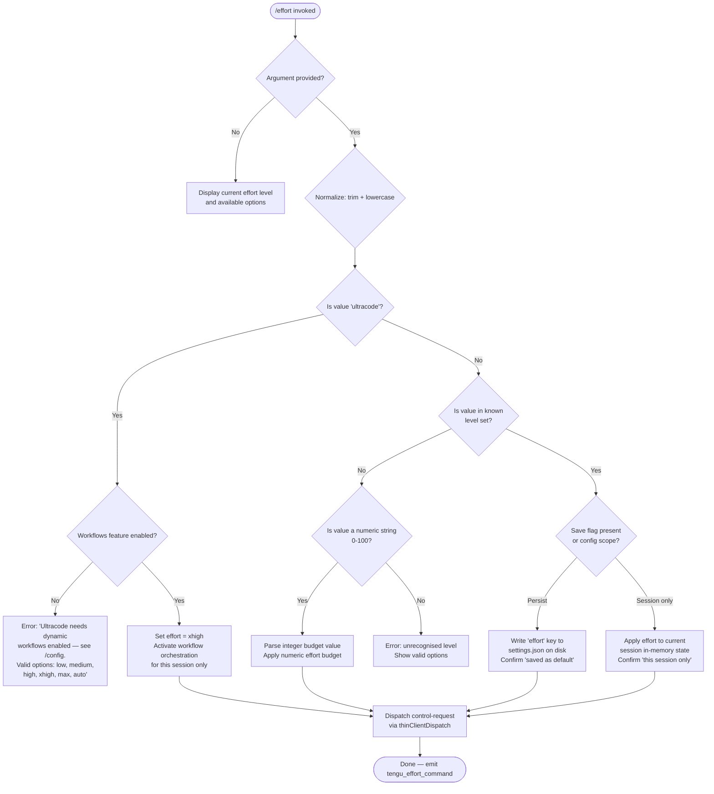

# `/effort`

> Analysis basis: CC v2.1.162 bundle.js (AST extraction + Claude interpretation)
> Minimum version: v2.1.162

---

## Overview

The `/effort` command sets the inference effort level for the current or future sessions, controlling how much reasoning depth and computational budget the model applies. It accepts a named level from a fixed vocabulary and dispatches the change as a `control-request` to the thin client, optionally persisting the setting to disk. A special `ultracode` tier combines extended effort with dynamic workflow orchestration and requires that workflows be enabled first.

---

## Registration

| Field | Value |
|---|---|
| type | `local-jsx` |
| name | `effort` |
| description | `Set effort level for model usage` |
| argumentHint | `[low\|medium\|high\|xhigh\|max\|ultracode\|auto] \| [low\|medium\|high\|xhigh\|max\|auto]` |
| immediate | `null` |
| thinClientDispatch | `control-request` |
| module_id | `A1K` |
| load_inline | `true` |
| loc_byte | `12662837` |
| loc_byte_end | `12663168` |
| loc_line | `8947` |
| arbor_handler.name | `Rhf` |
| arbor_handler.fqn | `claude-2.1.162::Rhf` |
| arbor_handler.kind | `AsyncFunction` |
| arbor_handler.resolution_path | `module_id` |
| arbor_handler.n_hits | `2` |

Analysis basis: CC v2.1.162 bundle.js:+12662837

---

## Input Branching

The command has five or more distinct input paths (no argument / known level / ultracode / numeric budget / invalid), so a flowchart is used.



Analysis basis: CC v2.1.162 bundle.js:+12649987, +12650852, +12649795, +12649839, +12650443

---

## Behavioral Spec

### Handler Entry Point (`Rhf`)

The Arbor-resolved async handler `Rhf` is the true entry point (resolution path: `module_id → A1K`). It checks whether the current session context places the agent in a `current` or `status` rendering mode, then delegates to the JSX-rendering pipeline via `JA.createElement`.

Analysis basis: CC v2.1.162 bundle.js:+12661029, +12661046, +12661069, +12661084, +12661100

### Argument Parsing and Normalisation (`normaliseInputArg`)

```
function normaliseInputArg(rawArg):
    trimmed = rawArg.trim()
    lower   = trimmed.toLowerCase()
    return lower
```

The trimmed/lowercased value is then tested against the valid-level set.

Analysis basis: CC v2.1.162 bundle.js:+12651675, +4164943

### Valid Level Resolution (`resolveEffortLevel`)

```
KNOWN_LEVELS = {"low", "medium", "high", "xhigh", "max", "auto",
                "ultracode"}

LEVEL_DESCRIPTIONS = {
  "low":    "Quick, straightforward implementation with minimal overhead",
  "medium": "Balanced approach with standard implementation and testing",
  "high":   "Comprehensive implementation with extensive testing and documentation",
  "xhigh":  (extended — see xhigh path),
  "max":    "Maximum capability with deepest reasoning",
  "auto":   "Use the default effort level for your model",
}

function resolveEffortLevel(normalised):
    if normalised == "ultracode":
        return resolveUltracode()
    if normalised in KNOWN_LEVELS:
        return applyNamedLevel(normalised)
    numericValue = parseInt(normalised, 10)
    if not isNaN(numericValue) and 0 <= numericValue <= 100:
        return applyNumericBudget(numericValue)
    return errorUnknownLevel(normalised)
```

Analysis basis: CC v2.1.162 bundle.js:+4167112, +4167190, +4167283, +4167447, +4166197, +4165750, +4167786, +4167828, +4165389

### Ultracode Guard (`resolveUltracode`)

```
function resolveUltracode():
    workflowsEnabled = checkFeatureFlag("allow_workflows")
    if not workflowsEnabled:
        displayError(
          "Ultracode needs dynamic workflows enabled (see /config). "
          "Valid options are: low, medium, high, xhigh, max, auto"
        )
        return ABORT
    setEffortLevel("xhigh")
    enableDynamicWorkflowOrchestration(sessionOnly = true)
    displayStatus(
      "Current effort level: ultracode "
      "(xhigh + dynamic workflow orchestration; this session only)"
    )
    return SUCCESS
```

The ultracode mode is always session-scoped; it is never persisted to `settings.json`.

Analysis basis: CC v2.1.162 bundle.js:+12650852, +12650012, +4163069, +4163270

### Named Level Application (`applyNamedLevel`)

```
function applyNamedLevel(level, saveAsDefault):
    if remoteTransportActive():
        appendNote(" (applied locally — this remote transport "
                   "can't change server effort)")
    if saveAsDefault:
        writeSettingsKey("effort", level)          # persists to .claude/settings.json
        displayConfirmation(level + " (saved as your default for new sessions)")
    else:
        setSessionEffortState(level)
        displayConfirmation(level + " (this session only)")
    emitTelemetry("tengu_effort_command")
    dispatchControlRequest()
```

Analysis basis: CC v2.1.162 bundle.js:+12648837, +12649795, +12649839, +12648960, +4163603

### Model Compatibility Check (`isModelEffortCompatible`)

```
EFFORT_COMPATIBLE_MODELS = [
  "claude-3-*",
  "claude-opus-4-0",  "claude-opus-4-1",  "claude-opus-4-5",
  "claude-opus-4-6",  "claude-opus-4-7",  "claude-opus-4-8",
  "claude-sonnet-4-0","claude-sonnet-4-5","claude-sonnet-4-6",
  "claude-haiku-4-5",
]

XHIGH_EFFORT_VARIANTS = ["opus-4-7", "opus-4-8"]
MAX_EFFORT_KEY        = "max_effort"
XHIGH_EFFORT_KEY      = "xhigh_effort"

function isModelEffortCompatible(modelId, requestedLevel):
    if modelId.includes("claude-3-") or modelId in EFFORT_COMPATIBLE_MODELS:
        return true
    return false
```

Analysis basis: CC v2.1.162 bundle.js:+4163662, +4163680, +4163703, +4163726, +4163751, +4163776, +4163872, +4163895, +4163918, +4163941, +4164141, +4165810, +4165872, +4164014, +4164391

### Pro-Tier Gate (`checkProTierForEffort`)

```
function checkProTierForEffort(userContext):
    if userContext.plan == "pro":
        allow extended effort tiers
    checkFeatureFlag("allow_product_feedback")   // logged during flag evaluation
    return tierAllowed
```

Analysis basis: CC v2.1.162 bundle.js:+4163515, +4161642

### No-Argument Display (`displayCurrentEffort`)

```
function displayCurrentEffort(currentState):
    level = currentState.effort ?? "unset"
    if level == "unset":
        display "auto" semantics explanation
    else:
        display level name + description
    list all valid levels with descriptions
    if ultracode available (workflows enabled):
        append ultracode option to listing
```

The `unset` sentinel and `auto` token are distinct: `unset` means the user has never issued `/effort`, while `auto` is an explicit opt-in to model-default behavior.

Analysis basis: CC v2.1.162 bundle.js:+12661048, +4165722, +4165750, +12648553

### Settings Persistence Layer (`applyFlagSettings` / `writeUserSettings`)

```
function persistEffortSetting(level):
    loadSettingsFromDisk()             # reads .claude/settings.json
    mergeKey("effort", level)
    writeSettingsAtomically()          # temp-file + rename pattern
    emitTelemetry("apply_flag_settings")
```

The atomic-write helper uses a randomly-named temp file, applies original file permissions, then calls `rename` to prevent partial writes.

Analysis basis: CC v2.1.162 bundle.js:+12648960, +1266529, +1266539, +1055883, +1056077

### Ultracode Animation Component (`Xg` / `tAK`)

A JSX component renders a visual ripple animation labelled `"violet-ripple"` when the `ultracode` tier is active. It uses trigonometric helpers (`Math.cos`, `Math.sqrt`, `Math.round`, `Math.floor`) to compute animated particle positions with a period that cycles over 17 frames, using constants `3`, `4`, and `8.5` for radial spread.

Analysis basis: CC v2.1.162 bundle.js:+12653493, +12653510, +12653514, +12653534, +12653570, +12653592, +12653689, +12655226, +12655262, +12655284, +12655125

### `xhigh + workflows` Label

When ultracode is active and workflow orchestration is engaged, the display label resolves to `"xhigh + workflows"`.

Analysis basis: CC v2.1.162 bundle.js:+12653822

### Remote Transport Advisory

When a remote transport backend is detected, the command applies the effort change locally but appends a disclaimer that the remote server's effort cannot be changed through this mechanism.

Analysis basis: CC v2.1.162 bundle.js:+12648837

---

## State & Side Effects

| Item | Detail |
|---|---|
| Telemetry | `tengu_effort_command` (emitted on every successful level change, +12650443); `tengu_workflows_enabled` (emitted during workflow feature-flag check, +4163270); `tengu_slate_finch` (emitted in settings-write path, +4167570); `tengu_feature_ok` / `tengu_feature_sad` / `tengu_feature_bad` (feature-flag evaluation hooks, +1008233 / +1008376 / +1008295); `tengu_config_auth_loss_prevented` (write-guard in global config save, +3251708) |
| thinClientDispatch | `control-request` — dispatched after every successful level application |
| appState changes | `effort` key in session state updated (in-memory); optionally written to `.claude/settings.json` or `.claude/settings.local.json` for persistence across sessions |
| Workflow orchestration | Toggled on (session-only) when ultracode is selected and `allow_workflows` feature flag is true |
| Sound | <!-- TODO: not found in depth-2 traversal; needs --depth 4 --> |
| Settings files touched | `.claude/settings.json` (global default save), `.claude/settings.local.json` (local override) |
| Atomic write | Temp-file + `fchmodSync` + `fsyncSync` + `renameSync` pattern used to prevent partial writes |

---

## Version History

| Version | Change |
|---|---|
| v2.1.162 | Initial analysis — eight effort levels (`low`, `medium`, `high`, `xhigh`, `max`, `ultracode`, `auto`, numeric 0–100); `ultracode` requires `allow_workflows` flag; remote-transport advisory added |

---

## Common Mistakes

1. **Using `/effort ultracode` without workflows enabled.** The command will refuse and print an error directing you to `/config`. Enable dynamic workflow orchestration first, then retry.
2. **Expecting ultracode to persist across sessions.** The `ultracode` mode is always session-scoped regardless of any `--save` flag; only the underlying `xhigh` level can be persisted.
3. **Confusing `unset` with `auto`.** Running `/effort` with no argument when the level has never been changed will show `unset`, not `auto`. Explicitly passing `auto` opts in to model-default behavior.
4. **Using `/effort` to change server-side effort on a remote transport.** When a remote backend is active, the change is applied locally only; the server ignores it. The CLI will display an advisory to this effect.
5. **Passing a numeric value expecting a percentage.** Numeric values are interpreted as a raw budget integer (0–100), not a percentage of the maximum level. Prefer named levels for predictable behavior.
6. **Assuming all Claude models support all effort tiers.** The `xhigh` variants `opus-4-7` and `opus-4-8` have specific model compatibility requirements; using an unsupported model with an incompatible tier may silently downgrade the effective level.

---

## Appendix — Identifier Mapping

> For bundle debugging only. Identifiers change across versions.

| Identifier | Role |
|---|---|
| `Rhf` | Main async handler for `/effort` command (Arbor-resolved entry point) |
| `ER8` | Top-level effort command dispatcher / render coordinator |
| `za` | Effort command orchestration function (calls level resolver + display) |
| `KP` | Effort level application core (routes named levels to state changes) |
| `BL8` | Boolean/string coercion helper used in level validation |
| `tH` | String conversion utility |
| `pT` | State persistence / settings-write helper |
| `QK9` | Feature-flag / workflow enablement check |
| `W9` | Workflow feature-flag evaluator |
| `tG_` | Pro-tier / plan gating function |
| `RuL` | Extended effort tier resolver (pro plan path) |
| `SuL` | Session-scoped effort state setter |
| `Oa` | Effort level display / UI composition function |
| `bW` | Model compatibility checker for effort levels |
| `K9` | Model-ID classification helper |
| `A` | String array / model list utility |
| `By` | First-party API key type classifier |
| `kY` | Provider-type resolver (`firstParty`, `anthropicAws`, `foundry`, `mantle`) |
| `svH` | Model suffix / variant effort checker (`opus-4-7`, `opus-4-8`) |
| `C6` | Session state writer (timestamps + persistence) |
| `dL8` | Model-ID lookup for effort display |
| `avH` | Current effort level reader from session/settings state |
| `Eu` | Numeric effort budget parser (`parseInt` + `isNaN` guard) |
| `kj6` | `max_effort` path handler |
| `QnH` | `xhigh_effort` path handler |
| `l4` | Configuration / feature-flag reader |
| `QGH` | Configuration object accessor |
| `HN` | Effort UI component host |
| `BLH` | Valid-level membership tester |
| `ovH` | Known effort-level set (contains `ZI` array) |
| `S8H` | Level-to-string formatter |
| `_E_` | Settings write / apply-flag-settings dispatcher |
| `CuL` | Settings key merger |
| `FKH` | Flag-settings application function |
| `Aq` | Client configuration builder |
| `E4_` | Config field extractor |
| `G4_` | Config field extractor (secondary) |
| `AD` | API client constructor |
| `j6` | Event / notification emitter for settings changes |
| `zw6` | Event bus subscriber |
| `Dw6` | Event bus unsubscriber |
| `Hu` | Notification dispatch helper |
| `ex` | Core event-channel accessor |
| `U18` | Settings-change deduplication and broadcast |
| `rJ_` | Settings change event emitter (uses `crypto.randomUUID`) |
| `eJ_` | Settings listener registration |
| `_1K` | Ultracode animation particle-position calculator (uses `Math.cos`, `Math.min`, `Math.round`) |
| `H1K` | Ultracode animation radial helper (uses `Math.sqrt`) |
| `tAK` | Ultracode animation component driver (uses `Math.floor`) |
| `Gu` | Effort state reader + `xhigh_effort` branch router |
| `rAK` | Animation frame-slice helper |
| `H` | Context/model list array helper |
| `v` | File-fetching / bootstrap utility |
| `PgK` | Path-building helper |
| `SH` | JSON serialiser (`JSON.stringify`) |
| `V4` | Path manipulation utility |
| `WpH` | Path-expansion helper |
| `EgK` | File-read / context-loading helper |
| `_3` | Generic utility (exact role unclear at depth 2) |
| `AY_` | String split/trim/index helper |
| `q` | File-system operations namespace |
| `LHH` | Tracking-set membership checker |
| `bJ` | String replacement helper |
| `a1` | Model-name normaliser |
| `oHH` | Model alias resolution |
| `qq` | Model-name alias map (opusplan, sonnet, haiku, opus, best) |
| `rX` | Model-name alias lookup with fallback |
| `t6` | Terminal/UI render helper |
| `c` | React-style component renderer |
| `Z6` | Component render dispatcher |
| `GR8` | Effort + model-name reader combo |
| `TR8` | Full effort command render function (lowercase + branch) |
| `Ohf` | Effort change confirmation renderer |
| `VKA` | Config-read + feature-flag combo for effort UI |
| `ME` | Config reader |
| `hj6` | Effort display block composer |
| `ZwH` | Display string formatter |
| `r_` | Atomic settings file writer |
| `gO` | Settings directory resolver |
| `i6` | Path-existence checker |
| `vH_` | Settings file read helper |
| `gQ` | Settings JSON parser and field extractor |
| `gP` | Settings write helper |
| `R8` | ENOENT error handler |
| `Te8` | Settings cache timestamper |
| `yTH` | Settings load + parse entry |
| `u56` | Atomic file write implementation (temp + rename) |
| `cz` | Cache clear utility |
| `Zd6` | Gitignore / settings file writer with mkdir |
| `Ix` | Settings path constructor (`.claude/settings.json`) |
| `X_` | Home-directory resolver |
| `hH` | Feature OK renderer |
| `RH` | Feature BAD renderer |
| `_U` | Settings load-from-disk orchestrator |
| `kH` | Parallel settings-load manager |
| `jC` | Effort status display component |
| `G8` | Global config save with auth-loss guard |
| `E6` | Error display component |
| `Zx6` | Base error/status component |
| `zhf` | Effort-display with workflow-status variant |
| `dnH` | Input trimmer + level validator |
| `$hf` | Effort-apply with save path (persisted default) |
| `Xg` | Ultracode ripple animation JSX component |
| `O` | DOM/JSX element array |
| `x8` | Background-session status checker |

---

Note: index built via Arbor fallback; some signals (telemetry, literals) may be missing — see arbor-fallback.js.