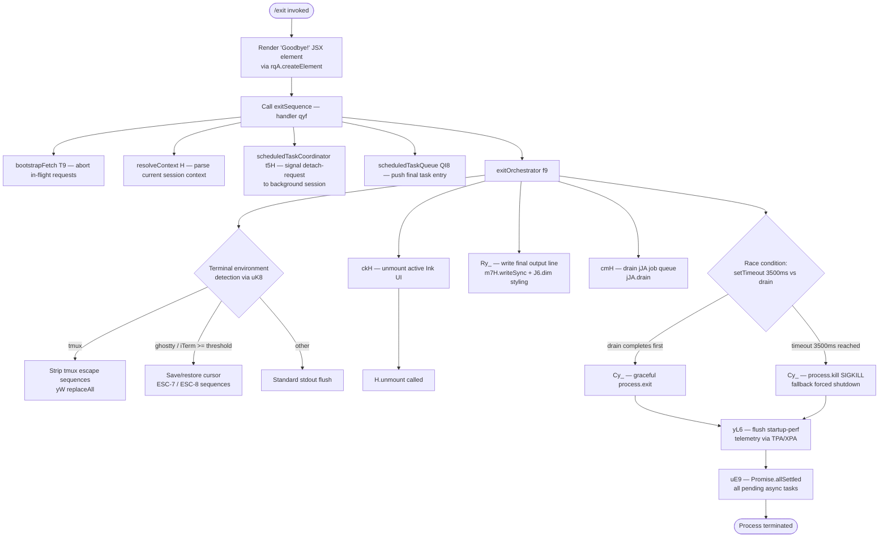

# `/exit`

> Analysis basis: CC v2.1.162 bundle.js (AST extraction + Claude interpretation)
> Minimum version: v2.1.162

---

## Overview

The `/exit` command (also invocable as `/quit`) terminates the current Claude Code CLI session. When executed, it triggers an orderly shutdown sequence: it unmounts the active UI, flushes pending I/O, drains background jobs, fires a `session_end` telemetry event, and finally calls `process.exit`. The command is classified as `local-jsx`, runs immediately (`immediate: true`), and renders a brief farewell JSX element ("Goodbye!") before tearing down the process.

---

## Registration

| Field | Value |
|---|---|
| type | `local-jsx` |
| name | `exit` |
| description | `null` |
| aliases | `["quit"]` |
| immediate | `true` |
| module_id | `C_K` |
| load_inline | `true` |
| loc_byte | `12582517` |
| loc_byte_end | `12582713` |
| loc_line | `8924` |
| arbor_handler.name | `qyf` |
| arbor_handler.fqn | `claude-2.1.162::qyf` |
| arbor_handler.kind | `AsyncFunction` |
| arbor_handler.resolution_path | `module_id` |
| arbor_handler.n_hits | `1` |

Analysis basis: CC v2.1.162 bundle.js:+12582517

---

## Input Branching

The exit handler has more than three distinct internal branches (UI unmount path, terminal-restore path, daemon/background-process drain path, process kill vs. graceful exit). A flowchart is used.



---

## Behavioral Spec

### 1. Handler Entry — `exitHandler` (`qyf`)

The Arbor-resolved handler (`qyf`) is an `AsyncFunction`. Its execution flow is:

```
async function exitHandler(context):
    bootstrapAbort(context)           // T9 — abort any in-flight bootstrap fetch
    resolveSessionContext(context)    // H  — parse session identifiers, headers
    scheduledTaskDetach(context)      // t5H — send "detach-request" to bg session
    scheduledTaskQueueEntry(context)  // QI8 — push final "scheduled task" entry
    jsxElement = createElement("Goodbye!")  // rqA.createElement, literal "Goodbye!"
    invokeExitOrchestrator(context)   // f9 — main shutdown pipeline
    return jsxElement
```

Analysis basis: CC v2.1.162 bundle.js:+12581766, +12581778, +12581782, +12581843

---

### 2. Bootstrap Abort — `bootstrapAbort` (`T9`)

```
function bootstrapAbort(ctx):
    // Calls szH to cancel any running bootstrap HTTP fetch.
    // Modes checked: "bg", "daemon", "daemon-worker"
    abortInFlightFetch(ctx)   // szH
```

Literal modes found: `"bg"` (bundle.js:+2249658), `"daemon"` (bundle.js:+2249668), `"daemon-worker"` (bundle.js:+2249682).

Analysis basis: CC v2.1.162 bundle.js:+12581766

---

### 3. Session Context Resolution — `resolveSessionContext` (`H`)

```
function resolveSessionContext(ctx):
    result = cacheGet(ctx)                   // e_.get
    parsed = parseArgLine(ctx)               // AY_ — splits, trims, indexes input
    headerCheck = hasKnownHeader(parsed)     // LHH — Y94.has lookup
    sanitized = sanitizeReplacements(parsed) // bJ  — H.replace
    modelAlias = resolveModelAlias(parsed)   // a1  — oHH/qq chain
    bootstrapped = bootstrapFetch(ctx)       // t6  — with 5000ms timeout
    return { parsed, modelAlias, bootstrapped }
```

Timeout constant: `5000` ms (bundle.js:+15591194). Bootstrap fetch logs `"[Bootstrap] Fetching"` (bundle.js:+15590993) and `"[Bootstrap] Fetch ok"` (bundle.js:+15591367). On parse failure, records `"parse_failed"` (bundle.js:+15591337). Telemetry event `api_bootstrap_fetch` (bundle.js:+15591315).

Analysis basis: CC v2.1.162 bundle.js:+15591029, +15591125

---

### 4. Scheduled Task Detach — `scheduledTaskDetach` (`t5H`)

```
async function scheduledTaskDetach(ctx):
    sessionInfo = getSessionInfo(ctx)   // yt6
    taskHandle = getTaskHandle(ctx)     // Ibq — zI8 + x8
    writeDetachSignal(taskHandle)       // It  — vt.write
    markAsDetached(ctx)                 // d1H
    // Literal label used: "detach-request"
    // Task kind label: "task"
```

Literals: `"detach-request"` (bundle.js:+10958417), `"task"` (bundle.js:+10952979).

Analysis basis: CC v2.1.162 bundle.js:+12581782, +10958383

---

### 5. Scheduled Task Queue Push — `scheduledTaskQueue` (`QI8`)

```
function scheduledTaskQueue(ctx):
    emitter = getEmitter(ctx)             // oG — Nv
    taskList.push(entry)                  // H.push
    taskEntry = buildTaskEntry(ctx)       // W$f — zN + mI + LrH
    truncatedWidth = computeWidth(ctx)    // t9  — L8 / G1
    // Label for UI display: "scheduled task"
```

Literal: `"scheduled task"` (bundle.js:+10951848).

Analysis basis: CC v2.1.162 bundle.js:+12581813, +10951829

---

### 6. Exit Orchestrator — `exitOrchestrator` (`f9`)

This is the central shutdown pipeline.

```
async function exitOrchestrator(ctx):
    resolvePromise = Promise.resolve()       // immediate microtask
    scheduleZ7(ctx)                          // Z7
    paddedK(ctx)                             // K
    await sleep(setTimeout — delay)

    // Step A: Unmount UI
    unmountResult = await unmountUI(ctx)     // ckH
        writeSync(m7H)
        uiHandle = i4.get(ctx)
        uiHandle.unmount()                   // H.unmount
        restoreTerminal(ctx)                 // LC
        writeTerminalSequences(ctx)          // uK8

    // Step B: Write farewell line
    writeFarewellLine(ctx)                   // Ry_
        rG(ctx)
        Hx(ctx)
        S6(ctx)                              // Nv
        NW6(ctx)                             // path stat checks — $R, TO, X_, DY.join
        replaceAll(output)
        dimStyle = J6.dim(output)
        writeSync(m7H, dimStyle)
        // Escapes backslash "\\", quote "\""

    // Step C: Drain job queue
    drainJobs(ctx)                           // cmH — jJA.drain

    // Step D: Race timeout vs drain
    timeout = Math.max(3500, computedDelay)  // literal 3500 (bundle.js:+5426400)
    timer = setTimeout(timeout)
    timer.unref()                            // NjH.unref
    winner = await Promise.race([drainPromise, timer])

    // Step E: Flush remaining tasks (abort-signaled)
    await flushAllSettled(ctx)               // uE9 — Promise.allSettled + Array.from
    abortSignal = AbortSignal.timeout(...)   // q

    // Step F: Persist startup-perf telemetry
    await persistPerfLog(ctx)               // yL6 — Zd8/TPA/XPA

    // Step G: Write final session summary
    writeSessionSummary(ctx)                // S38 — rG, vE9, NE9, M1

    // Step H: Close remaining handles
    pK6(ctx)
    c(ctx)
    E6(ctx)                                  // Zx6

    // Step I: Race final cleanup
    await Promise.race([R38, n8])            // R38: Promise.all/resolve/race, n8: timeout 500ms

    // Step J: Final write
    writeSync(m7H)

    // Telemetry: "session_end"
    fireEvent("session_end")                 // literal bundle.js:+5426790
    fireEvent("prompt_input_exit")           // literal bundle.js:+12581954
```

Key constants:
- Shutdown race timeout: `3500` ms (bundle.js:+5426400)
- Secondary cleanup timeout: `2000` ms (bundle.js:+5426578)
- Final micro-timeout: `500` ms (bundle.js:+5425971)

Analysis basis: CC v2.1.162 bundle.js:+12581949, +5426364, +5426370, +5426376, +5426409, +5426513, +5426590, +5426638, +5426678, +5426727, +5426834, +5426860

---

### 7. Terminal Cleanup — `writeTerminalSequences` (`uK8`)

```
function writeTerminalSequences(ctx):
    io.writeSync(stdout)
    restoreSequences = buildRestoreSeqs(ctx)  // $vH — bD, vt1.coerce, cV
    // Terminal detection:
    if env == "ghostty" and version >= "1.2.0":
        emit ESC-8 restore sequence     // "\x1b8" bundle.js:+3767059
    elif env == "iTerm.app" and version >= "3.6.6":
        emit ESC-8 restore sequence
    else:
        emit ESC-7 save sequence        // "\x1b7" bundle.js:+3767048

    handleMux = detectMux(ctx)          // eNH
    if mux == "tmux":
        stripped = yW.replaceAll(input, tmuxEscape)  // "\x1b\x1b" bundle.js:+3416527
    elif mux == "screen":
        handleScreen(ctx)
    
    q$(ctx)
    v(ctx)
```

Literal terminal identifiers: `"ghostty"` (bundle.js:+3495166), `"iTerm.app"` (bundle.js:+3495235), `"tmux"` (bundle.js:+3416481), `"screen"` (bundle.js:+3416554).
Version thresholds: `"1.2.0"` (bundle.js:+3495196), `"3.6.6"` (bundle.js:+3495267).

Analysis basis: CC v2.1.162 bundle.js:+3767068, +3767097, +3767118, +3767139

---

### 8. Process Kill — `processKiller` (`Cy_`)

```
async function processKiller(ctx):
    clearTimeout(pendingTimer)
    uiHandle = i4.get(ctx)
    if gracefulPathAvailable:
        process.exit(code)              // bundle.js:+5424533
    else:
        process.kill(pid, signal)       // bundle.js:+5424558
        throw new Error("unreachable")  // literal "unreachable" bundle.js:+5424606
```

Analysis basis: CC v2.1.162 bundle.js:+5424452, +5424533, +5424558

---

### 9. Startup Perf Telemetry Flush — `persistPerfLog` (`yL6`)

```
async function persistPerfLog(ctx):
    perfData = Zd8(ctx)             // TPA — perf_hooks require, mark "main_after_run"
    if perfData empty:
        log("Startup profiling not enabled")   // bundle.js:+214636
        return
    profileDir = XPA(ctx)           // vL6.dirname + i6 + P3H (openSync/writeFileSync/fsyncSync/closeSync)
    report = YPA(ctx)               // build checkpoint table, width 80
    writeReport(report, "utf8")     // literal "utf8" bundle.js:+215285
    log("Startup profiling report:")
    // Telemetry: tengu_startup_perf
    fireEvent("tengu_startup_perf")
```

Literals: `"mark"` (bundle.js:+215762), `"main_after_run"` (bundle.js:+215865), `"startup-perf"` (bundle.js:+215614), `"STARTUP PROFILING REPORT"` (bundle.js:+214801), column width `80` (bundle.js:+214789), max size `1048576` bytes (bundle.js:+216295).

Analysis basis: CC v2.1.162 bundle.js:+5426714, +215130, +215145

---

### 10. Session Summary Writer — `writeSessionSummary` (`S38`)

```
function writeSessionSummary(ctx):
    rG(ctx)
    vE9(ctx)
    c(ctx)
    summaryEntry = NE9(ctx):     // Date.now, Math.max, Math.round, Object.assign, ZE9
        elapsed = Date.now() - startTime
        rounded = Math.round(Math.max(elapsed, 0))
    M1(ctx):                     // agentLoop — LHH, pX_, ko, v, mX_, i_, XEL, j6
        isLocalAgent = (agentType == "local-agent")   // bundle.js:+3424682
        detectFlicker(ctx)       // fullscreen/tmux-CC/windows-ssh detection
    // Telemetry: tengu_scroll_summary
    fireEvent("tengu_scroll_summary")
```

Literals: `"local-agent"` (bundle.js:+3424682), `"fullscreen"` (bundle.js:+3425219), `"default"` (bundle.js:+3425245).

Analysis basis: CC v2.1.162 bundle.js:+5425668, +5425709, +5425726

---

## State & Side Effects

| Item | Detail |
|---|---|
| Telemetry: `session_end` | Fired at end of `exitOrchestrator` (bundle.js:+5426790) |
| Telemetry: `prompt_input_exit` | Fired via `Ayf`/`p2` path (bundle.js:+12581954) |
| Telemetry: `tengu_scroll_summary` | Fired in session summary writer `S38` (bundle.js:+5425682) |
| Telemetry: `tengu_startup_perf` | Fired only when startup profiling is active (bundle.js:+216816) |
| Telemetry: `tengu_cache_eviction_hint` | Fired during cleanup path (bundle.js:+5426752) |
| Telemetry: `tengu_amber_creek` | Fired in `j6` / `M1` rendering path (bundle.js:+3425402) |
| Telemetry: `tengu_pewter_brook` | Fired in `XEL` / `M1` rendering path (bundle.js:+3425310) |
| Telemetry: `tengu_feature_sad` | Fired in `t6` / bootstrap context (bundle.js:+1008376) |
| Telemetry: `tengu_bg_dispatch_sigkill_escalate` | Fired if background session requires SIGKILL (bundle.js:+15996373) |
| Telemetry: `tengu_bg_dispatch_low_mem` | Fired on low-memory condition during bg dispatch (bundle.js:+15996974) |
| Telemetry: `tengu_bg_spare_enable` | Fired when a spare background session is enabled (bundle.js:+15997678) |
| Telemetry: `tengu_bg_spare_claim` | Fired when spare session is claimed (bundle.js:+15997806) |
| Telemetry: `tengu_bg_spare_claim_fail` | Fired on spare claim failure (bundle.js:+15998072) |
| Telemetry: `tengu_daemon_config_reload` | Fired during daemon lifecycle (bundle.js:+16011003) |
| UI unmount | `H.unmount()` called on active Ink UI handle (bundle.js:+5423946) |
| Hook deregistration | `jJA.register` and `jJA.drain` called to flush hook queue (bundle.js:+60123, +60166) |
| `appState` changes | Supervisor state machine transitions: `stop`, `updateConfig`, `start` via `Z` object (bundle.js:+16010598, +16010607, +16010625) |
| File I/O | Startup-perf report optionally written to disk via `TqH.openSync`/`writeFileSync`/`fsyncSync`/`closeSync` (bundle.js:+185483) |
| Sound | No sound-related literals or call edges observed in depth-2 traversal |
| Process termination | `process.exit` (graceful) or `process.kill` + SIGKILL (forced, after 3500ms timeout) |
| Background session cleanup | Detach-request sent; background processes issued SIGTERM then SIGKILL if needed (bundle.js:+15998328, +15996421) |
| Terminal sequences | ESC-7/ESC-8 cursor save/restore emitted depending on terminal type (bundle.js:+3767048, +3767059) |

---

## Version History

| Version | Change |
|---|---|
| v2.1.162 | Initial analysis |

---

## Common Mistakes

1. **Expecting instant termination**: `/exit` runs an asynchronous shutdown pipeline with up to a 3500 ms drain window before forcing SIGKILL. Scripts that fork Claude Code and expect immediate process death after `/exit` may need a longer wait.
2. **Confusing `/exit` and `/quit`**: Both are identical; `quit` is a registered alias. There is no behavioral difference.
3. **Missing `session_end` telemetry in offline environments**: The telemetry flush is async and race-protected. If the process is killed externally before `exitOrchestrator` completes, `session_end` may not be recorded.
4. **Assuming startup-perf output is always written**: The `yL6`/`XPA` perf-report path only executes when startup profiling is enabled. Under normal usage no file is written to disk on exit.
5. **Terminal state corruption**: If the process is hard-killed (SIGKILL from outside) rather than via `/exit`, the ESC-7/ESC-8 terminal restore sequences are never emitted, potentially leaving the terminal in an altered state (cursor position, tmux pane state).

---

## Appendix — Identifier Mapping

> For bundle debugging only. Identifiers change across versions.

| Identifier | Role |
|---|---|
| `qyf` | Main exit handler (AsyncFunction; Arbor-resolved entry point) |
| `T9` | Bootstrap abort — cancels in-flight fetch on exit |
| `szH` | Fetch cancellation helper called by T9 |
| `H` | Session context resolver / general utility (overloaded) |
| `v` | Output formatting / log-level utility |
| `PgK` | Log-level pipeline helper |
| `PJA` | Log formatter sub-step |
| `SH` | JSON.stringify wrapper |
| `V4` | String path/extension manipulation utility |
| `rXA` | Map-over-path-segments helper |
| `q` | AbortSignal / file-unlink utility (overloaded) |
| `A` | String/array utility (overloaded) |
| `WpH` | Write-to-handle wrapper |
| `pXA` | Underlying H.write wrapper |
| `EgK` | Transcript/log flush orchestrator |
| `dmH` | Debounce/flush timer manager |
| `E3H` | Log-segment joiner |
| `i6` | Directory existence check |
| `zL6` | EISDIR error handler |
| `_PA` | Path-join + S6 write helper |
| `HPA` | File rename/unlink handler (`.txt` extension) |
| `GgK` | Append-file + mkdir orchestrator |
| `J9` | Hook registration dispatcher — jJA.register |
| `_3` | Context field extractor |
| `AY_` | Argument line parser (split/trim/indexOf/slice) |
| `LHH` | Known-header set lookup (Y94.has) |
| `bJ` | String sanitizer (H.replace) |
| `a1` | Model alias resolution entry |
| `oHH` | Alias chain dispatcher |
| `k0` | Alias table key lookup |
| `OqH` | Alias validation |
| `Dd` | Model-string parser (trim/startsWith/includes) |
| `qq` | Core model name normalizer |
| `Q0` | BKH-based model qualifier |
| `pKH` | Provider inclusion check (mKH.includes) |
| `qI` | Model-variant resolver (UM + G5) |
| `LQH` | G5-only variant resolver |
| `PE` | First-party model selector (UM + G5 + wA) |
| `RJ1` | PE-delegating resolver |
| `UM` | wA-delegating resolver |
| `Xt6` | z8L.includes checker |
| `fQH` | tH-delegating resolver |
| `rX` | Recursive qq + g0 resolver |
| `g0` | Multi-field model composer (WA, H6H, ozH, MQH, PE, A2, UM, wA, G5, qI) |
| `t6` | Bootstrap fetch dispatcher (with 5000ms timeout) |
| `c` | Core config/constant accessor (overloaded) |
| `Z6` | Zx6-delegating utility |
| `Zx6` | Low-level constant resolver |
| `t5H` | Scheduled-task detach coordinator |
| `yt6` | Session info getter for t5H |
| `Ibq` | Task handle resolver (zI8 + x8) |
| `zI8` | Task identifier builder |
| `x8` | Task handle accessor |
| `It` | Detach write dispatcher (vt.write + SH) |
| `d1H` | Post-detach marker |
| `DM` | Dependency/module loader |
| `QI8` | Scheduled-task queue push handler |
| `oG` | Event emitter getter (Nv) |
| `Nv` | Event emission primitive |
| `W$f` | Task entry builder (zN + mI + LrH + Math/Date) |
| `zN` | Cron-string parser (parseInt, toString, match) |
| `K` | Column formatter (map + padEnd) |
| `w` | Background session process manager |
| `L` | Async task tracker (add/finally/delete) |
| `J` | Process value iterator |
| `Y` | Forced-shutdown dispatcher (process.exit + z.abort) |
| `$` | p1K-based queue accessor |
| `j` | Date-aware session wrapper |
| `mI` | Schedule entry parser (trim + ncL) |
| `ncL` | Schedule field parser (split/match/parseInt/add/Array.from) |
| `LrH` | Time-slot resolver (setSeconds/setMinutes/getMinutes etc.) |
| `O` | x8-based object accessor |
| `f` | File/connection handle manager (close/delete/L) |
| `q9` | Duration formatter (Math.floor + Math.round) |
| `t9` | Text width calculator (indexOf/substring/L8/G1) |
| `L8` | Bun.stringWidth wrapper |
| `G1` | Grapheme-aware width calculator |
| `mD` | Display measurement helper |
| `Ayf` | prompt_input_exit event dispatcher (p2) |
| `f9` | Exit orchestrator — main shutdown pipeline |
| `ckH` | UI unmount handler (writeSync + i4.get + H.unmount + LC + uK8) |
| `LC` | Terminal restore caller |
| `uK8` | Terminal sequence writer (io.writeSync + $vH + eNH + yW + q$) |
| `$vH` | Terminal environment detector (bD + vt1.coerce + cV) |
| `eNH` | Multiplexer (tmux/screen) detector |
| `yW` | tmux escape sequence stripper (SX_ + H.replaceAll) |
| `q$` | Post-sequence cleanup |
| `Ry_` | Farewell output line writer (rG + Hx + S6 + NW6 + m7H.writeSync + J6.dim) |
| `rG` | Output route getter |
| `Hx` | Handle extractor |
| `S6` | Nv-delegating writer |
| `NW6` | Path existence checker ($R + TO + X_ + DY.join + i6 + q.statSync) |
| `$R` | Nv-backed path resolver |
| `X_` | Nv-backed alternate path resolver |
| `g$` | S6 + U4 caller |
| `U4` | J9-delegating hook registrar |
| `IE9` | Inline environment accessor |
| `Cy_` | Process killer (clearTimeout + process.exit + process.kill) |
| `cmH` | Job queue drainer (jJA.drain) |
| `D` | Supervisor / daemon state manager |
| `Y0H` | Supervisor store reader (V9 + V8 + k4A + TH + b9 + I4A) |
| `V9` | AsyncLocalStorage getStore |
| `V8` | Version/build constant |
| `k4A` | I4A-delegating accessor |
| `TH` | String coercion helper |
| `OKK` | Supervisor key/max calculator (Object.keys + Math.max + TY) |
| `E` | Event stop/prevent handler |
| `b` | b.preventDefault wrapper |
| `c0` | r_-delegating config reader |
| `Z` | Supervisor lifecycle controller (stop/updateConfig/start) |
| `xCK` | d6H-delegating heartbeat handler |
| `d6H` | Heartbeat dispatcher |
| `V` | V.start process handle |
| `uE9` | Promise.allSettled + Array.from async flusher |
| `yL6` | Startup-perf log persister (Zd8 + XPA) |
| `Zd8` | Perf measurement collector (TPA + c) |
| `TPA` | Perf entry normalizer (Kx + q.set/get + Object.entries + Math) |
| `XPA` | Perf report file writer (GPA + P3H + YPA + Kx + EPA + JSON.stringify + TPA) |
| `GPA` | Perf file path builder (vL6.join + s8 + S6) |
| `P3H` | Sync file write helper (openSync/writeFileSync/fsyncSync/closeSync) |
| `YPA` | Checkpoint table formatter (Kx + A.push + fp6 + gi + A.join) |
| `Kx` | require("perf_hooks") accessor |
| `EPA` | Alternate perf path builder (vL6.join + s8 + S6) |
| `S38` | Session summary writer (rG + vE9 + NE9 + M1) |
| `vE9` | Summary variant selector |
| `NE9` | Elapsed-time calculator (Date.now + Math.max/round + Object.assign + ZE9) |
| `ZE9` | Summary sub-entry builder |
| `M1` | Agent-loop summary renderer (LHH + pX_ + ko + v + mX_ + i_ + XEL + j6) |
| `pX_` | tH-based pre-render helper |
| `ko` | jEL-delegating render setup |
| `mX_` | o6 + Boolean platform detector |
| `i_` | _U-delegating inline renderer |
| `XEL` | j6-delegating extended render |
| `j6` | UI component registrar (zw6 + Dw6 + Hu + fYH + U18 + $w6 + gU + C6) |
| `pK6` | Post-summary cleanup step |
| `E6` | Zx6-delegating final constant flush |
| `R38` | Final async cleanup race (Promise.all/resolve/race + mV + cd + n8) |
| `n8` | Timeout-with-abort helper (K + Error + q + setTimeout + O + clearTimeout + L.unref) |

---

Note: index built via Arbor fallback; some signals (telemetry, literals) may be missing — see arbor-fallback.js.