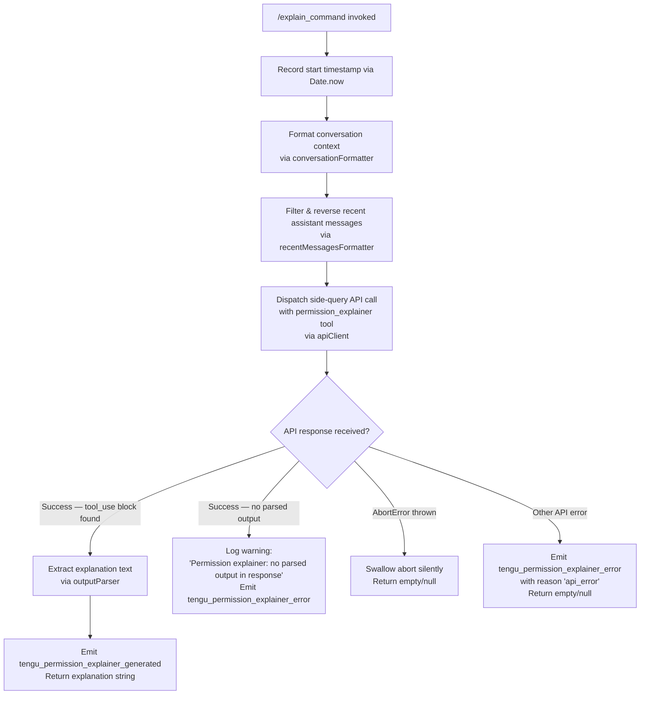

# `/explain_command`

> Analysis basis: CC v2.1.162 bundle.js (AST extraction + Claude interpretation)
> Minimum version: v2.1.162

---

## Overview

`/explain_command` is an internal `tool`-type slash command that generates a human-readable explanation of why a particular tool call or MCP tool invocation requires specific permissions. It does this by dispatching a focused side-query API call with a dedicated `permission_explainer` tool, parsing its structured output, and returning the explanation text back to the caller. The command is used internally by the permission-prompt subsystem to surface actionable context to the user before they accept or reject a permission request.

---

## Registration

| Field | Value |
|---|---|
| type | `tool` |
| name | `explain_command` |
| description | `null` |
| loc_byte | `14138749` |
| loc_byte_end | `14138785` |
| loc_line | `11130` |
| arbor_handler.name | `NPK` |
| arbor_handler.fqn | `claude-2.1.162::NPK` |
| arbor_handler.kind | `AsyncFunction` |
| arbor_handler.resolution_path | `direct` |
| arbor_handler.n_hits | `1` |

Analysis basis: CC v2.1.162 bundle.js:+14138749

---

## Input Branching

The handler has four distinct outcome paths — a Mermaid flowchart is used.



Analysis basis: CC v2.1.162 bundle.js:+14138444 (NPK→W$A), +14138489 (tof), +14138507 (eof), +14138654 (a1), +14138667 (au), +14139074 (sof), +14139230 (c), +14139282 (u9), +14139334 (permission_explainer_generate telemetry), +14139579 (no-parsed-output literal), +14139902 (AbortError), +14139973 (api_error)

---

## Behavioral Spec

### 1. Entry Point — Main Handler (`NPK`)

```
async function permissionExplainerHandler(input):
    startTime = Date.now()                          // +14138468
    context   = formatConversation(input)           // W$A → C6, +14138444
    recent    = formatRecentMessages(input)         // eof, +14138507
    normalized = normalizeText(input)               // a1, +14138654
    result    = await runSideQuery(context, recent, normalized)  // au, +14138667
    if result has parsedOutput:
        emit("tengu_permission_explainer_generated") // +14139334
        return result.explanation
    else if result is AbortError:                   // +14139902
        return null
    else:
        emit("tengu_permission_explainer_error", reason="api_error") // +14139973
        return null
```

Analysis basis: CC v2.1.162 bundle.js:+14138444

---

### 2. Conversation Formatter (`W$A` → `C6`)

The conversation formatter (`W$A`) delegates to the config-backed conversation serializer (`C6`), which:

1. Reads current config state (guarded by "Config accessed before allowed" error, +3256503).
2. Reads the config file with `readFileSync` using encoding `utf-8` (+3256586).
3. Parses the file with `JSON.parse` (+185715).
4. Normalizes path prefix using `startsWith`/`slice` helpers (`Zx`, +3252923).
5. Enumerates backup directory entries (`backups` subdirectory, +3256071).
6. Copies relevant file with `copyFileSync` timestamped via `Date.now` (+3257624).
7. Watches/unwatches files for change detection (`o18.watchFile` / `o18.unwatchFile`, +3252754 / +3253087).

Error states observed: `ENOENT` (+3256733), `EEXIST` (+3257348), config-parse error emits `tengu_config_parse_error` (+3257134).

```
function conversationFormatter(input):
    config = readConfigSync("utf-8")            // +3256559 / +3256586
    parsed = JSON.parse(config)                 // +185715
    if config access not yet allowed:
        throw Error("Config accessed before allowed.")  // +3256503
    backupDir = path.join(configDir, "backups") // +3256071
    mkdirSync(backupDir, {recursive: true})     // ignores EEXIST +3257348
    snapshot  = timestampedCopy(parsed)         // copyFileSync + Date.now +3257624
    return serializedContext
```

Analysis basis: CC v2.1.162 bundle.js:+14138320 (W$A→C6), +3253251 (C6 body)

---

### 3. Recent Messages Formatter (`eof`)

`eof` trims the conversation history down to the most recent assistant-role messages for inclusion in the explainer prompt:

```
function formatRecentMessages(messages):
    filtered = messages
        .filter(m => m.role == "assistant")     // +14138025, literal "assistant" +14138048
        .filter(m => index within last 3)       // literal 3 at +14138068
        .reverse()                              // +14138093
    truncated = []
    for msg in filtered:
        text = extractTextContent(msg)          // pi (charCodeAt/slice), +14138236
        truncated.unshift("...")                // literal "..." +14138244, unshift +14138252
    return truncated.join(separator)            // +14138285
```

The constant `3` (number of recent messages considered) is found at +14138068.
The string `"assistant"` (role filter) is found at +14138048.
The string `"..."` (truncation marker) is found at +14138244.
The per-message time window constant `1000` (ms) is found at +14138013.

Analysis basis: CC v2.1.162 bundle.js:+14138507

---

### 4. Side-Query API Dispatcher (`au` → `CU`)

`au` wraps the full Anthropic API client (`CU`) for a targeted, non-streaming side query. Key behaviors:

- Sets `x-app` header to `cli-bg` or `cli` depending on context (+2965323 / +2965332).
- Attaches `X-Claude-Code-Session-Id` (+2965356), `x-claude-remote-container-id` (+2965400), `x-claude-remote-session-id` (+2965441), `x-client-app` (+2965480), `x-claude-code-agent-id` (+2965514).
- The query is classified as `"side_query"` (+13392611) and `"sideQuery"` (+13393982).
- Request timeout: 600 000 ms (+2966217).
- OAuth token refresh logic (`VY_`) is triggered if the stored token is stale, with lock-based retry (max 5 retries, +3010908); emits multiple `tengu_oauth_token_refresh_*` events.
- On `Cloud gateway session expired`, throws a descriptive error (+2966397).
- Proxy auth helper: if workspace trust not yet accepted, logs `warn` and skips proxy auth (+1825728 / +1825843).
- Proxy auth timeout: 30 000 ms (+1826027).
- The API response is hashed with SHA-256 (+13346731 / +13346758) using 7 bytes (+13346655) for deduplication/cache keying (`e7A`).
- Cache-control prompt caching: 1-hour TTL (`"1h"` +13393463), emits `tengu_prompt_cache_1h_config` (+13353121).
- Lone surrogate characters in the response are sanitized and emit `tengu_lone_surrogate_sanitized` (+13393941).
- On API success, emits `tengu_api_success` (+13394192).

```
async function runSideQuery(context, recent, normalized):
    headers = buildHeaders()        // CU header assembly, +2965294–+2966116
    token   = await getOAuthToken() // VY_, may refresh with lock
    request = {
        tool:    "permission_explainer",   // +14138807
        context: context,
        messages: recent,
        text:    normalized
    }
    response = await apiClient.post(request, headers, timeout=600000)
    if response.content has type=="tool_use":     // +14138962
        return parseExplainerOutput(response)
    return null
```

Analysis basis: CC v2.1.162 bundle.js:+14138667 (NPK→au), +13392579 (au→CU)

---

### 5. Output Parser (`sof`)

`sof` locates a `tool_use`-typed content block in the API response and extracts the explanation string. If no such block exists, the caller receives the literal warning `"Permission explainer: no parsed output in response"` (+14139579).

```
function parseExplainerOutput(response):
    for block in response.content:
        if block.type == "tool_use":      // +14138962
            return block.input.explanation
    warn("Permission explainer: no parsed output in response")  // +14139579
    return null
```

Analysis basis: CC v2.1.162 bundle.js:+14139074

---

### 6. Tool Name / MCP Tool Classifier (`u9`)

Before the API call is issued, `u9` classifies the target tool name:

```
function classifyToolName(name):
    if not Object.hasOwn(registry, name):   // +3205375
        return "unknown"
    if name.startsWith("mcp__"):            // +3205444 / +3205431
        return "mcp_tool"                   // +3205463
    return lookupBuiltinKind(name)          // E6 → Zx6
```

Analysis basis: CC v2.1.162 bundle.js:+14139282

---

## State & Side Effects

| Item | Detail |
|---|---|
| Telemetry — success | `tengu_permission_explainer_generated` (+14139334) |
| Telemetry — error | `tengu_permission_explainer_error` (+14139444) — fired on no-parsed-output and api_error paths |
| Telemetry — API | `tengu_api_success` (+13394192) |
| Telemetry — prompt cache | `tengu_prompt_cache_1h_config` (+13353121) |
| Telemetry — lone surrogate | `tengu_lone_surrogate_sanitized` (+13393941) |
| Telemetry — OAuth | `tengu_oauth_token_refresh_*` family (14 distinct events) |
| Telemetry — config | `tengu_config_parse_error` (+3257134), `tengu_config_auth_loss_prevented` (+3251708) |
| Telemetry — byte watchdog | `tengu_byte_watchdog_fired_late` (+2972945), `tengu_byte_stream_idle_timeout_ms` (+2971734) |
| File I/O | Reads config file (`readFileSync utf-8`); creates `backups/` directory; writes timestamped backup copy |
| File watching | Registers/deregisters `fs.watchFile` on the config file during the call lifecycle (`bWL`, +3253394) |
| Hook registration | `jJA.register` is called via `J9` (+60123) — likely a cleanup/exit hook |
| appState changes | None directly observed within depth-2 traversal |
| Sound | None observed |
| API side-query | Issues one non-streaming `side_query` request classified under `sideQuery` label; response is SHA-256 hashed for dedup |
| OAuth token refresh | May acquire a file-based lock and perform a refresh token exchange (up to 5 retries, lock timeout 15 000 ms, +2971945) |

---

## Version History

| Version | Change |
|---|---|
| v2.1.162 | Initial analysis |

---

## Common Mistakes

1. **Expecting a description string**: The `description` field is `null` in the registration object. Do not rely on it for display or discovery purposes.
2. **Treating it as an interactive prompt command**: `/explain_command` is a `tool`-type command. It is invoked programmatically by the permission-prompt subsystem, not typed directly by the user in the REPL.
3. **Assuming it is always fast**: The command issues a real API side-query with a 600 000 ms timeout. Network conditions, OAuth token refresh, and proxy auth can all add latency.
4. **Missing the AbortError path**: If the parent permission prompt is dismissed before the API responds, an `AbortError` is thrown and silently swallowed — callers should treat a `null` return as a valid (non-error) outcome.
5. **Confusing `permission_explainer` with `explain_command`**: The registered command name is `explain_command`, but the *tool* sent inside the API request is named `permission_explainer` (+14138807). These are distinct identifiers.
6. **Ignoring MCP tool classification**: If the tool being explained has a name starting with `mcp__`, it is classified as `"mcp_tool"` and may be handled differently downstream.

---

## Appendix — Identifier Mapping

> For bundle debugging only. Identifiers change across versions.

| Identifier | Role |
|---|---|
| `NPK` | Main async handler for `/explain_command` (Arbor-resolved entry point) |
| `W$A` | Conversation formatter — wraps config serializer `C6` |
| `C6` | Config-backed conversation serializer; reads/backs-up config file |
| `i6` | Internal utility (called by `C6`; exact role not resolved at depth-2) |
| `zj_` | Internal utility (called by `C6`) |
| `DYH` | Config file reader / backup writer (readFileSync, copyFileSync, mkdirSync) |
| `q` | File-system module reference (unlinkSync, statSync, readdirStringSync, etc.) |
| `p6` | JSON parser wrapper |
| `Zx` | Path prefix normalizer (startsWith / slice) |
| `_` | General utility namespace (readdirStringSync, statSync, toUpperCase, etc.) |
| `V8` | Internal utility (called by `DYH` and `w`) |
| `$n1` | Directory enumerator (readdirStringSync, path.join, statSync) |
| `v` | Logging / verbose utility |
| `c` | Generic error/result carrier |
| `Xj_` | Path join + secondary utility helper |
| `w` | Background session / process manager |
| `bWL` | File watcher registration/deregistration wrapper |
| `jo` | Internal utility (called by `bWL`) |
| `J9` | Hook registrar (calls `jJA.register`) |
| `tof` | Conversation context serializer (SH + String) |
| `SH` | JSON.stringify wrapper |
| `eof` | Recent-messages formatter (filter/reverse/truncate) |
| `H` | HTTP/fetch layer; also used as generic collection variable in multiple contexts |
| `_3` | Internal lookup (called by `H`) |
| `AY_` | String splitter / trimmer / index helper |
| `LHH` | Set membership checker (`Y94.has`) |
| `bJ` | String replace helper |
| `a1` | Text normalizer / cleaner |
| `oHH` | Normalization sub-step |
| `qq` | Slug/model-name normalizer (trim, toLowerCase, replace) |
| `rX` | Normalizer wrapper (calls `qq`) |
| `t6` | UI / state helper (`c`, `Z6`) |
| `Z6` | Terminal/UI renderer base (`Zx6`) |
| `A` | Generic array/collection utility; also used as HTTP client reference |
| `f` | Stream/connection handle |
| `L` | Pending-request tracker (add/delete/finally) |
| `pi` | Text truncator (charCodeAt / slice) |
| `au` | Side-query API dispatcher (top-level wrapper around `CU`) |
| `CU` | Anthropic API client core (headers, auth, retries, streaming) |
| `Rw` | AsyncLocalStorage store reader (`bJ1.getStore`) |
| `T9` | Context-type resolver (`szH`) |
| `fo` | Store reader for MCP context (`Pt6`) |
| `S6` | Nonce/ID generator (`Nv`) |
| `p7_` | URL encoder for header values (replace + encodeURIComponent) |
| `tH` | String coercion helper |
| `I3` | OAuth token manager (delegates to `VY_`) |
| `VY_` | OAuth token refresh with file lock and retry logic |
| `pJ1` | Boolean coercion helper |
| `AD` | API profile builder (delegates to `pJ`, `OO`, etc.) |
| `$4` | Header constructor helper |
| `pJ` | Profile/credential resolver (OAuth, API key, etc.) |
| `W5` | Provider wA-based builder |
| `xX` | Extra-headers merger |
| `OO` | Credential resolution (ANTHROPIC_API_KEY / apiKeyHelper / none logic) |
| `YY6` | Credential id builder |
| `idH` | Credential identity descriptor |
| `qO` | Request queue / throttler |
| `ZYL` | Header builder for additional protection header |
| `QdH` | Cache-buster / request-dedup helper (Date.now, Ub1) |
| `U_` | Abort-signal carrier |
| `mi6` | Proxy-auth helper (trust check, timeout 30 000 ms) |
| `eTH` | Auth-token string builder |
| `wH1` | Auth-token alternate builder |
| `up4` | Integer parser with NaN guard |
| `Uy` | Proxy credentials holder |
| `cP` | Proxy config applicator (`wTH`) |
| `hYL` | HTTP request executor (session UUID, streaming, watchdog) |
| `wA` | Provider-specific base-URL resolver |
| `Hf` | Request-body encoder |
| `M` | MCP server registry / header map |
| `hmH` | Request-id generator |
| `sj1` | Config reader for request context |
| `LY_` | Config writer for request context |
| `SYL` | Header redactor (authorization → `<opaque>`, anthropic-beta, x-anthropic-*) |
| `yYL` | Streaming response setup |
| `IYL` | Timeout/idle-timeout resolver (Number.isFinite, Math.min/max) |
| `kYL` | Byte-stream watchdog (setTimeout/clearTimeout, ReadableStream reader) |
| `kY` | Provider kind resolver (anthropic, bedrock, foundry, etc.) |
| `w36` | First-party provider builder |
| `It4` | Header prefix checker (startsWith) |
| `ma6` | Model name normalizer (toLowerCase, Object.values) |
| `sz` | Network/proxy config builder |
| `qd` | URL/host parser (split, toLowerCase, includes, startsWith, substring) |
| `HFH` | Proxy credential store (`CR`, `KU`) |
| `JH1` | Secondary proxy helper |
| `p1_` | IP / hostname validator (m1_.isIP, split, includes) |
| `F1_` | Proxy URL parser |
| `VYL` | Gateway auth resolver |
| `P_8` | Gateway profile assembler |
| `Iv` | Gateway token holder |
| `nmH` | Gateway nonce helper |
| `cGH` | Cloud-provider endpoint finder (TUK.find, startsWith) |
| `p1` | Custom OAuth URL validator (staging/prod check, error on unapproved) |
| `_DH` | Gateway JWT refresh dispatcher (FP.post) |
| `lF8` | Refresh backoff helper |
| `f_L` | Gateway refresh HTTP call handler |
| `hu6` | Refresh error classifier |
| `cF8` | Timestamp helper (Date.now) |
| `_Y6` | Header-name case-normalizer (Object.entries, toLowerCase) |
| `nDH` | Anthropic SDK log forwarder (console.error) |
| `S` | Output stream writer (`D.write`, `c`) |
| `D` | Daemon/supervisor process manager |
| `h` | Away-summary scheduler (blurred/focused, Math.min, Date.now) |
| `rd` | Away-summary trigger |
| `y` | Away-summary generator (VT8, e85, RH, hH) |
| `V` | Rate-limit state holder |
| `xVK` | Rate-limit checker |
| `Z` | Stream controller (enqueue/close/error) |
| `EW` | Credential verifier (calls `OO`) |
| `qDH` | WIF credentials resolver (GQH fetch, hH, RH) |
| `GQH` | WIF token-exchange HTTP caller (fetch, AbortSignal.timeout) |
| `hH` | Success result builder (`c`, `Z6`) |
| `RH` | Error result builder (`c`, `Z6`) |
| `j_L` | Provider inclusion checker |
| `E` | Remote-control event handler |
| `b` | Secondary event binder |
| `c0` | Remote session starter (`r_`) |
| `X` | IPC message framer (Buffer.concat, indexOf, subarray) |
| `j` | IPC connection object |
| `Y5` | IPC response sender (`H.end`, `SH`) |
| `xK5` | Daemon IPC protocol handler (dispatch, reply, resize, attach, etc.) |
| `uK5` | IPC utility |
| `$` | PTY write stream |
| `K` | Column formatter (L.map, padEnd) |
| `Xz` | PTY snapshot helper (`$YH`) |
| `RzA` | Snapshot ID generator |
| `JCK` | Timeout / retry helper for IPC (Date.now, Math.min, kH) |
| `n8` | Promise-based delay with abort (setTimeout, clearTimeout) |
| `P` | Terminal repaint manager (Qq.fromText, H.onChange, C.execute) |
| `Hq` | File-state tracker (W2.stat, W2.readFile, mLH cache) |
| `CK` | File-state initializer (G2.join, mE) |
| `zHH` | Symlink/project-dir scanner (Jr.join, Jr.dirname, f.has/add) |
| `kH` | Error logger with structured push (Dr.logError, zBH.push) |
| `j6` | MCP server lifecycle manager (C6, gU, fYH) |
| `CK5` | Stall-time calculator for attach (j6, Math.max) |
| `p` | PTY flush helper (clearTimeout, $.write) |
| `d1H` | Daemon health-check helper |
| `bK5` | Background job teardown (Hq, CK, zHH, kH) |
| `a` | Voice / recording timer (G.current, g.setTimeout) |
| `u` | Interval clearer |
| `r` | MCP update applier (d.applyMcpUpdate, SCH, kH) |
| `G` | Global session array (sI6, uq6) |
| `F` | General promise/future holder |
| `Q` | Output flush scheduler (D.write, setTimeout, Math.round) |
| `l` | Token/loop scheduler (fA5.isLoopDefaultSentinel, Math.floor, W.add/delete) |
| `i` | MCP state updater (d.applyMcpUpdate, SCH) |
| `d` | IPC stream pair (Wy6, Ppq) |
| `bb6` | IPC socket write+destroy helper |
| `W` | Session connector (uq6, TS, Nk, kH) |
| `TH` | String coercion (String) |
| `_NH` | Auth-header builder (K9, kY, By) |
| `K9` | API-key header composer (Ua6, iX, bJ) |
| `Ua6` | Header entry builder (i_, Object.entries) |
| `iX` | Model-string header normalizer (toLowerCase, includes, replace) |
| `kg8` | Key presence checker |
| `By` | Provider-based header variant builder |
| `eUf` | Tool-call finder (H.find, A.find) |
| `e7A` | SHA-256 request hasher (P5K.createHash, hex) |
| `Gt6` | Token endpoint builder (pK, wA, Pt6) |
| `pK` | String coercion (String) |
| `A98` | API metadata builder (wA) |
| `VyH` | Main API call wrapper (tH, wA, WA, j6, Ng8) |
| `WA` | Tool-call assembler (AD, gR, Q1) |
| `gR` | Tool-type checker (Array.isArray, includes) |
| `Vg8` | API response validator |
| `Ng8` | API response normalizer |
| `bV` | HIPAA-flag handler (jY_, HNH) |
| `jY_` | HIPAA wA wrapper |
| `HNH` | HIPAA content checker (tH, v7_) |
| `v7_` | PII pattern checker (N7_.includes) |
| `i5K` | Message content mapper |
| `y_8` | Model capability resolver (Mo, K9) |
| `H2` | Message-history mapper (H.map) |
| `vwH` | Tool-call serializer (b9, SH, pU, TL, S6) |
| `pU` | Sub-process spawner for tool calls (C6, On1.randomBytes, G8) |
| `G8` | Config persister (jj_, lT, bcH, DYH) |
| `TL` | Tool-result formatter (AD, C6) |
| `gXA` | Array-path extractor (im6, _.push) |
| `im6` | Array item inspector (UXA, OgK.test) |
| `uj` | Deep cloner (structuredClone) |
| `om6` | Array-path mutator (im6, FXA, A.push) |
| `FXA` | Path string replacer (BXA, H.replace) |
| `_3H` | Metrics / stats collector |
| `y1` | Zx6 wrapper utility |
| `Zx6` | Low-level constant / primitive base |
| `rP6` | Prompt-cache TTL manager ($Y9, xrH, iP6) |
| `$Y9` | Cache-entry validator (HrL, kH) |
| `HrL` | Cache lookup (LY9.has, NK, WM8.has) |
| `xrH` | Cache read/write accessor (ob) |
| `ob` | Cache store base (Zx6) |
| `iP6` | Cache hash resolver (xrH, XM8) |
| `XM8` | SHA-based cache key builder (qY9.createHash) |
| `dc` | Prompt-cache content decorator (eiL, A_H, kH) |
| `eiL` | Cache content classifier (startsWith, slice, PM8, oV_) |
| `PM8` | Cache path mapper (oV_) |
| `oV_` | Segment slicer (indexOf, slice) |
| `A_H` | Content start-marker checker (startsWith) |
| `BK6` | Post-call cleanup helper |
| `u9` | Tool-name classifier (Object.hasOwn, mcp__ prefix check, E6) |
| `E6` | Built-in tool kind lookup (Zx6) |