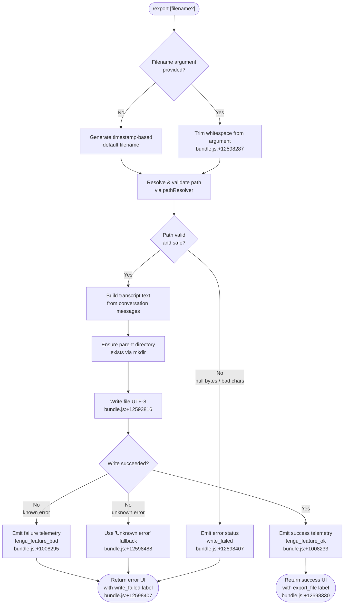

# `/export`

> Analysis basis: CC v2.1.162 bundle.js (AST extraction + Claude interpretation)
> Minimum version: v2.1.162

---

## Overview

The `/export` command serializes the current conversation (messages, roles, and content) to a file on disk. When invoked with an optional `[filename]` argument, the handler resolves the target path, converts the conversation transcript to text, writes it in UTF-8 encoding, and reports success or failure through a telemetry-backed status UI. If no filename is given, the handler generates one automatically using a timestamp-derived default name.

---

## Registration

| Field | Value |
|---|---|
| type | `local-jsx` |
| name | `export` |
| description | Export the current conversation to a file or clipboard |
| argumentHint | `[filename]` |
| module_id | `a_K` |
| load_inline | `true` |
| loc_byte | `12598846` |
| loc_byte_end | `12599042` |
| loc_line | `8927` |
| arbor_handler.name | `Wyf` |
| arbor_handler.fqn | `claude-2.1.162::Wyf` |
| arbor_handler.kind | `AsyncFunction` |
| arbor_handler.resolution_path | `module_id` |
| arbor_handler.n_hits | `0` |

Analysis basis: CC v2.1.162 bundle.js:+12598846

---

## Input Branching

The handler exhibits four distinct top-level paths based on the presence of a filename argument, path validation outcome, file-write outcome (success vs. failure), and error detail availability. A Mermaid flowchart is therefore required.



---

## Behavioral Spec

### 1. Main Handler (`Wyf` — `exportCommandHandler`)

The Arbor-resolved async handler is `Wyf` (FQN: `claude-2.1.162::Wyf`). It is the true entry point; the `callGraph` synthetic entry `__handler_export` is BFS bookkeeping only.

```
async function exportCommandHandler(commandInput, appContext):

    // Step 1 – Build transcript text
    rawText = buildTranscriptText(appContext.messages)
    trimmedArg = commandInput.trim()           // bundle.js:+12598287

    // Step 2 – Determine output path
    if trimmedArg is non-empty:
        targetPath = resolveOutputPath(trimmedArg)
    else:
        targetPath = generateDefaultFilename(new Date())

    // Step 3 – Write to disk
    result = writeExportFile(targetPath, rawText)

    // Step 4 – Return JSX status element
    if result.ok:
        return renderSuccess("export_file", targetPath)    // bundle.js:+12598330
    else:
        errorMsg = result.message ?? "Unknown error"       // bundle.js:+12598488
        return renderFailure("write_failed", errorMsg)     // bundle.js:+12598407
```

Analysis basis: CC v2.1.162 bundle.js:+12598278

---

### 2. Transcript Builder (`YR8` — `buildTranscriptText`)

Walks the message list, filters and formats each turn, strips ANSI escape sequences, and joins lines into a single string.

```
function buildTranscriptText(messages):
    lines = []
    for each message in messages:
        formatted = formatSingleMessage(message)    // jyf → wyf, Jyf
        stripped  = stripAnsi(formatted)            // u4 → Bun.stripANSI
        lines.push(stripped)
    return lines.join("\n")                         // bundle.js:+12597297
```

Message roles recognized include `"user"` (bundle.js:+12597781), `"assistant"` (bundle.js:+12596410), and structured content blocks of type `"text"` (bundle.js:+12597938) and `"message"` (bundle.js:+12596495).

The handler skips messages beyond index 50 (bundle.js:+12597999) and truncates quoted substrings at 49 characters (bundle.js:+12598018).

Analysis basis: CC v2.1.162 bundle.js:+12597252

---

### 3. Message Formatter (`jyf` — `formatSingleMessage`)

```
function formatSingleMessage(message):
    // Detect export vs prompt type
    if message.type == "export":                    // bundle.js:+12596956
        return formatExportMessage(message)
    if message.type == "prompt":                    // bundle.js:+12596972
        return formatPromptMessage(message)

    // Iterate content array
    if Array.isArray(message.content):              // bundle.js:+12596550 (Jyf)
        parts = []
        for each block in message.content:
            parts.append(renderContentBlock(block))
        return parts.join("")
    return String(message.content)
```

Analysis basis: CC v2.1.162 bundle.js:+12596666

---

### 4. Default Filename Generator (`Xyf` — `generateDefaultFilename`)

Produces a timestamp string from the local date/time components: full year, zero-padded month (+1), zero-padded day, hours, minutes, and seconds.

```
function generateDefaultFilename(date):
    year    = String(date.getFullYear())            // bundle.js:+12597486
    month   = zeroPad(date.getMonth() + 1)          // bundle.js:+12597511
    day     = zeroPad(date.getDate())               // bundle.js:+12597552
    hours   = zeroPad(date.getHours())              // bundle.js:+12597590
    minutes = zeroPad(date.getMinutes())            // bundle.js:+12597629
    seconds = zeroPad(date.getSeconds())            // bundle.js:+12597670
    return "claude-export-{year}{month}{day}-{hours}{minutes}{seconds}.txt"
```

Analysis basis: CC v2.1.162 bundle.js:+12598543

---

### 5. Output Path Resolver (`Dyf` / `E1` — `resolveOutputPath`)

```
function resolveOutputPath(rawPath):
    ext = path.extname(rawPath)                     // bundle.js:+12593673
    if ext is empty:
        rawPath = rawPath + ".txt"                  // default extension, bundle.js:+204765

    // Safety checks (E1)
    if rawPath contains null bytes:                 // bundle.js:+1051002
        throw Error("Path contains null bytes")
    normalized = path.normalize(rawPath)            // NFC normalization, bundle.js:+177435
    if rawPath starts with "~/":                    // bundle.js:+1051130
        normalized = path.join(os.homedir(), rawPath.slice(2))
    if path.isAbsolute(normalized):
        return path.resolve(normalized)             // bundle.js:+1051313
    if platform == "windows":                       // bundle.js:+1051199
        // apply Windows-specific path normalization
    return path.resolve(normalized)
```

Analysis basis: CC v2.1.162 bundle.js:+12593749

---

### 6. File Writer (`DR8` — `writeExportFile`)

```
async function writeExportFile(targetPath, content):
    dir = path.dirname(targetPath)                  // bundle.js:+12593779
    await fs.mkdir(dir, { recursive: true })        // bundle.js:+12593769
    await fs.writeFile(targetPath, content, "utf-8") // bundle.js:+12593816, bundle.js:+12593844
    return { ok: true, path: targetPath }
```

On failure the outer handler catches the error, reads `error.message`, and falls back to the literal `"Unknown error"` string when no message is available (bundle.js:+12598488).

Analysis basis: CC v2.1.162 bundle.js:+12598318

---

### 7. Conversation Argument Parser (`r_K` — `parseConversationArg`)

When the command receives structured input rather than a plain string, this helper locates the correct content block:

```
function parseConversationArg(input):
    found = input.find(isTargetBlock)               // bundle.js:+12597760
    trimmed = found.trim()                          // bundle.js:+12597876
    if Array.isArray(found):                        // bundle.js:+12597893
        nested = found.find(isTextBlock)            // bundle.js:+12597917
        return BL(nested).substring(0, 50)          // bundle.js:+12598004
    return found.substring(0, 50)
```

Analysis basis: CC v2.1.162 bundle.js:+12598525

---

### 8. Filename Sanitizer (`o_K` — `sanitizeFilename`)

```
function sanitizeFilename(name):
    return name.toLowerCase()                       // bundle.js:+12598063
```

Called from `Wyf` at bundle.js:+12598571 to normalise the final filename component before use.

---

### 9. Incremental File-Write Pipeline (`EgK` / `GgK` — `incrementalFileWriter`)

For large transcripts the writer uses an append-based chunked strategy:

```
async function incrementalFileWriter(dir, filename, content):
    await fs.mkdir(dir, { recursive: true })        // bundle.js:+205060
    chunkSize = Buffer.byteLength(chunk)            // bundle.js:+205513, bundle.js:+205212
    resolvedPath = resolvePath(dir, filename)       // _PA, bundle.js:+204992
    for each chunk in splitContent(content):
        await fs.appendFile(resolvedPath, chunk)    // bundle.js:+205119
        rotateIfNeeded(resolvedPath)                // HPA, bundle.js:+205507
    registerCompletion()                            // J9, bundle.js:+205668
```

Rotation logic (`HPA`) checks whether the file ends with `".txt"` (bundle.js:+204754), slices the stem (bundle.js:+204776), renames via `fs.rename` (bundle.js:+204817), and removes the old file via `fs.unlink` (bundle.js:+204857).

The `"EISDIR"` error code (bundle.js:+175445) is handled specially — if the target path resolves to a directory, the writer surfaces it as a distinct error condition.

Analysis basis: CC v2.1.162 bundle.js:+205306

---

### 10. Telemetry Feature Wrapper (`hH` / `RH` / `t6` — `featureStatusWrapper`)

Three telemetry outcomes are emitted through a shared wrapper:

| Event | Condition | loc_byte |
|---|---|---|
| `tengu_feature_ok` | Write succeeded | +1008233 |
| `tengu_feature_bad` | Write failed with known error | +1008295 |
| `tengu_feature_sad` | Unexpected / unhandled exception | +1008376 |

Analysis basis: CC v2.1.162 bundle.js:+12598327

---

## State & Side Effects

| Item | Detail |
|---|---|
| Telemetry | `tengu_feature_ok` (bundle.js:+1008233), `tengu_feature_bad` (bundle.js:+1008295), `tengu_feature_sad` (bundle.js:+1008376) |
| File system — mkdir | Parent directory created recursively before write (bundle.js:+12593769, bundle.js:+205060) |
| File system — writeFile | UTF-8 write to resolved path (bundle.js:+12593816) |
| File system — appendFile | Used by incremental writer for large content (bundle.js:+205119) |
| File system — rename | Rotation of `.txt` files when size threshold reached (bundle.js:+204817) |
| File system — unlink | Old file removed after rotation (bundle.js:+204857) |
| Hook registration | `J9` calls `jJA.register` (bundle.js:+60123) — registers a completion hook |
| Timer usage | `clearTimeout` / `setTimeout` / `setImmediate` used by debounce buffer in `dmH` (bundle.js:+59537, +59701, +59794) |
| ANSI stripping | `Bun.stripANSI` applied to every formatted message line (bundle.js:+3824834) |
| appState changes | No direct appState mutation observed in depth-2 traversal |
| Sound | <!-- TODO: not found in depth-2 traversal; needs --depth 4 --> |
| Clipboard | <!-- TODO: description mentions clipboard but no clipboard API calls found in depth-2 traversal; needs --depth 4 --> |

---

## Version History

| Version | Change |
|---|---|
| v2.1.162 | Initial analysis |

---

## Common Mistakes

1. **Omitting the file extension**: If the argument has no extension, the handler automatically appends `.txt` (bundle.js:+204765). Passing a bare stem like `/export mylog` produces `mylog.txt`, which may be unexpected.
2. **Relative paths resolve against CWD**: The path resolver calls `path.resolve()` on relative inputs (bundle.js:+1051313), anchoring to the process working directory at the time of invocation — not necessarily the project root.
3. **Tilde expansion is handled, but only the `~/` prefix**: Paths like `~user/file` are not expanded; only the literal `~/` prefix triggers home-directory substitution (bundle.js:+1051130).
4. **Null bytes cause a hard error**: Any path containing a null byte is rejected immediately with `"Path contains null bytes"` (bundle.js:+1051002) — not a graceful failure.
5. **Message truncation at 50 entries**: The transcript builder only processes up to index 50 of the message list (bundle.js:+12597999); very long conversations are silently truncated in the export.
6. **The clipboard path is advertised in the description but may require an explicit flag**: The registration description says "file or clipboard", but no clipboard API calls were detected in the depth-2 call graph — verify with a deeper traversal or runtime test before relying on clipboard output.

---

## Appendix — Identifier Mapping

> For bundle debugging only. Identifiers change across versions.

| Identifier | Role |
|---|---|
| `Wyf` | Main export command handler (AsyncFunction; Arbor FQN `claude-2.1.162::Wyf`) |
| `o_K` | Filename sanitizer — applies `.toLowerCase()` to the output filename |
| `v` | Export format dispatcher — routes to text/JSON/debug serializers |
| `PgK` | Conversation serializer sub-routine |
| `PJA` | JSON serialization helper (calls `GUK`, `EUK`) |
| `SH` | JSON-stringify wrapper |
| `V4` | File extension / stem splitter |
| `rXA` | Message-array mapper |
| `WpH` | Pipe/write wrapper |
| `pXA` | Low-level write wrapper |
| `EgK` | Incremental file-write orchestrator |
| `dmH` | Debounce/buffer flusher (uses `clearTimeout`, `setTimeout`, `setImmediate`) |
| `E3H` | Path-join + write helper |
| `i6` | Internal utility (path/string helper) |
| `zL6` | EISDIR-aware write guard |
| `_PA` | Path join resolver for output directory |
| `HPA` | File rotation handler (stat → rename → unlink) |
| `GgK` | Append-based chunked file writer |
| `J9` | Completion hook registrar (calls `jJA.register`) |
| `_3` | Internal app-context accessor |
| `AY_` | Argument string parser (split/trim/indexOf/slice) |
| `LHH` | Set-membership checker |
| `bJ` | String replacement utility |
| `a1` | Markdown/text renderer entry point |
| `oHH` | Block renderer dispatcher |
| `k0` | Inline code renderer |
| `OqH` | Ordered-list renderer |
| `Dd` | Rich-content block renderer |
| `qq` | Model-name normalizer |
| `Q0` | Model ID lookup |
| `pKH` | Model family classifier |
| `qI` | Model tier selector |
| `LQH` | Tier label formatter |
| `PE` | Provider-type resolver |
| `RJ1` | Provider fallback resolver |
| `UM` | Provider metadata fetcher |
| `Xt6` | Model feature-flag checker |
| `fQH` | Token-budget helper |
| `rX` | Markdown block parser |
| `g0` | Inline element parser |
| `t6` | Telemetry feature-wrapper caller |
| `c` | Feature-OK telemetry emitter |
| `Z6` | Feature telemetry dispatcher |
| `Zx6` | Base telemetry sender |
| `r_K` | Conversation argument block parser |
| `BL` | Content-block text extractor |
| `$9` | String index/slice helper |
| `Pyf` | Transcript-build coordinator |
| `YR8` | Transcript text assembler (push/join lines) |
| `jyf` | Per-message formatter |
| `wyf` | Export-type message formatter |
| `Kl` | Command permission / plan-mode guard |
| `stH` | Stream event listener (`.on("data", ...)`) |
| `Jyf` | Array-check branch for content blocks |
| `O` | Background-session state checker |
| `u4` | ANSI escape-code stripper (wraps `Bun.stripANSI`) |
| `DR8` | File-write orchestrator (mkdir + writeFile) |
| `Dyf` | Path extension detector and `.txt` defaulter |
| `E1` | Full path resolver with safety checks |
| `x6` | Platform detection helper |
| `mO` | NFC Unicode normalizer |
| `hH` | `tengu_feature_ok` telemetry wrapper |
| `RH` | `tengu_feature_bad` telemetry wrapper |
| `Xyf` | Default timestamp filename generator |