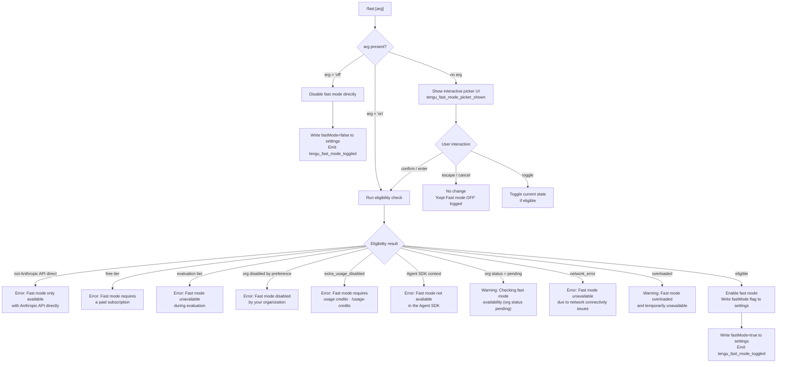

# `/fast`

> Analysis basis: CC v2.1.162 bundle.js (AST extraction + Claude interpretation)
> Minimum version: v2.1.162

---

## Overview

`/fast` toggles **Fast mode** — a research-preview feature that activates a faster inference path on Anthropic's API. It accepts an optional `on` or `off` argument to set the mode explicitly; without an argument it opens an interactive picker UI. The command validates eligibility (API type, subscription tier, org policy, network status) before committing any state change.

---

## Registration

| Field | Value |
|---|---|
| type | `local-jsx` |
| name | `fast` |
| description | `Toggle fast mode ( ... )` |
| argumentHint | `[on\|off]` |
| thinClientDispatch | `control-request` |
| immediate | `null` |
| isHidden | `null` |
| module_id | `$eq` |
| load_inline | `true` |
| loc_byte | `12359383` |
| loc_byte_end | `12359655` |
| loc_line | `8687` |
| arbor_handler.name | `gNf` |
| arbor_handler.fqn | `claude-2.1.162::gNf` |
| arbor_handler.kind | `AsyncFunction` |
| arbor_handler.resolution_path | `module_id` |
| arbor_handler.n_hits | `3` |

Analysis basis: CC v2.1.162 bundle.js:+12359383

---

## Input Branching

Four or more distinct execution paths exist depending on the argument value and the result of the eligibility check, so a Mermaid flowchart is used.



Analysis basis: CC v2.1.162 bundle.js:+12358417 (handler entry `gNf`), +12354732 (picker component `xS8`), +2225664 (eligibility logic `lHH`)

---

## Behavioral Spec

### Top-level Handler (`gNf`)

```
async function fastModeCommandHandler(input, appState):
    // Three primary branches reached from gNf
    eligibilityResult  = checkFastModeEligibility(appState)   // lHH
    prefetchResult     = prefetchFastModeStatus(appState)      // qQH
    renderResult       = renderFastModeUI(input, appState)     // xS8

    if input.argument == "off":
        disableFastMode(appState)
        emitTelemetry("tengu_fast_mode_toggled", {value: false})
        return statusMessage("Fast mode OFF")

    if input.argument present (normalized to "on"):
        result = eligibilityResult
        if result is not eligible:
            return errorMessage(result.reason)
        enableFastMode(appState)
        emitTelemetry("tengu_fast_mode_toggled", {value: true})
        return statusMessage("Fast mode ON")

    // No argument: show interactive picker
    emitTelemetry("tengu_fast_mode_picker_shown")
    return renderFastModePickerUI(eligibilityResult, appState)
```

Analysis basis: CC v2.1.162 bundle.js:+12358417

---

### Eligibility Check (`lHH`)

```
function checkFastModeEligibility(appState):
    authType = getAuthType(appState)     // H4 call at +2225664

    // Gate 1: Must be direct Anthropic API
    if authType is NOT "firstParty" or "oauth" or "api-key":
        return {eligible: false,
                reason: "Fast mode is only available when using the Anthropic API directly"}
        // literal: bundle.js:+2225696

    // Gate 2: Agent SDK check
    if runningInAgentSDK(appState):
        emitTelemetry("tengu_penguins_off")   // +2225802
        return {eligible: false,
                reason: "Fast mode is not available in the Agent SDK"}
        // literal: bundle.js:+2226031

    // Gate 3: Org status pending
    if orgStatus == "pending":
        return {eligible: false,
                reason: "Checking fast mode availability",
                detail: "org status pending"}
        // literal: bundle.js:+2226202

    orgFastModeStatus = fetchOrgFastModeStatus(appState)  // qQH

    switch orgFastModeStatus:
        case "free":
            return {eligible: false,
                    reason: "Fast mode requires a paid subscription"}
            // literal: bundle.js:+2225215

        case "evaluation":
            return {eligible: false,
                    reason: "Fast mode unavailable during evaluation. Please purchase credits."}
            // literal: bundle.js:+2225256

        case "preference" (org disabled):
            return {eligible: false,
                    reason: "Fast mode has been disabled by your organization"}
            // literal: bundle.js:+2225347

        case "extra_usage_disabled":
            return {eligible: false,
                    reason: "Fast mode requires usage credits · /usage-credits to turn them on"}
            // literal: bundle.js:+2225431

        case "network_error":
            return {eligible: false,
                    reason: "Fast mode unavailable due to network connectivity issues"}
            // literal: bundle.js:+2225528

        case "overloaded":
            return {eligible: false, severity: "warning",
                    reason: "Fast mode overloaded and is temporarily unavailable"}
            // literal: bundle.js:+12357626

        default:
            return {eligible: true}
```

Analysis basis: CC v2.1.162 bundle.js:+2225664

---

### Org Fast Mode Status Prefetch (`qQH`)

```
async function prefetchFastModeStatus(appState):
    // Guard: return in-flight promise if already fetching
    if inflight promise exists:
        log("Fast mode prefetch in progress, returning in-flight promise")
        // literal: bundle.js:+2229471
        return existingPromise

    // Guard: skip if fetched recently
    lastFetchTime = getLastFetchTimestamp()
    if (Date.now() - lastFetchTime) < RECENCY_THRESHOLD:
        log("Skipping fast mode prefetch, fetched recently")
        // literal: bundle.js:+2229718
        return cachedResult

    // Perform API call via OO (api auth + request builder)
    auth = resolveAuth(appState)     // t6L, OO
    if not auth:
        throw Error("No auth available")   // literal: bundle.js:+2229894

    response = await callFastModeStatusAPI(auth)  // EW -> OO

    if response.status == 401:
        handleOAuthRefresh(appState)   // WU
    if response.status == 403:
        // OAuth token revoked: literal bundle.js:+2230121
        clearAuthState()

    if fetchFailed:
        emitTelemetry("tengu_org_penguin_mode_fetch_failed")  // +2230890
        return {status: "network_error"}

    // Persist result
    saveConfigWithLock(result)   // G8 -> jj_
    emitEvent("h7_.emit", result)   // +2230521

    return result
```

Analysis basis: CC v2.1.162 bundle.js:+2229382

---

### Interactive Picker UI (`xS8` / `uS8`)

```
function renderFastModePickerUI(eligibilityResult, appState):
    currentFastModeState = readFastModeFlag(appState)   // bS8, sWH

    // Display label " Fast mode (research preview)"
    // literal: bundle.js:+12356678

    // Render ON / OFF indicator
    label = currentFastModeState ? "ON " : "OFF"
    // literals: bundle.js:+12357454, +12357460

    // Show availability warnings inline:
    if status == "overloaded":
        showWarning("Fast mode overloaded and is temporarily unavailable")
    if fastLimitHit:
        showWarning("You've hit your fast limit · resets in <countdown>")
        // literals: bundle.js:+12357680, +12357709

    // Key bindings registered:
    //   escape / cancel  → dismiss, log "Kept Fast mode OFF" (+12356073)
    //   tab              → toggle selection
    //   enter / confirm  → confirm selection
    //   confirm:cycleMode, confirm:toggle etc.

    // Cooldown handling: if cooldown state detected, re-enable and log
    //   "Fast mode cooldown expired, re-enabling fast mode"
    //   literal: bundle.js:+2226961

    // Docs link rendered: https://code.claude.com/docs/en/fast-mode
    // literal: bundle.js:+12357900

    return pickerComponent
```

Analysis basis: CC v2.1.162 bundle.js:+12354732, +12355201

---

### Fast Mode Flag Persistence (`bS8` / `sWH`)

```
function readAndApplyFlagSettings(appState):
    // Reads the following flag keys from settings:
    //   "cacheBreakerPhrase"   (+12353597)
    //   "autoCompactWindow"    (+12353738)
    //   "briefTranscript"      (+12353875)
    //   "isBriefOnly"          (+12353986)
    //   "fastMode"             (+12354081)  ← primary flag for /fast
    //   "model"                (+12354164)

    fastModeValue = settings.flagSettings["fastMode"]
    // coerced via sWH: String / Number / Boolean normalisation

    applyFlagSettings(appState, {fastMode: fastModeValue})
    emitTelemetry("tengu_fast_mode_toggled") when changed
    // literal: bundle.js:+12354818

    return updatedAppState
```

Analysis basis: CC v2.1.162 bundle.js:+12354364, +12354081

---

### API Provider Gating (`wA` / `tH`)

Fast mode eligibility relies on the active API provider. Known provider identifiers found in the call graph:

| Provider string | Eligible for Fast mode? |
|---|---|
| `firstParty` | Yes |
| `oauth` / `api-key` | Yes (direct Anthropic API) |
| `bedrock` | No — "only available when using the Anthropic API directly" |
| `foundry` | No |
| `anthropicAws` | No |
| `mantle` | No |
| `vertex` | No |
| `gateway` | No |

Analysis basis: CC v2.1.162 bundle.js:+2093874 (`tH`), +2094020, +2094074, +2094122, +2094131

---

### Cooldown Re-enable (`y7_`)

```
function handleFastModeCooldownExpiry(appState):
    // Triggered when cooldown state is observed during picker render
    if appState.fastMode.status == "cooldown":
        if Date.now() >= appState.fastMode.cooldownExpiry:
            log("Fast mode cooldown expired, re-enabling fast mode")
            // literal: bundle.js:+2226961
            setFastModeEnabled(appState, true)
            emitEvent("WJ1.emit", {status: "active"})   // +2227021
```

Analysis basis: CC v2.1.162 bundle.js:+2226920

---

## State & Side Effects

| Item | Detail |
|---|---|
| Telemetry | `tengu_fast_mode_toggled` (bundle.js:+12354818) — fired on every state write; `tengu_fast_mode_picker_shown` (bundle.js:+12358642) — fired when picker UI is rendered without an explicit `on`/`off` arg; `tengu_penguins_off` (bundle.js:+2225802) — fired when Agent SDK blocks fast mode; `tengu_org_penguin_mode_fetch_failed` (bundle.js:+2230890) — fired when org status API call fails |
| Settings write | `flagSettings.fastMode` (boolean) persisted via `saveConfigWithLock` (`jj_` / `G8`) to `~/.claude/settings.json` or project-local settings |
| appState changes | Fast mode active flag toggled; cooldown timestamp updated; status cached as `"enabled (cached)"` or `"disabled (network_error)"` (literals: bundle.js:+2230817, +2230836) |
| In-flight promise cache | A single pending prefetch promise is stored and re-used during the recency window to avoid duplicate API calls |
| Event emission | `h7_.emit` fires with fetch result (bundle.js:+2230521); `WJ1.emit` fires on cooldown expiry (bundle.js:+2227021) |
| Hook registration | `jJA.register` called via `J9` (bundle.js:+60123) — registers a settings-change hook |
| Sound | None detected |

---

## Version History

| Version | Change |
|---|---|
| v2.1.162 | Initial analysis |

---

## Common Mistakes

1. **Using `/fast` on a non-Anthropic API provider** (Bedrock, Vertex, etc.) always fails with an explicit error; switching to a direct Anthropic API key or OAuth session is required before the command will succeed.
2. **Omitting the argument on a headless/thin-client session** — without `on` or `off`, the picker UI is rendered, which requires an interactive terminal; in non-interactive contexts pass the argument explicitly.
3. **Expecting immediate effect during an org-status `pending` state** — the command returns a "checking availability" message and does not enable fast mode until the org status resolves; retrying after a short wait is correct behaviour.
4. **Free-tier or evaluation accounts** receive a hard refusal; purchasing credits or upgrading the subscription is necessary, not a CLI configuration change.
5. **Agent SDK environments** unconditionally block fast mode regardless of API key type or subscription; the `tengu_penguins_off` event is emitted and the feature is unavailable.

---

## Appendix — Identifier Mapping

> For bundle debugging only. Identifiers change across versions.

| Identifier | Role |
|---|---|
| `gNf` | Main async handler for `/fast` command (arbor_handler) |
| `H4` | Auth-type resolver / provider detection helper |
| `wA` | API provider enum lookup |
| `tH` | String normalisation / coercion utility |
| `lHH` | Fast mode eligibility check (gates API type, SDK, org status) |
| `qQH` | Org fast mode status prefetch (async, with in-flight cache) |
| `xS8` | Interactive fast mode picker JSX component |
| `uS8` | Inner picker component (state, key bindings, display logic) |
| `bS8` | Flag settings reader (reads `fastMode`, `model`, etc. from config) |
| `sWH` | Flag value type-coercion helper (String / Number / Boolean) |
| `MO` | Model selector helper called from picker |
| `aWH` | Theme / appearance helper used in picker render |
| `AQH` | Apply settings change helper |
| `A2` | Settings value setter |
| `y7_` | Fast mode cooldown expiry handler |
| `S7_` | Prefetch sub-routine (deduplication + config read) |
| `OO` | Auth + HTTP request builder for org status API |
| `EW` | Org-status API call wrapper |
| `WU` | OAuth 401 recovery handler |
| `MwL` | OAuth token refresh orchestrator |
| `G8` | Config save with lock (global config persistence) |
| `jj_` | Locked config write implementation |
| `Jj_` | Config write sub-helper |
| `t6L` | Auth token provider resolver |
| `p1` | OAuth endpoint resolver |
| `r_` | Settings load-from-disk orchestrator |
| `Zd6` | Git-aware settings file writer |
| `_U` | Settings load-from-disk entry point |
| `IH_` | Settings load telemetry wrapper |
| `v` | Settings value read accessor |
| `PgK` | Settings object builder |
| `PJA` | Settings field getter |
| `J9` | Hook registrar for settings changes |
| `EgK` | Append/write settings file helper |
| `GgK` | Directory-create + appendFile helper |
| `HPA` | File rename/unlink helper (atomic write) |
| `COH` | Settings path resolver |
| `gQ` | Tool/schema registry accessor |
| `Xc6` | Cache-backed config accessor |
| `dwA` | Config cache get helper |
| `cwA` | Config cache set helper |
| `vH_` | Config object builder from disk data |
| `m8` | High-level config accessor (merges cache + disk) |
| `C6` | Checkpoint / snapshot writer |
| `DYH` | Config file reader with backup support |
| `bWL` | File-watch registration helper |
| `j6` | MCP skills / tool registry |
| `U18` | MCP tool de-duplication handler |
| `rJ_` | MCP tool registration with UUID |
| `eJ_` | MCP tool event emitter |
| `Hu` | MCP executor helper |
| `ex` | MCP command executor |
| `RCH` | MCP server connection manager |
| `ROA` | MCP reconnect / update orchestrator |
| `xp8` | MCP connection result applier |
| `hk` | MCP connection cleanup |
| `ja_` | MCP OAuth flow handler |
| `Xa_` | MCP OAuth callback processor |
| `kvq` | MCP server connection with retry |
| `Ja_` | MCP server disconnect handler |
| `jl` | MCP slot configuration helper |
| `sI` | MCP server info helper |
| `GA` | MCP handler registrar (useEffect-based) |
| `M` | MCP manager hook |
| `p1K` | Daemon status writer |
| `GS6` | Daemon status file path resolver |
| `V9` | AsyncLocalStorage store accessor |
| `Ur` | App state / config bootstrapper |
| `gKH` | App state trimmer |
| `q9` | Time duration formatter (ms → human-readable) |
| `D6` | App state store accessor |
| `rW_` | App state context reader |
| `qA` | App state subscription helper |
| `E6` | Terminal resize/scroll helper |
| `Zx6` | Terminal screen initialiser |
| `NYH` | ANSI colour code parser |
| `EA` | Foreground colour resolver |
| `Au` | Theme colour picker |
| `gw6` | Dark-mode colour helper |
| `c98` | Theme name validator |
| `XYH` | Colour prefix parser |
| `yr1` | Colour fallback resolver |
| `x4` | Opus model selector helper |
| `EV` | Feature flag set helper |
| `K9` | Model string normaliser |
| `iX` | Model alias expander |
| `Ua6` | Object entries iterator helper |
| `i_` | Settings key iterator |
| `dR` | Number format helper |
| `yJ1` | Integer / decimal format helper |
| `EZH` | Display-value formatter for settings |
| `qq` | Model display-name resolver |
| `Q0` | Model family classifier |
| `pKH` | Model tier checker |
| `qI` | Model capability helper |
| `LQH` | Model context-window helper |
| `PE` | Model provider helper |
| `RJ1` | Model routing helper |
| `UM` | Unified model accessor |
| `Xt6` | Model exclusion list checker |
| `fQH` | Model string formatter |
| `rX` | Model resolution chain |
| `g0` | Model config composer |
| `a1` | Model config resolver entry point |
| `oHH` | Model option builder |
| `Dd` | Model metadata parser |
| `AY_` | API endpoint parser |
| `LHH` | Feature flag gate |
| `bJ` | String replacement utility |
| `t6` | Bootstrap fetch wrapper |
| `Z6` | Bootstrap response parser |
| `hH` | JSX render helper (type A) |
| `RH` | JSX render helper (type B) |
| `xr` | Request builder |
| `W4` | Response parser |
| `be` | Error boundary helper |
| `H46` | Header builder |
| `kH` | Request executor with error logging |
| `I3` | Retry/backoff helper |
| `gO` | Config path helper |
| `gP` | Settings file reader |
| `wr` | Raw file reader with slice |
| `R8` | Error classifier |
| `V8` | EISDIR / filesystem error handler |
| `Te8` | Timestamp recorder |
| `yTH` | Settings path composer |
| `jc6` | Config directory resolver |
| `u56` | Atomic file writer (temp + rename) |
| `O` | Background session status checker |
| `f` | File handle manager |
| `cz` | Cache clear helper |
| `x6` | Settings schema validator |
| `Ke8` | Settings field normaliser |
| `Td6` | Git check-ignore helper |
| `I24` | Path expander (handles `~/`) |
| `ZCA` | Git ls-files tracker |
| `VCA` | Settings append helper |
| `Ix` | Settings path joiner |
| `pT` | Settings load pre-check |
| `C9` | Memory usage sampler |
| `fu6` | Settings load finaliser |
| `Pj1` | Config object merger |
| `Xw6` | Config schema migrator |
| `Xj_` | Config backup path builder |
| `bcH` | Config validation helper |
| `Mn1` | Config entries iterator |
| `s18` | Config save timestamp helper |
| `nzH` | Feature flag pre-loader |
| `ME` | Settings migration entry |
| `l4` | Legacy config migrator |
| `umH` | VS Code extension guard (`claude-vscode` check) |
| `tb` | Terminal backend selector |
| `Yt6` | Fast mode status string formatter |
| `o6L` | Org status cache writer |
| `zY6` | API response normaliser |
| `xX` | API error extractor |
| `T36` | API quota checker |
| `pJ` | Auth profile selector |
| `QR` | Response slice helper |
| `yV` | Array-or-string includes helper |
| `WU` | OAuth 401 recovery orchestrator |
| `y6H` | OAuth token getter |
| `QK6` | OAuth scope validator |
| `xr` | Fetch wrapper |
| `kg8` | Model key extractor |
| `PU` | Settings picker renderer |
| `U_` | App state setter |
| `NM6` | WSL platform detector |
| `_3` | Bootstrap auth header builder |
| `SH` | JSON serialiser |
| `WpH` | Settings write pipeline |
| `pXA` | Raw write helper |
| `zL6` | Settings schema guard |
| `_PA` | Settings path builder |
| `dmH` | Debounce / batched write helper |
| `E3H` | File content builder |
| `Q1` | Config key resolver |
| `Zx6` | Screen state initialiser |
| `q_` | Identifier sanitiser |
| `sI6` | MCP server ID helper |
| `Pvq` | MCP server bootstrap |
| `yz8` | MCP keepalive helper |
| `vz8` | MCP response decoder |
| `Y8` | MCP debug logger |
| `G7` | MCP error logger |
| `TH` | String coercion for MCP |
| `Tvq` | MCP transport builder |
| `I_6` | MCP port parser |
| `Xv8` | MCP timeout parser |
| `SCH` | MCP auth-state checker |
| `hN` | MCP skills hook |
| `k` | Chokidar file watcher |
| `IR_` | MCP inline resource handler |
| `Rz8` | MCP tool permission checker |
| `n8` | Abort-controller wrapper |
| `N_6` | MCP cleanup helper |
| `wq` | Model display-name lookup |
| `UyA` | Model alias string builder |
| `zw6` | MCP wire-format encoder |
| `Dw6` | MCP wire-format decoder |
| `Nv` | Terminal width helper |
| `X_` | Tool schema builder |
| `A46` | Tool capability flag |
| `UF8` | Tool input validator |
| `tK6` | Tool output formatter |
| `xGH` | Tool error formatter |
| `uGH` | Tool result builder |
| `K46` | Tool metadata helper |
| `yOH` | Tool display helper |
| `hOH` | Tool icon helper |
| `WH_` | Tool group helper |
| `jxA` | Tool argument validator |
| `Er` | Tool execution wrapper |
| `o6` | WSL path converter |
| `ZM6` | WSL detection helper |
| `lP` | Platform string builder |
| `id` | Terminal colour ID resolver |
| `Nk` | MCP server name normaliser |
| `jn` | MCP server URL validator |
| `ZB` | MCP empty-result builder |
| `wv8` | MCP write helper |
| `Pvq` | MCP connection bootstrapper |
| `Ps_` | MCP server handshake |
| `AXH` | MCP capability negotiator |
| `kz8` | MCP protocol version helper |
| `wP` | MCP message writer |
| `BY` | MCP server state finaliser |
| `gy` | OAuth token store getter |

---

Note: index built via Arbor fallback; some signals (telemetry, literals) may be missing — see arbor-fallback.js.