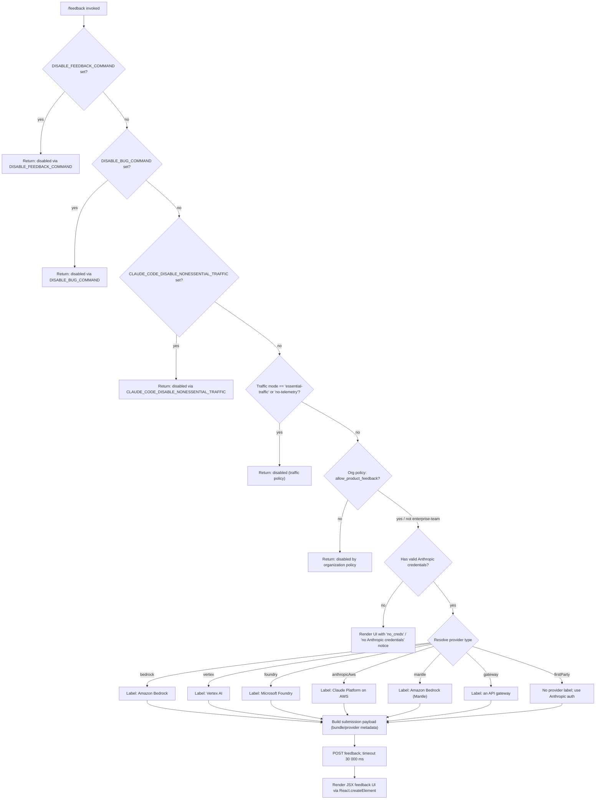

# `/feedback`

> Analysis basis: CC v2.1.162 bundle.js (AST extraction + Claude interpretation)
> Minimum version: v2.1.162

---

## Overview

The `/feedback` command (also reachable as `/share` or `/bug`) opens a feedback submission UI that allows users to submit feedback, report bugs, or share their current conversation with Anthropic. Before rendering the UI, the command performs a multi-stage eligibility check: it inspects environment variables, network-traffic policy, and organizational policy to determine whether the feedback channel is permitted in the current deployment context.

---

## Registration

| Field | Value |
|---|---|
| type | `local-jsx` |
| name | `feedback` |
| description | `Submit feedback, report a bug, or share your conversation` |
| argumentHint | `[report]` |
| aliases | `share`, `bug` |
| module_id | `uCq` |
| load_inline | `true` |
| loc_byte | `10924345` |
| loc_byte_end | `10924568` |
| loc_line | `7149` |
| arbor_handler.name | `uMf` |
| arbor_handler.fqn | `claude-2.1.162::uMf` |
| arbor_handler.kind | `AsyncFunction` |
| arbor_handler.resolution_path | `module_id` |
| arbor_handler.n_hits | `0` |

Analysis basis: CC v2.1.162 bundle.js:+10924345

---

## Input Branching

The command has **6+ distinct branches** driven by environment variable state, traffic policy, and organizational policy. A Mermaid flowchart is mandatory.



Analysis basis: CC v2.1.162 bundle.js:+10902220, +10902379, +10902497, +10902661, +4161642, +10903268

---

## Behavioral Spec

### 1. Handler Entry Point

The Arbor-resolved handler is `uMf` (an `AsyncFunction`), which is loaded via an inline `load:()=>Promise.resolve({call: uMf})` shape inside module `uCq`.

```
async function feedbackHandler(commandInput, appState):
    result = await eligibilityCheck(commandInput, appState)
    if result.disabled:
        return result.message
    providerLabel = resolveProviderLabel(appState)
    payload      = buildPayload(commandInput, appState, providerLabel)
    renderFeedbackUI(payload)
```

Analysis basis: CC v2.1.162 bundle.js:+10924176

---

### 2. Eligibility Check (`qbH`)

The eligibility check runs four independent guard clauses before the feedback UI is shown.

```
function eligibilityCheck(commandInput, appState):

    // Guard 1 — explicit env-var disable (feedback)
    if env("DISABLE_FEEDBACK_COMMAND") is set:
        return disabled("/feedback has been disabled via the DISABLE_FEEDBACK_COMMAND environment variable")

    // Guard 2 — explicit env-var disable (bug alias)
    if env("DISABLE_BUG_COMMAND") is set:
        return disabled("/feedback has been disabled via the DISABLE_BUG_COMMAND environment variable")

    // Guard 3 — non-essential traffic flag
    trafficMode = getTrafficMode()          // reads network-policy setting
    if trafficMode == "essential-traffic"
       or trafficMode == "no-telemetry"
       or nonEssentialTrafficEnvVarSet():
        return disabled("/feedback has been disabled via the CLAUDE_CODE_DISABLE_NONESSENTIAL_TRAFFIC environment variable")

    // Guard 4 — organizational policy (enterprise / team tiers)
    if orgTier in ["enterprise", "team"]
       and not orgPolicy.has("allow_product_feedback"):
        return disabled("/feedback has been disabled by your organization's policy")

    return eligible()
```

Analysis basis: CC v2.1.162 bundle.js:+10902220, +10902238, +10902379, +10902497, +4161341, +4161376, +4161642, +10902661, +1012278, +1012337

---

### 3. Traffic Mode Resolution (`wq` → `UyA`)

```
function getTrafficMode():
    raw = readSetting("trafficMode")        // may return "default", "essential-traffic", "no-telemetry"
    if raw == "default" or raw is absent:
        return "default"
    return raw
```

Traffic-mode strings found in bundle: `"essential-traffic"` (+1012278), `"no-telemetry"` (+1012337), `"default"` (+1012411).

Analysis basis: CC v2.1.162 bundle.js:+10902462, +1012278, +1012337, +1012411

---

### 4. Provider Label Resolution (`mU`)

The handler inspects the active API configuration to derive a human-readable provider label that is embedded in the feedback payload.

```
function resolveProviderLabel(appState):
    providerKind = appState.apiProvider.kind

    match providerKind:
        "bedrock"      → label = "Amazon Bedrock"
        "vertex"       → label = "Vertex AI"
        "foundry"      → label = "Microsoft Foundry"
        "anthropicAws" → label = "Claude Platform on AWS"
        "mantle"       → label = "Amazon Bedrock (Mantle)"
        "gateway"      → label = "an API gateway"
        "firstParty"   → label = null    // direct Anthropic auth; no third-party label

    return { bundle: "bundle", provider: label }
```

Analysis basis: CC v2.1.162 bundle.js:+10902761, +10902776, +10902793, +10902868, +10902939, +10903023, +10903106, +10903191, +10903137

---

### 5. Credential Check (`mU` → `WA` / `bd`)

```
function hasAnthropicCredentials(appState):
    if providerIsThirdParty(appState):
        // "Anthropic auth not used on third-party providers"
        return false, reason="no_creds"

    oauthToken = getOAuthToken(appState)
    if oauthToken is absent:
        // "No OAuth token available"
        apiKey = getApiKey(appState)
        if apiKey is absent:
            return false, reason="no_creds", detail="no Anthropic credentials"
        return true, authType="x-api-key"

    return true, authType="user_oauth"
```

When credentials are absent the UI is still rendered but annotated with the `"no_creds"` / `"no Anthropic credentials"` status.

Analysis basis: CC v2.1.162 bundle.js:+10903268, +10903285, +3029209, +3029324, +3029559

---

### 6. Feedback Submission (`xCq` → POST)

```
function submitFeedback(payload):
    deadline = Date.now() + 30000          // 30-second timeout
    response = httpPost(
        url     = feedbackEndpoint,
        method  = "post",
        headers = {
            "Content-Type": "application/json",
            "User-Agent":   buildUserAgent(),
        },
        body    = JSON.stringify(payload),
        timeout = 30000,
    )
    return response
```

Timeout constant: 30 000 ms (bundle.js:+10923734).  
HTTP method literal: `"post"` (bundle.js:+10903325).

Analysis basis: CC v2.1.162 bundle.js:+10923715, +10923734, +10903325

---

### 7. JSX Rendering (`xCq`)

After the eligibility and credential checks, the command calls `React.createElement` (identified as `VHA.createElement`) to render the feedback UI component. The component receives the resolved provider label, credential status, and timestamp as props.

```
function renderFeedbackUI(props):
    timestamp = Date.now()
    element   = React.createElement(FeedbackComponent, {
        ...props,
        timestamp: timestamp,
        visibility: "public",
    })
    return element
```

Visibility literal: `"public"` (bundle.js:+10924151).

Analysis basis: CC v2.1.162 bundle.js:+10923958, +10924151

---

### 8. Conversation / Log Sharing (`H` → bootstrap fetch)

When the user opts to share a conversation, a bootstrap fetch routine (`H`) is triggered:

```
async function bootstrapFetch(url, options):
    log("[Bootstrap] Fetching", url)
    response = await fetch(url, {
        headers: {
            "Content-Type": "application/json",
            "User-Agent":   userAgentString,
        },
        timeout: 5000,
    })
    if parse fails:
        emit telemetry("api_bootstrap_fetch", { result: "parse_failed" })
        return null
    log("[Bootstrap] Fetch ok")
    return parsed
```

Bootstrap fetch timeout: 5 000 ms (bundle.js:+15591194).  
Telemetry event on parse failure: `"api_bootstrap_fetch"` / `"parse_failed"` (bundle.js:+15591315, +15591337).

Analysis basis: CC v2.1.162 bundle.js:+15590991, +15591078, +15591093, +15591112, +15591194, +15591315

---

### 9. Transcript / File Logging (`EgK` → `GgK`)

The sharing path writes conversation data to a local log file via an append-file pipeline:

```
function appendToLogFile(content, logDir):
    ensure directory exists: mkdir(logDir, { recursive: true })
    filePath = join(logDir, logFileName)
    rotateLogs(filePath)                   // rename / unlink old .txt files (threshold: 4 segments)
    sizeBytes = Buffer.byteLength(content)
    appendFile(filePath, content)
    notifyRotationComplete()
```

Log-rotation references `.txt` extension (bundle.js:+204765) and a segment threshold of 4 (bundle.js:+204787).  
Write buffer size check uses `Buffer.byteLength` (bundle.js:+205513).

Analysis basis: CC v2.1.162 bundle.js:+205060, +205119, +204765, +204787, +205513

---

## State & Side Effects

| Item | Detail |
|---|---|
| Telemetry — `tengu_feature_sad` | Fired (loc_byte +1008376) when the feature encounters a sad-path condition (likely an eligibility block or submission error) |
| Telemetry — `api_bootstrap_fetch` / `parse_failed` | Fired on bootstrap-fetch parse failure (loc_byte +15591315) |
| HTTP POST | Submits feedback payload to Anthropic endpoint; timeout 30 000 ms (+10923734) |
| Bootstrap fetch | Outbound GET to fetch conversation data; timeout 5 000 ms (+15591194) |
| File I/O | Appends transcript to local log file via `fs.appendFile`; rotates `.txt` segments (+205119, +204765) |
| Hook registration | `jJA.register` called via `J9` (+60123); likely registers a process/signal hook for cleanup |
| `Date.now()` timestamp | Captured at UI render time (+10923715) |
| Environment variable reads | `DISABLE_FEEDBACK_COMMAND`, `DISABLE_BUG_COMMAND`, `CLAUDE_CODE_DISABLE_NONESSENTIAL_TRAFFIC` checked at invocation |
| React JSX render | `VHA.createElement` renders feedback UI with `"public"` visibility prop (+10924151) |
| Header redaction | Authorization-style header values replaced with `"[REDACTED]"` in logs (+197925) |

---

## Version History

| Version | Change |
|---|---|
| v2.1.162 | Initial analysis |

---

## Common Mistakes

1. **Invoking `/feedback` on a third-party provider without realizing it is disabled** — deployments on Amazon Bedrock, Vertex AI, Microsoft Foundry, Claude Platform on AWS, Amazon Bedrock (Mantle), or any API gateway still attempt to render the UI but will show a credential/provider notice rather than silently failing.

2. **Expecting `/bug` or `/share` to behave differently from `/feedback`** — all three aliases resolve to the same handler (`uMf`); there is no alias-specific branching.

3. **Setting only `DISABLE_BUG_COMMAND` but not `DISABLE_FEEDBACK_COMMAND`** — users can still reach the feedback UI via `/feedback` or `/share` unless all relevant env-vars are set.

4. **Assuming the command works in `essential-traffic` or `no-telemetry` network-policy mode** — both modes cause the command to return a disabled message before any UI is rendered (+1012278, +1012337).

5. **Assuming organizational policy only applies to enterprise tiers** — both `"enterprise"` and `"team"` tiers are subject to the `allow_product_feedback` policy gate (+4161341, +4161376, +4161642).

6. **Expecting instant feedback submission** — the POST has a 30-second timeout (+10923734); on slow networks the UI may remain open until the timeout fires.

---

## Appendix — Identifier Mapping

> For bundle debugging only. Identifiers change across versions.

| Identifier | Role |
|---|---|
| `uMf` | Main async handler for `/feedback` (Arbor-resolved entry point) |
| `xCq` | JSX render function; builds `React.createElement` feedback UI |
| `qbH` | Eligibility check function; runs all four disable guards |
| `wq` | Traffic-mode reader; delegates to `UyA` |
| `UyA` | Traffic-mode resolver; maps raw setting to `"essential-traffic"` / `"no-telemetry"` / `"default"` |
| `tH` | Low-level string/value coercion utility |
| `W9` | Organizational policy gate; checks `allow_product_feedback` |
| `FK9` | Policy fetch wrapper |
| `rvH` | Policy object accessor |
| `JC` | Auth configuration inspector |
| `wA` | API provider kind accessor |
| `Hf` | API header builder |
| `OO` | Auth-error / credential-validation routine |
| `pJ` | OAuth / API-key resolution helper |
| `u4H` | Policy membership check helper |
| `mU` | Provider-label resolution and credential-check coordinator |
| `bd` | API key fetch helper |
| `W5` | API-key accessor utility |
| `WA` | OAuth token retrieval wrapper |
| `AD` | Auth payload assembler |
| `gR` | Array-based provider kind matcher |
| `EW` | Error wrapper / auth-error emitter |
| `H` | Bootstrap fetch coordinator |
| `v` | HTTP fetch executor with header building |
| `PgK` | User-agent string builder |
| `PJA` | Platform / OS info accessor |
| `SH` | JSON-stringify wrapper |
| `V4` | Header redaction utility (replaces sensitive values with `"[REDACTED]"`) |
| `rXA` | Header map iterator |
| `WpH` | stdout / stream write helper |
| `pXA` | Low-level stream writer |
| `EgK` | Log-file append pipeline orchestrator |
| `dmH` | Debounce / timer utility (uses `setTimeout`, `clearTimeout`, `setImmediate`) |
| `E3H` | Log-segment join and flush helper |
| `i6` | Log metadata builder |
| `zL6` | Directory-exists / EISDIR guard |
| `_PA` | Log file path resolver |
| `HPA` | Log rotation handler (rename / unlink `.txt` segments) |
| `GgK` | `fs.mkdir` + `fs.appendFile` executor |
| `J9` | Process/signal hook registrar (`jJA.register`) |
| `_3` | Request option builder |
| `AY_` | Input string tokenizer (split / trim / indexOf / slice) |
| `LHH` | Seen-URL / dedup cache checker |
| `bJ` | URL sanitizer / replacer |
| `a1` | Model / conversation context assembler |
| `oHH` | Conversation message formatter |
| `k0` | Message role accessor |
| `OqH` | Content-block extractor |
| `Dd` | Markdown / text content normalizer |
| `qq` | Model-name normalizer (trim, toLowerCase, alias mapping) |
| `Q0` | Model canonical-name resolver |
| `pKH` | Model-family inclusion checker |
| `qI` | Model tier classifier |
| `LQH` | Model display-name builder |
| `PE` | Model metadata accessor |
| `RJ1` | Model alias resolver |
| `UM` | Model config accessor |
| `Xt6` | Model exclusion-list checker |
| `fQH` | Model fallback string formatter |
| `rX` | Full conversation serializer |
| `g0` | Per-message serializer |
| `t6` | Telemetry sad-path emitter |
| `c` | Telemetry event dispatcher |
| `Z6` | Telemetry payload builder |
| `Zx6` | Base telemetry schema constructor |
| `bCq` | Timestamp capturer (`Date.now()`) |

---

Note: index built via Arbor fallback; some signals (telemetry, literals) may be missing — see arbor-fallback.js.