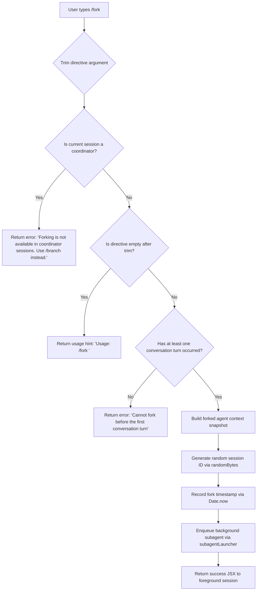

# `/fork`

> Analysis basis: CC v2.1.162 bundle.js (AST extraction + Claude interpretation)
> Minimum version: v2.1.162

---

## Overview

`/fork` spawns a background agent that inherits the full current conversation history, then immediately runs a user-supplied directive in that agent. The forked agent operates as a fully independent background session with its own context snapshot and lifecycle, while the parent (foreground) session continues uninterrupted.

---

## Registration

| Field | Value |
|---|---|
| type | `local-jsx` |
| name | `fork` |
| description | `Spawn a background agent that inherits the full conversation` |
| argumentHint | `<directive>` |
| module_id | `$HK` |
| load_inline | `true` |
| loc_byte | `12416811` |
| loc_byte_end | `12417014` |
| arbor_handler.name | `Xvf` |
| arbor_handler.kind | `AsyncFunction` |
| arbor_handler.resolution_path | `module_id` |
| arbor_handler.fqn | `claude-2.1.162::Xvf` |
| arbor_handler.n_hits | `0` |

Analysis basis: CC v2.1.162 bundle.js:+12416811

---

## Input Branching

The command handler has 4 distinct branches based on session state and argument validation:



Analysis basis: CC v2.1.162 bundle.js:+12416370 (argument trim), +12416392 (session-type check), +12416462 (coordinator check), +12416503 (conversation-turn check), +12416581 (error literal), +12416508 (coordinator error literal)

---

## Behavioral Spec

### 1. Argument Validation

```
async function forkCommandHandler(rawInput, sessionContext):
    directive = rawInput.trim()
    if directive is empty:
        return UsageError("Usage: /fork <directive>")
```

Analysis basis: CC v2.1.162 bundle.js:+12416370

### 2. Session-Type Guard

```
    if sessionContext.sessionType == "coordinator":
        return Error("Forking is not available in coordinator sessions. Use /branch instead.")
```

The check reads the session mode from app state. The string `"coordinator"` is present at +15661982; the error literal `"Forking is not available in coordinator sessions. Use /branch instead."` appears at +12416508.

Analysis basis: CC v2.1.162 bundle.js:+12416392, +12416508

### 3. Conversation Pre-condition Guard

```
    conversationMessages = getConversationHistory(sessionContext)
    if no assistant messages exist:
        return Error("Cannot fork before the first conversation turn")
```

The check locates the last assistant message in the conversation (call to `findLast` at +10862927). If none is found the literal error `"Cannot fork before the first conversation turn"` (+12416581) is returned immediately.

Analysis basis: CC v2.1.162 bundle.js:+12416462, +12416581

### 4. Context Snapshot Construction

```
    snapshot = buildConversationSnapshot(sessionContext):
        messages      = Array.from(currentMessages).slice(0, 50)   // up to 50 messages
        systemPrompt  = getSystemPrompt(sessionContext)
        workingDir    = appState.working_directory
        allowedTools  = appState.allowed_tools
        disallowedTools = appState.disallowed_tools
        flagSettings  = appState.flag_settings
        model         = appState.model
        effort        = appState.effort
        maxThinkingTokens = appState.max_thinking_tokens
        sessionMode   = "fork"
        resumeMode    = "resume"
        replContexts  = getReplContexts(sessionContext)
```

The slice limit of 50 is confirmed by number literals `50` / `49` at +10887107 / +10887120 (byte-count boundary for the message slice). The property names `"working_directory"`, `"allowed_tools"`, `"disallowed_tools"`, `"flag_settings"`, `"model"`, `"effort"`, `"max_thinking_tokens"` appear at +10862952–+10863498. `"fork"` at +10886922, `"resume"` at +10887041.

Analysis basis: CC v2.1.162 bundle.js:+10887057–+10887110

### 5. Subagent Identification and Launch

```
    sessionId   = randomBytes(8).toString("hex")   // 16-char hex token
    forkTime    = Date.now()
    subagentDescriptor = {
        type:     "local_agent",
        status:   "running",
        purpose:  "general-purpose",
        mode:     "subagent_fork_coordinator_mode",
        directive: directive,
        context:  snapshot,
        id:       sessionId,
        startedAt: forkTime
    }
    registerSubagentTask(subagentDescriptor)   // updates task registry
    launchBackgroundAgent(subagentDescriptor)  // calls subagentLauncher (raH)
```

Literals: `"local_agent"` at +10445251, `"running"` at +10445296, `"general-purpose"` at +10445370, `"subagent_fork_coordinator_mode"` at +10886749, `"subagent_launch"` at +10886731, `8` bytes for random ID at +6831855, `"hex"` at +6831867.

Analysis basis: CC v2.1.162 bundle.js:+10887164 (`Date.now`), +10887177 (subagent dispatch), +12416462

### 6. Prompt-missing Safety Check

```
    if directive is missing from subagent descriptor after resolution:
        log telemetry("subagent_fork_prompt_missing")
        abort launch
```

Literal `"subagent_fork_prompt_missing"` at +10886873.

Analysis basis: CC v2.1.162 bundle.js:+10886873

### 7. Background Agent Lifecycle (depth-2)

The background agent lifecycle manager (`raH`) handles:

- Watchdog timer (10 retries, 600 000 ms timeout): literals `10` at +6921718, `600000` at +6921723.
- Stall detection event: `"watchdog_stall"` at +6922209.
- Completion reporting: `"subagent_complete"` at +6922851, `"subagent_stall_timeout"` at +6922871.
- Cancellation paths: `"killed"` at +6924678, `"cancelled"` at +6924835, `"user_kill_async"` at +6925032.
- Output trimming to 80 chars for status: number `80` at +6925263.
- Query progress events: `"query_progress"` at +6923113.

Analysis basis: CC v2.1.162 bundle.js:+6921657–+6925492

### 8. Subagent Session Persistence

The background session writes:
- Transcript at `*.jsonl` (literal `".jsonl"` at +13101781).
- Metadata at `*.meta.json` (literal `".meta.json"` at +13101625).
- Fork context reference tag `"fork-context-ref"` at +13117641.
- Agent metadata key `"agent_metadata"` at +13101816.

Analysis basis: CC v2.1.162 bundle.js:+13101669–+13101816

---

## State & Side Effects

| Item | Detail |
|---|---|
| Telemetry — subagent_launch | Fired when fork dispatch begins (literal `"subagent_launch"` at +10886731) |
| Telemetry — subagent_fork_coordinator_mode | Mode tag attached to the forked agent descriptor (+10886749) |
| Telemetry — subagent_fork_prompt_missing | Fired if directive is absent after resolution (+10886873) |
| Telemetry — tengu_forked_agent_default_turns_exceeded | Fired when forked agent exceeds default turn budget (+10861721) |
| Telemetry — tengu_async_agent_stall_timeout | Fired when watchdog expires without agent progress (+6922614) |
| Telemetry — tengu_agent_tool_completed | Fired on each tool completion in background agent (+6918699) |
| Telemetry — tengu_agent_tool_terminated | Fired when tool is forcibly terminated (+6924859) |
| Telemetry — tengu_auto_mode_decision | Fired by auto-mode classifier during fork execution (+6920344) |
| Telemetry — tengu_slim_subagent_claudemd | Fired when CLAUDE.md is loaded for subagent (+9474727) |
| Telemetry — tengu_agent_summary_skipped | Fired when post-fork summary generation is skipped (+9485366) |
| appState changes | Fork registers new entry in the task registry (`s7K.add` at +13187069); on completion the entry is removed (`s7K.delete` at +13187094) |
| Filesystem | Transcript JSONL and `.meta.json` written under projects directory; symlink created via `_e.symlink` at +13189281 |
| Session ID | Unique 8-byte hex token generated via `crypto.randomBytes` (+6831839) |
| Watchdog timer | `setTimeout` at +6922312 arms watchdog; `clearTimeout` at +6922275 cancels on completion |
| Hook registration | `jJA.register` (+60123) and `K.register` (+10445562) register task in hook pipeline |
| Sound | <!-- TODO: not found in depth-2 traversal; needs --depth 4 --> |

---

## Version History

| Version | Change |
|---|---|
| v2.1.162 | Initial analysis |

---

## Common Mistakes

1. **Using `/fork` in a coordinator session** — The command is explicitly blocked with the message `"Forking is not available in coordinator sessions. Use /branch instead."` Use `/branch` in multi-agent coordinator contexts.
2. **Running `/fork` before any conversation turn** — If no assistant turn has occurred yet the command fails immediately with `"Cannot fork before the first conversation turn"`. Send at least one message and receive a reply before forking.
3. **Omitting the `<directive>` argument** — Without a directive the command prints the usage hint `"Usage: /fork <directive>"` and does nothing. A non-empty directive string is required.
4. **Expecting the fork to block the foreground** — The forked agent runs fully in the background. The foreground session continues immediately; results appear asynchronously.
5. **Expecting shared mutable state** — The fork receives a *snapshot* of the conversation (up to ~50 messages). Any changes made in the forked session do not propagate back to the parent session automatically.

---

## Appendix — Identifier Mapping

> For bundle debugging only. Identifiers change across versions.

| Identifier | Role |
|---|---|
| `Xvf` | Main `/fork` command async handler (arbor-resolved entry point) |
| `AHA` | Fork context builder — assembles snapshot, message slice, session IDs |
| `LMf` | Conversation snapshot extractor — reads appState, messages, system prompt |
| `raH` | Background subagent launcher and lifecycle manager (watchdog, events) |
| `b_` | Last-assistant-message finder; also used in turn pre-condition guard |
| `D86` | Subagent task registration and agent descriptor constructor |
| `_CH` | Subagent filesystem setup — mkdir, symlink, open transcript file |
| `Ab8` | Task-set add/remove around agent execution |
| `T7A` | Subagent transcript directory creator |
| `d$` | Transcript path builder |
| `L66` | Subagent initializer combining `Ab8`, `T7A`, `d$` |
| `KT` | System-prompt assembler (all prompt sections: memory, env, tools, etc.) |
| `$S` | Core REPL session runner that the forked agent reuses |
| `k5f` | Inner agent query loop (model calls, tool execution, compaction) |
| `mm` | Model configuration builder for the forked agent |
| `xZ8` | REPL context snapshot serializer |
| `qs` | Tool-set resolver for forked agent |
| `dh` | Random-bytes session-ID generator |
| `hC` | AbortController + signal chain setup |
| `lq` | Signal max-listeners setter |
| `cM` | Shared context object threaded through fork pipeline |
| `raH` → `g` | Subagent process watchdog object (kill, signal, timer) |
| `raH` → `h` | Stall-timeout handler |
| `raH` → `iaH` | Subagent completion callback (updates task state) |
| `raH` → `c_H` | Subagent abort/speculate handler |
| `b06` | Agent-summary generator used at fork completion |
| `$G` | Per-turn progress event emitter inside forked agent |
| `iK` | Text-content filter for subagent output |
| `kyH` | Task-registry lookup helper |
| `JXH` | Task-notification dispatcher |
| `CCH` | Command-lifecycle tracker |
| `LD8` | Subagent end / handoff classifier runner |
| `$D8` | Auto-mode classifier (safety review of subagent output) |
| `h06` | Auto-mode classifier API call implementation |
| `MD8` | Subagent metadata finalizer |
| `gaH` | Task-progress event emitter |
| `OD8` | Subagent output state updater |
| `jXH` | Task-notification state updater |
| `zD8` | Conversation-history filter for compact boundary |
| `aW6` | Session-cleanup helper on fork exit |
| `Sn_` | Fork-context-ref writer |
| `$86` | Transcript JSONL and meta.json file writer |
| `G7K` | Session-path builder for transcript storage |
| `J1H` | Fork session-metadata finalizer |
| `ZCH` | Compact-boundary message filter |
| `k6` | Background-session transport manager |
| `qH` | Session message-queue writer |
| `$5A` | Background session bridge adapter |
| `FH` | Transport connection handler for background session |
| `N6` | End-of-turn batch writer |
| `um` | Subagent exit/cleanup handler |
| `eO8` | Subagent state teardown |
| `hx9` | OpenTelemetry span creator for `subagent.spawn` |
| `$XH` | Tracing context setter |
| `Qh` | Tracing active-span accessor |
| `EyH` | Span attribute setter |
| `IN` | Span name recorder (`claude_code.subagent.spawn`) |
| `AZ8` | Forked appState initializer (copies and patches parent state) |
| `HZ8` | MCP tool-set builder for forked session |
| `_H` | Full session initializer (load conversation, set up tools, run loop) |
| `L1H` | Session-load implementation (reads JSONL, validates, hydrates) |
| `L5H` | Live-session list fetcher |
| `pC6` | Project directory / transcript rename helper |
| `Nn` | Session-registry updater |
| `Z9H` | Session metadata appender |
| `T9H` | Session `utimes` / metadata rewriter |
| `K$H` | Context-object assembler for inner loop |
| `gC6` | CLAUDE.md loader for forked agent |
| `QC6` | Working-directory chdir for forked session |
| `wZ` | Environment detection (tmux, screen, base64) |
| `d` | Pty / tty output stream for background session |
| `v5H` | Subagent session-creation coordinator |
| `ZP` | Hook-pipeline runner used by forked agent |
| `bL` | Subagent session-builder |
| `NH` | Session-manager that races connection and execution |
| `S1H` | Full subagent session handler (OAuth, MCP, HTTP server, token budget) |
| `z_6` | Background-session token-state tracker |
| `oH` | Managed-settings resolver for forked session |
| `Yr7` | MCP server startup for forked agent |
| `sb9` | Tool-permission set builder |
| `n7H` | Tool-search / deferred-tools initializer |
| `tk_` | Deferred tool-pool manager |
| `br_` | Deferred tool change tracker |
| `CV` | Context-window / token-budget calculator |
| `WE` | Tool-allowlist checker |
| `pGq` | MCP session dedup tracker |
| `I_H` | MCP tool filter (removes duplicates) |
| `gv6` | MCP bundled-tool builder |
| `rl` | MCP tool-permission applier |
| `rkH` | Exponential-backoff calculator for MCP reconnect |
| `tk_` | Tool-batch ordering and dedup |
| `um` → `k5f` | Inner query-loop implementation (model call, tool execution) |
| `eO8` | Subagent state cleanup on exit |
| `r7H` | Tool-filter / permission context builder |
| `A0` | Skill-file loader for forked agent |
| `lLf` | Skill-file watcher and reloader |
| `f86` | Skill-progress emitter |
| `hv6` | Skill-name trimmer |
| `Ml` | MCP monitor cleanup |
| `HC9` | Shell-task cleanup |
| `MyH` | Completion-report file writer |
| `yn_` | MCP session cache cleanup |
| `PyH` | Trace-store cleanup |
| `Sx9` | OpenTelemetry span finisher |
| `GyH` | Span status setter |
| `OXH` | Span context restorer |
| `JC9` | Session-socket cleanup |
| `ab9` | Final appState flush |
| `XyH` | appState update with timestamp |
| `Rp` | Result renderer for auto-mode classifier |
| `y1` | React element factory (JSX) used for result display |
| `WP6` | Fork result JSX component |
| `mjH` | Background-agent status display helper |
| `hH` | React render helper (JSX node builder) |
| `RH` | React render helper (alternative node type) |
| `tH` | String coercion utility |
| `S6` | Nv-based constant resolver |
| `Nv` | Core module constant table |
| `V8` | Filesystem error-code constant (`EISDIR`) |
| `kH` | Error logger / zBH push |
| `E6` | JSX element helper (uses `Zx6`) |
| `Zx6` | Base JSX factory |
| `c` | JSX children helper |
| `Z6` | JSX fragment helper |
| `TH` | String type-coercion guard |
| `t_` | Error constructor wrapper |

Note: index built via Arbor fallback; some signals (telemetry, literals) may be missing — see arbor-fallback.js.