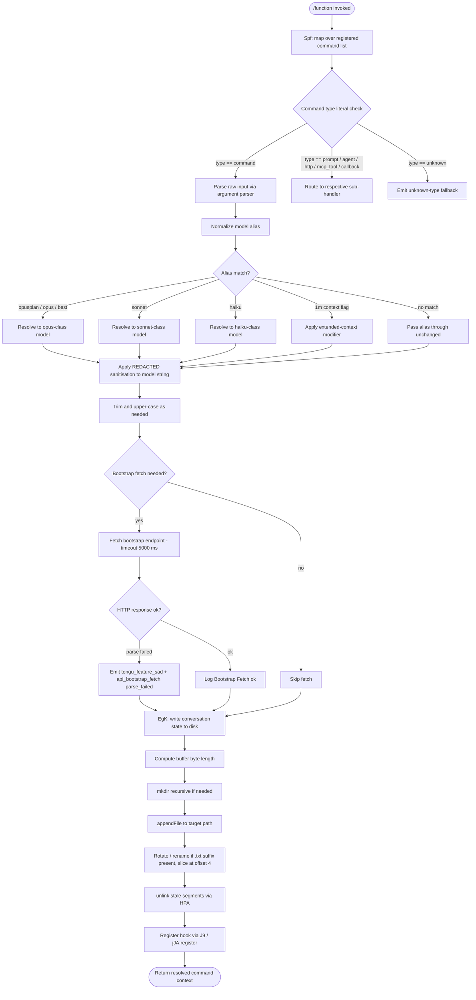

# `/function`

> Analysis basis: CC v2.1.162 bundle.js (AST extraction + Claude interpretation)
> Minimum version: v2.1.162

---

## Overview

The `/function` command is a registration-type slash command of kind `"function"` (as opposed to `"prompt"` or `"agent"`). Its handler (`Spf`) maps over a collection of registered sub-commands, performing argument parsing, model-alias resolution, file-system I/O for conversation state, and a bootstrap fetch cycle to prime command metadata before dispatching results. The command acts as an internal dispatcher that resolves named commands from a live registry and routes their execution context.

---

## Registration

| Field | Value |
|---|---|
| type | `function` |
| name | `function` |
| description | `null` |
| loc_byte | `13276263` |
| loc_byte_end | `13276296` |
| loc_line | `10552` |
| arbor_handler.name | `Spf` |
| arbor_handler.fqn | `claude-2.1.162::Spf` |
| arbor_handler.kind | `Function` |
| arbor_handler.resolution_path | `direct` (symbol fell inside the registration byte range) |
| arbor_handler.n_hits | `1` |

Analysis basis: CC v2.1.162 bundle.js:+13276263

---

## Input Branching

The call graph reveals more than three distinct execution branches: bootstrap-fetch path, argument-parsing path (with sub-branches for model-alias resolution), file-system write path, and hook-registration path. A Mermaid flowchart is used.



Analysis basis: CC v2.1.162 bundle.js:+13275944 (Spf entry), +13276015 (IMH call), +205817 (argument-parse branch), +15590991 (bootstrap fetch)

---

## Behavioral Spec

### 1. Entry Point — Command List Mapping (`Spf`)

```
function commandListMapper(registeredCommands):
    results = []
    for each cmd in registeredCommands.map():
        context = dispatchByType(cmd)
        results.push(context)
    hookRegistry.call(IMH, results)   // IMH post-processing
    return results
```

Analysis basis: CC v2.1.162 bundle.js:+13275944 (`Spf → H.map`), +13276015 (`Spf → IMH`)

---

### 2. Type Dispatch (`v`)

The core dispatcher inspects the `type` field of each registered command object and branches accordingly. Known type literals observed in the bundle: `"command"`, `"prompt"`, `"agent"`, `"http"`, `"mcp_tool"`, `"callback"`, `"unknown"`.

```
function dispatchByType(cmd):
    match cmd.type:
        case "command":
            return handleCommandType(cmd)
        case "prompt":
            return handlePromptType(cmd)
        case "agent":
            return handleAgentType(cmd)
        case "http":
            return handleHttpType(cmd)
        case "mcp_tool":
            return handleMcpToolType(cmd)
        case "callback":
            return handleCallbackType(cmd)
        default:
            return { type: "unknown", cmd }
```

Analysis basis: CC v2.1.162 bundle.js:+205817 (`v → EL6`), +205835 (`v → PgK`), +205857 (`v → H.includes`), +13275975 (literal `"command"`), +13276377 (literal `"unknown"`)

---

### 3. Argument Parsing (`PgK` / `PJA`)

For `"command"`-type entries the argument string is parsed before further processing.

```
function parseCommandArguments(rawInput):
    tokens = tokenize(rawInput, separator=1)   // split index 1
    for each token:
        validated = validateBounds(token)       // GUK: lower bound 0
        if validated fails:
            applyFallback(token)               // EUK
    return tokens
```

Minimum token index: `0` (Analysis basis: CC v2.1.162 bundle.js:+61248)
Token split boundary index: `1` (Analysis basis: CC v2.1.162 bundle.js:+204440)

---

### 4. Model Alias Resolution (`qq`, `PE`, `RJ1`, `LQH`, `qI`, `UM`, `Xt6`, `fQH`)

Model names are normalised to lowercase, trimmed, and then matched against a fixed alias table before the resolved identifier is forwarded to the API layer.

```
function resolveModelAlias(rawAlias):
    normalised = rawAlias.trim().toLowerCase()
    if normalised == "opusplan":
        return opusClassModel()
    if normalised == "opus" or normalised == "best":
        return opusClassModel()
    if normalised.includes("[1m]"):
        return applyExtendedContext(opusClassModel())
    if normalised == "sonnet":
        return sonnetClassModel()
    if normalised == "haiku":
        return haikuClassModel()
    // Vendor-prefix check
    if normalised.startsWith("anthropic."):
        tag = "firstParty"
    if contextType in ["anthropicAws", "gateway", "mantle"]:
        tag = providerTag(contextType)
    sanitised = applyRedactedSanitisation(normalised)   // replaces sensitive segment with "[REDACTED]"
    return { alias: sanitised, tag, extended: false }
```

Alias literals confirmed: `"opusplan"` (+2240470), `"opus"` (+2240589), `"best"` (+2240626), `"sonnet"` (+2240511), `"haiku"` (+2240550), `"[1m]"` (+2240496), `"anthropic."` (+2234431), `"firstParty"` (+2236678), `"anthropicAws"` (+2094587), `"gateway"` (+2094607), `"mantle"` (+2237319).
Redaction placeholder: `"[REDACTED]"` (Analysis basis: CC v2.1.162 bundle.js:+197925)
Maximum model-string segment for `lastIndexOf` scan: index `2` (Analysis basis: CC v2.1.162 bundle.js:+197954)
Lowercase path limit: `40` characters (Analysis basis: CC v2.1.162 bundle.js:+16022362)

---

### 5. Bootstrap Fetch (`H` / `v`)

Before executing, the handler may perform a bootstrap HTTP fetch to retrieve up-to-date command metadata.

```
function bootstrapFetch(endpoint, headers):
    log("[Bootstrap] Fetching", endpoint)
    response = fetch(endpoint, {
        headers: {
            "Content-Type": "application/json",
            "User-Agent":   agentString
        },
        timeout: 5000   // ms
    })
    if response.parse fails:
        emitTelemetry("api_bootstrap_fetch", { status: "parse_failed" })
        // tengu_feature_sad also fired (see State & Side Effects)
    else:
        log("[Bootstrap] Fetch ok")
    return response
```

Timeout: `5000` ms (Analysis basis: CC v2.1.162 bundle.js:+15591194)
Log prefix `"[Bootstrap] Fetching"` (Analysis basis: CC v2.1.162 bundle.js:+15590993)
Log prefix `"[Bootstrap] Fetch ok"` (Analysis basis: CC v2.1.162 bundle.js:+15591367)
Telemetry event name `"api_bootstrap_fetch"` (Analysis basis: CC v2.1.162 bundle.js:+15591315)
Failure label `"parse_failed"` (Analysis basis: CC v2.1.162 bundle.js:+15591337)
Header `"Content-Type": "application/json"` (Analysis basis: CC v2.1.162 bundle.js:+15591078, +15591093)
Header `"User-Agent"` (Analysis basis: CC v2.1.162 bundle.js:+15591112)

---

### 6. Conversation-State File I/O (`EgK`, `GgK`, `HPA`, `_PA`, `WpH`)

After dispatch, the command persists conversation state to disk using an async write pipeline.

```
function persistConversationState(content, baseDir):
    targetPath = path.join(baseDir, conversationId)
    byteLen    = Buffer.byteLength(content)

    // Ensure directory exists
    await fs.mkdir(targetPath, { recursive: true })

    // Append new content
    await fs.appendFile(targetPath, content)

    // Rotation / segment management
    meta = await fs.stat(targetPath)
    if targetPath.endsWith(".txt"):
        rotatedPath = targetPath.slice(0, -4)   // strip ".txt" (length 4)
        await fs.rename(targetPath, rotatedPath)
    if byteLen exceeds threshold:
        await unlinkStaleSegments(targetPath)   // HPA → jy.unlink

    // EISDIR guard
    if error.code == "EISDIR":
        handleDirectoryCollision()              // zL6 → V8
```

`.txt` suffix check and 4-char slice (Analysis basis: CC v2.1.162 bundle.js:+204765, +204787)
`EISDIR` error code (Analysis basis: CC v2.1.162 bundle.js:+175445)
`fs.mkdir` call (Analysis basis: CC v2.1.162 bundle.js:+205060)
`fs.appendFile` call (Analysis basis: CC v2.1.162 bundle.js:+205119)
`fs.rename` call (Analysis basis: CC v2.1.162 bundle.js:+204817)
`fs.unlink` call (Analysis basis: CC v2.1.162 bundle.js:+204857)
`Buffer.byteLength` call (Analysis basis: CC v2.1.162 bundle.js:+205513)

---

### 7. Debounced Write Buffer (`dmH`)

Content is not written immediately; it passes through a debounce/batching layer.

```
function debouncedWriter(chunks, delay):
    clearTimeout(pendingTimer)
    pendingChunks.push(chunks)
    pendingTimer = setTimeout(() => {
        batch = pendingChunks.join("")
        setImmediate(() => flushBatch(batch))
        pendingChunks = []
    }, delay)
```

Debounce delay upper bound: `1000` ms (Analysis basis: CC v2.1.162 bundle.js:+59425)
Chunk batch limit: `100` (Analysis basis: CC v2.1.162 bundle.js:+59446)
Uses `clearTimeout`, `setTimeout`, `setImmediate` (Analysis basis: CC v2.1.162 bundle.js:+59537, +59701, +59794)

---

### 8. Hook Registration (`J9`)

After state is flushed, a post-execution hook is registered with the internal hook registry.

```
function registerPostExecutionHook(context):
    hookRegistry.register(context)   // jJA.register
```

Analysis basis: CC v2.1.162 bundle.js:+60123 (`J9 → jJA.register`)

---

### 9. Sub-command Argument Parser (`AY_`)

Parses argument strings in the format `name[delim]value`.

```
function parseSubCommandArgs(raw):
    parts   = raw.split(delimiter)
    trimmed = parts.map(p => p.trim())
    idx     = trimmed.indexOf(key)
    value   = trimmed.slice(idx + 1)
    return value
```

Analysis basis: CC v2.1.162 bundle.js:+2971282 (`AY_ → _.split`), +2971321 (`AY_ → q.trim`), +2971345 (`AY_ → q.indexOf`), +2971385 (`AY_ → q.slice`)

---

### 10. JSON Serialisation for Debug (`SH`)

When the debug level is active, command context objects are serialised to JSON strings.

```
function serialiseForDebug(obj):
    if logLevel == "debug":
        return JSON.stringify(obj)
    return obj
```

Log level literal `"debug"` (Analysis basis: CC v2.1.162 bundle.js:+205793)
`JSON.stringify` call (Analysis basis: CC v2.1.162 bundle.js:+184938)

---

## State & Side Effects

| Item | Detail |
|---|---|
| Telemetry | `tengu_feature_sad` — fired on bootstrap-fetch parse failure (CC v2.1.162 bundle.js:+1008376) |
| Telemetry | `api_bootstrap_fetch` with label `parse_failed` — fired on HTTP response parse error (CC v2.1.162 bundle.js:+15591315, +15591337) |
| Hook registration | `jJA.register` called via `J9` after state flush (CC v2.1.162 bundle.js:+60123) |
| File system — append | `fs.appendFile` writes conversation state to disk (CC v2.1.162 bundle.js:+205119) |
| File system — mkdir | `fs.mkdir` creates target directory recursively (CC v2.1.162 bundle.js:+205060) |
| File system — rename | `fs.rename` rotates `.txt` segments (CC v2.1.162 bundle.js:+204817) |
| File system — unlink | `fs.unlink` removes stale segments; `OCK.unlinkSync` used in sync context (CC v2.1.162 bundle.js:+204857, +15973408) |
| Network | Bootstrap HTTP GET with `Content-Type: application/json`, `User-Agent` headers; timeout 5000 ms (CC v2.1.162 bundle.js:+15591194) |
| Debounce timer | `setTimeout` / `clearTimeout` / `setImmediate` manage write batching; delay ≤ 1000 ms, batch cap 100 (CC v2.1.162 bundle.js:+59425, +59446) |
| appState changes | Model alias field updated with resolved alias and provider tag (`firstParty`, `anthropicAws`, `gateway`, `mantle`) |
| Sound | <!-- TODO: not found in depth-2 traversal; needs --depth 4 --> |

---

## Version History

| Version | Change |
|---|---|
| v2.1.162 | Initial analysis |

---

## Common Mistakes

1. **Assuming `/function` is a user-facing prompt command.** The registration `type` is `"function"` and `description` is `null`, indicating this is an internal dispatcher, not a user-visible prompt command. Do not expect it to surface in the `/help` listing.
2. **Conflating model alias strings with API model IDs.** Aliases such as `"best"`, `"opus"`, `"opusplan"`, and `"haiku"` are internal shorthand; the resolver maps them to concrete model identifiers before the API call. Passing a raw alias directly to the API will fail.
3. **Ignoring the 5000 ms bootstrap timeout.** Network environments with high latency may cause the bootstrap fetch to time out silently; the `tengu_feature_sad` event is the only signal of this failure.
4. **Not accounting for the `.txt` rotation.** Files written with a `.txt` suffix are automatically renamed (last 4 characters stripped) by `HPA`. Downstream readers relying on `.txt` paths will lose the file.
5. **Writing large payloads without respecting the 100-chunk batch cap.** The debounce buffer enforces a batch limit of 100 entries; exceeding it without awaiting the flush can cause data to be silently dropped in the current write cycle.
6. **Expecting `EISDIR` to be a fatal error.** The `zL6`/`V8` branch handles directory-collision errors gracefully; callers should not treat an `EISDIR` condition as unrecoverable.

---

## Appendix — Identifier Mapping

> For bundle debugging only. Identifiers change across versions.

| Identifier | Role |
|---|---|
| `Spf` | Main handler function for `/function` command (entry point) |
| `H` | Bootstrap fetch dispatcher / command collection iterable |
| `v` | Type-dispatch function — routes by `cmd.type` |
| `PgK` | Argument parsing coordinator |
| `PJA` | Token bounds validator |
| `SH` | JSON serialisation helper (debug mode) |
| `V4` | Model-string sanitisation and segment slicer |
| `rXA` | YgK map iterator — alias segment mapper |
| `q` | Token accessor (`.at`) / sync unlink caller |
| `A` | Lowercase converter / `lastIndexOf` / `slice` operator |
| `WpH` | Write dispatcher — delegates to `pXA` |
| `pXA` | Low-level stream writer (`H.write`) |
| `EgK` | Conversation-state persistence coordinator |
| `dmH` | Debounced write-buffer manager |
| `E3H` | Path builder using `_p6`, `s8`, `S6` helpers |
| `i6` | Internal path component resolver |
| `zL6` | EISDIR / directory-collision handler |
| `_PA` | Path join + `S6` validation helper |
| `HPA` | Segment rotation handler (`stat` → `rename` → `unlink`) |
| `GgK` | Bound write-loop callback (`mkdir` + `appendFile` + rotation) |
| `J9` | Hook registration wrapper |
| `_3` | Intermediate state accessor in bootstrap path |
| `AY_` | Sub-command argument string parser |
| `LHH` | Registry `has`-check wrapper (`Y94.has`) |
| `bJ` | String replacement helper in bootstrap path |
| `a1` | Top-level command-object builder |
| `oHH` | Command-object constructor (calls `k0`, `OqH`, `yA`, `Dd`) |
| `k0` | Base command-object factory |
| `OqH` | Option/flag extractor |
| `Dd` | Token classifier / vendor-prefix checker |
| `qq` | Model-alias resolution function |
| `Q0` | BKH-backed sub-resolver |
| `pKH` | `mKH.includes` membership checker |
| `qI` | Alias branch for opus-class with `G5` |
| `LQH` | Alias branch for sonnet-class with `G5` |
| `PE` | Provider-tag resolver (`firstParty` + `wA`) |
| `RJ1` | Delegating resolver — calls `PE` |
| `UM` | `wA`-backed utility resolver |
| `Xt6` | Extended-context flag checker (`z8L.includes`) |
| `fQH` | `tH`-backed extended-context applier |
| `rX` | Compound resolver combining `qq` and `g0` |
| `g0` | Multi-strategy resolver (`WA`, `H6H`, `ozH`, `MQH`, `PE`, `A2`, `UM`, `wA`, `G5`, `qI`) |
| `t6` | Telemetry emitter for `tengu_feature_sad` |
| `c` | Telemetry event constructor |
| `Z6` | Telemetry dispatch — calls `Zx6` |
| `Zx6` | Low-level telemetry sink |
| `IMH` | Post-map hook processor called by `Spf` |

---

Note: index built via Arbor fallback; some signals (telemetry, literals) may be missing — see arbor-fallback.js.