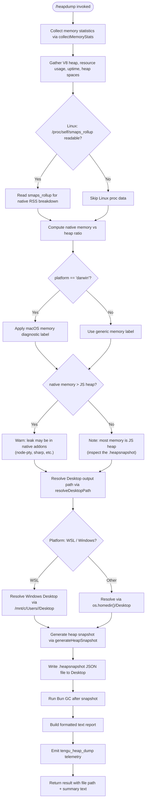

# `/heapdump`

> Analysis basis: CC v2.1.162 bundle.js (AST extraction + Claude interpretation)
> Minimum version: v2.1.162

---

## Overview

`/heapdump` is a hidden diagnostic slash command that captures a JavaScript heap snapshot (`.heapsnapshot` file) of the running Claude Code process and writes it to the user's Desktop directory. It also collects a comprehensive set of memory-usage statistics — V8 heap metrics, native resource usage, OS memory, and Linux `/proc` data where available — and returns a human-readable summary alongside the path to the snapshot file. The command is intended for internal memory-leak investigation and is not surfaced in normal command listings.

---

## Registration

| Field | Value |
|---|---|
| type | `local` |
| name | `heapdump` |
| description | `Dump the JS heap to ~/Desktop` |
| supportsNonInteractive | `true` |
| isHidden | `true` |
| module_id | `z8K` |
| load_inline | `true` |
| loc_byte | `12515917` |
| loc_byte_end | `12516345` |
| loc_line | `8907` |
| arbor_handler.name | `FIf` |
| arbor_handler.fqn | `claude-2.1.162::FIf` |
| arbor_handler.kind | `AsyncFunction` |
| arbor_handler.resolution_path | `module_id` |
| arbor_handler.n_hits | `0` |

Analysis basis: CC v2.1.162 bundle.js:+12515917

---

## Input Branching

The command has four distinct top-level branches based on platform detection and memory-ratio analysis, requiring a Mermaid flowchart.



Analysis basis: CC v2.1.162 bundle.js:+12513448, +12511192, +12512573, +12512992, +12513744, +12514486

---

## Behavioral Spec

### 1. Top-Level Handler (`FIf`)

The Arbor-resolved async handler `FIf` is the command entry point (resolution path: `module_id` → `z8K`).

```
async function heapdumpHandler(context):
    stats     = await collectMemoryStats()          // $8K
    outputPath = resolveDesktopPath()               // mhA
    snapshot  = await generateHeapSnapshot(outputPath)  // BIf
    report    = buildTextReport(stats, snapshot)    // gIf
    return { type: "text", content: report }
```

Analysis basis: CC v2.1.162 bundle.js:+12514786, +12514905

---

### 2. Memory Statistics Collection (`collectMemoryStats` / `$8K`)

Collects all available memory metrics from multiple Node.js / Bun / OS APIs:

```
async function collectMemoryStats():
    heapUsage   = process.memoryUsage()
    v8stats     = v8Module.getHeapStatistics()      // bun:jsc module
    resourceUse = process.resourceUsage()
    uptime      = process.uptime()
    heapSpaces  = v8Module.getHeapSpaceStatistics()
    activeHandles  = process._getActiveHandles().length
    activeRequests = process._getActiveRequests().length

    // Linux-only: read /proc/self/fd and /proc/self/smaps_rollup
    if accessible("/proc/self/fd"):
        fdCount = readdir("/proc/self/fd").length
    if accessible("/proc/self/smaps_rollup"):
        smapsText = readFile("/proc/self/smaps_rollup", encoding="utf8")
        parse smapsText for Rss, Pss, Private_Dirty, etc.

    // Time-window cap: 3600 seconds, chunk 1048576 bytes
    // (bundle.js:+12511481, +12511486)

    nativeMem = heapUsage.rss - heapUsage.heapUsed
    if nativeMem > heapUsage.heapUsed:
        leakWarning = "Native memory > heap - leak may be in native addons (node-pty, sharp, etc.)"

    return { heapUsage, v8stats, resourceUse, uptime,
             heapSpaces, fdCount, smapsData, leakWarning }
```

- V8 module is loaded from `"bun:jsc"` (bundle.js:+12511340).
- `/proc/self/fd` directory is listed to count open file descriptors (bundle.js:+12511192).
- `/proc/self/smaps_rollup` is read as UTF-8 for detailed Linux memory maps (bundle.js:+12511255).
- The native-addon leak warning string is a fixed literal (bundle.js:+12511719).

Analysis basis: CC v2.1.162 bundle.js:+12510949, +12510973, +12510999, +12511025, +12511050, +12511092, +12511129, +12511180, +12511242

---

### 3. Desktop Path Resolution (`resolveDesktopPath` / `mhA`)

```
function resolveDesktopPath():
    home = os.homedir()                          // ss8.homedir()
    basePath = path.join(home, "Desktop")        // j5.join

    // WSL detection: scan /mnt/c/Users for a real Windows user
    if path.existsSync("/mnt/c/Users"):
        candidates = listDir("/mnt/c/Users")
        // Filter out system folders:
        //   "Public", "Default", "Default User", "All Users"
        // Use first real user found
        realUser = candidates.filter(not in systemFolders)[0]
        if realUser:
            basePath = "/mnt/c/Users/" + realUser + "/Desktop"

    return basePath
```

- Skipped system folder names: `"Public"`, `"Default"`, `"Default User"`, `"All Users"` (bundle.js:+1059273, +1059292, +1059312, +1059337).
- `"Desktop"` suffix literal (bundle.js:+1059007).
- WSL prefix literal `"/mnt/c/Users"` (bundle.js:+1059229).

Analysis basis: CC v2.1.162 bundle.js:+12513744, +1058961, +1058997

---

### 4. Heap Snapshot Generation (`generateHeapSnapshot` / `BIf`)

```
async function generateHeapSnapshot(outputDir):
    // File permission mode: 0o600 (octal 384)
    filename = "heapdump-" + timestamp + ".heapsnapshot"
    destPath = path.join(outputDir, filename)

    snapshot = Bun.generateHeapSnapshot()          // format: "v8" | "arraybuffer"
    fs.writeFileSync(destPath, snapshot)           // M8K.writeFileSync

    Bun.gc(true)                                   // force GC after snapshot

    return destPath
```

- File permission mask literal `384` (= `0o600`) (bundle.js:+12513931).
- Snapshot formats probed: `"v8"` and `"arraybuffer"` (bundle.js:+12514511, +12514516).
- `Bun.generateHeapSnapshot` is called at bundle.js:+12514486.
- `Bun.gc` is called post-write at bundle.js:+12514543.
- Writes use `M8K.writeFileSync` (bundle.js:+12514466).

Analysis basis: CC v2.1.162 bundle.js:+12513896, +12514466, +12514486, +12514543

---

### 5. Report Builder (`buildTextReport` / `gIf`)

```
function buildTextReport(stats, snapshotPath):
    lines = []

    // Ratio computation
    ratio = stats.heapUsage.heapUsed / stats.heapUsage.rss
    nativeRatio = 1 - ratio

    if ratio > threshold:
        lines.push("— most memory is JS heap (inspect the .heapsnapshot)")
    else:
        lines.push("— most memory is native (NOT in the .heapsnapshot)")

    if stats.leakWarning:
        lines.push(stats.leakWarning)
    else:
        lines.push("  (no obvious leak indicators)")

    // Numeric formatting: values expressed in MB via .toFixed(n)
    // Column width padding: 8 characters (bundle.js:+12515561)
    // Max column computed with Math.max (bundle.js:+12515161)
    // 1 GiB boundary = 1073741824 bytes (bundle.js:+12515835)

    lines.push("Open the .heapsnapshot in Chrome DevTools → Memory → Load to inspect retainers.")
    lines.push("Snapshot saved to: " + snapshotPath)

    return lines.join("\n")
```

- `"— most memory is JS heap (inspect the .heapsnapshot)"` literal (bundle.js:+12515229).
- `"— most memory is native (NOT in the .heapsnapshot)"` literal (bundle.js:+12515289).
- `"  (no obvious leak indicators)"` literal (bundle.js:+12515426).
- Chrome DevTools usage hint literal (bundle.js:+12514942).
- 1 GiB sentinel value `1073741824` (bundle.js:+12515835).
- Column padding width: `8` (bundle.js:+12515561).

Analysis basis: CC v2.1.162 bundle.js:+12514905, +12515161, +12515473, +12515054

---

### 6. Outer Orchestrator (`VqA`)

`VqA` is the intermediate async orchestrator called by `FIf`. It sequences all four sub-operations and handles error paths:

```
async function orchestrateHeapdump(context):
    // Trigger: "manual", startIndex: 0
    trigger = "manual"    // bundle.js:+12513424
    startIdx = 0          // bundle.js:+12513435

    stats = await collectMemoryStats()
    path  = resolveDesktopPath()

    // path.join with ZqA (path module)
    fullPath = path.join(desktopDir, filename)

    // Write JSON stats file alongside snapshot
    fs.writeFile(fullPath, JSON.stringify(stats))     // SH = JSON.stringify

    // Generate actual heap snapshot
    snapshotPath = await generateHeapSnapshot(desktopDir)  // BIf

    // On error: record via errorLogger, surface to UI
    try:
        ...
    catch err:
        logError(err)              // t_ error formatter
        errorAccumulator.push(err) // q$
        metricsLogger(err)         // kH

    // Emit telemetry
    emit("tengu_heap_dump")        // bundle.js:+12514038

    report = buildTextReport(stats, snapshotPath)
    return formatResult(report)    // c
```

- `"manual"` trigger label (bundle.js:+12513424).
- `JSON.stringify` used via `SH` alias (bundle.js:+12513912).
- `p16.writeFile` = async fs write (bundle.js:+12513896).
- Error path uses `t_` (error formatter, bundle.js:+12514207), `q$` (error accumulator, bundle.js:+12514216), `kH` (metrics/logger, bundle.js:+12514294).
- `tengu_heap_dump` telemetry emitted at bundle.js:+12514038.

Analysis basis: CC v2.1.162 bundle.js:+12513448, +12513461, +12513507, +12513549, +12513744, +12513853, +12513912, +12513987, +12514036

---

## State & Side Effects

| Item | Detail |
|---|---|
| Telemetry | `tengu_heap_dump` (bundle.js:+12514038) — fired once per invocation after snapshot write |
| Telemetry (indirect, call graph) | `tengu_daemon_control`, `tengu_daemon_config_reload`, `tengu_bg_dispatch_sigkill_escalate`, `tengu_bg_dispatch_low_mem`, `tengu_bg_spare_enable`, `tengu_bg_spare_claim`, `tengu_bg_spare_claim_fail`, `tengu_bg_proto_mismatch`, `tengu_bg_dispatch_stale_drop`, `tengu_bg_attach_legacy_autorespawn`, `tengu_bg_attach_upgrade`, `tengu_bg_attach`, `tengu_bg_attach_stall_gave_up`, `tengu_bg_attach_stall_respawn`, `tengu_bg_attach_kick` — originate from shared daemon/supervisor utilities in the call graph, not directly from the heapdump command path |
| File system writes | Writes a `.heapsnapshot` file and a JSON stats file to the Desktop directory (resolved per platform) |
| Bun GC | `Bun.gc(true)` is called after snapshot generation, forcing a synchronous garbage collection |
| appState changes | None detected in depth-2 traversal |
| Sound | None detected in depth-2 traversal |
| Hook registration | `J9` → `jJA.register` (bundle.js:+60123) — likely a process/signal hook registered during stats collection, not specific to heapdump |
| Error accumulation | Errors pushed to an internal accumulator (`q$`) and logged via metrics logger (`kH`) |
| Process APIs called | `process.memoryUsage`, `process.resourceUsage`, `process.uptime`, `process._getActiveHandles`, `process._getActiveRequests` |

---

## Version History

| Version | Change |
|---|---|
| v2.1.162 | Initial analysis |

---

## Common Mistakes

1. **Expecting output in the current directory**: The snapshot is always written to the Desktop (`~/Desktop` or the Windows Desktop under WSL), never to the working directory. Check the path printed in the command output.
2. **Running on a non-Bun runtime**: `Bun.generateHeapSnapshot` and `Bun.gc` are Bun-specific APIs. This command will fail if Claude Code is executed under plain Node.js without Bun.
3. **Expecting the command to appear in `/help`**: The command is registered with `isHidden: true` and will not appear in the standard command listing.
4. **Interpreting "native memory > heap" as a JS bug**: The warning about native addons (node-pty, sharp, etc.) indicates memory outside the V8 heap and will not be visible in the `.heapsnapshot` file; a native profiler is needed for that portion.
5. **Opening the `.heapsnapshot` in a text editor**: The file is intended to be loaded via Chrome DevTools → Memory → Load profile. Raw JSON is very large and not human-readable in isolation.
6. **Assuming Linux `/proc` data is always present**: The smaps and fd-count collection is silently skipped on macOS and other non-Linux platforms; absence of those fields in the report is expected.

---

## Appendix — Identifier Mapping

> For bundle debugging only. Identifiers change across versions.

| Identifier | Role |
|---|---|
| `FIf` | Top-level async handler for `/heapdump` (Arbor-resolved entry point) |
| `VqA` | Orchestrator: sequences stats collection, path resolution, snapshot write, and report formatting |
| `$8K` | Memory statistics collector (calls process/V8/proc APIs) |
| `mhA` | Desktop path resolver (handles macOS, Linux, and WSL) |
| `BIf` | Heap snapshot generator (`Bun.generateHeapSnapshot` + file write + GC) |
| `gIf` | Text report builder (formats MB values, produces human-readable summary) |
| `S6` | Utility: async file/path helper (called from orchestrator and error handler) |
| `Nv` | Sub-utility called by `S6` |
| `W` | Daemon/supervisor control module (shared utility, appears in call graph) |
| `uq6` | Sub-utility called by `W` |
| `kH` | Metrics / error logger |
| `t_` | Error formatter / wrapper |
| `P` | Session/process manager module (shared utility) |
| `j` | Sub-utility called by `P` |
| `J` | Process kill helper (iterates active processes) |
| `H` | Bootstrap fetch handler |
| `z` | Daemon stop/config module |
| `D` | Supervisor config reload handler |
| `h` | Session idle/focus tracker |
| `w` | Background session dispatcher |
| `YMA` | Vim-mode operator dispatcher (shared UI module) |
| `C` | Agent execution queue |
| `X` | PTY/terminal session object |
| `Y5` | PTY close/end helper |
| `xK5` | Terminal session message handler (large shared module) |
| `TH` | String coercion helper |
| `v` | Log-writer / output formatter |
| `PgK` | Log file path resolver |
| `PJA` | Logger initialization helper |
| `SH` | JSON.stringify wrapper |
| `V4` | Path manipulation utility (lastIndexOf, slice, replace) |
| `rXA` | Path segment mapper |
| `q` | Temp-file cleanup helper (unlinkSync) |
| `A` | Case-normalization utility (toLowerCase) |
| `WpH` | Output stream writer wrapper |
| `pXA` | Raw stream write helper |
| `EgK` | Log rotation / append-file manager |
| `dmH` | Async batch/flush scheduler (setTimeout + setImmediate) |
| `E3H` | Log segment joiner |
| `i6` | File existence / mkdir helper |
| `zL6` | V8 version helper |
| `_PA` | Log path joiner |
| `HPA` | Log file rotation helper (stat, rename, unlink) |
| `GgK` | Log file append + rotation orchestrator |
| `J9` | Signal / process hook registrar |
| `K` | Column formatter (padEnd) |
| `L` | Active-connection set manager |
| `f` | Connection lifecycle (open/close) |
| `c` | Result formatter (wraps text into command result shape) |
| `q$` | Error accumulator array |
| `U16` | Sub-utility called by report builder (`gIf`) |
| `_` | String utility (toUpperCase, push, join) |

---

Note: index built via Arbor fallback; some signals (telemetry, literals) may be missing — see arbor-fallback.js.