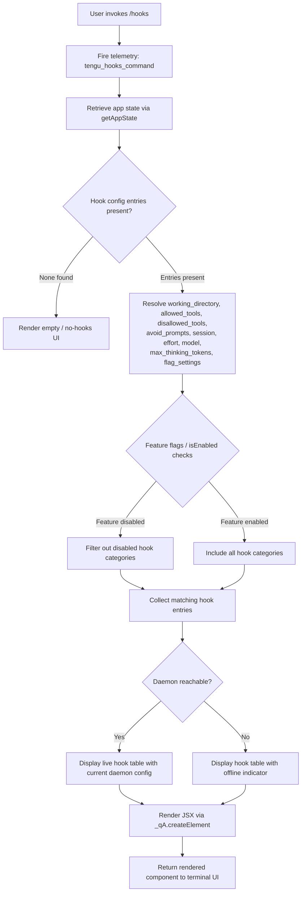

# `/hooks`

> Analysis basis: CC v2.1.162 bundle.js (AST extraction + Claude interpretation)
> Minimum version: v2.1.162

---

## Overview

The `/hooks` command displays the current hook configurations that govern how Claude Code responds to tool lifecycle events (e.g., pre-tool, post-tool, notifications). It is a read-oriented, `immediate` command — it renders a JSX panel in the terminal UI rather than sending a conversational prompt to the model. The handler resolves hook state from the application state store and formats the results for display.

---

## Registration

| Field | Value |
|---|---|
| type | `local-jsx` |
| name | `hooks` |
| description | `View hook configurations for tool events` |
| immediate | `true` |
| module_id | `req` |
| load_inline | `true` |
| loc_byte | `12406379` |
| loc_byte_end | `12406529` |
| loc_line | `8785` |
| arbor_handler.name | `Mvf` |
| arbor_handler.fqn | `claude-2.1.162::Mvf` |
| arbor_handler.kind | `AsyncFunction` |
| arbor_handler.resolution_path | `module_id` |
| arbor_handler.n_hits | `0` |

Analysis basis: CC v2.1.162 bundle.js:+12406379

---

## Input Branching

The handler has multiple distinct branches depending on app state, hook configuration presence, feature-flag status, and daemon connectivity. A flowchart is used.



Analysis basis: CC v2.1.162 bundle.js:+12406177, +12406211, +12406219, +12406249

---

## Behavioral Spec

### 1. Handler Entry and Telemetry Emission

```
async function hooksCommandHandler(context):
    emit telemetry event "tengu_hooks_command"
    call appStateProvider(context)          // resolves current app state
    call hookConfigResolver(context)        // resolves hook configuration record
    proceed to JSX render pipeline
```

Analysis basis: CC v2.1.162 bundle.js:+12406177, +12406179

---

### 2. App State Resolution

The handler calls `appStateProvider` (bundle identifier `b_`), which in turn invokes `H.getAppState` to retrieve the live application state. Within app state resolution, the following named fields are extracted:

- `working_directory` (bundle.js:+10862952)
- `allowed_tools` (bundle.js:+10863007)
- `disallowed_tools` (bundle.js:+10863062)
- `avoid_prompts` (bundle.js:+10863123)
- `session` (bundle.js:+10863422)
- `effort` (bundle.js:+10863447)
- `model` (bundle.js:+10863460)
- `max_thinking_tokens` (bundle.js:+10863472)
- `flag_settings` (bundle.js:+10863498)

The resolver uses `A.findLast` to locate the most recent matching app state entry (bundle.js:+10862927), and conditionally branches on `allowed_tools` (via `VI8`, bundle.js:+10863025) and `disallowed_tools` (via `NI8`, bundle.js:+10863083), each calling a shared key-lookup helper (`K1`, bundle.js:+10856047, +10856195).

```
function resolveAppState(stateStore):
    entry = stateStore.findLast(matchesCurrent)
    workingDir    = entry["working_directory"]
    allowedTools  = lookupKey(entry, "allowed_tools")
    disallowedTools = lookupKey(entry, "disallowed_tools")
    avoidPrompts  = entry["avoid_prompts"]
    session       = entry["session"]
    effort        = entry["effort"]
    model         = entry["model"]
    maxThinking   = entry["max_thinking_tokens"]
    flagSettings  = entry["flag_settings"]
    return assembledState
```

Analysis basis: CC v2.1.162 bundle.js:+10862847, +10862927, +10863007, +10863062

---

### 3. Hook Configuration Collection (`hookConfigResolver` / `cN`)

This is the core sub-function. It performs the following sequence:

```
async function hookConfigResolver(appState):
    // Step 1: Build session context
    sessionCtx = buildSessionContext(appState)          // e0
    pushToDeferredQueue(sessionCtx)                     // D.push

    // Step 2: Instantiate UI rendering primitives
    spinnerControl = createSpinner()                    // ri_
    keyPressHandler = createKeyPressHandler()           // KP

    // Step 3: Retrieve tool-narrowing entries
    toolEntries = filterToolEntries(appState)           // X1H
        -> filter by allowed/denied status
        -> resolve via toolNarrowingResolver (Tv6)
        -> categorize "deny" vs permitted tools

    // Step 4: Build hook display items
    hookDisplayItems = buildHookItems(appState)         // oi_
    additionalItems  = buildAuxItems(appState)          // v4

    // Step 5: Accumulate rendered sections
    push to render queue (z.push)                       // hH, RH, Kh components

    // Step 6: Handle daemon connectivity
    daemonShutdown = awaitDaemonOrTimeout()             // jp
        -> Promise.race([daemonShutdown, timeout(500ms)])
        -> on timeout: continue with cached state
        -> on exit: process.exit

    // Step 7: Build main display panel
    mainPanel = buildHookPanel(appState)                // wt
        -> resolve feature flags via isEnabled checks
        -> filter hook categories
        -> format entries for display

    // Step 8: Check feature availability
    hasHooks    = A.has(hookCollection)
    anyEnabled  = K.some(isEnabled)
    featureGate = C4 check
    iqEnabled   = iq.isEnabled()

    // Step 9: Apply additional filtering
    filteredHooks = K.filter(hookCollection)
    giHChecked    = giH.has(entry)
    mappedHooks   = K.map(formatHook)
    oEnabled      = O.isEnabled()

    // Step 10: Finalize display config
    dpConfig = buildDisplayConfig(appState)             // DP
    dollarIncludes = $.includes(category)

    // Step 11: Render JSX tree
    return _qA.createElement(HooksPanel, resolvedProps)
```

Analysis basis: CC v2.1.162 bundle.js:+9800942, +9801014, +9801029, +9801043, +9801065, +9801080, +9801092, +9801152, +9801252, +9801270, +9801298, +9801310, +9801321, +9801397, +9801412, +9801440, +9801451, +9801493, +9801538, +12406249

---

### 4. Tool Entry Filtering and Narrowing (`toolNarrowingResolver` / `Tv6`)

```
function resolveToolNarrowing(rawEntries):
    flatEntries = flatMap(rawEntries)                   // d5H / Uv8.flatMap
    denyEntries = filter(entry => entry.type == "deny") // literal "deny" +10597257
    cliArgEntries = filter(entry => entry.src == "cliArg")   // "cliArg" +10597843
    narrowingEntries = filter(entry => entry.src == "toolsNarrowing") // +10597864

    for each entry in flatEntries:
        resolve via Nt_ (re8, PM6, RR sub-steps)
        categorize as blocked ("blocked" +9800318) or permitted
    return categorized tool list
```

Analysis basis: CC v2.1.162 bundle.js:+10597906, +10597180, +10597257, +10597843, +10597864, +9800318

---

### 5. Hook Display Panel Construction (`buildHookPanel` / `wt`)

```
function buildHookPanel(appState):
    // Auxiliary items
    auxItems = buildAuxItems(appState)                  // v4
    displayConfig = buildDisplayConfig(appState)        // DP
    colorFormatter = resolveColorFormatter()            // cw
    labelFormatter = resolveLabelFormatter()            // tH

    // Build per-hook-type rows
    for each hookType in resolvedHookTypes:
        row = buildHookRow(hookType, k86)
        attach spinner control (ri_)
        attach local-agent label if needed ("local-agent" +5329880)
        attach agent-teams flag if present ("--agent-teams" +5459172)

    // Build supplementary interactive items
    cancelItem  = buildCancelItem()                     // At7 -> wWq + k_
    confirmItem = buildConfirmItem()                    // qt7 -> GWq + k_

    // Render hook section panel
    hookSection = renderHookSection(appState)           // oi_
    oiExtras    = buildExtras(appState)                 // v4

    // Compose environment-aware display
    envDisplay = resolveEnvDisplay(appState)            // oI
        -> mode: "standard" | "tst" | "tst-auto"       // +10174221, +10174300, +10174350
        -> provider: bedrock/foundry/vertex/mantle/anthropicAws  // +2093914, +2093964
        -> toolSearch optimization check               // +10175235

    return composedPanel
```

Analysis basis: CC v2.1.162 bundle.js:+9799613, +9799629, +9799738, +9799831, +9799902, +9799921, +9799962, +9799968, +9799974, +9800145, +9800186, +9800213, +5329880, +5459172

---

### 6. Daemon Status Integration

The handler races the daemon shutdown signal against a 500 ms timeout to determine whether daemon config should be included live:

```
function awaitDaemonOrTimeout():
    result = Promise.race([
        daemonShutdown(),                   // Bd -> F4H.shutdown
        abortOnTimeout(500),                // n8: setTimeout 500ms, literal +16027602
    ])
    if result == timeout:
        continue with cached hook config
    else:
        apply live daemon config (Z.updateConfig)
        emit "tengu_daemon_config_reload"   // +16011003
    return result
```

Daemon stop events are tracked via `hH` and `RH` components pushing `"daemon_stop"` and `"daemon_stop_failed"` signals (literals at bundle.js:+16032484, +16032521).

Analysis basis: CC v2.1.162 bundle.js:+16027560, +16027574, +16027587, +16027592, +16027599, +16027641, +16011003, +16032484, +16032521

---

### 7. Hook Row Formatting Utilities

Several formatting helpers are invoked during hook-row construction:

- **`buildHookEntryLabel`** (`v`): checks for `"debug"` level (literal at bundle.js:+205793), uppercases tool names (`_.toUpperCase`, +205919), trims whitespace (`H.trim`, +205942), checks `H.includes` (+205857), serializes via `JSON.stringify` (via `SH`, +184938). Size limits: 1000 characters per entry (literal `1000` at +205624), max 100 entries (literal `100` at +205643).
- **`buildPathLabel`** (`V4`): starts at offset 0 (literal `0` at +197851), replaces redacted portions (`"[REDACTED]"` at +197925), uses `q.at` (+197983), `A.lastIndexOf` (+198009), `A.slice` (+198035).
- **`buildHookSource`** (`EgK`): uses `Buffer.byteLength` (+205513), resolves `Qe.dirname` (+205339), async send via `em6.then` (+205563), size limits 1000/100 as above.

Analysis basis: CC v2.1.162 bundle.js:+205793, +205817, +205835, +205857, +205919, +205624, +205643, +197851, +197925

---

## State & Side Effects

| Item | Detail |
|---|---|
| Telemetry: `tengu_hooks_command` | Fired immediately on handler entry (bundle.js:+12406179) |
| Telemetry: `tengu_feature_ok` | Emitted when a feature check passes (bundle.js:+1008233) |
| Telemetry: `tengu_feature_bad` | Emitted when a feature check fails (bundle.js:+1008295) |
| Telemetry: `tengu_feature_sad` | Emitted on feature degraded state (bundle.js:+1008376) |
| Telemetry: `tengu_daemon_config_reload` | Emitted when daemon config is refreshed live (bundle.js:+16011003) |
| Telemetry: `tengu_daemon_control` | Emitted on daemon control operations (bundle.js:+16032559) |
| Telemetry: `tengu_slate_harbor` | Emitted during session context build (bundle.js:+4775112) |
| Telemetry: `tengu_workflows_enabled` | Emitted if workflows feature is enabled (bundle.js:+4163270) |
| Telemetry: `tengu_cobalt_ridge` | Emitted during hook item build on Windows path (bundle.js:+4891505) |
| Telemetry: `tengu_amber_flint` | Emitted during agent-teams flag resolution (bundle.js:+5459284) |
| appState reads | Reads `working_directory`, `allowed_tools`, `disallowed_tools`, `avoid_prompts`, `session`, `effort`, `model`, `max_thinking_tokens`, `flag_settings` |
| Daemon interaction | Races daemon shutdown signal vs. 500 ms timeout; may call `Z.stop`, `Z.updateConfig`, `Z.start` |
| Hook registration | None — this command only reads hook config, does not register new hooks |
| Sound | None detected in traversal |
| JSX render | Calls `_qA.createElement` to produce terminal UI panel (bundle.js:+12406249) |
| Spinner | Creates and manages a spinner UI element during async resolution |
| Key press handler | Registers a temporary key press handler (`KP`) for the display panel |

---

## Version History

| Version | Change |
|---|---|
| v2.1.162 | Initial analysis |

---

## Common Mistakes

1. **Expecting text output, not JSX**: `/hooks` is type `local-jsx` with `immediate: true`. It renders a terminal UI panel, not a plain-text response. Scripts that try to parse its output as plain text will receive JSX-rendered content.
2. **Assuming hooks are always populated**: The handler branches explicitly on whether hook entries exist. An empty config silently renders an empty panel — there is no error message.
3. **Misidentifying the handler**: The Arbor-resolved handler is `Mvf` (an `AsyncFunction`), not the synthetic BFS entry `__handler_hooks`. Downstream tooling should reference `Mvf`.
4. **Ignoring daemon timeout**: The display may reflect a stale cached config if the daemon does not respond within 500 ms. Live values are only shown after a successful daemon round-trip.
5. **Overlooking feature-flag filtering**: Some hook categories are gated behind `isEnabled` checks (`iq.isEnabled`, `O.isEnabled`). Hooks may appear absent if the corresponding feature flag is disabled, not because no hooks are configured.
6. **Windows path handling**: The `"windows"` literal (bundle.js:+4891411) indicates platform-specific path resolution inside hook item construction. Hook paths on Windows may differ from POSIX representations.

---

## Appendix — Identifier Mapping

> For bundle debugging only. Identifiers change across versions.

| Identifier | Role |
|---|---|
| `Mvf` | Main handler for `/hooks` command (AsyncFunction, arbor-resolved) |
| `c` | Shared utility / context helper called at entry |
| `b_` | App state resolver (calls `H.getAppState`, `A.findLast`, `VI8`, `NI8`) |
| `H` | App state container / bootstrap fetcher |
| `v` | Hook entry label builder (debug-level check, toUpperCase, trim, includes, JSON.stringify) |
| `PgK` | Sub-builder within label formatter (calls `Xy`, `XgK`, `PJA`) |
| `SH` | JSON serialization helper (calls `JSON.stringify`) |
| `V4` | Path label builder (replace, at, lastIndexOf, slice) |
| `WpH` | Hook source helper (calls `pXA`) |
| `EgK` | Hook source builder (Buffer.byteLength, dirname, async send) |
| `_3` | Utility called during app state traversal |
| `AY_` | String splitting/trimming utility (split, trim, indexOf, slice) |
| `q` | General-purpose collection / file-system utility |
| `LHH` | Set membership checker (Y94.has) |
| `bJ` | String replacement helper (H.replace) |
| `a1` | Hook item assembler (oHH, qq, rX) |
| `oHH` | Inner assembly helper (k0, OqH, yA, Dd) |
| `qq` | Text normalization helper (trim, toLowerCase, replace, pKH, qI, etc.) |
| `rX` | Additional assembly path (calls qq, g0) |
| `t6` | UI component initializer (calls c, Z6) |
| `Z6` | Component sub-initializer (calls Zx6) |
| `A` | Array/collection helper; also toLowerCase wrapper |
| `f` | Stream/file handle (close, finally, add, delete) |
| `L` | Set manager (add, finally, delete) |
| `VI8` | Allowed-tools key resolver (calls K1) |
| `K1` | Key lookup utility shared by VI8 and NI8 |
| `NI8` | Disallowed-tools key resolver (calls K1) |
| `cN` | Core hook config collection / render orchestrator |
| `e0` | Session context builder (yQ, pK, tH, j6) |
| `yQ` | Session sub-helper |
| `pK` | String coercion helper (calls String) |
| `tH` | Label/text formatter (calls String) |
| `j6` | Deduplication / caching helper (zw6, Dw6, Hu, fYH, U18, C6) |
| `zw6` | Cache initialization helper |
| `Dw6` | Cache helper variant |
| `Hu` | Cache lookup (calls ex) |
| `U18` | Cache set manager (oJ_.has, fYH.get, oJ_.add, rJ_, eJ_) |
| `C6` | Cache entry constructor (i6, lT, zj_, DYH, Date.now, bWL) |
| `D` | Deferred render queue / display manager (Y0H, q.write, OKK, f.get, E.stop, etc.) |
| `Y0H` | Hook table row builder (V9, V8, k4A, TH, b9, I4A, Object.keys, K.has) |
| `V9` | AsyncLocalStorage store getter |
| `V8` | Row variant helper |
| `k4A` | Row key builder (calls I4A) |
| `TH` | String coercion in row context |
| `K` | Column formatter (L.map, f.padEnd) |
| `OKK` | Column width calculator (Object.keys, Math.max, TY) |
| `E` | Event/key handler (preventDefault, c0, D, H) |
| `b` | Event source |
| `c0` | Settings resolver (calls r_, "userSettings") |
| `Z` | Daemon config controller (stop, updateConfig, start) |
| `xCK` | Daemon heartbeat helper (calls d6H, "heartbeat") |
| `d6H` | Heartbeat implementation |
| `V` | Daemon process manager (V.start) |
| `ri_` | Spinner / UI control factory (bWq, k_) |
| `k_` | Spinner implementation (TGH, tU8, Gx6.call, Ex6.bind, xbK, DDA.set) |
| `Ex6` | Spinner bind target |
| `KP` | Key press handler factory (BL8, QK9, tG_, SuL) |
| `BL8` | Key press sub-handler (tH, pT) |
| `pT` | Key press utility |
| `QK9` | Key press dispatch (calls W9) |
| `W9` | Key press router (FK9, yuL.has, JC, huL.has, wq, u4H, rvH, q.includes) |
| `tG_` | Key press variant handler (calls RuL) |
| `RuL` | Key press resolution (tH, j6, pK, Aq) |
| `SuL` | Key press fallback (calls pT) |
| `X1H` | Tool entry filter (H.filter, Tv6) |
| `Tv6` | Tool narrowing resolver (d5H, Nt_, Wyq) |
| `d5H` | Flat-map entry expander (Uv8.flatMap, N3) |
| `Nt_` | Entry categorizer (re8, PM6, RR) |
| `Wyq` | Narrowing post-processor |
| `oi_` | Hook display item builder (RC, V66, k_) |
| `RC` | Hook item constructor (o6, tH, pK, lqH, j6) |
| `v4` | Auxiliary hook item builder (o6, lqH) |
| `z` | Render section accumulator (hH, RH, Kh, jp) |
| `hH` | Daemon-stop section renderer (c, Z6, "daemon_stop") |
| `RH` | Daemon-stop-failed section renderer (c, Z6, "daemon_stop_failed") |
| `Kh` | Daemon control section renderer (ex, Ud.push, ZNH, iJ_) |
| `ex` | Event emitter (calls HC) |
| `ZNH` | Notification helper (calls qh) |
| `iJ_` | UUID-based event emitter (R18, lJ_.randomUUID, sdH, pU, H.emit) |
| `jp` | Daemon shutdown race handler (Promise.race, Promise.all, Bd, dd, n8, process.exit) |
| `Bd` | Daemon shutdown initiator (F4H.shutdown) |
| `dd` | Timeout clearer (clearTimeout, Tj_) |
| `n8` | Abort-on-timeout factory (K, Error, q, setTimeout, O, clearTimeout, L.unref) |
| `wt` | Hook panel main builder (v4, DP, cw, tH, k86, ri_, l9, At7, qt7, oi_, oI) |
| `DP` | Display config builder (tH, SF8, "local-agent") |
| `SF8` | Display config sub-helper |
| `cw` | Color formatter (calls pK) |
| `k86` | Hook row helper |
| `l9` | Agent-teams label builder (tH, s87, j6, "--agent-teams") |
| `s87` | Agent-teams sub-helper |
| `At7` | Cancel item builder (wWq, k_) |
| `qt7` | Confirm item builder (GWq, k_) |
| `oI` | Environment display resolver (to_, v, wA, Hf) |
| `to_` | Environment mode resolver (HNH, xZq, N_f, tH, pK; "standard"/"tst"/"tst-auto") |
| `wA` | Provider label builder (tH; bedrock/foundry/vertex/mantle/anthropicAws) |
| `Hf` | Tool-search optimization helper |
| `C4` | Feature gate check |
| `O` | Feature flag object (isEnabled, x8) |
| `x8` | Feature flag implementation |
| `$` | Category inclusion checker (p1K; $.includes) |
| `p1K` | Category resolver (Ur, Date.now, V9, GS6, SH) |
| `Ur` | Category lookup (calls gKH) |
| `GS6` | Daemon status resolver (m1K.join, s8, "daemon.status.json") |

---

Note: index built via Arbor fallback; some signals (telemetry, literals) may be missing — see arbor-fallback.js.