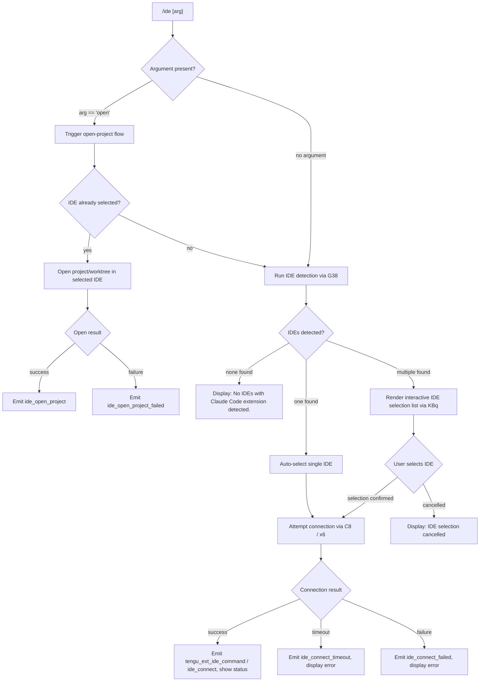

# `/ide`

> Analysis basis: CC v2.1.162 bundle.js (AST extraction + Claude interpretation)
> Minimum version: v2.1.162

---

## Overview

The `/ide` command manages IDE integrations for Claude Code, allowing users to detect connected IDEs (VS Code, Cursor, Windsurf, JetBrains, and others), select an active IDE, open the current project in that IDE, and monitor connection status. It is a `local-jsx` command that renders a React-based interactive UI and communicates with IDE extensions over SSE or WebSocket transports.

---

## Registration

| Field | Value |
|---|---|
| type | `local-jsx` |
| name | `ide` |
| description | `Manage IDE integrations and show status` |
| argumentHint | `[open]` |
| module_id | `LBq` |
| load_inline | `true` |
| loc_byte | `11496084` |
| loc_byte_end | `11496240` |
| loc_line | `7388` |
| arbor_handler.name | `$Jf` |
| arbor_handler.fqn | `claude-2.1.162::$Jf` |
| arbor_handler.kind | `AsyncFunction` |
| arbor_handler.resolution_path | `module_id` |
| arbor_handler.n_hits | `0` |

Analysis basis: CC v2.1.162 bundle.js:+11496084

---

## Input Branching

Five distinct paths are possible depending on argument value, IDE detection results, and connection state — a Mermaid flowchart is used.



Analysis basis: CC v2.1.162 bundle.js:+11492200 (handler entry `$Jf`), +11492308 (literal `"open"`), +11492417 (no-IDE message), +11492555 (no-selection message), +11495466 (cancellation literal)

---

## Behavioral Spec

### 1. Command Entry — `ideCommandHandler` (`$Jf`)

The Arbor-resolved async handler `$Jf` is the true entry point (resolution path: `module_id → LBq`). It performs initial telemetry, reads the optional argument, and forks into detection or open flows.

```
async function ideCommandHandler(context, args):
    emit telemetry: tengu_ext_ide_command   // loc:+11492202

    arg = args[0] ?? null

    if arg == "open":
        goto openProjectFlow(context)

    detectedIDEs = await detectIDEs(context)   // calls G38

    if detectedIDEs is empty:
        display "No IDEs with Claude Code extension detected."
        return

    if detectedIDEs.length == 1:
        selectedIDE = detectedIDEs[0]
    else:
        selectedIDE = await renderIDESelector(detectedIDEs)   // renders KBq component

    if selectedIDE is null:
        display "No IDE selected."
        return

    await connectToIDE(selectedIDE, context)
```

Analysis basis: CC v2.1.162 bundle.js:+11492200, +11492308, +11492415, +11492555, +11492588

---

### 2. IDE Detection — `detectIDEs` (`G38`)

`G38` is an async function that enumerates running processes and known IDE socket paths to build a list of IDEs that have the Claude Code extension installed. It handles cross-platform quirks including WSL path translation.

```
async function detectIDEs(context):
    port = parseInt(...)               // parse optional port hint
    projectRoot = resolveProjectRoot() // X_ → Nv

    candidates = await gatherIDECandidates()   // W38 → o67

    results = await Promise.all(
        candidates.map(candidate => resolveIDEEntry(candidate))   // i67 → U7_
    )

    filteredResults = results.filter(isValid)

    if filteredResults is empty:
        emit telemetry event string "ide_detect_failed"   // loc:+11495740
        return []

    emit telemetry event string "ide_detect"              // loc:+11495676
    return filteredResults
```

Analysis basis: CC v2.1.162 bundle.js:+11492360, +5394321, +5394384, +5395676, +5395740

---

### 3. Candidate Gathering — `gatherIDECandidates` (`W38` / `o67`)

`o67` searches home-directory `.claude` folders, resolves symbolic links, and on Linux executes a `ps aux` grep command to locate IDE processes. On WSL it additionally resolves paths under `/mnt/c/Users`, skipping system accounts (`Public`, `Default`, `Default User`, `All Users`).

```
async function gatherIDECandidates():
    homedir = os.homedir()
    candidates = []

    // Check ~/.claude IDE socket directory
    claudeDir = path.join(homedir, ".claude")
    entries = await fs.readdir(claudeDir)

    for entry in entries:
        fullPath = path.resolve(claudeDir, entry)
        stat = await fs.stat(fullPath)
        if stat.isDirectory() or stat.isSymbolicLink():
            realPath = await fs.realpath(fullPath)
            if realPath not in visited:
                visited.add(realPath)
                candidates.push(realPath)

    // WSL: also scan /mnt/c/Users (skip system accounts)
    if platform == "wsl":
        wslBase = "/mnt/c/Users"
        for userDir in listDir(wslBase):
            if userDir in ["Public", "Default", "Default User", "All Users"]:
                continue
            candidates.push(path.join(wslBase, userDir, ".claude"))

    // Linux: grep running IDE processes
    if platform == "linux":
        psOutput = exec("ps aux | grep -E \"code|cursor|windsurf|devin-desktop|idea|pycharm|...\" | grep -v grep")
        // parse PIDs and paths from psOutput

    return candidates
```

Analysis basis: CC v2.1.162 bundle.js:+5392191, +5392205, +5392243, +5392250, +5392412, +5392506, +5392525, +5392545, +5392570, +5399046

---

### 4. IDE Name Classification — `classifyIDEName` (`gG9`, `E38`)

Given a raw process name or window title, this function maps it to a canonical IDE category using case-insensitive substring matching.

```
function classifyIDEName(rawName):
    lower = rawName.toLowerCase()

    if lower.includes("windsurf"):  return "windsurf"
    if lower.includes("devin"):     return "devin"
    if lower.includes("cursor"):    return "cursor"
    if lower.includes("insiders"):  return "insiders"
    if lower.includes("vscode") or lower.includes("vs code")
       or lower.includes("visual studio code"):  return "vscode"
    if lower.includes("vscodium") or lower.includes("code - oss"):  return "vscodium"
    if lower.includes("codium"):    return "codium"
    // JetBrains family detected via separate path (E38)
    if lower.includes("jetbrains"): return "jetbrains"
    if lower.includes("appcode"):   return "appcode"
    // Windows: strip .cmd suffix
    if rawName.endsWith(".cmd"):     rawName = rawName.slice(0, -4)

    return lower   // fallback: lowercased raw name
```

Analysis basis: CC v2.1.162 bundle.js:+5397116, +5397135, +5397146, +5397170, +5397210, +5397250, +5397275, +5397297, +5397320, +5397354, +5397378, +5397559, +5397597, +5397729

---

### 5. IDE Connection — `connectToIDE` (`C8`, `x6`)

`C8` establishes the connection using the IDE's reported protocol (SSE via `sse-ide` or WebSocket via `ws-ide`). It calls `x6` to look up the application store and then waits for acknowledgment.

```
async function connectToIDE(selectedIDE, context):
    emit telemetry event string "ide_connect"    // loc:+11494303

    protocol = selectedIDE.protocol   // "sse-ide" or "ws-ide"
    address  = selectedIDE.address

    display "Connecting to " + address           // loc:+11495333

    try:
        connection = await establishTransport(protocol, address, context)   // C_ inside C8
        emit telemetry event string "ide_connect"
    except timeout:
        emit telemetry event string "ide_connect_timeout"   // loc:+11494497
        display "Error connecting to IDE."
        return
    except error:
        emit telemetry event string "ide_connect_failed"    // loc:+11494390
        display "Error connecting to IDE."
        return

    updateAppState(connection)
    watchForDisconnect(connection)               // emits "ide_disconnect" on drop
```

Analysis basis: CC v2.1.162 bundle.js:+11492653, +11492890, +11494303, +11494373, +11494390, +11494497, +11494615, +11495113, +11495333, +11490187, +11490207

---

### 6. Open Project Flow — `openProjectFlow` (`$Jf` branch, `Py_` / `q87`)

When the `open` argument is supplied, the handler resolves the current worktree or project root and instructs the selected IDE to open it. `q87` handles the per-IDE open protocol, matching against the IDE's capabilities.

```
async function openProjectFlow(context):
    selectedIDE = getSelectedIDEFromAppState()

    if selectedIDE is null:
        // fall through to detection first, then retry open
        selectedIDE = await runDetectionAndSelect(context)

    if selectedIDE is null:
        return

    projectPath = resolveWorktreeOrProjectRoot(context)   // loc:+11492787, +11492798

    emit telemetry event string "ide_open_project"   // loc:+11492753
    display bold(path.basename(projectPath))          // loc:+11492674, +11492814

    try:
        await sendOpenCommand(selectedIDE, projectPath)   // q87 → cP → wTH
    except error:
        emit telemetry event string "ide_open_project_failed"   // loc:+11492860
        display "Exited without opening IDE"                    // loc:+11493150
        suggest "restart your IDE"                             // loc:+11493418
```

Analysis basis: CC v2.1.162 bundle.js:+11492308, +11492674, +11492753, +11492787, +11492798, +11492814, +11492860, +11493150, +11493283, +11493418

---

### 7. Interactive Selection UI — `IDESelectorComponent` (`KBq`)

`KBq` is the JSX component rendered when multiple IDEs are detected. It uses React hooks (`useState`, `useRef`, `useEffect`, `useCallback`) and renders a filterable list. Each entry shows an MCP-prefixed tool name (`mcp__ide__…`) when IDE MCP tools are active.

```
function IDESelectorComponent(props):
    [selectedIndex, setSelectedIndex] = useState(0)
    appState = useAppState()        // D6
    themeCtx  = useThemeContext()   // qA → rW_
    inputRef  = useRef(null)

    useEffect(() => {
        focusInput(inputRef)
        subscribeToIDEDisconnect(handleDisconnect)   // emits "ide_disconnect"
    }, [])

    useCallback(onConfirm, [selectedIndex]):
        ide = props.ides[selectedIndex]
        props.onSelect(ide)

    useCallback(onCancel, []):
        props.onSelect(null)   // triggers "IDE selection cancelled" path

    render:
        for each ide in filteredIDEs:
            render IDEListRow(ide, isSelected = ide.index == selectedIndex)
        render KeyBindingHints
```

Analysis basis: CC v2.1.162 bundle.js:+11494086, +11494106, +11494157, +11494164, +11494178, +11494300, +11494373, +11494459, +11494585, +11494746, +11494765, +11494986

---

### 8. MCP Tool Prefix Filtering

After connection, the IDE component filters the active tool list to surface only tools with the `mcp__ide__` prefix, providing contextual status about what the IDE extension has registered.

```
function filterIDEMcpTools(allTools):
    return allTools.filter(tool => tool.name.startsWith("mcp__ide__"))
    // literal prefix: "mcp__ide__"   loc:+11494893
```

Analysis basis: CC v2.1.162 bundle.js:+11494893, +11495100

---

### 9. Disconnect Watcher

The component monitors for IDE disconnects, updating the displayed list of available IDEs and emitting the `ide_disconnect` telemetry string.

```
function onIDEDisconnect(connectionId):
    emit telemetry event string "ide_disconnect"   // loc:+11494996
    refreshIDEList()
    if noIDEsRemain:
        display "No IDEs with Claude Code extension detected."
```

Analysis basis: CC v2.1.162 bundle.js:+11494996

---

## State & Side Effects

| Item | Detail |
|---|---|
| Telemetry — `tengu_ext_ide_command` | Fired at handler entry for every `/ide` invocation (loc:+11492202) |
| Telemetry — `tengu_feature_ok` / `tengu_feature_bad` / `tengu_feature_sad` | Standard feature-outcome triad emitted via `hH` / `RH` / `t6` paths (loc:+1008233, +1008295, +1008376) |
| Telemetry — `tengu_daemon_control` | Emitted by daemon-management paths reached during connection lifecycle (loc:+16032559) |
| Telemetry — `tengu_bg_spare_enable` / `tengu_bg_spare_claim` | Background-worker lifecycle events, reachable when IDE session spawns a bg worker (loc:+15997678, +15997806) |
| Telemetry — `tengu_mcp_skills` | Fired when MCP skill file changes are detected via chokidar watcher `hN` (loc:+6926634) |
| Telemetry — `tengu_scheduled_task_fire` / `tengu_scheduled_task_expired` | Fired by the loop scheduler `l` which may be active during IDE session (loc:+15505375, +15505720) |
| Telemetry — `tengu_bg_attach` family | Background attach/respawn events emitted when attaching to a bg session backing the IDE connection (loc:+15988396 and related) |
| Telemetry event strings (non-`tengu_`) | `ide_detect`, `ide_detect_failed`, `ide_open_project`, `ide_open_project_failed`, `ide_connect`, `ide_connect_failed`, `ide_connect_timeout`, `ide_disconnect` (see literals) |
| appState changes | Selected IDE stored in app state via `D6` / `rW_` context; MCP tool list updated with `mcp__ide__`-prefixed tools |
| Transport registration | SSE channel registered as `sse-ide` (loc:+11490187); WebSocket channel as `ws-ide` (loc:+11490207) |
| Hook registration | `jJA.register` called via `J9` to register cleanup hooks on IDE session teardown (loc:+60123) |
| File I/O | Background worker state written via `EgK` → `GgK` (mkdir, appendFile) under the `jobs/` subdirectory (loc:+4142323); pins read from `pins.json` (loc:+4144752) |
| Process exec | On Linux, `ps aux | grep …` subprocess is spawned to discover running IDEs (loc:+5399046) |
| Sound | <!-- TODO: not found in depth-2 traversal; needs --depth 4 --> |

---

## Version History

| Version | Change |
|---|---|
| v2.1.162 | Initial analysis |

---

## Common Mistakes

1. **Running `/ide` without an extension installed**: The command will report "No IDEs with Claude Code extension detected." — the Claude Code extension must be installed and active inside VS Code, Cursor, Windsurf, or a JetBrains IDE before `/ide` can connect.
2. **Using `/ide open` before selecting an IDE**: If no IDE is connected yet, the `open` sub-command will first run IDE detection; if that also yields no IDE, the command exits silently. Connect first with a bare `/ide`.
3. **WSL path confusion**: On WSL, the command scans `/mnt/c/Users` for IDE sockets. If the IDE is running on the Windows host but the Claude Code extension is not configured to expose its socket to WSL, detection will fail even if the IDE is visible on Windows.
4. **Connection timeout**: The IDE connection attempt can time out (telemetry: `ide_connect_timeout`). Restarting the IDE extension (`restart your IDE`) is the documented recovery path.
5. **MCP tool prefix assumption**: Only tools whose names begin with `mcp__ide__` are treated as IDE-provided tools. Custom MCP servers whose tool names happen to share this prefix will appear in the IDE tool list — avoid naming custom tools with this prefix.

---

## Appendix — Identifier Mapping

> For bundle debugging only. Identifiers change across versions.

| Identifier | Role |
|---|---|
| `$Jf` | Main async handler for `/ide` command (Arbor-resolved, module `LBq`) |
| `KBq` | JSX component: interactive IDE selector UI |
| `b8A` | IDE list display / formatting helper |
| `G38` | IDE detection orchestrator (async) |
| `W38` | Candidate-gathering sub-routine (parallel path resolution) |
| `o67` | Per-path IDE candidate resolver (home-dir, WSL, symlink) |
| `i67` | Per-candidate IDE entry resolver |
| `U7_` | IDE entry constructor / port parser |
| `C_` | Transport connection executor |
| `C8` | IDE connection setup (wraps `C_` and `x6`) |
| `gG9` | IDE name classifier (VS Code / Cursor / Windsurf / Devin family) |
| `E38` | JetBrains / Codium IDE name classifier |
| `Py_` | Open-project flow dispatcher |
| `q87` | Per-IDE open-command sender |
| `cP` | Low-level IDE command sender |
| `wTH` | IDE protocol message builder / sender |
| `x6` | App-state store accessor |
| `RQ6` | Store retrieval helper |
| `X_` | Project root resolver |
| `Nv` | Path normalization utility |
| `D6` | App-state context hook |
| `rW_` | App-state context reader (throws outside provider) |
| `qA` | Theme context hook |
| `tf` | Theme store subscriber |
| `hk` | MCP skill/tool hash utility |
| `N_6` | Hash entry-point for MCP tool state |
| `AXH` | SHA-256 hash builder for tool objects |
| `hN` | MCP skill file watcher (chokidar-backed) |
| `J9` | Hook registration helper (`jJA.register`) |
| `EgK` | Background job file-write orchestrator |
| `GgK` | Background job file-append sub-routine (mkdir + appendFile) |
| `HPA` | File rotation helper (stat / rename / unlink) |
| `_PA` | Path join helper for job state files |
| `zL6` | EISDIR guard helper |
| `E3H` | Job state serializer |
| `dmH` | Debounced write scheduler (setTimeout / setImmediate) |
| `kH` | MCP server connection manager |
| `xzA` | Background session lifecycle manager |
| `yzA` | Daemon claim sender |
| `vK5` | Claim attempt with timeout |
| `IK5` | Socket connection probe |
| `NK5` | Claim frame builder |
| `lF` | Binary frame encoder (Buffer operations) |
| `Hq` | Job roster file reader / parser |
| `tF` | Roster file parser |
| `BYf` | Roster file writer |
| `NA6` | Roster watch / update loop |
| `sF` | PTY path resolver |
| `jT` | PTY-PIDs path resolver |
| `LMH` | PTY state path helper |
| `NbH` | PTY base-path helper |
| `ZA6` | PTY directory path builder |
| `K8A` | PTY manifest reader |
| `Vy6` | Auth path builder |
| `M8A` | Auth file path resolver |
| `OfA` | Auth token writer |
| `CK` | Jobs directory path builder |
| `mE` | Jobs base-path resolver |
| `Gj6` | Pins file reader |
| `UG_` | Pins file path resolver |
| `WuL` | Job directory scanner |
| `hK9` | Job directory initializer |
| `ff` | Atomic file writer (random-bytes temp file) |
| `ez` | Atomic write implementation |
| `iJ` | Job cache invalidator |
| `iD` | Job state extractor |
| `eV` | Active-state checker |
| `xK5` | Daemon WebSocket/SSE protocol handler (main message dispatcher) |
| `JCK` | Dispatch timer / retry scheduler |
| `CK5` | Column-resize calculator |
| `bK5` | Stall respawn handler |
| `bb6` | Connection teardown helper |
| `zHH` | Link-scan path collector |
| `Xz` | Background-service label emitter |
| `RzA` | Request registry updater |
| `Y5` | Socket end helper |
| `xK5` | IPC message router (see above) |
| `W` | MCP server connection pool manager |
| `r` | MCP update applicator |
| `i` | MCP connection writer |
| `l` | Scheduled-task loop executor |
| `C` | Rate-limit event queue |
| `k` | Chokidar watcher wrapper |
| `Q` | Heartbeat / idle-exit timer |
| `D` | Daemon supervisor instance |
| `S` | Supervisor kill helper |
| `Y0H` | Supervisor config writer |
| `OKK` | Supervisor column layout calculator |
| `f` | Supervisor session map |
| `E` | Remote-control input handler |
| `Z` | Supervisor service controller |
| `xCK` | Heartbeat sender |
| `w` | Main daemon event loop |
| `zC8` | Platform memory checker |
| `j6` | Background job spawner |
| `C6` | Job record constructor |
| `U18` | Job registry de-duplication checker |
| `Hu` | Job spawn executor |
| `z` | Shutdown orchestrator |
| `Y` | Forced-exit handler |
| `jp` | Graceful-shutdown sequencer |
| `Bd` | MCP shutdown caller |
| `dd` | Shutdown timer clearer |
| `n8` | Abort-with-timeout helper |
| `Kh` | Daemon stop handler |
| `ZNH` | Stop notifier |
| `iJ_` | Stop event emitter |
| `hH` | Feature-ok telemetry wrapper |
| `RH` | Feature-bad telemetry wrapper |
| `t6` | Feature-sad telemetry wrapper |
| `Z6` | Telemetry event dispatcher |
| `Zx6` | Low-level telemetry sender |
| `S6` | Secondary telemetry sender |
| `Nv` | Path normalize helper |
| `v` | Log / debug writer |
| `SH` | JSON stringify wrapper |
| `V4` | Redacted-string sanitizer |
| `rXA` | Sensitive-value mapper |
| `WpH` | Stream write helper |
| `pXA` | Buffered write helper |
| `tH` | String coercion helper |
| `TH` | String cast wrapper |
| `rf` | Error-code validator |
| `R8` | EISDIR / permission error handler |
| `V8` | ENOENT handler |
| `o1` | Access-error classifier |
| `p6` | JSON.parse wrapper |
| `pG9` | Process kill helper |
| `lW` | IDE label formatter |
| `$9` | String index/slice utility |
| `QG9` | Path replacement helper |
| `n19` | Version string matcher |
| `G` | Platform detector (sI6 / uq6) |
| `na` | Install-extension callback |
| `AJf` | Post-install action |
| `O` | Background-session exit handler |
| `x8` | Background-session state accessor |
| `J` | Active-session kill iterator |
| `a1` | Markdown / rich-text renderer |
| `oHH` | Inline code formatter |
| `Dd` | Paragraph / block formatter |
| `qq` | Inline token renderer |
| `Q0` | Bold-text renderer |
| `pKH` | Anthropic-domain token checker |
| `qI` | Italic renderer |
| `LQH` | Strike-through renderer |
| `PE` | Link renderer |
| `RJ1` | Nested-link resolver |
| `UM` | Href validator |
| `Xt6` | URL-scheme checker |
| `fQH` | Plain-text fallback renderer |
| `rX` | Code-block renderer |
| `g0` | Fenced-code renderer |
| `bJ` | Escape-sequence stripper |
| `AY_` | Front-matter parser |
| `LHH` | Language tag checker |
| `_3` | Response-body processor |
| `SA5` | Bootstrap fetch timeout (5000 ms, loc:+15591194) |
| `H` | Bootstrap fetch orchestrator |
| `M` | Session-state aggregator |
| `P` | Terminal repaint controller |
| `y` | Away-summary generator |
| `a` | Voice-input recorder |
| `u` | Interval clearer |
| `d` | Daemon write-request handler |
| `d1H` | Deferred initializer |
| `b` | Interval ticker |
| `p` | Write-flush helper |
| `V` | Supervisor service instance |
| `F` | Session-finalizer |

---

Note: index built via Arbor fallback; some signals (telemetry, literals) may be missing — see arbor-fallback.js.